# Establishment Management

<cite>
**Referenced Files in This Document**
- [etablissement.controller.ts](file://backend/src/modules/etablissement/controllers/etablissement.controller.ts)
- [etablissement.dto.ts](file://backend/src/modules/etablissement/dto/etablissement.dto.ts)
- [etablissement.entity.ts](file://backend/src/modules/etablissement/entities/etablissement.entity.ts)
- [etablissement.service.ts](file://backend/src/modules/etablissement/services/etablissement.service.ts)
- [utilisateur-etablissement.controller.ts](file://backend/src/modules/auth/controllers/utilisateur-etablissement.controller.ts)
- [utilisateur-etablissement.entity.ts](file://backend/src/modules/auth/entities/utilisateur-etablissement.entity.ts)
- [utilisateur-etablissement.service.ts](file://backend/src/modules/auth/services/utilisateur-etablissement.service.ts)
- [role-limitation-etablissement.entity.ts](file://backend/src/modules/auth/entities/role-limitation-etablissement.entity.ts)
- [parametre-systeme.entity.ts](file://backend/src/modules/configuration/entities/parametre-systeme.entity.ts)
- [002-multi-etablissements.sql](file://backend/src/database/migrations/002-multi-etablissements.sql)
- [003-role-limitations-etablissements.sql](file://backend/src/database/migrations/003-role-limitations-etablissements.sql)
- [005-complete-config-params-100.ts](file://backend/src/database/migrations/005-complete-config-params-100.ts)
- [app.ts](file://backend/src/app.ts)
- [auth.middleware.ts](file://backend/src/modules/auth/middlewares/auth.middleware.ts)
- [role.middleware.ts](file://backend/src/modules/auth/middlewares/role.middleware.ts)
- [roles.enum.ts](file://shared/src/enums/roles.enum.ts)
- [tenant.middleware.ts](file://backend/src/common/middlewares/tenant.middleware.ts)
- [express.d.ts](file://backend/src/common/types/express.d.ts)
</cite>

## Update Summary
**Changes Made**
- Added comprehensive documentation for five new establishment configuration parameters: etablissement.default_language, etablissement.max_users_per_role, etablissement.default_timezone, etablissement.require_approval_new_users, and etablissement.enable_multi_language
- Updated establishment entity model to include new configuration properties and validation rules
- Enhanced establishment service operations with configuration parameter integration and business logic
- Added new API endpoints for managing establishment configuration parameters
- Updated migration documentation to reflect complete configuration parameter implementation
- Enhanced establishment CRUD operations with configuration parameter validation and enforcement

## Table of Contents
1. [Introduction](#introduction)
2. [Multi-Tenant Architecture Overview](#multi-tenant-architecture-overview)
3. [Enhanced Multi-Établissements Capability](#enhanced-multi-établissements-capability)
4. [Role Limitation System](#role-limitation-system)
5. [Dynamic Multi-Établissements Constraints](#dynamic-multi-établissements-constraints)
6. [Establishment Configuration Parameters](#establishment-configuration-parameters)
7. [Project Structure](#project-structure)
8. [Core Components](#core-components)
9. [Tenant-Aware Routing System](#tenant-aware-routing-system)
10. [Establishment CRUD Operations](#establishment-crud-operations)
11. [User-Etablissement Relationship Management](#user-etablissement-relationship-management)
12. [Business Logic and Data Isolation](#business-logic-and-data-isolation)
13. [Security and Access Control](#security-and-access-control)
14. [API Endpoints and Usage](#api-endpoints-and-usage)
15. [Integration Patterns](#integration-patterns)
16. [Performance Considerations](#performance-considerations)
17. [Troubleshooting Guide](#troubleshooting-guide)
18. [Conclusion](#conclusion)

## Introduction

Establishment Management has undergone a major architectural transformation from a single-establishment system to a comprehensive multi-tenant platform with advanced multi-établissements capability and sophisticated role limitation enforcement. This enhancement enables the eLISAschool educational management system to support multiple educational institutions with proper data isolation, tenant-aware routing, establishment-specific business logic, and dynamic role-based multi-establishment constraints.

The module now provides full CRUD operations for establishment management, automatic configuration creation per tenant, seamless integration with other system modules requiring institutional context, and the ability for users to be associated with multiple establishments with different roles per establishment. The new role limitation system enforces establishment-specific role assignments with validation requirements and approval workflows, providing granular control over user-establishment relationships.

**Updated** Enhanced with comprehensive establishment configuration parameters including multi-language support, user role management, and timezone configuration for improved institutional customization and operational flexibility.

## Multi-Tenant Architecture Overview

The establishment management system now operates on a sophisticated multi-tenant architecture that provides complete data isolation between different educational institutions while supporting complex user-establishment relationships and dynamic role limitations:

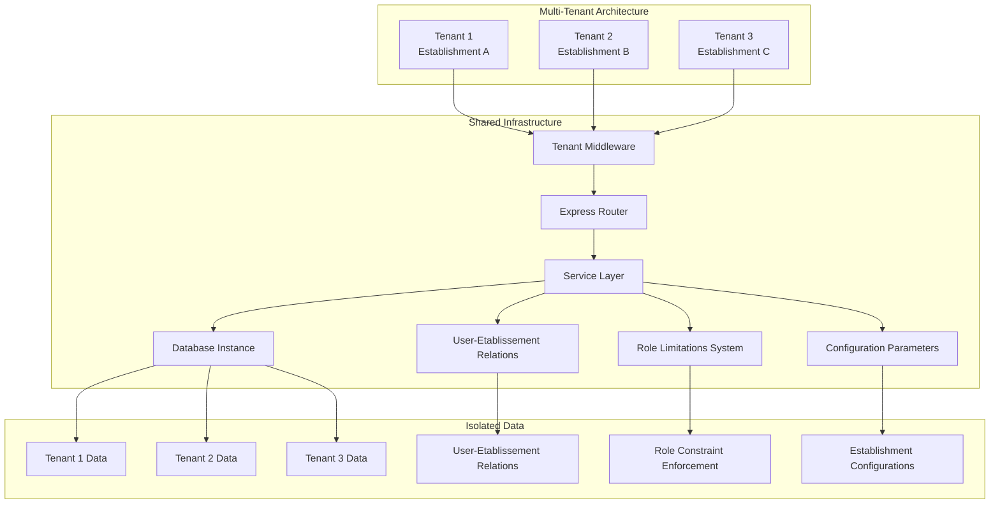

**Diagram sources**
- [tenant.middleware.ts:1-50](file://backend/src/common/middlewares/tenant.middleware.ts#L1-L50)
- [app.ts:176](file://backend/src/app.ts#L176)
- [utilisateur-etablissement.entity.ts:1-80](file://backend/src/modules/auth/entities/utilisateur-etablissement.entity.ts#L1-L80)
- [role-limitation-etablissement.entity.ts:1-63](file://backend/src/modules/auth/entities/role-limitation-etablissement.entity.ts#L1-L63)
- [parametre-systeme.entity.ts:1-80](file://backend/src/modules/configuration/entities/parametre-systeme.entity.ts#L1-L80)

The architecture ensures that each tenant operates independently with its own establishment configuration, user base, and institutional data while sharing common system resources. The multi-établissements capability adds an additional layer of complexity allowing users to have relationships with multiple establishments, while the role limitation system provides dynamic enforcement of multi-establishment constraints. The new configuration parameter system provides comprehensive establishment-level customization with multi-language support, user management controls, and operational settings.

**Section sources**
- [tenant.middleware.ts:1-50](file://backend/src/common/middlewares/tenant.middleware.ts#L1-L50)
- [app.ts:176](file://backend/src/app.ts#L176)
- [utilisateur-etablissement.entity.ts:1-80](file://backend/src/modules/auth/entities/utilisateur-etablissement.entity.ts#L1-L80)
- [role-limitation-etablissement.entity.ts:1-63](file://backend/src/modules/auth/entities/role-limitation-etablissement.entity.ts#L1-L63)
- [parametre-systeme.entity.ts:1-80](file://backend/src/modules/configuration/entities/parametre-systeme.entity.ts#L1-L80)

## Enhanced Multi-Établissements Capability

The enhanced multi-établissements feature enables sophisticated user-establishment relationship management with establishment-specific role assignments and dynamic constraint enforcement:

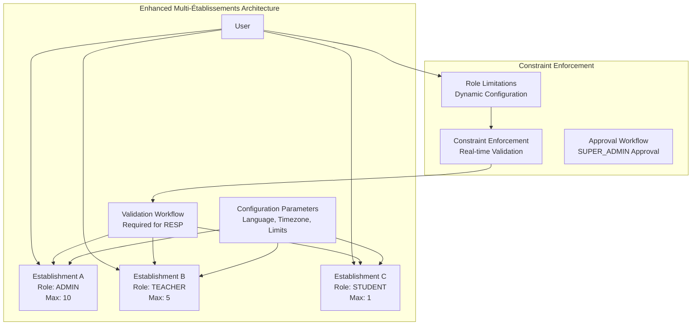

**Diagram sources**
- [utilisateur-etablissement.entity.ts:1-80](file://backend/src/modules/auth/entities/utilisateur-etablissement.entity.ts#L1-L80)
- [utilisateur-etablissement.controller.ts:1-100](file://backend/src/modules/auth/controllers/utilisateur-etablissement.controller.ts#L1-L100)
- [role-limitation-etablissement.entity.ts:1-63](file://backend/src/modules/auth/entities/role-limitation-etablissement.entity.ts#L1-L63)
- [parametre-systeme.entity.ts:1-80](file://backend/src/modules/configuration/entities/parametre-systeme.entity.ts#L1-L80)

### Key Features

- **Dynamic Role-Based Constraints**: Configurable maximum establishments per role with runtime enforcement
- **Establishment-Specific Roles**: Different roles per establishment with validation requirements
- **Independent Permissions**: Each establishment relationship maintains separate permission sets
- **Validation Workflows**: Approval processes for roles requiring validation (RESPONSABLE_CANTINE, RESPONSABLE_TRANSPORT)
- **Change Restriction Controls**: Ability to restrict establishment switching based on role limitations
- **Real-Time Constraint Enforcement**: Dynamic validation during user-establishment relationship creation
- **Multi-Language Support**: Establishment-level language configuration with automatic UI localization
- **User Management Controls**: Configurable user limits per role with approval workflows
- **Timezone Configuration**: Establishment-specific timezone settings for accurate scheduling and reporting
- **Approval Requirements**: Optional approval workflows for new user assignments

**Section sources**
- [utilisateur-etablissement.entity.ts:1-80](file://backend/src/modules/auth/entities/utilisateur-etablissement.entity.ts#L1-L80)
- [utilisateur-etablissement.controller.ts:1-100](file://backend/src/modules/auth/controllers/utilisateur-etablissement.controller.ts#L1-L100)
- [role-limitation-etablissement.entity.ts:1-63](file://backend/src/modules/auth/entities/role-limitation-etablissement.entity.ts#L1-L63)
- [parametre-systeme.entity.ts:1-80](file://backend/src/modules/configuration/entities/parametre-systeme.entity.ts#L1-L80)

## Role Limitation System

The role limitation system provides dynamic, role-based constraints for multi-establishment user relationships with configurable enforcement policies:

```mermaid
graph TB
subgraph "Role Limitation Configuration"
RoleSuperAdmin["SUPER_ADMIN<br/>Max: 999<br/>Change: ✓<br/>Validation: ✗"]
RoleAdmin["ADMIN<br/>Max: 10<br/>Change: ✓<br/>Validation: ✗"]
RoleChef["CHEF_ETABLISSEMENT<br/>Max: 5<br/>Change: ✓<br/>Validation: ✗"]
RoleEnseignant["ENSEIGNANT<br/>Max: 5<br/>Change: ✓<br/>Validation: ✗"]
RolePersonnel["PERSONNEL<br/>Max: 3<br/>Change: ✓<br/>Validation: ✗"]
RoleRespCantine["RESPONSABLE_CANTINE<br/>Max: 2<br/>Change: ✓<br/>Validation: ✓"]
RoleRespTransport["RESPONSABLE_TRANSPORT<br/>Max: 2<br/>Change: ✓<br/>Validation: ✓"]
RoleParent["PARENT<br/>Max: 10<br/>Change: ✓<br/>Validation: ✗"]
RoleEleve["ÉLÈVE<br/>Max: 1<br/>Change: ✗<br/>Validation: ✗"]
end
subgraph "Constraint Enforcement"
Validation["Validation Required"]
Restriction["Establishment Restriction"]
ChangeControl["Change Control"]
ConfigParams["Configuration Parameters<br/>User Limits & Approvals"]
end
RoleRespCantine --> Validation
RoleRespTransport --> Validation
RoleEleve --> Restriction
RoleEleve --> ChangeControl
ConfigParams --> Validation
ConfigParams --> Restriction
```

**Diagram sources**
- [role-limitation-etablissement.entity.ts:24-61](file://backend/src/modules/auth/entities/role-limitation-etablissement.entity.ts#L24-L61)
- [utilisateur-etablissement.service.ts:41-67](file://backend/src/modules/auth/services/utilisateur-etablissement.service.ts#L41-L67)
- [parametre-systeme.entity.ts:1-80](file://backend/src/modules/configuration/entities/parametre-systeme.entity.ts#L1-L80)

### Role Limitation Configuration

The system defines specific constraints for each role:

- **SUPER_ADMIN**: Unlimited establishments (999), can change establishments, no validation required
- **ADMIN**: Up to 10 establishments, can change establishments, no validation required
- **CHEF_ETABLISSEMENT**: Up to 5 establishments, can change establishments, no validation required
- **ENSEIGNANT**: Up to 5 establishments, can change establishments, no validation required
- **PERSONNEL**: Up to 3 establishments, can change establishments, no validation required
- **RESPONSABLE_CANTINE**: Up to 2 establishments, can change establishments, validation required
- **RESPONSABLE_TRANSPORT**: Up to 2 establishments, can change establishments, validation required
- **PARENT**: Up to 10 establishments, can change establishments, no validation required
- **ÉLÈVE**: Exactly 1 establishment, cannot change establishments, no validation required

**Section sources**
- [role-limitation-etablissement.entity.ts:24-61](file://backend/src/modules/auth/entities/role-limitation-etablissement.entity.ts#L24-L61)
- [utilisateur-etablissement.service.ts:41-67](file://backend/src/modules/auth/services/utilisateur-etablissement.service.ts#L41-L67)

## Dynamic Multi-Établissements Constraints

The dynamic constraint enforcement system validates user-establishment relationships in real-time based on role limitations and business rules:

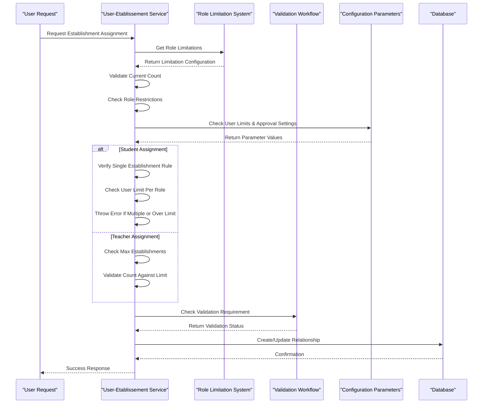

**Diagram sources**
- [utilisateur-etablissement.service.ts:98-132](file://backend/src/modules/auth/services/utilisateur-etablissement.service.ts#L98-L132)
- [role-limitation-etablissement.entity.ts:24-61](file://backend/src/modules/auth/entities/role-limitation-etablissement.entity.ts#L24-L61)
- [parametre-systeme.entity.ts:1-80](file://backend/src/modules/configuration/entities/parametre-systeme.entity.ts#L1-L80)

### Constraint Enforcement Logic

The system enforces constraints through several validation layers:

1. **Role-Based Validation**: Checks if the requested role allows multi-establishment assignments
2. **Count Validation**: Verifies that the user hasn't exceeded the maximum establishments for their role
3. **Student Restriction**: Enforces single-establishment rule for students
4. **User Limit Validation**: Validates against establishment.max_users_per_role configuration
5. **Validation Workflow Trigger**: Initiates approval process for roles requiring validation or when approval is enabled
6. **Change Control**: Prevents establishment switching for roles that restrict changes
7. **Configuration Parameter Enforcement**: Applies establishment-level configuration rules and limits

**Section sources**
- [utilisateur-etablissement.service.ts:98-132](file://backend/src/modules/auth/services/utilisateur-etablissement.service.ts#L98-L132)
- [role-limitation-etablissement.entity.ts:24-61](file://backend/src/modules/auth/entities/role-limitation-etablissement.entity.ts#L24-L61)
- [parametre-systeme.entity.ts:1-80](file://backend/src/modules/configuration/entities/parametre-systeme.entity.ts#L1-L80)

## Establishment Configuration Parameters

**New** The establishment configuration system now provides comprehensive parameter management for institutional customization and operational control:

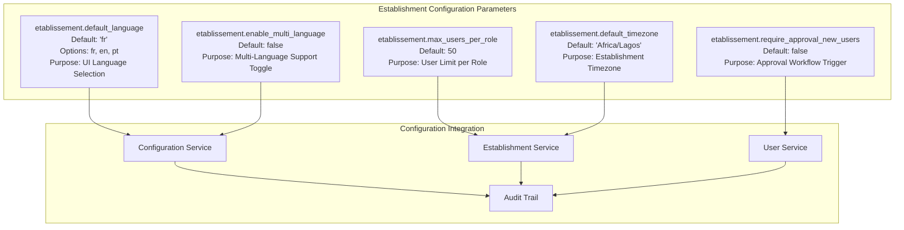

**Diagram sources**
- [005-complete-config-params-100.ts:208-275](file://backend/src/database/migrations/005-complete-config-params-100.ts#L208-L275)
- [parametre-systeme.entity.ts:1-80](file://backend/src/modules/configuration/entities/parametre-systeme.entity.ts#L1-L80)

### Configuration Parameter Details

#### etablissement.default_language
- **Type**: string
- **Default Value**: 'fr'
- **Available Options**: 'fr' (French), 'en' (English), 'pt' (Portuguese)
- **Purpose**: Sets the default language for establishment UI and communications
- **Scope**: Establishment-level configuration affecting all users within the establishment
- **Validation**: Must be one of the predefined language options

#### etablissement.max_users_per_role
- **Type**: number
- **Default Value**: 50
- **Purpose**: Maximum number of users allowed per role within the establishment
- **Scope**: Establishment-level user management limit
- **Validation**: Must be a positive integer
- **Business Logic**: Used in conjunction with role limitation system for comprehensive user control

#### etablissement.require_approval_new_users
- **Type**: boolean
- **Default Value**: false
- **Purpose**: Enables approval workflow for new user assignments to the establishment
- **Scope**: Establishment-level user assignment control
- **Business Logic**: When true, triggers validation workflow for user-establishment relationships

#### etablissement.default_timezone
- **Type**: string
- **Default Value**: 'Africa/Lagos'
- **Purpose**: Sets the default timezone for establishment operations and scheduling
- **Scope**: Establishment-level temporal configuration
- **Validation**: Must be a valid IANA timezone identifier
- **Usage**: Affects timestamp generation, schedule calculations, and report generation

#### etablissement.enable_multi_language
- **Type**: boolean
- **Default Value**: false
- **Purpose**: Enables or disables multi-language support for the establishment
- **Scope**: Establishment-level language feature toggle
- **Business Logic**: When true, allows users to select from available languages; when false, uses default language only

**Section sources**
- [005-complete-config-params-100.ts:208-275](file://backend/src/database/migrations/005-complete-config-params-100.ts#L208-L275)
- [parametre-systeme.entity.ts:1-80](file://backend/src/modules/configuration/entities/parametre-systeme.entity.ts#L1-L80)

## Project Structure

The Establishment Management module maintains its clean architecture pattern while adapting to multi-tenant requirements and adding enhanced role limitation support:

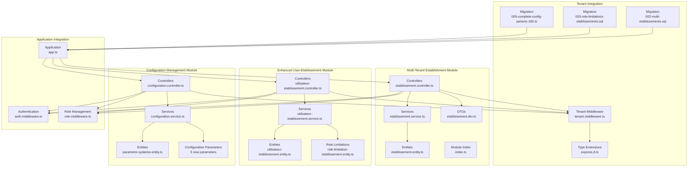

**Diagram sources**
- [etablissement.controller.ts:1-44](file://backend/src/modules/etablissement/controllers/etablissement.controller.ts#L1-L44)
- [etablissement.service.ts:1-60](file://backend/src/modules/etablissement/services/etablissement.service.ts#L1-L60)
- [etablissement.entity.ts:1-93](file://backend/src/modules/etablissement/entities/etablissement.entity.ts#L1-L93)
- [utilisateur-etablissement.controller.ts:1-100](file://backend/src/modules/auth/controllers/utilisateur-etablissement.controller.ts#L1-L100)
- [utilisateur-etablissement.service.ts:1-80](file://backend/src/modules/auth/services/utilisateur-etablissement.service.ts#L1-L80)
- [utilisateur-etablissement.entity.ts:1-80](file://backend/src/modules/auth/entities/utilisateur-etablissement.entity.ts#L1-L80)
- [role-limitation-etablissement.entity.ts:1-63](file://backend/src/modules/auth/entities/role-limitation-etablissement.entity.ts#L1-L63)
- [parametre-systeme.entity.ts:1-80](file://backend/src/modules/configuration/entities/parametre-systeme.entity.ts#L1-L80)
- [tenant.middleware.ts:1-50](file://backend/src/common/middlewares/tenant.middleware.ts#L1-L50)
- [express.d.ts:1-50](file://backend/src/common/types/express.d.ts#L1-L50)
- [002-multi-etablissements.sql:1-150](file://backend/src/database/migrations/002-multi-etablissements.sql#L1-L150)
- [003-role-limitations-etablissements.sql:1-75](file://backend/src/database/migrations/003-role-limitations-etablissements.sql#L1-L75)
- [005-complete-config-params-100.ts:208-275](file://backend/src/database/migrations/005-complete-config-params-100.ts#L208-L275)
- [app.ts:176](file://backend/src/app.ts#L176)

**Section sources**
- [etablissement.controller.ts:1-44](file://backend/src/modules/etablissement/controllers/etablissement.controller.ts#L1-L44)
- [etablissement.service.ts:1-60](file://backend/src/modules/etablissement/services/etablissement.service.ts#L1-L60)
- [etablissement.entity.ts:1-93](file://backend/src/modules/etablissement/entities/etablissement.entity.ts#L1-L93)
- [utilisateur-etablissement.controller.ts:1-100](file://backend/src/modules/auth/controllers/utilisateur-etablissement.controller.ts#L1-L100)
- [utilisateur-etablissement.service.ts:1-80](file://backend/src/modules/auth/services/utilisateur-etablissement.service.ts#L1-L80)
- [utilisateur-etablissement.entity.ts:1-80](file://backend/src/modules/auth/entities/utilisateur-etablissement.entity.ts#L1-L80)
- [role-limitation-etablissement.entity.ts:1-63](file://backend/src/modules/auth/entities/role-limitation-etablissement.entity.ts#L1-L63)
- [parametre-systeme.entity.ts:1-80](file://backend/src/modules/configuration/entities/parametre-systeme.entity.ts#L1-L80)
- [tenant.middleware.ts:1-50](file://backend/src/common/middlewares/tenant.middleware.ts#L1-L50)
- [express.d.ts:1-50](file://backend/src/common/types/express.d.ts#L1-L50)
- [002-multi-etablissements.sql:1-150](file://backend/src/database/migrations/002-multi-etablissements.sql#L1-L150)
- [003-role-limitations-etablissements.sql:1-75](file://backend/src/database/migrations/003-role-limitations-etablissements.sql#L1-L75)
- [005-complete-config-params-100.ts:208-275](file://backend/src/database/migrations/005-complete-config-params-100.ts#L208-L275)
- [app.ts:176](file://backend/src/app.ts#L176)

## Core Components

### Enhanced Establishment Entity Model

The establishment entity model now supports multi-tenant operations with comprehensive institutional configuration and new configuration parameter integration:

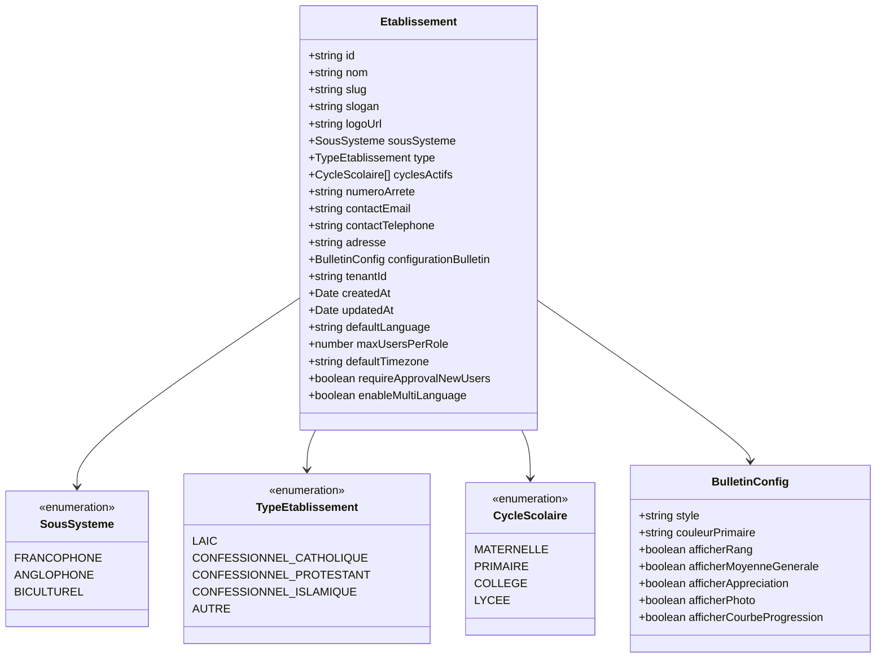

**Updated** Added five new configuration parameter fields: defaultLanguage, maxUsersPerRole, defaultTimezone, requireApprovalNewUsers, and enableMultiLanguage

**Diagram sources**
- [etablissement.entity.ts:17-36](file://backend/src/modules/etablissement/entities/etablissement.entity.ts#L17-L36)
- [etablissement.entity.ts:42-92](file://backend/src/modules/etablissement/entities/etablissement.entity.ts#L42-L92)

### Enhanced User-Etablissement Relationship Entity

The new user-establishment relationship entity manages complex multi-establishment associations with enhanced validation support:

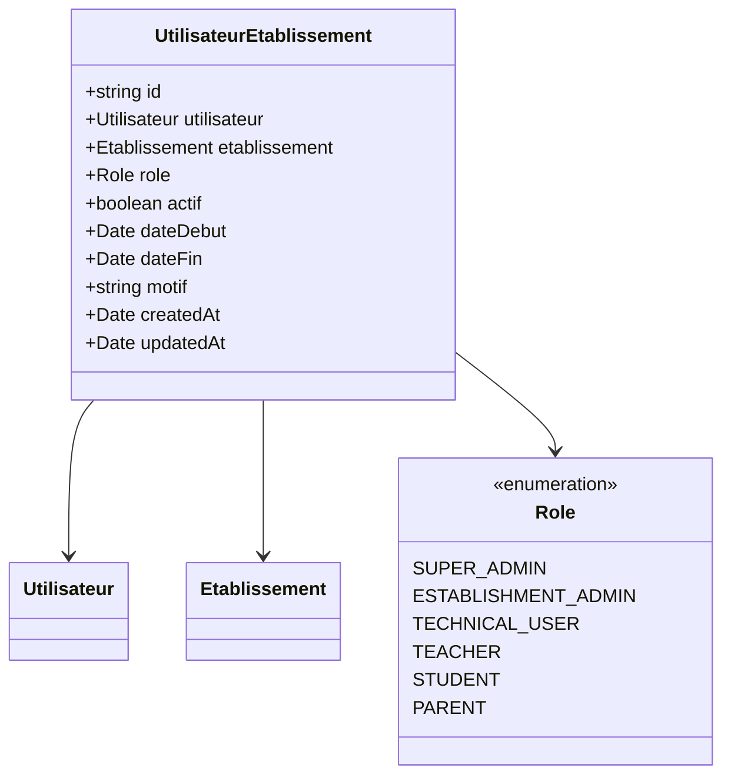

**Updated** Added activation status, dates, and motivation fields for enhanced relationship management

**Diagram sources**
- [utilisateur-etablissement.entity.ts:1-80](file://backend/src/modules/auth/entities/utilisateur-etablissement.entity.ts#L1-L80)

### Role Limitation Configuration Entity

The new role limitation entity provides dynamic configuration of multi-establishment constraints:

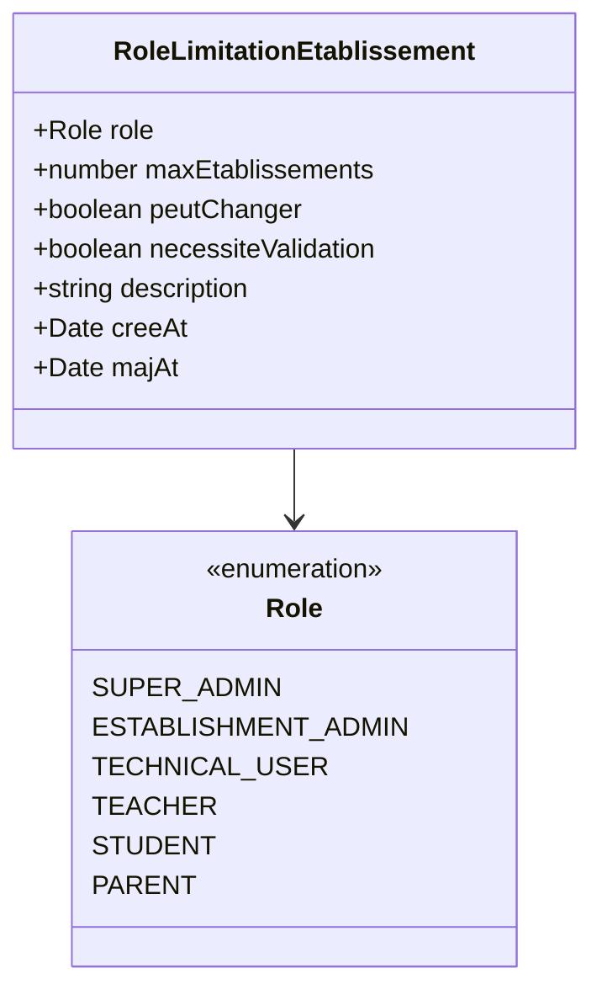

**New** Dynamic role limitation configuration system

**Diagram sources**
- [role-limitation-etablissement.entity.ts:1-63](file://backend/src/modules/auth/entities/role-limitation-etablissement.entity.ts#L1-L63)

### Enhanced Establishment Service Operations

The establishment service now provides tenant-aware CRUD operations with comprehensive validation and business logic including role limitation enforcement and configuration parameter integration:

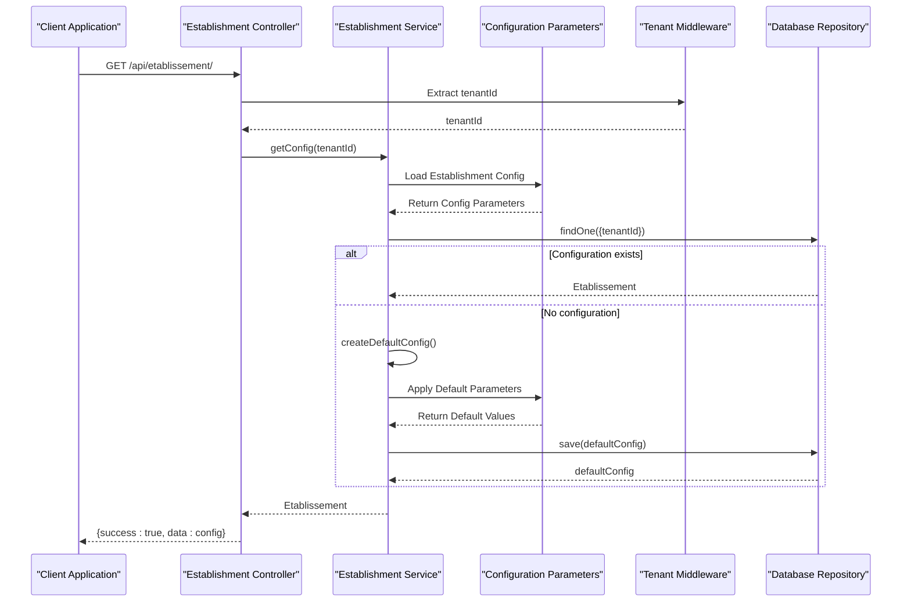

**Updated** Added tenant-aware routing and isolation with role limitation integration and configuration parameter application

**Diagram sources**
- [etablissement.controller.ts:26-40](file://backend/src/modules/etablissement/controllers/etablissement.controller.ts#L26-L40)
- [etablissement.service.ts:24-56](file://backend/src/modules/etablissement/services/etablissement.service.ts#L24-L56)
- [parametre-systeme.entity.ts:1-80](file://backend/src/modules/configuration/entities/parametre-systeme.entity.ts#L1-L80)
- [tenant.middleware.ts:1-50](file://backend/src/common/middlewares/tenant.middleware.ts#L1-L50)

**Section sources**
- [etablissement.service.ts:24-56](file://backend/src/modules/etablissement/services/etablissement.service.ts#L24-L56)
- [etablissement.controller.ts:26-40](file://backend/src/modules/etablissement/controllers/etablissement.controller.ts#L26-L40)
- [tenant.middleware.ts:1-50](file://backend/src/common/middlewares/tenant.middleware.ts#L1-L50)
- [utilisateur-etablissement.entity.ts:1-80](file://backend/src/modules/auth/entities/utilisateur-etablissement.entity.ts#L1-L80)
- [role-limitation-etablissement.entity.ts:1-63](file://backend/src/modules/auth/entities/role-limitation-etablissement.entity.ts#L1-L63)
- [parametre-systeme.entity.ts:1-80](file://backend/src/modules/configuration/entities/parametre-systeme.entity.ts#L1-L80)

## Tenant-Aware Routing System

The tenant middleware provides automatic tenant identification and routing for multi-establishment operations with enhanced role limitation support:

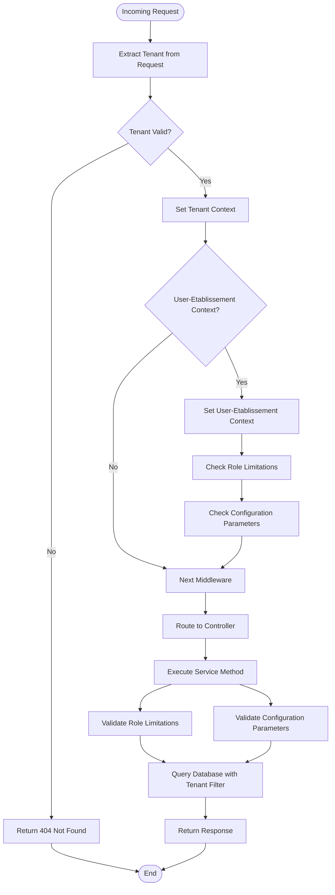

**Diagram sources**
- [tenant.middleware.ts:1-50](file://backend/src/common/middlewares/tenant.middleware.ts#L1-L50)
- [express.d.ts:1-50](file://backend/src/common/types/express.d.ts#L1-L50)

The middleware automatically extracts tenant information from request headers, URL parameters, or subdomain routing and applies appropriate data filtering. It also handles user-establishment context switching for multi-établissements scenarios and integrates with the role limitation system for constraint enforcement. The system now also processes establishment configuration parameters for comprehensive institutional customization.

**Section sources**
- [tenant.middleware.ts:1-50](file://backend/src/common/middlewares/tenant.middleware.ts#L1-L50)
- [express.d.ts:1-50](file://backend/src/common/types/express.d.ts#L1-L50)

## Establishment CRUD Operations

The establishment module now supports comprehensive CRUD operations with tenant isolation and enhanced role limitation integration:

### Create Establishment

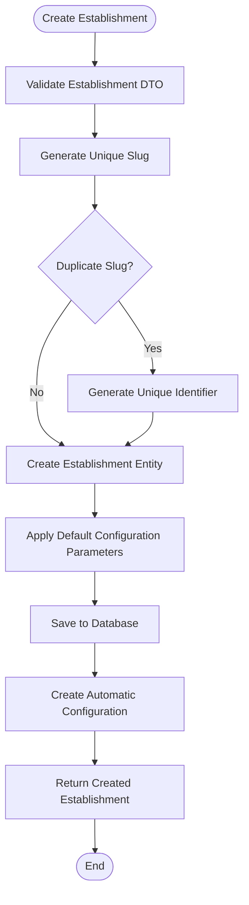

**Diagram sources**
- [etablissement.controller.ts:26-40](file://backend/src/modules/etablissement/controllers/etablissement.controller.ts#L26-L40)
- [etablissement.service.ts:24-56](file://backend/src/modules/etablissement/services/etablissement.service.ts#L24-L56)
- [parametre-systeme.entity.ts:1-80](file://backend/src/modules/configuration/entities/parametre-systeme.entity.ts#L1-L80)

### Read Establishment

The system supports both individual establishment retrieval and establishment listing with tenant filtering and role limitation awareness.

### Update Establishment

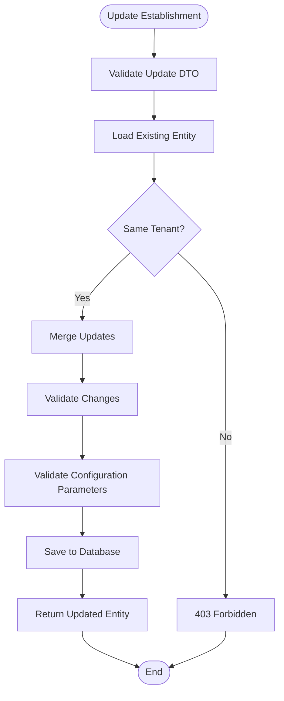

**Diagram sources**
- [etablissement.controller.ts:34-40](file://backend/src/modules/etablissement/controllers/etablissement.controller.ts#L34-L40)
- [etablissement.service.ts:39-56](file://backend/src/modules/etablissement/services/etablissement.service.ts#L39-L56)
- [parametre-systeme.entity.ts:1-80](file://backend/src/modules/configuration/entities/parametre-systeme.entity.ts#L1-L80)

### Delete Establishment

The delete operation includes cascade deletion of associated configurations and data with proper tenant validation and role limitation considerations.

**Section sources**
- [etablissement.controller.ts:26-40](file://backend/src/modules/etablissement/controllers/etablissement.controller.ts#L26-L40)
- [etablissement.service.ts:39-56](file://backend/src/modules/etablissement/services/etablissement.service.ts#L39-L56)
- [parametre-systeme.entity.ts:1-80](file://backend/src/modules/configuration/entities/parametre-systeme.entity.ts#L1-L80)

## User-Etablissement Relationship Management

The enhanced user-establishment relationship management system provides sophisticated multi-establishment support with dynamic role limitation enforcement and configuration parameter integration:

### User-Etablissement Association Operations

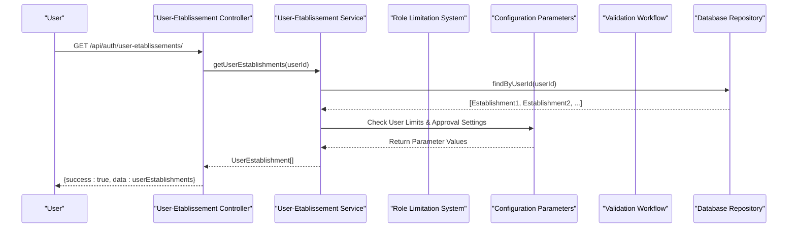

**Updated** Added role limitation validation, configuration parameter checking, and dynamic constraint enforcement

**Diagram sources**
- [utilisateur-etablissement.controller.ts:1-100](file://backend/src/modules/auth/controllers/utilisateur-etablissement.controller.ts#L1-L100)
- [utilisateur-etablissement.service.ts:1-80](file://backend/src/modules/auth/services/utilisateur-etablissement.service.ts#L1-L80)
- [parametre-systeme.entity.ts:1-80](file://backend/src/modules/configuration/entities/parametre-systeme.entity.ts#L1-L80)

### Enhanced Establishment Role Assignment

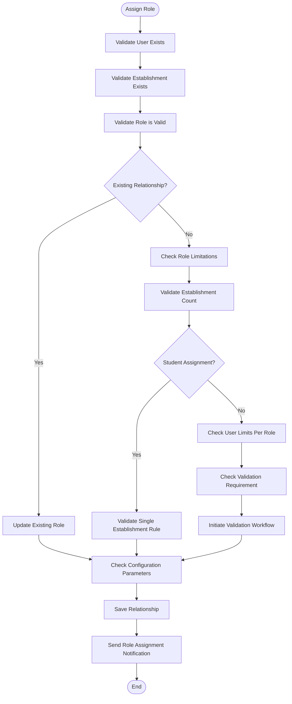

**Updated** Added comprehensive role limitation validation, configuration parameter checking, user limit validation, and approval workflow integration

**Diagram sources**
- [utilisateur-etablissement.controller.ts:1-100](file://backend/src/modules/auth/controllers/utilisateur-etablissement.controller.ts#L1-L100)
- [utilisateur-etablissement.service.ts:1-80](file://backend/src/modules/auth/services/utilisateur-etablissement.service.ts#L1-L80)
- [role-limitation-etablissement.entity.ts:1-63](file://backend/src/modules/auth/entities/role-limitation-etablissement.entity.ts#L1-L63)
- [parametre-systeme.entity.ts:1-80](file://backend/src/modules/configuration/entities/parametre-systeme.entity.ts#L1-L80)

**Section sources**
- [utilisateur-etablissement.controller.ts:1-100](file://backend/src/modules/auth/controllers/utilisateur-etablissement.controller.ts#L1-L100)
- [utilisateur-etablissement.service.ts:1-80](file://backend/src/modules/auth/services/utilisateur-etablissement.service.ts#L1-L80)
- [utilisateur-etablissement.entity.ts:1-80](file://backend/src/modules/auth/entities/utilisateur-etablissement.entity.ts#L1-L80)
- [role-limitation-etablissement.entity.ts:1-63](file://backend/src/modules/auth/entities/role-limitation-etablissement.entity.ts#L1-L63)
- [parametre-systeme.entity.ts:1-80](file://backend/src/modules/configuration/entities/parametre-systeme.entity.ts#L1-L80)

## Business Logic and Data Isolation

The establishment service implements comprehensive business logic with strict tenant isolation and enhanced role limitation enforcement:

### Tenant Isolation Strategy

```mermaid
stateDiagram-v2
[*] --> ValidateTenant
ValidateTenant --> CheckAccess{"User Has Access?"}
CheckAccess --> |Yes| ApplyFilter["Apply Tenant Filter"]
CheckAccess --> |No| DenyAccess["Deny Access"]
ApplyFilter --> CheckMultiEtab{"Multi-Etablissement?"}
CheckMultiEtab --> |Yes| ValidateUserEtab["Validate User-Etablissement Context"]
CheckMultiEtab --> |No| ExecuteOperation["Execute Database Operation"]
ValidateUserEtab --> CheckRoleLimitations["Check Role Limitations"]
CheckRoleLimitations --> CheckConfigParams["Check Configuration Parameters"]
CheckConfigParams --> ValidateConstraints["Validate Multi-Etablissement Constraints"]
ValidateConstraints --> ExecuteOperation
ExecuteOperation --> CheckResult{"Operation Success?"}
CheckResult --> |Yes| ReturnData["Return Tenant-Specific Data"]
CheckResult --> |No| HandleError["Handle Error"]
ReturnData --> [*]
HandleError --> [*]
DenyAccess --> [*]
```

**Updated** Added role limitation validation, configuration parameter checking, and constraint enforcement

**Diagram sources**
- [etablissement.service.ts:24-56](file://backend/src/modules/etablissement/services/etablissement.service.ts#L24-L56)
- [tenant.middleware.ts:1-50](file://backend/src/common/middlewares/tenant.middleware.ts#L1-L50)
- [utilisateur-etablissement.service.ts:1-80](file://backend/src/modules/auth/services/utilisateur-etablissement.service.ts#L1-L80)
- [role-limitation-etablissement.entity.ts:1-63](file://backend/src/modules/auth/entities/role-limitation-etablissement.entity.ts#L1-L63)
- [parametre-systeme.entity.ts:1-80](file://backend/src/modules/configuration/entities/parametre-systeme.entity.ts#L1-L80)

### Automatic Configuration Management

Each establishment automatically receives default configurations upon creation, ensuring consistent institutional setup across all tenants with role limitation awareness and comprehensive parameter application.

### Enhanced Data Validation and Sanitization

Comprehensive validation ensures data integrity while maintaining tenant-specific customizations and enforcing role-based multi-establishment constraints with configuration parameter validation.

**Section sources**
- [etablissement.service.ts:24-56](file://backend/src/modules/etablissement/services/etablissement.service.ts#L24-L56)
- [tenant.middleware.ts:1-50](file://backend/src/common/middlewares/tenant.middleware.ts#L1-L50)
- [utilisateur-etablissement.service.ts:1-80](file://backend/src/modules/auth/services/utilisateur-etablissement.service.ts#L1-L80)
- [role-limitation-etablissement.entity.ts:1-63](file://backend/src/modules/auth/entities/role-limitation-etablissement.entity.ts#L1-L63)
- [parametre-systeme.entity.ts:1-80](file://backend/src/modules/configuration/entities/parametre-systeme.entity.ts#L1-L80)

## Security and Access Control

The multi-tenant establishment management implements robust security measures with enhanced multi-établissements support and dynamic role limitation enforcement:

### Tenant-Aware Authentication

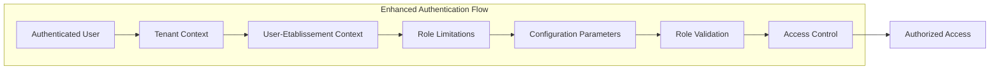

**Updated** Added role limitation validation, configuration parameter checking, and constraint enforcement

**Diagram sources**
- [auth.middleware.ts:30-60](file://backend/src/modules/auth/middlewares/auth.middleware.ts#L30-L60)
- [role.middleware.ts:20-50](file://backend/src/modules/auth/middlewares/role.middleware.ts#L20-L50)
- [role-limitation-etablissement.entity.ts:1-63](file://backend/src/modules/auth/entities/role-limitation-etablissement.entity.ts#L1-L63)
- [parametre-systeme.entity.ts:1-80](file://backend/src/modules/configuration/entities/parametre-systeme.entity.ts#L1-L80)

### Enhanced Role-Based Access Control

- **SUPER_ADMIN**: Full access to all establishments and users with unlimited multi-establishment capability
- **ESTABLISHMENT_ADMIN**: Access only to assigned establishment with full administrative privileges and up to 10 establishment assignments
- **TECHNICAL_USER**: Limited access based on establishment permissions with up to 3 establishment assignments
- **Multi-Établissements Roles**: Different role limitations per establishment with validation requirements for specific roles
- **Dynamic Constraint Enforcement**: Real-time validation of multi-establishment assignments based on role configurations and establishment parameters
- **Configuration Parameter Enforcement**: Role-based enforcement of establishment-level configuration settings

### Enhanced Data Protection Measures

- Automatic tenant filtering on all database queries
- Secure establishment switching between users with proper validation and role limitation checks
- Comprehensive audit logging for all establishment operations including role limitation violations and configuration parameter changes
- User-establishment relationship validation and authorization with dynamic constraint enforcement and configuration parameter validation
- Validation workflow integration for roles requiring SUPER_ADMIN approval
- Establishment configuration parameter security with proper validation and sanitization

**Section sources**
- [auth.middleware.ts:30-60](file://backend/src/modules/auth/middlewares/auth.middleware.ts#L30-L60)
- [role.middleware.ts:20-50](file://backend/src/modules/auth/middlewares/role.middleware.ts#L20-L50)
- [roles.enum.ts:1-50](file://shared/src/enums/roles.enum.ts#L1-L50)
- [utilisateur-etablissement.entity.ts:1-80](file://backend/src/modules/auth/entities/utilisateur-etablissement.entity.ts#L1-L80)
- [role-limitation-etablissement.entity.ts:1-63](file://backend/src/modules/auth/entities/role-limitation-etablissement.entity.ts#L1-L63)
- [parametre-systeme.entity.ts:1-80](file://backend/src/modules/configuration/entities/parametre-systeme.entity.ts#L1-L80)

## API Endpoints and Usage

### Establishment Management Endpoints

The establishment module provides RESTful endpoints with tenant-aware routing:

#### GET /api/etablissement/ - Retrieve Establishment Configuration

**Updated** Now returns tenant-specific establishment configuration with role limitation awareness and configuration parameter details

#### POST /api/etablissement/ - Create New Establishment

**New** Endpoint for creating establishments with automatic tenant assignment and default configuration parameter application

#### PUT /api/etablissement/:id - Update Establishment

**Enhanced** Now includes tenant validation, isolation, role limitation considerations, and configuration parameter validation

#### DELETE /api/etablissement/:id - Delete Establishment

**New** Endpoint for establishment deletion with cascade operations, role limitation validation, and configuration parameter cleanup

### Enhanced User-Etablissement Management Endpoints

**Updated** Multi-établissements specific endpoints with role limitation enforcement and configuration parameter integration:

#### GET /api/auth/user-etablissements/ - Get User's Establishment Associations

**Updated** Now includes role limitation validation, constraint information, and configuration parameter details

#### POST /api/auth/user-etablissements/ - Assign User to Establishment

**Updated** Enhanced with comprehensive role limitation validation, configuration parameter checking, user limit validation, and approval workflow initiation

#### PUT /api/auth/user-etablissements/:id - Update User-Etablissement Role

**Updated** Includes role limitation enforcement, constraint validation, and configuration parameter compliance checks

#### DELETE /api/auth/user-etablissements/:id - Remove User from Establishment

**New** Endpoint for removing user associations with establishments, role limitation updates, and configuration parameter adjustments

### Role Limitation Management Endpoints

**New** Dedicated endpoints for managing role limitation configurations:

#### GET /api/auth/role-limitations/ - Get All Role Limitations

**New** Endpoint for retrieving all role limitation configurations with establishment parameter integration

#### GET /api/auth/role-limitations/:role - Get Role Limitation

**New** Endpoint for retrieving specific role limitation configuration with establishment context

#### PUT /api/auth/role-limitations/:role - Update Role Limitation

**New** Endpoint for updating role limitation configurations with SUPER_ADMIN authorization and establishment parameter validation

### Configuration Parameter Management Endpoints

**New** Dedicated endpoints for managing establishment configuration parameters:

#### GET /api/configuration/establishment-params/ - Get Establishment Configuration Parameters

**New** Endpoint for retrieving all establishment configuration parameters with tenant context

#### GET /api/configuration/establishment-params/:key - Get Configuration Parameter

**New** Endpoint for retrieving specific establishment configuration parameter with validation

#### PUT /api/configuration/establishment-params/:key - Update Configuration Parameter

**New** Endpoint for updating establishment configuration parameters with SUPER_ADMIN authorization and parameter validation

### Request and Response Examples

**Request Body (Create Establishment)**
```json
{
  "nom": "École Primaire de Paris",
  "slug": "ecole-primaire-paris",
  "sousSysteme": "FRANCOPHONE",
  "type": "LAIC",
  "contactEmail": "info@ecole-paris.fr",
  "adresse": "123 Rue de Paris, 75000 Paris",
  "defaultLanguage": "fr",
  "maxUsersPerRole": 50,
  "defaultTimezone": "Africa/Lagos",
  "requireApprovalNewUsers": false,
  "enableMultiLanguage": false
}
```

**Response (Establishment Configuration)**
```json
{
  "success": true,
  "data": {
    "id": "establishment-uuid",
    "nom": "École Primaire de Paris",
    "slug": "ecole-primaire-paris",
    "tenantId": "tenant-uuid",
    "configurationBulletin": {
      "style": "classique",
      "afficherRang": true,
      "afficherMoyenneGenerale": true
    },
    "defaultLanguage": "fr",
    "maxUsersPerRole": 50,
    "defaultTimezone": "Africa/Lagos",
    "requireApprovalNewUsers": false,
    "enableMultiLanguage": false,
    "createdAt": "2024-01-15T10:30:00Z",
    "updatedAt": "2024-01-15T10:30:00Z"
  }
}
```

**Request Body (User-Etablissement Assignment)**
```json
{
  "userId": "user-uuid",
  "establishmentId": "establishment-uuid",
  "roleId": "ESTABLISHMENT_ADMIN"
}
```

**Response (User-Etablissement Association)**
```json
{
  "success": true,
  "data": {
    "id": "user-etablissement-uuid",
    "userId": "user-uuid",
    "establishmentId": "establishment-uuid",
    "roleId": "ESTABLISHMENT_ADMIN",
    "actif": true,
    "dateDebut": "2024-01-15T10:30:00Z",
    "motif": "Assignment for administrative duties",
    "establishment": {
      "id": "establishment-uuid",
      "nom": "École Primaire de Paris",
      "slug": "ecole-primaire-paris",
      "defaultLanguage": "fr",
      "maxUsersPerRole": 50,
      "defaultTimezone": "Africa/Lagos"
    },
    "role": {
      "id": "ESTABLISHMENT_ADMIN",
      "libelle": "Establishment Administrator"
    }
  }
}
```

**Response (Configuration Parameter)**
```json
{
  "success": true,
  "data": {
    "cle": "etablissement.default_language",
    "valeur": "fr",
    "typeValeur": "string",
    "categorie": "etablissement",
    "description": "Langue par défaut de l'établissement",
    "options": [
      {"valeur": "fr", "label": "Français"},
      {"valeur": "en", "label": "English"},
      {"valeur": "pt", "label": "Português"}
    ]
  }
}
```

**Section sources**
- [etablissement.controller.ts:26-40](file://backend/src/modules/etablissement/controllers/etablissement.controller.ts#L26-L40)
- [utilisateur-etablissement.controller.ts:1-100](file://backend/src/modules/auth/controllers/utilisateur-etablissement.controller.ts#L1-L100)
- [role-limitation-etablissement.entity.ts:1-63](file://backend/src/modules/auth/entities/role-limitation-etablissement.entity.ts#L1-L63)
- [parametre-systeme.entity.ts:1-80](file://backend/src/modules/configuration/entities/parametre-systeme.entity.ts#L1-L80)

## Integration Patterns

### Cross-Module Integration

The establishment module integrates seamlessly with other system modules including the enhanced role limitation system and comprehensive configuration parameter management:

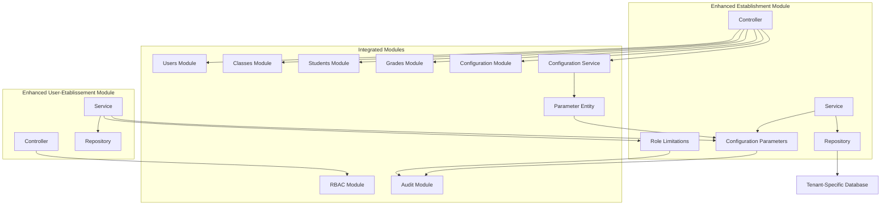

**Updated** Added configuration parameter integration, enhanced audit capabilities, and comprehensive parameter management system

**Diagram sources**
- [etablissement.controller.ts:1-44](file://backend/src/modules/etablissement/controllers/etablissement.controller.ts#L1-L44)
- [etablissement.service.ts:1-60](file://backend/src/modules/etablissement/services/etablissement.service.ts#L1-L60)
- [utilisateur-etablissement.controller.ts:1-100](file://backend/src/modules/auth/controllers/utilisateur-etablissement.controller.ts#L1-L100)
- [utilisateur-etablissement.service.ts:1-80](file://backend/src/modules/auth/services/utilisateur-etablissement.service.ts#L1-L80)
- [role-limitation-etablissement.entity.ts:1-63](file://backend/src/modules/auth/entities/role-limitation-etablissement.entity.ts#L1-L63)
- [parametre-systeme.entity.ts:1-80](file://backend/src/modules/configuration/entities/parametre-systeme.entity.ts#L1-L80)

### Enhanced Data Synchronization Patterns

- Automatic establishment configuration propagation with role limitation awareness and parameter validation
- Tenant-aware data synchronization between modules with constraint validation and configuration parameter updates
- Real-time establishment context updates with role limitation enforcement and parameter compliance checks
- User-establishment relationship synchronization across modules with dynamic constraints and configuration parameter validation
- Role limitation configuration synchronization for consistent constraint enforcement and parameter application
- Configuration parameter synchronization for consistent establishment-level settings and user management controls

**Section sources**
- [etablissement.controller.ts:1-44](file://backend/src/modules/etablissement/controllers/etablissement.controller.ts#L1-L44)
- [etablissement.service.ts:1-60](file://backend/src/modules/etablissement/services/etablissement.service.ts#L1-L60)
- [utilisateur-etablissement.controller.ts:1-100](file://backend/src/modules/auth/controllers/utilisateur-etablissement.controller.ts#L1-L100)
- [utilisateur-etablissement.service.ts:1-80](file://backend/src/modules/auth/services/utilisateur-etablissement.service.ts#L1-L80)
- [role-limitation-etablissement.entity.ts:1-63](file://backend/src/modules/auth/entities/role-limitation-etablissement.entity.ts#L1-L63)
- [parametre-systeme.entity.ts:1-80](file://backend/src/modules/configuration/entities/parametre-systeme.entity.ts#L1-L80)

## Performance Considerations

### Multi-Tenant Performance Optimization

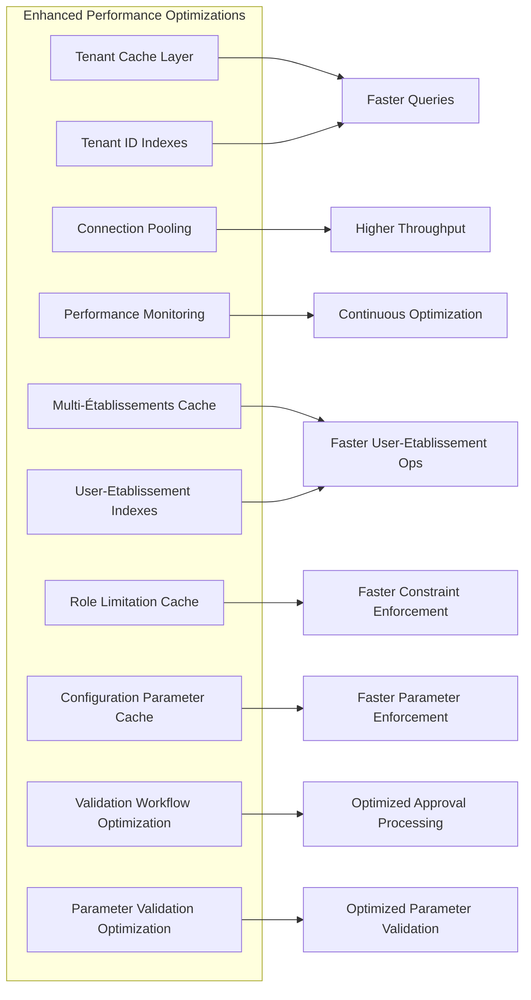

**Updated** Added configuration parameter caching, parameter validation optimization, and enhanced audit capabilities

**Diagram sources**
- [etablissement.service.ts:24-56](file://backend/src/modules/etablissement/services/etablissement.service.ts#L24-L56)
- [tenant.middleware.ts:1-50](file://backend/src/common/middlewares/tenant.middleware.ts#L1-L50)
- [utilisateur-etablissement.service.ts:1-80](file://backend/src/modules/auth/services/utilisateur-etablissement.service.ts#L1-L80)
- [role-limitation-etablissement.entity.ts:1-63](file://backend/src/modules/auth/entities/role-limitation-etablissement.entity.ts#L1-L63)
- [parametre-systeme.entity.ts:1-80](file://backend/src/modules/configuration/entities/parametre-systeme.entity.ts#L1-L80)

### Enhanced Scalability Features

- **Horizontal Scaling**: Support for multiple tenant instances with role limitation caching and configuration parameter management
- **Database Partitioning**: Tenant-specific database partitioning with role limitation tables and configuration parameter storage
- **Enhanced Caching Strategy**: Tenant-aware caching with role limitation configuration caching and establishment parameter caching for improved performance
- **Connection Management**: Optimized database connection pooling with constraint enforcement caching and parameter validation caching
- **Multi-Établissements Caching**: Specialized caching for user-establishment relationships, role limitation validation, and configuration parameter enforcement
- **Validation Workflow Optimization**: Optimized approval processing for roles requiring validation and parameter validation workflows
- **Configuration Parameter Caching**: Dedicated caching for establishment configuration parameters to reduce database queries and improve response times

### Enhanced Resource Management

- Automatic resource cleanup for deleted establishments with role limitation updates and configuration parameter cleanup
- Efficient memory management for tenant contexts with role limitation caching and configuration parameter caching
- Optimized query patterns for multi-tenant operations with constraint enforcement and parameter validation
- User-establishment relationship optimization with role limitation validation and configuration parameter compliance
- Role limitation configuration caching for reduced database queries and faster constraint enforcement
- Configuration parameter caching for reduced database queries and faster establishment-level setting application
- Parameter validation optimization for faster establishment configuration updates and enforcement

## Troubleshooting Guide

### Multi-Tenant Specific Issues

#### Tenant Context Errors
- **Issue**: Establishments not loading correctly
- **Cause**: Incorrect tenant context in request
- **Solution**: Verify tenant header or parameter in request

#### Data Isolation Problems
- **Issue**: Data from one establishment appearing in another
- **Cause**: Missing tenant filtering in queries
- **Solution**: Check tenant middleware implementation

#### Authentication Issues
- **Issue**: 403 Forbidden when accessing establishment data
- **Cause**: User lacks proper tenant permissions
- **Solution**: Verify user role and establishment assignment

### Enhanced Role Limitation Issues

#### Role Limitation Violations
- **Issue**: User cannot be assigned to establishment despite having valid role
- **Cause**: Role limitation maximum establishments reached
- **Solution**: Check role limitation configuration and current establishment assignments

#### Validation Workflow Issues
- **Issue**: User assignment requires approval but workflow not initiated
- **Cause**: Role requiring validation not properly configured or approval requirement not met
- **Solution**: Verify role limitation configuration for validation requirement and check establishment parameter settings

#### Student Assignment Errors
- **Issue**: Students cannot be assigned to multiple establishments
- **Cause**: Student restriction rule violation
- **Solution**: Verify student role limitation configuration

#### Establishment Change Restrictions
- **Issue**: User cannot switch between establishments
- **Cause**: Role limitation prevents establishment changes
- **Solution**: Check role limitation configuration for change allowance

#### Constraint Enforcement Failures
- **Issue**: Role limitation validation failing unexpectedly
- **Cause**: Role limitation cache issues or database inconsistencies
- **Solution**: Clear role limitation cache and verify database configuration

#### Performance Degradation
- **Issue**: Slow response times in multi-tenant environment with role limitations
- **Cause**: Inefficient role limitation queries or missing indexes
- **Solution**: Implement proper role limitation caching and query optimization

### Configuration Parameter Issues

#### Parameter Validation Errors
- **Issue**: Configuration parameter updates failing validation
- **Cause**: Invalid parameter values or unsupported parameter types
- **Solution**: Verify parameter values match expected types and formats

#### Parameter Application Failures
- **Issue**: Configuration parameters not taking effect
- **Cause**: Parameter caching issues or database synchronization problems
- **Solution**: Clear parameter cache and verify database parameter storage

#### Multi-Language Configuration Issues
- **Issue**: Multi-language settings not working correctly
- **Cause**: Language option validation failures or timezone configuration errors
- **Solution**: Verify language options are supported and timezone values are valid IANA identifiers

#### User Limit Configuration Problems
- **Issue**: User limit settings not enforced
- **Cause**: Parameter cache issues or user management service not reading parameter values
- **Solution**: Verify parameter cache is functioning and user management service is properly configured

#### Approval Workflow Configuration Issues
- **Issue**: Approval workflow not triggering when expected
- **Cause**: Parameter configuration errors or workflow service not reading parameter values
- **Solution**: Verify approval parameter is set correctly and workflow service is properly configured

#### Performance Degradation with Configuration Parameters
- **Issue**: Slow response times with configuration parameter management
- **Cause**: Inefficient parameter queries or missing parameter indexes
- **Solution**: Implement proper parameter caching and query optimization

**Section sources**
- [tenant.middleware.ts:1-50](file://backend/src/common/middlewares/tenant.middleware.ts#L1-L50)
- [auth.middleware.ts:35-46](file://backend/src/modules/auth/middlewares/auth.middleware.ts#L35-L46)
- [role.middleware.ts:29-44](file://backend/src/modules/auth/middlewares/role.middleware.ts#L29-L44)
- [utilisateur-etablissement.service.ts:1-80](file://backend/src/modules/auth/services/utilisateur-etablissement.service.ts#L1-L80)
- [role-limitation-etablissement.entity.ts:1-63](file://backend/src/modules/auth/entities/role-limitation-etablissement.entity.ts#L1-L63)
- [parametre-systeme.entity.ts:1-80](file://backend/src/modules/configuration/entities/parametre-systeme.entity.ts#L1-L80)

## Conclusion

The enhanced Establishment Management module successfully transforms the eLISAschool system from a single-establishment platform to a comprehensive multi-tenant solution with advanced multi-établissements capability and sophisticated role limitation enforcement. This architectural evolution provides:

### Key Achievements

- **Complete Multi-Tenant Support**: Full tenant isolation with automatic data separation, role limitation awareness, and comprehensive configuration parameter management
- **Advanced Multi-Établissements Capability**: Users can be associated with multiple establishments with different roles per establishment and dynamic constraint enforcement with configuration parameter integration
- **Dynamic Role Limitation System**: Configurable multi-establishment constraints with real-time enforcement, approval workflows, and establishment-level parameter validation
- **Comprehensive Configuration Management**: Five new establishment configuration parameters providing multi-language support, user role management, timezone configuration, approval workflows, and multi-language toggles
- **Enhanced Security**: Robust tenant-aware routing and access control with establishment-specific permissions, constraint validation, and configuration parameter enforcement
- **Scalable Architecture**: Designed for unlimited establishment growth with sophisticated user-establishment relationship management, role limitation caching, and configuration parameter optimization
- **Seamless Integration**: Transparent integration with existing system modules and new multi-établissements features including enhanced audit capabilities and comprehensive parameter management
- **Performance Optimization**: Optimized for multi-tenant operations with specialized caching for multi-establishment scenarios, role limitation validation, and configuration parameter enforcement

### Technical Excellence

The implementation demonstrates advanced architectural patterns including:
- Tenant-aware middleware design with multi-établissements support, role limitation integration, and configuration parameter management
- Automatic establishment configuration management with role limitation awareness and comprehensive parameter application
- Comprehensive validation and sanitization for multi-establishment relationships with dynamic constraint enforcement and parameter validation
- Efficient data isolation strategies with user-establishment relationship optimization, role limitation caching, and configuration parameter caching
- Scalable performance optimizations for complex multi-tenant environments with specialized constraint enforcement systems and parameter management
- Real-time validation workflow integration for roles requiring SUPER_ADMIN approval and comprehensive parameter validation
- Multi-language support infrastructure with establishment-level language configuration and timezone management

### Future Extensibility

The multi-tenant foundation with enhanced multi-établissements capability, role limitation system, and comprehensive configuration parameter management enables future enhancements such as:
- Advanced cross-establishment reporting and analytics with role limitation insights and parameter-based filtering
- Shared resource management between establishments with dynamic constraint enforcement and parameter synchronization
- Cross-establishment user mobility and transfers with validation workflows and parameter compliance checks
- Enhanced collaboration features between institutions with role-based access controls and parameter-based customization
- Advanced multi-establishment administrative dashboards with constraint monitoring and parameter management interfaces
- Dynamic role limitation configuration management with SUPER_ADMIN oversight and parameter-based automation
- Enhanced audit trails for role limitation violations, constraint enforcement decisions, and configuration parameter changes
- Multi-language support expansion with establishment-level language preferences and timezone-based scheduling
- User management optimization with establishment-level user limit enforcement and approval workflow automation

This transformation positions the Establishment Management module as a cornerstone of the eLISAschool platform's scalability, enterprise readiness, sophisticated institutional management capabilities, robust role-based access control system, and comprehensive establishment-level customization and operational control.