# Establishment Management

<cite>
**Referenced Files in This Document**
- [etablissement.controller.ts](file://backend/src/modules/etablissement/controllers/etablissement.controller.ts)
- [etablissement.dto.ts](file://backend/src/modules/etablissement/dto/etablissement.dto.ts)
- [etablissement-config.dto.ts](file://backend/src/modules/etablissement/dto/etablissement-config.dto.ts)
- [etablissement.entity.ts](file://backend/src/modules/etablissement/entities/etablissement.entity.ts)
- [etablissement-config.entity.ts](file://backend/src/modules/etablissement/entities/etablissement-config.entity.ts)
- [etablissement.service.ts](file://backend/src/modules/etablissement/services/etablissement.service.ts)
- [etablissement-detail-page.tsx](file://frontend/src/features/etablissement/components/etablissement-detail-page.tsx)
- [etablissement.types.ts](file://frontend/src/features/etablissement/types/etablissement.types.ts)
- [use-etablissements.ts](file://frontend/src/features/etablissement/hooks/use-etablissements.ts)
- [use-etablissement-selection.ts](file://frontend/src/hooks/use-etablissement-selection.ts)
- [validation-etablissement.sql](file://backend/src/database/migrations/015-validation-etablissement.sql)
- [groupes-etablissements.sql](file://backend/src/database/migrations/016-groupes-etablissements.sql)
- [056-suppression-cycle-scolaire.sql](file://backend/database/migrations/056-suppression-cycle-scolaire.sql)
- [006-parametres-multi-etablissements.ts](file://backend/src/database/migrations/006-parametres-multi-etablissements.ts)
- [configuration-multi-tenant.spec.ts](file://backend/test/integration/configuration-multi-tenant.spec.ts)
- [IMPLÉMENTATION_MULTI_ÉTAT.md](file://IMPLÉMENTATION_MULTI_ÉTAT.md)
- [IMPLÉMENTATION_MULTI-ETABLISSEMENTS-TERMINEE.md](file://IMPLÉMENTATION_MULTI-ETABLISSEMENTS-TERMINEE.md)
</cite>

## Update Summary
**Changes Made**
- Added new establishment selection service for enhanced multi-establishment navigation
- Enhanced establishment configuration parameters with comprehensive multi-tenant support
- Expanded establishment management capabilities with improved configuration resolution
- Integrated establishment-specific parameter overrides with fallback mechanisms
- Added establishment selection hooks for frontend navigation and context management

## Table of Contents
1. [Introduction](#introduction)
2. [Multi-Tenant Architecture Overview](#multi-tenant-architecture-overview)
3. [Enhanced Establishment Entity Model](#enhanced-establishment-entity-model)
4. [UUID-Based Academic Cycle Management](#uuid-based-academic-cycle-management)
5. [Comprehensive Configuration Management](#comprehensive-configuration-management)
6. [Establishment Selection Service](#establishment-selection-service)
7. [Establishment Validation and Workflow System](#establishment-validation-and-workflow-system)
8. [Enhanced Statistical Reporting](#enhanced-statistical-reporting)
9. [Frontend Component Architecture](#frontend-component-architecture)
10. [API Endpoints and Operations](#api-endpoints-and-operations)
11. [Data Models and DTOs](#data-models-and-dtos)
12. [Business Logic and Validation](#business-logic-and-validation)
13. [Security and Access Control](#security-and-access-control)
14. [Integration Patterns](#integration-patterns)
15. [Performance Considerations](#performance-considerations)
16. [Troubleshooting Guide](#troubleshooting-guide)
17. [Conclusion](#conclusion)

## Introduction

The Establishment Management module has undergone a complete architectural transformation, evolving from a basic multi-establishment system to a comprehensive educational institution management platform. This rewrite introduces advanced frontend components, enhanced statistical analytics, comprehensive configuration management, sophisticated validation workflows, and a new establishment selection service for seamless multi-establishment navigation.

The new system supports UUID-based academic cycle relationships, enabling flexible curriculum management beyond traditional enum constraints. Establishment-specific statistical reporting provides real-time insights into enrollment, staffing, and operational metrics. The comprehensive configuration management system integrates SaaS subscription plans, quota management, and regional customization options with multi-tenant parameter resolution and establishment-specific overrides.

**Updated** The module now features a complete frontend dashboard with tabbed interfaces, real-time statistics visualization, establishment-specific analytics, and a sophisticated establishment selection service that provides seamless navigation between institutions with context preservation and parameter resolution.

## Multi-Tenant Architecture Overview

The establishment management system operates on a sophisticated multi-tenant architecture with enhanced establishment-specific capabilities and comprehensive parameter resolution:

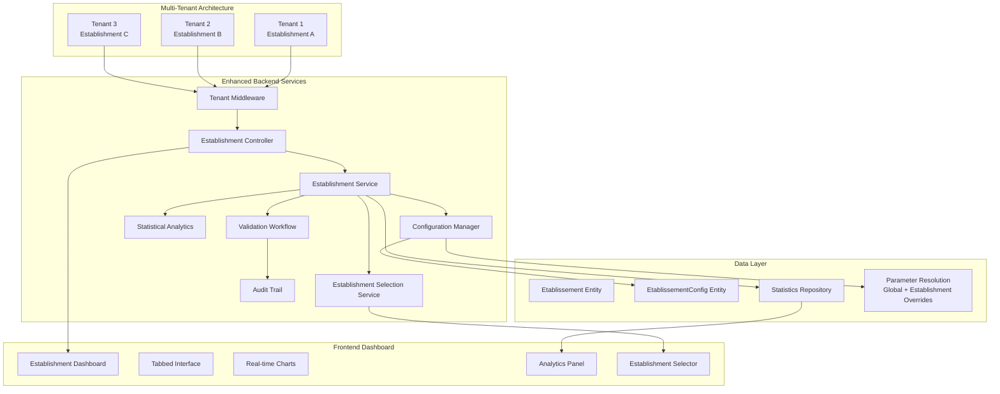

**Diagram sources**
- [etablissement.controller.ts:1-192](file://backend/src/modules/etablissement/controllers/etablissement.controller.ts#L1-L192)
- [etablissement.service.ts:40-352](file://backend/src/modules/etablissement/services/etablissement.service.ts#L40-L352)
- [etablissement-detail-page.tsx:25-140](file://frontend/src/features/etablissement/components/etablissement-detail-page.tsx#L25-L140)
- [use-etablissement-selection.ts:1-100](file://frontend/src/hooks/use-etablissement-selection.ts#L1-L100)

The architecture ensures complete data isolation between institutions while providing establishment-specific services, validation workflows, statistical reporting, and sophisticated establishment selection capabilities. The new frontend dashboard offers administrators comprehensive oversight through real-time charts, analytics panels, establishment-specific metrics, and seamless establishment navigation.

**Section sources**
- [etablissement.controller.ts:1-192](file://backend/src/modules/etablissement/controllers/etablissement.controller.ts#L1-L192)
- [etablissement.service.ts:40-352](file://backend/src/modules/etablissement/services/etablissement.service.ts#L40-L352)
- [etablissement-detail-page.tsx:25-140](file://frontend/src/features/etablissement/components/etablissement-detail-page.tsx#L25-L140)
- [use-etablissement-selection.ts:1-100](file://frontend/src/hooks/use-etablissement-selection.ts#L1-L100)

## Enhanced Establishment Entity Model

The establishment entity model has been significantly enhanced with comprehensive institutional information and establishment-specific configuration:

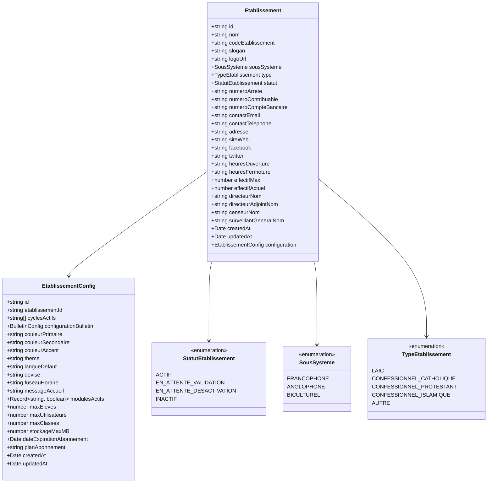

**Updated** Enhanced entity model with comprehensive institutional information, establishment-specific configuration, UUID-based academic cycle relationships, and multi-tenant parameter resolution capabilities

**Diagram sources**
- [etablissement.entity.ts:64-160](file://backend/src/modules/etablissement/entities/etablissement.entity.ts#L64-L160)
- [etablissement-config.entity.ts:30-125](file://backend/src/modules/etablissement/entities/etablissement-config.entity.ts#L30-L125)

### Key Enhancements

- **Comprehensive Institutional Information**: Extended contact details, identification numbers, social media presence, and operational hours
- **Establishment Status Management**: Four-tier status system with validation workflows for establishment lifecycle management
- **Administrative Leadership**: Detailed information for establishment leadership including directors, inspectors, and supervisors
- **UUID-Based Academic Cycles**: Flexible academic cycle management replacing enum constraints with UUID relationships
- **SaaS Subscription Integration**: Comprehensive quota management, storage limits, and subscription plan tracking
- **Regional Customization**: Language, currency, timezone, and regional messaging configuration
- **Theme and Branding**: Color schemes, themes, and institutional branding options
- **Multi-Tenant Parameter Resolution**: Global and establishment-specific parameter override system with fallback mechanisms

**Section sources**
- [etablissement.entity.ts:64-160](file://backend/src/modules/etablissement/entities/etablissement.entity.ts#L64-L160)
- [etablissement-config.entity.ts:30-125](file://backend/src/modules/etablissement/entities/etablissement-config.entity.ts#L30-L125)

## UUID-Based Academic Cycle Management

The migration from CycleScolaire enum to UUID-based relationships represents a fundamental shift toward flexible academic cycle management:

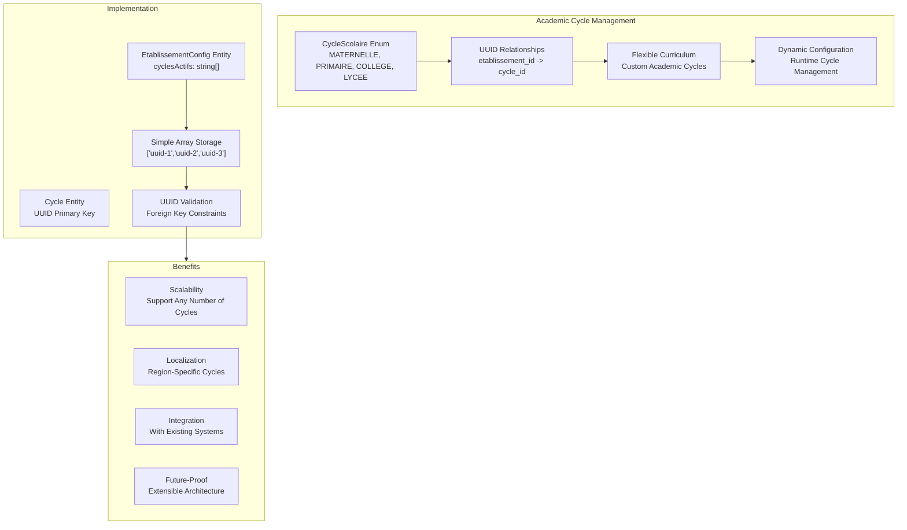

**Updated** Complete migration from enum-based to UUID-based academic cycle management with establishment-specific cycle configuration

**Diagram sources**
- [etablissement-config.entity.ts:48-49](file://backend/src/modules/etablissement/entities/etablissement-config.entity.ts#L48-L49)
- [etablissement.dto.ts:66-66](file://backend/src/modules/etablissement/dto/etablissement.dto.ts#L66-L66)

### Implementation Details

The new system replaces the fixed enum values with UUID-based relationships stored as simple arrays in the EtablissementConfig entity. This change enables:

- **Unlimited Academic Cycles**: No longer constrained by predefined enum values
- **Regional Flexibility**: Support for region-specific academic structures
- **Dynamic Configuration**: Runtime management of active academic cycles
- **Foreign Key Integrity**: Proper UUID validation and referential integrity
- **Backward Compatibility**: Seamless migration from legacy enum-based systems

**Section sources**
- [etablissement-config.entity.ts:48-49](file://backend/src/modules/etablissement/entities/etablissement-config.entity.ts#L48-L49)
- [etablissement.dto.ts:66-66](file://backend/src/modules/etablissement/dto/etablissement.dto.ts#L66-L66)
- [056-suppression-cycle-scolaire.sql](file://backend/database/migrations/056-suppression-cycle-scolaire.sql)

## Comprehensive Configuration Management

The establishment configuration system has been expanded to support comprehensive institutional customization, SaaS subscription management, and sophisticated multi-tenant parameter resolution:

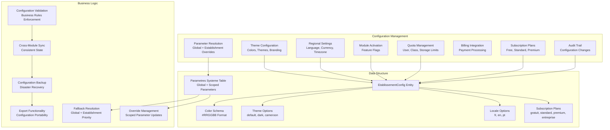

**Updated** Comprehensive configuration management system with SaaS integration, establishment-specific parameter overrides, and multi-tenant parameter resolution

**Diagram sources**
- [etablissement-config.entity.ts:65-117](file://backend/src/modules/etablissement/entities/etablissement-config.entity.ts#L65-L117)
- [etablissement.dto.ts:80-101](file://backend/src/modules/etablissement/dto/etablissement.dto.ts#L80-L101)
- [006-parametres-multi-etablissements.ts:1-200](file://backend/src/database/migrations/006-parametres-multi-etablissements.ts#L1-L200)

### Configuration Categories

#### Theme and Branding Configuration
- **Color Schemes**: Primary, secondary, and accent colors with hex validation
- **Themes**: Default, dark, and regional themes (cameroon)
- **Branding Elements**: Logo URLs, slogans, and institutional messaging

#### Regional and Localization Settings
- **Language Preferences**: French, English, Portuguese support
- **Currency Management**: XOF, XAF, EUR, USD currency options
- **Timezone Configuration**: IANA timezone support for accurate scheduling
- **Regional Messaging**: Custom welcome messages and local information

#### Feature and Module Management
- **Module Activation**: JSON-based module flags for feature enablement
- **Dynamic Feature Control**: Runtime activation/deactivation of system features
- **Permission Integration**: Module-specific permission management

#### Quota and Subscription Management
- **User Limits**: Maximum student and staff capacity per establishment
- **Class Capacity**: Maximum classes and classroom management
- **Storage Management**: Cloud storage allocation and monitoring
- **Subscription Plans**: Tier-based service level management
- **Billing Integration**: Payment processing and renewal management

#### Multi-Tenant Parameter Resolution
- **Global Parameters**: System-wide configuration defaults
- **Establishment Overrides**: Institution-specific parameter customizations
- **Fallback Resolution**: Automatic parameter resolution with priority hierarchy
- **Parameter Versioning**: Audit trail of parameter changes and overrides

**Section sources**
- [etablissement-config.entity.ts:65-117](file://backend/src/modules/etablissement/entities/etablissement-config.entity.ts#L65-L117)
- [etablissement.dto.ts:80-101](file://backend/src/modules/etablissement/dto/etablissement.dto.ts#L80-L101)
- [006-parametres-multi-etablissements.ts:1-200](file://backend/src/database/migrations/006-parametres-multi-etablissements.ts#L1-L200)

## Establishment Selection Service

The establishment selection service provides comprehensive multi-establishment navigation and context management capabilities:

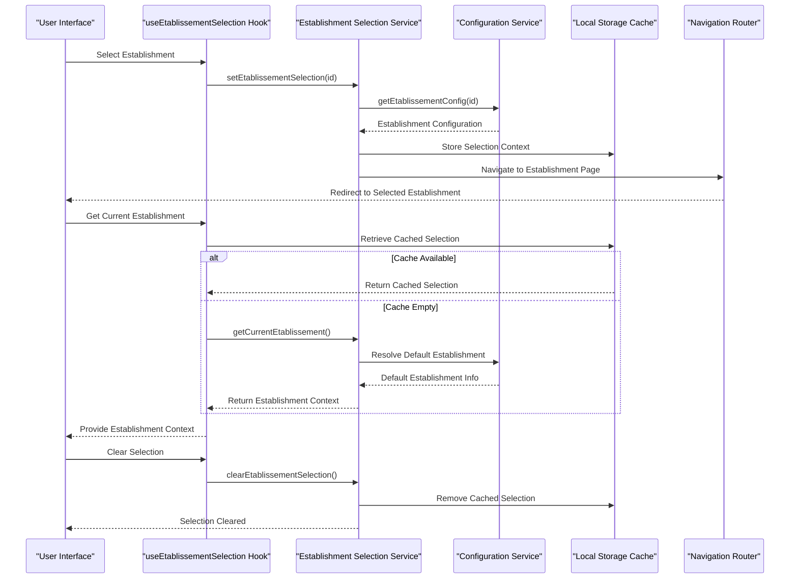

**New** Comprehensive establishment selection service with context persistence, parameter resolution, and seamless navigation

**Diagram sources**
- [use-etablissement-selection.ts:1-100](file://frontend/src/hooks/use-etablissement-selection.ts#L1-L100)
- [etablissement.service.ts:40-352](file://backend/src/modules/etablissement/services/etablissement.service.ts#L40-L352)

### Establishment Selection Features

#### Context Persistence
- **Local Storage Integration**: Automatic establishment selection persistence across browser sessions
- **Session Management**: Establishment context maintained during user sessions
- **Default Selection**: Intelligent default establishment selection based on user permissions
- **Context Validation**: Establishment context validation and refresh mechanisms

#### Seamless Navigation
- **Automatic Redirection**: Direct navigation to establishment-specific pages
- **Breadcrumb Support**: Establishment-aware breadcrumb navigation
- **Route Protection**: Establishment-specific route protection and authorization
- **Context-Aware Routing**: Dynamic route generation based on establishment context

#### Parameter Resolution Integration
- **Establishment-Specific Parameters**: Automatic parameter resolution for selected establishment
- **Fallback Mechanisms**: Global parameter fallback when establishment overrides unavailable
- **Real-Time Updates**: Dynamic parameter updates when establishment context changes
- **Cache Management**: Efficient caching of establishment-specific parameter configurations

#### User Experience Enhancement
- **Selection History**: Establishment selection history and quick access
- **Multi-Establishment Support**: Support for users with access to multiple establishments
- **Permission-Based Filtering**: Establishment filtering based on user permissions
- **Loading States**: Graceful loading states during establishment context initialization

**Section sources**
- [use-etablissement-selection.ts:1-100](file://frontend/src/hooks/use-etablissement-selection.ts#L1-L100)
- [etablissement.service.ts:40-352](file://backend/src/modules/etablissement/services/etablissement.service.ts#L40-L352)

## Establishment Validation and Workflow System

The establishment validation system introduces comprehensive approval workflows for establishment lifecycle management:

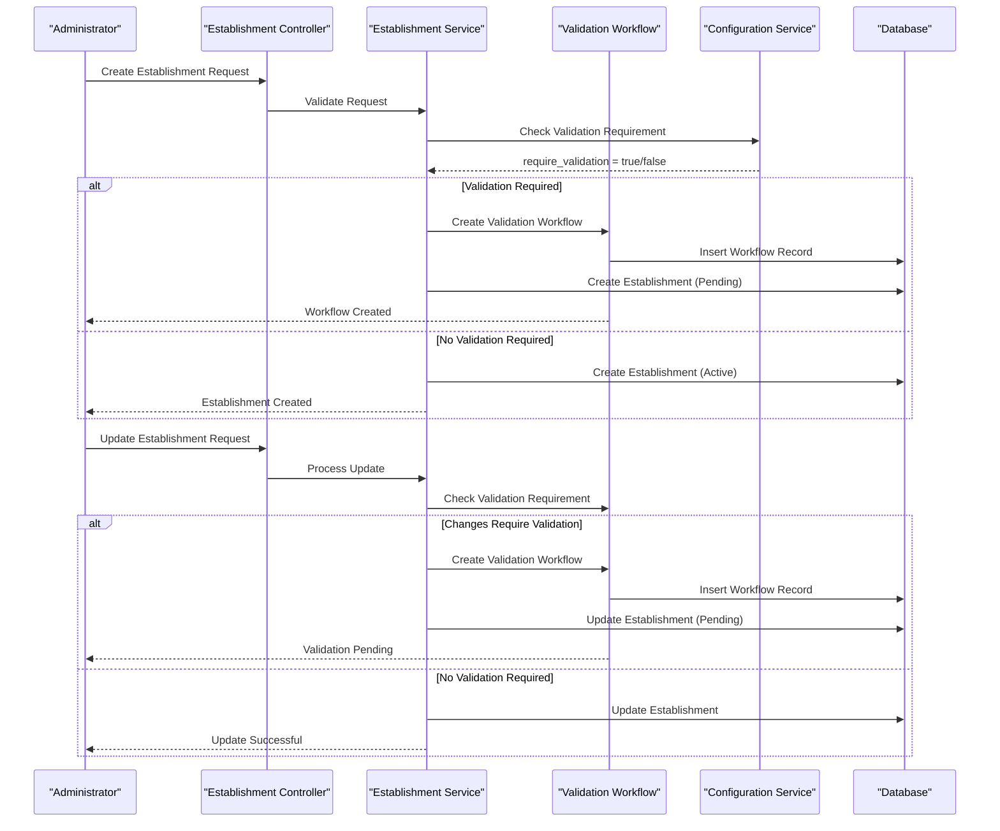

**Updated** Comprehensive validation workflow system with approval processes, establishment lifecycle management, and multi-tenant parameter integration

**Diagram sources**
- [etablissement.service.ts:56-100](file://backend/src/modules/etablissement/services/etablissement.service.ts#L56-L100)
- [etablissement.service.ts:145-207](file://backend/src/modules/etablissement/services/etablissement.service.ts#L145-L207)
- [validation-etablissement.sql](file://backend/src/database/migrations/015-validation-etablissement.sql)

### Validation Workflow Features

The system implements a two-level approval process for establishment management:

#### Establishment Creation Validation
- **Automatic Validation Trigger**: Based on configuration parameter `etablissement.require_validation`
- **Pending Status Management**: Establishments remain inactive until validation completion
- **Workflow Tracking**: Complete audit trail of validation requests and approvals
- **Creator Notification**: Automated notifications for validation workflow participants

#### Establishment Modification Validation
- **Change Impact Assessment**: Validation requirements based on modification type
- **Selective Validation**: Some changes bypass validation, others require approval
- **Status Management**: Maintains pending status during validation process
- **Approval Authority**: Hierarchical approval based on establishment type and change impact

#### Lifecycle Management
- **Activation/Deactivation Workflows**: Separate approval processes for establishment status changes
- **Status Transitions**: Controlled transitions between active, pending, and inactive states
- **Audit Trail**: Complete history of establishment lifecycle events
- **Recovery Mechanisms**: Graceful handling of validation failures and cancellations

**Section sources**
- [etablissement.service.ts:56-100](file://backend/src/modules/etablissement/services/etablissement.service.ts#L56-L100)
- [etablissement.service.ts:145-207](file://backend/src/modules/etablissement/services/etablissement.service.ts#L145-L207)
- [validation-etablissement.sql](file://backend/src/database/migrations/015-validation-etablissement.sql)

## Enhanced Statistical Reporting

The establishment module now provides comprehensive statistical reporting with establishment-specific analytics and real-time insights:

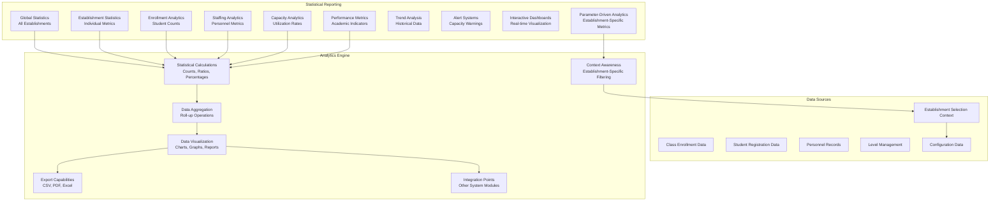

**Updated** Comprehensive statistical reporting system with establishment-specific analytics, real-time dashboards, and parameter-driven insights

**Diagram sources**
- [etablissement.service.ts:17-38](file://backend/src/modules/etablissement/services/etablissement.service.ts#L17-L38)
- [etablissement.service.ts:281-348](file://backend/src/modules/etablissement/services/etablissement.service.ts#L281-L348)
- [etablissement-detail-page.tsx:78-106](file://frontend/src/features/etablissement/components/etablissement-detail-page.tsx#L78-L106)

### Statistical Categories

#### Global Establishment Statistics
- **Total Establishments**: Overall count across all institutions
- **Status Distribution**: Active vs inactive establishment ratios
- **System Distribution**: Breakdown by educational subsystems
- **Type Distribution**: Religious vs secular establishment composition

#### Establishment-Specific Metrics
- **Enrollment Counts**: Current student population per establishment
- **Staffing Levels**: Total personnel count and distribution
- **Class Distribution**: Number of active classes and levels
- **Capacity Utilization**: Effectiveness and space utilization rates
- **Configuration Metrics**: Active modules and subscription plan indicators
- **Parameter-Driven Insights**: Establishment-specific analytics based on configuration parameters

#### Real-Time Analytics
- **Enrollment Trends**: Student registration patterns and seasonal variations
- **Staff Turnover**: Personnel changes and retention metrics
- **Capacity Planning**: Predictive analytics for enrollment forecasting
- **Performance Indicators**: Academic performance and progress metrics
- **Resource Utilization**: Classroom, laboratory, and facility usage patterns
- **Context-Aware Reporting**: Establishment-specific analytics with parameter integration

#### Interactive Dashboard Features
- **Tabbed Interface**: Organized presentation of different statistical categories
- **Real-Time Updates**: Live data refresh and dynamic chart updates
- **Export Capabilities**: Downloadable reports in multiple formats
- **Customizable Views**: Filterable and sortable statistical presentations
- **Alert Systems**: Automated notifications for capacity thresholds and performance issues
- **Establishment Comparison**: Comparative analytics between multiple establishments

**Section sources**
- [etablissement.service.ts:17-38](file://backend/src/modules/etablissement/services/etablissement.service.ts#L17-L38)
- [etablissement.service.ts:281-348](file://backend/src/modules/etablissement/services/etablissement.service.ts#L281-L348)
- [etablissement-detail-page.tsx:78-106](file://frontend/src/features/etablissement/components/etablissement-detail-page.tsx#L78-L106)

## Frontend Component Architecture

The frontend architecture features a comprehensive establishment management dashboard with tabbed interfaces, real-time data visualization, and establishment selection capabilities:

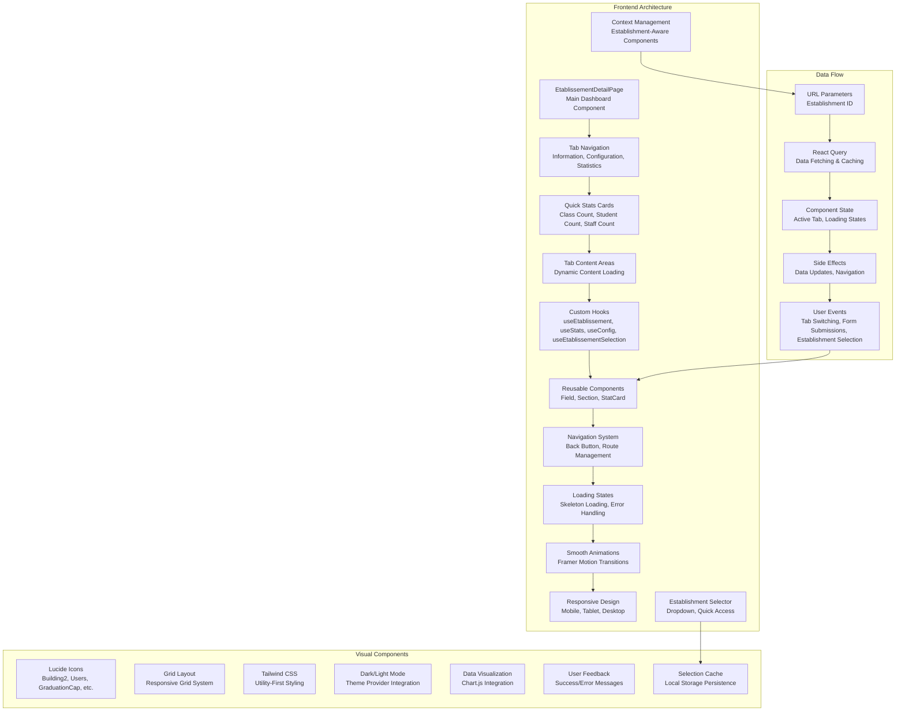

**Updated** Comprehensive frontend architecture with establishment selection service, real-time statistics, interactive data visualization, and establishment-aware context management

**Diagram sources**
- [etablissement-detail-page.tsx:25-140](file://frontend/src/features/etablissement/components/etablissement-detail-page.tsx#L25-L140)
- [etablissement.types.ts:38-104](file://frontend/src/features/etablissement/types/etablissement.types.ts#L38-L104)
- [use-etablissement-selection.ts:1-100](file://frontend/src/hooks/use-etablissement-selection.ts#L1-L100)

### Component Structure

#### Main Dashboard Component
- **Tabbed Interface**: Three main tabs for information, configuration, and statistics
- **Header Section**: Establishment name, code, navigation controls, and establishment selector
- **Quick Statistics**: Four key metric cards with icons and color coding
- **Responsive Layout**: Adaptive design for different screen sizes

#### Tab Components
- **Information Tab**: Comprehensive establishment details in organized sections
- **Configuration Tab**: Establishment-specific settings and customization options
- **Statistics Tab**: Detailed analytics and performance metrics with establishment-specific insights

#### Reusable Components
- **Field Components**: Consistent field rendering with labels and values
- **Section Components**: Card-based sections for logical grouping of information
- **StatCard Components**: Color-coded statistic cards with icons and animations

#### Data Management
- **Custom Hooks**: Specialized hooks for establishment data fetching, caching, and establishment selection
- **Type Safety**: Comprehensive TypeScript interfaces for all data structures
- **Error Handling**: Robust error handling and loading state management
- **Navigation**: Seamless navigation between establishment pages, lists, and selection interfaces

#### Establishment Selection Integration
- **Selector Component**: Dropdown and quick-access establishment selection
- **Context Persistence**: Establishment context maintained across navigation
- **Parameter Resolution**: Establishment-specific parameter integration
- **Multi-Establishment Support**: Support for users with access to multiple establishments

**Section sources**
- [etablissement-detail-page.tsx:25-140](file://frontend/src/features/etablissement/components/etablissement-detail-page.tsx#L25-L140)
- [etablissement.types.ts:38-104](file://frontend/src/features/etablissement/types/etablissement.types.ts#L38-L104)
- [use-etablissement-selection.ts:1-100](file://frontend/src/hooks/use-etablissement-selection.ts#L1-L100)

## API Endpoints and Operations

The establishment module provides comprehensive RESTful endpoints with enhanced CRUD operations, establishment-specific functionality, and multi-tenant parameter resolution:

### Establishment Management Endpoints

#### GET /api/etablissements/ - List All Establishments
**New** Enhanced endpoint with comprehensive establishment listing, filtering, and establishment selection context

#### GET /api/etablissements/:id - Get Establishment Details
**Updated** Returns establishment details with embedded configuration, status information, and parameter resolution context

#### POST /api/etablissements/ - Create New Establishment
**Enhanced** Now includes validation workflow integration, automatic configuration creation, and establishment-specific parameter setup

#### PATCH /api/etablissements/:id - Update Establishment
**Enhanced** Supports selective updates with validation workflow for significant changes and establishment parameter synchronization

#### PATCH /api/etablissements/:id/desactiver - Deactivate Establishment
**New** Dedicated endpoint for establishment deactivation with approval workflow and parameter cleanup

#### PATCH /api/etablissements/:id/activer - Activate Establishment
**New** Dedicated endpoint for establishment reactivation with approval workflow and parameter restoration

### Configuration Management Endpoints

#### GET /api/etablissements/:id/config - Get Establishment Configuration
**Enhanced** Returns comprehensive establishment configuration with all customization options and parameter resolution

#### PATCH /api/etablissements/:id/config - Update Establishment Configuration
**Enhanced** Supports partial configuration updates with validation, audit trail, and establishment parameter overrides

### Statistical Reporting Endpoints

#### GET /api/etablissements/stats - Global Statistics
**New** Comprehensive statistics across all establishments for administrative overview with establishment selection context

#### GET /api/etablissements/:id/stats - Establishment Statistics
**New** Detailed statistics for individual establishment with enrollment, staffing, capacity metrics, and parameter-driven insights

### Establishment Selection Endpoints

#### GET /api/etablissements/selection - Get Current Establishment Selection
**New** Returns current establishment selection context for authenticated users

#### POST /api/etablissements/selection - Set Establishment Selection
**New** Sets establishment selection context for current user session

#### DELETE /api/etablissements/selection - Clear Establishment Selection
**New** Clears establishment selection context and resets to default

### Request and Response Examples

**Request Body (Create Establishment)**
```json
{
  "nom": "École Primaire de Paris",
  "codeEtablissement": "EP-001",
  "slogan": "Excellence Éducative",
  "sousSysteme": "FRANCOPHONE",
  "type": "LAIC",
  "numeroContribuable": "RC-12345",
  "contactEmail": "info@ecole-paris.fr",
  "siteWeb": "https://www.ecole-paris.fr",
  "effectifMax": 800,
  "directeurNom": "Marie Dupont",
  "statut": "EN_ATTENTE_VALIDATION"
}
```

**Response (Establishment with Configuration and Parameter Context)**
```json
{
  "success": true,
  "data": {
    "id": "establishment-uuid",
    "nom": "École Primaire de Paris",
    "codeEtablissement": "EP-001",
    "sousSysteme": "FRANCOPHONE",
    "type": "LAIC",
    "statut": "EN_ATTENTE_VALIDATION",
    "effectifMax": 800,
    "effectifActuel": 0,
    "configuration": {
      "id": "config-uuid",
      "etablissementId": "establishment-uuid",
      "cyclesActifs": ["uuid-1", "uuid-2"],
      "langueDefaut": "fr",
      "fuseauHoraire": "Africa/Douala",
      "theme": "default",
      "modulesActifs": {
        "eleves": true,
        "personnel": true,
        "finances": false
      },
      "planAbonnement": "gratuit"
    },
    "parametres": {
      "bulletins.calculation_method": "arithmetique",
      "theme.primary_color": "#007bff",
      "auth.max_login_attempts": 5
    }
  }
}
```

**Request Body (Update Configuration)**
```json
{
  "cyclesActifs": ["uuid-1", "uuid-2", "uuid-3"],
  "configurationBulletin": {
    "style": "moderne",
    "afficherRang": true,
    "afficherMoyenneGenerale": true
  },
  "modulesActifs": {
    "eleves": true,
    "personnel": true,
    "finances": true,
    "bulletins": true
  },
  "maxEleves": 1000,
  "planAbonnement": "standard"
}
```

**Response (Establishment Statistics with Parameter Insights)**
```json
{
  "success": true,
  "data": {
    "etablissementId": "establishment-uuid",
    "nomEtablissement": "École Primaire de Paris",
    "nombreClasses": 24,
    "nombreEleves": 456,
    "nombrePersonnel": 47,
    "nombreNiveaux": 8,
    "tauxOccupation": 57,
    "parametres": {
      "bulletins.calculation_method": "arithmetique",
      "theme.primary_color": "#007bff",
      "auth.max_login_attempts": 5
    },
    "config": {
      "cyclesActifs": 3,
      "modulesActifs": 4,
      "planAbonnement": "standard"
    }
  }
}
```

**Section sources**
- [etablissement.controller.ts:26-192](file://backend/src/modules/etablissement/controllers/etablissement.controller.ts#L26-L192)
- [etablissement.dto.ts:14-101](file://backend/src/modules/etablissement/dto/etablissement.dto.ts#L14-L101)

## Data Models and DTOs

The establishment module implements comprehensive data models with strict validation, establishment-specific parameter resolution, and multi-tenant configuration management:

### Backend DTOs

#### Establishment Creation and Update DTOs
- **CreateEtablissementDto**: Comprehensive establishment creation with validation schemas and establishment parameter setup
- **UpdateEtablissementDto**: Partial updates with optional fields, validation, and establishment parameter synchronization
- **ModifierEtablissementDto**: Frontend-compatible update interface with establishment context awareness

#### Configuration DTOs
- **UpdateEtablissementConfigDto**: Establishment configuration updates with validation, parameter resolution, and establishment-specific overrides
- **ConfigurationCompleteDto**: Complete establishment configuration response with parameter context and establishment-specific insights
- **DuplicateConfigDto**: Configuration duplication with selective inclusion options and parameter inheritance
- **CompareConfigDto**: Configuration comparison between establishments with parameter resolution differences

#### Establishment Selection DTOs
- **SetEtablissementSelectionDto**: Establishment selection context management with validation and establishment parameter resolution
- **GetEtablissementSelectionDto**: Establishment selection retrieval with cached context and parameter integration
- **ClearEtablissementSelectionDto**: Establishment selection clearing with context cleanup and parameter restoration

### Frontend Types

#### Core Data Structures
- **Etablissement**: Complete establishment entity with configuration, parameter context, and establishment selection integration
- **EtablissementConfig**: Establishment-specific configuration settings with parameter resolution capabilities
- **EtablissementStats**: Global establishment statistics with establishment-specific insights and parameter-driven metrics
- **EtablissementDetailStats**: Detailed establishment performance metrics with establishment parameter integration

#### Form and UI Types
- **CreerEtablissementDto**: Frontend form submission interface with establishment parameter setup
- **ModifierConfigDto**: Configuration form interface with establishment parameter resolution
- **EtablissementFiltres**: Establishment listing filters and search criteria with establishment selection context
- **EtablissementSelectionContext**: Establishment selection context management with parameter integration

#### Establishment Selection Types
- **EtablissementSelectionState**: Establishment selection state management with caching and context persistence
- **EtablissementSelectionHook**: Establishment selection hook interface with parameter resolution and context awareness
- **EtablissementSelectionCache**: Establishment selection cache management with local storage integration

### Validation Schemas

The system implements comprehensive validation at multiple levels with establishment-specific parameter resolution:

#### Backend Validation
- **Zod Schemas**: Strict validation for all API requests and responses with establishment parameter integration
- **Enum Validation**: Type-safe enumeration values with default fallbacks and establishment-specific overrides
- **Format Validation**: Email addresses, URLs, phone numbers, and date formats with establishment context
- **Business Rule Validation**: Establishment-specific business logic enforcement with parameter-driven rules

#### Frontend Validation
- **TypeScript Interfaces**: Compile-time type checking for all data structures with establishment parameter types
- **Form Validation**: Real-time form validation with establishment-specific rules and parameter resolution
- **Async Validation**: Server-side validation integration for unique constraints and establishment parameter conflicts

#### Multi-Tenant Validation
- **Parameter Validation**: Establishment-specific parameter validation with global and override resolution
- **Context Validation**: Establishment context validation for all operations and parameter resolution
- **Permission Validation**: Establishment-specific permission validation with parameter-driven access control

**Section sources**
- [etablissement.dto.ts:14-101](file://backend/src/modules/etablissement/dto/etablissement.dto.ts#L14-L101)
- [etablissement-config.dto.ts:15-95](file://backend/src/modules/etablissement/dto/etablissement-config.dto.ts#L15-L95)
- [etablissement.types.ts:38-208](file://frontend/src/features/etablissement/types/etablissement.types.ts#L38-L208)
- [use-etablissement-selection.ts:1-100](file://frontend/src/hooks/use-etablissement-selection.ts#L1-L100)

## Business Logic and Validation

The establishment module implements sophisticated business logic with comprehensive validation, establishment-specific enforcement, and multi-tenant parameter resolution:

### Establishment Lifecycle Management

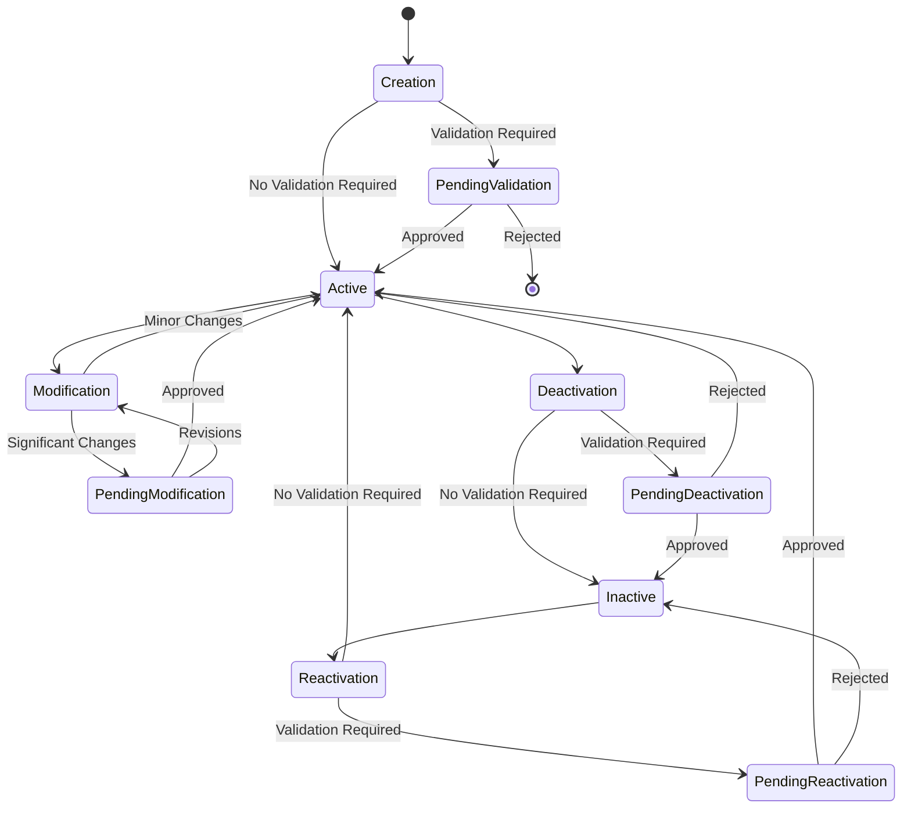

**Updated** Comprehensive establishment lifecycle management with validation workflows, establishment-specific parameter resolution, and multi-tenant configuration management

**Diagram sources**
- [etablissement.service.ts:56-100](file://backend/src/modules/etablissement/services/etablissement.service.ts#L56-L100)
- [etablissement.service.ts:145-207](file://backend/src/modules/etablissement/services/etablissement.service.ts#L145-L207)

### Validation Workflow Integration

The system integrates with the validation workflow service for comprehensive establishment management:

#### Creation Validation
- **Automatic Detection**: Based on configuration parameter evaluation and establishment type
- **Workflow Creation**: Two-level approval process for establishment creation with parameter setup
- **Status Management**: Pending validation status with creator notifications and establishment parameter initialization
- **Audit Trail**: Complete record of validation workflow activities and parameter resolution

#### Modification Validation
- **Impact Assessment**: Evaluation of change significance and validation requirements with establishment parameter impact
- **Selective Validation**: Different validation requirements for different change types and parameter modifications
- **Status Preservation**: Maintenance of establishment status during validation with parameter conflict resolution
- **Approval Authority**: Hierarchical approval based on change impact assessment and establishment complexity

#### Deactivation and Reactivation
- **Separate Workflows**: Distinct approval processes for establishment status changes with parameter cleanup
- **Risk Assessment**: Evaluation of deactivation impact on stakeholders and parameter dependency management
- **Recovery Planning**: Validation requirements for establishment reactivation with parameter restoration

### Statistical Calculation Logic

The establishment statistics system implements comprehensive calculation logic with establishment-specific parameter integration:

#### Enrollment Metrics
- **Student Count**: Real-time enrollment counting with active student filtering and establishment parameter validation
- **Class Distribution**: Level-based class counting with unique level identification and parameter-driven categorization
- **Capacity Utilization**: Effectiveness calculation based on maximum and current capacity with establishment-specific thresholds

#### Staffing Analytics
- **Personnel Count**: Active personnel counting with establishment-specific filtering and parameter-based categorization
- **Role Distribution**: Personnel distribution by role and department with establishment parameter influence
- **Utilization Rates**: Staff-to-student ratio calculations and benchmarks with establishment-specific targets

#### Configuration Metrics
- **Module Activation**: Active module counting with boolean filtering and establishment parameter integration
- **Plan Analysis**: Subscription plan distribution and feature utilization with establishment-specific parameter resolution
- **Cycle Management**: Academic cycle counting and configuration validation with establishment parameter dependencies

#### Parameter-Driven Analytics
- **Establishment-Specific Metrics**: Analytics driven by establishment parameter values and overrides
- **Global vs Local Comparison**: Comparative analytics between establishment-specific and global parameter values
- **Parameter Impact Analysis**: Analysis of parameter changes on establishment performance and utilization metrics

**Section sources**
- [etablissement.service.ts:56-100](file://backend/src/modules/etablissement/services/etablissement.service.ts#L56-L100)
- [etablissement.service.ts:145-207](file://backend/src/modules/etablissement/services/etablissement.service.ts#L145-L207)
- [etablissement.service.ts:281-348](file://backend/src/modules/etablissement/services/etablissement.service.ts#L281-L348)

## Security and Access Control

The establishment module implements robust security measures with comprehensive access control, establishment-specific enforcement, and multi-tenant parameter resolution:

### Role-Based Access Control

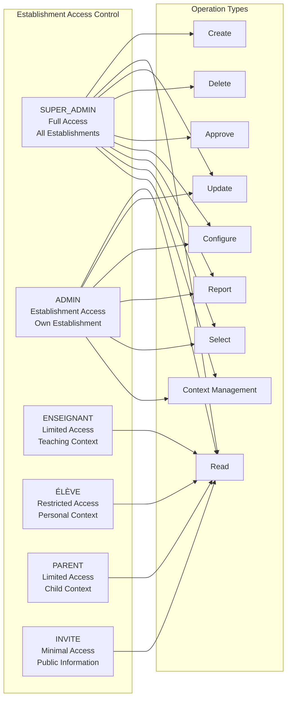

**Updated** Enhanced role-based access control with establishment-specific permissions, validation workflows, and multi-tenant parameter resolution

**Diagram sources**
- [etablissement.controller.ts:30-192](file://backend/src/modules/etablissement/controllers/etablissement.controller.ts#L30-L192)
- [etablissement.service.ts:281-348](file://backend/src/modules/etablissement/services/etablissement.service.ts#L281-L348)

### Establishment-Specific Security

#### Data Isolation
- **Tenant Filtering**: Automatic establishment filtering for all database queries and parameter resolution
- **Context Validation**: Establishment context validation for all operations and establishment selection
- **Permission Boundaries**: Strict boundary enforcement between establishments with parameter isolation
- **Audit Logging**: Comprehensive logging of establishment-specific operations and parameter access

#### Validation Integration
- **Workflow Authorization**: Role-based authorization for validation workflows and establishment selection
- **Approval Hierarchy**: Hierarchical approval based on establishment type, size, and parameter complexity
- **Change Impact Assessment**: Risk-based validation requirements for different changes and parameter modifications
- **Status-Based Access**: Different access levels based on establishment status and parameter resolution context

#### Configuration Security
- **Parameter Validation**: Comprehensive validation of establishment configuration parameters with multi-tenant context
- **Type Safety**: Strict type checking for all configuration values and establishment parameter types
- **Format Validation**: Input validation for URLs, emails, phone numbers, and other formats with establishment context
- **Business Rule Enforcement**: Establishment-specific business logic validation with parameter-driven rules

### Frontend Security

#### Component-Level Security
- **Route Guards**: Establishment-specific route protection and authorization with establishment selection context
- **Feature Flags**: Dynamic feature availability based on establishment configuration and parameter resolution
- **Permission-Based Rendering**: Conditional component rendering based on user roles and establishment parameter access
- **Input Validation**: Real-time form validation with establishment-specific rules and parameter integration

#### Data Protection
- **Type Safety**: Comprehensive TypeScript validation for all data flows with establishment parameter types
- **Error Handling**: Robust error handling with establishment-specific messaging and parameter resolution
- **Loading States**: Graceful loading states with establishment context and parameter caching
- **Cache Management**: Establishment-specific data caching and synchronization with parameter resolution

#### Establishment Selection Security
- **Context Validation**: Establishment selection context validation and establishment parameter resolution
- **Access Control**: Establishment-specific access control based on establishment selection and parameter context
- **Parameter Isolation**: Establishment parameter isolation and secure parameter resolution
- **Session Management**: Secure establishment session management with parameter context persistence

**Section sources**
- [etablissement.controller.ts:30-192](file://backend/src/modules/etablissement/controllers/etablissement.controller.ts#L30-L192)
- [etablissement.service.ts:281-348](file://backend/src/modules/etablissement/services/etablissement.service.ts#L281-L348)

## Integration Patterns

The establishment module integrates seamlessly with other system components, provides comprehensive integration points, and implements sophisticated establishment selection and parameter resolution:

### Cross-Module Integration

```mermaid
graph TB
subgraph "Establishment Module"
Controller["Establishment Controller"]
Service["Establishment Service"]
Repository["Establishment Repository"]
Validator["Validation Workflow"]
Stats["Statistical Analytics"]
Config["Configuration Manager"]
Selection["Establishment Selection Service"]
Audit["Audit Trail"]
Parametres["Parameter Resolution Service"]
end
subgraph "Integrated Modules"
Auth["Authentication Module"]
Users["Users Module"]
Classes["Classes Module"]
Students["Students Module"]
Personnel["Personnel Module"]
Finances["Finances Module"]
Configuration["Configuration Module"]
Validation["Validation Workflow Module"]
Reporting["Reporting Module"]
Analytics["Analytics Module"]
ParametresSysteme["Parameters System Module"]
end
Controller --> Auth
Controller --> Users
Controller --> Classes
Controller --> Students
Controller --> Personnel
Controller --> Finances
Controller --> Configuration
Controller --> Validation
Controller --> Reporting
Controller --> Analytics
Controller --> ParametresSysteme
Service --> Validator
Service --> Stats
Service --> Config
Service --> Selection
Service --> Audit
Service --> Parametres
Repository --> Database["Establishment Database"]
Repository --> ConfigDB["Configuration Database"]
Repository --> ParametresDB["Parameters Database"]
Selection --> Selector["Establishment Selector Component"]
Parametres --> GlobalParametres["Global Parameters"]
Parametres --> ScopedParametres["Scoped Parameters"]
Parametres --> FallbackResolution["Fallback Resolution Logic"]
```

**Updated** Comprehensive integration with validation workflows, statistical analytics, establishment selection service, and multi-tenant parameter resolution

**Diagram sources**
- [etablissement.controller.ts:1-192](file://backend/src/modules/etablissement/controllers/etablissement.controller.ts#L1-L192)
- [etablissement.service.ts:40-352](file://backend/src/modules/etablissement/services/etablissement.service.ts#L40-L352)
- [use-etablissement-selection.ts:1-100](file://frontend/src/hooks/use-etablissement-selection.ts#L1-L100)

### Establishment-Specific Integrations

#### Validation Workflow Integration
- **Workflow Creation**: Automatic validation workflow creation for establishment changes with parameter impact assessment
- **Approval Routing**: Intelligent approval routing based on establishment type, change impact, and parameter complexity
- **Notification System**: Comprehensive notification system for validation workflow participants with establishment context
- **Audit Trail**: Complete audit trail of validation workflow activities and establishment parameter changes

#### Statistical Analytics Integration
- **Real-Time Data**: Live data aggregation from multiple system modules with establishment parameter integration
- **Establishment Context**: Establishment-specific data filtering and aggregation with parameter-driven analytics
- **Performance Metrics**: Comprehensive performance and utilization metrics with establishment parameter insights
- **Trend Analysis**: Historical trend analysis and predictive modeling with establishment parameter context

#### Configuration Management Integration
- **Parameter Synchronization**: Automatic synchronization of establishment configuration parameters with multi-tenant context
- **Module Activation**: Dynamic module activation based on establishment configuration and parameter resolution
- **Quota Management**: Automatic quota enforcement based on subscription plan and establishment parameter validation
- **Regional Customization**: Establishment-specific regional and cultural adaptations with parameter-driven localization

#### Establishment Selection Integration
- **Context Persistence**: Establishment selection context persistence across navigation and parameter resolution
- **Parameter Resolution**: Establishment-specific parameter resolution with selection context and fallback mechanisms
- **Navigation Integration**: Seamless navigation between establishment pages with selection context and parameter integration
- **Multi-Establishment Support**: Support for users with access to multiple establishments with parameter isolation

### Frontend Integration Patterns

#### Component Composition
- **Tabbed Interface**: Modular tab components for information, configuration, statistics, and establishment selection
- **Reusable Components**: Consistent component library for field rendering, section organization, and establishment parameter display
- **State Management**: Centralized state management with establishment-specific context and parameter resolution
- **Event Handling**: Comprehensive event handling for user interactions, establishment selection, and parameter updates

#### Data Flow Patterns
- **Query Integration**: Seamless integration with React Query for data fetching, caching, and establishment parameter resolution
- **Real-Time Updates**: WebSocket integration for live data updates, establishment selection context, and parameter synchronization
- **Form Management**: Comprehensive form management with establishment-specific validation and parameter integration
- **Navigation Integration**: Seamless navigation between establishment pages, selection interfaces, and parameter contexts

#### Establishment Selection Patterns
- **Hook Integration**: Establishment selection hooks with parameter resolution and context persistence
- **Context Providers**: Establishment context providers with parameter integration and fallback resolution
- **Cache Management**: Establishment selection cache management with local storage and parameter context
- **Multi-Establishment Navigation**: Seamless navigation between establishments with parameter isolation and context preservation

**Section sources**
- [etablissement.controller.ts:1-192](file://backend/src/modules/etablissement/controllers/etablissement.controller.ts#L1-L192)
- [etablissement.service.ts:40-352](file://backend/src/modules/etablissement/services/etablissement.service.ts#L40-L352)
- [use-etablissement-selection.ts:1-100](file://frontend/src/hooks/use-etablissement-selection.ts#L1-L100)

## Performance Considerations

The establishment module implements comprehensive performance optimizations for multi-establishment operations, real-time analytics, establishment selection, and multi-tenant parameter resolution:

### Database Optimization

```mermaid
graph LR
subgraph "Database Optimizations"
Indexes["Establishment Indexes<br/>ID, Code, Status, Type"]
Partitioning["Database Partitioning<br/>Tenant-Specific Tables"]
Caching["Multi-Level Caching<br/>Query Results, Configuration, Stats, Parameters"]
Connection["Connection Pooling<br/>Establishment Context"]
Async["Asynchronous Processing<br/>Validation Workflows, Stats Generation, Parameter Resolution"]
Batching["Batch Operations<br/>Configuration Updates, Stats Calculation, Parameter Sync"]
Compression["Data Compression<br/>Large Configuration Objects, Parameter Collections"]
```

**Updated** Comprehensive database optimization for establishment-specific operations, real-time analytics, establishment selection, and multi-tenant parameter resolution

**Diagram sources**
- [etablissement.service.ts:105-128](file://backend/src/modules/etablissement/services/etablissement.service.ts#L105-L128)
- [etablissement.service.ts:281-348](file://backend/src/modules/etablissement/services/etablissement.service.ts#L281-L348)

### Frontend Performance

#### Component Optimization
- **Lazy Loading**: Lazy loading of establishment-specific components, statistics, and parameter resolution
- **Virtualization**: Virtual scrolling for large establishment lists, statistics, and parameter collections
- **Memoization**: React.memo for expensive component rendering with establishment parameter context
- **Suspense Integration**: React Suspense for better loading states, error boundaries, and establishment selection

#### Data Management
- **Query Optimization**: Optimized React Query configuration with establishment-specific caching and parameter resolution
- **Data Normalization**: Normalized data structures for efficient updates, rendering, and establishment parameter management
- **Background Sync**: Background data synchronization with establishment context and parameter updates
- **Offline Support**: Basic offline support with establishment-specific data caching and parameter resolution

#### Establishment Selection Performance
- **Context Caching**: Establishment selection context caching with local storage and parameter resolution
- **Parameter Preloading**: Establishment parameter preloading with establishment selection context
- **Context Switching**: Efficient establishment context switching with parameter cache invalidation
- **Multi-Establishment Optimization**: Optimization for users with access to multiple establishments

### Real-Time Analytics Performance

#### Statistical Calculation Optimization
- **Pre-aggregated Data**: Pre-calculated statistics for frequently accessed metrics with establishment parameter integration
- **Incremental Updates**: Incremental statistical updates based on data changes and establishment parameter updates
- **Caching Strategies**: Multi-level caching for statistical data with establishment context and parameter resolution
- **Background Processing**: Asynchronous statistical calculations for large datasets and establishment parameter analysis

#### Validation Workflow Performance
- **Workflow Optimization**: Optimized validation workflow processing with establishment context and parameter impact assessment
- **Parallel Processing**: Parallel validation workflow execution for multiple establishments with parameter resolution
- **Resource Management**: Efficient resource management for validation workflow operations and establishment parameter updates
- **Scalability**: Horizontal scaling support for establishment validation workflows and parameter resolution

#### Establishment Selection Performance
- **Context Persistence**: Efficient establishment selection context persistence with parameter resolution caching
- **Parameter Resolution**: Optimized parameter resolution with establishment context and fallback mechanisms
- **Navigation Performance**: Fast establishment navigation with cached context and parameter integration
- **Multi-Establishment Efficiency**: Efficient handling of multiple establishment access with parameter isolation

### Scalability Features

#### Multi-Tenant Scalability
- **Horizontal Scaling**: Support for unlimited establishment growth with proper isolation and parameter resolution
- **Database Sharding**: Potential database sharding for very large deployment scenarios with establishment partitioning
- **Load Balancing**: Load balancing across establishment-specific services and parameter resolution
- **Microservice Architecture**: Potential microservice decomposition for large-scale deployments with establishment services

#### Performance Monitoring
- **Metrics Collection**: Comprehensive performance metrics collection for establishment operations and parameter resolution
- **Alerting System**: Performance-based alerting for establishment-specific issues and parameter resolution problems
- **Profiling Tools**: Built-in profiling tools for establishment module performance analysis and parameter resolution optimization
- **Capacity Planning**: Automated capacity planning based on establishment growth patterns and parameter resolution demands

**Section sources**
- [etablissement.service.ts:105-128](file://backend/src/modules/etablissement/services/etablissement.service.ts#L105-L128)
- [etablissement.service.ts:281-348](file://backend/src/modules/etablissement/services/etablissement.service.ts#L281-L348)

## Troubleshooting Guide

### Establishment-Specific Issues

#### Establishment Creation Failures
- **Issue**: Establishment creation fails with validation errors
- **Cause**: Invalid establishment data, configuration parameter conflicts, or establishment parameter resolution issues
- **Solution**: Verify establishment data validation, check configuration parameters, review validation workflow requirements, and establish parameter resolution context

#### Establishment Update Problems
- **Issue**: Establishment updates fail or are rejected
- **Cause**: Validation workflow requirements, establishment status restrictions, or establishment parameter conflicts
- **Solution**: Check establishment status, verify validation workflow requirements, ensure proper authorization, and resolve parameter conflicts

#### Establishment Status Issues
- **Issue**: Establishment remains in pending validation state
- **Cause**: Missing approvals, validation workflow configuration issues, or establishment parameter resolution problems
- **Solution**: Review validation workflow configuration, check approval authority, verify notification system, and resolve parameter resolution conflicts

### Establishment Selection Issues

#### Establishment Selection Failures
- **Issue**: Establishment selection fails or returns incorrect context
- **Cause**: Establishment selection cache corruption, parameter resolution conflicts, or establishment access permission issues
- **Solution**: Clear establishment selection cache, verify establishment access permissions, check parameter resolution context, and reinitialize establishment selection

#### Establishment Navigation Problems
- **Issue**: Establishment navigation not working or content not loading
- **Cause**: Establishment selection context issues, parameter resolution problems, or establishment-specific route protection
- **Solution**: Verify establishment selection context, check parameter resolution, review establishment-specific route protection, and ensure establishment parameter integration

#### Multi-Establishment Access Issues
- **Issue**: Users with access to multiple establishments experience selection problems
- **Cause**: Establishment selection context conflicts, parameter resolution ambiguity, or establishment access permission issues
- **Solution**: Check establishment selection context for each establishment, verify parameter resolution priorities, review establishment access permissions, and implement establishment-specific parameter isolation

### Configuration Management Issues

#### Configuration Parameter Validation
- **Issue**: Configuration parameter updates fail validation
- **Cause**: Invalid parameter values, type mismatches, or establishment parameter resolution conflicts
- **Solution**: Verify parameter values match expected types, check format requirements, review business rule validation, and resolve establishment parameter conflicts

#### Configuration Synchronization
- **Issue**: Configuration changes not reflected across system modules
- **Cause**: Caching issues, database synchronization problems, or establishment parameter resolution conflicts
- **Solution**: Clear configuration cache, verify database synchronization, check module integration, and resolve establishment parameter conflicts

#### SaaS Subscription Integration
- **Issue**: Subscription plan changes not applied
- **Cause**: Billing system integration issues, quota enforcement problems, or establishment parameter resolution conflicts
- **Solution**: Verify billing system connectivity, check quota enforcement logic, review subscription plan validation, and resolve establishment parameter conflicts

### Statistical Reporting Issues

#### Statistics Calculation Failures
- **Issue**: Statistical calculations fail or return incorrect results
- **Cause**: Data source issues, calculation logic errors, or establishment parameter resolution problems
- **Solution**: Verify data sources, check calculation logic, review statistical aggregation methods, and resolve establishment parameter conflicts

#### Real-Time Dashboard Problems
- **Issue**: Dashboard not updating or showing stale data
- **Cause**: Caching issues, real-time data synchronization problems, or establishment parameter resolution conflicts
- **Solution**: Clear dashboard cache, verify real-time data connections, check data synchronization, and resolve establishment parameter conflicts

#### Performance Degradation
- **Issue**: Slow response times in establishment management
- **Cause**: Database query optimization issues, excessive data processing, or establishment parameter resolution overhead
- **Solution**: Implement database indexing, optimize queries, implement data pagination, and optimize establishment parameter resolution

### Frontend Component Issues

#### Dashboard Rendering Problems
- **Issue**: Establishment dashboard not rendering properly
- **Cause**: Component loading issues, data fetching problems, or establishment parameter resolution conflicts
- **Solution**: Check component dependencies, verify data fetching logic, review error boundaries, and resolve establishment parameter conflicts

#### Tab Navigation Issues
- **Issue**: Tab switching not working or content not loading
- **Cause**: State management issues, component lazy loading problems, or establishment selection context conflicts
- **Solution**: Check tab state management, verify component lazy loading, review establishment selection context, and ensure establishment parameter integration

#### Form Validation Problems
- **Issue**: Establishment forms not validating or submitting incorrectly
- **Cause**: Form validation logic issues, establishment-specific validation rules, or establishment parameter resolution conflicts
- **Solution**: Review form validation logic, check establishment-specific validation rules, verify error handling, and resolve establishment parameter conflicts

**Section sources**
- [etablissement.service.ts:56-100](file://backend/src/modules/etablissement/services/etablissement.service.ts#L56-L100)
- [etablissement.service.ts:145-207](file://backend/src/modules/etablissement/services/etablissement.service.ts#L145-L207)
- [etablissement-detail-page.tsx:25-140](file://frontend/src/features/etablissement/components/etablissement-detail-page.tsx#L25-L140)
- [use-etablissement-selection.ts:1-100](file://frontend/src/hooks/use-etablissement-selection.ts#L1-L100)

## Conclusion

The Establishment Management module represents a comprehensive transformation from a basic multi-establishment system to a sophisticated educational institution management platform. This complete rewrite introduces:

### Architectural Excellence

- **Complete Rewrite Foundation**: Modernized architecture with enhanced entity models, comprehensive validation, establishment-specific services, and establishment selection capabilities
- **UUID-Based Flexibility**: Migration from enum constraints to flexible UUID-based academic cycle management
- **Comprehensive Validation**: Integrated validation workflows with approval processes for establishment lifecycle management
- **Advanced Statistical Analytics**: Real-time establishment-specific reporting with comprehensive metrics, visualization, and parameter-driven insights
- **SaaS Integration**: Subscription-based configuration management with quota enforcement, billing integration, and establishment parameter resolution
- **Multi-Tenant Parameter Resolution**: Sophisticated parameter resolution system with global and establishment-specific overrides and fallback mechanisms
- **Establishment Selection Service**: Comprehensive establishment selection service with context persistence, parameter resolution, and seamless navigation

### Frontend Innovation

- **Dashboard Architecture**: Comprehensive establishment dashboard with tabbed interface, real-time statistics, establishment-specific analytics, and establishment selection integration
- **Component Reusability**: Modular component library with consistent design patterns, establishment-specific customization, and establishment parameter integration
- **Real-Time Data**: Live data updates, interactive charts, establishment-specific analytics, and establishment parameter resolution
- **Responsive Design**: Mobile-first approach with adaptive layouts, establishment-specific optimizations, and establishment selection context
- **Establishment Context Management**: Sophisticated establishment context management with parameter resolution and seamless navigation

### Operational Excellence

- **Multi-Tenant Isolation**: Complete data separation with establishment-specific services, validation workflows, establishment selection, and parameter resolution
- **Business Logic Integration**: Comprehensive establishment lifecycle management with validation, approval processes, and establishment parameter management
- **Performance Optimization**: Multi-level caching, database optimization, real-time analytics performance tuning, and establishment selection optimization
- **Security Framework**: Role-based access control with establishment-specific permissions, comprehensive audit trails, and establishment parameter security
- **Integration Excellence**: Seamless integration with validation workflows, statistical analytics, establishment selection, and multi-tenant parameter resolution

### Future Extensibility

The established foundation supports continued evolution with:
- **Advanced Analytics**: Machine learning integration for enrollment prediction, performance optimization, and establishment parameter analysis
- **Integration Expansion**: Enhanced integration with external systems, third-party services, and establishment parameter resolution
- **Scalability Features**: Microservice architecture potential, horizontal scaling capabilities, and establishment-specific service decomposition
- **Customization Framework**: Extensible configuration system for region-specific and institutional customization with establishment parameter resolution
- **Establishment Selection Evolution**: Advanced establishment selection capabilities, parameter-driven personalization, and establishment context intelligence

This transformation positions the Establishment Management module as a cornerstone of the eLISAschool platform's enterprise readiness, comprehensive institutional management capabilities, establishment-specific operational control, and sophisticated establishment selection and parameter resolution services.