# Financial Management Module

<cite>
**Referenced Files in This Document**
- [index.ts](file://backend/src/modules/finances/index.ts)
- [finances.controller.ts](file://backend/src/modules/finances/controllers/finances.controller.ts)
- [scolarite.service.ts](file://backend/src/modules/finances/services/scolarite.service.ts)
- [depenses.service.ts](file://backend/src/modules/finances/services/depenses.service.ts)
- [finance-workflow.service.ts](file://backend/src/modules/finances/services/finance-workflow.service.ts)
- [dashboard.service.ts](file://backend/src/modules/finances/services/dashboard.service.ts)
- [frais-scolarite.entity.ts](file://backend/src/modules/finances/entities/frais-scolarite.entity.ts)
- [depenses.entity.ts](file://backend/src/modules/finances/entities/depenses.entity.ts)
- [paiement.entity.ts](file://backend/src/modules/finances/entities/paiement.entity.ts)
- [recu-paiement.entity.ts](file://backend/src/modules/finances/entities/recu-paiement.entity.ts)
- [finances.config.ts](file://backend/src/modules/finances/config/finances.config.ts)
- [scolarite.dto.ts](file://backend/src/modules/finances/dto/scolarite.dto.ts)
- [010-module-finances.sql](file://backend/database/migrations/010-module-finances.sql)
- [011-module-finances-part2.sql](file://backend/database/migrations/011-module-finances-part2.sql)
- [012-module-finances-part3-parametres.sql](file://backend/database/migrations/012-module-finances-part3-parametres.sql)
- [ANALYSE-CONTEXTE-AFRICAIN-CAMEROUN.md](file://ANALYSE-CONTEXTE-AFRICAIN-CAMEROUN.md)
</cite>

## Update Summary
**Changes Made**
- Added new SuiviPaiementEleve entity for detailed school fee payment tracking
- Enhanced payment tracking with automatic eligibility determination for national exams
- Integrated grace period management and cause-based absence categorization
- Updated database schema to include new payment tracking table
- Expanded financial monitoring capabilities with detailed payment analytics

## Table of Contents
1. [Introduction](#introduction)
2. [Module Architecture](#module-architecture)
3. [Core Components](#core-components)
4. [Financial Workflows](#financial-workflows)
5. [Database Schema](#database-schema)
6. [API Endpoints](#api-endpoints)
7. [Configuration Management](#configuration-management)
8. [Service Layer Analysis](#service-layer-analysis)
9. [Entity Relationships](#entity-relationships)
10. [Performance Considerations](#performance-considerations)
11. [Security Implementation](#security-implementation)
12. [New SuiviPaiementEleve Entity](#new-suivipaiementeleve-entity)
13. [Conclusion](#conclusion)

## Introduction

The Financial Management Module is a comprehensive financial management system designed for educational institutions, specifically targeting the eLISAschool platform. This module provides end-to-end financial management capabilities including student fee collection, expense tracking, budget management, treasury operations, and financial reporting.

The module follows enterprise-grade architecture principles with robust validation, workflow management, audit trails, and comprehensive reporting capabilities. It supports multi-establishment environments with configurable financial policies and automated workflows for approval processes.

**Updated** Added new SuiviPaiementEleve entity for detailed payment tracking with automatic exam eligibility determination and grace period management.

## Module Architecture

The Financial Management Module is structured using a clean architecture pattern with clear separation of concerns:

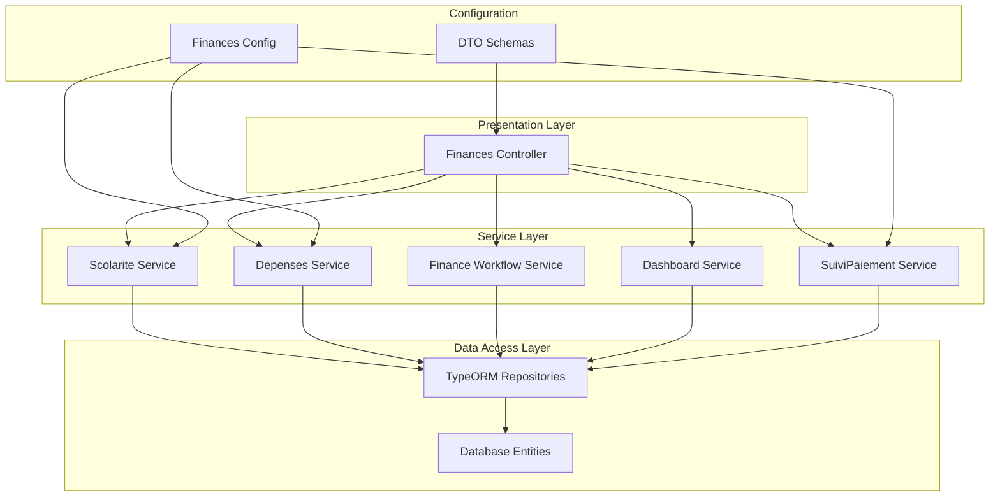

**Diagram sources**
- [finances.controller.ts:1-444](file://backend/src/modules/finances/controllers/finances.controller.ts#L1-L444)
- [scolarite.service.ts:1-908](file://backend/src/modules/finances/services/scolarite.service.ts#L1-L908)
- [depenses.service.ts:1-535](file://backend/src/modules/finances/services/depenses.service.ts#L1-L535)

**Section sources**
- [index.ts:1-15](file://backend/src/modules/finances/index.ts#L1-L15)
- [finances.controller.ts:1-444](file://backend/src/modules/finances/controllers/finances.controller.ts#L1-L444)

## Core Components

### Student Fee Management System

The module provides comprehensive student fee management with automatic invoice generation, payment tracking, and collection management:

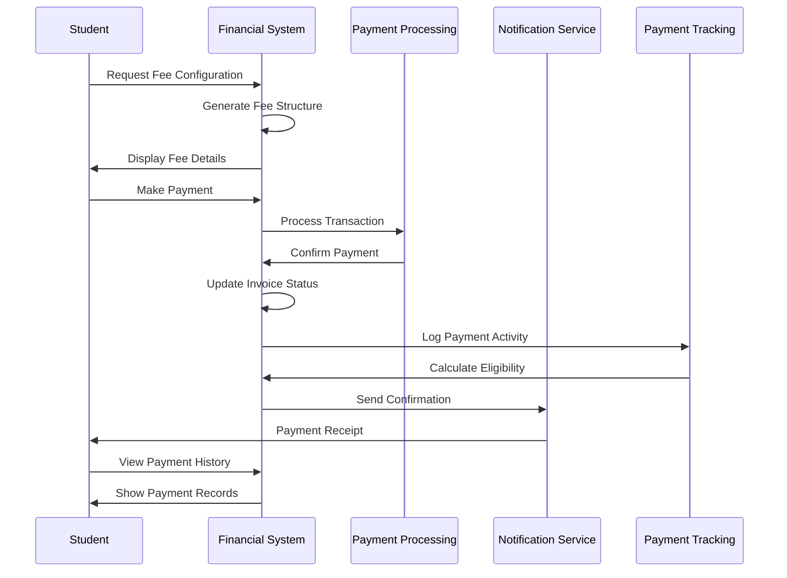

**Diagram sources**
- [scolarite.service.ts:323-494](file://backend/src/modules/finances/services/scolarite.service.ts#L323-L494)
- [finances.controller.ts:89-115](file://backend/src/modules/finances/controllers/finances.controller.ts#L89-L115)

### Expense Management System

The expense management system handles procurement workflows from request to payment:

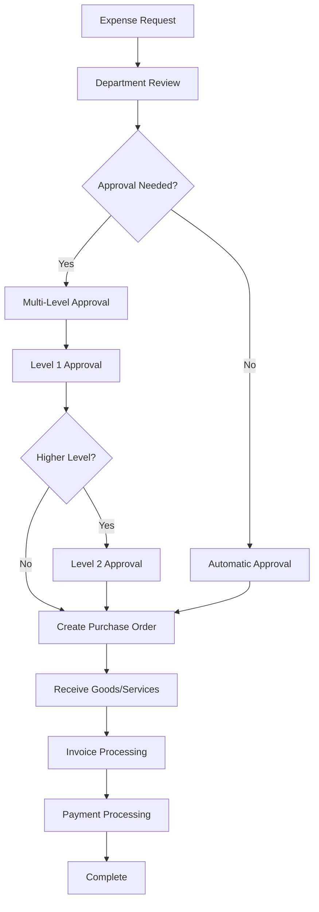

**Diagram sources**
- [depenses.service.ts:166-260](file://backend/src/modules/finances/services/depenses.service.ts#L166-L260)
- [finance-workflow.service.ts:134-173](file://backend/src/modules/finances/services/finance-workflow.service.ts#L134-L173)

**Section sources**
- [scolarite.service.ts:1-908](file://backend/src/modules/finances/services/scolarite.service.ts#L1-L908)
- [depenses.service.ts:1-535](file://backend/src/modules/finances/services/depenses.service.ts#L1-L535)

## Financial Workflows

### Multi-Level Approval System

The module implements a sophisticated multi-level approval system for financial transactions:

| Transaction Type | Levels | Thresholds | Required Roles |
|------------------|--------|------------|----------------|
| Payments | 1 | 0 FCFA | Cashier, Accountant |
| Expenses | 3 | 0, 500,000 FCFA | Staff, Head of Institution, Administrator |
| Budget | 4 | 0, 0, 0, 10,000,000 FCFA | Accountant, Head of Institution, Administrator, Director |

### Validation Logic

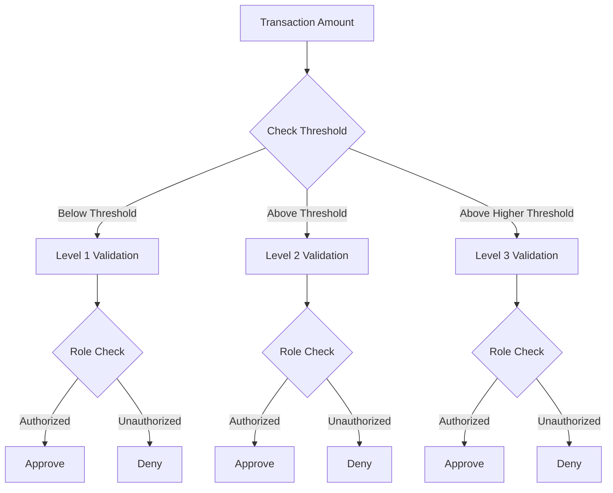

**Diagram sources**
- [finance-workflow.service.ts:56-101](file://backend/src/modules/finances/services/finance-workflow.service.ts#L56-L101)
- [finance-workflow.service.ts:106-117](file://backend/src/modules/finances/services/finance-workflow.service.ts#L106-L117)

**Section sources**
- [finance-workflow.service.ts:1-298](file://backend/src/modules/finances/services/finance-workflow.service.ts#L1-L298)

## Database Schema

The module implements a comprehensive database schema supporting all financial operations:

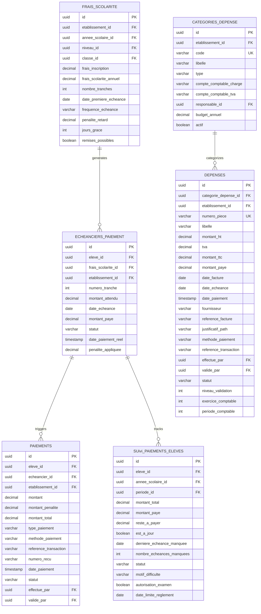

**Diagram sources**
- [010-module-finances.sql:16-382](file://backend/database/migrations/010-module-finances.sql#L16-L382)
- [011-module-finances-part2.sql:14-193](file://backend/database/migrations/011-module-finances-part2.sql#L14-L193)

**Section sources**
- [frais-scolarite.entity.ts:1-104](file://backend/src/modules/finances/entities/frais-scolarite.entity.ts#L1-L104)
- [depenses.entity.ts:1-366](file://backend/src/modules/finances/entities/depenses.entity.ts#L1-L366)

## API Endpoints

### Student Fee Management Endpoints

| Endpoint | Method | Description | Authentication |
|----------|--------|-------------|----------------|
| `/finances/scolarite/config` | POST | Configure school fees | Required |
| `/finances/scolarite/config` | GET | Get fee configuration | Required |
| `/finances/echeanciers/generer/:eleveId` | POST | Generate payment schedule | Required |
| `/finances/echeanciers/eleve/:eleveId` | GET | Get student payment schedule | Required |
| `/finances/paiements` | POST | Record student payment | Required |
| `/finances/paiements/eleve/:eleveId` | GET | Get payment history | Required |
| `/finances/remises` | POST | Apply student discount | Required |
| `/finances/impayes` | GET | Get overdue payments | Required |
| `/finances/relances/envoyer` | POST | Send payment reminders | Required |

### Expense Management Endpoints

| Endpoint | Method | Description | Authentication |
|----------|--------|-------------|----------------|
| `/finances/depenses/categories` | POST | Create expense category | Required |
| `/finances/depenses/categories` | GET | List expense categories | Required |
| `/finances/depenses` | POST | Create expense | Required |
| `/finances/depenses` | GET | List expenses | Required |
| `/finances/depenses/:id/valider` | PATCH | Approve expense | Required |
| `/finances/depenses/:id/payer` | POST | Process payment | Required |
| `/finances/depenses/demandes` | POST | Create expense request | Required |
| `/finances/depenses/demandes/a-valider` | GET | List pending requests | Required |
| `/finances/depenses/bons-commande` | POST | Create purchase order | Required |

### Dashboard Endpoints

| Endpoint | Method | Description | Authentication |
|----------|--------|-------------|----------------|
| `/finances/dashboard/stats` | GET | Get financial statistics | Required |
| `/finances/dashboard/evolution-paiements` | GET | Get payment trend | Required |
| `/finances/dashboard/top-impayes` | GET | Get top overdue students | Required |
| `/finances/dashboard/ratio-revenus-depenses` | GET | Get revenue vs expense ratio | Required |

**Section sources**
- [finances.controller.ts:46-442](file://backend/src/modules/finances/controllers/finances.controller.ts#L46-L442)

## Configuration Management

### Centralized Configuration System

The module implements a comprehensive configuration management system with 74 configurable parameters organized into logical categories:

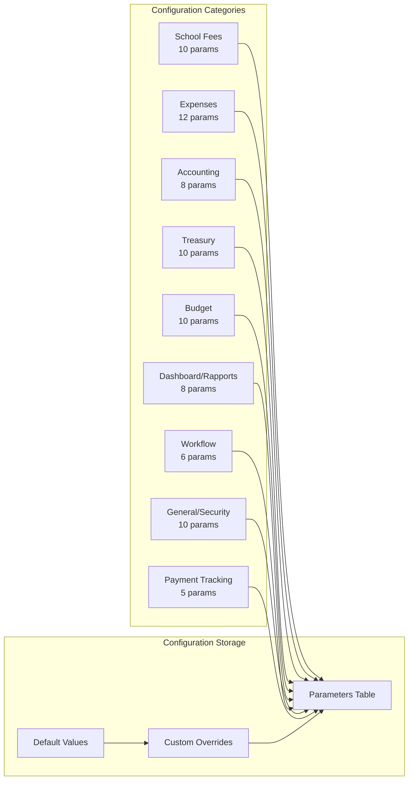

**Diagram sources**
- [finances.config.ts:11-127](file://backend/src/modules/finances/config/finances.config.ts#L11-L127)
- [012-module-finances-part3-parametres.sql:8-125](file://backend/database/migrations/012-module-finances-part3-parametres.sql#L8-L125)

### Configuration Categories

| Category | Parameters | Purpose |
|----------|------------|---------|
| **School Fees** | 10 | Fee structure, payment schedules, grace periods |
| **Expenses** | 12 | Expense approval thresholds, tax rates, budget controls |
| **Accounting** | 8 | Chart of accounts, fiscal periods, compliance |
| **Treasury** | 10 | Cash limits, approval thresholds, bank management |
| **Budget** | 10 | Budget allocation, monitoring thresholds, transfer rules |
| **Dashboard/Rapports** | 8 | Reporting frequencies, export formats, caching |
| **Workflow** | 6 | Approval level configurations |
| **General/Security** | 10 | Currency, encryption, audit retention |
| **Payment Tracking** | 5 | Exam eligibility, grace period thresholds, difficulty tracking |

**Section sources**
- [finances.config.ts:132-231](file://backend/src/modules/finances/config/finances.config.ts#L132-L231)
- [012-module-finances-part3-parametres.sql:8-125](file://backend/database/migrations/012-module-finances-part3-parametres.sql#L8-L125)

## Service Layer Analysis

### Scolarite Service (Student Fees)

The Scolarite Service manages the complete student fee lifecycle:

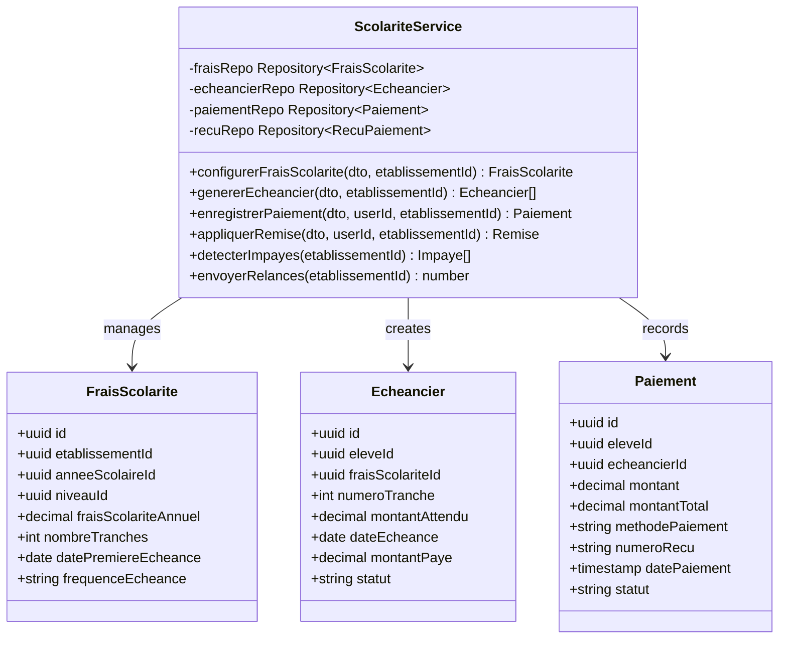

**Diagram sources**
- [scolarite.service.ts:25-42](file://backend/src/modules/finances/services/scolarite.service.ts#L25-L42)
- [frais-scolarite.entity.ts:19-103](file://backend/src/modules/finances/entities/frais-scolarite.entity.ts#L19-L103)

### Depenses Service (Expenses)

The Depenses Service handles comprehensive expense management:

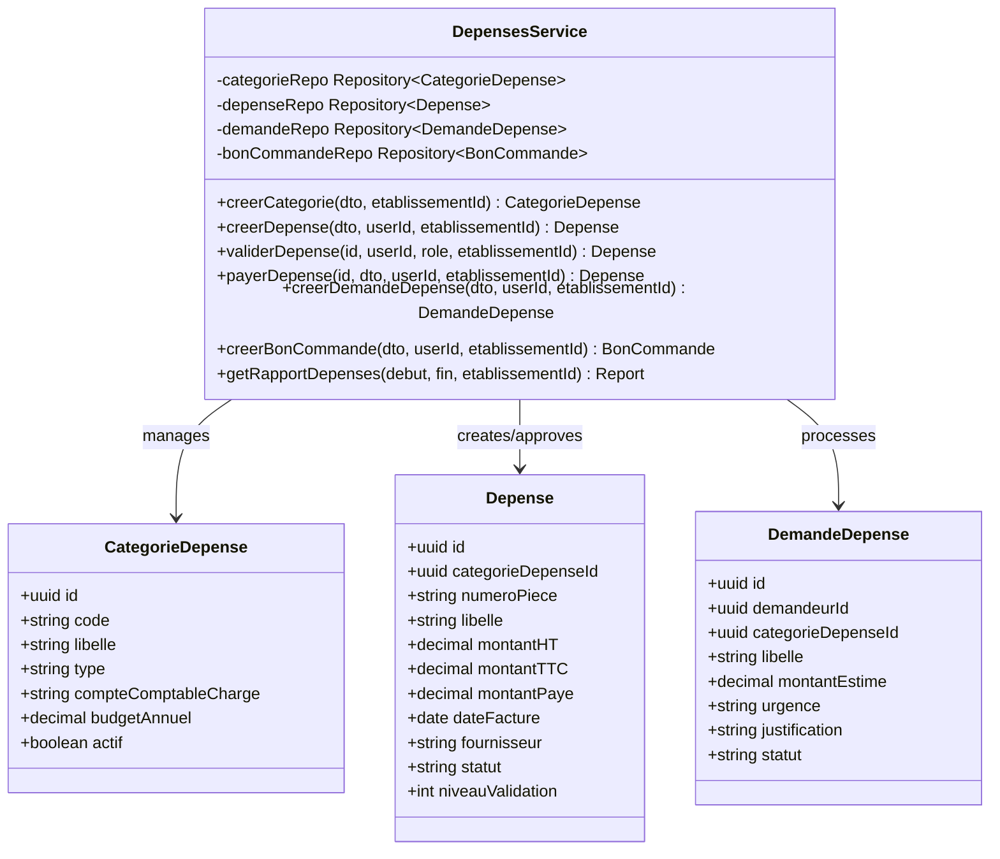

**Diagram sources**
- [depenses.service.ts:22-35](file://backend/src/modules/finances/services/depenses.service.ts#L22-L35)
- [depenses.entity.ts:24-171](file://backend/src/modules/finances/entities/depenses.entity.ts#L24-L171)

**Section sources**
- [scolarite.service.ts:1-908](file://backend/src/modules/finances/services/scolarite.service.ts#L1-L908)
- [depenses.service.ts:1-535](file://backend/src/modules/finances/services/depenses.service.ts#L1-L535)

## Entity Relationships

### Comprehensive Entity Model

The module implements a comprehensive entity relationship model supporting complex financial operations:

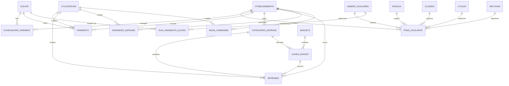

**Diagram sources**
- [010-module-finances.sql:16-382](file://backend/database/migrations/010-module-finances.sql#L16-L382)
- [011-module-finances-part2.sql:14-193](file://backend/database/migrations/011-module-finances-part2.sql#L14-L193)

**Section sources**
- [frais-scolarite.entity.ts:9-15](file://backend/src/modules/finances/entities/frais-scolarite.entity.ts#L9-L15)
- [depenses.entity.ts:9-16](file://backend/src/modules/finances/entities/depenses.entity.ts#L9-L16)

## Performance Considerations

### Database Optimization Strategies

The module implements several performance optimization strategies:

1. **Index Strategy**: Comprehensive indexing on frequently queried columns including establishment ID, date ranges, and status filters
2. **Query Optimization**: Efficient query patterns using joins and aggregation functions
3. **Caching**: Redis-based caching for frequently accessed configuration data
4. **Pagination**: Built-in pagination support for large datasets
5. **Batch Operations**: Support for bulk operations on financial data

### Scalability Features

- **Multi-establishment Support**: Tenant isolation through establishment ID filtering
- **Modular Design**: Independent service modules for easy scaling
- **Asynchronous Processing**: Background jobs for heavy operations
- **Connection Pooling**: Optimized database connection management

## Security Implementation

### Access Control

The module implements comprehensive security measures:

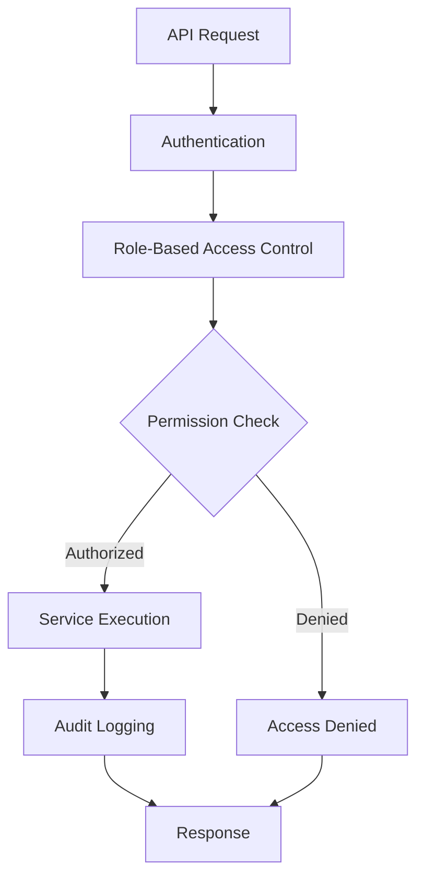

**Diagram sources**
- [finances.controller.ts:17-22](file://backend/src/modules/finances/controllers/finances.controller.ts#L17-L22)

### Security Features

- **Multi-level Authentication**: JWT-based authentication with establishment context
- **Role-based Authorization**: Fine-grained permission system
- **Audit Trails**: Comprehensive logging of all financial operations
- **Data Encryption**: Sensitive data encryption at rest and in transit
- **Input Validation**: Comprehensive DTO validation using Zod schemas
- **SQL Injection Prevention**: TypeORM query builder usage prevents injection attacks

**Section sources**
- [finances.controller.ts:24-40](file://backend/src/modules/finances/controllers/finances.controller.ts#L24-L40)

## New SuiviPaiementEleve Entity

### Detailed Payment Tracking System

**Updated** Added comprehensive payment tracking entity for detailed monitoring of student fee payments with automatic eligibility determination for national exams.

The SuiviPaiementEleve entity provides advanced payment tracking capabilities with contextual awareness for African educational systems:

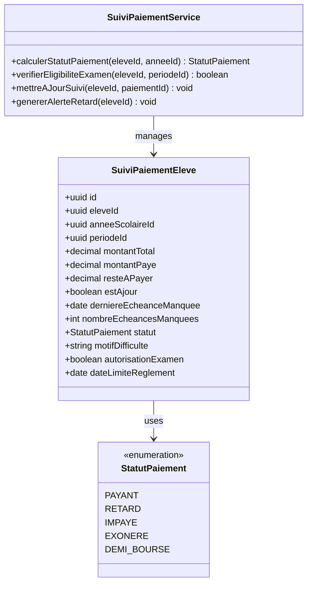

**Diagram sources**
- [ANALYSE-CONTEXTE-AFRICAIN-CAMEROUN.md:342-387](file://ANALYSE-CONTEXTE-AFRICAIN-CAMEROUN.md#L342-L387)

### Key Features

| Feature | Description | Implementation |
|---------|-------------|----------------|
| **Payment Status Tracking** | Real-time monitoring of payment status across all installments | Automatic calculation from payment history |
| **Exam Eligibility** | Automatic determination for BEPC/BAC eligibility | Based on payment status and deadlines |
| **Grace Period Management** | Configurable grace periods with automatic enforcement | Integration with school fee configuration |
| **Difficulty Tracking** | Cause-based categorization of payment difficulties | MotifDifficulte field for social context |
| **Late Payment Alerts** | Automated notifications for overdue payments | Integration with notification system |
| **Period-Specific Monitoring** | Trimester-based payment tracking | PeriodeId linking to academic periods |

### African Context Integration

The entity includes specific fields designed for African educational contexts:

- **MotifDifficulte**: Captures socioeconomic factors affecting payment ability
- **AutorisationExamen**: Automatic exam eligibility determination
- **DateLimiteReglement**: Institutional deadline management
- **PeriodeId**: Academic period linkage for exam scheduling

### Automatic Eligibility Determination

The system automatically determines exam eligibility based on payment status:

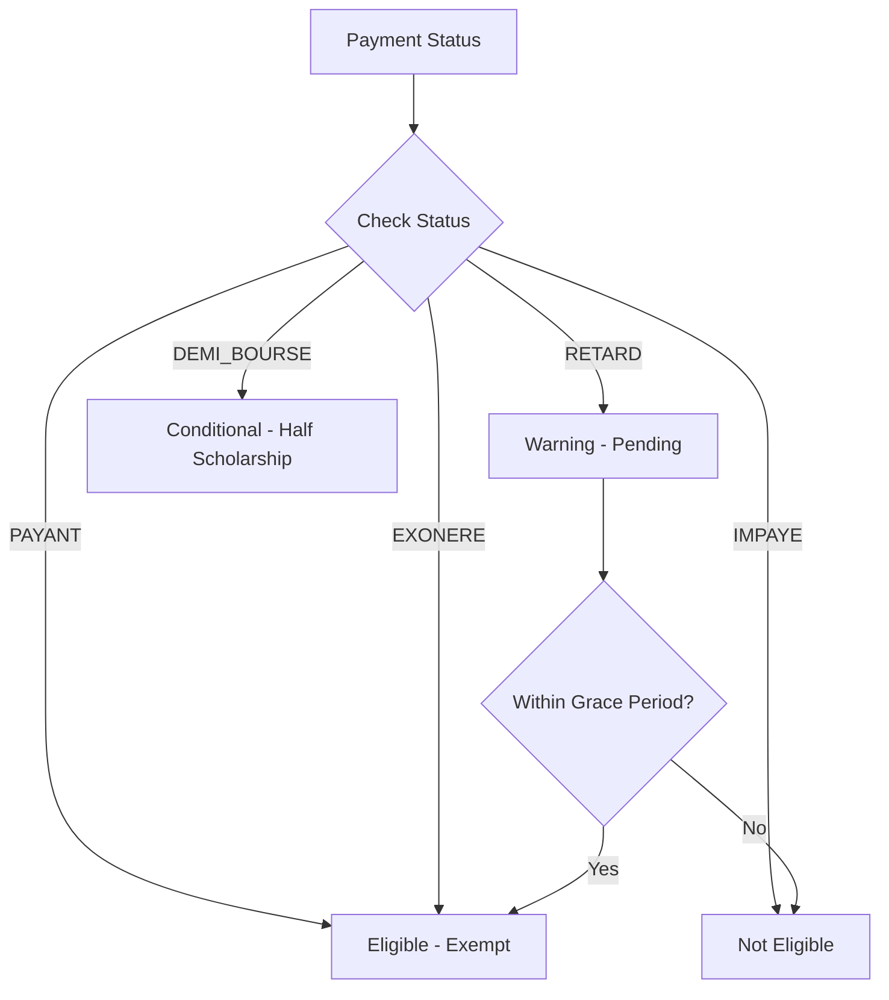

**Diagram sources**
- [ANALYSE-CONTEXTE-AFRICAIN-CAMEROUN.md:378-387](file://ANALYSE-CONTEXTE-AFRICAIN-CAMEROUN.md#L378-L387)

**Section sources**
- [ANALYSE-CONTEXTE-AFRICAIN-CAMEROUN.md:342-387](file://ANALYSE-CONTEXTE-AFRICAIN-CAMEROUN.md#L342-L387)

## Conclusion

The Financial Management Module represents a comprehensive, enterprise-grade solution for educational institution financial management. The module successfully integrates multiple financial domains including student fee collection, expense management, budget control, treasury operations, and financial reporting.

**Updated** The addition of the SuiviPaiementEleve entity significantly enhances the module's capabilities by providing detailed payment tracking with automatic exam eligibility determination and grace period management tailored for African educational contexts.

Key strengths of the implementation include:

- **Robust Architecture**: Clean separation of concerns with clear service boundaries
- **Comprehensive Workflows**: Multi-level approval processes with flexible configuration
- **Scalable Design**: Support for multiple establishments with tenant isolation
- **Enterprise Features**: Audit trails, notifications, and comprehensive reporting
- **Flexible Configuration**: 74 configurable parameters for customization
- **Security Focus**: Multi-layered security with role-based access control
- **Contextual Intelligence**: African-specific features for exam eligibility and payment tracking
- **Automated Compliance**: Automatic determination of exam eligibility based on payment status

The module provides a solid foundation for financial operations in educational institutions while maintaining flexibility for future enhancements and institutional-specific requirements. The new payment tracking capabilities ensure proper monitoring of student fee payments and automatic determination of exam eligibility, supporting both institutional policy and student success outcomes.