# Institutional Configuration

<cite>
**Referenced Files in This Document**
- [configuration.controller.ts](file://backend/src/modules/configuration/controllers/configuration.controller.ts)
- [configuration.dto.ts](file://backend/src/modules/configuration/dto/configuration.dto.ts)
- [configuration-app.entity.ts](file://backend/src/modules/configuration/entities/configuration-app.entity.ts)
- [configuration-module.entity.ts](file://backend/src/modules/configuration/entities/configuration-module.entity.ts)
- [historique-configuration.entity.ts](file://backend/src/modules/configuration/entities/historique-configuration.entity.ts)
- [parametre-systeme.entity.ts](file://backend/src/modules/configuration/entities/parametre-systeme.entity.ts)
- [config.guard.ts](file://backend/src/modules/configuration/guards/config.guard.ts)
- [config-permissions.ts](file://backend/src/modules/configuration/guards/config-permissions.ts)
- [configuration-history.service.ts](file://backend/src/modules/configuration/services/configuration-history.service.ts)
- [configuration-listener.ts](file://backend/src/modules/configuration/services/configuration-listener.ts)
- [configuration-seed.service.ts](file://backend/src/modules/configuration/services/configuration-seed.service.ts)
- [configuration.service.ts](file://backend/src/modules/configuration/services/configuration.service.ts)
- [config.helper.ts](file://backend/src/modules/configuration/utils/config.helper.ts)
- [module-active.middleware.ts](file://backend/src/modules/configuration/middlewares/module-active.middleware.ts)
- [app.ts](file://backend/src/app.ts)
- [index.ts](file://backend/src/modules/configuration/index.ts)
- [initial.seed.ts](file://backend/src/database/seeds/initial.seed.ts)
- [run-seeds.ts](file://backend/src/database/seeds/run-seeds.ts)
- [env.config.ts](file://backend/src/config/env.config.ts)
- [data-source.ts](file://backend/src/database/data-source.ts)
- [005-advanced-config-params.ts](file://backend/src/database/migrations/005-advanced-config-params.ts)
- [005-complete-config-params-100.ts](file://backend/src/database/migrations/005-complete-config-params-100.ts)
- [007-consolider-configuration-app.ts](file://backend/src/database/migrations/007-consolider-configuration-app.ts)
- [config.registry.ts](file://shared/src/config/config.registry.ts)
</cite>

## Update Summary
**Changes Made**
- Added comprehensive module activation middleware system with tenant-aware module state management
- Implemented dynamic access control for 45+ platform modules with dependency validation
- Enhanced configuration service with multi-tenant module activation and comprehensive state management
- Integrated module activation middleware across all platform endpoints in application bootstrap
- Added sophisticated module dependency resolution with auto-activation capabilities
- Expanded configuration listener with module-specific change events and granular cache invalidation

## Table of Contents
1. [Introduction](#introduction)
2. [Project Structure](#project-structure)
3. [Core Components](#core-components)
4. [Architecture Overview](#architecture-overview)
5. [Detailed Component Analysis](#detailed-component-analysis)
6. [Enhanced Configuration Parameters](#enhanced-configuration-parameters)
7. [Module Activation System](#module-activation-system)
8. [Migration System](#migration-system)
9. [Dependency Analysis](#dependency-analysis)
10. [Performance Considerations](#performance-considerations)
11. [Troubleshooting Guide](#troubleshooting-guide)
12. [Conclusion](#conclusion)
13. [Appendices](#appendices)

## Introduction
This document provides comprehensive documentation for the institutional configuration management system, which has undergone a major enhancement with module activation middleware, dynamic access control, and comprehensive tenant-specific settings management. The system now features 45+ platform modules with sophisticated dependency management, real-time module activation/deactivation, and comprehensive audit trails. It covers system-wide settings, module-specific configurations, institutional parameters, and advanced tenant isolation with improved security, performance, and maintainability.

## Project Structure
The institutional configuration module resides under backend/src/modules/configuration and includes controllers, DTOs, entities, guards, services, middlewares, and utilities. The system now features an enhanced module activation system with comprehensive tenant-aware configuration management and dynamic access control.

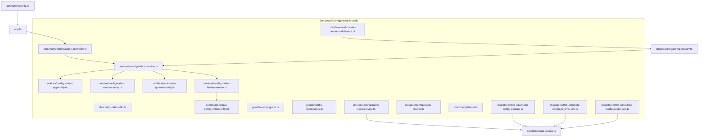

**Diagram sources**
- [configuration.controller.ts](file://backend/src/modules/configuration/controllers/configuration.controller.ts)
- [configuration.service.ts](file://backend/src/modules/configuration/services/configuration.service.ts)
- [configuration-history.service.ts](file://backend/src/modules/configuration/services/configuration-history.service.ts)
- [configuration-seed.service.ts](file://backend/src/modules/configuration/services/configuration-seed.service.ts)
- [configuration-listener.ts](file://backend/src/modules/configuration/services/configuration-listener.ts)
- [configuration-app.entity.ts](file://backend/src/modules/configuration/entities/configuration-app.entity.ts)
- [configuration-module.entity.ts](file://backend/src/modules/configuration/entities/configuration-module.entity.ts)
- [parametre-systeme.entity.ts](file://backend/src/modules/configuration/entities/parametre-systeme.entity.ts)
- [historique-configuration.entity.ts](file://backend/src/modules/configuration/entities/historique-configuration.entity.ts)
- [module-active.middleware.ts](file://backend/src/modules/configuration/middlewares/module-active.middleware.ts)
- [config.registry.ts](file://shared/src/config/config.registry.ts)
- [005-advanced-config-params.ts](file://backend/src/database/migrations/005-advanced-config-params.ts)
- [005-complete-config-params-100.ts](file://backend/src/database/migrations/005-complete-config-params-100.ts)
- [007-consolider-configuration-app.ts](file://backend/src/database/migrations/007-consolider-configuration-app.ts)
- [app.ts](file://backend/src/app.ts)
- [data-source.ts](file://backend/src/database/data-source.ts)
- [env.config.ts](file://backend/src/config/env.config.ts)

**Section sources**
- [configuration.controller.ts](file://backend/src/modules/configuration/controllers/configuration.controller.ts)
- [configuration.service.ts](file://backend/src/modules/configuration/services/configuration.service.ts)
- [configuration-history.service.ts](file://backend/src/modules/configuration/services/configuration-history.service.ts)
- [configuration-seed.service.ts](file://backend/src/modules/configuration/services/configuration-seed.service.ts)
- [configuration-listener.ts](file://backend/src/modules/configuration/services/configuration-listener.ts)
- [configuration-app.entity.ts](file://backend/src/modules/configuration/entities/configuration-app.entity.ts)
- [configuration-module.entity.ts](file://backend/src/modules/configuration/entities/configuration-module.entity.ts)
- [parametre-systeme.entity.ts](file://backend/src/modules/configuration/entities/parametre-systeme.entity.ts)
- [historique-configuration.entity.ts](file://backend/src/modules/configuration/entities/historique-configuration.entity.ts)
- [module-active.middleware.ts](file://backend/src/modules/configuration/middlewares/module-active.middleware.ts)
- [config.registry.ts](file://shared/src/config/config.registry.ts)
- [005-advanced-config-params.ts](file://backend/src/database/migrations/005-advanced-config-params.ts)
- [005-complete-config-params-100.ts](file://backend/src/database/migrations/005-complete-config-params-100.ts)
- [007-consolider-configuration-app.ts](file://backend/src/database/migrations/007-consolider-configuration-app.ts)
- [app.ts](file://backend/src/app.ts)
- [data-source.ts](file://backend/src/database/data-source.ts)
- [env.config.ts](file://backend/src/config/env.config.ts)

## Core Components
The enhanced configuration system now includes comprehensive module activation management with 45+ platform modules, tenant-aware configuration, and sophisticated dependency resolution:

- **Controllers**: Expose endpoints for managing institutional configuration with enhanced validation, real-time updates, and module activation controls
- **Services**: Implement business logic for configuration CRUD operations, history tracking, seed data management, advanced listener mechanisms, and comprehensive module state management
- **Entities**: Define relational models for configuration-app, configuration-module, parametre-systeme, and historique-configuration with expanded parameter sets and tenant isolation
- **Guards**: Enforce access control and permission checks with enhanced validation capabilities and module activation verification
- **Middlewares**: Provide module activation middleware with tenant-aware access control and dynamic module state validation
- **Utilities**: Offer helper functions for configuration operations, transformations, advanced parameter validation, and module activation checks
- **DTOs**: Define structured input/output contracts with comprehensive validation schemas and module activation controls
- **Migrations**: Support systematic parameter deployment, configuration consolidation, and module activation state management
- **Audit Trail**: Comprehensive logging of all configuration changes with detailed snapshots and module activation events
- **Module Registry**: Centralized configuration registry defining 45+ modules with dependencies, permissions, and default settings

Key enhancements:
- **Comprehensive Module Activation**: 45+ platform modules with dynamic activation/deactivation and tenant isolation
- **Advanced Dependency Management**: Sophisticated dependency resolution with auto-activation capabilities
- **Tenant-Aware Configuration**: Multi-tenant module activation with institution-specific overrides
- **Dynamic Access Control**: Real-time module access verification with critical module bypass
- **Enhanced Validation**: Comprehensive validation capabilities for parameter integrity, type safety, and module dependencies
- **Real-time Listeners**: Dynamic update propagation across system architecture with module-specific events
- **Consolidated Configuration**: Unified configuration management with improved organization and tenant isolation
- **Enhanced Security**: Advanced permission systems, audit trail compliance, and module activation controls

**Section sources**
- [configuration.controller.ts](file://backend/src/modules/configuration/controllers/configuration.controller.ts)
- [configuration.service.ts](file://backend/src/modules/configuration/services/configuration.service.ts)
- [configuration-history.service.ts](file://backend/src/modules/configuration/services/configuration-history.service.ts)
- [configuration-seed.service.ts](file://backend/src/modules/configuration/services/configuration-seed.service.ts)
- [configuration-listener.ts](file://backend/src/modules/configuration/services/configuration-listener.ts)
- [configuration-app.entity.ts](file://backend/src/modules/configuration/entities/configuration-app.entity.ts)
- [configuration-module.entity.ts](file://backend/src/modules/configuration/entities/configuration-module.entity.ts)
- [parametre-systeme.entity.ts](file://backend/src/modules/configuration/entities/parametre-systeme.entity.ts)
- [historique-configuration.entity.ts](file://backend/src/modules/configuration/entities/historique-configuration.entity.ts)
- [module-active.middleware.ts](file://backend/src/modules/configuration/middlewares/module-active.middleware.ts)
- [config.guard.ts](file://backend/src/modules/configuration/guards/config.guard.ts)
- [config-permissions.ts](file://backend/src/modules/configuration/guards/config-permissions.ts)
- [config.helper.ts](file://backend/src/modules/configuration/utils/config.helper.ts)
- [configuration.dto.ts](file://backend/src/modules/configuration/dto/configuration.dto.ts)
- [config.registry.ts](file://shared/src/config/config.registry.ts)

## Architecture Overview
The enhanced configuration module follows an improved layered architecture with advanced validation, real-time listeners, comprehensive audit capabilities, and sophisticated module activation management:

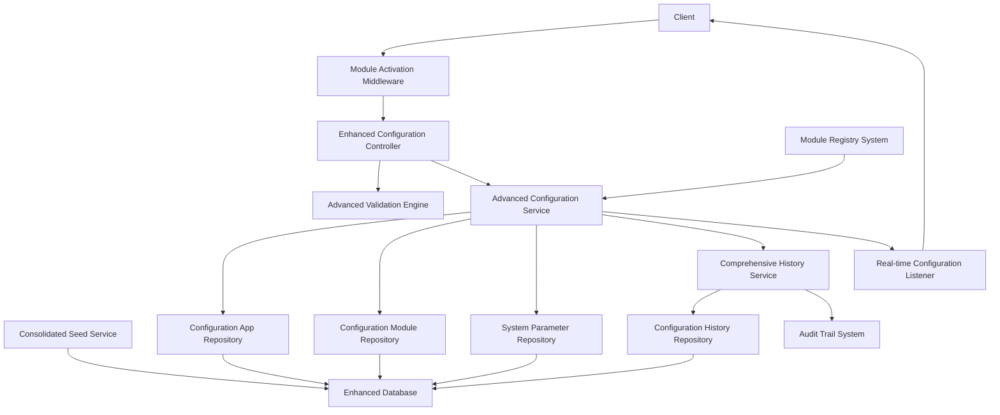

**Diagram sources**
- [configuration.controller.ts](file://backend/src/modules/configuration/controllers/configuration.controller.ts)
- [configuration.service.ts](file://backend/src/modules/configuration/services/configuration.service.ts)
- [configuration-history.service.ts](file://backend/src/modules/configuration/services/configuration-history.service.ts)
- [configuration-seed.service.ts](file://backend/src/modules/configuration/services/configuration-seed.service.ts)
- [configuration-listener.ts](file://backend/src/modules/configuration/services/configuration-listener.ts)
- [module-active.middleware.ts](file://backend/src/modules/configuration/middlewares/module-active.middleware.ts)
- [config.registry.ts](file://shared/src/config/config.registry.ts)
- [configuration-app.entity.ts](file://backend/src/modules/configuration/entities/configuration-app.entity.ts)
- [configuration-module.entity.ts](file://backend/src/modules/configuration/entities/configuration-module.entity.ts)
- [parametre-systeme.entity.ts](file://backend/src/modules/configuration/entities/parametre-systeme.entity.ts)
- [historique-configuration.entity.ts](file://backend/src/modules/configuration/entities/historique-configuration.entity.ts)

## Detailed Component Analysis

### Enhanced Entity Model and Relationships
The configuration domain now defines four primary entities with expanded parameter sets, tenant isolation, and improved relationships supporting 45+ platform modules with comprehensive activation state management:

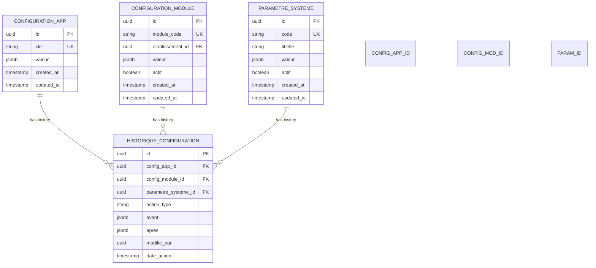

**Diagram sources**
- [configuration-app.entity.ts](file://backend/src/modules/configuration/entities/configuration-app.entity.ts)
- [configuration-module.entity.ts](file://backend/src/modules/configuration/entities/configuration-module.entity.ts)
- [parametre-systeme.entity.ts](file://backend/src/modules/configuration/entities/parametre-systeme.entity.ts)
- [historique-configuration.entity.ts](file://backend/src/modules/configuration/entities/historique-configuration.entity.ts)

**Section sources**
- [configuration-app.entity.ts](file://backend/src/modules/configuration/entities/configuration-app.entity.ts)
- [configuration-module.entity.ts](file://backend/src/modules/configuration/entities/configuration-module.entity.ts)
- [parametre-systeme.entity.ts](file://backend/src/modules/configuration/entities/parametre-systeme.entity.ts)
- [historique-configuration.entity.ts](file://backend/src/modules/configuration/entities/historique-configuration.entity.ts)

### Advanced Configuration Service Architecture
The enhanced configuration service orchestrates CRUD operations with comprehensive validation, history logging, advanced listener notifications, and sophisticated module activation management. It coordinates repositories for configuration-app, configuration-module, and parametre-systeme entities with support for 45+ platform modules and tenant isolation.

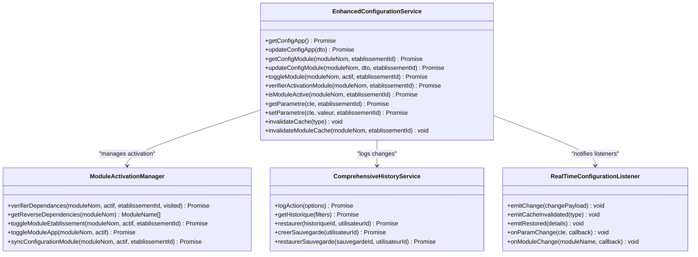

**Diagram sources**
- [configuration.service.ts](file://backend/src/modules/configuration/services/configuration.service.ts)
- [configuration-history.service.ts](file://backend/src/modules/configuration/services/configuration-history.service.ts)
- [configuration-listener.ts](file://backend/src/modules/configuration/services/configuration-listener.ts)

**Section sources**
- [configuration.service.ts](file://backend/src/modules/configuration/services/configuration.service.ts)
- [configuration-history.service.ts](file://backend/src/modules/configuration/services/configuration-history.service.ts)
- [configuration-listener.ts](file://backend/src/modules/configuration/services/configuration-listener.ts)

### Enhanced Module Activation Middleware
The module activation middleware provides real-time validation of module activation status with tenant awareness, critical module bypass, and comprehensive audit logging for all access attempts.

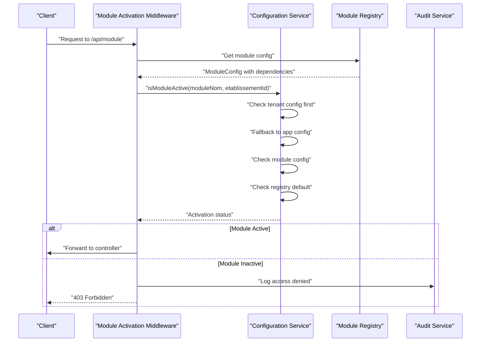

**Diagram sources**
- [module-active.middleware.ts](file://backend/src/modules/configuration/middlewares/module-active.middleware.ts)
- [configuration.service.ts](file://backend/src/modules/configuration/services/configuration.service.ts)
- [config.registry.ts](file://shared/src/config/config.registry.ts)

**Section sources**
- [module-active.middleware.ts](file://backend/src/modules/configuration/middlewares/module-active.middleware.ts)
- [configuration.service.ts](file://backend/src/modules/configuration/services/configuration.service.ts)
- [config.registry.ts](file://shared/src/config/config.registry.ts)

### Comprehensive Module Registry System
The centralized module registry defines 45+ platform modules with comprehensive configuration, dependencies, permissions, and default settings for dynamic module management.

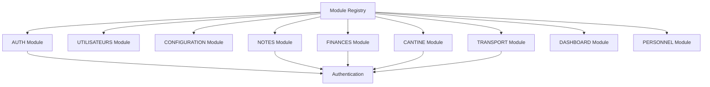

**Diagram sources**
- [config.registry.ts](file://shared/src/config/config.registry.ts)

**Section sources**
- [config.registry.ts](file://shared/src/config/config.registry.ts)

### Enhanced Configuration Listener Mechanism
The advanced listener service enables real-time propagation of configuration changes across the system with subscription management, broadcast capabilities, and module-specific event handling.

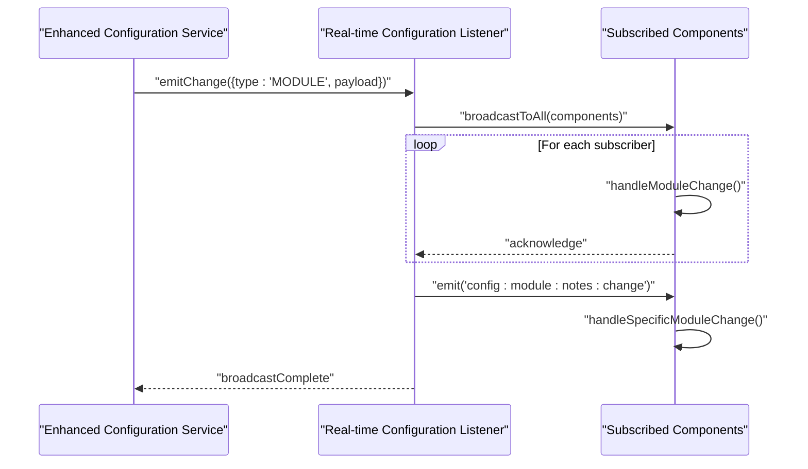

**Diagram sources**
- [configuration.controller.ts](file://backend/src/modules/configuration/controllers/configuration.controller.ts)
- [configuration.service.ts](file://backend/src/modules/configuration/services/configuration.service.ts)
- [configuration-listener.ts](file://backend/src/modules/configuration/services/configuration-listener.ts)

**Section sources**
- [configuration.controller.ts](file://backend/src/modules/configuration/controllers/configuration.controller.ts)
- [configuration.service.ts](file://backend/src/modules/configuration/services/configuration.service.ts)
- [configuration-listener.ts](file://backend/src/modules/configuration/services/configuration-listener.ts)

### Consolidated Seed Data Management
Enhanced seed data management initializes institutional configuration with comprehensive module activation states, tenant-specific settings, and consolidated configuration approach.

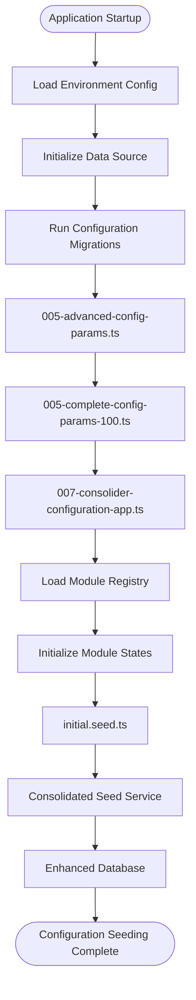

**Diagram sources**
- [initial.seed.ts](file://backend/src/database/seeds/initial.seed.ts)
- [run-seeds.ts](file://backend/src/database/seeds/run-seeds.ts)
- [configuration-seed.service.ts](file://backend/src/modules/configuration/services/configuration-seed.service.ts)
- [data-source.ts](file://backend/src/database/data-source.ts)
- [env.config.ts](file://backend/src/config/env.config.ts)
- [005-advanced-config-params.ts](file://backend/src/database/migrations/005-advanced-config-params.ts)
- [005-complete-config-params-100.ts](file://backend/src/database/migrations/005-complete-config-params-100.ts)
- [007-consolider-configuration-app.ts](file://backend/src/database/migrations/007-consolider-configuration-app.ts)
- [config.registry.ts](file://shared/src/config/config.registry.ts)

**Section sources**
- [initial.seed.ts](file://backend/src/database/seeds/initial.seed.ts)
- [run-seeds.ts](file://backend/src/database/seeds/run-seeds.ts)
- [configuration-seed.service.ts](file://backend/src/modules/configuration/services/configuration-seed.service.ts)
- [data-source.ts](file://backend/src/database/data-source.ts)
- [env.config.ts](file://backend/src/config/env.config.ts)
- [005-advanced-config-params.ts](file://backend/src/database/migrations/005-advanced-config-params.ts)
- [005-complete-config-params-100.ts](file://backend/src/database/migrations/005-complete-config-params-100.ts)
- [007-consolider-configuration-app.ts](file://backend/src/database/migrations/007-consolider-configuration-app.ts)
- [config.registry.ts](file://shared/src/config/config.registry.ts)

### Enhanced Guards and Permission Systems
Access control ensures only authorized users can modify configuration with advanced validation, comprehensive permission enforcement, and module activation verification across 45+ platform modules.

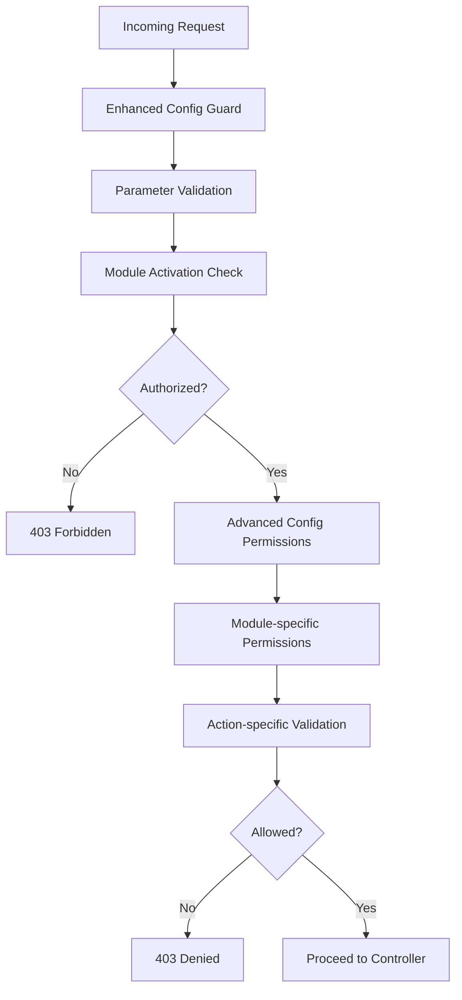

**Diagram sources**
- [config.guard.ts](file://backend/src/modules/configuration/guards/config.guard.ts)
- [config-permissions.ts](file://backend/src/modules/configuration/guards/config-permissions.ts)

**Section sources**
- [config.guard.ts](file://backend/src/modules/configuration/guards/config.guard.ts)
- [config-permissions.ts](file://backend/src/modules/configuration/guards/config-permissions.ts)

### Advanced Configuration Helper Utilities
Enhanced helper utilities streamline common configuration operations with comprehensive validation, parameter transformation, advanced configuration management, and module activation checks.

**Section sources**
- [config.helper.ts](file://backend/src/modules/configuration/utils/config.helper.ts)

### Comprehensive Audit Trail Functionality
Every configuration change is recorded in the enhanced history entity with detailed before/after snapshots, comprehensive actor identification, timestamps, module-specific audit trails, and module activation events.

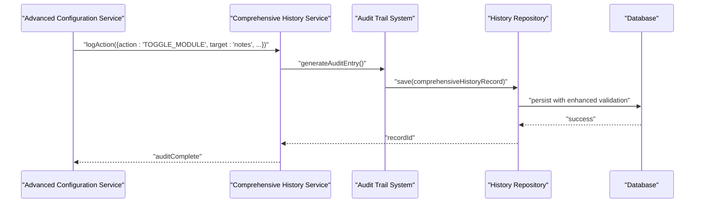

**Diagram sources**
- [configuration-history.service.ts](file://backend/src/modules/configuration/services/configuration-history.service.ts)
- [historique-configuration.entity.ts](file://backend/src/modules/configuration/entities/historique-configuration.entity.ts)

**Section sources**
- [configuration-history.service.ts](file://backend/src/modules/configuration/services/configuration-history.service.ts)
- [historique-configuration.entity.ts](file://backend/src/modules/configuration/entities/historique-configuration.entity.ts)

## Enhanced Configuration Parameters
The system now supports comprehensive configuration management across 45+ platform modules with sophisticated tenant isolation and dependency management:

### Critical System Modules
- **Authentication & Security**: User authentication, session management, 2FA requirements, and security policies
- **User Management**: Role-based access control, user provisioning, and administrative permissions
- **Configuration Management**: System-wide settings, module activation controls, and parameter management

### Academic Modules
- **Academic Records**: Student grades, transcripts, academic standing, and degree requirements
- **Course Management**: Curriculum design, course scheduling, and academic calendar management
- **Assessment Systems**: Exam administration, grade calculation, and academic evaluation workflows

### Administrative Modules  
- **Student Services**: Enrollment management, academic advising, and student support services
- **Staff Management**: Employee records, payroll integration, and HR workflows
- **Financial Operations**: Tuition billing, payment processing, and financial aid management

### Infrastructure Modules
- **Facilities Management**: Classroom scheduling, facility reservations, and resource allocation
- **Transportation**: Student transportation, route planning, and fleet management
- **Catering Services**: Meal programs, dietary accommodations, and nutrition tracking

### Communication Modules
- **Notification Systems**: Multi-channel communication, automated alerts, and messaging workflows
- **Reporting**: Custom reports, data exports, and analytics dashboards
- **Integration Points**: API management, external system integration, and data synchronization

### Specialized Modules
- **Extracurricular Activities**: Club management, activity scheduling, and participation tracking
- **Library Services**: Resource management, borrowing systems, and digital collections
- **Health Services**: Medical records, health monitoring, and wellness programs
- **Career Services**: Placement tracking, alumni networks, and career development programs

**Section sources**
- [005-advanced-config-params.ts](file://backend/src/database/migrations/005-advanced-config-params.ts)
- [005-complete-config-params-100.ts](file://backend/src/database/migrations/005-complete-config-params-100.ts)
- [config.registry.ts](file://shared/src/config/config.registry.ts)

## Module Activation System
The enhanced module activation system provides comprehensive control over 45+ platform modules with tenant isolation, dependency management, and real-time activation controls:

### Module Activation Architecture
1. **Centralized Registry**: 45+ modules defined with dependencies, permissions, and default settings
2. **Tenant Isolation**: Individual institution activation states with global fallback
3. **Dependency Resolution**: Automatic activation of required modules with circular dependency detection
4. **Real-time Validation**: Middleware-based activation checking for all module endpoints
5. **Audit Tracking**: Comprehensive logging of all activation changes and access attempts

### Activation State Management
- **Priority Resolution**: Tenant-specific activation overrides global settings
- **Fallback Mechanisms**: Graceful degradation to default module states
- **Cache Optimization**: 30-second TTL for activation state caching with granular invalidation
- **Reverse Dependencies**: Automatic deactivation of dependent modules when prerequisites are removed

### Critical Module Bypass
Certain modules maintain constant accessibility regardless of activation state:
- **Authentication**: User login and security management
- **User Management**: Account administration and profile management  
- **Configuration**: System settings and module management
- **Notifications**: System alerts and administrative communications

### Dependency Management Features
- **Auto-Activation**: Required dependencies automatically activated when parent module enables
- **Circular Detection**: Prevention of circular dependency chains with detailed error reporting
- **Reverse Dependency Checking**: Validation that dependent modules are disabled before removal
- **Batch Operations**: Coordinated activation/deactivation across multiple modules

**Section sources**
- [module-active.middleware.ts](file://backend/src/modules/configuration/middlewares/module-active.middleware.ts)
- [configuration.service.ts](file://backend/src/modules/configuration/services/configuration.service.ts)
- [config.registry.ts](file://shared/src/config/config.registry.ts)
- [app.ts](file://backend/src/app.ts)

## Migration System
The enhanced migration system provides systematic deployment of configuration parameters with comprehensive validation, rollback capabilities, and module activation state management:

### Migration Pipeline
1. **Parameter Definition**: Define comprehensive parameters with validation schemas and tenant scoping
2. **Module Assignment**: Assign parameters to 45+ platform modules with dependency considerations
3. **Activation State**: Configure default module activation states with tenant overrides
4. **Validation Testing**: Test parameter integrity, type safety, and module dependency resolution
5. **Deployment**: Deploy parameters to production environment with activation state management
6. **Rollback**: Maintain rollback capabilities for failed deployments with state restoration

### Migration Features
- **Batch Processing**: Handle multiple parameter updates and module activations efficiently
- **Validation Integration**: Comprehensive parameter validation during migration with dependency checks
- **Error Handling**: Robust error handling with detailed failure reports and partial rollback support
- **Progress Tracking**: Monitor migration progress and completion status across all modules
- **Backup Integration**: Automatic backup creation before parameter deployment and activation changes
- **Tenant Awareness**: Apply tenant-specific overrides and activation states during migration

**Section sources**
- [005-advanced-config-params.ts](file://backend/src/database/migrations/005-advanced-config-params.ts)
- [005-complete-config-params-100.ts](file://backend/src/database/migrations/005-complete-config-params-100.ts)
- [007-consolider-configuration-app.ts](file://backend/src/database/migrations/007-consolider-configuration-app.ts)

## Dependency Analysis
The enhanced configuration module depends on:
- Application bootstrap for controller registration, middleware integration, and module activation routing
- Database data source for persistence operations with enhanced validation and tenant isolation
- Environment configuration for runtime settings and module activation defaults
- Migration system for parameter deployment and module activation state management
- Seed runner for consolidated initialization with tenant-specific configurations
- Module registry for centralized module definition and dependency management

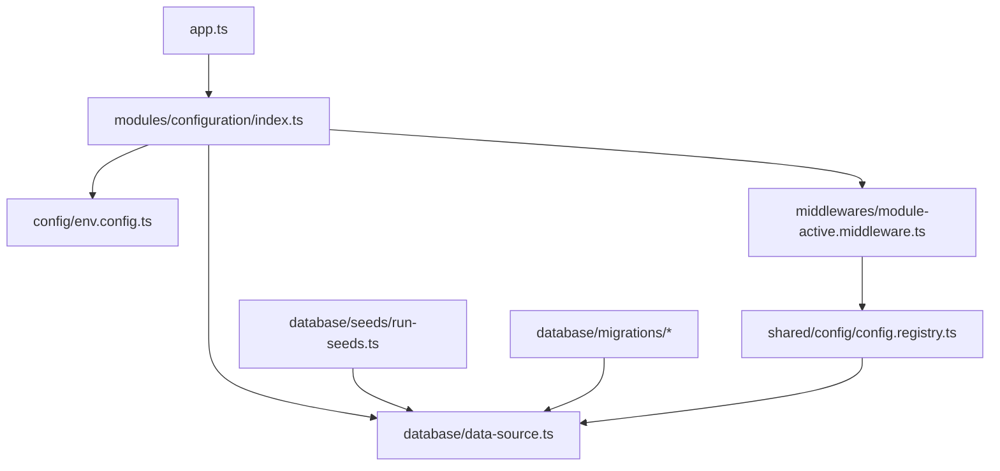

**Diagram sources**
- [app.ts](file://backend/src/app.ts)
- [index.ts](file://backend/src/modules/configuration/index.ts)
- [data-source.ts](file://backend/src/database/data-source.ts)
- [env.config.ts](file://backend/src/config/env.config.ts)
- [run-seeds.ts](file://backend/src/database/seeds/run-seeds.ts)
- [005-advanced-config-params.ts](file://backend/src/database/migrations/005-advanced-config-params.ts)
- [005-complete-config-params-100.ts](file://backend/src/database/migrations/005-complete-config-params-100.ts)
- [007-consolider-configuration-app.ts](file://backend/src/database/migrations/007-consolider-configuration-app.ts)
- [config.registry.ts](file://shared/src/config/config.registry.ts)
- [module-active.middleware.ts](file://backend/src/modules/configuration/middlewares/module-active.middleware.ts)

**Section sources**
- [app.ts](file://backend/src/app.ts)
- [index.ts](file://backend/src/modules/configuration/index.ts)
- [data-source.ts](file://backend/src/database/data-source.ts)
- [env.config.ts](file://backend/src/config/env.config.ts)
- [run-seeds.ts](file://backend/src/database/seeds/run-seeds.ts)
- [005-advanced-config-params.ts](file://backend/src/database/migrations/005-advanced-config-params.ts)
- [005-complete-config-params-100.ts](file://backend/src/database/migrations/005-complete-config-params-100.ts)
- [007-consolider-configuration-app.ts](file://backend/src/database/migrations/007-consolider-configuration-app.ts)
- [config.registry.ts](file://shared/src/config/config.registry.ts)
- [module-active.middleware.ts](file://backend/src/modules/configuration/middlewares/module-active.middleware.ts)

## Performance Considerations
Enhanced performance considerations for the expanded configuration system:
- **Optimized Listener Management**: Efficient subscription handling with automatic cleanup, memory management, and module-specific event filtering
- **Advanced Caching Strategies**: Multi-level caching with parameter-specific invalidation, tenant-aware cache separation, and granular cache invalidation for module activation changes
- **Batch Processing**: Optimized batch operations for parameter updates, bulk configuration changes, and module activation/deactivation sequences
- **Enhanced Query Optimization**: Improved database queries with parameter-specific indexing, tenant-scoped queries, and optimized module activation state resolution
- **Audit Trail Optimization**: Efficient audit log management with configurable retention policies, tenant-specific audit filtering, and archival strategies
- **Migration Performance**: Optimized migration processing with parallel execution, dependency-aware sequencing, and progress monitoring
- **Validation Performance**: Efficient parameter validation with caching, batch validation capabilities, and dependency resolution optimization
- **Module Activation Optimization**: 30-second TTL caching for activation states, tenant-aware query optimization, and reverse dependency precomputation

## Troubleshooting Guide
Enhanced troubleshooting procedures for the expanded configuration system:

### Common Issues and Resolutions
- **Module Activation Failures**: Verify module dependencies are satisfied and circular dependencies are resolved
- **Tenant Configuration Conflicts**: Check tenant-specific overrides and global fallback configurations
- **Migration Rollback**: Use rollback capabilities for failed parameter deployments and module activation changes
- **Listener Subscription Issues**: Check listener registration and component subscription status for module-specific events
- **Audit Trail Inconsistencies**: Verify audit log integrity, timestamp synchronization, and tenant-specific audit filtering
- **Performance Degradation**: Monitor cache effectiveness, optimize query performance, and review module activation state caching
- **Permission Denial**: Verify enhanced permission configurations for module-specific access and tenant isolation
- **Configuration Conflicts**: Resolve parameter conflicts between modules, system-wide settings, and tenant-specific overrides

### Diagnostic Tools
- **Module Health Checks**: Validate all 45+ modules for activation status, dependency satisfaction, and tenant-specific configuration
- **Migration Status Monitoring**: Track migration progress, dependency resolution, and activation state synchronization
- **Audit Trail Analysis**: Generate comprehensive audit reports for compliance, troubleshooting, and module activation tracking
- **Performance Metrics**: Monitor system performance, activation state resolution times, and cache hit rates
- **Dependency Validation**: Analyze module dependency graphs, reverse dependency chains, and auto-activation sequences

**Section sources**
- [config.guard.ts](file://backend/src/modules/configuration/guards/config.guard.ts)
- [config-permissions.ts](file://backend/src/modules/configuration/guards/config-permissions.ts)
- [configuration-history.service.ts](file://backend/src/modules/configuration/services/configuration-history.service.ts)
- [configuration-listener.ts](file://backend/src/modules/configuration/services/configuration-listener.ts)
- [module-active.middleware.ts](file://backend/src/modules/configuration/middlewares/module-active.middleware.ts)
- [configuration.service.ts](file://backend/src/modules/configuration/services/configuration.service.ts)
- [env.config.ts](file://backend/src/config/env.config.ts)
- [005-advanced-config-params.ts](file://backend/src/database/migrations/005-advanced-config-params.ts)
- [005-complete-config-params-100.ts](file://backend/src/database/migrations/005-complete-config-params-100.ts)

## Conclusion
The enhanced institutional configuration module provides a comprehensive foundation for managing system-wide settings, module-specific configurations, and tenant-specific parameters across 45+ platform modules. The system now features sophisticated module activation middleware, dynamic access control, comprehensive dependency management, and enhanced security controls with tenant isolation. With consolidated seed data management, systematic migration deployment, comprehensive audit trails, and improved performance optimizations, the system remains highly maintainable, secure, and responsive to institutional needs while supporting future expansion and customization requirements across multiple educational institutions.

## Appendices

### Practical Examples

#### Setting up Institutional Parameters
- **Parameter Creation**: Create system parameters via endpoints with comprehensive validation, tenant scoping, and schema enforcement
- **Module Assignment**: Assign parameters to appropriate modules with proper validation, dependency resolution, and conflict management
- **Activation Management**: Activate or deactivate modules with comprehensive dependency checking and tenant-specific overrides
- **Bulk Operations**: Use batch processing for efficient parameter updates across multiple modules and tenant configurations

#### Managing Configuration Changes
- **Enhanced Update Process**: Use PATCH endpoints with comprehensive validation for application, module, and parameter configurations
- **Audit Trail Review**: Access detailed history entries for module activation changes, parameter modifications, and tenant-specific updates
- **Real-time Propagation**: Leverage advanced listeners to ensure immediate propagation of configuration changes with module-specific event handling
- **Migration Management**: Use systematic migration processes for parameter deployment, module activation changes, and tenant configuration updates

#### Implementing Module Activation Middleware
- **Endpoint Integration**: Register module activation middleware for all platform endpoints with proper routing and tenant isolation
- **Critical Module Handling**: Configure bypass for critical modules (authentication, user management, configuration) with comprehensive audit logging
- **Dependency Validation**: Implement dependency resolution with auto-activation capabilities and circular dependency prevention
- **Tenant-Specific Controls**: Manage tenant-specific module activation states with global fallback and comprehensive state synchronization

#### Advanced Configuration Operations
- **Parameter Validation**: Leverage enhanced validation capabilities for type safety, data integrity, and tenant scoping
- **Audit Reporting**: Generate comprehensive audit reports for compliance, module activation tracking, and configuration change monitoring
- **Performance Optimization**: Implement caching strategies, query optimization, and module activation state management for large-scale parameter management
- **Security Hardening**: Utilize advanced permission systems, audit trails, and module activation controls for comprehensive security coverage
- **Multi-Tenant Management**: Configure tenant-specific module activation states, parameter overrides, and institutional customization requirements

**Section sources**
- [configuration.controller.ts](file://backend/src/modules/configuration/controllers/configuration.controller.ts)
- [configuration.service.ts](file://backend/src/modules/configuration/services/configuration.service.ts)
- [configuration-history.service.ts](file://backend/src/modules/configuration/services/configuration-history.service.ts)
- [configuration-listener.ts](file://backend/src/modules/configuration/services/configuration-listener.ts)
- [module-active.middleware.ts](file://backend/src/modules/configuration/middlewares/module-active.middleware.ts)
- [configuration.dto.ts](file://backend/src/modules/configuration/dto/configuration.dto.ts)
- [config.registry.ts](file://shared/src/config/config.registry.ts)
- [005-advanced-config-params.ts](file://backend/src/database/migrations/005-advanced-config-params.ts)
- [005-complete-config-params-100.ts](file://backend/src/database/migrations/005-complete-config-params-100.ts)
- [007-consolider-configuration-app.ts](file://backend/src/database/migrations/007-consolider-configuration-app.ts)
- [app.ts](file://backend/src/app.ts)