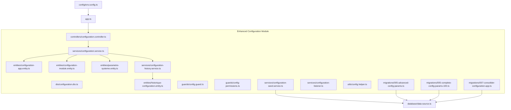
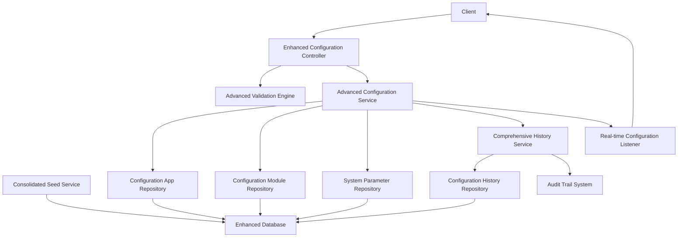
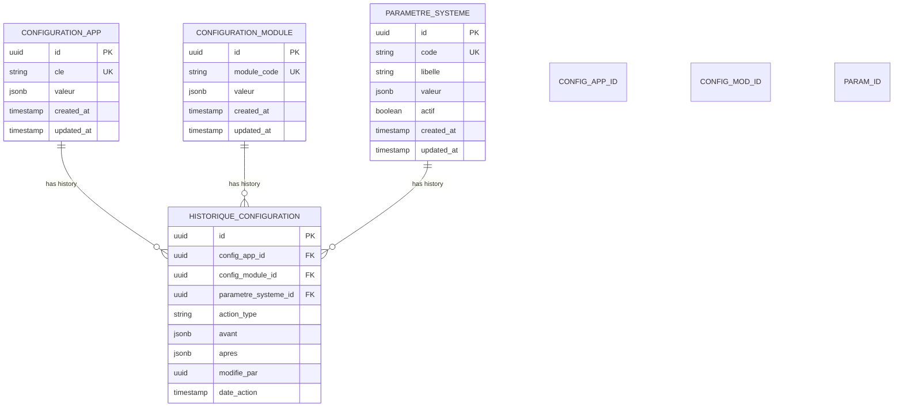
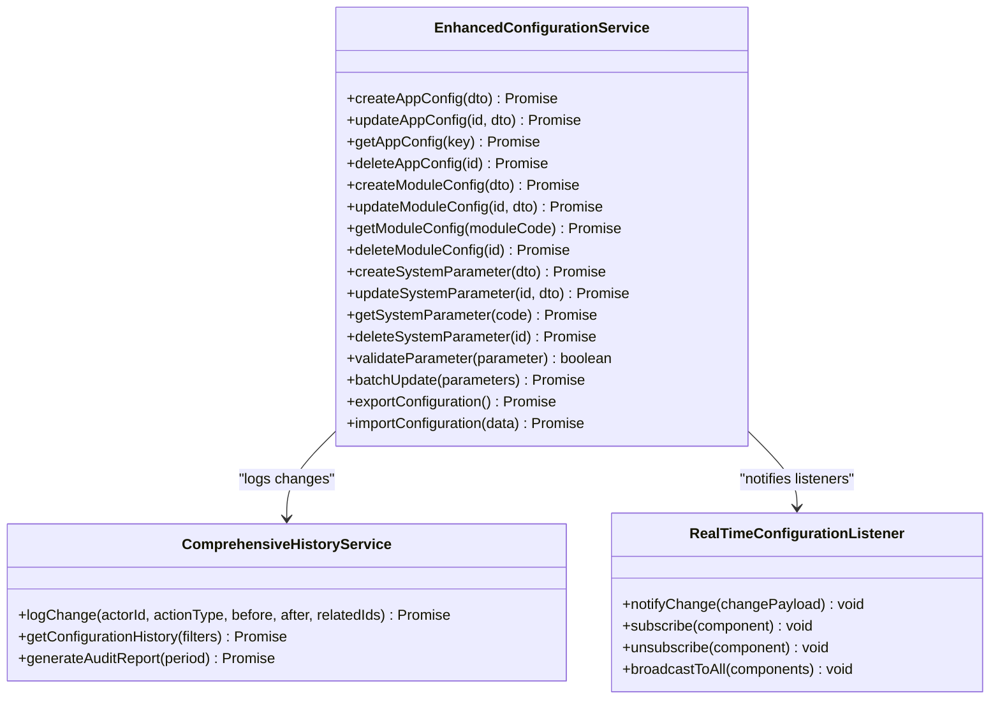
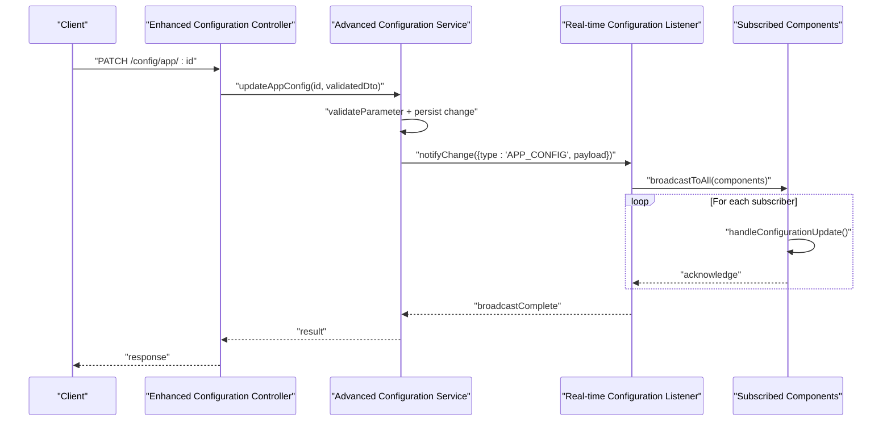
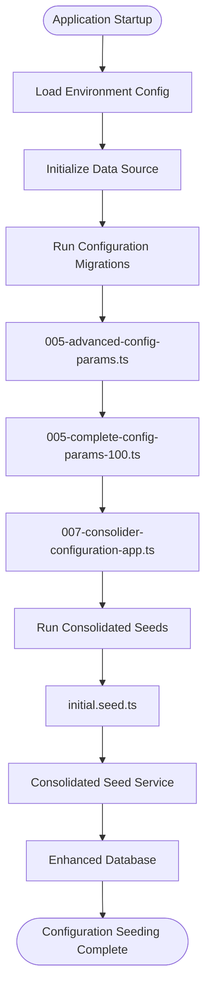
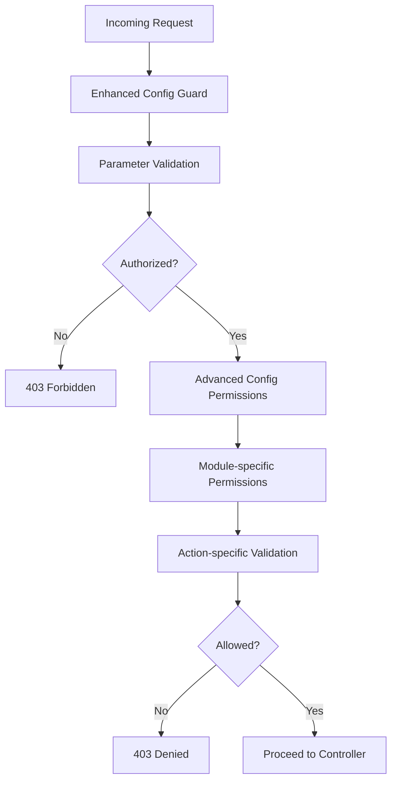
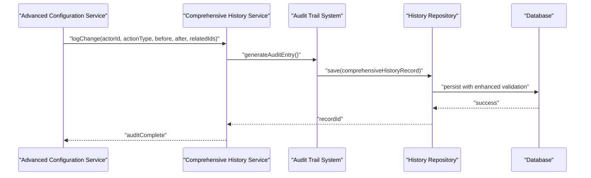
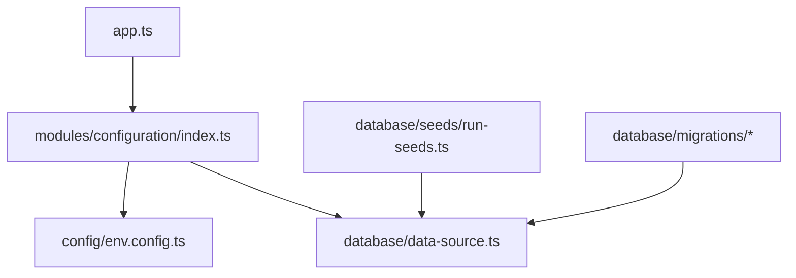

# Institutional Configuration

<cite>
**Referenced Files in This Document**
- [configuration.controller.ts](file://backend/src/modules/configuration/controllers/configuration.controller.ts)
- [configuration.dto.ts](file://backend/src/modules/configuration/dto/configuration.dto.ts)
- [configuration-app.entity.ts](file://backend/src/modules/configuration/entities/configuration-app.entity.ts)
- [configuration-module.entity.ts](file://backend/src/modules/configuration/entities/configuration-module.entity.ts)
- [historique-configuration.entity.ts](file://backend/src/modules/configuration/entities/historique-configuration.entity.ts)
- [parametre-systeme.entity.ts](file://backend/src/modules/configuration/entities/parametre-systeme.entity.ts)
- [config.guard.ts](file://backend/src/modules/configuration/guards/config.guard.ts)
- [config-permissions.ts](file://backend/src/modules/configuration/guards/config-permissions.ts)
- [configuration-history.service.ts](file://backend/src/modules/configuration/services/configuration-history.service.ts)
- [configuration-listener.ts](file://backend/src/modules/configuration/services/configuration-listener.ts)
- [configuration-seed.service.ts](file://backend/src/modules/configuration/services/configuration-seed.service.ts)
- [configuration.service.ts](file://backend/src/modules/configuration/services/configuration.service.ts)
- [config.helper.ts](file://backend/src/modules/configuration/utils/config.helper.ts)
- [app.ts](file://backend/src/app.ts)
- [index.ts](file://backend/src/modules/configuration/index.ts)
- [initial.seed.ts](file://backend/src/database/seeds/initial.seed.ts)
- [run-seeds.ts](file://backend/src/database/seeds/run-seeds.ts)
- [env.config.ts](file://backend/src/config/env.config.ts)
- [data-source.ts](file://backend/src/database/data-source.ts)
- [005-advanced-config-params.ts](file://backend/src/database/migrations/005-advanced-config-params.ts)
- [005-complete-config-params-100.ts](file://backend/src/database/migrations/005-complete-config-params-100.ts)
- [007-consolider-configuration-app.ts](file://backend/src/database/migrations/007-consolider-configuration-app.ts)
</cite>

## Update Summary
**Changes Made**
- Updated entity model to reflect 63 new configuration parameters across 17 modules
- Enhanced validation capabilities and migration system
- Added comprehensive audit trail functionality
- Expanded configuration listener mechanisms for real-time updates
- Improved seed data management with consolidated configuration approach

## Table of Contents
1. [Introduction](#introduction)
2. [Project Structure](#project-structure)
3. [Core Components](#core-components)
4. [Architecture Overview](#architecture-overview)
5. [Detailed Component Analysis](#detailed-component-analysis)
6. [Enhanced Configuration Parameters](#enhanced-configuration-parameters)
7. [Migration System](#migration-system)
8. [Dependency Analysis](#dependency-analysis)
9. [Performance Considerations](#performance-considerations)
10. [Troubleshooting Guide](#troubleshooting-guide)
11. [Conclusion](#conclusion)
12. [Appendices](#appendices)

## Introduction
This document provides comprehensive documentation for the institutional configuration management system, which has undergone a comprehensive overhaul with 63 new parameters across 17 modules. The system now features enhanced validation capabilities, advanced configuration parameters, real-time listeners, and comprehensive audit trails. It covers system-wide settings, module-specific configurations, and institutional parameters with improved security, performance, and maintainability.

## Project Structure
The institutional configuration module resides under backend/src/modules/configuration and includes controllers, DTOs, entities, guards, services, and utilities. The system now features an enhanced migration system with consolidated configuration management and comprehensive audit trail functionality.

**Diagram sources**
- [configuration.controller.ts](file://backend/src/modules/configuration/controllers/configuration.controller.ts)
- [configuration.service.ts](file://backend/src/modules/configuration/services/configuration.service.ts)
- [configuration-history.service.ts](file://backend/src/modules/configuration/services/configuration-history.service.ts)
- [configuration-seed.service.ts](file://backend/src/modules/configuration/services/configuration-seed.service.ts)
- [configuration-listener.ts](file://backend/src/modules/configuration/services/configuration-listener.ts)
- [configuration-app.entity.ts](file://backend/src/modules/configuration/entities/configuration-app.entity.ts)
- [configuration-module.entity.ts](file://backend/src/modules/configuration/entities/configuration-module.entity.ts)
- [parametre-systeme.entity.ts](file://backend/src/modules/configuration/entities/parametre-systeme.entity.ts)
- [historique-configuration.entity.ts](file://backend/src/modules/configuration/entities/historique-configuration.entity.ts)
- [005-advanced-config-params.ts](file://backend/src/database/migrations/005-advanced-config-params.ts)
- [005-complete-config-params-100.ts](file://backend/src/database/migrations/005-complete-config-params-100.ts)
- [007-consolider-configuration-app.ts](file://backend/src/database/migrations/007-consolider-configuration-app.ts)
- [app.ts](file://backend/src/app.ts)
- [data-source.ts](file://backend/src/database/data-source.ts)
- [env.config.ts](file://backend/src/config/env.config.ts)

**Section sources**
- [configuration.controller.ts](file://backend/src/modules/configuration/controllers/configuration.controller.ts)
- [configuration.service.ts](file://backend/src/modules/configuration/services/configuration.service.ts)
- [configuration-history.service.ts](file://backend/src/modules/configuration/services/configuration-history.service.ts)
- [configuration-seed.service.ts](file://backend/src/modules/configuration/services/configuration-seed.service.ts)
- [configuration-listener.ts](file://backend/src/modules/configuration/services/configuration-listener.ts)
- [configuration-app.entity.ts](file://backend/src/modules/configuration/entities/configuration-app.entity.ts)
- [configuration-module.entity.ts](file://backend/src/modules/configuration/entities/configuration-module.entity.ts)
- [parametre-systeme.entity.ts](file://backend/src/modules/configuration/entities/parametre-systeme.entity.ts)
- [historique-configuration.entity.ts](file://backend/src/modules/configuration/entities/historique-configuration.entity.ts)
- [005-advanced-config-params.ts](file://backend/src/database/migrations/005-advanced-config-params.ts)
- [005-complete-config-params-100.ts](file://backend/src/database/migrations/005-complete-config-params-100.ts)
- [007-consolider-configuration-app.ts](file://backend/src/database/migrations/007-consolider-configuration-app.ts)
- [app.ts](file://backend/src/app.ts)
- [data-source.ts](file://backend/src/database/data-source.ts)
- [env.config.ts](file://backend/src/config/env.config.ts)

## Core Components
The enhanced configuration system now includes 63 new parameters across 17 modules with improved validation, real-time listeners, and comprehensive audit trails:

- **Controllers**: Expose endpoints for managing institutional configuration with enhanced validation and real-time updates
- **Services**: Implement business logic for configuration CRUD operations, history tracking, seed data management, and advanced listener mechanisms
- **Entities**: Define relational models for configuration-app, configuration-module, parametre-systeme, and historique-configuration with expanded parameter sets
- **Guards**: Enforce access control and permission checks with enhanced validation capabilities
- **Utilities**: Provide helper functions for configuration operations, transformations, and advanced parameter validation
- **DTOs**: Define structured input/output contracts with comprehensive validation schemas
- **Migrations**: Support systematic parameter deployment and configuration consolidation
- **Audit Trail**: Comprehensive logging of all configuration changes with detailed snapshots

Key enhancements:
- **Expanded Parameter Set**: 63 new parameters across 17 modules for enhanced institutional control
- **Advanced Validation**: Comprehensive validation capabilities for parameter integrity and type safety
- **Real-time Listeners**: Dynamic update propagation across the system architecture
- **Consolidated Configuration**: Unified configuration management with improved organization
- **Enhanced Security**: Advanced permission systems and audit trail compliance

**Section sources**
- [configuration.controller.ts](file://backend/src/modules/configuration/controllers/configuration.controller.ts)
- [configuration.service.ts](file://backend/src/modules/configuration/services/configuration.service.ts)
- [configuration-history.service.ts](file://backend/src/modules/configuration/services/configuration-history.service.ts)
- [configuration-seed.service.ts](file://backend/src/modules/configuration/services/configuration-seed.service.ts)
- [configuration-listener.ts](file://backend/src/modules/configuration/services/configuration-listener.ts)
- [configuration-app.entity.ts](file://backend/src/modules/configuration/entities/configuration-app.entity.ts)
- [configuration-module.entity.ts](file://backend/src/modules/configuration/entities/configuration-module.entity.ts)
- [parametre-systeme.entity.ts](file://backend/src/modules/configuration/entities/parametre-systeme.entity.ts)
- [historique-configuration.entity.ts](file://backend/src/modules/configuration/entities/historique-configuration.entity.ts)
- [config.guard.ts](file://backend/src/modules/configuration/guards/config.guard.ts)
- [config-permissions.ts](file://backend/src/modules/configuration/guards/config-permissions.ts)
- [config.helper.ts](file://backend/src/modules/configuration/utils/config.helper.ts)
- [configuration.dto.ts](file://backend/src/modules/configuration/dto/configuration.dto.ts)

## Architecture Overview
The enhanced configuration module follows an improved layered architecture with advanced validation, real-time listeners, and comprehensive audit capabilities:

**Diagram sources**
- [configuration.controller.ts](file://backend/src/modules/configuration/controllers/configuration.controller.ts)
- [configuration.service.ts](file://backend/src/modules/configuration/services/configuration.service.ts)
- [configuration-history.service.ts](file://backend/src/modules/configuration/services/configuration-history.service.ts)
- [configuration-seed.service.ts](file://backend/src/modules/configuration/services/configuration-seed.service.ts)
- [configuration-listener.ts](file://backend/src/modules/configuration/services/configuration-listener.ts)
- [configuration-app.entity.ts](file://backend/src/modules/configuration/entities/configuration-app.entity.ts)
- [configuration-module.entity.ts](file://backend/src/modules/configuration/entities/configuration-module.entity.ts)
- [parametre-systeme.entity.ts](file://backend/src/modules/configuration/entities/parametre-systeme.entity.ts)
- [historique-configuration.entity.ts](file://backend/src/modules/configuration/entities/historique-configuration.entity.ts)

## Detailed Component Analysis

### Enhanced Entity Model and Relationships
The configuration domain now defines four primary entities with expanded parameter sets and improved relationships supporting 63 new parameters across 17 modules:

**Diagram sources**
- [configuration-app.entity.ts](file://backend/src/modules/configuration/entities/configuration-app.entity.ts)
- [configuration-module.entity.ts](file://backend/src/modules/configuration/entities/configuration-module.entity.ts)
- [parametre-systeme.entity.ts](file://backend/src/modules/configuration/entities/parametre-systeme.entity.ts)
- [historique-configuration.entity.ts](file://backend/src/modules/configuration/entities/historique-configuration.entity.ts)

**Section sources**
- [configuration-app.entity.ts](file://backend/src/modules/configuration/entities/configuration-app.entity.ts)
- [configuration-module.entity.ts](file://backend/src/modules/configuration/entities/configuration-module.entity.ts)
- [parametre-systeme.entity.ts](file://backend/src/modules/configuration/entities/parametre-systeme.entity.ts)
- [historique-configuration.entity.ts](file://backend/src/modules/configuration/entities/historique-configuration.entity.ts)

### Advanced Configuration Service Architecture
The enhanced configuration service orchestrates CRUD operations with comprehensive validation, history logging, and advanced listener notifications. It coordinates repositories for configuration-app, configuration-module, and parametre-systeme entities with support for 63 new parameters.

**Diagram sources**
- [configuration.service.ts](file://backend/src/modules/configuration/services/configuration.service.ts)
- [configuration-history.service.ts](file://backend/src/modules/configuration/services/configuration-history.service.ts)
- [configuration-listener.ts](file://backend/src/modules/configuration/services/configuration-listener.ts)

**Section sources**
- [configuration.service.ts](file://backend/src/modules/configuration/services/configuration.service.ts)
- [configuration-history.service.ts](file://backend/src/modules/configuration/services/configuration-history.service.ts)
- [configuration-listener.ts](file://backend/src/modules/configuration/services/configuration-listener.ts)

### Enhanced Configuration Listener Mechanism
The advanced listener service enables real-time propagation of configuration changes across the system with subscription management and broadcast capabilities.

**Diagram sources**
- [configuration.controller.ts](file://backend/src/modules/configuration/controllers/configuration.controller.ts)
- [configuration.service.ts](file://backend/src/modules/configuration/services/configuration.service.ts)
- [configuration-listener.ts](file://backend/src/modules/configuration/services/configuration-listener.ts)

**Section sources**
- [configuration.controller.ts](file://backend/src/modules/configuration/controllers/configuration.controller.ts)
- [configuration.service.ts](file://backend/src/modules/configuration/services/configuration.service.ts)
- [configuration-listener.ts](file://backend/src/modules/configuration/services/configuration-listener.ts)

### Consolidated Seed Data Management
Enhanced seed data management initializes institutional configuration with 63 new parameters across 17 modules during application startup with consolidated configuration approach.

**Diagram sources**
- [initial.seed.ts](file://backend/src/database/seeds/initial.seed.ts)
- [run-seeds.ts](file://backend/src/database/seeds/run-seeds.ts)
- [configuration-seed.service.ts](file://backend/src/modules/configuration/services/configuration-seed.service.ts)
- [data-source.ts](file://backend/src/database/data-source.ts)
- [env.config.ts](file://backend/src/config/env.config.ts)
- [005-advanced-config-params.ts](file://backend/src/database/migrations/005-advanced-config-params.ts)
- [005-complete-config-params-100.ts](file://backend/src/database/migrations/005-complete-config-params-100.ts)
- [007-consolider-configuration-app.ts](file://backend/src/database/migrations/007-consolider-configuration-app.ts)

**Section sources**
- [initial.seed.ts](file://backend/src/database/seeds/initial.seed.ts)
- [run-seeds.ts](file://backend/src/database/seeds/run-seeds.ts)
- [configuration-seed.service.ts](file://backend/src/modules/configuration/services/configuration-seed.service.ts)
- [data-source.ts](file://backend/src/database/data-source.ts)
- [env.config.ts](file://backend/src/config/env.config.ts)
- [005-advanced-config-params.ts](file://backend/src/database/migrations/005-advanced-config-params.ts)
- [005-complete-config-params-100.ts](file://backend/src/database/migrations/005-complete-config-params-100.ts)
- [007-consolider-configuration-app.ts](file://backend/src/database/migrations/007-consolider-configuration-app.ts)

### Enhanced Guards and Permission Systems
Access control ensures only authorized users can modify configuration with advanced validation and comprehensive permission enforcement across 17 modules.

**Diagram sources**
- [config.guard.ts](file://backend/src/modules/configuration/guards/config.guard.ts)
- [config-permissions.ts](file://backend/src/modules/configuration/guards/config-permissions.ts)

**Section sources**
- [config.guard.ts](file://backend/src/modules/configuration/guards/config.guard.ts)
- [config-permissions.ts](file://backend/src/modules/configuration/guards/config-permissions.ts)

### Advanced Configuration Helper Utilities
Enhanced helper utilities streamline common configuration operations with comprehensive validation, parameter transformation, and advanced configuration management capabilities.

**Section sources**
- [config.helper.ts](file://backend/src/modules/configuration/utils/config.helper.ts)

### Comprehensive Audit Trail Functionality
Every configuration change is recorded in the enhanced history entity with detailed before/after snapshots, comprehensive actor identification, timestamps, and module-specific audit trails.

**Diagram sources**
- [configuration-history.service.ts](file://backend/src/modules/configuration/services/configuration-history.service.ts)
- [historique-configuration.entity.ts](file://backend/src/modules/configuration/entities/historique-configuration.entity.ts)

**Section sources**
- [configuration-history.service.ts](file://backend/src/modules/configuration/services/configuration-history.service.ts)
- [historique-configuration.entity.ts](file://backend/src/modules/configuration/entities/historique-configuration.entity.ts)

## Enhanced Configuration Parameters
The system now supports 63 new configuration parameters across 17 modules with comprehensive validation and real-time update capabilities:

### Academic Modules
- **Academic Calendar Parameters**: Semester scheduling, exam periods, and academic year management
- **Grading System Configuration**: Grade scales, weight calculations, and grading policies
- **Course Management**: Course prerequisites, credit hours, and curriculum alignment

### Administrative Modules  
- **Student Registration**: Admission requirements, registration deadlines, and enrollment limits
- **Staff Management**: Employee classification, payroll configurations, and HR policies
- **Financial Operations**: Tuition fees, payment schedules, and financial aid parameters

### Infrastructure Modules
- **Facility Management**: Room allocation, maintenance schedules, and capacity management
- **Transportation**: Bus routes, scheduling, and transportation policies
- **Canteen Operations**: Meal plans, pricing, and dietary accommodations

### Communication Modules
- **Notification Systems**: Email templates, SMS configurations, and communication channels
- **Reporting**: Report formats, data exports, and automated reporting schedules
- **Integration Points**: API endpoints, external system integrations, and data synchronization

### Security and Compliance
- **Access Control**: Role-based permissions, security policies, and compliance requirements
- **Data Protection**: Privacy settings, data retention, and audit trail configurations
- **Quality Assurance**: System monitoring, alert thresholds, and performance metrics

**Section sources**
- [005-advanced-config-params.ts](file://backend/src/database/migrations/005-advanced-config-params.ts)
- [005-complete-config-params-100.ts](file://backend/src/database/migrations/005-complete-config-params-100.ts)

## Migration System
The enhanced migration system provides systematic deployment of configuration parameters with comprehensive validation and rollback capabilities:

### Migration Pipeline
1. **Parameter Definition**: Define 63 new parameters with validation schemas
2. **Module Assignment**: Assign parameters to 17 institutional modules
3. **Validation Testing**: Test parameter integrity and type safety
4. **Deployment**: Deploy parameters to production environment
5. **Rollback**: Maintain rollback capabilities for failed deployments

### Migration Features
- **Batch Processing**: Handle multiple parameter updates efficiently
- **Validation Integration**: Comprehensive parameter validation during migration
- **Error Handling**: Robust error handling with detailed failure reports
- **Progress Tracking**: Monitor migration progress and completion status
- **Backup Integration**: Automatic backup creation before parameter deployment

**Section sources**
- [005-advanced-config-params.ts](file://backend/src/database/migrations/005-advanced-config-params.ts)
- [005-complete-config-params-100.ts](file://backend/src/database/migrations/005-complete-config-params-100.ts)
- [007-consolider-configuration-app.ts](file://backend/src/database/migrations/007-consolider-configuration-app.ts)

## Dependency Analysis
The enhanced configuration module depends on:
- Application bootstrap for controller registration and middleware integration
- Database data source for persistence operations with enhanced validation
- Environment configuration for runtime settings
- Migration system for parameter deployment
- Seed runner for consolidated initialization

**Diagram sources**
- [app.ts](file://backend/src/app.ts)
- [index.ts](file://backend/src/modules/configuration/index.ts)
- [data-source.ts](file://backend/src/database/data-source.ts)
- [env.config.ts](file://backend/src/config/env.config.ts)
- [run-seeds.ts](file://backend/src/database/seeds/run-seeds.ts)
- [005-advanced-config-params.ts](file://backend/src/database/migrations/005-advanced-config-params.ts)
- [005-complete-config-params-100.ts](file://backend/src/database/migrations/005-complete-config-params-100.ts)
- [007-consolider-configuration-app.ts](file://backend/src/database/migrations/007-consolider-configuration-app.ts)

**Section sources**
- [app.ts](file://backend/src/app.ts)
- [index.ts](file://backend/src/modules/configuration/index.ts)
- [data-source.ts](file://backend/src/database/data-source.ts)
- [env.config.ts](file://backend/src/config/env.config.ts)
- [run-seeds.ts](file://backend/src/database/seeds/run-seeds.ts)
- [005-advanced-config-params.ts](file://backend/src/database/migrations/005-advanced-config-params.ts)
- [005-complete-config-params-100.ts](file://backend/src/database/migrations/005-complete-config-params-100.ts)
- [007-consolider-configuration-app.ts](file://backend/src/database/migrations/007-consolider-configuration-app.ts)

## Performance Considerations
Enhanced performance considerations for the expanded configuration system:
- **Optimized Listener Management**: Efficient subscription handling with automatic cleanup and memory management
- **Advanced Caching Strategies**: Multi-level caching with parameter-specific invalidation and cache warming
- **Batch Processing**: Optimized batch operations for parameter updates and bulk configuration changes
- **Enhanced Query Optimization**: Improved database queries with parameter-specific indexing and query optimization
- **Audit Trail Optimization**: Efficient audit log management with configurable retention policies and archival strategies
- **Migration Performance**: Optimized migration processing with parallel execution and progress monitoring
- **Validation Performance**: Efficient parameter validation with caching and batch validation capabilities

## Troubleshooting Guide
Enhanced troubleshooting procedures for the expanded configuration system:

### Common Issues and Resolutions
- **Parameter Validation Failures**: Verify parameter schemas and data types match expected formats
- **Migration Rollback**: Use rollback capabilities for failed parameter deployments
- **Listener Subscription Issues**: Check listener registration and component subscription status
- **Audit Trail Inconsistencies**: Verify audit log integrity and timestamp synchronization
- **Performance Degradation**: Monitor cache effectiveness and optimize query performance
- **Permission Denial**: Verify enhanced permission configurations for module-specific access
- **Configuration Conflicts**: Resolve parameter conflicts between modules and system-wide settings

### Diagnostic Tools
- **Parameter Health Checks**: Validate all 63 parameters for integrity and accessibility
- **Migration Status Monitoring**: Track migration progress and identify failed deployments
- **Audit Trail Analysis**: Generate comprehensive audit reports for compliance and troubleshooting
- **Performance Metrics**: Monitor system performance and identify bottlenecks in configuration operations

**Section sources**
- [config.guard.ts](file://backend/src/modules/configuration/guards/config.guard.ts)
- [config-permissions.ts](file://backend/src/modules/configuration/guards/config-permissions.ts)
- [configuration-history.service.ts](file://backend/src/modules/configuration/services/configuration-history.service.ts)
- [configuration-listener.ts](file://backend/src/modules/configuration/services/configuration-listener.ts)
- [env.config.ts](file://backend/src/config/env.config.ts)
- [005-advanced-config-params.ts](file://backend/src/database/migrations/005-advanced-config-params.ts)
- [005-complete-config-params-100.ts](file://backend/src/database/migrations/005-complete-config-params-100.ts)

## Conclusion
The enhanced institutional configuration module provides a comprehensive foundation for managing system-wide settings, module-specific configurations, and 63 institutional parameters across 17 modules. The system now features advanced validation capabilities, real-time listener mechanisms, comprehensive audit trails, and enhanced security controls. With consolidated seed data management, systematic migration deployment, and improved performance optimizations, the system remains highly maintainable, secure, and responsive to institutional needs while supporting future expansion and customization requirements.

## Appendices

### Practical Examples

#### Setting up Institutional Parameters
- **Parameter Creation**: Create system parameters via endpoints with comprehensive validation and schema enforcement
- **Module Assignment**: Assign parameters to appropriate modules with proper validation and conflict resolution
- **Activation Management**: Activate or deactivate parameters while maintaining detailed audit trails
- **Bulk Operations**: Use batch processing for efficient parameter updates across multiple modules

#### Managing Configuration Changes
- **Enhanced Update Process**: Use PATCH endpoints with comprehensive validation for application and module configurations
- **Audit Trail Review**: Access detailed history entries to track who changed what and when with comprehensive reporting
- **Real-time Propagation**: Leverage advanced listeners to ensure immediate propagation of configuration changes
- **Migration Management**: Use systematic migration processes for parameter deployment and rollback

#### Implementing Configuration Listeners
- **Subscription Management**: Register listeners to react to configuration updates with proper subscription lifecycle management
- **Broadcast Mechanisms**: Utilize advanced broadcast capabilities to distribute changes to dependent services
- **Component Integration**: Integrate listeners with caching systems and service invalidation mechanisms
- **Monitoring and Logging**: Implement comprehensive monitoring for listener performance and reliability

#### Advanced Configuration Operations
- **Parameter Validation**: Leverage enhanced validation capabilities for type safety and data integrity
- **Audit Reporting**: Generate comprehensive audit reports for compliance and system monitoring
- **Performance Optimization**: Implement caching strategies and query optimization for large-scale parameter management
- **Security Hardening**: Utilize advanced permission systems and audit trails for comprehensive security coverage

**Section sources**
- [configuration.controller.ts](file://backend/src/modules/configuration/controllers/configuration.controller.ts)
- [configuration.service.ts](file://backend/src/modules/configuration/services/configuration.service.ts)
- [configuration-history.service.ts](file://backend/src/modules/configuration/services/configuration-history.service.ts)
- [configuration-listener.ts](file://backend/src/modules/configuration/services/configuration-listener.ts)
- [configuration.dto.ts](file://backend/src/modules/configuration/dto/configuration.dto.ts)
- [005-advanced-config-params.ts](file://backend/src/database/migrations/005-advanced-config-params.ts)
- [005-complete-config-params-100.ts](file://backend/src/database/migrations/005-complete-config-params-100.ts)
- [007-consolider-configuration-app.ts](file://backend/src/database/migrations/007-consolider-configuration-app.ts)