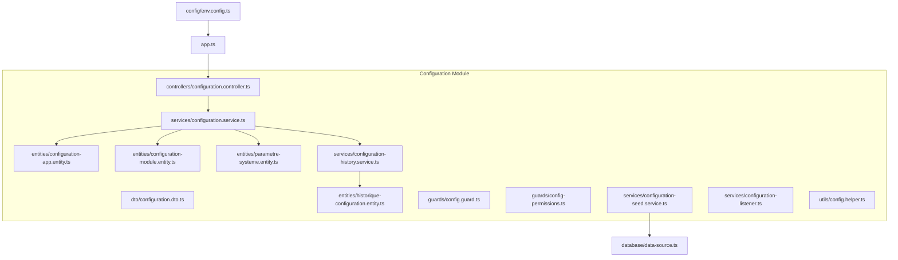
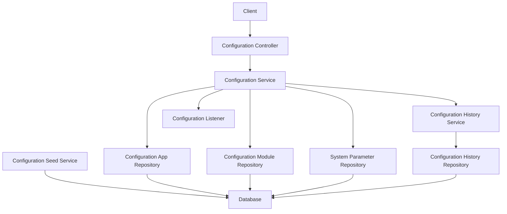
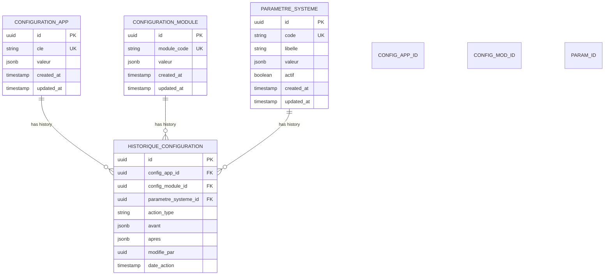
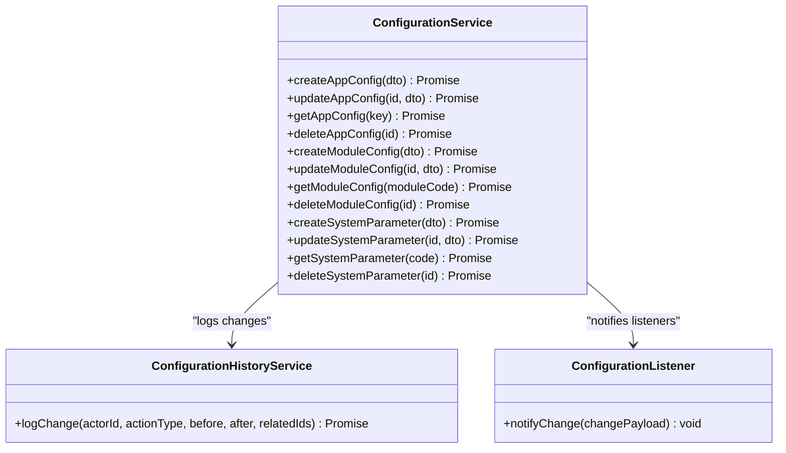
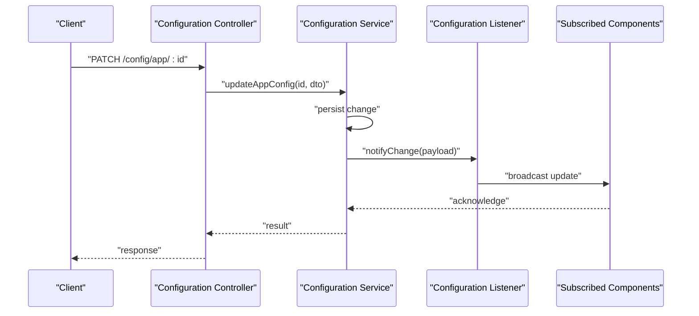
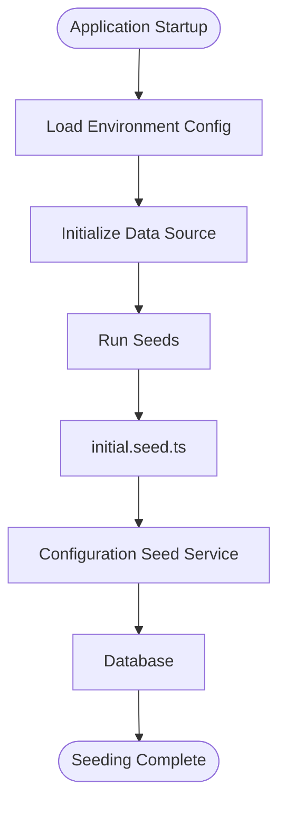
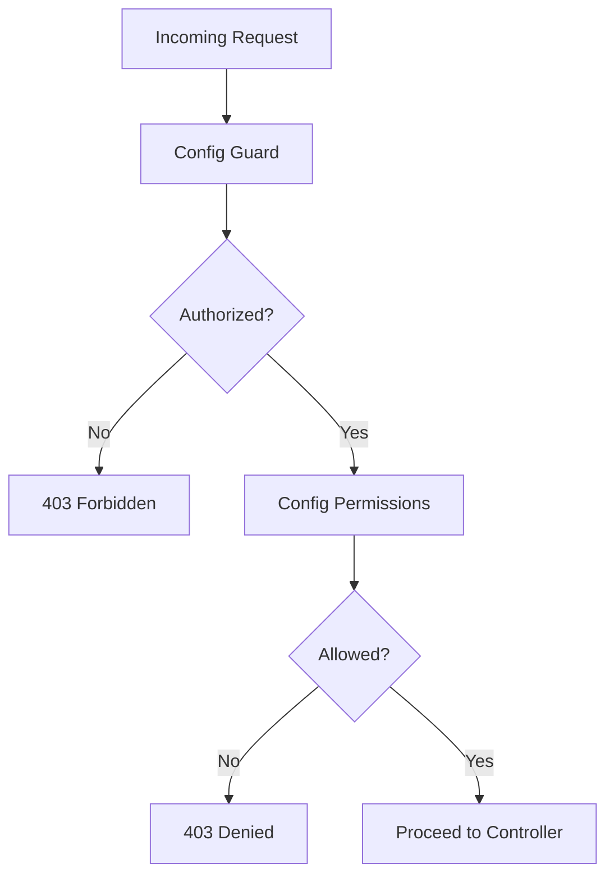
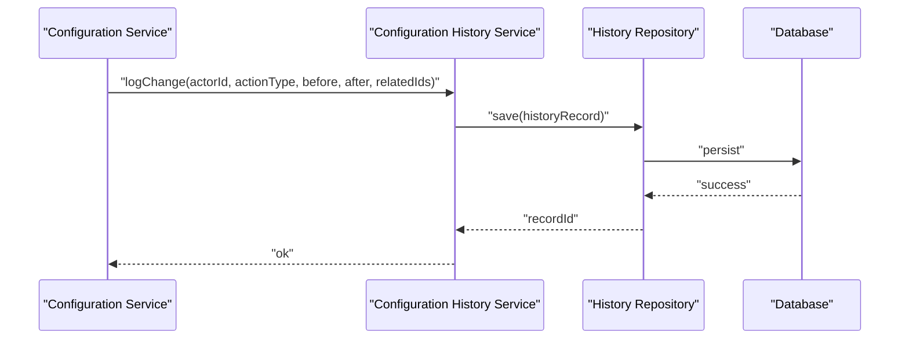
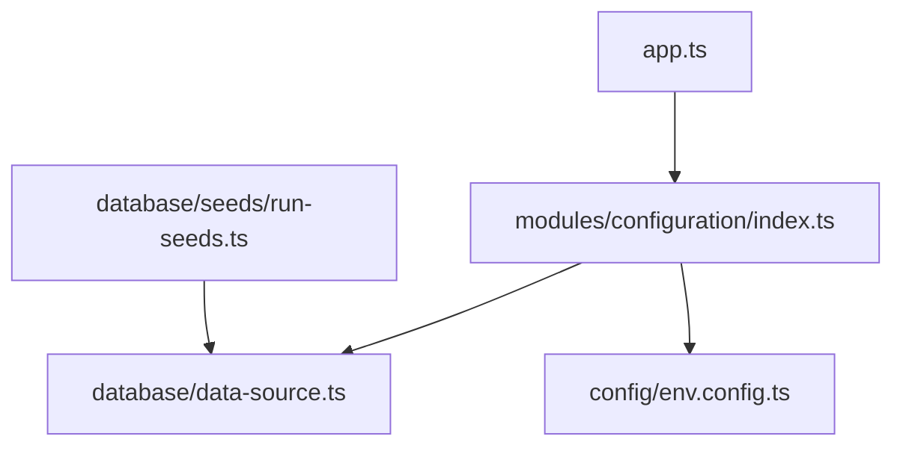

# Institutional Configuration

<cite>
**Referenced Files in This Document**
- [configuration.controller.ts](file://backend/src/modules/configuration/controllers/configuration.controller.ts)
- [configuration.dto.ts](file://backend/src/modules/configuration/dto/configuration.dto.ts)
- [configuration-app.entity.ts](file://backend/src/modules/configuration/entities/configuration-app.entity.ts)
- [configuration-module.entity.ts](file://backend/src/modules/configuration/entities/configuration-module.entity.ts)
- [historique-configuration.entity.ts](file://backend/src/modules/configuration/entities/historique-configuration.entity.ts)
- [parametre-systeme.entity.ts](file://backend/src/modules/configuration/entities/parametre-systeme.entity.ts)
- [config.guard.ts](file://backend/src/modules/configuration/guards/config.guard.ts)
- [config-permissions.ts](file://backend/src/modules/configuration/guards/config-permissions.ts)
- [configuration-history.service.ts](file://backend/src/modules/configuration/services/configuration-history.service.ts)
- [configuration-listener.ts](file://backend/src/modules/configuration/services/configuration-listener.ts)
- [configuration-seed.service.ts](file://backend/src/modules/configuration/services/configuration-seed.service.ts)
- [configuration.service.ts](file://backend/src/modules/configuration/services/configuration.service.ts)
- [config.helper.ts](file://backend/src/modules/configuration/utils/config.helper.ts)
- [app.ts](file://backend/src/app.ts)
- [index.ts](file://backend/src/modules/configuration/index.ts)
- [initial.seed.ts](file://backend/src/database/seeds/initial.seed.ts)
- [run-seeds.ts](file://backend/src/database/seeds/run-seeds.ts)
- [env.config.ts](file://backend/src/config/env.config.ts)
- [data-source.ts](file://backend/src/database/data-source.ts)
</cite>

## Table of Contents
1. [Introduction](#introduction)
2. [Project Structure](#project-structure)
3. [Core Components](#core-components)
4. [Architecture Overview](#architecture-overview)
5. [Detailed Component Analysis](#detailed-component-analysis)
6. [Dependency Analysis](#dependency-analysis)
7. [Performance Considerations](#performance-considerations)
8. [Troubleshooting Guide](#troubleshooting-guide)
9. [Conclusion](#conclusion)
10. [Appendices](#appendices)

## Introduction
This document provides comprehensive documentation for the institutional configuration management system. It covers system-wide settings, module-specific configurations, and institutional parameters. The documentation explains configuration entity relationships, the configuration service architecture, listener mechanisms for real-time updates, seed data management, configuration guards and permissions, helper utilities, and audit trail functionality. Practical examples demonstrate setting up institutional parameters, managing configuration changes, and implementing configuration listeners for dynamic system updates.

## Project Structure
The institutional configuration module resides under backend/src/modules/configuration and includes controllers, DTOs, entities, guards, services, and utilities. It integrates with the application bootstrap, database seeding, and environment configuration.

**Diagram sources**
- [configuration.controller.ts](file://backend/src/modules/configuration/controllers/configuration.controller.ts)
- [configuration.service.ts](file://backend/src/modules/configuration/services/configuration.service.ts)
- [configuration-history.service.ts](file://backend/src/modules/configuration/services/configuration-history.service.ts)
- [configuration-seed.service.ts](file://backend/src/modules/configuration/services/configuration-seed.service.ts)
- [configuration-listener.ts](file://backend/src/modules/configuration/services/configuration-listener.ts)
- [configuration-app.entity.ts](file://backend/src/modules/configuration/entities/configuration-app.entity.ts)
- [configuration-module.entity.ts](file://backend/src/modules/configuration/entities/configuration-module.entity.ts)
- [parametre-systeme.entity.ts](file://backend/src/modules/configuration/entities/parametre-systeme.entity.ts)
- [historique-configuration.entity.ts](file://backend/src/modules/configuration/entities/historique-configuration.entity.ts)
- [app.ts](file://backend/src/app.ts)
- [data-source.ts](file://backend/src/database/data-source.ts)
- [env.config.ts](file://backend/src/config/env.config.ts)

**Section sources**
- [configuration.controller.ts](file://backend/src/modules/configuration/controllers/configuration.controller.ts)
- [configuration.service.ts](file://backend/src/modules/configuration/services/configuration.service.ts)
- [configuration-history.service.ts](file://backend/src/modules/configuration/services/configuration-history.service.ts)
- [configuration-seed.service.ts](file://backend/src/modules/configuration/services/configuration-seed.service.ts)
- [configuration-listener.ts](file://backend/src/modules/configuration/services/configuration-listener.ts)
- [configuration-app.entity.ts](file://backend/src/modules/configuration/entities/configuration-app.entity.ts)
- [configuration-module.entity.ts](file://backend/src/modules/configuration/entities/configuration-module.entity.ts)
- [parametre-systeme.entity.ts](file://backend/src/modules/configuration/entities/parametre-systeme.entity.ts)
- [historique-configuration.entity.ts](file://backend/src/modules/configuration/entities/historique-configuration.entity.ts)
- [app.ts](file://backend/src/app.ts)
- [data-source.ts](file://backend/src/database/data-source.ts)
- [env.config.ts](file://backend/src/config/env.config.ts)

## Core Components
- Controllers: Expose endpoints for managing institutional configuration, including application-wide settings, module-specific settings, and system parameters.
- Services: Implement business logic for configuration CRUD operations, history tracking, seed data management, and real-time listeners.
- Entities: Define relational models for configuration-app, configuration-module, parametre-systeme, and historique-configuration.
- Guards: Enforce access control and permission checks for configuration operations.
- Utilities: Provide helper functions for configuration operations and transformations.
- DTOs: Define structured input/output contracts for configuration requests and responses.

Key responsibilities:
- Application configuration: Centralized settings affecting the whole system.
- Module configuration: Settings scoped to specific functional modules.
- System parameters: Operational parameters managed institutionally.
- History tracking: Audit trail of configuration changes with timestamps and actors.
- Real-time updates: Listeners to propagate configuration changes across the system.
- Seed data: Initial institutional configuration loaded at startup.

**Section sources**
- [configuration.controller.ts](file://backend/src/modules/configuration/controllers/configuration.controller.ts)
- [configuration.service.ts](file://backend/src/modules/configuration/services/configuration.service.ts)
- [configuration-history.service.ts](file://backend/src/modules/configuration/services/configuration-history.service.ts)
- [configuration-seed.service.ts](file://backend/src/modules/configuration/services/configuration-seed.service.ts)
- [configuration-listener.ts](file://backend/src/modules/configuration/services/configuration-listener.ts)
- [configuration-app.entity.ts](file://backend/src/modules/configuration/entities/configuration-app.entity.ts)
- [configuration-module.entity.ts](file://backend/src/modules/configuration/entities/configuration-module.entity.ts)
- [parametre-systeme.entity.ts](file://backend/src/modules/configuration/entities/parametre-systeme.entity.ts)
- [historique-configuration.entity.ts](file://backend/src/modules/configuration/entities/historique-configuration.entity.ts)
- [config.guard.ts](file://backend/src/modules/configuration/guards/config.guard.ts)
- [config-permissions.ts](file://backend/src/modules/configuration/guards/config-permissions.ts)
- [config.helper.ts](file://backend/src/modules/configuration/utils/config.helper.ts)
- [configuration.dto.ts](file://backend/src/modules/configuration/dto/configuration.dto.ts)

## Architecture Overview
The configuration module follows a layered architecture:
- Presentation Layer: Controllers expose REST endpoints.
- Application Layer: Services orchestrate operations and coordinate with persistence and listeners.
- Domain Layer: Entities represent configuration data and relationships.
- Infrastructure Layer: Database connections, seeding, and environment configuration.

**Diagram sources**
- [configuration.controller.ts](file://backend/src/modules/configuration/controllers/configuration.controller.ts)
- [configuration.service.ts](file://backend/src/modules/configuration/services/configuration.service.ts)
- [configuration-history.service.ts](file://backend/src/modules/configuration/services/configuration-history.service.ts)
- [configuration-seed.service.ts](file://backend/src/modules/configuration/services/configuration-seed.service.ts)
- [configuration-listener.ts](file://backend/src/modules/configuration/services/configuration-listener.ts)
- [configuration-app.entity.ts](file://backend/src/modules/configuration/entities/configuration-app.entity.ts)
- [configuration-module.entity.ts](file://backend/src/modules/configuration/entities/configuration-module.entity.ts)
- [parametre-systeme.entity.ts](file://backend/src/modules/configuration/entities/parametre-systeme.entity.ts)
- [historique-configuration.entity.ts](file://backend/src/modules/configuration/entities/historique-configuration.entity.ts)

## Detailed Component Analysis

### Entity Model and Relationships
The configuration domain defines four primary entities with explicit relationships:
- Configuration App: System-wide application settings.
- Configuration Module: Module-scoped settings.
- System Parameter: Institutional operational parameters.
- Configuration History: Audit trail of changes.

**Diagram sources**
- [configuration-app.entity.ts](file://backend/src/modules/configuration/entities/configuration-app.entity.ts)
- [configuration-module.entity.ts](file://backend/src/modules/configuration/entities/configuration-module.entity.ts)
- [parametre-systeme.entity.ts](file://backend/src/modules/configuration/entities/parametre-systeme.entity.ts)
- [historique-configuration.entity.ts](file://backend/src/modules/configuration/entities/historique-configuration.entity.ts)

**Section sources**
- [configuration-app.entity.ts](file://backend/src/modules/configuration/entities/configuration-app.entity.ts)
- [configuration-module.entity.ts](file://backend/src/modules/configuration/entities/configuration-module.entity.ts)
- [parametre-systeme.entity.ts](file://backend/src/modules/configuration/entities/parametre-systeme.entity.ts)
- [historique-configuration.entity.ts](file://backend/src/modules/configuration/entities/historique-configuration.entity.ts)

### Configuration Service Architecture
The configuration service orchestrates CRUD operations, validation, history logging, and listener notifications. It coordinates repositories for configuration-app, configuration-module, and parametre-systeme entities.

**Diagram sources**
- [configuration.service.ts](file://backend/src/modules/configuration/services/configuration.service.ts)
- [configuration-history.service.ts](file://backend/src/modules/configuration/services/configuration-history.service.ts)
- [configuration-listener.ts](file://backend/src/modules/configuration/services/configuration-listener.ts)

**Section sources**
- [configuration.service.ts](file://backend/src/modules/configuration/services/configuration.service.ts)
- [configuration-history.service.ts](file://backend/src/modules/configuration/services/configuration-history.service.ts)
- [configuration-listener.ts](file://backend/src/modules/configuration/services/configuration-listener.ts)

### Configuration Listener Mechanism
The listener service enables real-time propagation of configuration changes across the system. It receives change payloads and dispatches updates to subscribed components.

**Diagram sources**
- [configuration.controller.ts](file://backend/src/modules/configuration/controllers/configuration.controller.ts)
- [configuration.service.ts](file://backend/src/modules/configuration/services/configuration.service.ts)
- [configuration-listener.ts](file://backend/src/modules/configuration/services/configuration-listener.ts)

**Section sources**
- [configuration.controller.ts](file://backend/src/modules/configuration/controllers/configuration.controller.ts)
- [configuration.service.ts](file://backend/src/modules/configuration/services/configuration.service.ts)
- [configuration-listener.ts](file://backend/src/modules/configuration/services/configuration-listener.ts)

### Seed Data Management
Seed data initializes institutional configuration during application startup. The seed service coordinates with the database data source and runs initial seeds.

**Diagram sources**
- [initial.seed.ts](file://backend/src/database/seeds/initial.seed.ts)
- [run-seeds.ts](file://backend/src/database/seeds/run-seeds.ts)
- [configuration-seed.service.ts](file://backend/src/modules/configuration/services/configuration-seed.service.ts)
- [data-source.ts](file://backend/src/database/data-source.ts)
- [env.config.ts](file://backend/src/config/env.config.ts)

**Section sources**
- [initial.seed.ts](file://backend/src/database/seeds/initial.seed.ts)
- [run-seeds.ts](file://backend/src/database/seeds/run-seeds.ts)
- [configuration-seed.service.ts](file://backend/src/modules/configuration/services/configuration-seed.service.ts)
- [data-source.ts](file://backend/src/database/data-source.ts)
- [env.config.ts](file://backend/src/config/env.config.ts)

### Guards and Permission Systems
Access control ensures only authorized users can modify configuration. Two guard mechanisms are present:
- config.guard.ts: General configuration route protection.
- config-permissions.ts: Fine-grained permission enforcement for specific actions.

**Diagram sources**
- [config.guard.ts](file://backend/src/modules/configuration/guards/config.guard.ts)
- [config-permissions.ts](file://backend/src/modules/configuration/guards/config-permissions.ts)

**Section sources**
- [config.guard.ts](file://backend/src/modules/configuration/guards/config.guard.ts)
- [config-permissions.ts](file://backend/src/modules/configuration/guards/config-permissions.ts)

### Configuration Helper Utilities
Helper utilities streamline common configuration operations, such as value normalization, validation, and transformation. These utilities are consumed by services and controllers to maintain consistency.

**Section sources**
- [config.helper.ts](file://backend/src/modules/configuration/utils/config.helper.ts)

### Audit Trail Functionality
Every configuration change is recorded in the history entity with before/after snapshots, actor identification, and timestamps. The history service centralizes logging logic.

**Diagram sources**
- [configuration-history.service.ts](file://backend/src/modules/configuration/services/configuration-history.service.ts)
- [historique-configuration.entity.ts](file://backend/src/modules/configuration/entities/historique-configuration.entity.ts)

**Section sources**
- [configuration-history.service.ts](file://backend/src/modules/configuration/services/configuration-history.service.ts)
- [historique-configuration.entity.ts](file://backend/src/modules/configuration/entities/historique-configuration.entity.ts)

## Dependency Analysis
The configuration module depends on:
- Application bootstrap for controller registration and middleware integration.
- Database data source for persistence operations.
- Environment configuration for runtime settings.
- Seed runner for initialization.

**Diagram sources**
- [app.ts](file://backend/src/app.ts)
- [index.ts](file://backend/src/modules/configuration/index.ts)
- [data-source.ts](file://backend/src/database/data-source.ts)
- [env.config.ts](file://backend/src/config/env.config.ts)
- [run-seeds.ts](file://backend/src/database/seeds/run-seeds.ts)

**Section sources**
- [app.ts](file://backend/src/app.ts)
- [index.ts](file://backend/src/modules/configuration/index.ts)
- [data-source.ts](file://backend/src/database/data-source.ts)
- [env.config.ts](file://backend/src/config/env.config.ts)
- [run-seeds.ts](file://backend/src/database/seeds/run-seeds.ts)

## Performance Considerations
- Minimize listener overhead by batching notifications and avoiding redundant updates.
- Use efficient queries and indexing on frequently accessed keys and module codes.
- Cache hot-path configuration values in memory with controlled invalidation.
- Limit history records retention to balance audit needs with storage costs.
- Asynchronously persist history logs to avoid blocking transaction commits.

## Troubleshooting Guide
Common issues and resolutions:
- Unauthorized access: Verify guard and permission configurations for the requesting user role.
- Duplicate keys or module codes: Ensure uniqueness constraints are respected before creation.
- History not recorded: Confirm history service is invoked after successful persistence.
- Listener not firing: Validate listener registration and payload serialization.
- Seed failures: Check environment configuration and database connectivity during startup.

**Section sources**
- [config.guard.ts](file://backend/src/modules/configuration/guards/config.guard.ts)
- [config-permissions.ts](file://backend/src/modules/configuration/guards/config-permissions.ts)
- [configuration-history.service.ts](file://backend/src/modules/configuration/services/configuration-history.service.ts)
- [configuration-listener.ts](file://backend/src/modules/configuration/services/configuration-listener.ts)
- [env.config.ts](file://backend/src/config/env.config.ts)

## Conclusion
The institutional configuration module provides a robust foundation for managing system-wide settings, module-specific configurations, and institutional parameters. Its architecture supports auditability, real-time updates, and secure access control. By leveraging seed data, history tracking, and listener mechanisms, the system remains maintainable and responsive to institutional needs.

## Appendices

### Practical Examples

- Setting up institutional parameters:
  - Create a system parameter via the appropriate endpoint with a unique code and initial value.
  - Activate or deactivate parameters as needed while maintaining audit trails.

- Managing configuration changes:
  - Use PATCH endpoints to update application or module configurations.
  - Review history entries to track who changed what and when.

- Implementing configuration listeners:
  - Register listeners to react to configuration updates.
  - Broadcast changes to dependent services and invalidate caches as required.

**Section sources**
- [configuration.controller.ts](file://backend/src/modules/configuration/controllers/configuration.controller.ts)
- [configuration.service.ts](file://backend/src/modules/configuration/services/configuration.service.ts)
- [configuration-history.service.ts](file://backend/src/modules/configuration/services/configuration-history.service.ts)
- [configuration-listener.ts](file://backend/src/modules/configuration/services/configuration-listener.ts)
- [configuration.dto.ts](file://backend/src/modules/configuration/dto/configuration.dto.ts)