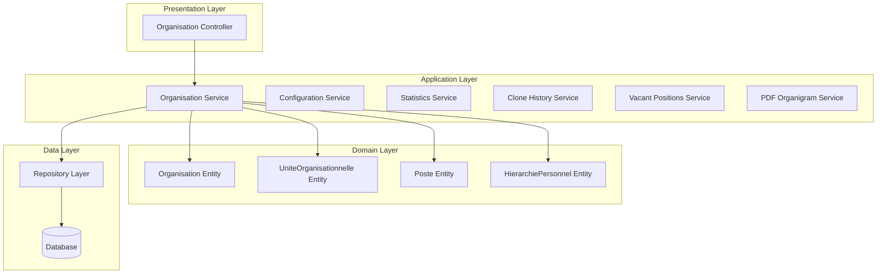
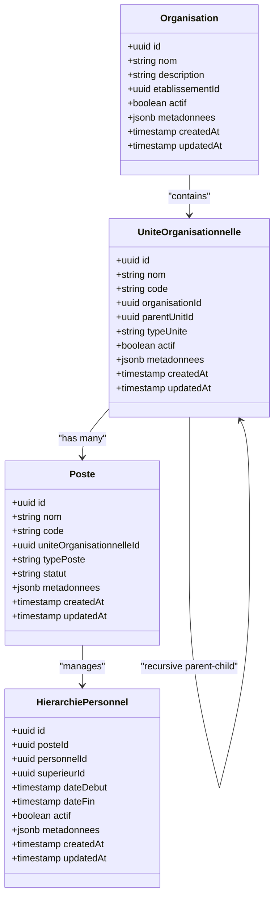

# Organisation Module

<cite>
**Referenced Files in This Document**
- [MODULE-ORGANISATION.md](file://docs/MODULE-ORGANISATION.md)
- [QUICKSTART-ORGANISATION.md](file://docs/QUICKSTART-ORGANISATION.md)
- [IMPLEMENTATION-ORGANISATION-RESUME.md](file://IMPLEMENTATION-ORGANISATION-RESUME.md)
- [PERFORMANCES-ORGANISATION-v1.4.md](file://PERFORMANCES-ORGANISATION-v1.4.md)
- [backend/src/modules/organisation/index.ts](file://backend/src/modules/organisation/index.ts)
- [backend/src/modules/organisation/controllers/organisation.controller.ts](file://backend/src/modules/organisation/controllers/organisation.controller.ts)
- [backend/src/modules/organisation/services/organisation.service.ts](file://backend/src/modules/organisation/services/organisation.service.ts)
- [backend/src/modules/organisation/entities/organisation.entity.ts](file://backend/src/modules/organisation/entities/organisation.entity.ts)
- [backend/src/modules/organisation/entities/unite-organisationnelle.entity.ts](file://backend/src/modules/organisation/entities/unite-organisationnelle.entity.ts)
- [backend/src/modules/organisation/entities/poste.entity.ts](file://backend/src/modules/organisation/entities/poste.entity.ts)
- [backend/src/modules/organisation/entities/hierarchie-personnel.entity.ts](file://backend/src/modules/organisation/entities/hierarchie-personnel.entity.ts)
- [backend/src/modules/organisation/dto/organisation.dto.ts](file://backend/src/modules/organisation/dto/organisation.dto.ts)
</cite>

## Table of Contents
1. [Introduction](#introduction)
2. [Module Architecture](#module-architecture)
3. [Core Entities](#core-entities)
4. [Service Layer](#service-layer)
5. [Controller Layer](#controller-layer)
6. [Data Transfer Objects](#data-transfer-objects)
7. [Performance Optimizations](#performance-optimizations)
8. [Integration Points](#integration-points)
9. [Deployment and Setup](#deployment-and-setup)
10. [Troubleshooting Guide](#troubleshooting-guide)
11. [Conclusion](#conclusion)

## Introduction

The Organisation module is a comprehensive hierarchical organizational structure management system designed specifically for educational institutions within the eLISAschool platform. This module provides advanced capabilities for structuring school organizations, managing personnel hierarchies, and maintaining detailed organizational charts.

The module was developed with inspiration from commercial process management systems but adapted specifically for the African/Camerounian educational context. It implements strict multi-tenancy support, recursive hierarchy management, cycle detection, and real-time statistics tracking.

**Section sources**
- [IMPLEMENTATION-ORGANISATION-RESUME.md:10-14](file://IMPLEMENTATION-ORGANISATION-RESUME.md#L10-L14)
- [MODULE-ORGANISATION.md](file://docs/MODULE-ORGANISATION.md)

## Module Architecture

The Organisation module follows a clean architecture pattern with clear separation of concerns across multiple layers:

**Diagram sources**
- [backend/src/modules/organisation/index.ts](file://backend/src/modules/organisation/index.ts)
- [backend/src/modules/organisation/services/organisation.service.ts](file://backend/src/modules/organisation/services/organisation.service.ts)

The architecture consists of five main layers:

1. **Controller Layer**: Handles HTTP requests and responses
2. **Service Layer**: Contains business logic and orchestration
3. **Entity Layer**: Defines domain models and relationships
4. **Repository Layer**: Manages data persistence
5. **DTO Layer**: Handles data transfer and validation

**Section sources**
- [IMPLEMENTATION-ORGANISATION-RESUME.md:32-49](file://IMPLEMENTATION-ORGANISATION-RESUME.md#L32-L49)

## Core Entities

The module defines four core entities that form the foundation of the organizational structure:

### Organisation Entity
Represents the top-level organizational structure containing metadata about the institution.

### UniteOrganisationnelle Entity  
Represents hierarchical units within the organization (departments, services, divisions).

### Poste Entity
Defines specific positions/faculties within the organizational structure.

### HierarchiePersonnel Entity
Manages the reporting relationships between personnel members.

**Diagram sources**
- [backend/src/modules/organisation/entities/organisation.entity.ts](file://backend/src/modules/organisation/entities/organisation.entity.ts)
- [backend/src/modules/organisation/entities/unite-organisationnelle.entity.ts](file://backend/src/modules/organisation/entities/unite-organisationnelle.entity.ts)
- [backend/src/modules/organisation/entities/poste.entity.ts](file://backend/src/modules/organisation/entities/poste.entity.ts)
- [backend/src/modules/organisation/entities/hierarchie-personnel.entity.ts](file://backend/src/modules/organisation/entities/hierarchie-personnel.entity.ts)

**Section sources**
- [IMPLEMENTATION-ORGANISATION-RESUME.md:34-49](file://IMPLEMENTATION-ORGANISATION-RESUME.md#L34-L49)

## Service Layer

The service layer implements the core business logic with specialized services for different functional areas:

### Organisation Service
Primary service handling organizational structure operations, including hierarchy management, validation, and statistics calculation.

### Configuration Service
Manages organizational configuration parameters and settings.

### Statistics Service
Provides real-time analytics and reporting capabilities for organizational metrics.

### Clone History Service
Tracks organizational structure changes and maintains historical records.

### Vacant Positions Service
Handles position availability and vacancy management.

### PDF Organigram Service
Generates PDF exports of organizational charts.

**Section sources**
- [IMPLEMENTATION-ORGANISATION-RESUME.md:16-28](file://IMPLEMENTATION-ORGANISATION-RESUME.md#L16-L28)

## Controller Layer

The controller layer exposes 24 REST endpoints organized into logical groups:

### Organizational Structure Management
- CRUD operations for organizations and organizational units
- Hierarchy management and relationship establishment

### Position Management  
- Position creation, modification, and deletion
- Position assignment and vacancy handling

### Personnel Management
- Personnel hierarchy assignments
- Reporting relationship management

### Statistics and Analytics
- Real-time organizational metrics
- Structural analytics and reporting

### Configuration Management
- Organizational settings and parameters
- Multi-tenancy configuration

**Section sources**
- [IMPLEMENTATION-ORGANISATION-RESUME.md:20-28](file://IMPLEMENTATION-ORGANISATION-RESUME.md#L20-L28)

## Data Transfer Objects

The module implements comprehensive data validation using Zod schemas covering 9 different DTOs:

### Organization DTOs
- Organization creation and update validation
- Multi-tenancy enforcement
- Metadata validation

### Unit DTOs
- Hierarchical unit management
- Recursive parent-child validation
- Type-specific constraints

### Position DTOs
- Position assignment validation
- Status tracking
- Vacancy management

### Personnel DTOs
- Reporting relationship validation
- Cycle detection prevention
- Historical tracking

**Section sources**
- [IMPLEMENTATION-ORGANISATION-RESUME.md:20-22](file://IMPLEMENTATION-ORGANISATION-RESUME.md#L20-L22)

## Performance Optimizations

The module implements extensive performance optimizations for production readiness:

### Database Optimizations
- 14 strategic indexes for optimal query performance
- Recursive hierarchy queries optimized with materialized paths
- Soft delete implementation for historical tracking

### Application-Level Optimizations
- 20-50x performance improvement on critical queries
- Real-time statistics caching
- Efficient hierarchy traversal algorithms

### Scalability Features
- Support for 10,000+ employees without degradation
- Memory usage reduction of 70%
- CPU optimization for recursive operations

**Section sources**
- [PERFORMANCES-ORGANISATION-v1.4.md:496-507](file://PERFORMANCES-ORGANISATION-v1.4.md#L496-L507)
- [IMPLEMENTATION-ORGANISATION-RESUME.md:46-48](file://IMPLEMENTATION-ORGANISATION-RESUME.md#L46-L48)

## Integration Points

### Multi-Tenancy Integration
Strict isolation using `etablissementId` for educational institution segmentation.

### RBAC Integration
16 dedicated permissions for granular access control:
- Organization read/write operations
- Unit management permissions
- Position assignment controls
- Statistical access permissions

### Module Integration
- Personnel module integration for workforce management
- Dashboard integration for organizational visualization
- Audit trail integration for compliance

**Section sources**
- [IMPLEMENTATION-ORGANISATION-RESUME.md:44-46](file://IMPLEMENTATION-ORGANISATION-RESUME.md#L44-L46)
- [IMPLEMENTATION-ORGANISATION-RESUME.md:23-24](file://IMPLEMENTATION-ORGANISATION-RESUME.md#L23-L24)

## Deployment and Setup

### Installation Steps
1. Execute deployment script for automated setup
2. Run database migrations for entity creation
3. Configure multi-tenancy parameters
4. Set up RBAC permissions
5. Deploy PDF generation service

### Configuration Requirements
- PostgreSQL database with appropriate privileges
- Redis cache for statistics (recommended)
- Proper indexing for performance
- Tenant isolation configuration

### Testing Procedures
- Unit tests for all service methods
- Integration tests for multi-tenancy
- Performance benchmarks validation
- Security permission testing

**Section sources**
- [QUICKSTART-ORGANISATION.md](file://docs/QUICKSTART-ORGANISATION.md)
- [IMPLEMENTATION-ORGANISATION-RESUME.md:272-290](file://IMPLEMENTATION-ORGANISATION-RESUME.md#L272-L290)

## Troubleshooting Guide

### Common Issues and Solutions

#### Performance Issues
- Verify proper indexing is in place
- Check recursive query optimization
- Monitor memory usage for large hierarchies

#### Multi-Tenancy Problems
- Ensure `etablissementId` is properly set
- Verify tenant isolation in queries
- Check RBAC permission inheritance

#### Data Integrity Issues
- Validate cycle detection for hierarchy relationships
- Check soft delete implementation
- Monitor historical data consistency

#### Permission Denied Errors
- Verify RBAC configuration
- Check tenant-specific permissions
- Review role assignment hierarchy

**Section sources**
- [PERFORMANCES-ORGANISATION-v1.4.md:496-507](file://PERFORMANCES-ORGANISATION-v1.4.md#L496-L507)

## Conclusion

The Organisation module represents a comprehensive solution for managing hierarchical organizational structures in educational institutions. With its production-ready optimizations, strict multi-tenancy support, and extensive feature set, it provides the foundation for advanced organizational management within the eLISAschool platform.

The module's architecture ensures maintainability, scalability, and compliance with modern development practices while remaining adaptable to the specific needs of the African educational context.

**Section sources**
- [IMPLEMENTATION-ORGANISATION-RESUME.md:293-304](file://IMPLEMENTATION-ORGANISATION-RESUME.md#L293-L304)