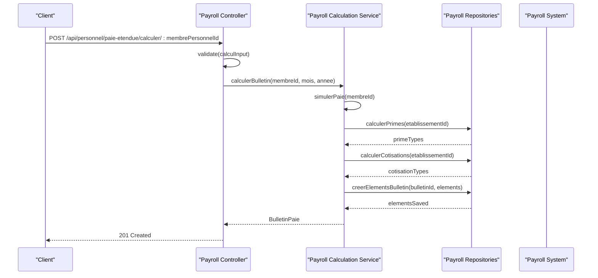
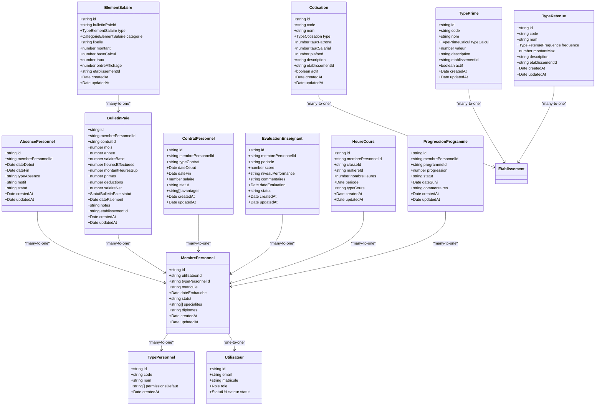
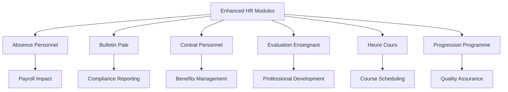
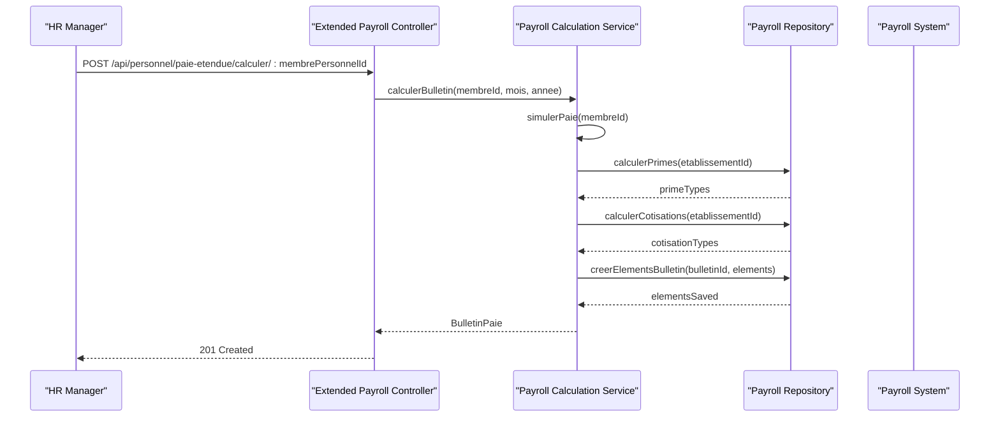
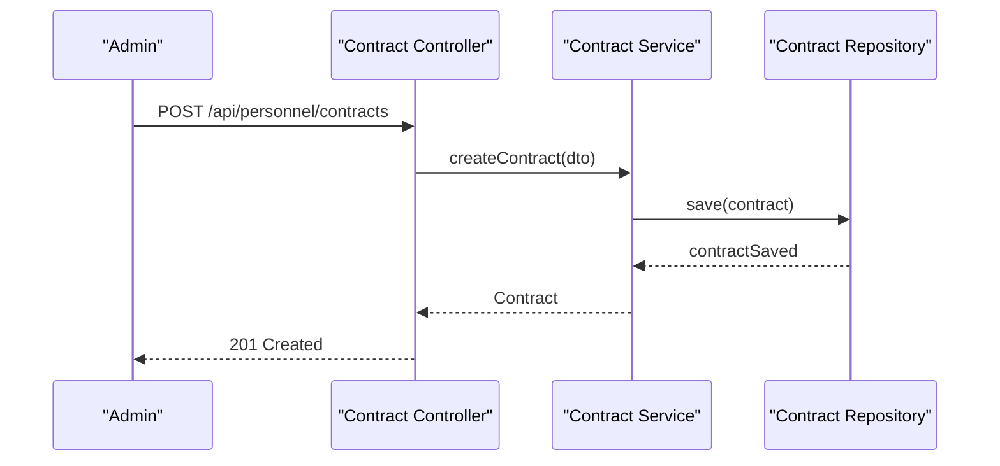
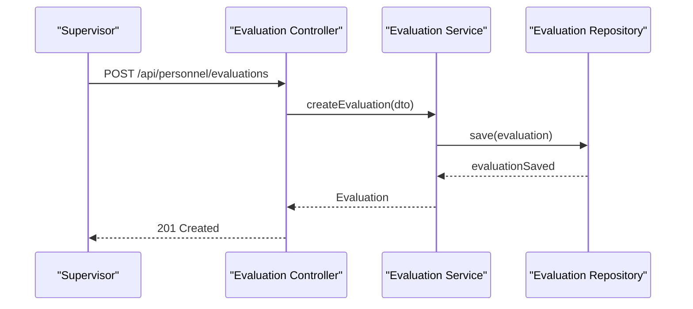
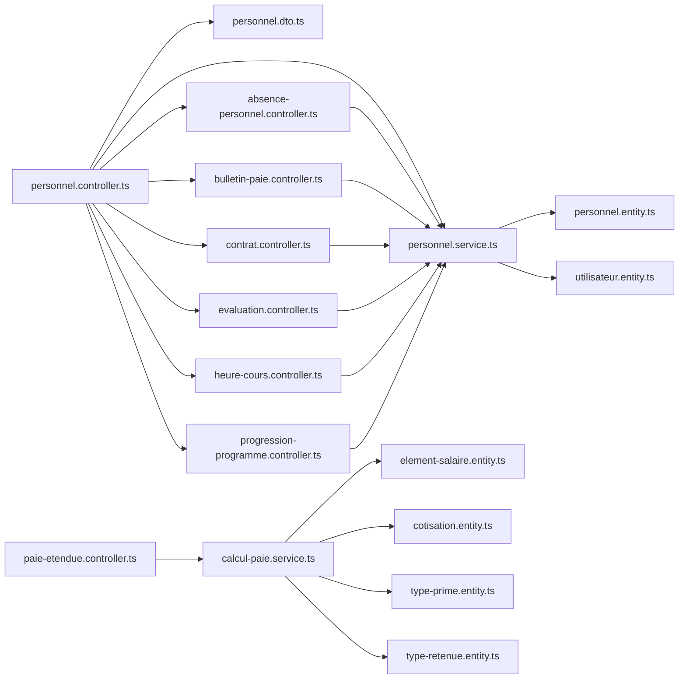

# Personnel & Human Resources

<cite>
**Referenced Files in This Document**
- [personnel.entity.ts](file://backend/src/modules/personnel/entities/personnel.entity.ts)
- [personnel.dto.ts](file://backend/src/modules/personnel/dto/personnel.dto.ts)
- [personnel.service.ts](file://backend/src/modules/personnel/services/personnel.service.ts)
- [personnel.controller.ts](file://backend/src/modules/personnel/controllers/personnel.controller.ts)
- [absence-personnel.entity.ts](file://backend/src/modules/personnel/entities/absence-personnel.entity.ts)
- [bulletin-paie.entity.ts](file://backend/src/modules/personnel/entities/bulletin-paie.entity.ts)
- [bulletin-paie.service.ts](file://backend/src/modules/personnel/services/bulletin-paie.service.ts)
- [bulletin-paie.dto.ts](file://backend/src/modules/personnel/dto/bulletin-paie.dto.ts)
- [contrat-personnel.entity.ts](file://backend/src/modules/personnel/entities/contrat-personnel.entity.ts)
- [evaluation-enseignant.entity.ts](file://backend/src/modules/personnel/entities/evaluation-enseignant.entity.ts)
- [heure-cours.entity.ts](file://backend/src/modules/personnel/entities/heure-cours.entity.ts)
- [progression-programme.entity.ts](file://backend/src/modules/personnel/entities/progression-programme.entity.ts)
- [cotisation.entity.ts](file://backend/src/modules/personnel/entities/cotisation.entity.ts)
- [element-salaire.entity.ts](file://backend/src/modules/personnel/entities/element-salaire.entity.ts)
- [type-prime.entity.ts](file://backend/src/modules/personnel/entities/type-prime.entity.ts)
- [type-retenue.entity.ts](file://backend/src/modules/personnel/entities/type-retenue.entity.ts)
- [paie-etendue.controller.ts](file://backend/src/modules/personnel/controllers/paie-etendue.controller.ts)
- [calcul-paie.service.ts](file://backend/src/modules/personnel/services/calcul-paie.service.ts)
- [paie-etendue.dto.ts](file://backend/src/modules/personnel/dto/paie-etendue.dto.ts)
- [absence-personnel.controller.ts](file://backend/src/modules/personnel/controllers/absence-personnel.controller.ts)
- [contrat.controller.ts](file://backend/src/modules/personnel/controllers/contrat.controller.ts)
- [evaluation.controller.ts](file://backend/src/modules/personnel/controllers/evaluation.controller.ts)
- [heure-cours.controller.ts](file://backend/src/modules/personnel/controllers/heure-cours.controller.ts)
- [progression-programme.controller.ts](file://backend/src/modules/personnel/controllers/progression-programme.controller.ts)
- [personnel-dashboard.controller.ts](file://backend/src/modules/personnel/controllers/personnel-dashboard.controller.ts)
- [utilisateur.entity.ts](file://backend/src/modules/auth/entities/utilisateur.entity.ts)
- [classe.entity.ts](file://backend/src/modules/classes/entities/classe.entity.ts)
- [affectation-matiere.entity.ts](file://backend/src/modules/matieres/entities/affectation-matiere.entity.ts)
- [app.ts](file://backend/src/app.ts)
</cite>

## Update Summary
**Changes Made**
- Added comprehensive extended payroll module with detailed salary calculation capabilities
- Integrated social contributions processing with dedicated Cotisation entity
- Enhanced payroll service with individual and simulation calculations
- Added allowance tracking through TypePrime entity and ElementSalaire details
- Introduced deduction management via TypeRetenue entity
- Expanded payroll processing with detailed element breakdowns
- Enhanced payroll reporting and analytics capabilities

## Table of Contents
1. [Introduction](#introduction)
2. [Project Structure](#project-structure)
3. [Core Components](#core-components)
4. [Architecture Overview](#architecture-overview)
5. [Detailed Component Analysis](#detailed-component-analysis)
6. [Enhanced HR Modules](#enhanced-hr-modules)
7. [Extended Payroll Module](#extended-payroll-module)
8. [Payroll Calculation Engine](#payroll-calculation-engine)
9. [Payroll Configuration Entities](#payroll-configuration-entities)
10. [Payroll Processing Workflows](#payroll-processing-workflows)
11. [Dependency Analysis](#dependency-analysis)
12. [Performance Considerations](#performance-considerations)
13. [Troubleshooting Guide](#troubleshooting-guide)
14. [Conclusion](#conclusion)
15. [Appendices](#appendices)

## Introduction
This document provides comprehensive documentation for the enhanced Personnel & Human Resources module within the eLISAschool platform. The module has been significantly expanded to include a comprehensive extended payroll system with detailed salary calculation capabilities, social contributions processing, allowance tracking, and deduction management. The enhanced system now features sophisticated payroll processing with individual calculations, simulation capabilities, and detailed element breakdowns for complete institutional HR and payroll management.

## Project Structure
The enhanced Personnel module now encompasses a comprehensive HR and payroll ecosystem with specialized submodules:
- Core Personnel Management: Basic staff records and employment data
- HR Specialized Modules: Absence tracking, payroll processing, contract management, performance evaluations, course hours, and academic progression
- Extended Payroll System: Advanced salary calculations, social contributions, allowances, and deductions
- Payroll Configuration: Dynamic payroll components management
- Integration Points: Seamless connection with academic modules, payroll systems, and attendance tracking

```mermaid
graph TB
subgraph "Enhanced Personnel Module"
PE["personnel.entity.ts"]
PE1["absence-personnel.entity.ts"]
PE2["bulletin-paie.entity.ts"]
PE3["contrat-personnel.entity.ts"]
PE4["evaluation-enseignant.entity.ts"]
PE5["heure-cours.entity.ts"]
PE6["progression-programme.entity.ts"]
PD["personnel.dto.ts"]
PS["personnel.service.ts"]
PC["personnel.controller.ts"]
end
subgraph "Extended Payroll System"
PE2 --> PE7["element-salaire.entity.ts"]
PE2 --> PE8["cotisation.entity.ts"]
PE2 --> PE9["type-prime.entity.ts"]
PE2 --> PE10["type-retenue.entity.ts"]
PCS["calcul-paie.service.ts"]
PCE["paie-etendue.controller.ts"]
end
subgraph "HR Controllers"
APC["absence-personnel.controller.ts"]
BPC["bulletin-paie.controller.ts"]
CC["contrat.controller.ts"]
EC["evaluation.controller.ts"]
HCC["heure-cours.controller.ts"]
PPC["progression-programme.controller.ts"]
PDC["personnel-dashboard.controller.ts"]
end
subgraph "Payroll Controllers"
PEC["paie-etendue.controller.ts"]
end
subgraph "Auth Module"
UE["utilisateur.entity.ts"]
end
subgraph "Academic Modules"
CE["classe.entity.ts"]
ME["affectation-matiere.entity.ts"]
end
PC --> PS
PS --> PE
PS --> UE
PE1 --> PE
PE2 --> PE
PE3 --> PE
PE4 --> PE
PE5 --> PE
PE6 --> PE
PE7 --> PE2
PE8 --> PE2
PE9 --> PE2
PE10 --> PE2
PCS --> PE7
PCS --> PE8
PCS --> PE9
PCS --> PE10
PCE --> PCS
APC --> PS
BPC --> PS
CC --> PS
EC --> PS
HCC --> PS
PPC --> PS
PDC --> PS
PEC --> PCS
```

**Diagram sources**
- [personnel.controller.ts:1-75](file://backend/src/modules/personnel/controllers/personnel.controller.ts#L1-L75)
- [personnel.service.ts:1-98](file://backend/src/modules/personnel/services/personnel.service.ts#L1-L98)
- [personnel.entity.ts:1-79](file://backend/src/modules/personnel/entities/personnel.entity.ts#L1-L79)
- [absence-personnel.entity.ts:1-100](file://backend/src/modules/personnel/entities/absence-personnel.entity.ts#L1-L100)
- [bulletin-paie.entity.ts:1-95](file://backend/src/modules/personnel/entities/bulletin-paie.entity.ts#L1-L95)
- [element-salaire.entity.ts:1-88](file://backend/src/modules/personnel/entities/element-salaire.entity.ts#L1-L88)
- [cotisation.entity.ts:1-74](file://backend/src/modules/personnel/entities/cotisation.entity.ts#L1-L74)
- [type-prime.entity.ts:1-65](file://backend/src/modules/personnel/entities/type-prime.entity.ts#L1-L65)
- [type-retenue.entity.ts:1-61](file://backend/src/modules/personnel/entities/type-retenue.entity.ts#L1-L61)
- [calcul-paie.service.ts:1-245](file://backend/src/modules/personnel/services/calcul-paie.service.ts#L1-L245)
- [paie-etendue.controller.ts:1-148](file://backend/src/modules/personnel/controllers/paie-etendue.controller.ts#L1-L148)
- [utilisateur.entity.ts:1-143](file://backend/src/modules/auth/entities/utilisateur.entity.ts#L1-L143)

**Section sources**
- [personnel.controller.ts:1-75](file://backend/src/modules/personnel/controllers/personnel.controller.ts#L1-L75)
- [personnel.service.ts:1-98](file://backend/src/modules/personnel/services/personnel.service.ts#L1-L98)
- [personnel.entity.ts:1-79](file://backend/src/modules/personnel/entities/personnel.entity.ts#L1-L79)
- [absence-personnel.entity.ts:1-100](file://backend/src/modules/personnel/entities/absence-personnel.entity.ts#L1-L100)
- [bulletin-paie.entity.ts:1-95](file://backend/src/modules/personnel/entities/bulletin-paie.entity.ts#L1-L95)
- [element-salaire.entity.ts:1-88](file://backend/src/modules/personnel/entities/element-salaire.entity.ts#L1-L88)
- [cotisation.entity.ts:1-74](file://backend/src/modules/personnel/entities/cotisation.entity.ts#L1-L74)
- [type-prime.entity.ts:1-65](file://backend/src/modules/personnel/entities/type-prime.entity.ts#L1-L65)
- [type-retenue.entity.ts:1-61](file://backend/src/modules/personnel/entities/type-retenue.entity.ts#L1-L61)
- [calcul-paie.service.ts:1-245](file://backend/src/modules/personnel/services/calcul-paie.service.ts#L1-L245)
- [paie-etendue.controller.ts:1-148](file://backend/src/modules/personnel/controllers/paie-etendue.controller.ts#L1-L148)

## Core Components
The enhanced system now includes comprehensive HR and payroll management capabilities:

### Core Personnel Components
- **Personnel Entities**: TypePersonnel and MembrePersonnel for basic staff management
- **DTOs**: Validation schemas for all personnel operations
- **Service Layer**: CRUD operations with business logic integration
- **Controller Layer**: REST endpoints with role-based access control

### Enhanced HR Modules
- **Absence Personnel**: Tracks staff absences with detailed categorization and approval workflows
- **Bulletin Paie**: Manages payroll processing, salary calculations, and payment records
- **Contrat Personnel**: Handles employment contracts, renewal processes, and contract lifecycle management
- **Evaluation Enseignant**: Supports performance evaluations, rating systems, and professional development tracking
- **Heure Cours**: Monitors teaching hours, course load distribution, and academic workload management
- **Progression Programme**: Tracks academic program progression and curriculum implementation

### Extended Payroll System
- **Payroll Calculation Engine**: Advanced salary computation with detailed element breakdowns
- **Social Contributions**: Comprehensive handling of CNPS, AMO, IRPP, and other mandatory contributions
- **Allowance Management**: Structured tracking of various types of employee allowances
- **Deduction Processing**: Systematic management of voluntary and mandatory deductions
- **Payroll Simulation**: Real-time calculation preview before final processing

**Section sources**
- [personnel.entity.ts:20-78](file://backend/src/modules/personnel/entities/personnel.entity.ts#L20-L78)
- [absence-personnel.entity.ts:15-100](file://backend/src/modules/personnel/entities/absence-personnel.entity.ts#L15-L100)
- [bulletin-paie.entity.ts:19-95](file://backend/src/modules/personnel/entities/bulletin-paie.entity.ts#L19-L95)
- [element-salaire.entity.ts:24-88](file://backend/src/modules/personnel/entities/element-salaire.entity.ts#L24-L88)
- [cotisation.entity.ts:23-74](file://backend/src/modules/personnel/entities/cotisation.entity.ts#L23-L74)
- [type-prime.entity.ts:21-65](file://backend/src/modules/personnel/entities/type-prime.entity.ts#L21-L65)
- [type-retenue.entity.ts:21-61](file://backend/src/modules/personnel/entities/type-retenue.entity.ts#L21-L61)

## Architecture Overview
The enhanced Personnel module maintains clean architecture principles while supporting complex HR and payroll workflows:
- Controllers depend on Services for specialized HR and payroll operations
- Services integrate with multiple repositories for comprehensive HR and payroll data management
- Entities support specialized HR and payroll business rules and validation
- DTOs ensure data integrity across all HR and payroll processes
- Authentication and authorization middleware secure sensitive HR and payroll data
- Dedicated payroll calculation engine handles complex financial computations

**Diagram sources**
- [paie-etendue.controller.ts:119-132](file://backend/src/modules/personnel/controllers/paie-etendue.controller.ts#L119-L132)
- [calcul-paie.service.ts:51-118](file://backend/src/modules/personnel/services/calcul-paie.service.ts#L51-L118)

**Section sources**
- [personnel.controller.ts:17-71](file://backend/src/modules/personnel/controllers/personnel.controller.ts#L17-L71)
- [personnel.service.ts:14-95](file://backend/src/modules/personnel/services/personnel.service.ts#L14-L95)
- [paie-etendue.controller.ts:119-144](file://backend/src/modules/personnel/controllers/paie-etendue.controller.ts#L119-L144)

## Detailed Component Analysis

### Enhanced Personnel Entity Model
The model now includes comprehensive HR and payroll entities with specialized field definitions:

**Diagram sources**
- [personnel.entity.ts:20-78](file://backend/src/modules/personnel/entities/personnel.entity.ts#L20-L78)
- [absence-personnel.entity.ts:15-100](file://backend/src/modules/personnel/entities/absence-personnel.entity.ts#L15-L100)
- [bulletin-paie.entity.ts:35-95](file://backend/src/modules/personnel/entities/bulletin-paie.entity.ts#L35-L95)
- [element-salaire.entity.ts:43-88](file://backend/src/modules/personnel/entities/element-salaire.entity.ts#L43-L88)
- [cotisation.entity.ts:33-74](file://backend/src/modules/personnel/entities/cotisation.entity.ts#L33-L74)
- [type-prime.entity.ts:30-65](file://backend/src/modules/personnel/entities/type-prime.entity.ts#L30-L65)
- [type-retenue.entity.ts:29-61](file://backend/src/modules/personnel/entities/type-retenue.entity.ts#L29-L61)
- [contrat-personnel.entity.ts:15-150](file://backend/src/modules/personnel/entities/contrat-personnel.entity.ts#L15-L150)
- [evaluation-enseignant.entity.ts:15-80](file://backend/src/modules/personnel/entities/evaluation-enseignant.entity.ts#L15-L80)
- [heure-cours.entity.ts:15-90](file://backend/src/modules/personnel/entities/heure-cours.entity.ts#L15-L90)
- [progression-programme.entity.ts:15-70](file://backend/src/modules/personnel/entities/progression-programme.entity.ts#L15-L70)
- [utilisateur.entity.ts:51-102](file://backend/src/modules/auth/entities/utilisateur.entity.ts#L51-L102)

**Section sources**
- [personnel.entity.ts:20-78](file://backend/src/modules/personnel/entities/personnel.entity.ts#L20-L78)
- [absence-personnel.entity.ts:15-100](file://backend/src/modules/personnel/entities/absence-personnel.entity.ts#L15-L100)
- [bulletin-paie.entity.ts:19-95](file://backend/src/modules/personnel/entities/bulletin-paie.entity.ts#L19-L95)
- [element-salaire.entity.ts:24-88](file://backend/src/modules/personnel/entities/element-salaire.entity.ts#L24-L88)
- [cotisation.entity.ts:23-74](file://backend/src/modules/personnel/entities/cotisation.entity.ts#L23-L74)
- [type-prime.entity.ts:21-65](file://backend/src/modules/personnel/entities/type-prime.entity.ts#L21-L65)
- [type-retenue.entity.ts:21-61](file://backend/src/modules/personnel/entities/type-retenue.entity.ts#L21-L61)
- [contrat-personnel.entity.ts:15-150](file://backend/src/modules/personnel/entities/contrat-personnel.entity.ts#L15-L150)
- [evaluation-enseignant.entity.ts:15-80](file://backend/src/modules/personnel/entities/evaluation-enseignant.entity.ts#L15-L80)
- [heure-cours.entity.ts:15-90](file://backend/src/modules/personnel/entities/heure-cours.entity.ts#L15-L90)
- [progression-programme.entity.ts:15-70](file://backend/src/modules/personnel/entities/progression-programme.entity.ts#L15-L70)

### Enhanced Personnel Service Operations
The service layer now supports comprehensive HR and payroll workflows with advanced calculation capabilities.

### Enhanced Personnel Controller Endpoints
The controller layer now exposes comprehensive HR and payroll management endpoints with extended functionality.

### Enhanced DTO Structures for HR and Payroll Data Exchange
The DTO layer now includes specialized validation schemas for all HR and payroll modules with detailed parameter validation.

## Enhanced HR Modules

### Absence Personnel Management
Manages staff absences with comprehensive tracking and approval workflows:
- **Entity Fields**: Start/end dates, absence types, reasons, approval status
- **Business Rules**: Maximum absence limits, approval hierarchies, notification triggers
- **Integration**: Links to payroll calculations, work coverage arrangements

### Bulletin Paie Processing
Handles complete payroll processing and salary management with enhanced features:
- **Entity Fields**: Salary calculations, overtime, bonuses, deductions, net pay, detailed status tracking
- **Processing**: Automated calculations, tax computations, benefit deductions
- **Integration**: Bank transfers, tax reporting, HR compliance
- **Status Management**: Comprehensive workflow states from generation to payment

### Contrat Personnel Lifecycle
Manages employment contracts from creation to renewal:
- **Entity Fields**: Contract types, terms, compensation, benefits, renewal dates
- **Workflows**: Contract creation, modifications, renewals, terminations
- **Compliance**: Legal requirements, notice periods, exit procedures

### Evaluation Enseignant System
Supports comprehensive performance evaluation processes:
- **Entity Fields**: Performance scores, ratings, comments, evaluation periods
- **Assessment**: Multi-criteria evaluation, peer reviews, self-assessments
- **Development**: Professional growth plans, training recommendations

### Heure Cours Tracking
Monitors teaching hours and academic workload:
- **Entity Fields**: Course assignments, hour counts, scheduling conflicts
- **Analytics**: Workload distribution, peak periods, resource allocation
- **Planning**: Course scheduling, staff availability, coverage management

### Progression Programme Monitoring
Tracks academic program implementation and progress:
- **Entity Fields**: Program milestones, completion status, progress metrics
- **Reporting**: Curriculum adherence, learning outcomes, quality assurance
- **Planning**: Program improvements, resource needs, capacity planning

**Diagram sources**
- [absence-personnel.entity.ts:15-100](file://backend/src/modules/personnel/entities/absence-personnel.entity.ts#L15-L100)
- [bulletin-paie.entity.ts:19-95](file://backend/src/modules/personnel/entities/bulletin-paie.entity.ts#L19-L95)
- [contrat-personnel.entity.ts:15-150](file://backend/src/modules/personnel/entities/contrat-personnel.entity.ts#L15-L150)
- [evaluation-enseignant.entity.ts:15-80](file://backend/src/modules/personnel/entities/evaluation-enseignant.entity.ts#L15-L80)
- [heure-cours.entity.ts:15-90](file://backend/src/modules/personnel/entities/heure-cours.entity.ts#L15-L90)
- [progression-programme.entity.ts:15-70](file://backend/src/modules/personnel/entities/progression-programme.entity.ts#L15-L70)

**Section sources**
- [absence-personnel.entity.ts:15-100](file://backend/src/modules/personnel/entities/absence-personnel.entity.ts#L15-L100)
- [bulletin-paie.entity.ts:19-95](file://backend/src/modules/personnel/entities/bulletin-paie.entity.ts#L19-L95)
- [contrat-personnel.entity.ts:15-150](file://backend/src/modules/personnel/entities/contrat-personnel.entity.ts#L15-L150)
- [evaluation-enseignant.entity.ts:15-80](file://backend/src/modules/personnel/entities/evaluation-enseignant.entity.ts#L15-L80)
- [heure-cours.entity.ts:15-90](file://backend/src/modules/personnel/entities/heure-cours.entity.ts#L15-L90)
- [progression-programme.entity.ts:15-70](file://backend/src/modules/personnel/entities/progression-programme.entity.ts#L15-L70)

## Extended Payroll Module

### Comprehensive Payroll Processing System
The extended payroll module provides sophisticated salary calculation and management capabilities:

#### Payroll Calculation Engine
- **Individual Calculations**: Detailed salary computation for specific employees
- **Simulation Capabilities**: Real-time calculation previews before processing
- **Element Breakdown**: Comprehensive salary component analysis
- **Multi-Component Support**: Integration of base salary, allowances, deductions, and contributions

#### Social Contributions Management
- **Cotisation Entity**: Dedicated management of social security contributions
- **Contribution Types**: Support for patronal, salarial, and mixed contribution types
- **Tax Calculation**: Automatic tax computation based on contribution rates
- **Plafond Management**: Handling of contribution caps and thresholds

#### Allowance Tracking System
- **TypePrime Entity**: Structured allowance classification and management
- **Calculation Methods**: Fixed amount, percentage-based, and variable calculations
- **Allowance Categories**: Organized tracking of different allowance types
- **Active Status Management**: Enable/disable functionality for active allowances

#### Deduction Processing
- **TypeRetenue Entity**: Comprehensive deduction management system
- **Frequency Types**: One-time and recurring deduction tracking
- **Amount Limits**: Maximum deduction amount enforcement
- **Deduction Categories**: Organized tracking of various deduction types

**Section sources**
- [calcul-paie.service.ts:31-245](file://backend/src/modules/personnel/services/calcul-paie.service.ts#L31-L245)
- [cotisation.entity.ts:23-74](file://backend/src/modules/personnel/entities/cotisation.entity.ts#L23-L74)
- [type-prime.entity.ts:21-65](file://backend/src/modules/personnel/entities/type-prime.entity.ts#L21-L65)
- [type-retenue.entity.ts:21-61](file://backend/src/modules/personnel/entities/type-retenue.entity.ts#L21-L61)

### Payroll Configuration Entities

#### ElementSalaire Details
- **TypeElementSalaire**: Gain (income) and Retenue (deduction) categorization
- **CategorieElementSalaire**: Detailed salary component classification
- **Display Ordering**: Configurable element display priority
- **Institutional Context**: Establishment-specific element management

#### Cotisation Management
- **TypeCotisation**: Contribution type classification
- **Rate Configuration**: Separate patronal and salarial rate settings
- **Contribution Limits**: Optional plafond (cap) configuration
- **Active Status Control**: Enable/disable contribution types

#### TypePrime Classification
- **TypePrimeCalcul**: Calculation method selection
- **Valeur Configuration**: Amount or percentage value settings
- **Active State Management**: Enable/disable prime types
- **Establishment Association**: Institution-specific prime configuration

#### TypeRetenue Types
- **TypeRetenueFrequence**: Deduction frequency classification
- **MontantMax**: Maximum deduction amount limits
- **Frequency Control**: One-time vs. recurring deduction management

**Section sources**
- [element-salaire.entity.ts:24-88](file://backend/src/modules/personnel/entities/element-salaire.entity.ts#L24-L88)
- [cotisation.entity.ts:23-74](file://backend/src/modules/personnel/entities/cotisation.entity.ts#L23-L74)
- [type-prime.entity.ts:21-65](file://backend/src/modules/personnel/entities/type-prime.entity.ts#L21-L65)
- [type-retenue.entity.ts:21-61](file://backend/src/modules/personnel/entities/type-retenue.entity.ts#L21-L61)

### Payroll Processing Workflows

#### Individual Payroll Calculation
- **Request Processing**: Employee-specific payroll calculation requests
- **Contract Retrieval**: Active contract information retrieval
- **Component Calculation**: Base salary, allowances, and deductions computation
- **Contribution Processing**: Social security and tax calculation
- **Final Amount Determination**: Net salary calculation and reporting

#### Payroll Simulation System
- **Preview Generation**: Non-persistent calculation preview
- **Dynamic Component Testing**: Test different payroll scenarios
- **Real-time Results**: Immediate calculation feedback
- **Scenario Comparison**: Multiple calculation comparison capabilities

#### Payroll Element Management
- **Element Creation**: Detailed payroll component creation
- **Category Classification**: Proper categorization of payroll elements
- **Amount Calculation**: Automatic amount computation
- **Display Configuration**: Element ordering and presentation control

**Section sources**
- [paie-etendue.controller.ts:119-144](file://backend/src/modules/personnel/controllers/paie-etendue.controller.ts#L119-L144)
- [calcul-paie.service.ts:51-205](file://backend/src/modules/personnel/services/calcul-paie.service.ts#L51-L205)
- [paie-etendue.dto.ts:9-67](file://backend/src/modules/personnel/dto/paie-etendue.dto.ts#L9-L67)

### Practical Examples

#### Enhanced Payroll Processing Workflow
- Process monthly payroll with automatic calculations
- Handle overtime, bonuses, and deductions
- Generate payslips and tax reports
- Integrate with external payroll systems

**Diagram sources**
- [paie-etendue.controller.ts:119-132](file://backend/src/modules/personnel/controllers/paie-etendue.controller.ts#L119-L132)
- [calcul-paie.service.ts:51-118](file://backend/src/modules/personnel/services/calcul-paie.service.ts#L51-L118)

#### Comprehensive Contract Management
- Create new employment contracts
- Track contract renewals and modifications
- Manage contract terminations
- Generate contract documentation

**Diagram sources**
- [contrat.controller.ts:1-80](file://backend/src/modules/personnel/controllers/contrat.controller.ts#L1-L80)
- [contrat-personnel.entity.ts:15-150](file://backend/src/modules/personnel/entities/contrat-personnel.entity.ts#L15-L150)

#### Performance Evaluation Process
- Conduct annual performance evaluations
- Generate performance reports
- Track professional development goals
- Support career advancement decisions

**Diagram sources**
- [evaluation.controller.ts:1-80](file://backend/src/modules/personnel/controllers/evaluation.controller.ts#L1-L80)
- [evaluation-enseignant.entity.ts:15-80](file://backend/src/modules/personnel/entities/evaluation-enseignant.entity.ts#L15-L80)

## Dependency Analysis
The enhanced system maintains modular architecture with specialized dependencies:
- **Internal Dependencies**: Controllers depend on specialized services, services depend on multiple repositories
- **External Dependencies**: Integration with payroll systems, attendance tracking, and academic modules
- **Cross-Module Integration**: Seamless data flow between HR modules and core personnel management
- **Security**: Role-based access control across all HR and payroll modules with sensitive data protection
- **Payroll Dependencies**: Dedicated calculation engine with extensive repository integration

**Diagram sources**
- [personnel.controller.ts:1-75](file://backend/src/modules/personnel/controllers/personnel.controller.ts#L1-L75)
- [personnel.service.ts:1-98](file://backend/src/modules/personnel/services/personnel.service.ts#L1-L98)
- [personnel.entity.ts:1-79](file://backend/src/modules/personnel/entities/personnel.entity.ts#L1-L79)
- [utilisateur.entity.ts:1-143](file://backend/src/modules/auth/entities/utilisateur.entity.ts#L1-L143)
- [paie-etendue.controller.ts:1-148](file://backend/src/modules/personnel/controllers/paie-etendue.controller.ts#L1-L148)
- [calcul-paie.service.ts:1-245](file://backend/src/modules/personnel/services/calcul-paie.service.ts#L1-L245)

**Section sources**
- [personnel.controller.ts:1-75](file://backend/src/modules/personnel/controllers/personnel.controller.ts#L1-L75)
- [personnel.service.ts:1-98](file://backend/src/modules/personnel/services/personnel.service.ts#L1-L98)
- [personnel.entity.ts:1-79](file://backend/src/modules/personnel/entities/personnel.entity.ts#L1-L79)
- [utilisateur.entity.ts:1-143](file://backend/src/modules/auth/entities/utilisateur.entity.ts#L1-L143)
- [paie-etendue.controller.ts:1-148](file://backend/src/modules/personnel/controllers/paie-etendue.controller.ts#L1-L148)
- [calcul-paie.service.ts:1-245](file://backend/src/modules/personnel/services/calcul-paie.service.ts#L1-L245)

## Performance Considerations
Enhanced performance considerations for the expanded HR and payroll system:
- **Indexing Strategy**: Specialized indexes for HR and payroll query patterns (payroll periods, contract dates, evaluation cycles, contribution codes)
- **Caching**: Frequently accessed payroll data (contract templates, evaluation criteria, contribution rates, allowance types)
- **Batch Processing**: Automated payroll processing, bulk contract renewals, periodic evaluations, contribution calculations
- **Scalability**: Horizontal scaling for large institutions with multiple HR and payroll modules
- **Monitoring**: Performance metrics for payroll operations, system responsiveness under load, calculation engine performance
- **Calculation Optimization**: Efficient payroll computation algorithms and caching strategies

## Troubleshooting Guide
Enhanced troubleshooting for expanded HR and payroll modules:
- **HR Data Validation**: Specialized validation errors for payroll calculations, contract terms, evaluation scores
- **Payroll Calculation Errors**: Detailed error reporting for salary computation failures, contribution calculation issues
- **Integration Issues**: Payroll system connectivity, contract database synchronization, evaluation data migration
- **Workflow Failures**: Approval chain breakdowns, deadline missed notifications, incomplete HR and payroll processes
- **Performance Problems**: Slow payroll processing, contract search timeouts, evaluation report generation delays, calculation engine bottlenecks
- **Configuration Issues**: Payroll component misconfiguration, contribution rate errors, allowance calculation failures
- **Security Concerns**: Unauthorized access to HR and payroll data, data leakage prevention, audit trail maintenance

**Section sources**
- [personnel.controller.ts:17-23](file://backend/src/modules/personnel/controllers/personnel.controller.ts#L17-L23)
- [personnel.service.ts:26-27](file://backend/src/modules/personnel/services/personnel.service.ts#L26-L27)
- [calcul-paie.service.ts:123-135](file://backend/src/modules/personnel/services/calcul-paie.service.ts#L123-L135)

## Conclusion
The enhanced Personnel & Human Resources module provides a comprehensive foundation for complete institutional HR and payroll management. The addition of the extended payroll system with detailed salary calculation capabilities, social contributions processing, allowance tracking, and deduction management creates a unified system for managing all aspects of staff administration and compensation. The sophisticated payroll calculation engine, comprehensive configuration entities, and advanced processing workflows enable scalable HR and payroll operations with full compliance, detailed reporting, and real-time calculation capabilities.

## Appendices

### Enhanced API Endpoint Reference
- **GET /api/personnel/types**: Retrieve all job classification types
- **POST /api/personnel/types**: Create a new job classification type
- **GET /api/personnel**: List all staff members
- **POST /api/personnel**: Create a new staff member
- **PATCH /api/personnel/:id**: Update a staff member
- **DELETE /api/personnel/:id**: Delete a staff member

**Enhanced HR Endpoints**:
- **GET /api/personnel/absences**: List all staff absences
- **POST /api/personnel/absences**: Record staff absence
- **GET /api/personnel/payroll**: Process payroll calculations
- **POST /api/personnel/contracts**: Manage employment contracts
- **GET /api/personnel/evaluations**: Conduct performance evaluations
- **GET /api/personnel/teaching-hours**: Track course hours
- **GET /api/personnel/progression**: Monitor academic progression

**Extended Payroll Endpoints**:
- **GET /api/personnel/paie-etendue/cotisations**: Manage social contributions
- **GET /api/personnel/paie-etendue/primes**: Configure employee allowances
- **GET /api/personnel/paie-etendue/retenues**: Manage deductions
- **POST /api/personnel/paie-etendue/calculer/:membrePersonnelId**: Calculate individual payroll
- **POST /api/personnel/paie-etendue/simuler/:membrePersonnelId**: Preview payroll calculation

**Section sources**
- [personnel.controller.ts:25-71](file://backend/src/modules/personnel/controllers/personnel.controller.ts#L25-L71)
- [absence-personnel.controller.ts:1-80](file://backend/src/modules/personnel/controllers/absence-personnel.controller.ts#L1-L80)
- [bulletin-paie.controller.ts:1-80](file://backend/src/modules/personnel/controllers/bulletin-paie.controller.ts#L1-L80)
- [contrat.controller.ts:1-80](file://backend/src/modules/personnel/controllers/contrat.controller.ts#L1-L80)
- [evaluation.controller.ts:1-80](file://backend/src/modules/personnel/controllers/evaluation.controller.ts#L1-L80)
- [heure-cours.controller.ts:1-80](file://backend/src/modules/personnel/controllers/heure-cours.controller.ts#L1-L80)
- [progression-programme.controller.ts:1-80](file://backend/src/modules/personnel/controllers/progression-programme.controller.ts#L1-L80)
- [paie-etendue.controller.ts:37-144](file://backend/src/modules/personnel/controllers/paie-etendue.controller.ts#L37-L144)