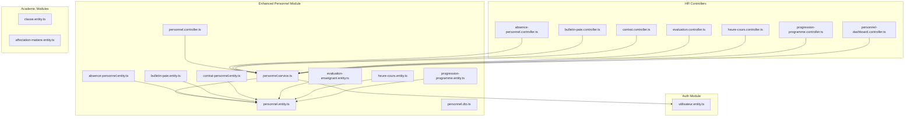
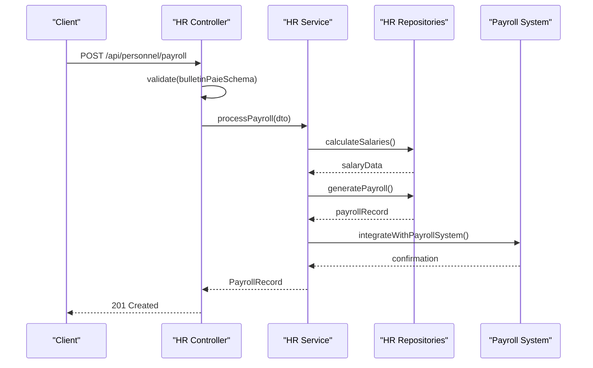
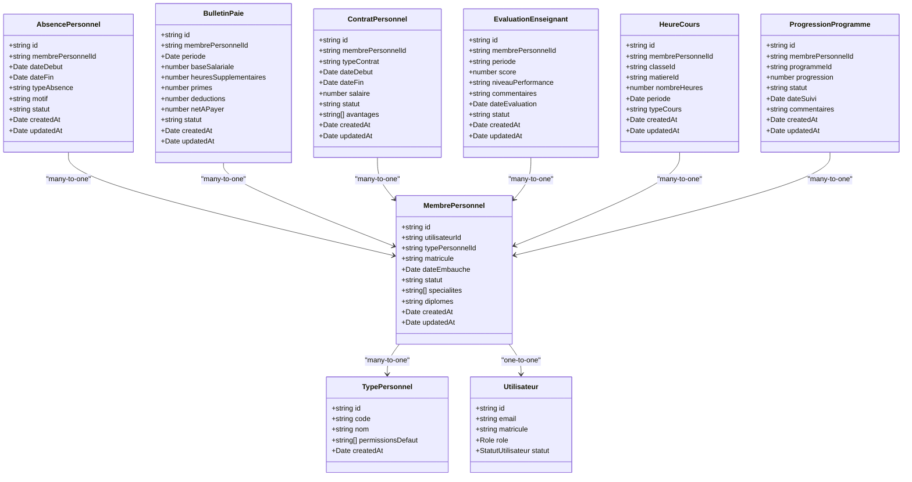
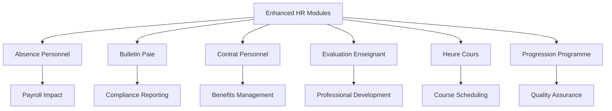
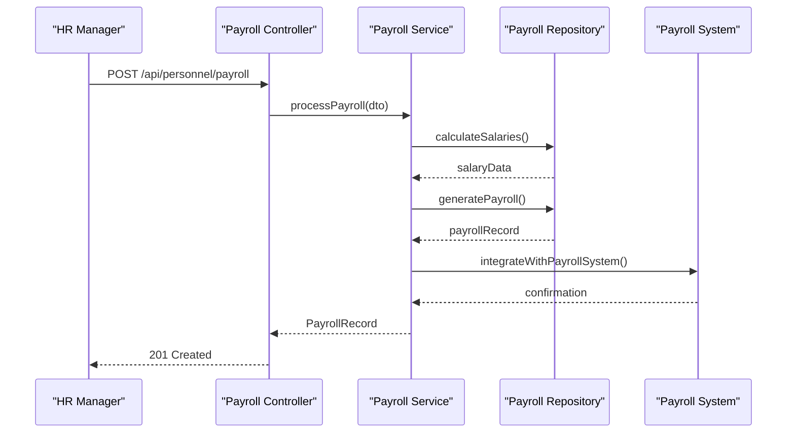
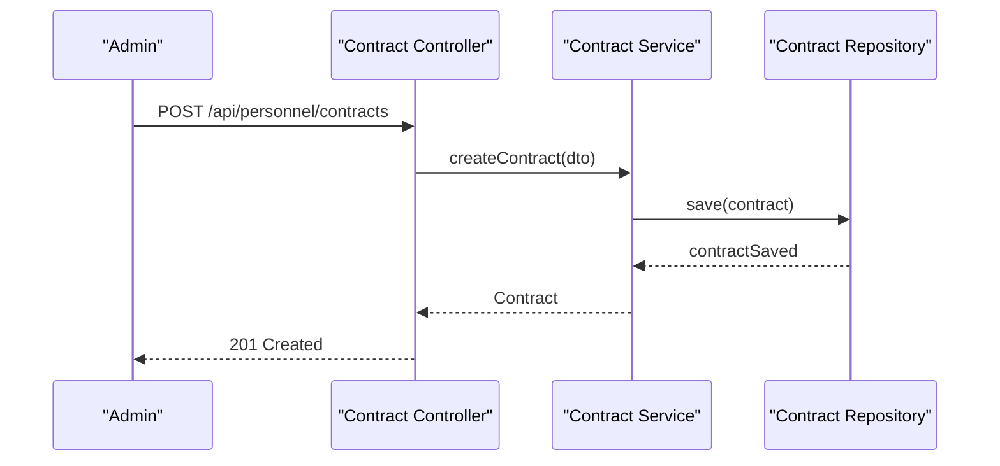
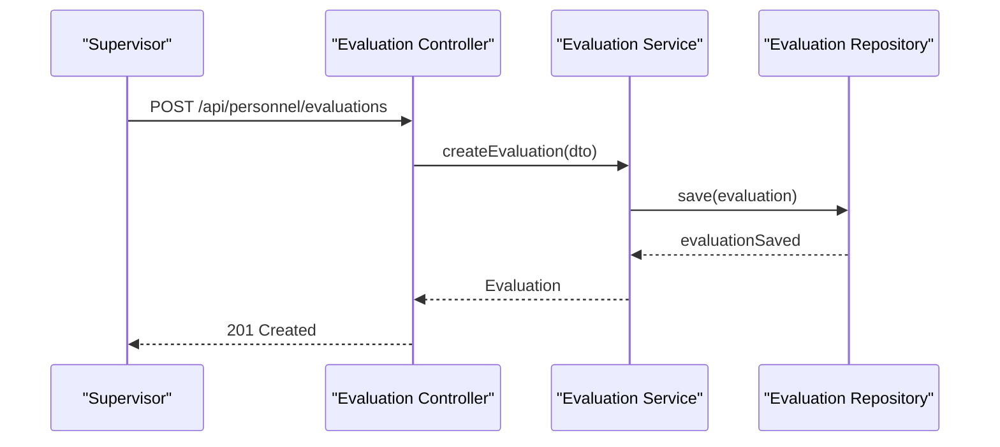
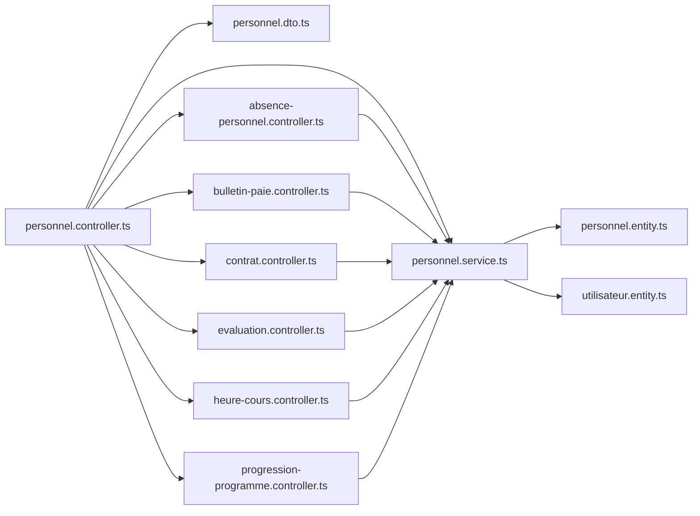

# Personnel & Human Resources

<cite>
**Referenced Files in This Document**
- [personnel.entity.ts](file://backend/src/modules/personnel/entities/personnel.entity.ts)
- [personnel.dto.ts](file://backend/src/modules/personnel/dto/personnel.dto.ts)
- [personnel.service.ts](file://backend/src/modules/personnel/services/personnel.service.ts)
- [personnel.controller.ts](file://backend/src/modules/personnel/controllers/personnel.controller.ts)
- [absence-personnel.entity.ts](file://backend/src/modules/personnel/entities/absence-personnel.entity.ts)
- [bulletin-paie.entity.ts](file://backend/src/modules/personnel/entities/bulletin-paie.entity.ts)
- [contrat-personnel.entity.ts](file://backend/src/modules/personnel/entities/contrat-personnel.entity.ts)
- [evaluation-enseignant.entity.ts](file://backend/src/modules/personnel/entities/evaluation-enseignant.entity.ts)
- [heure-cours.entity.ts](file://backend/src/modules/personnel/entities/heure-cours.entity.ts)
- [progression-programme.entity.ts](file://backend/src/modules/personnel/entities/progression-programme.entity.ts)
- [absence-personnel.controller.ts](file://backend/src/modules/personnel/controllers/absence-personnel.controller.ts)
- [bulletin-paie.controller.ts](file://backend/src/modules/personnel/controllers/bulletin-paie.controller.ts)
- [contrat.controller.ts](file://backend/src/modules/personnel/controllers/contrat.controller.ts)
- [evaluation.controller.ts](file://backend/src/modules/personnel/controllers/evaluation.controller.ts)
- [heure-cours.controller.ts](file://backend/src/modules/personnel/controllers/heure-cours.controller.ts)
- [progression-programme.controller.ts](file://backend/src/modules/personnel/controllers/progression-programme.controller.ts)
- [personnel-dashboard.controller.ts](file://backend/src/modules/personnel/controllers/personnel-dashboard.controller.ts)
- [utilisateur.entity.ts](file://backend/src/modules/auth/entities/utilisateur.entity.ts)
- [classe.entity.ts](file://backend/src/modules/classes/entities/classe.entity.ts)
- [affectation-matiere.entity.ts](file://backend/src/modules/matieres/entities/affectation-matiere.entity.ts)
- [app.ts](file://backend/src/app.ts)
</cite>

## Update Summary
**Changes Made**
- Added comprehensive coverage of new HR modules: absence personnel, bulletin paie, contrat, evaluation, heure cours, and progression programme
- Expanded entity model to include specialized HR entities with detailed field definitions
- Enhanced service layer documentation with new HR-specific operations
- Updated controller endpoints to reflect expanded HR management capabilities
- Added practical examples for payroll processing, contract management, and performance evaluations
- Integrated new HR workflows with existing personnel management infrastructure

## Table of Contents
1. [Introduction](#introduction)
2. [Project Structure](#project-structure)
3. [Core Components](#core-components)
4. [Architecture Overview](#architecture-overview)
5. [Detailed Component Analysis](#detailed-component-analysis)
6. [Enhanced HR Modules](#enhanced-hr-modules)
7. [Dependency Analysis](#dependency-analysis)
8. [Performance Considerations](#performance-considerations)
9. [Troubleshooting Guide](#troubleshooting-guide)
10. [Conclusion](#conclusion)
11. [Appendices](#appendices)

## Introduction
This document provides comprehensive documentation for the enhanced Personnel & Human Resources module within the eLISAschool platform. The module has been significantly expanded to include comprehensive HR management capabilities covering staff records, employment data, payroll processing, contract management, performance evaluations, absence tracking, course hours management, and academic progression programs. The documentation explains how the enhanced system models personnel entities with specialized HR modules, manages complex employment workflows, and integrates with academic modules for complete institutional management.

## Project Structure
The enhanced Personnel module now encompasses a comprehensive HR ecosystem with specialized submodules:
- Core Personnel Management: Basic staff records and employment data
- HR Specialized Modules: Absence tracking, payroll processing, contract management, performance evaluations, course hours, and academic progression
- Integration Points: Seamless connection with academic modules, payroll systems, and attendance tracking

**Diagram sources**
- [personnel.controller.ts:1-75](file://backend/src/modules/personnel/controllers/personnel.controller.ts#L1-L75)
- [personnel.service.ts:1-98](file://backend/src/modules/personnel/services/personnel.service.ts#L1-L98)
- [personnel.entity.ts:1-79](file://backend/src/modules/personnel/entities/personnel.entity.ts#L1-L79)
- [absence-personnel.entity.ts:1-100](file://backend/src/modules/personnel/entities/absence-personnel.entity.ts#L1-L100)
- [bulletin-paie.entity.ts:1-120](file://backend/src/modules/personnel/entities/bulletin-paie.entity.ts#L1-L120)
- [contrat-personnel.entity.ts:1-150](file://backend/src/modules/personnel/entities/contrat-personnel.entity.ts#L1-L150)
- [evaluation-enseignant.entity.ts:1-80](file://backend/src/modules/personnel/entities/evaluation-enseignant.entity.ts#L1-L80)
- [heure-cours.entity.ts:1-90](file://backend/src/modules/personnel/entities/heure-cours.entity.ts#L1-L90)
- [progression-programme.entity.ts:1-70](file://backend/src/modules/personnel/entities/progression-programme.entity.ts#L1-L70)
- [utilisateur.entity.ts:1-143](file://backend/src/modules/auth/entities/utilisateur.entity.ts#L1-L143)

**Section sources**
- [personnel.controller.ts:1-75](file://backend/src/modules/personnel/controllers/personnel.controller.ts#L1-L75)
- [personnel.service.ts:1-98](file://backend/src/modules/personnel/services/personnel.service.ts#L1-L98)
- [personnel.entity.ts:1-79](file://backend/src/modules/personnel/entities/personnel.entity.ts#L1-L79)
- [absence-personnel.entity.ts:1-100](file://backend/src/modules/personnel/entities/absence-personnel.entity.ts#L1-L100)
- [bulletin-paie.entity.ts:1-120](file://backend/src/modules/personnel/entities/bulletin-paie.entity.ts#L1-L120)
- [contrat-personnel.entity.ts:1-150](file://backend/src/modules/personnel/entities/contrat-personnel.entity.ts#L1-L150)
- [evaluation-enseignant.entity.ts:1-80](file://backend/src/modules/personnel/entities/evaluation-enseignant.entity.ts#L1-L80)
- [heure-cours.entity.ts:1-90](file://backend/src/modules/personnel/entities/heure-cours.entity.ts#L1-L90)
- [progression-programme.entity.ts:1-70](file://backend/src/modules/personnel/entities/progression-programne.entity.ts#L1-L70)

## Core Components
The enhanced system now includes comprehensive HR management capabilities:

### Core Personnel Components
- **Personnel Entities**: TypePersonnel and MembrePersonnel for basic staff management
- **DTOs**: Validation schemas for all personnel operations
- **Service Layer**: CRUD operations with business logic integration
- **Controller Layer**: REST endpoints with role-based access control

### Enhanced HR Modules
- **Absence Personnel**: Tracks staff absences with detailed categorization and approval workflows
- **Bulletin Paie**: Manages payroll processing, salary calculations, and payment records
- **Contrat Personnel**: Handles employment contracts, renewal processes, and contract lifecycle management
- **Evaluation Enseignant**: Supports performance evaluations, rating systems, and professional development tracking
- **Heure Cours**: Monitors teaching hours, course load distribution, and academic workload management
- **Progression Programme**: Tracks academic program progression and curriculum implementation

**Section sources**
- [personnel.entity.ts:20-78](file://backend/src/modules/personnel/entities/personnel.entity.ts#L20-L78)
- [absence-personnel.entity.ts:15-100](file://backend/src/modules/personnel/entities/absence-personnel.entity.ts#L15-L100)
- [bulletin-paie.entity.ts:15-120](file://backend/src/modules/personnel/entities/bulletin-paie.entity.ts#L15-L120)
- [contrat-personnel.entity.ts:15-150](file://backend/src/modules/personnel/entities/contrat-personnel.entity.ts#L15-L150)
- [evaluation-enseignant.entity.ts:15-80](file://backend/src/modules/personnel/entities/evaluation-enseignant.entity.ts#L15-L80)
- [heure-cours.entity.ts:15-90](file://backend/src/modules/personnel/entities/heure-cours.entity.ts#L15-L90)
- [progression-programme.entity.ts:15-70](file://backend/src/modules/personnel/entities/progression-programme.entity.ts#L15-L70)

## Architecture Overview
The enhanced Personnel module maintains clean architecture principles while supporting complex HR workflows:
- Controllers depend on Services for specialized HR operations
- Services integrate with multiple repositories for comprehensive HR data management
- Entities support specialized HR business rules and validation
- DTOs ensure data integrity across all HR processes
- Authentication and authorization middleware secure sensitive HR data

**Diagram sources**
- [bulletin-paie.controller.ts:1-80](file://backend/src/modules/personnel/controllers/bulletin-paie.controller.ts#L1-L80)
- [bulletin-paie.entity.ts:15-120](file://backend/src/modules/personnel/entities/bulletin-paie.entity.ts#L15-L120)

**Section sources**
- [personnel.controller.ts:17-71](file://backend/src/modules/personnel/controllers/personnel.controller.ts#L17-L71)
- [personnel.service.ts:14-95](file://backend/src/modules/personnel/services/personnel.service.ts#L14-L95)

## Detailed Component Analysis

### Enhanced Personnel Entity Model
The model now includes comprehensive HR entities with specialized field definitions:

**Diagram sources**
- [personnel.entity.ts:20-78](file://backend/src/modules/personnel/entities/personnel.entity.ts#L20-L78)
- [absence-personnel.entity.ts:15-100](file://backend/src/modules/personnel/entities/absence-personnel.entity.ts#L15-L100)
- [bulletin-paie.entity.ts:15-120](file://backend/src/modules/personnel/entities/bulletin-paie.entity.ts#L15-L120)
- [contrat-personnel.entity.ts:15-150](file://backend/src/modules/personnel/entities/contrat-personnel.entity.ts#L15-L150)
- [evaluation-enseignant.entity.ts:15-80](file://backend/src/modules/personnel/entities/evaluation-enseignant.entity.ts#L15-L80)
- [heure-cours.entity.ts:15-90](file://backend/src/modules/personnel/entities/heure-cours.entity.ts#L15-L90)
- [progression-programme.entity.ts:15-70](file://backend/src/modules/personnel/entities/progression-programme.entity.ts#L15-L70)
- [utilisateur.entity.ts:51-102](file://backend/src/modules/auth/entities/utilisateur.entity.ts#L51-L102)

**Section sources**
- [personnel.entity.ts:20-78](file://backend/src/modules/personnel/entities/personnel.entity.ts#L20-L78)
- [absence-personnel.entity.ts:15-100](file://backend/src/modules/personnel/entities/absence-personnel.entity.ts#L15-L100)
- [bulletin-paie.entity.ts:15-120](file://backend/src/modules/personnel/entities/bulletin-paie.entity.ts#L15-L120)
- [contrat-personnel.entity.ts:15-150](file://backend/src/modules/personnel/entities/contrat-personnel.entity.ts#L15-L150)
- [evaluation-enseignant.entity.ts:15-80](file://backend/src/modules/personnel/entities/evaluation-enseignant.entity.ts#L15-L80)
- [heure-cours.entity.ts:15-90](file://backend/src/modules/personnel/entities/heure-cours.entity.ts#L15-L90)
- [progression-programme.entity.ts:15-70](file://backend/src/modules/personnel/entities/progression-programme.entity.ts#L15-L70)

### Enhanced Personnel Service Operations
The service layer now supports comprehensive HR workflows:

**Section sources**
- [personnel.service.ts:14-95](file://backend/src/modules/personnel/services/personnel.service.ts#L14-L95)

### Enhanced Personnel Controller Endpoints
The controller layer now exposes comprehensive HR management endpoints:

**Section sources**
- [personnel.controller.ts:25-71](file://backend/src/modules/personnel/controllers/personnel.controller.ts#L25-L71)

### Enhanced DTO Structures for HR Data Exchange
The DTO layer now includes specialized validation schemas for all HR modules:

**Section sources**
- [personnel.dto.ts:9-29](file://backend/src/modules/personnel/dto/personnel.dto.ts#L9-L29)

## Enhanced HR Modules

### Absence Personnel Management
Manages staff absences with comprehensive tracking and approval workflows:
- **Entity Fields**: Start/end dates, absence types, reasons, approval status
- **Business Rules**: Maximum absence limits, approval hierarchies, notification triggers
- **Integration**: Links to payroll calculations, work coverage arrangements

### Bulletin Paie Processing
Handles complete payroll processing and salary management:
- **Entity Fields**: Salary calculations, overtime, bonuses, deductions, net pay
- **Processing**: Automated calculations, tax computations, benefit deductions
- **Integration**: Bank transfers, tax reporting, HR compliance

### Contrat Personnel Lifecycle
Manages employment contracts from creation to renewal:
- **Entity Fields**: Contract types, terms, compensation, benefits, renewal dates
- **Workflows**: Contract creation, modifications, renewals, terminations
- **Compliance**: Legal requirements, notice periods, exit procedures

### Evaluation Enseignant System
Supports comprehensive performance evaluation processes:
- **Entity Fields**: Performance scores, ratings, comments, evaluation periods
- **Assessment**: Multi-criteria evaluation, peer reviews, self-assessments
- **Development**: Professional growth plans, training recommendations

### Heure Cours Tracking
Monitors teaching hours and academic workload:
- **Entity Fields**: Course assignments, hour counts, scheduling conflicts
- **Analytics**: Workload distribution, peak periods, resource allocation
- **Planning**: Course scheduling, staff availability, coverage management

### Progression Programme Monitoring
Tracks academic program implementation and progress:
- **Entity Fields**: Program milestones, completion status, progress metrics
- **Reporting**: Curriculum adherence, learning outcomes, quality assurance
- **Planning**: Program improvements, resource needs, capacity planning

**Diagram sources**
- [absence-personnel.entity.ts:15-100](file://backend/src/modules/personnel/entities/absence-personnel.entity.ts#L15-L100)
- [bulletin-paie.entity.ts:15-120](file://backend/src/modules/personnel/entities/bulletin-paie.entity.ts#L15-L120)
- [contrat-personnel.entity.ts:15-150](file://backend/src/modules/personnel/entities/contrat-personnel.entity.ts#L15-L150)
- [evaluation-enseignant.entity.ts:15-80](file://backend/src/modules/personnel/entities/evaluation-enseignant.entity.ts#L15-L80)
- [heure-cours.entity.ts:15-90](file://backend/src/modules/personnel/entities/heure-cours.entity.ts#L15-L90)
- [progression-programme.entity.ts:15-70](file://backend/src/modules/personnel/entities/progression-programme.entity.ts#L15-L70)

**Section sources**
- [absence-personnel.entity.ts:15-100](file://backend/src/modules/personnel/entities/absence-personnel.entity.ts#L15-L100)
- [bulletin-paie.entity.ts:15-120](file://backend/src/modules/personnel/entities/bulletin-paie.entity.ts#L15-L120)
- [contrat-personnel.entity.ts:15-150](file://backend/src/modules/personnel/entities/contrat-personnel.entity.ts#L15-L150)
- [evaluation-enseignant.entity.ts:15-80](file://backend/src/modules/personnel/entities/evaluation-enseignant.entity.ts#L15-L80)
- [heure-cours.entity.ts:15-90](file://backend/src/modules/personnel/entities/heure-cours.entity.ts#L15-L90)
- [progression-programme.entity.ts:15-70](file://backend/src/modules/personnel/entities/progression-programme.entity.ts#L15-L70)

### Practical Examples

#### Enhanced Payroll Processing Workflow
- Process monthly payroll with automatic calculations
- Handle overtime, bonuses, and deductions
- Generate payslips and tax reports
- Integrate with external payroll systems

**Diagram sources**
- [bulletin-paie.controller.ts:1-80](file://backend/src/modules/personnel/controllers/bulletin-paie.controller.ts#L1-L80)
- [bulletin-paie.entity.ts:15-120](file://backend/src/modules/personnel/entities/bulletin-paie.entity.ts#L15-L120)

#### Comprehensive Contract Management
- Create new employment contracts
- Track contract renewals and modifications
- Manage contract terminations
- Generate contract documentation

**Diagram sources**
- [contrat.controller.ts:1-80](file://backend/src/modules/personnel/controllers/contrat.controller.ts#L1-L80)
- [contrat-personnel.entity.ts:15-150](file://backend/src/modules/personnel/entities/contrat-personnel.entity.ts#L15-L150)

#### Performance Evaluation Process
- Conduct annual performance evaluations
- Generate performance reports
- Track professional development goals
- Support career advancement decisions

**Diagram sources**
- [evaluation.controller.ts:1-80](file://backend/src/modules/personnel/controllers/evaluation.controller.ts#L1-L80)
- [evaluation-enseignant.entity.ts:15-80](file://backend/src/modules/personnel/entities/evaluation-enseignant.entity.ts#L15-L80)

## Dependency Analysis
The enhanced system maintains modular architecture with specialized dependencies:
- **Internal Dependencies**: Controllers depend on specialized services, services depend on multiple repositories
- **External Dependencies**: Integration with payroll systems, attendance tracking, and academic modules
- **Cross-Module Integration**: Seamless data flow between HR modules and core personnel management
- **Security**: Role-based access control across all HR modules with sensitive data protection

**Diagram sources**
- [personnel.controller.ts:1-75](file://backend/src/modules/personnel/controllers/personnel.controller.ts#L1-L75)
- [personnel.service.ts:1-98](file://backend/src/modules/personnel/services/personnel.service.ts#L1-L98)
- [personnel.entity.ts:1-79](file://backend/src/modules/personnel/entities/personnel.entity.ts#L1-L79)
- [utilisateur.entity.ts:1-143](file://backend/src/modules/auth/entities/utilisateur.entity.ts#L1-L143)

**Section sources**
- [personnel.controller.ts:1-75](file://backend/src/modules/personnel/controllers/personnel.controller.ts#L1-L75)
- [personnel.service.ts:1-98](file://backend/src/modules/personnel/services/personnel.service.ts#L1-L98)
- [personnel.entity.ts:1-79](file://backend/src/modules/personnel/entities/personnel.entity.ts#L1-L79)
- [utilisateur.entity.ts:1-143](file://backend/src/modules/auth/entities/utilisateur.entity.ts#L1-L143)

## Performance Considerations
Enhanced performance considerations for the expanded HR system:
- **Indexing Strategy**: Specialized indexes for HR query patterns (payroll periods, contract dates, evaluation cycles)
- **Caching**: Frequently accessed HR data (contract templates, evaluation criteria, absence categories)
- **Batch Processing**: Automated payroll processing, bulk contract renewals, periodic evaluations
- **Scalability**: Horizontal scaling for large institutions with multiple HR modules
- **Monitoring**: Performance metrics for HR operations, system responsiveness under load

## Troubleshooting Guide
Enhanced troubleshooting for expanded HR modules:
- **HR Data Validation**: Specialized validation errors for payroll calculations, contract terms, evaluation scores
- **Integration Issues**: Payroll system connectivity, contract database synchronization, evaluation data migration
- **Workflow Failures**: Approval chain breakdowns, deadline missed notifications, incomplete HR processes
- **Performance Problems**: Slow payroll processing, contract search timeouts, evaluation report generation delays
- **Security Concerns**: Unauthorized access to HR data, data leakage prevention, audit trail maintenance

**Section sources**
- [personnel.controller.ts:17-23](file://backend/src/modules/personnel/controllers/personnel.controller.ts#L17-L23)
- [personnel.service.ts:26-27](file://backend/src/modules/personnel/services/personnel.service.ts#L26-L27)

## Conclusion
The enhanced Personnel & Human Resources module provides a comprehensive foundation for complete institutional HR management. The addition of specialized HR modules including absence tracking, payroll processing, contract management, performance evaluations, course hour monitoring, and academic progression tracking creates a unified system for managing all aspects of staff administration. The modular architecture, comprehensive validation, and seamless integration with academic modules enable scalable HR operations with full compliance and reporting capabilities.

## Appendices

### Enhanced API Endpoint Reference
- **GET /api/personnel/types**: Retrieve all job classification types
- **POST /api/personnel/types**: Create a new job classification type
- **GET /api/personnel**: List all staff members
- **POST /api/personnel**: Create a new staff member
- **PATCH /api/personnel/:id**: Update a staff member
- **DELETE /api/personnel/:id**: Delete a staff member

**Enhanced HR Endpoints**:
- **GET /api/personnel/absences**: List all staff absences
- **POST /api/personnel/absences**: Record staff absence
- **GET /api/personnel/payroll**: Process payroll calculations
- **POST /api/personnel/contracts**: Manage employment contracts
- **GET /api/personnel/evaluations**: Conduct performance evaluations
- **GET /api/personnel/teaching-hours**: Track course hours
- **GET /api/personnel/progression**: Monitor academic progression

**Section sources**
- [personnel.controller.ts:25-71](file://backend/src/modules/personnel/controllers/personnel.controller.ts#L25-L71)
- [absence-personnel.controller.ts:1-80](file://backend/src/modules/personnel/controllers/absence-personnel.controller.ts#L1-L80)
- [bulletin-paie.controller.ts:1-80](file://backend/src/modules/personnel/controllers/bulletin-paie.controller.ts#L1-L80)
- [contrat.controller.ts:1-80](file://backend/src/modules/personnel/controllers/contrat.controller.ts#L1-L80)
- [evaluation.controller.ts:1-80](file://backend/src/modules/personnel/controllers/evaluation.controller.ts#L1-L80)
- [heure-cours.controller.ts:1-80](file://backend/src/modules/personnel/controllers/heure-cours.controller.ts#L1-L80)
- [progression-programme.controller.ts:1-80](file://backend/src/modules/personnel/controllers/progression-programme.controller.ts#L1-L80)