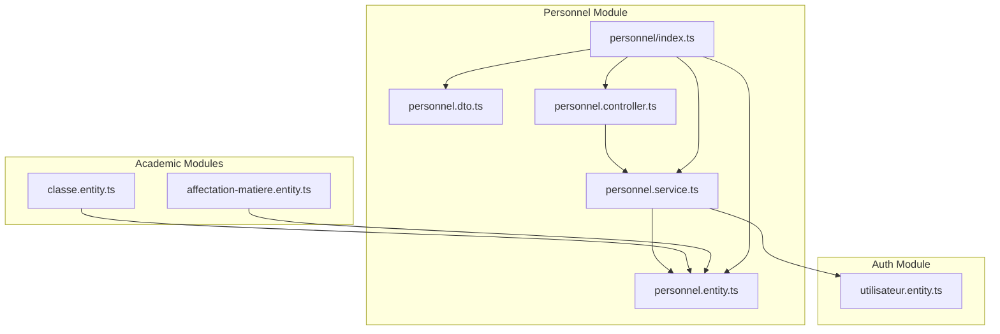
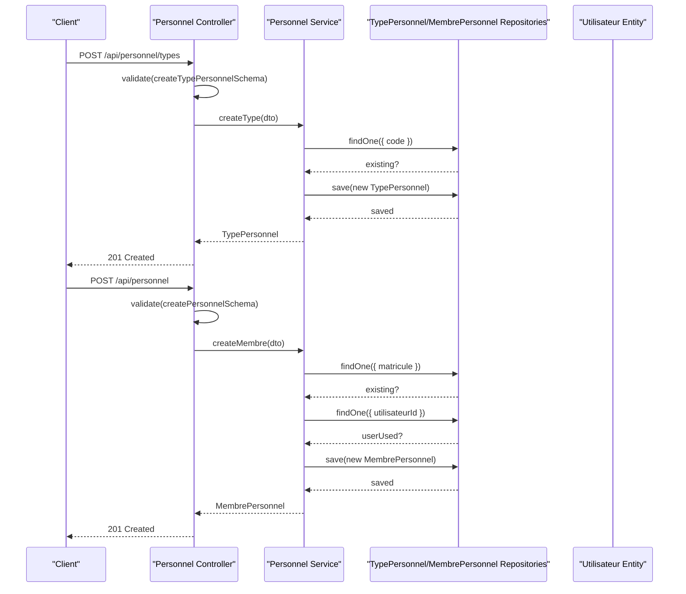
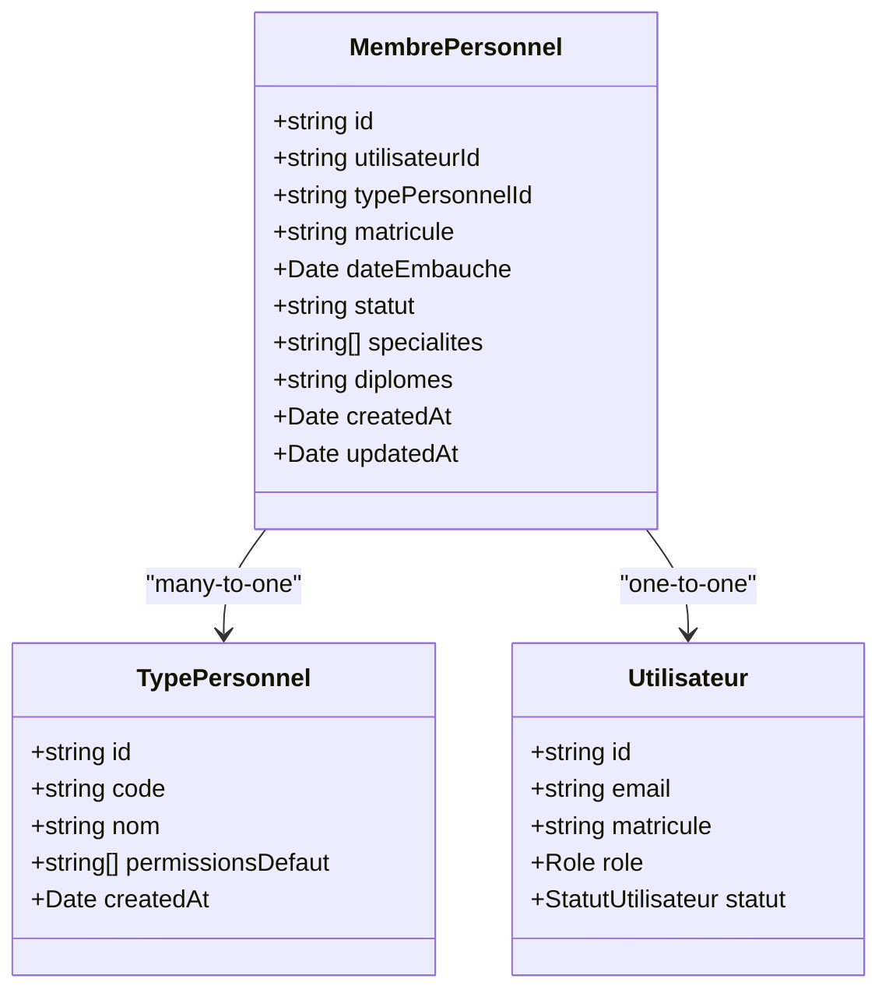
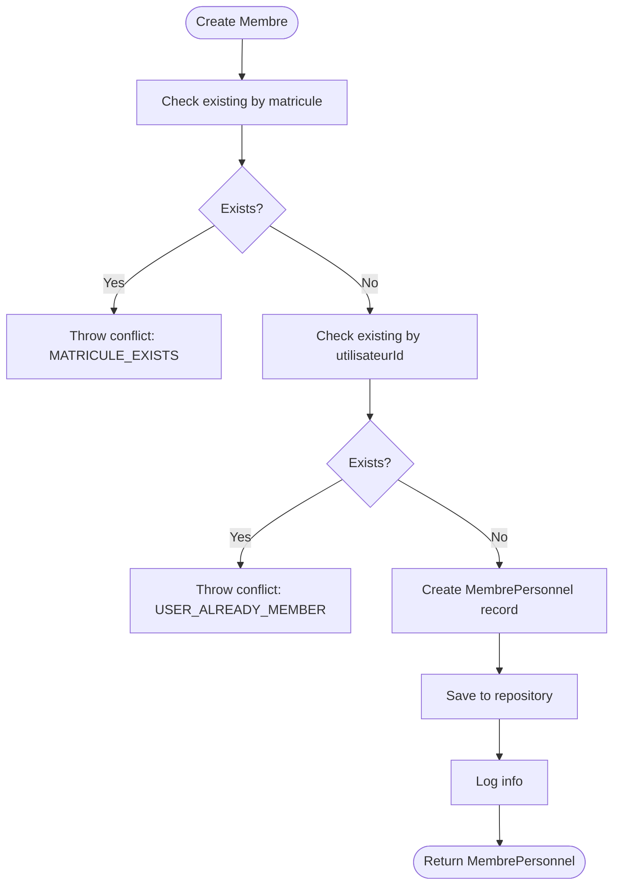
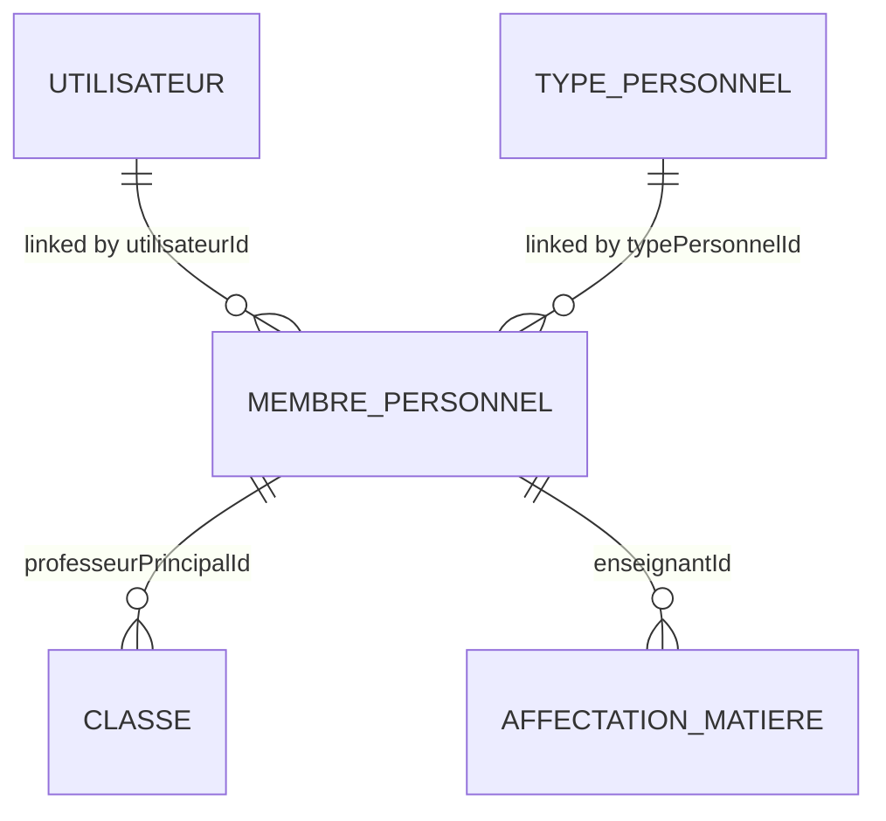
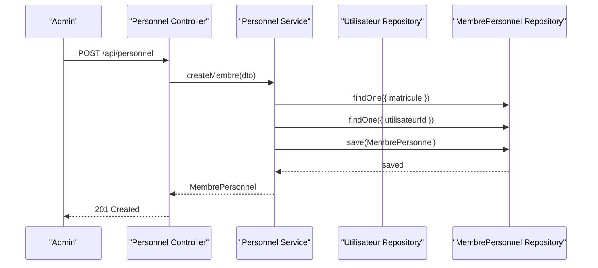
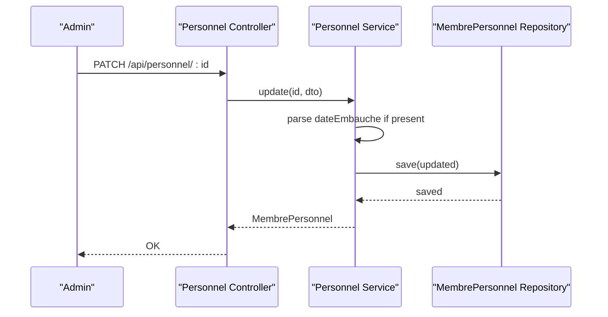
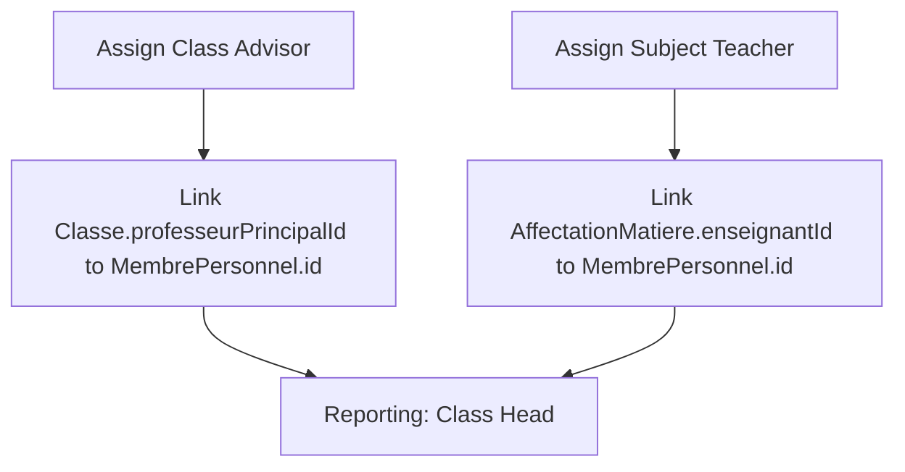
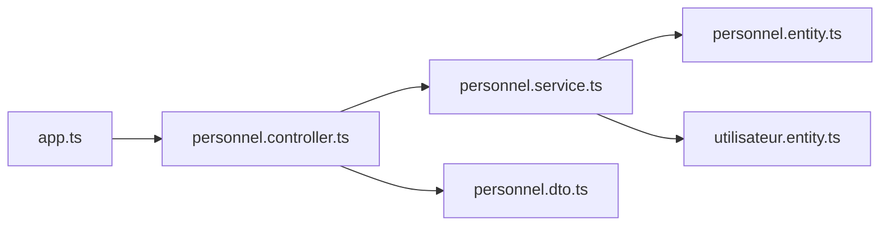

# Personnel & Human Resources

<cite>
**Referenced Files in This Document**
- [personnel.entity.ts](file://backend/src/modules/personnel/entities/personnel.entity.ts)
- [personnel.dto.ts](file://backend/src/modules/personnel/dto/personnel.dto.ts)
- [personnel.service.ts](file://backend/src/modules/personnel/services/personnel.service.ts)
- [personnel.controller.ts](file://backend/src/modules/personnel/controllers/personnel.controller.ts)
- [index.ts](file://backend/src/modules/personnel/index.ts)
- [utilisateur.entity.ts](file://backend/src/modules/auth/entities/utilisateur.entity.ts)
- [classe.entity.ts](file://backend/src/modules/classes/entities/classe.entity.ts)
- [affectation-matiere.entity.ts](file://backend/src/modules/matieres/entities/affectation-matiere.entity.ts)
- [app.ts](file://backend/src/app.ts)
</cite>

## Table of Contents
1. [Introduction](#introduction)
2. [Project Structure](#project-structure)
3. [Core Components](#core-components)
4. [Architecture Overview](#architecture-overview)
5. [Detailed Component Analysis](#detailed-component-analysis)
6. [Dependency Analysis](#dependency-analysis)
7. [Performance Considerations](#performance-considerations)
8. [Troubleshooting Guide](#troubleshooting-guide)
9. [Conclusion](#conclusion)
10. [Appendices](#appendices)

## Introduction
This document provides comprehensive documentation for the Personnel & Human Resources module within the eLISAschool platform. It covers the personnel entity model, employment data, HR operations, and integration points with academic modules such as classes and subjects. The documentation explains how staff records are modeled, how recruitment and assignment workflows operate, and how the system supports reporting structures within an educational institution. Practical examples illustrate onboarding procedures, staff data management, role assignments, and integration with payroll and attendance systems.

## Project Structure
The Personnel module follows a layered architecture with clear separation of concerns:
- Entities define the persistence model for personnel types and staff members.
- DTOs enforce validation for incoming requests.
- Services encapsulate business logic for personnel operations.
- Controllers expose REST endpoints with authentication and authorization middleware.
- Integration occurs via foreign keys with the Users module and academic modules like Classes and Subjects.

**Diagram sources**
- [personnel.controller.ts:1-75](file://backend/src/modules/personnel/controllers/personnel.controller.ts#L1-L75)
- [personnel.service.ts:1-98](file://backend/src/modules/personnel/services/personnel.service.ts#L1-L98)
- [personnel.entity.ts:1-79](file://backend/src/modules/personnel/entities/personnel.entity.ts#L1-L79)
- [utilisateur.entity.ts:1-143](file://backend/src/modules/auth/entities/utilisateur.entity.ts#L1-L143)
- [classe.entity.ts:1-76](file://backend/src/modules/classes/entities/classe.entity.ts#L1-L76)
- [affectation-matiere.entity.ts:1-66](file://backend/src/modules/matieres/entities/affectation-matiere.entity.ts#L1-L66)
- [index.ts:1-5](file://backend/src/modules/personnel/index.ts#L1-L5)

**Section sources**
- [personnel.controller.ts:1-75](file://backend/src/modules/personnel/controllers/personnel.controller.ts#L1-L75)
- [personnel.service.ts:1-98](file://backend/src/modules/personnel/services/personnel.service.ts#L1-L98)
- [personnel.entity.ts:1-79](file://backend/src/modules/personnel/entities/personnel.entity.ts#L1-L79)
- [utilisateur.entity.ts:1-143](file://backend/src/modules/auth/entities/utilisateur.entity.ts#L1-L143)
- [classe.entity.ts:1-76](file://backend/src/modules/classes/entities/classe.entity.ts#L1-L76)
- [affectation-matiere.entity.ts:1-66](file://backend/src/modules/matieres/entities/affectation-matiere.entity.ts#L1-L66)
- [index.ts:1-5](file://backend/src/modules/personnel/index.ts#L1-L5)

## Core Components
- Personnel Entities
  - TypePersonnel: Defines job classification codes (e.g., teacher, director, supervisor) with default permissions and timestamps.
  - MembrePersonnel: Represents staff members linked to a user account, with employment details, status, specialties, and qualifications.
- DTOs
  - Validation schemas for creating/updating personnel and personnel types using Zod.
- Service Layer
  - Implements CRUD operations, uniqueness checks, and relation loading for personnel and types.
- Controller Layer
  - Exposes endpoints for managing personnel types and staff records with role-based access control.
- Integration
  - Staff members are associated with users via a UUID foreign key.
  - Academic modules reference staff for class supervision and subject teaching assignments.

**Section sources**
- [personnel.entity.ts:20-78](file://backend/src/modules/personnel/entities/personnel.entity.ts#L20-L78)
- [personnel.dto.ts:9-29](file://backend/src/modules/personnel/dto/personnel.dto.ts#L9-L29)
- [personnel.service.ts:14-95](file://backend/src/modules/personnel/services/personnel.service.ts#L14-L95)
- [personnel.controller.ts:17-71](file://backend/src/modules/personnel/controllers/personnel.controller.ts#L17-L71)
- [utilisateur.entity.ts:51-102](file://backend/src/modules/auth/entities/utilisateur.entity.ts#L51-L102)
- [classe.entity.ts:48-53](file://backend/src/modules/classes/entities/classe.entity.ts#L48-L53)
- [affectation-matiere.entity.ts:43-48](file://backend/src/modules/matieres/entities/affectation-matiere.entity.ts#L43-L48)

## Architecture Overview
The Personnel module adheres to clean architecture principles:
- Controllers depend on Services.
- Services depend on Repositories and Entities.
- DTOs validate inputs before reaching Services.
- Authentication middleware secures endpoints; role middleware restricts access to administrative functions.

**Diagram sources**
- [personnel.controller.ts:25-56](file://backend/src/modules/personnel/controllers/personnel.controller.ts#L25-L56)
- [personnel.service.ts:25-55](file://backend/src/modules/personnel/services/personnel.service.ts#L25-L55)
- [personnel.dto.ts:9-23](file://backend/src/modules/personnel/dto/personnel.dto.ts#L9-L23)
- [utilisateur.entity.ts:51-102](file://backend/src/modules/auth/entities/utilisateur.entity.ts#L51-L102)

**Section sources**
- [personnel.controller.ts:17-71](file://backend/src/modules/personnel/controllers/personnel.controller.ts#L17-L71)
- [personnel.service.ts:14-95](file://backend/src/modules/personnel/services/personnel.service.ts#L14-L95)
- [personnel.dto.ts:9-29](file://backend/src/modules/personnel/dto/personnel.dto.ts#L9-L29)

## Detailed Component Analysis

### Personnel Entity Model
The model consists of two primary entities:
- TypePersonnel: Stores job classification codes and default permissions.
- MembrePersonnel: Stores staff employment data, links to a user, and holds professional details.

**Diagram sources**
- [personnel.entity.ts:20-78](file://backend/src/modules/personnel/entities/personnel.entity.ts#L20-L78)
- [utilisateur.entity.ts:51-102](file://backend/src/modules/auth/entities/utilisateur.entity.ts#L51-L102)

**Section sources**
- [personnel.entity.ts:20-78](file://backend/src/modules/personnel/entities/personnel.entity.ts#L20-L78)
- [utilisateur.entity.ts:51-102](file://backend/src/modules/auth/entities/utilisateur.entity.ts#L51-L102)

### Personnel Service Operations
Responsibilities include:
- Managing job classification types (create/get).
- Managing staff records (create/find/update/delete), with uniqueness checks for matricule and user association.
- Loading relations for richer responses.

Key behaviors:
- Uniqueness validations prevent duplicate matricules and repeated user memberships.
- Date parsing ensures consistent storage of employment dates.
- Logging tracks creation and deletion events.

**Diagram sources**
- [personnel.service.ts:40-55](file://backend/src/modules/personnel/services/personnel.service.ts#L40-L55)

**Section sources**
- [personnel.service.ts:14-95](file://backend/src/modules/personnel/services/personnel.service.ts#L14-L95)

### Personnel Controller Endpoints
Endpoints:
- GET /api/personnel/types: Retrieve all job classification types (authenticated).
- POST /api/personnel/types: Create a new type (requires ADMIN or SUPER_ADMIN).
- GET /api/personnel: List all staff members (authenticated; ADMIN/SUPER_ADMIN/CHEF_ETABLISSEMENT).
- POST /api/personnel: Create a new staff member (authenticated; ADMIN/SUPER_ADMIN).
- PATCH /api/personnel/:id: Update a staff member (authenticated; ADMIN/SUPER_ADMIN).
- DELETE /api/personnel/:id: Delete a staff member (authenticated; ADMIN/SUPER_ADMIN).

Validation:
- Uses Zod schemas to validate request bodies and throws structured errors on validation failure.

Authorization:
- authMiddleware ensures authentication.
- requireRoles restricts endpoints to specific roles.

Integration:
- The module is mounted under /api/personnel in the application.

**Section sources**
- [personnel.controller.ts:25-71](file://backend/src/modules/personnel/controllers/personnel.controller.ts#L25-L71)
- [app.ts:180-180](file://backend/src/app.ts#L180-L180)

### DTO Structures for Staff Data Exchange
- CreateTypePersonnelDto: Enforces code and name constraints and optional default permissions array.
- CreatePersonnelDto: Enforces user link, optional type, unique staff identifier, hire date format, status enum, optional specialties and qualifications.
- UpdatePersonnelDto: Partial update excluding immutable user link.

Validation rules:
- String lengths and formats enforced via Zod.
- Date formats accept ISO datetime or YYYY-MM-DD pattern.

**Section sources**
- [personnel.dto.ts:9-29](file://backend/src/modules/personnel/dto/personnel.dto.ts#L9-L29)

### Integration with Academic Modules
- Classes: Professors can be assigned as class advisors via a foreign key to MembrePersonnel.
- Subject Assignments: Teachers are linked to subject classes through an assignment entity referencing MembrePersonnel.

**Diagram sources**
- [utilisateur.entity.ts:51-102](file://backend/src/modules/auth/entities/utilisateur.entity.ts#L51-L102)
- [personnel.entity.ts:38-78](file://backend/src/modules/personnel/entities/personnel.entity.ts#L38-L78)
- [classe.entity.ts:48-53](file://backend/src/modules/classes/entities/classe.entity.ts#L48-L53)
- [affectation-matiere.entity.ts:43-48](file://backend/src/modules/matieres/entities/affectation-matiere.entity.ts#L43-L48)

**Section sources**
- [classe.entity.ts:48-53](file://backend/src/modules/classes/entities/classe.entity.ts#L48-L53)
- [affectation-matiere.entity.ts:43-48](file://backend/src/modules/matieres/entities/affectation-matiere.entity.ts#L43-L48)

### Practical Examples

#### Onboarding Procedure
- Create a user account in the Users module with a unique email and matricule.
- Create a personnel type (e.g., TEACHER) with default permissions if needed.
- Create a staff member record linking the user to the personnel type, assigning a unique staff identifier and hire date.
- Assign the staff member to a class as a class advisor or to teach subjects.

**Diagram sources**
- [personnel.controller.ts:50-56](file://backend/src/modules/personnel/controllers/personnel.controller.ts#L50-L56)
- [personnel.service.ts:40-55](file://backend/src/modules/personnel/services/personnel.service.ts#L40-L55)

#### Staff Data Management
- Update employment status, specialties, or qualifications.
- Change job classification by updating the typePersonnelId.
- Deactivate or remove a staff member record when employment ends.

**Diagram sources**
- [personnel.controller.ts:58-64](file://backend/src/modules/personnel/controllers/personnel.controller.ts#L58-L64)
- [personnel.service.ts:80-88](file://backend/src/modules/personnel/services/personnel.service.ts#L80-L88)

#### Role Assignments and Reporting Structures
- Class advisor assignment links a staff member to a class.
- Subject teaching assignments link staff members to specific classes and subjects.
- These relationships support reporting structures such as department heads overseeing classes and subject coordinators.

**Diagram sources**
- [classe.entity.ts:48-53](file://backend/src/modules/classes/entities/classe.entity.ts#L48-L53)
- [affectation-matiere.entity.ts:43-48](file://backend/src/modules/matieres/entities/affectation-matiere.entity.ts#L43-L48)

## Dependency Analysis
- Internal dependencies
  - Controller depends on Service and DTOs.
  - Service depends on Entities and repositories initialized via the data source.
  - Entities depend on the Users module for identity linkage.
- External dependencies
  - TypeORM for ORM and database operations.
  - Zod for runtime validation.
  - Express for routing and middleware integration.
- Routing
  - The module is registered under /api/personnel in the application bootstrap.

**Diagram sources**
- [personnel.controller.ts:1-75](file://backend/src/modules/personnel/controllers/personnel.controller.ts#L1-L75)
- [personnel.service.ts:1-98](file://backend/src/modules/personnel/services/personnel.service.ts#L1-L98)
- [personnel.entity.ts:1-79](file://backend/src/modules/personnel/entities/personnel.entity.ts#L1-L79)
- [utilisateur.entity.ts:1-143](file://backend/src/modules/auth/entities/utilisateur.entity.ts#L1-L143)
- [personnel.dto.ts:1-30](file://backend/src/modules/personnel/dto/personnel.dto.ts#L1-L30)
- [app.ts:180-180](file://backend/src/app.ts#L180-L180)

**Section sources**
- [personnel.controller.ts:1-75](file://backend/src/modules/personnel/controllers/personnel.controller.ts#L1-L75)
- [personnel.service.ts:1-98](file://backend/src/modules/personnel/services/personnel.service.ts#L1-L98)
- [personnel.entity.ts:1-79](file://backend/src/modules/personnel/entities/personnel.entity.ts#L1-L79)
- [utilisateur.entity.ts:1-143](file://backend/src/modules/auth/entities/utilisateur.entity.ts#L1-L143)
- [personnel.dto.ts:1-30](file://backend/src/modules/personnel/dto/personnel.dto.ts#L1-L30)
- [app.ts:180-180](file://backend/src/app.ts#L180-L180)

## Performance Considerations
- Indexing
  - MembrePersonnel has an index on utilisateurId to optimize lookups by user.
- Query patterns
  - Relations are loaded selectively (e.g., user and type) to avoid heavy joins when not needed.
- Validation cost
  - Zod validation occurs at the controller boundary, reducing downstream processing overhead.
- Recommendations
  - Add pagination for listing endpoints when scale grows.
  - Consider caching frequently accessed type lists.
  - Monitor logs for repeated conflicts during onboarding to optimize user provisioning workflows.

[No sources needed since this section provides general guidance]

## Troubleshooting Guide
Common issues and resolutions:
- Validation errors
  - Occur when request payloads violate DTO constraints (e.g., invalid date formats, missing required fields). The controller throws a structured error response.
- Duplicate identifiers
  - Matricule conflicts trigger a conflict error during staff creation.
  - Attempting to register a user already linked to a staff member triggers a conflict error.
- Not found errors
  - Fetching or updating a non-existent staff member raises a not found error.
- Authorization failures
  - Accessing protected endpoints without proper roles results in forbidden responses.

Operational logging
- Creation and deletion of staff records are logged for auditability.

**Section sources**
- [personnel.controller.ts:17-23](file://backend/src/modules/personnel/controllers/personnel.controller.ts#L17-L23)
- [personnel.service.ts:26-27](file://backend/src/modules/personnel/services/personnel.service.ts#L26-L27)
- [personnel.service.ts:41-46](file://backend/src/modules/personnel/services/personnel.service.ts#L41-L46)
- [personnel.service.ts:72-72](file://backend/src/modules/personnel/services/personnel.service.ts#L72-L72)

## Conclusion
The Personnel & Human Resources module provides a robust foundation for managing staff records, employment data, and HR operations within the educational institution. Its layered design, strict validation, and clear integrations with users and academic modules enable scalable onboarding, role assignments, and reporting structures. Future enhancements could include advanced reporting, payroll/attendance integrations, and expanded audit trails.

[No sources needed since this section summarizes without analyzing specific files]

## Appendices

### API Endpoint Reference
- GET /api/personnel/types
  - Description: Retrieve all job classification types.
  - Authentication: Required.
  - Roles: Any.
- POST /api/personnel/types
  - Description: Create a new job classification type.
  - Authentication: Required.
  - Roles: ADMIN, SUPER_ADMIN.
- GET /api/personnel
  - Description: List all staff members, optionally filtered by type.
  - Authentication: Required.
  - Roles: ADMIN, SUPER_ADMIN, CHEF_ETABLISSEMENT.
- POST /api/personnel
  - Description: Create a new staff member.
  - Authentication: Required.
  - Roles: ADMIN, SUPER_ADMIN.
- PATCH /api/personnel/:id
  - Description: Update a staff member.
  - Authentication: Required.
  - Roles: ADMIN, SUPER_ADMIN.
- DELETE /api/personnel/:id
  - Description: Delete a staff member.
  - Authentication: Required.
  - Roles: ADMIN, SUPER_ADMIN.

**Section sources**
- [personnel.controller.ts:25-71](file://backend/src/modules/personnel/controllers/personnel.controller.ts#L25-L71)
- [app.ts:180-180](file://backend/src/app.ts#L180-L180)