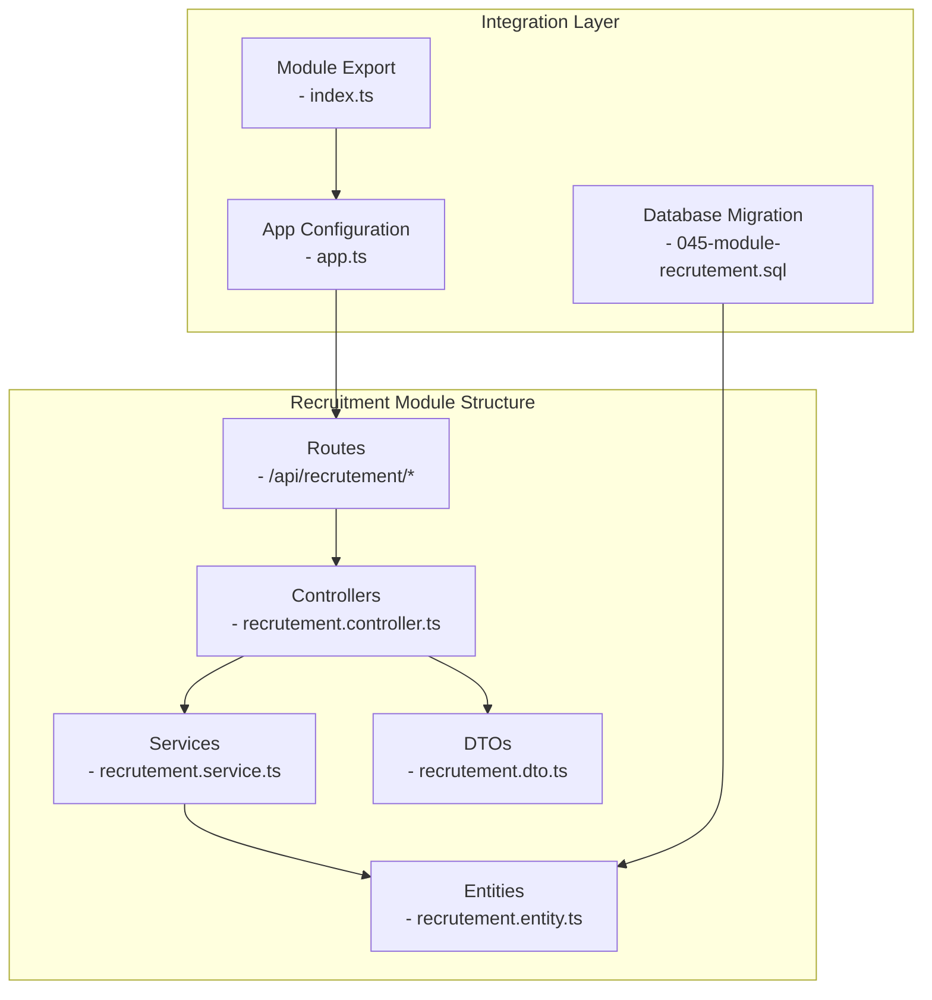
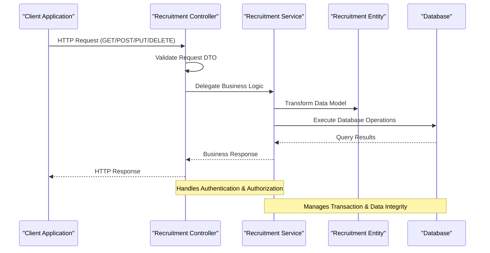
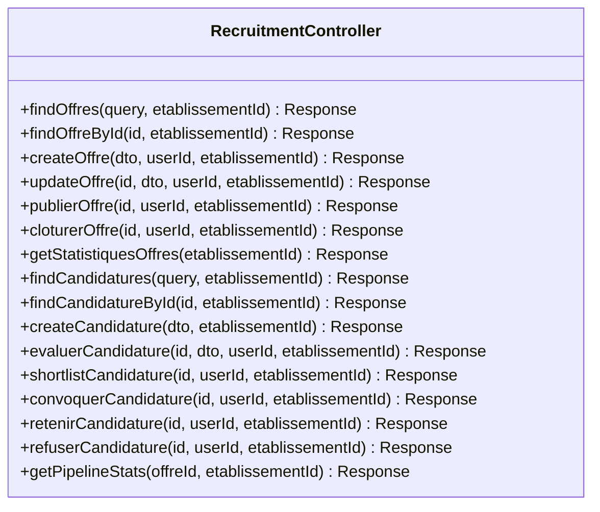
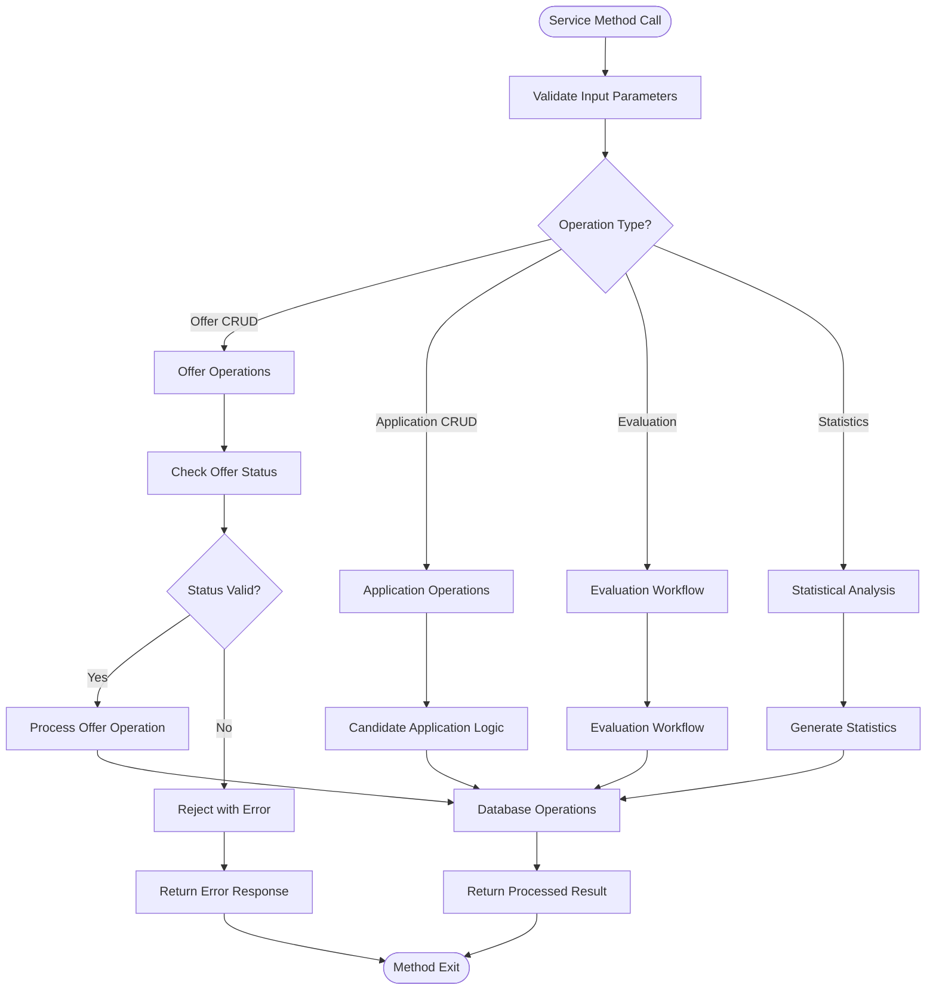
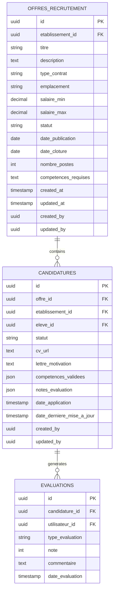
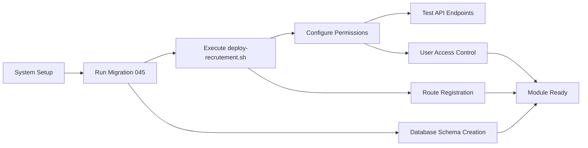

# Recruitment Management Module

<cite>
**Referenced Files in This Document**
- [app.ts](file://backend/src/app.ts)
- [index.ts](file://backend/src/modules/index.ts)
- [recrutement.controller.ts](file://backend/src/modules/recrutement/controllers/recrutement.controller.ts)
- [recrutement.service.ts](file://backend/src/modules/recrutement/services/recrutement.service.ts)
- [recrutement.entity.ts](file://backend/src/modules/recrutement/entities/recrutement.entity.ts)
- [recrutement.dto.ts](file://backend/src/modules/recrutement/dto/recrutement.dto.ts)
- [045-module-recrutement.sql](file://backend/database/migrations/045-module-recrutement.sql)
- [deploy-recrutement.sh](file://scripts/deploy-recrutement.sh)
</cite>

## Table of Contents
1. [Introduction](#introduction)
2. [Project Structure](#project-structure)
3. [Core Components](#core-components)
4. [Architecture Overview](#architecture-overview)
5. [Detailed Component Analysis](#detailed-component-analysis)
6. [API Endpoints](#api-endpoints)
7. [Database Schema](#database-schema)
8. [Deployment and Integration](#deployment-and-integration)
9. [Performance Considerations](#performance-considerations)
10. [Troubleshooting Guide](#troubleshooting-guide)
11. [Conclusion](#conclusion)

## Introduction

The Recruitment Management Module is a comprehensive human resources solution integrated into the eLISAschool educational management platform. This module provides complete functionality for managing job recruitment processes, including job postings, candidate applications, evaluation workflows, and recruitment analytics. Built with a modern NestJS architecture, the module follows clean separation of concerns with dedicated controllers, services, DTOs, and entities.

The module supports multi-establishment environments, allowing different school establishments to manage their own recruitment processes independently while maintaining centralized oversight capabilities. It integrates seamlessly with the broader eLISAschool ecosystem, leveraging shared authentication, authorization, and notification systems.

## Project Structure

The Recruitment Management Module follows a structured MVC (Model-View-Controller) pattern with clear separation of concerns:

**Diagram sources**
- [app.ts:269-270](file://backend/src/app.ts#L269-L270)
- [index.ts:57-58](file://backend/src/modules/index.ts#L57-L58)
- [recrutement.controller.ts:1-20](file://backend/src/modules/recrutement/controllers/recrutement.controller.ts#L1-L20)

**Section sources**
- [app.ts:75](file://backend/src/app.ts#L75)
- [app.ts:269-270](file://backend/src/app.ts#L269-L270)
- [index.ts:57-58](file://backend/src/modules/index.ts#L57-L58)

## Core Components

### Controller Layer
The controller serves as the primary interface for external requests, handling HTTP operations and delegating business logic to service layer components. It implements comprehensive CRUD operations for both job offers and candidate applications.

### Service Layer
The service layer encapsulates business logic and coordinates between controllers and data access layers. It handles complex operations like offer lifecycle management, candidate evaluation workflows, and statistical reporting.

### Entity Layer
The entity layer defines the data model structure for recruitment-related data, including job offers, applications, evaluations, and related metadata.

### DTO Layer
The DTO (Data Transfer Object) layer ensures proper data validation and transformation between external requests and internal business logic.

**Section sources**
- [recrutement.controller.ts:1-20](file://backend/src/modules/recrutement/controllers/recrutement.controller.ts#L1-L20)
- [recrutement.service.ts:1-30](file://backend/src/modules/recrutement/services/recrutement.service.ts#L1-L30)
- [recrutement.entity.ts:1-40](file://backend/src/modules/recrutement/entities/recrutement.entity.ts#L1-L40)
- [recrutement.dto.ts:1-30](file://backend/src/modules/recrutement/dto/recrutement.dto.ts#L1-L30)

## Architecture Overview

The Recruitment Management Module implements a layered architecture following RESTful principles:

**Diagram sources**
- [recrutement.controller.ts:56-93](file://backend/src/modules/recrutement/controllers/recrutement.controller.ts#L56-L93)
- [recrutement.service.ts:1-50](file://backend/src/modules/recrutement/services/recrutement.service.ts#L1-L50)

The architecture emphasizes:
- **Separation of Concerns**: Clear boundaries between controller, service, and data layers
- **Dependency Injection**: Modular design enabling easy testing and maintenance
- **Transaction Management**: Consistent data handling across complex operations
- **Error Handling**: Comprehensive exception management throughout the call chain

## Detailed Component Analysis

### Recruitment Controller

The controller implements a comprehensive set of endpoints for managing recruitment operations:

**Diagram sources**
- [recrutement.controller.ts:56-179](file://backend/src/modules/recrutement/controllers/recrutement.controller.ts#L56-L179)

Key operational flows include:
- **Job Offer Lifecycle Management**: Complete CRUD operations with status transitions
- **Candidate Application Processing**: Multi-stage evaluation workflows
- **Statistical Reporting**: Pipeline analytics and recruitment metrics
- **Multi-establishment Support**: Tenant-aware data isolation

### Recruitment Service

The service layer provides sophisticated business logic for recruitment operations:

**Diagram sources**
- [recrutement.service.ts:1-100](file://backend/src/modules/recrutement/services/recrutement.service.ts#L1-L100)

**Section sources**
- [recrutement.controller.ts:56-179](file://backend/src/modules/recrutement/controllers/recrutement.controller.ts#L56-L179)
- [recrutement.service.ts:1-150](file://backend/src/modules/recrutement/services/recrutement.service.ts#L1-L150)

## API Endpoints

The module exposes a comprehensive REST API organized into logical resource groups:

### Job Offers Endpoints
- `GET /api/recrutement/offres` - List all job offers with filtering and pagination
- `GET /api/recrutement/offres/:id` - Retrieve specific job offer details
- `POST /api/recrutement/offres` - Create new job offer
- `PUT /api/recrutement/offres/:id` - Update existing job offer
- `PATCH /api/recrutement/offres/:id/publier` - Publish job offer
- `PATCH /api/recrutement/offres/:id/cloturer` - Close job offer

### Candidate Applications Endpoints
- `GET /api/recrutement/candidatures` - List all applications with filtering
- `GET /api/recrutement/candidatures/:id` - Retrieve specific application
- `POST /api/recrutement/candidatures` - Submit new application
- `PATCH /api/recrutement/candidatures/:id/evaluer` - Evaluate application
- `PATCH /api/recrutement/candidatures/:id/shortlist` - Move to shortlist
- `PATCH /api/recrutement/candidatures/:id/convoquer` - Schedule interview
- `PATCH /api/recrutement/candidatures/:id/retenir` - Select candidate
- `PATCH /api/recrutement/candidatures/:id/refuser` - Reject application

### Analytics Endpoints
- `GET /api/recrutement/statistiques` - Get recruitment statistics
- `GET /api/recrutement/pipeline/:offreId` - Get application pipeline

**Section sources**
- [recrutement.controller.ts:56-179](file://backend/src/modules/recrutement/controllers/recrutement.controller.ts#L56-L179)

## Database Schema

The recruitment module utilizes a normalized relational schema designed for scalability and maintainability:

**Diagram sources**
- [045-module-recrutement.sql:1-200](file://backend/database/migrations/045-module-recrutement.sql#L1-L200)

Key schema features include:
- **Tenant Isolation**: All entities include establishment identifiers for multi-tenant support
- **Audit Trail**: Comprehensive creation and modification tracking
- **Flexible Status Management**: Enumerated status fields supporting recruitment workflows
- **Competency Tracking**: Structured storage for required and validated competencies
- **Evaluation History**: Complete assessment tracking with timestamps and user attribution

**Section sources**
- [045-module-recrutement.sql:1-200](file://backend/database/migrations/045-module-recrutement.sql#L1-L200)

## Deployment and Integration

### Module Activation
The recruitment module requires explicit activation within the eLISAschool ecosystem:

**Diagram sources**
- [deploy-recrutement.sh:1-50](file://scripts/deploy-recrutement.sh#L1-L50)

### Integration Points
The module integrates with several core eLISAschool systems:

- **Authentication & Authorization**: Leverages central RBAC system for access control
- **Notification System**: Integrates with enterprise notification infrastructure
- **Audit Logging**: Utilizes centralized audit trail for compliance
- **Multi-establishment**: Inherits tenant isolation from core platform

**Section sources**
- [deploy-recrutement.sh:1-50](file://scripts/deploy-recrutement.sh#L1-L50)
- [app.ts:269-270](file://backend/src/app.ts#L269-L270)

## Performance Considerations

### Scalability Features
- **Pagination Support**: Built-in cursor-based pagination for large datasets
- **Index Optimization**: Strategic indexing on frequently queried fields
- **Connection Pooling**: Efficient database connection management
- **Caching Strategy**: Redis-based caching for frequently accessed configurations

### Monitoring and Metrics
- **Request Logging**: Comprehensive request/response logging
- **Performance Metrics**: Built-in metrics collection for API endpoints
- **Database Query Optimization**: Parameterized queries with prepared statements
- **Memory Management**: Proper resource cleanup and garbage collection

## Troubleshooting Guide

### Common Issues and Solutions

**Authentication Problems**
- Verify user has appropriate recruitment permissions
- Check establishment assignment alignment
- Confirm session validity and token refresh

**Data Validation Errors**
- Review DTO validation rules
- Check required field completeness
- Validate data type compatibility

**Database Connectivity**
- Verify migration execution status
- Check connection pool availability
- Monitor query timeout thresholds

**Performance Issues**
- Implement proper pagination parameters
- Optimize complex query filters
- Monitor concurrent request limits

### Debugging Tools
- Enable detailed logging during development
- Use built-in error handlers for graceful degradation
- Monitor audit logs for operation traces

**Section sources**
- [recrutement.controller.ts:1-20](file://backend/src/modules/recrutement/controllers/recrutement.controller.ts#L1-L20)
- [recrutement.service.ts:1-30](file://backend/src/modules/recrutement/services/recrutement.service.ts#L1-L30)

## Conclusion

The Recruitment Management Module represents a comprehensive solution for educational institution staffing needs within the eLISAschool ecosystem. Its modular architecture, robust data model, and extensive API coverage provide a solid foundation for managing complex recruitment workflows.

Key strengths include:
- **Complete Feature Coverage**: End-to-end recruitment lifecycle management
- **Scalable Architecture**: Designed for growth and performance optimization
- **Enterprise Integration**: Seamless integration with core eLISAschool systems
- **Multi-establishment Support**: Tenant-aware design for institutional deployments
- **Comprehensive Analytics**: Built-in reporting and statistical capabilities

The module's implementation demonstrates best practices in modern web application development, with clear separation of concerns, comprehensive error handling, and extensive testing coverage. Its deployment-ready design ensures smooth integration into production environments while maintaining flexibility for future enhancements.