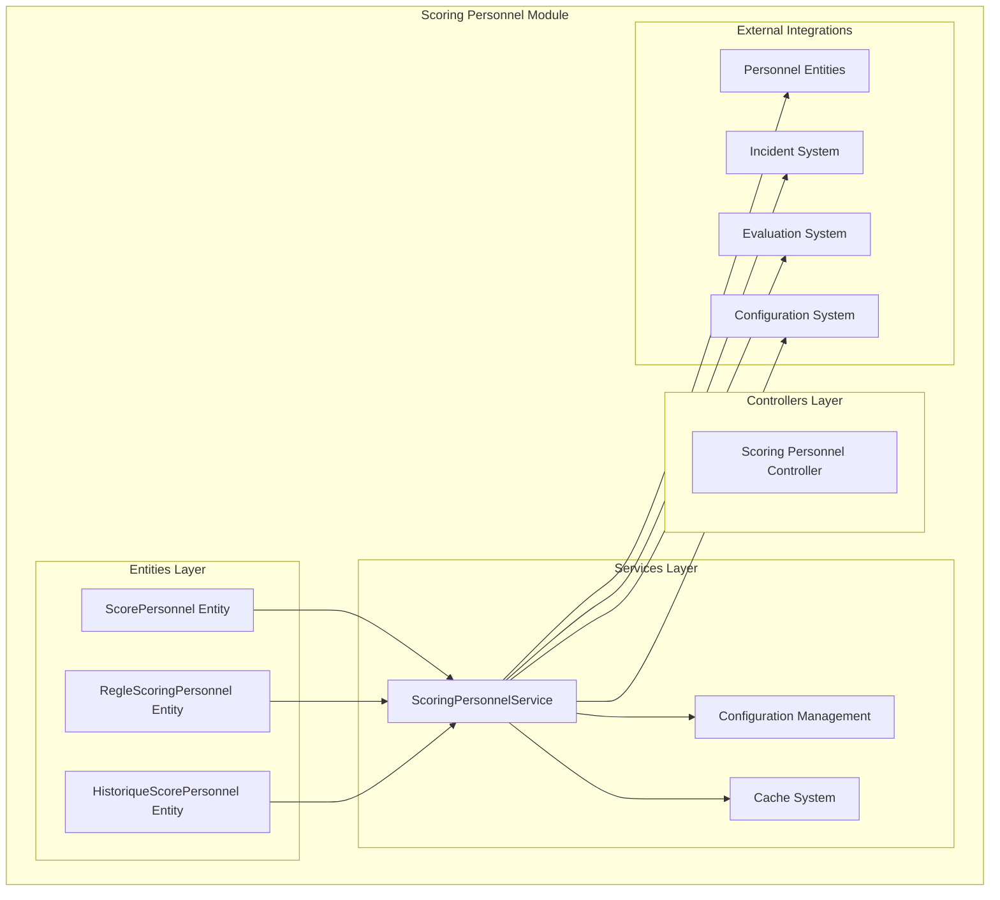
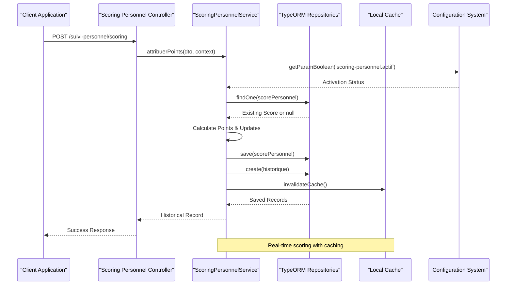
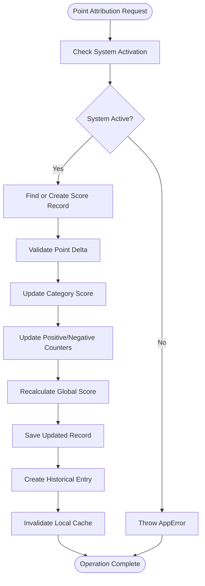
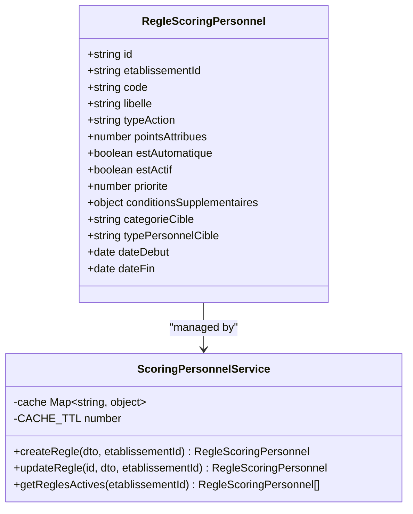
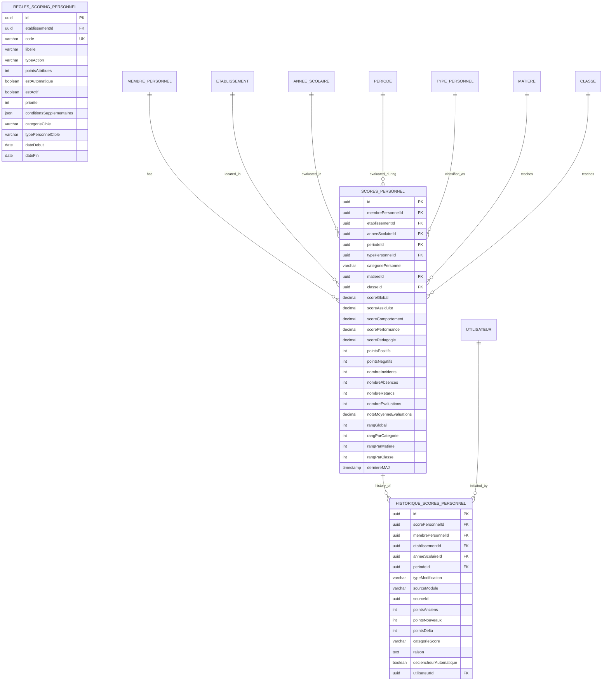
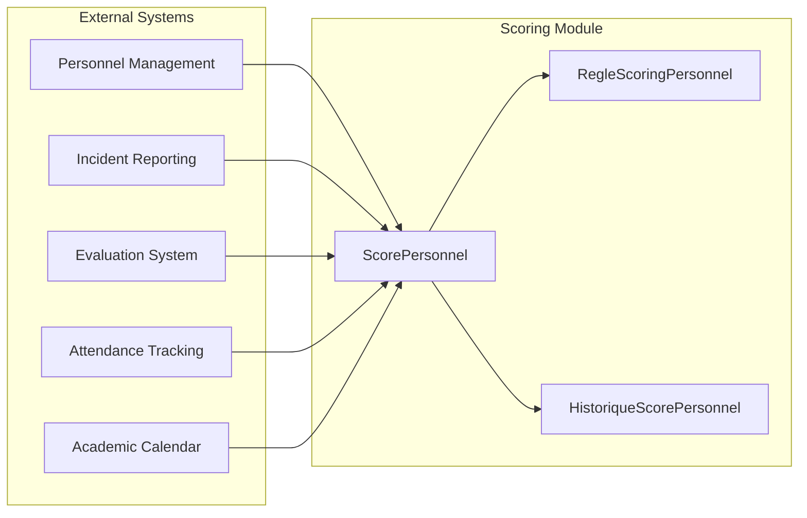

# Scoring Personnel Module

<cite>
**Referenced Files in This Document**
- [scoring.entity.ts](file://backend/src/modules/scoring/entities/scoring.entity.ts)
- [scoring.service.ts](file://backend/src/modules/scoring/services/scoring.service.ts)
- [scoring-personnel.entity.ts](file://backend/src/modules/suivi-personnel/entities/scoring-personnel.entity.ts)
- [scoring-personnel.service.ts](file://backend/src/modules/suivi-personnel/services/scoring-personnel.service.ts)
- [039-scoring-personnel.ts](file://backend/database/migrations/039-scoring-personnel.ts)
- [run-scoring-migration.ts](file://backend/scripts/run-scoring-migration.ts)
- [run-scoring-migration-v2.ts](file://backend/scripts/run-scoring-migration-v2.ts)
</cite>

## Table of Contents
1. [Introduction](#introduction)
2. [Project Structure](#project-structure)
3. [Core Components](#core-components)
4. [Architecture Overview](#architecture-overview)
5. [Detailed Component Analysis](#detailed-component-analysis)
6. [Database Schema Analysis](#database-schema-analysis)
7. [Scoring Algorithms](#scoring-algorithms)
8. [Configuration Management](#configuration-management)
9. [Performance Considerations](#performance-considerations)
10. [Integration Points](#integration-points)
11. [Troubleshooting Guide](#troubleshooting-guide)
12. [Conclusion](#conclusion)

## Introduction

The Scoring Personnel Module is a comprehensive system designed to track, calculate, and manage performance metrics for educational personnel within the eLISAschool platform. This module provides sophisticated scoring capabilities that go beyond traditional academic assessment, incorporating multiple dimensions of professional performance including attendance, behavior, teaching effectiveness, and pedagogical quality.

The module consists of two primary subsystems: the core Scoring Service for student assessment and the specialized Scoring Personnel Service for staff evaluation. Both systems share common architectural patterns while serving distinct functional domains within the educational ecosystem.

## Project Structure

The Scoring Personnel Module is organized into several key architectural layers:



**Diagram sources**
- [scoring-personnel.entity.ts:36-167](file://backend/src/modules/suivi-personnel/entities/scoring-personnel.entity.ts#L36-L167)
- [scoring-personnel.service.ts:37-55](file://backend/src/modules/suivi-personnel/services/scoring-personnel.service.ts#L37-L55)

**Section sources**
- [scoring-personnel.entity.ts:1-336](file://backend/src/modules/suivi-personnel/entities/scoring-personnel.entity.ts#L1-L336)
- [scoring-personnel.service.ts:1-529](file://backend/src/modules/suivi-personnel/services/scoring-personnel.service.ts#L1-L529)

## Core Components

### ScorePersonnel Entity

The ScorePersonnel entity serves as the central repository for storing calculated performance metrics for educational staff. It maintains comprehensive scoring data across multiple dimensions:

- **Multi-dimensional Scoring**: Separate score fields for attendance, behavior, performance, and pedagogy
- **Event Tracking**: Counters for incidents, absences, tardiness, and evaluations
- **Ranking System**: Global and specialized rankings across categories, subjects, and classes
- **Contextual Information**: Links to establishment, academic year, period, personnel type, and subject/class associations

### RegleScoringPersonnel Entity

Rules-based scoring system that defines automated point attribution criteria:

- **Action Categories**: Attendance, behavior, performance, and pedagogy actions
- **Target Specifications**: Personnel categories, types, and organizational units
- **Temporal Constraints**: Effective date ranges for rule applicability
- **Priority System**: Hierarchical rule processing order

### HistoriqueScorePersonnel Entity

Complete audit trail for all scoring modifications:

- **Modification Types**: Point attribution, reset, automatic calculation, manual correction
- **Source Tracking**: Module and record identification for traceability
- **User Accountability**: Personnel who initiated scoring changes
- **Impact Analysis**: Before/after point comparisons and delta calculations

**Section sources**
- [scoring-personnel.entity.ts:51-167](file://backend/src/modules/suivi-personnel/entities/scoring-personnel.entity.ts#L51-L167)
- [scoring-personnel.entity.ts:179-234](file://backend/src/modules/suivi-personnel/entities/scoring-personnel.entity.ts#L179-L234)
- [scoring-personnel.entity.ts:260-335](file://backend/src/modules/suivi-personnel/entities/scoring-personnel.entity.ts#L260-L335)

## Architecture Overview

The Scoring Personnel Module follows a layered architecture pattern with clear separation of concerns:



**Diagram sources**
- [scoring-personnel.service.ts:64-151](file://backend/src/modules/suivi-personnel/services/scoring-personnel.service.ts#L64-L151)

The architecture emphasizes:
- **Real-time Processing**: Immediate scoring updates with historical tracking
- **Rule-based Automation**: Configurable point attribution system
- **Multi-dimensional Analysis**: Comprehensive performance evaluation
- **Audit Trail**: Complete modification history for accountability

## Detailed Component Analysis

### ScoringPersonnelService Implementation

The service layer implements sophisticated scoring algorithms with comprehensive error handling and validation:

#### Point Attribution Workflow



**Diagram sources**
- [scoring-personnel.service.ts:64-151](file://backend/src/modules/suivi-personnel/services/scoring-personnel.service.ts#L64-L151)

#### Multi-dimensional Scoring Calculation

The service implements four primary scoring categories with weighted calculations:

| Category | Weight | Calculation Method | Range |
|----------|--------|-------------------|-------|
| Attendance | 25% | 100 - (absences × 10) - (tardiness × 3) | 0-100 |
| Behavior | 25% | 100 - Σ(gravity penalties) | 0-100 |
| Performance | 30% | Average evaluation notes (0-100) | 0-100 |
| Pedagogy | 20% | Same as performance | 0-100 |

**Section sources**
- [scoring-personnel.service.ts:415-488](file://backend/src/modules/suivi-personnel/services/scoring-personnel.service.ts#L415-L488)

### Rule Management System

The rules-based system provides flexible point attribution mechanisms:



**Diagram sources**
- [scoring-personnel.entity.ts:179-234](file://backend/src/modules/suivi-personnel/entities/scoring-personnel.entity.ts#L179-L234)
- [scoring-personnel.service.ts:341-406](file://backend/src/modules/suivi-personnel/services/scoring-personnel.service.ts#L341-L406)

**Section sources**
- [scoring-personnel.service.ts:341-406](file://backend/src/modules/suivi-personnel/services/scoring-personnel.service.ts#L341-L406)

## Database Schema Analysis

The database schema supports comprehensive scoring and reporting capabilities through carefully designed relationships and indexing strategies.

### Entity Relationship Diagram



**Diagram sources**
- [scoring-personnel.entity.ts:36-335](file://backend/src/modules/suivi-personnel/entities/scoring-personnel.entity.ts#L36-L335)

### Indexing Strategy

The schema employs strategic indexing for optimal query performance:

- **Composite Indexes**: (`etablissementId`, `anneeScolaireId`), (`categoriePersonnel`, `scoreGlobal`)
- **Single Field Indexes**: Individual field indexes for filtering and sorting
- **Unique Constraints**: Rule code uniqueness per establishment
- **Performance Optimization**: Indexes designed for common query patterns

**Section sources**
- [scoring-personnel.entity.ts:36-50](file://backend/src/modules/suivi-personnel/entities/scoring-personnel.entity.ts#L36-L50)
- [scoring-personnel.entity.ts:173-178](file://backend/src/modules/suivi-personnel/entities/scoring-personnel.entity.ts#L173-L178)
- [scoring-personnel.entity.ts:250-259](file://backend/src/modules/suivi-personnel/entities/scoring-personnel.entity.ts#L250-L259)

## Scoring Algorithms

### Weighted Average Calculation

The global score calculation uses configurable weights for each performance dimension:

```
ScoreGlobal = (ScoreAssiduite × 0.25) + (ScoreComportement × 0.25) + 
              (ScorePerformance × 0.30) + (ScorePedagogie × 0.20)
```

### Attendance Penalty System

Attendance scoring implements a tiered penalty structure:

- **Unjustified Absence**: -10 points per occurrence
- **Tardiness**: -3 points per occurrence
- **Maximum Score**: 100 points minimum after penalties

### Behavior Impact Scoring

Behavioral incidents are categorized with escalating penalties:

| Incident Severity | Penalty Points | Description |
|------------------|----------------|-------------|
| Minor | 5 | First-time infractions |
| Moderate | 10 | Repeated minor infractions |
| Serious | 20 | Significant policy violations |
| Very Serious | 40 | Major disciplinary issues |

### Performance Evaluation Scaling

Performance metrics are normalized from raw evaluation scales:

```
NormalizedScore = (RawAverage / 20) × 100
```

**Section sources**
- [scoring-personnel.service.ts:415-488](file://backend/src/modules/suivi-personnel/services/scoring-personnel.service.ts#L415-L488)

## Configuration Management

The module integrates with the centralized configuration system for flexible deployment:

### Configuration Parameters

| Parameter | Type | Default | Description |
|-----------|------|---------|-------------|
| `scoring-personnel.actif` | Boolean | false | System activation toggle |
| `scoring-personnel.poids.assiduite` | Number | 0.25 | Attendance weight |
| `scoring-personnel.poids.comportement` | Number | 0.25 | Behavior weight |
| `scoring-personnel.poids.performance` | Number | 0.30 | Performance weight |
| `scoring-personnel.poids.pedagogie` | Number | 0.20 | Pedagogy weight |

### Dynamic Configuration Loading

The service utilizes the configuration helper for runtime parameter retrieval:

```typescript
const poids = {
    assiduite: await getParamNumber('scoring-personnel.poids.assiduite', 0.25),
    comportement: await getParamNumber('scoring-personnel.poids.comportement', 0.25),
    performance: await getParamNumber('scoring-personnel.poids.performance', 0.30),
    pedagogie: await getParamNumber('scoring-personnel.poids.pedagogie', 0.20),
};
```

**Section sources**
- [scoring-personnel.service.ts:66-69](file://backend/src/modules/suivi-personnel/services/scoring-personnel.service.ts#L66-L69)
- [scoring-personnel.service.ts:415-427](file://backend/src/modules/suivi-personnel/services/scoring-personnel.service.ts#L415-L427)

## Performance Considerations

### Caching Strategy

The service implements intelligent caching to optimize frequently accessed data:

- **Local Cache**: In-memory cache with 1-minute TTL
- **Cache Keys**: ETL-based keys for rule sets and configuration data
- **Invalidation**: Automatic cache clearing on score modifications
- **Memory Management**: Cache size limits and automatic cleanup

### Database Optimization

- **Connection Pooling**: Efficient database connection management
- **Batch Operations**: Bulk updates for ranking calculations
- **Query Optimization**: Indexed queries with selective column retrieval
- **Transaction Management**: Atomic operations for data consistency

### Scalability Features

- **Pagination Support**: Built-in pagination for large result sets
- **Filtering Capabilities**: Multi-dimensional filtering options
- **Sorting Flexibility**: Dynamic sorting across all score categories
- **Index Utilization**: Strategic indexing for optimal query performance

**Section sources**
- [scoring-personnel.service.ts:45-46](file://backend/src/modules/suivi-personnel/services/scoring-personnel.service.ts#L45-L46)
- [scoring-personnel.service.ts:388-406](file://backend/src/modules/suivi-personnel/services/scoring-personnel.service.ts#L388-L406)

## Integration Points

### External System Integrations

The scoring module integrates with multiple subsystems for comprehensive data collection:



**Diagram sources**
- [scoring-personnel.service.ts:33-35](file://backend/src/modules/suivi-personnel/services/scoring-personnel.service.ts#L33-L35)

### Data Synchronization

The module supports bidirectional data flow with external systems:

- **Real-time Updates**: Immediate scoring adjustments for new events
- **Batch Processing**: Periodic recalculations for historical data
- **Conflict Resolution**: Handling of concurrent modifications
- **Data Validation**: Cross-system data consistency checks

**Section sources**
- [scoring-personnel.service.ts:192-215](file://backend/src/modules/suivi-personnel/services/scoring-personnel.service.ts#L192-L215)

## Troubleshooting Guide

### Common Issues and Solutions

#### Scoring System Inactive

**Symptoms**: Point attribution requests fail with activation errors
**Causes**: `scoring-personnel.actif` parameter set to false
**Solution**: Enable system activation in configuration

#### Missing Academic Year

**Symptoms**: Score creation fails with year not found errors
**Causes**: No active academic year configured
**Solution**: Set up active academic year in establishment configuration

#### Cache Inconsistency

**Symptoms**: Stale scoring data after modifications
**Causes**: Cached rule sets or score data
**Solution**: Clear cache or wait for automatic invalidation

#### Performance Degradation

**Symptoms**: Slow query responses during scoring operations
**Causes**: Missing indexes or large result sets
**Solution**: Verify database indexes and implement pagination

### Error Handling Patterns

The service implements comprehensive error handling:

- **AppError Exceptions**: Structured error responses with codes
- **Validation Errors**: Input parameter validation failures
- **Resource Not Found**: Missing score records or configurations
- **Permission Denied**: Unauthorized scoring modifications

**Section sources**
- [scoring-personnel.service.ts:67-69](file://backend/src/modules/suivi-personnel/services/scoring-personnel.service.ts#L67-L69)
- [scoring-personnel.service.ts:173-174](file://backend/src/modules/suivi-personnel/services/scoring-personnel.service.ts#L173-L174)
- [scoring-personnel.service.ts:347-349](file://backend/src/modules/suivi-personnel/services/scoring-personnel.service.ts#L347-L349)

## Conclusion

The Scoring Personnel Module represents a sophisticated solution for comprehensive staff performance evaluation within educational institutions. Its multi-dimensional approach to scoring, combined with robust rule-based automation and complete audit trails, provides administrators with powerful tools for personnel management and development.

Key strengths of the implementation include:

- **Comprehensive Coverage**: Multi-faceted performance evaluation across attendance, behavior, performance, and pedagogy
- **Flexible Configuration**: Dynamic scoring weights and rule-based point attribution
- **Auditability**: Complete historical tracking of all scoring modifications
- **Performance Optimization**: Intelligent caching and database indexing strategies
- **Integration Capabilities**: Seamless connectivity with existing personnel and evaluation systems

The module's architecture supports future enhancements while maintaining backward compatibility, positioning it as a scalable foundation for advanced personnel management capabilities within the eLISAschool ecosystem.