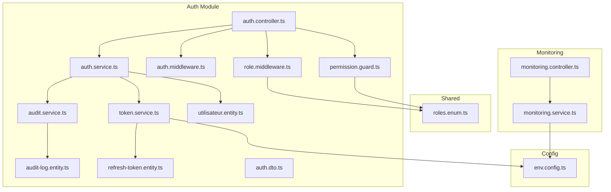
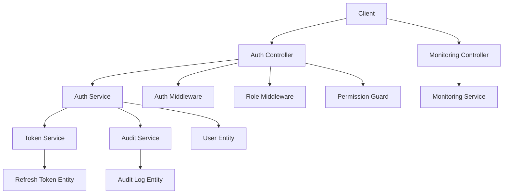
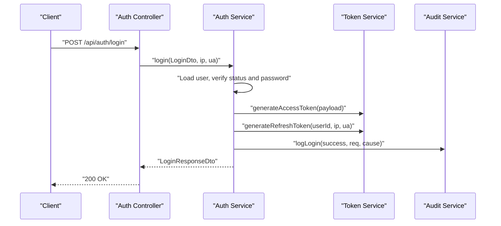
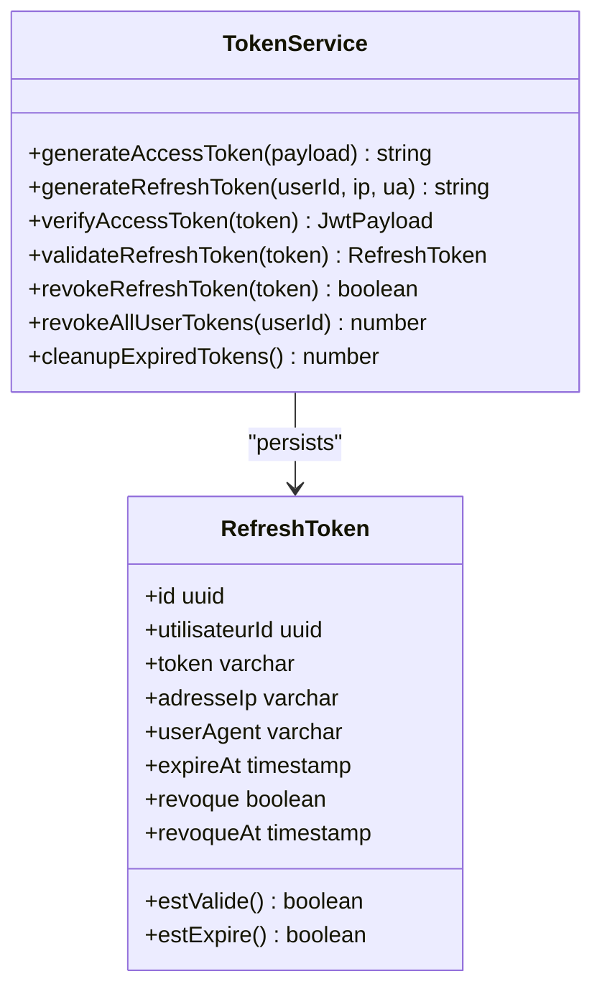
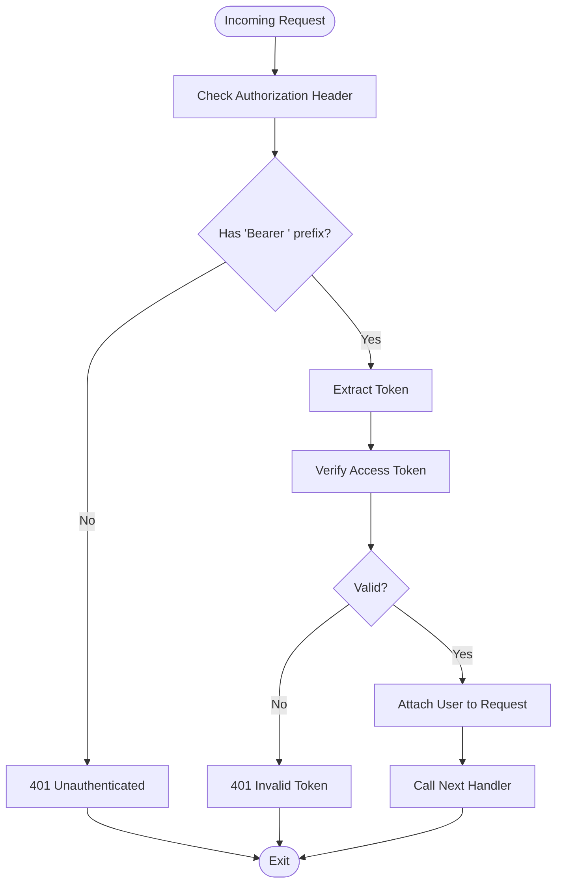
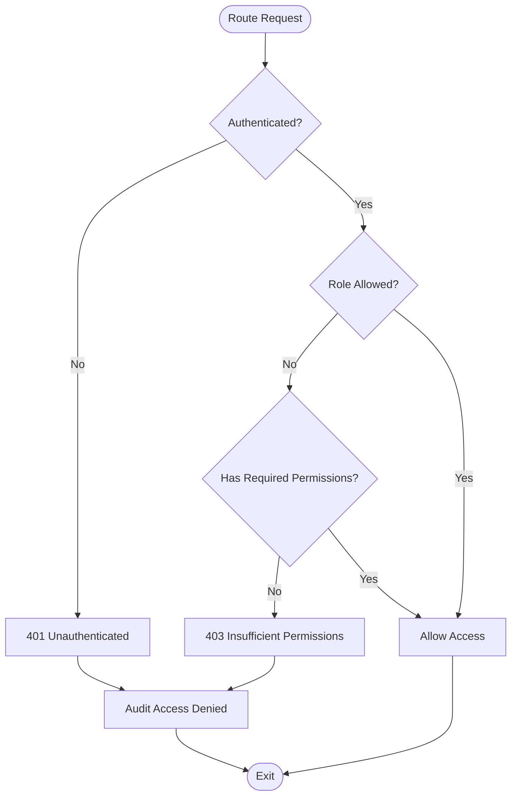
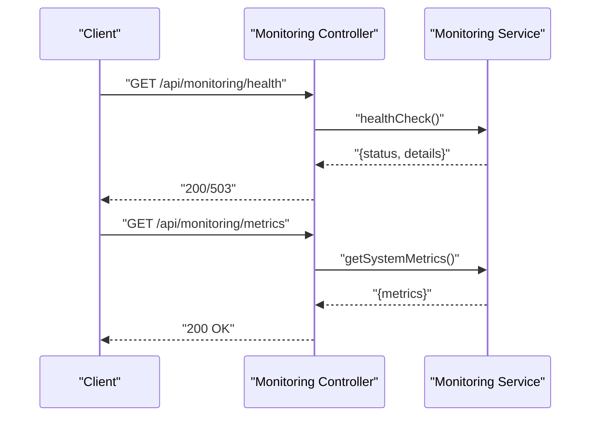
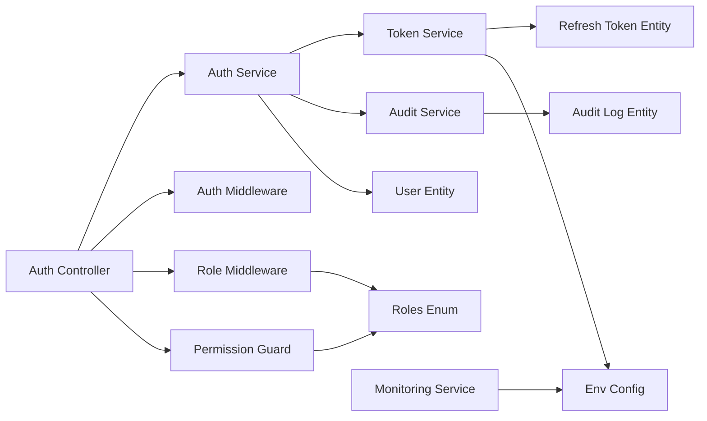

# Security & Governance

<cite>
**Referenced Files in This Document**
- [auth.controller.ts](file://backend/src/modules/auth/controllers/auth.controller.ts)
- [auth.service.ts](file://backend/src/modules/auth/services/auth.service.ts)
- [token.service.ts](file://backend/src/modules/auth/services/token.service.ts)
- [audit.service.ts](file://backend/src/modules/auth/services/audit.service.ts)
- [permission.guard.ts](file://backend/src/modules/auth/guards/permission.guard.ts)
- [role.middleware.ts](file://backend/src/modules/auth/middlewares/role.middleware.ts)
- [auth.middleware.ts](file://backend/src/modules/auth/middlewares/auth.middleware.ts)
- [audit-log.entity.ts](file://backend/src/modules/auth/entities/audit-log.entity.ts)
- [utilisateur.entity.ts](file://backend/src/modules/auth/entities/utilisateur.entity.ts)
- [refresh-token.entity.ts](file://backend/src/modules/auth/entities/refresh-token.entity.ts)
- [roles.enum.ts](file://shared/src/enums/roles.enum.ts)
- [env.config.ts](file://backend/src/config/env.config.ts)
- [monitoring.controller.ts](file://backend/src/modules/monitoring/controllers/monitoring.controller.ts)
- [monitoring.service.ts](file://backend/src/modules/monitoring/services/monitoring.service.ts)
- [auth.dto.ts](file://backend/src/modules/auth/dto/auth.dto.ts)
</cite>

## Table of Contents
1. [Introduction](#introduction)
2. [Project Structure](#project-structure)
3. [Core Components](#core-components)
4. [Architecture Overview](#architecture-overview)
5. [Detailed Component Analysis](#detailed-component-analysis)
6. [Dependency Analysis](#dependency-analysis)
7. [Performance Considerations](#performance-considerations)
8. [Troubleshooting Guide](#troubleshooting-guide)
9. [Conclusion](#conclusion)
10. [Appendices](#appendices)

## Introduction
This document provides comprehensive coverage of the security and governance subsystems, focusing on authentication, authorization, audit trails, and system monitoring. It explains how login and session management work, how tokens are generated and validated, how role-based access control (RBAC) and permission guards enforce access, how audit logs track sensitive actions, and how monitoring exposes system health and operational insights. Practical examples demonstrate secure implementation patterns for authentication flows, RBAC configuration, audit trail setup, and monitoring dashboard creation.

## Project Structure
Security and governance features are primarily implemented under the auth module and shared enums, with monitoring exposed via a dedicated controller and service. Environment configuration centralizes cryptographic keys and JWT parameters.



**Diagram sources**
- [auth.controller.ts:1-268](file://backend/src/modules/auth/controllers/auth.controller.ts#L1-L268)
- [auth.service.ts:1-485](file://backend/src/modules/auth/services/auth.service.ts#L1-L485)
- [token.service.ts:1-181](file://backend/src/modules/auth/services/token.service.ts#L1-L181)
- [audit.service.ts:1-197](file://backend/src/modules/auth/services/audit.service.ts#L1-L197)
- [auth.middleware.ts:1-92](file://backend/src/modules/auth/middlewares/auth.middleware.ts#L1-L92)
- [role.middleware.ts:1-152](file://backend/src/modules/auth/middlewares/role.middleware.ts#L1-L152)
- [permission.guard.ts:1-118](file://backend/src/modules/auth/guards/permission.guard.ts#L1-L118)
- [audit-log.entity.ts:1-139](file://backend/src/modules/auth/entities/audit-log.entity.ts#L1-L139)
- [utilisateur.entity.ts:1-143](file://backend/src/modules/auth/entities/utilisateur.entity.ts#L1-L143)
- [refresh-token.entity.ts:1-72](file://backend/src/modules/auth/entities/refresh-token.entity.ts#L1-L72)
- [roles.enum.ts:1-187](file://shared/src/enums/roles.enum.ts#L1-L187)
- [monitoring.controller.ts:1-69](file://backend/src/modules/monitoring/controllers/monitoring.controller.ts#L1-L69)
- [monitoring.service.ts:1-223](file://backend/src/modules/monitoring/services/monitoring.service.ts#L1-L223)
- [env.config.ts:1-168](file://backend/src/config/env.config.ts#L1-L168)
- [auth.dto.ts:1-173](file://backend/src/modules/auth/dto/auth.dto.ts#L1-L173)

**Section sources**
- [auth.controller.ts:1-268](file://backend/src/modules/auth/controllers/auth.controller.ts#L1-L268)
- [auth.service.ts:1-485](file://backend/src/modules/auth/services/auth.service.ts#L1-L485)
- [token.service.ts:1-181](file://backend/src/modules/auth/services/token.service.ts#L1-L181)
- [audit.service.ts:1-197](file://backend/src/modules/auth/services/audit.service.ts#L1-L197)
- [auth.middleware.ts:1-92](file://backend/src/modules/auth/middlewares/auth.middleware.ts#L1-L92)
- [role.middleware.ts:1-152](file://backend/src/modules/auth/middlewares/role.middleware.ts#L1-L152)
- [permission.guard.ts:1-118](file://backend/src/modules/auth/guards/permission.guard.ts#L1-L118)
- [audit-log.entity.ts:1-139](file://backend/src/modules/auth/entities/audit-log.entity.ts#L1-L139)
- [utilisateur.entity.ts:1-143](file://backend/src/modules/auth/entities/utilisateur.entity.ts#L1-L143)
- [refresh-token.entity.ts:1-72](file://backend/src/modules/auth/entities/refresh-token.entity.ts#L1-L72)
- [roles.enum.ts:1-187](file://shared/src/enums/roles.enum.ts#L1-L187)
- [monitoring.controller.ts:1-69](file://backend/src/modules/monitoring/controllers/monitoring.controller.ts#L1-L69)
- [monitoring.service.ts:1-223](file://backend/src/modules/monitoring/services/monitoring.service.ts#L1-L223)
- [env.config.ts:1-168](file://backend/src/config/env.config.ts#L1-L168)
- [auth.dto.ts:1-173](file://backend/src/modules/auth/dto/auth.dto.ts#L1-L173)

## Core Components
- Authentication controller: Exposes endpoints for login, registration, token refresh, logout, password reset/change, email verification, and profile retrieval. It validates payloads with Zod and delegates to the authentication service.
- Authentication service: Implements login flow with account lockout, password verification, profile retrieval, token generation, and audit logging. Handles registration, password reset/change, and current user retrieval.
- Token service: Manages JWT access tokens and refresh tokens, including generation, validation, revocation, and cleanup of expired tokens.
- Audit service: Centralized logging for security-relevant actions, including login attempts, password changes, access denials, and entity modifications. Captures IP, user agent, and sanitizes sensitive data.
- Authorization guards and middlewares: Role-based and permission-based middleware to protect routes, with super admin bypass and configurable access policies.
- Entities: User, refresh token, and audit log entities define persistence and relationships for authentication, session management, and audit.
- Roles and permissions: Shared enum definitions map roles to default permissions for RBAC enforcement.
- Monitoring: Public health endpoint and protected metrics/stats endpoints expose system health and operational statistics.

**Section sources**
- [auth.controller.ts:55-264](file://backend/src/modules/auth/controllers/auth.controller.ts#L55-L264)
- [auth.service.ts:61-480](file://backend/src/modules/auth/services/auth.service.ts#L61-L480)
- [token.service.ts:32-174](file://backend/src/modules/auth/services/token.service.ts#L32-L174)
- [audit.service.ts:47-192](file://backend/src/modules/auth/services/audit.service.ts#L47-L192)
- [permission.guard.ts:20-87](file://backend/src/modules/auth/guards/permission.guard.ts#L20-L87)
- [role.middleware.ts:20-106](file://backend/src/modules/auth/middlewares/role.middleware.ts#L20-L106)
- [audit-log.entity.ts:87-135](file://backend/src/modules/auth/entities/audit-log.entity.ts#L87-L135)
- [utilisateur.entity.ts:52-140](file://backend/src/modules/auth/entities/utilisateur.entity.ts#L52-L140)
- [refresh-token.entity.ts:24-68](file://backend/src/modules/auth/entities/refresh-token.entity.ts#L24-L68)
- [roles.enum.ts:120-184](file://shared/src/enums/roles.enum.ts#L120-L184)
- [monitoring.controller.ts:16-65](file://backend/src/modules/monitoring/controllers/monitoring.controller.ts#L16-L65)

## Architecture Overview
The security and governance architecture integrates authentication, authorization, auditing, and monitoring into a cohesive system. Controllers orchestrate requests, services encapsulate business logic, and middlewares/guards enforce access policies. Tokens are persisted for refresh flows, and audit logs capture critical events.



**Diagram sources**
- [auth.controller.ts:33-266](file://backend/src/modules/auth/controllers/auth.controller.ts#L33-L266)
- [auth.service.ts:34-43](file://backend/src/modules/auth/services/auth.service.ts#L34-L43)
- [token.service.ts:21-26](file://backend/src/modules/auth/services/token.service.ts#L21-L26)
- [audit.service.ts:37-42](file://backend/src/modules/auth/services/audit.service.ts#L37-L42)
- [auth.middleware.ts:30-60](file://backend/src/modules/auth/middlewares/auth.middleware.ts#L30-L60)
- [role.middleware.ts:20-51](file://backend/src/modules/auth/middlewares/role.middleware.ts#L20-L51)
- [permission.guard.ts:44-87](file://backend/src/modules/auth/guards/permission.guard.ts#L44-L87)
- [utilisateur.entity.ts:52-102](file://backend/src/modules/auth/entities/utilisateur.entity.ts#L52-L102)
- [refresh-token.entity.ts:24-54](file://backend/src/modules/auth/entities/refresh-token.entity.ts#L24-L54)
- [audit-log.entity.ts:87-135](file://backend/src/modules/auth/entities/audit-log.entity.ts#L87-L135)
- [monitoring.controller.ts:12-67](file://backend/src/modules/monitoring/controllers/monitoring.controller.ts#L12-L67)
- [monitoring.service.ts:69-74](file://backend/src/modules/monitoring/services/monitoring.service.ts#L69-L74)

## Detailed Component Analysis

### Authentication System
The authentication system supports login, registration, password reset/change, email verification, and profile retrieval. It enforces security parameters from centralized configuration and logs all login attempts and sensitive actions.



**Diagram sources**
- [auth.controller.ts:55-74](file://backend/src/modules/auth/controllers/auth.controller.ts#L55-L74)
- [auth.service.ts:61-161](file://backend/src/modules/auth/services/auth.service.ts#L61-L161)
- [token.service.ts:32-72](file://backend/src/modules/auth/services/token.service.ts#L32-L72)
- [audit.service.ts:67-77](file://backend/src/modules/auth/services/audit.service.ts#L67-L77)

Key implementation highlights:
- Login flow validates credentials, enforces lockout thresholds, updates user counters, generates access and refresh tokens, and logs outcomes.
- Registration enforces password minimum length, prevents duplicate emails, assigns default roles, and creates user and profile records.
- Password reset/change validates token freshness and length constraints, revokes existing tokens upon reset, and logs changes.
- Email verification updates verification flags and elevates status when appropriate.

Practical examples:
- Secure login flow: Use the login endpoint with validated DTOs and attach IP and User-Agent for auditability.
- Token refresh: Call the refresh endpoint with a valid refresh token to obtain new access and refresh tokens.
- Logout: Call logout to revoke the refresh token; call logout-all to revoke all sessions for the authenticated user.

**Section sources**
- [auth.controller.ts:55-245](file://backend/src/modules/auth/controllers/auth.controller.ts#L55-L245)
- [auth.service.ts:61-447](file://backend/src/modules/auth/services/auth.service.ts#L61-L447)
- [auth.dto.ts:18-107](file://backend/src/modules/auth/dto/auth.dto.ts#L18-L107)
- [env.config.ts:138-142](file://backend/src/config/env.config.ts#L138-L142)

### Token Management
Token management centers around JWT access tokens and persistent refresh tokens. Access tokens are signed with a secret and short expiry; refresh tokens are stored in the database with expiry and revocation tracking.



**Diagram sources**
- [token.service.ts:21-174](file://backend/src/modules/auth/services/token.service.ts#L21-L174)
- [refresh-token.entity.ts:24-68](file://backend/src/modules/auth/entities/refresh-token.entity.ts#L24-L68)

Operational guidance:
- Access tokens are validated server-side using the configured secret and audience/issuer claims.
- Refresh tokens are stored encrypted in the database with expiry and revocation flags; validation ensures non-expired and non-revoked state.
- Periodic cleanup removes expired or revoked refresh tokens to maintain database hygiene.

**Section sources**
- [token.service.ts:32-174](file://backend/src/modules/auth/services/token.service.ts#L32-L174)
- [refresh-token.entity.ts:56-68](file://backend/src/modules/auth/entities/refresh-token.entity.ts#L56-L68)
- [env.config.ts:138-142](file://backend/src/config/env.config.ts#L138-L142)

### Session Handling and Middleware
Authentication middleware extracts and verifies the bearer token, attaching the user identity to the request. Optional authentication middleware allows non-blocking attachment when a token is present.



**Diagram sources**
- [auth.middleware.ts:30-60](file://backend/src/modules/auth/middlewares/auth.middleware.ts#L30-L60)

Additional role and permission middleware:
- Role middleware restricts access by role sets and logs denied attempts.
- Permission guard evaluates granular permissions per role and supports OR/AND semantics, with super admin bypass.

**Section sources**
- [auth.middleware.ts:30-92](file://backend/src/modules/auth/middlewares/auth.middleware.ts#L30-L92)
- [role.middleware.ts:20-107](file://backend/src/modules/auth/middlewares/role.middleware.ts#L20-L107)
- [permission.guard.ts:44-87](file://backend/src/modules/auth/guards/permission.guard.ts#L44-L87)
- [roles.enum.ts:120-184](file://shared/src/enums/roles.enum.ts#L120-L184)

### Authorization: RBAC and Permission Guards
Role-based access control is defined centrally with default permissions mapped per role. Guards and middlewares enforce access policies consistently across controllers.



**Diagram sources**
- [role.middleware.ts:62-106](file://backend/src/modules/auth/middlewares/role.middleware.ts#L62-L106)
- [permission.guard.ts:48-87](file://backend/src/modules/auth/guards/permission.guard.ts#L48-L87)
- [roles.enum.ts:120-184](file://shared/src/enums/roles.enum.ts#L120-L184)

Best practices:
- Prefer permission guards for fine-grained controls; use role middleware for coarse-grained restrictions.
- Super admin bypass simplifies administrative tasks but should be used sparingly and logged.

**Section sources**
- [role.middleware.ts:20-152](file://backend/src/modules/auth/middlewares/role.middleware.ts#L20-L152)
- [permission.guard.ts:20-118](file://backend/src/modules/auth/guards/permission.guard.ts#L20-L118)
- [roles.enum.ts:120-184](file://shared/src/enums/roles.enum.ts#L120-L184)

### Audit Trails
Audit logging captures security-relevant events with contextual metadata, including IP, user agent, and sanitized values. Dedicated shortcuts streamline common audit actions.

```mermaid
classDiagram
class AuditService {
+log(options, req?) AuditLog
+logLogin(utilisateurId, success, req?, error?)
+logPasswordChange(utilisateurId, req?)
+logEntityChange(action, utilisateurId, cible, cibleId, old?, new?, req?)
+logAccessDenied(utilisateurId, resource, req?)
+getLogs(filters) { items, total }
}
class AuditLog {
+id uuid
+utilisateurId uuid
+action enum
+severity enum
+cible varchar
+cibleId uuid
+description text
+anciennesValeurs json
+nouvellesValeurs json
+ipAddress varchar
+userAgent text
+module varchar
+estEchec boolean
+erreur text
+createdAt timestamp
}
AuditService --> AuditLog : "persists"
```

**Diagram sources**
- [audit.service.ts:37-192](file://backend/src/modules/auth/services/audit.service.ts#L37-L192)
- [audit-log.entity.ts:87-135](file://backend/src/modules/auth/entities/audit-log.entity.ts#L87-L135)

Operational guidance:
- Use shortcut methods for login, password changes, and access denials to ensure consistent logging.
- Sanitize sensitive fields automatically to protect privacy and compliance.
- Query audit logs with filters for investigation and reporting.

**Section sources**
- [audit.service.ts:47-192](file://backend/src/modules/auth/services/audit.service.ts#L47-L192)
- [audit-log.entity.ts:25-135](file://backend/src/modules/auth/entities/audit-log.entity.ts#L25-L135)

### Monitoring and System Insights
Monitoring exposes health checks, system metrics, application statistics, maintenance mode, and recent logs. Access is restricted to authorized administrators.



**Diagram sources**
- [monitoring.controller.ts:16-32](file://backend/src/modules/monitoring/controllers/monitoring.controller.ts#L16-L32)
- [monitoring.service.ts:169-199](file://backend/src/modules/monitoring/services/monitoring.service.ts#L169-L199)

Implementation highlights:
- Health check aggregates database connectivity, memory thresholds, and uptime.
- Metrics include CPU, memory, database connection status, and application metadata.
- Stats endpoints compute counts for users and pending requests where applicable.

**Section sources**
- [monitoring.controller.ts:16-65](file://backend/src/modules/monitoring/controllers/monitoring.controller.ts#L16-L65)
- [monitoring.service.ts:79-220](file://backend/src/modules/monitoring/services/monitoring.service.ts#L79-L220)

## Dependency Analysis
The following diagram outlines key dependencies among security and governance components:



**Diagram sources**
- [auth.controller.ts:34-34](file://backend/src/modules/auth/controllers/auth.controller.ts#L34-L34)
- [auth.service.ts:35-42](file://backend/src/modules/auth/services/auth.service.ts#L35-L42)
- [token.service.ts:24-25](file://backend/src/modules/auth/services/token.service.ts#L24-L25)
- [audit.service.ts:41-41](file://backend/src/modules/auth/services/audit.service.ts#L41-L41)
- [auth.middleware.ts:24-24](file://backend/src/modules/auth/middlewares/auth.middleware.ts#L24-L24)
- [role.middleware.ts:20-20](file://backend/src/modules/auth/middlewares/role.middleware.ts#L20-L20)
- [permission.guard.ts:44-44](file://backend/src/modules/auth/guards/permission.guard.ts#L44-L44)
- [utilisateur.entity.ts:52-52](file://backend/src/modules/auth/entities/utilisateur.entity.ts#L52-L52)
- [refresh-token.entity.ts:24-24](file://backend/src/modules/auth/entities/refresh-token.entity.ts#L24-L24)
- [audit-log.entity.ts:87-87](file://backend/src/modules/auth/entities/audit-log.entity.ts#L87-L87)
- [roles.enum.ts:120-120](file://shared/src/enums/roles.enum.ts#L120-L120)
- [monitoring.service.ts:69-74](file://backend/src/modules/monitoring/services/monitoring.service.ts#L69-L74)
- [env.config.ts:120-165](file://backend/src/config/env.config.ts#L120-L165)

**Section sources**
- [auth.controller.ts:34-34](file://backend/src/modules/auth/controllers/auth.controller.ts#L34-L34)
- [auth.service.ts:35-42](file://backend/src/modules/auth/services/auth.service.ts#L35-L42)
- [token.service.ts:24-25](file://backend/src/modules/auth/services/token.service.ts#L24-L25)
- [audit.service.ts:41-41](file://backend/src/modules/auth/services/audit.service.ts#L41-L41)
- [auth.middleware.ts:24-24](file://backend/src/modules/auth/middlewares/auth.middleware.ts#L24-L24)
- [role.middleware.ts:20-20](file://backend/src/modules/auth/middlewares/role.middleware.ts#L20-L20)
- [permission.guard.ts:44-44](file://backend/src/modules/auth/guards/permission.guard.ts#L44-L44)
- [utilisateur.entity.ts:52-52](file://backend/src/modules/auth/entities/utilisateur.entity.ts#L52-L52)
- [refresh-token.entity.ts:24-24](file://backend/src/modules/auth/entities/refresh-token.entity.ts#L24-L24)
- [audit-log.entity.ts:87-87](file://backend/src/modules/auth/entities/audit-log.entity.ts#L87-L87)
- [roles.enum.ts:120-120](file://shared/src/enums/roles.enum.ts#L120-L120)
- [monitoring.service.ts:69-74](file://backend/src/modules/monitoring/services/monitoring.service.ts#L69-L74)
- [env.config.ts:120-165](file://backend/src/config/env.config.ts#L120-L165)

## Performance Considerations
- Token storage: Refresh tokens are persisted; ensure indexes on user and token fields to optimize validation and revocation queries.
- Audit volume: High-frequency audit events can increase write load; consider batching or asynchronous logging for non-critical entries.
- Password hashing: Bcrypt cost is fixed at insertion/update; monitor CPU usage during bulk operations.
- Monitoring queries: Metrics aggregation is lightweight; avoid excessive polling and cache results where appropriate.
- Environment secrets: Ensure JWT and encryption keys meet minimum length requirements and rotate periodically.

[No sources needed since this section provides general guidance]

## Troubleshooting Guide
Common issues and resolutions:
- Invalid or missing token: Ensure clients send Authorization: Bearer <token> and that the token is not expired or revoked.
- Account locked out: After exceeding maximum login attempts, accounts are temporarily blocked; verify lockout duration configuration.
- Insufficient permissions: Review role-to-permission mapping and middleware configuration; super admin bypass applies only to specific routes.
- Audit gaps: Confirm audit service is invoked for sensitive actions and that IP/user agent extraction is enabled.
- Monitoring down: Health checks depend on database connectivity; verify database configuration and connectivity.

**Section sources**
- [auth.middleware.ts:35-46](file://backend/src/modules/auth/middlewares/auth.middleware.ts#L35-L46)
- [auth.service.ts:79-113](file://backend/src/modules/auth/services/auth.service.ts#L79-L113)
- [permission.guard.ts:68-81](file://backend/src/modules/auth/guards/permission.guard.ts#L68-L81)
- [audit.service.ts:67-77](file://backend/src/modules/auth/services/audit.service.ts#L67-L77)
- [monitoring.service.ts:169-199](file://backend/src/modules/monitoring/services/monitoring.service.ts#L169-L199)

## Conclusion
The security and governance subsystems provide a robust foundation for authentication, authorization, auditing, and monitoring. By leveraging JWT-based access tokens, persistent refresh tokens, centralized RBAC, comprehensive audit logging, and operational monitoring, the system achieves strong security posture and operational visibility. Adhering to the recommended patterns and configurations ensures secure and maintainable deployments.

[No sources needed since this section summarizes without analyzing specific files]

## Appendices

### Practical Examples

- Secure authentication flows
  - Use the login endpoint with validated DTOs and capture IP/User-Agent for auditability.
  - Implement token refresh using the refresh endpoint and revoke tokens on logout.
  - Enforce password policies via registration and reset/change endpoints.

- Configuring role-based permissions
  - Define roles and default permissions in shared enums.
  - Apply role middleware or permission guards to protect routes.
  - Use super admin bypass judiciously and log all denials.

- Setting up audit trails
  - Invoke audit shortcuts for login, password changes, and access denials.
  - Filter and export audit logs for compliance and incident response.

- Establishing monitoring dashboards
  - Expose health, metrics, and stats via monitoring endpoints.
  - Restrict access to administrative endpoints using role middleware.
  - Integrate with external monitoring systems using the provided endpoints.

[No sources needed since this section provides general guidance]