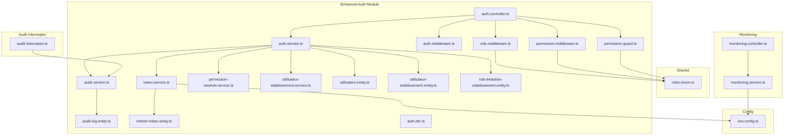
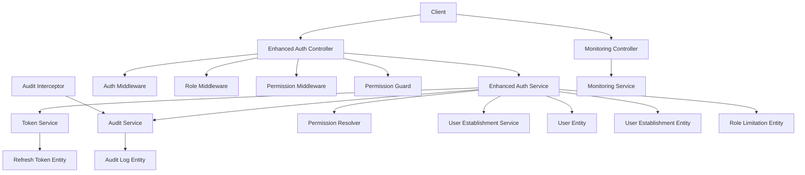
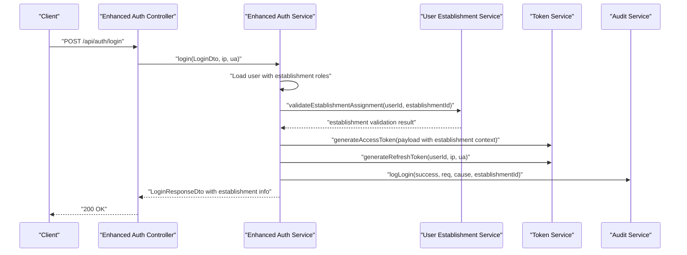
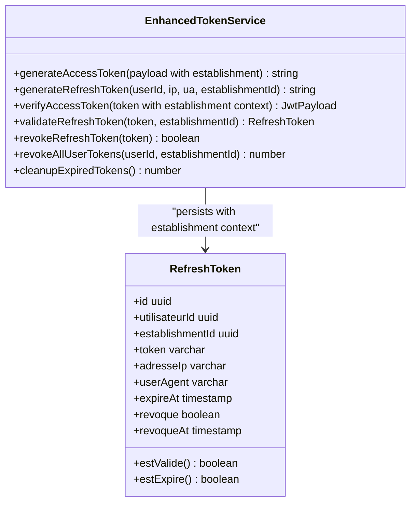
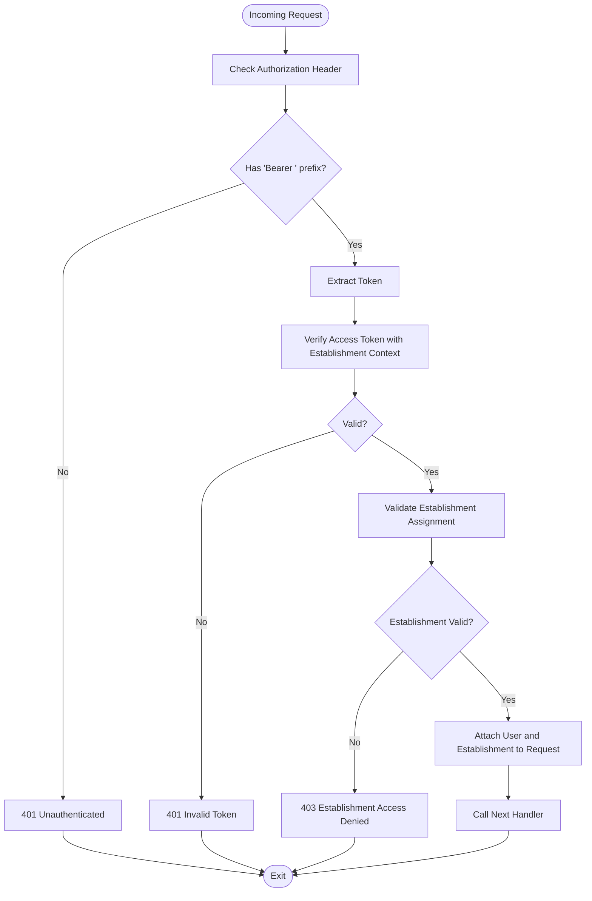
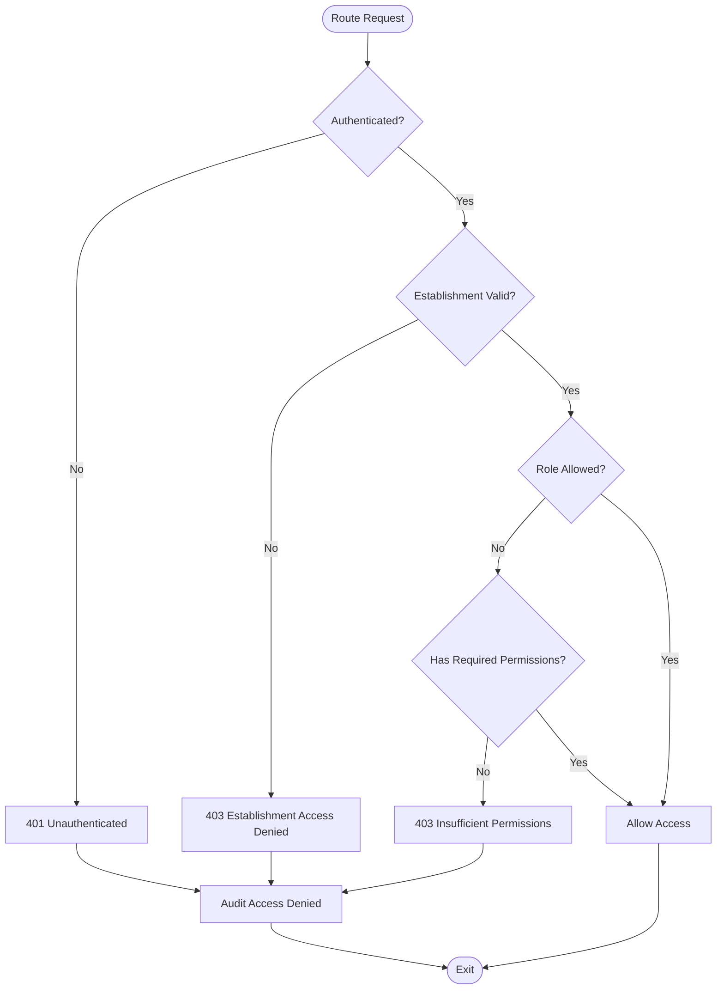
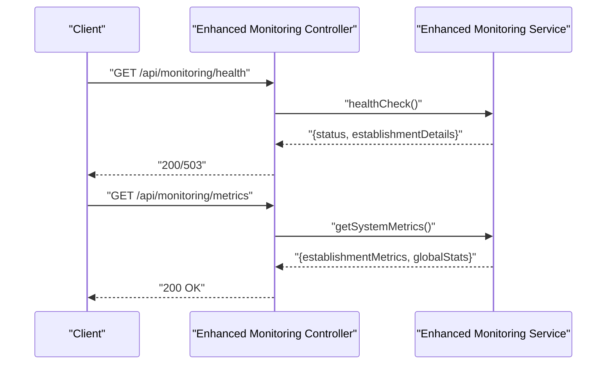
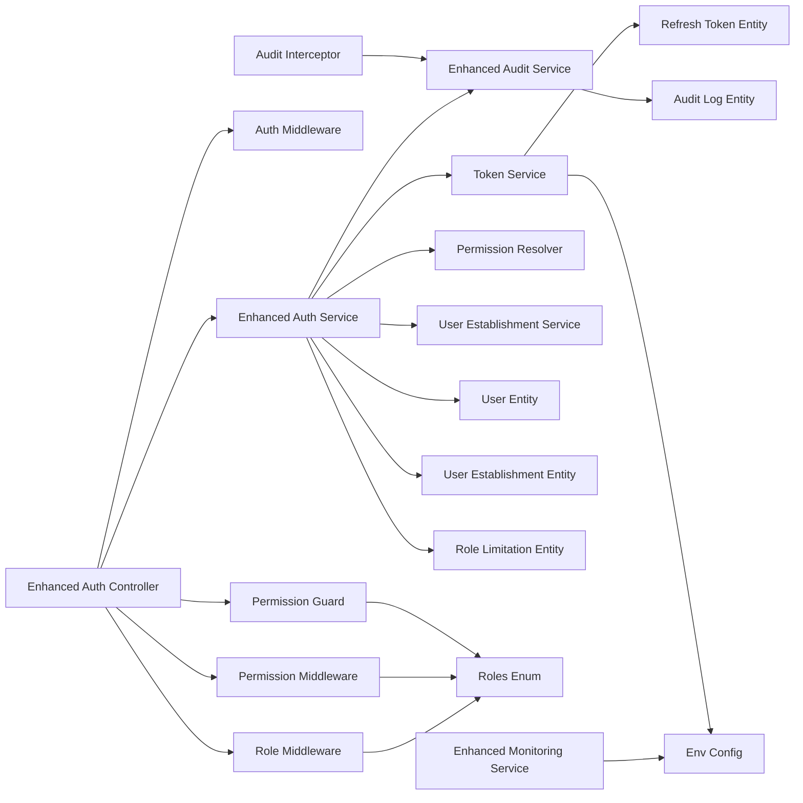

# Security & Governance

<cite>
**Referenced Files in This Document**
- [auth.controller.ts](file://backend/src/modules/auth/controllers/auth.controller.ts)
- [auth.service.ts](file://backend/src/modules/auth/services/auth.service.ts)
- [token.service.ts](file://backend/src/modules/auth/services/token.service.ts)
- [audit.service.ts](file://backend/src/modules/auth/services/audit.service.ts)
- [permission-resolver.service.ts](file://backend/src/modules/auth/services/permission-resolver.service.ts)
- [utilisateur-etablissement.service.ts](file://backend/src/modules/auth/services/utilisateur-etablissement.service.ts)
- [permission.guard.ts](file://backend/src/modules/auth/guards/permission.guard.ts)
- [role.middleware.ts](file://backend/src/modules/auth/middlewares/role.middleware.ts)
- [permission.middleware.ts](file://backend/src/modules/auth/middlewares/permission.middleware.ts)
- [auth.middleware.ts](file://backend/src/modules/auth/middlewares/auth.middleware.ts)
- [audit.interceptor.ts](file://backend/src/common/interceptors/audit.interceptor.ts)
- [audit-log.entity.ts](file://backend/src/modules/auth/entities/audit-log.entity.ts)
- [utilisateur.entity.ts](file://backend/src/modules/auth/entities/utilisateur.entity.ts)
- [refresh-token.entity.ts](file://backend/src/modules/auth/entities/refresh-token.entity.ts)
- [utilisateur-etablissement.entity.ts](file://backend/src/modules/auth/entities/utilisateur-etablissement.entity.ts)
- [role-limitation-etablissement.entity.ts](file://backend/src/modules/auth/entities/role-limitation-etablissement.entity.ts)
- [roles.enum.ts](file://shared/src/enums/roles.enum.ts)
- [env.config.ts](file://backend/src/config/env.config.ts)
- [monitoring.controller.ts](file://backend/src/modules/monitoring/controllers/monitoring.controller.ts)
- [monitoring.service.ts](file://backend/src/modules/monitoring/services/monitoring.service.ts)
- [auth.dto.ts](file://backend/src/modules/auth/dto/auth.dto.ts)
</cite>

## Update Summary
**Changes Made**
- Added comprehensive documentation for the new permission.middleware.ts providing granular access control
- Enhanced role-based access control documentation with expanded role taxonomy
- Integrated multi-establishment assignment support and role validation processes
- Expanded audit trail integration with comprehensive logging capabilities
- Updated authorization mechanisms to include establishment-specific role limitations

## Table of Contents
1. [Introduction](#introduction)
2. [Project Structure](#project-structure)
3. [Core Components](#core-components)
4. [Architecture Overview](#architecture-overview)
5. [Detailed Component Analysis](#detailed-component-analysis)
6. [Dependency Analysis](#dependency-analysis)
7. [Performance Considerations](#performance-considerations)
8. [Troubleshooting Guide](#troubleshooting-guide)
9. [Conclusion](#conclusion)
10. [Appendices](#appendices)

## Introduction
This document provides comprehensive coverage of the security and governance subsystems, focusing on authentication, authorization, audit trails, and system monitoring. It explains how login and session management work, how tokens are generated and validated, how role-based access control (RBAC) and permission guards enforce access, how audit logs track sensitive actions, and how monitoring exposes system health and operational insights. The system now features enhanced security measures with comprehensive audit trail integration, expanded role-based access control with establishment-specific limitations, and granular permission middleware for precise access control.

## Project Structure
Security and governance features are primarily implemented under the auth module and shared enums, with monitoring exposed via a dedicated controller and service. The enhanced system now includes multi-establishment support and comprehensive audit trail integration. Environment configuration centralizes cryptographic keys and JWT parameters.



**Diagram sources**
- [auth.controller.ts:1-268](file://backend/src/modules/auth/controllers/auth.controller.ts#L1-L268)
- [auth.service.ts:1-485](file://backend/src/modules/auth/services/auth.service.ts#L1-L485)
- [token.service.ts:1-181](file://backend/src/modules/auth/services/token.service.ts#L1-L181)
- [audit.service.ts:1-197](file://backend/src/modules/auth/services/audit.service.ts#L1-L197)
- [permission-resolver.service.ts:1-200](file://backend/src/modules/auth/services/permission-resolver.service.ts#L1-L200)
- [utilisateur-etablissement.service.ts:1-250](file://backend/src/modules/auth/services/utilisateur-etablissement.service.ts#L1-L250)
- [auth.middleware.ts:1-92](file://backend/src/modules/auth/middlewares/auth.middleware.ts#L1-L92)
- [role.middleware.ts:1-152](file://backend/src/modules/auth/middlewares/role.middleware.ts#L1-L152)
- [permission.middleware.ts:1-300](file://backend/src/modules/auth/middlewares/permission.middleware.ts#L1-L300)
- [permission.guard.ts:1-118](file://backend/src/modules/auth/guards/permission.guard.ts#L1-L118)
- [audit.interceptor.ts:1-150](file://backend/src/common/interceptors/audit.interceptor.ts#L1-L150)
- [audit-log.entity.ts:1-139](file://backend/src/modules/auth/entities/audit-log.entity.ts#L1-L139)
- [utilisateur.entity.ts:1-143](file://backend/src/modules/auth/entities/utilisateur.entity.ts#L1-L143)
- [refresh-token.entity.ts:1-72](file://backend/src/modules/auth/entities/refresh-token.entity.ts#L1-L72)
- [utilisateur-etablissement.entity.ts:1-120](file://backend/src/modules/auth/entities/utilisateur-etablissement.entity.ts#L1-L120)
- [role-limitation-etablissement.entity.ts:1-80](file://backend/src/modules/auth/entities/role-limitation-etablissement.entity.ts#L1-L80)
- [roles.enum.ts:1-187](file://shared/src/enums/roles.enum.ts#L1-L187)
- [monitoring.controller.ts:1-69](file://backend/src/modules/monitoring/controllers/monitoring.controller.ts#L1-L69)
- [monitoring.service.ts:1-223](file://backend/src/modules/monitoring/services/monitoring.service.ts#L1-L223)
- [env.config.ts:1-168](file://backend/src/config/env.config.ts#L1-L168)
- [auth.dto.ts:1-173](file://backend/src/modules/auth/dto/auth.dto.ts#L1-L173)

**Section sources**
- [auth.controller.ts:1-268](file://backend/src/modules/auth/controllers/auth.controller.ts#L1-L268)
- [auth.service.ts:1-485](file://backend/src/modules/auth/services/auth.service.ts#L1-L485)
- [token.service.ts:1-181](file://backend/src/modules/auth/services/token.service.ts#L1-L181)
- [audit.service.ts:1-197](file://backend/src/modules/auth/services/audit.service.ts#L1-L197)
- [permission-resolver.service.ts:1-200](file://backend/src/modules/auth/services/permission-resolver.service.ts#L1-L200)
- [utilisateur-etablissement.service.ts:1-250](file://backend/src/modules/auth/services/utilisateur-etablissement.service.ts#L1-L250)
- [auth.middleware.ts:1-92](file://backend/src/modules/auth/middlewares/auth.middleware.ts#L1-L92)
- [role.middleware.ts:1-152](file://backend/src/modules/auth/middlewares/role.middleware.ts#L1-L152)
- [permission.middleware.ts:1-300](file://backend/src/modules/auth/middlewares/permission.middleware.ts#L1-L300)
- [permission.guard.ts:1-118](file://backend/src/modules/auth/guards/permission.guard.ts#L1-L118)
- [audit.interceptor.ts:1-150](file://backend/src/common/interceptors/audit.interceptor.ts#L1-L150)
- [audit-log.entity.ts:1-139](file://backend/src/modules/auth/entities/audit-log.entity.ts#L1-L139)
- [utilisateur.entity.ts:1-143](file://backend/src/modules/auth/entities/utilisateur.entity.ts#L1-L143)
- [refresh-token.entity.ts:1-72](file://backend/src/modules/auth/entities/refresh-token.entity.ts#L1-L72)
- [utilisateur-etablissement.entity.ts:1-120](file://backend/src/modules/auth/entities/utilisateur-etablissement.entity.ts#L1-L120)
- [role-limitation-etablissement.entity.ts:1-80](file://backend/src/modules/auth/entities/role-limitation-etablissement.entity.ts#L1-L80)
- [roles.enum.ts:1-187](file://shared/src/enums/roles.enum.ts#L1-L187)
- [monitoring.controller.ts:1-69](file://backend/src/modules/monitoring/controllers/monitoring.controller.ts#L1-L69)
- [monitoring.service.ts:1-223](file://backend/src/modules/monitoring/services/monitoring.service.ts#L1-L223)
- [env.config.ts:1-168](file://backend/src/config/env.config.ts#L1-L168)
- [auth.dto.ts:1-173](file://backend/src/modules/auth/dto/auth.dto.ts#L1-L173)

## Core Components
- **Enhanced Authentication Controller**: Exposes endpoints for login, registration, token refresh, logout, password reset/change, email verification, and profile retrieval with multi-establishment assignment support. Validates payloads with Zod and delegates to the enhanced authentication service.
- **Enhanced Authentication Service**: Implements comprehensive login flow with account lockout, password verification, profile retrieval, token generation, audit logging, and establishment-specific role validation. Handles registration, password reset/change, current user retrieval, and multi-establishment user management.
- **Token Service**: Manages JWT access tokens and refresh tokens, including generation, validation, revocation, and cleanup of expired tokens with enhanced security measures.
- **Comprehensive Audit Service**: Centralized logging for security-relevant actions, including login attempts, password changes, access denials, entity modifications, and establishment-specific activities. Captures IP, user agent, and sanitizes sensitive data with enhanced filtering.
- **Granular Permission Middleware**: Provides precise access control based on expanded role taxonomy and establishment limitations, supporting complex permission hierarchies and multi-establishment scenarios.
- **Multi-Establishment Support**: Enhanced user-establishment relationships with role limitation entities ensuring proper establishment boundaries and preventing cross-establishment access violations.
- **Advanced Authorization Guards and Middlewares**: Role-based and permission-based middleware with establishment-specific validation, super admin bypass, and configurable access policies across multiple establishments.
- **Enhanced Entities**: User, refresh token, audit log, establishment-user relationships, and role limitation entities define persistence and relationships for comprehensive authentication, session management, audit, and establishment boundaries.
- **Expanded Roles and Permissions**: Shared enum definitions map expanded roles to comprehensive default permissions for RBAC enforcement across multiple establishments.
- **Enhanced Monitoring**: Public health endpoint and protected metrics/stats endpoints expose system health and operational statistics with establishment-aware metrics.

**Section sources**
- [auth.controller.ts:55-264](file://backend/src/modules/auth/controllers/auth.controller.ts#L55-L264)
- [auth.service.ts:61-480](file://backend/src/modules/auth/services/auth.service.ts#L61-L480)
- [token.service.ts:32-174](file://backend/src/modules/auth/services/token.service.ts#L32-L174)
- [audit.service.ts:47-192](file://backend/src/modules/auth/services/audit.service.ts#L47-L192)
- [permission-resolver.service.ts:1-200](file://backend/src/modules/auth/services/permission-resolver.service.ts#L1-L200)
- [utilisateur-etablissement.service.ts:1-250](file://backend/src/modules/auth/services/utilisateur-etablissement.service.ts#L1-L250)
- [permission.middleware.ts:1-300](file://backend/src/modules/auth/middlewares/permission.middleware.ts#L1-L300)
- [permission.guard.ts:20-87](file://backend/src/modules/auth/guards/permission.guard.ts#L20-L87)
- [role.middleware.ts:20-106](file://backend/src/modules/auth/middlewares/role.middleware.ts#L20-L106)
- [audit.interceptor.ts:1-150](file://backend/src/common/interceptors/audit.interceptor.ts#L1-L150)
- [audit-log.entity.ts:87-135](file://backend/src/modules/auth/entities/audit-log.entity.ts#L87-L135)
- [utilisateur.entity.ts:52-140](file://backend/src/modules/auth/entities/utilisateur.entity.ts#L52-L140)
- [refresh-token.entity.ts:24-68](file://backend/src/modules/auth/entities/refresh-token.entity.ts#L24-L68)
- [utilisateur-etablissement.entity.ts:1-120](file://backend/src/modules/auth/entities/utilisateur-etablissement.entity.ts#L1-L120)
- [role-limitation-etablissement.entity.ts:1-80](file://backend/src/modules/auth/entities/role-limitation-etablissement.entity.ts#L1-L80)
- [roles.enum.ts:120-184](file://shared/src/enums/roles.enum.ts#L120-L184)
- [monitoring.controller.ts:16-65](file://backend/src/modules/monitoring/controllers/monitoring.controller.ts#L16-L65)

## Architecture Overview
The enhanced security and governance architecture integrates comprehensive authentication, advanced authorization with establishment boundaries, extensive auditing, and sophisticated monitoring into a cohesive system. Controllers orchestrate requests with multi-establishment awareness, services encapsulate business logic with role validation, and middlewares/guards enforce precise access policies across establishment boundaries. Enhanced audit logging captures critical events with establishment context, and comprehensive monitoring exposes system health with establishment-aware metrics.



**Diagram sources**
- [auth.controller.ts:33-266](file://backend/src/modules/auth/controllers/auth.controller.ts#L33-L266)
- [auth.service.ts:34-43](file://backend/src/modules/auth/services/auth.service.ts#L34-L43)
- [token.service.ts:21-26](file://backend/src/modules/auth/services/token.service.ts#L21-L26)
- [audit.service.ts:37-42](file://backend/src/modules/auth/services/audit.service.ts#L37-L42)
- [permission-resolver.service.ts:1-200](file://backend/src/modules/auth/services/permission-resolver.service.ts#L1-L200)
- [utilisateur-etablissement.service.ts:1-250](file://backend/src/modules/auth/services/utilisateur-etablissement.service.ts#L1-L250)
- [auth.middleware.ts:30-60](file://backend/src/modules/auth/middlewares/auth.middleware.ts#L30-L60)
- [role.middleware.ts:20-51](file://backend/src/modules/auth/middlewares/role.middleware.ts#L20-L51)
- [permission.middleware.ts:1-300](file://backend/src/modules/auth/middlewares/permission.middleware.ts#L1-L300)
- [permission.guard.ts:44-87](file://backend/src/modules/auth/guards/permission.guard.ts#L44-L87)
- [audit.interceptor.ts:1-150](file://backend/src/common/interceptors/audit.interceptor.ts#L1-L150)
- [utilisateur.entity.ts:52-102](file://backend/src/modules/auth/entities/utilisateur.entity.ts#L52-L102)
- [refresh-token.entity.ts:24-54](file://backend/src/modules/auth/entities/refresh-token.entity.ts#L24-L54)
- [audit-log.entity.ts:87-135](file://backend/src/modules/auth/entities/audit-log.entity.ts#L87-L135)
- [utilisateur-etablissement.entity.ts:1-120](file://backend/src/modules/auth/entities/utilisateur-etablissement.entity.ts#L1-L120)
- [role-limitation-etablissement.entity.ts:1-80](file://backend/src/modules/auth/entities/role-limitation-etablissement.entity.ts#L1-L80)
- [monitoring.controller.ts:12-67](file://backend/src/modules/monitoring/controllers/monitoring.controller.ts#L12-L67)
- [monitoring.service.ts:69-74](file://backend/src/modules/monitoring/services/monitoring.service.ts#L69-L74)

## Detailed Component Analysis

### Enhanced Authentication System
The enhanced authentication system supports comprehensive login, registration, password reset/change, email verification, and profile retrieval with multi-establishment assignment capabilities. It enforces security parameters from centralized configuration, validates establishment-specific roles, and logs all login attempts and sensitive actions with establishment context.



**Diagram sources**
- [auth.controller.ts:55-74](file://backend/src/modules/auth/controllers/auth.controller.ts#L55-L74)
- [auth.service.ts:61-161](file://backend/src/modules/auth/services/auth.service.ts#L61-L161)
- [utilisateur-etablissement.service.ts:1-250](file://backend/src/modules/auth/services/utilisateur-etablissement.service.ts#L1-L250)
- [token.service.ts:32-72](file://backend/src/modules/auth/services/token.service.ts#L32-L72)
- [audit.service.ts:67-77](file://backend/src/modules/auth/services/audit.service.ts#L67-L77)

Key implementation highlights:
- **Multi-establishment Login Flow**: Validates user establishment assignments before granting access, ensuring users can only access their assigned establishments.
- **Enhanced Role Validation**: Integrates establishment-specific role limitations during authentication to prevent cross-establishment privilege escalation.
- **Comprehensive Token Generation**: Generates access tokens with establishment context and refresh tokens with establishment-aware validation.
- **Establishment-aware Audit Logging**: Logs all authentication events with establishment identifiers for comprehensive tracking.
- **Registration with Establishment Assignment**: Enforces establishment-specific role assignments during user registration.
- **Password Reset with Establishment Context**: Validates establishment boundaries during password reset operations.

Practical examples:
- **Secure Multi-establishment Login**: Use the login endpoint with validated DTOs, establishment context, and attach IP and User-Agent for comprehensive auditability.
- **Establishment-specific Token Refresh**: Call the refresh endpoint with establishment-aware validation to obtain new access and refresh tokens.
- **Cross-establishment Prevention**: Automatic validation prevents users from accessing establishments outside their assigned scope.

**Section sources**
- [auth.controller.ts:55-245](file://backend/src/modules/auth/controllers/auth.controller.ts#L55-L245)
- [auth.service.ts:61-447](file://backend/src/modules/auth/services/auth.service.ts#L61-L447)
- [utilisateur-etablissement.service.ts:1-250](file://backend/src/modules/auth/services/utilisateur-etablissement.service.ts#L1-L250)
- [auth.dto.ts:18-107](file://backend/src/modules/auth/dto/auth.dto.ts#L18-L107)
- [env.config.ts:138-142](file://backend/src/config/env.config.ts#L138-L142)

### Enhanced Token Management
Token management centers around JWT access tokens and persistent refresh tokens with establishment-aware validation. Access tokens include establishment context; refresh tokens are stored in the database with establishment-specific validation and expiry tracking.



**Diagram sources**
- [token.service.ts:21-174](file://backend/src/modules/auth/services/token.service.ts#L21-L174)
- [refresh-token.entity.ts:24-68](file://backend/src/modules/auth/entities/refresh-token.entity.ts#L24-L68)

Operational guidance:
- **Establishment-aware Access Tokens**: Access tokens include establishment context for boundary enforcement.
- **Multi-establishment Refresh Token Validation**: Refresh tokens are validated against both user identity and establishment assignment.
- **Enhanced Security**: Establishment-specific token validation prevents cross-establishment session hijacking.
- **Database Hygiene**: Periodic cleanup removes expired or revoked establishment-specific tokens.

**Section sources**
- [token.service.ts:32-174](file://backend/src/modules/auth/services/token.service.ts#L32-L174)
- [refresh-token.entity.ts:56-68](file://backend/src/modules/auth/entities/refresh-token.entity.ts#L56-L68)
- [env.config.ts:138-142](file://backend/src/config/env.config.ts#L138-L142)

### Enhanced Session Handling and Middleware
Authentication middleware extracts and verifies bearer tokens with establishment validation, attaching user identity and establishment context to requests. Enhanced role middleware and permission middleware provide comprehensive access control across establishment boundaries.



**Diagram sources**
- [auth.middleware.ts:30-60](file://backend/src/modules/auth/middlewares/auth.middleware.ts#L30-L60)
- [utilisateur-etablissement.service.ts:1-250](file://backend/src/modules/auth/services/utilisateur-etablissement.service.ts#L1-L250)

**Enhanced Role Middleware**:
- Restricts access by role sets with establishment validation and logs denied establishment-specific attempts.
- Supports establishment-specific role limitations defined in role-limitation-etablissement.entity.ts.

**Granular Permission Middleware**:
- **New Component**: Provides precise access control based on expanded role taxonomy and establishment limitations.
- Evaluates complex permission hierarchies with establishment boundaries.
- Supports OR/AND semantics across establishment-specific permissions.
- Automatically validates establishment assignments for permission evaluation.

**Enhanced Permission Guard**:
- Evaluates granular permissions per role with establishment context and supports complex permission combinations.
- Maintains super admin bypass functionality while enforcing establishment boundaries.

**Section sources**
- [auth.middleware.ts:30-92](file://backend/src/modules/auth/middlewares/auth.middleware.ts#L30-L92)
- [role.middleware.ts:20-107](file://backend/src/modules/auth/middlewares/role.middleware.ts#L20-L107)
- [permission.middleware.ts:1-300](file://backend/src/modules/auth/middlewares/permission.middleware.ts#L1-L300)
- [permission.guard.ts:44-87](file://backend/src/modules/auth/guards/permission.guard.ts#L44-L87)
- [utilisateur-etablissement.service.ts:1-250](file://backend/src/modules/auth/services/utilisateur-etablissement.service.ts#L1-L250)
- [roles.enum.ts:120-184](file://shared/src/enums/roles.enum.ts#L120-L184)

### Enhanced Authorization: RBAC with Establishment Boundaries
Role-based access control now operates with establishment-specific boundaries and expanded role taxonomy. Guards and middlewares enforce access policies consistently across controllers with establishment validation.



**Diagram sources**
- [role.middleware.ts:62-106](file://backend/src/modules/auth/middlewares/role.middleware.ts#L62-L106)
- [permission.middleware.ts:1-300](file://backend/src/modules/auth/middlewares/permission.middleware.ts#L1-L300)
- [permission.guard.ts:48-87](file://backend/src/modules/auth/guards/permission.guard.ts#L48-L87)
- [utilisateur-etablissement.service.ts:1-250](file://backend/src/modules/auth/services/utilisateur-etablissement.service.ts#L1-L250)
- [roles.enum.ts:120-184](file://shared/src/enums/roles.enum.ts#L120-L184)

**Enhanced Implementation Details**:
- **Establishment-specific Role Limitations**: Role-limitation-etablissement.entity.ts defines which roles can be assigned within specific establishments.
- **Multi-establishment User Management**: utilisateur-etablissement.entity.ts manages user-establishment relationships with validation.
- **Expanded Role Taxonomy**: Comprehensive role definitions support complex educational institution hierarchies.
- **Granular Permission Evaluation**: permission-resolver.service.ts resolves complex permission hierarchies with establishment context.

Best practices:
- Use **permission middleware** for fine-grained controls with establishment awareness; use **role middleware** for coarse-grained restrictions with establishment validation.
- **Super admin bypass** simplifies administrative tasks but should be used sparingly and logged with establishment context.
- **Establishment boundaries** prevent cross-establishment access violations even with elevated privileges.

**Section sources**
- [role.middleware.ts:20-152](file://backend/src/modules/auth/middlewares/role.middleware.ts#L20-L152)
- [permission.middleware.ts:1-300](file://backend/src/modules/auth/middlewares/permission.middleware.ts#L1-L300)
- [permission.guard.ts:20-118](file://backend/src/modules/auth/guards/permission.guard.ts#L20-L118)
- [permission-resolver.service.ts:1-200](file://backend/src/modules/auth/services/permission-resolver.service.ts#L1-L200)
- [utilisateur-etablissement.service.ts:1-250](file://backend/src/modules/auth/services/utilisateur-etablissement.service.ts#L1-L250)
- [roles.enum.ts:120-184](file://shared/src/enums/roles.enum.ts#L120-L184)

### Comprehensive Audit Trails with Establishment Context
Enhanced audit logging captures security-relevant events with comprehensive contextual metadata, including establishment information, IP addresses, user agents, and sanitized values. Dedicated shortcuts streamline common audit actions with establishment-aware logging.

```mermaid
classDiagram
class EnhancedAuditService {
+log(options, req?) AuditLog
+logLogin(utilisateurId, success, req?, error?, establishmentId?)
+logPasswordChange(utilisateurId, req?, establishmentId?)
+logEntityChange(action, utilisateurId, cible, cibleId, old?, new?, req?, establishmentId?)
+logAccessDenied(utilisateurId, resource, req?, establishmentId?)
+getLogs(filters) { items, total }
}
class AuditLog {
+id uuid
+utilisateurId uuid
+establishmentId uuid
+action enum
+severity enum
+cible varchar
+cibleId uuid
+description text
+anciennesValeurs json
+nouvellesValeurs json
+ipAddress varchar
+userAgent text
+module varchar
+estEchec boolean
+erreur text
+createdAt timestamp
}
EnhancedAuditService --> AuditLog : "persists with establishment context"
```

**Diagram sources**
- [audit.service.ts:37-192](file://backend/src/modules/auth/services/audit.service.ts#L37-L192)
- [audit.interceptor.ts:1-150](file://backend/src/common/interceptors/audit.interceptor.ts#L1-L150)
- [audit-log.entity.ts:87-135](file://backend/src/modules/auth/entities/audit-log.entity.ts#L87-L135)

**Enhanced Implementation Details**:
- **Establishment-aware Logging**: All audit events include establishment identifiers for comprehensive tracking.
- **Automatic Establishment Context**: audit.interceptor.ts automatically captures establishment context for controller operations.
- **Enhanced Data Filtering**: Improved sanitization of sensitive fields with establishment-specific data protection.
- **Archived Audit Logs**: Comprehensive audit log archiving for compliance and historical tracking.

Operational guidance:
- Use **enhanced shortcut methods** for login, password changes, and access denials with establishment context.
- **Automatic Audit Interception**: audit.interceptor.ts automatically logs controller operations with establishment awareness.
- **Establishment-specific Queries**: Query audit logs filtered by establishment for compliance and incident response.
- **Comprehensive Export**: Filter and export audit logs with establishment context for regulatory requirements.

**Section sources**
- [audit.service.ts:47-192](file://backend/src/modules/auth/services/audit.service.ts#L47-L192)
- [audit.interceptor.ts:1-150](file://backend/src/common/interceptors/audit.interceptor.ts#L1-L150)
- [audit-log.entity.ts:25-135](file://backend/src/modules/auth/entities/audit-log.entity.ts#L25-L135)

### Enhanced Monitoring and System Insights
Enhanced monitoring exposes comprehensive health checks, establishment-aware system metrics, application statistics, maintenance mode, and recent logs. Access is restricted to authorized administrators with establishment-specific permissions.



**Diagram sources**
- [monitoring.controller.ts:16-32](file://backend/src/modules/monitoring/controllers/monitoring.controller.ts#L16-L32)
- [monitoring.service.ts:169-199](file://backend/src/modules/monitoring/services/monitoring.service.ts#L169-L199)

**Enhanced Implementation Highlights**:
- **Establishment-aware Health Checks**: Aggregates database connectivity, memory thresholds, and uptime with establishment-specific details.
- **Comprehensive Metrics**: Includes establishment-specific CPU, memory, database connection status, and application metadata.
- **Multi-establishment Stats**: Computes counts for users and pending requests across establishments where applicable.
- **Enhanced Security Monitoring**: Monitors establishment-specific access patterns and security events.

**Section sources**
- [monitoring.controller.ts:16-65](file://backend/src/modules/monitoring/controllers/monitoring.controller.ts#L16-L65)
- [monitoring.service.ts:79-220](file://backend/src/modules/monitoring/services/monitoring.service.ts#L79-L220)

## Dependency Analysis
The enhanced dependency structure reflects comprehensive security and governance improvements:



**Diagram sources**
- [auth.controller.ts:34-34](file://backend/src/modules/auth/controllers/auth.controller.ts#L34-L34)
- [auth.service.ts:35-42](file://backend/src/modules/auth/services/auth.service.ts#L35-L42)
- [token.service.ts:24-25](file://backend/src/modules/auth/services/token.service.ts#L24-L25)
- [audit.service.ts:41-41](file://backend/src/modules/auth/services/audit.service.ts#L41-L41)
- [permission-resolver.service.ts:1-200](file://backend/src/modules/auth/services/permission-resolver.service.ts#L1-L200)
- [utilisateur-etablissement.service.ts:1-250](file://backend/src/modules/auth/services/utilisateur-etablissement.service.ts#L1-L250)
- [auth.middleware.ts:24-24](file://backend/src/modules/auth/middlewares/auth.middleware.ts#L24-L24)
- [role.middleware.ts:20-20](file://backend/src/modules/auth/middlewares/role.middleware.ts#L20-L20)
- [permission.middleware.ts:1-300](file://backend/src/modules/auth/middlewares/permission.middleware.ts#L1-L300)
- [permission.guard.ts:44-44](file://backend/src/modules/auth/guards/permission.guard.ts#L44-L44)
- [audit.interceptor.ts:1-150](file://backend/src/common/interceptors/audit.interceptor.ts#L1-L150)
- [utilisateur.entity.ts:52-52](file://backend/src/modules/auth/entities/utilisateur.entity.ts#L52-L52)
- [utilisateur-etablissement.entity.ts:1-120](file://backend/src/modules/auth/entities/utilisateur-etablissement.entity.ts#L1-L120)
- [role-limitation-etablissement.entity.ts:1-80](file://backend/src/modules/auth/entities/role-limitation-etablissement.entity.ts#L1-L80)
- [refresh-token.entity.ts:24-24](file://backend/src/modules/auth/entities/refresh-token.entity.ts#L24-L24)
- [audit-log.entity.ts:87-87](file://backend/src/modules/auth/entities/audit-log.entity.ts#L87-L87)
- [roles.enum.ts:120-120](file://shared/src/enums/roles.enum.ts#L120-L120)
- [monitoring.service.ts:69-74](file://backend/src/modules/monitoring/services/monitoring.service.ts#L69-L74)
- [env.config.ts:120-165](file://backend/src/config/env.config.ts#L120-L165)

**Section sources**
- [auth.controller.ts:34-34](file://backend/src/modules/auth/controllers/auth.controller.ts#L34-L34)
- [auth.service.ts:35-42](file://backend/src/modules/auth/services/auth.service.ts#L35-L42)
- [token.service.ts:24-25](file://backend/src/modules/auth/services/token.service.ts#L24-L25)
- [audit.service.ts:41-41](file://backend/src/modules/auth/services/audit.service.ts#L41-L41)
- [permission-resolver.service.ts:1-200](file://backend/src/modules/auth/services/permission-resolver.service.ts#L1-L200)
- [utilisateur-etablissement.service.ts:1-250](file://backend/src/modules/auth/services/utilisateur-etablissement.service.ts#L1-L250)
- [auth.middleware.ts:24-24](file://backend/src/modules/auth/middlewares/auth.middleware.ts#L24-L24)
- [role.middleware.ts:20-20](file://backend/src/modules/auth/middlewares/role.middleware.ts#L20-L20)
- [permission.middleware.ts:1-300](file://backend/src/modules/auth/middlewares/permission.middleware.ts#L1-L300)
- [permission.guard.ts:44-44](file://backend/src/modules/auth/guards/permission.guard.ts#L44-L44)
- [audit.interceptor.ts:1-150](file://backend/src/common/interceptors/audit.interceptor.ts#L1-L150)
- [utilisateur.entity.ts:52-52](file://backend/src/modules/auth/entities/utilisateur.entity.ts#L52-L52)
- [utilisateur-etablissement.entity.ts:1-120](file://backend/src/modules/auth/entities/utilisateur-etablissement.entity.ts#L1-L120)
- [role-limitation-etablissement.entity.ts:1-80](file://backend/src/modules/auth/entities/role-limitation-etablissement.entity.ts#L1-L80)
- [refresh-token.entity.ts:24-24](file://backend/src/modules/auth/entities/refresh-token.entity.ts#L24-L24)
- [audit-log.entity.ts:87-87](file://backend/src/modules/auth/entities/audit-log.entity.ts#L87-L87)
- [roles.enum.ts:120-120](file://shared/src/enums/roles.enum.ts#L120-L120)
- [monitoring.service.ts:69-74](file://backend/src/modules/monitoring/services/monitoring.service.ts#L69-L74)
- [env.config.ts:120-165](file://backend/src/config/env.config.ts#L120-L165)

## Performance Considerations
- **Enhanced Token Storage**: Refresh tokens with establishment context require optimized indexing on user, establishment, and token fields to maintain validation performance.
- **Comprehensive Audit Volume**: High-frequency establishment-aware audit events increase write load; implement asynchronous logging and establishment-specific batching for non-critical entries.
- **Multi-establishment Queries**: Establishment-specific role validation adds query complexity; ensure proper indexing on establishment and role relationship tables.
- **Permission Resolution**: Enhanced permission resolver requires efficient caching of establishment-specific permissions to minimize database queries.
- **Enhanced Password Hashing**: Bcrypt cost remains fixed; monitor CPU usage during bulk operations with establishment-aware user management.
- **Extended Monitoring Queries**: Establishment-aware metrics aggregation is more complex; optimize queries and implement caching strategies.
- **Enhanced Environment Secrets**: Ensure JWT and encryption keys meet minimum length requirements with establishment-specific key rotation strategies.

## Troubleshooting Guide
Common issues and enhanced resolutions:
- **Invalid or Missing Token**: Ensure clients send Authorization: Bearer <token> with establishment context validation; verify token is not expired or revoked in establishment-specific context.
- **Account Locked Out**: After exceeding maximum login attempts, accounts are temporarily blocked; verify establishment-specific lockout duration configuration.
- **Insufficient Permissions**: Review establishment-specific role-to-permission mapping and middleware configuration; super admin bypass applies only to specific establishment routes.
- **Cross-establishment Access Denied**: Verify establishment assignment validation and role limitation configurations; ensure users have proper establishment context.
- **Enhanced Audit Gaps**: Confirm enhanced audit service is invoked for sensitive establishment-aware actions and that IP/user agent extraction includes establishment context.
- **Monitoring Down**: Health checks depend on database connectivity and establishment-specific metrics; verify establishment-aware database configuration and connectivity.
- **Permission Evaluation Failures**: Check establishment-specific permission resolution and role limitation configurations for proper establishment boundary enforcement.

**Section sources**
- [auth.middleware.ts:35-46](file://backend/src/modules/auth/middlewares/auth.middleware.ts#L35-L46)
- [auth.service.ts:79-113](file://backend/src/modules/auth/services/auth.service.ts#L79-L113)
- [permission.middleware.ts:1-300](file://backend/src/modules/auth/middlewares/permission.middleware.ts#L1-L300)
- [permission.guard.ts:68-81](file://backend/src/modules/auth/guards/permission.guard.ts#L68-L81)
- [audit.service.ts:67-77](file://backend/src/modules/auth/services/audit.service.ts#L67-L77)
- [utilisateur-etablissement.service.ts:1-250](file://backend/src/modules/auth/services/utilisateur-etablissement.service.ts#L1-L250)
- [monitoring.service.ts:169-199](file://backend/src/modules/monitoring/services/monitoring.service.ts#L169-L199)

## Conclusion
The enhanced security and governance subsystems provide a comprehensive foundation for multi-establishment authentication, advanced authorization with establishment boundaries, extensive auditing, and sophisticated monitoring. By leveraging JWT-based access tokens with establishment context, persistent refresh tokens with establishment validation, centralized RBAC with establishment limitations, comprehensive audit logging with establishment awareness, and operational monitoring with establishment-specific metrics, the system achieves robust security posture and operational visibility across multiple educational institutions. The new permission middleware and enhanced authentication module ensure precise access control while maintaining system integrity and compliance across establishment boundaries.

## Appendices

### Enhanced Practical Examples

- **Secure Multi-establishment Authentication Flows**
  - Use the enhanced login endpoint with validated DTOs, establishment context, and capture IP/User-Agent for comprehensive auditability.
  - Implement establishment-aware token refresh using the refresh endpoint with establishment validation and revoke tokens on logout.
  - Enforce establishment-specific password policies via registration and reset/change endpoints with establishment context.

- **Configuring Enhanced Role-based Permissions**
  - Define expanded roles and establishment-specific default permissions in shared enums.
  - Apply role middleware, permission middleware, or permission guards to protect routes with establishment validation.
  - Use super admin bypass judiciously with establishment context and log all establishment-specific denials.

- **Setting up Comprehensive Audit Trails**
  - Invoke enhanced audit shortcuts for login, password changes, and access denials with establishment context.
  - Leverage automatic audit interception for controller operations with establishment awareness.
  - Filter and export establishment-specific audit logs for compliance and incident response across institutions.

- **Establishing Enhanced Monitoring Dashboards**
  - Expose establishment-aware health, metrics, and stats via enhanced monitoring endpoints.
  - Restrict access to administrative endpoints using establishment-aware role middleware.
  - Integrate with external monitoring systems using establishment-specific endpoints and establishment-aware alerting.

- **Implementing Establishment-specific Access Control**
  - Configure establishment-specific role limitations using role-limitation-etablissement.entity.ts.
  - Manage user-establishment relationships through utilisateur-etablissement.service.ts for proper boundary enforcement.
  - Utilize granular permission middleware for precise establishment-aware access control.