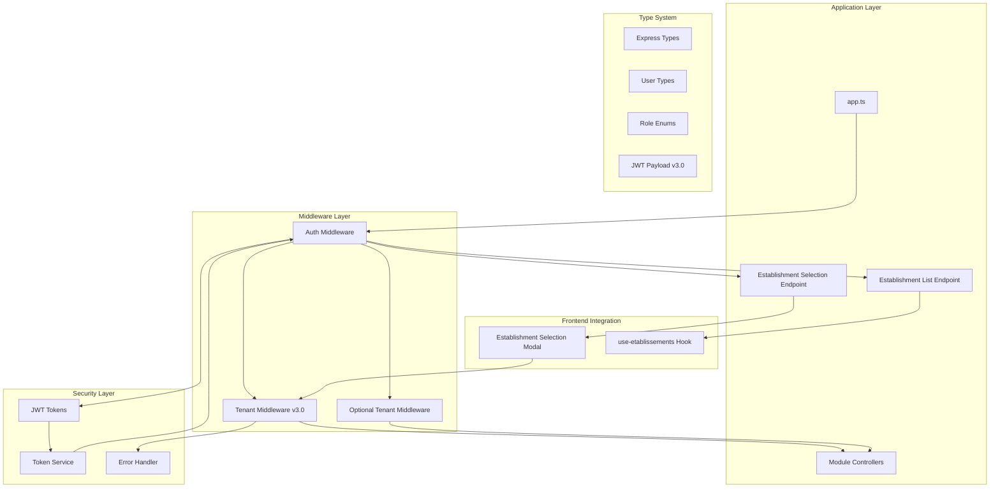
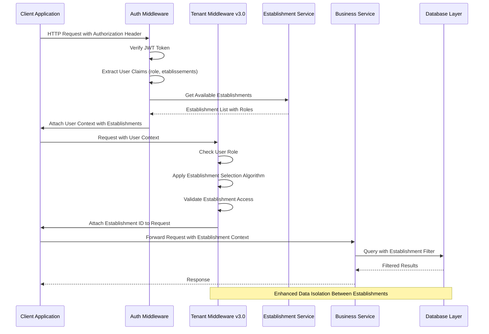
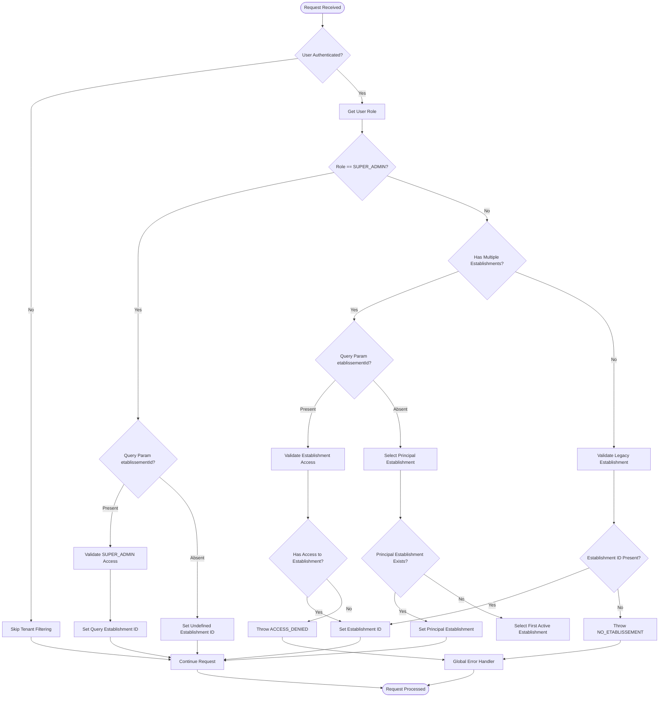
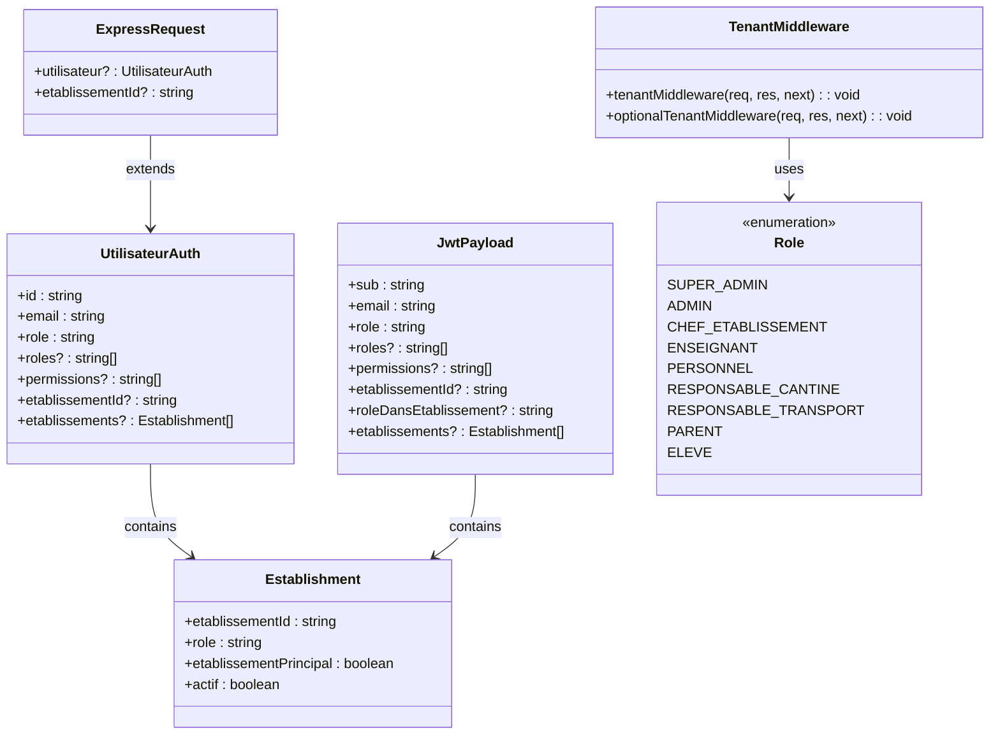
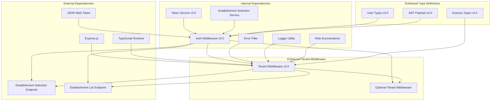
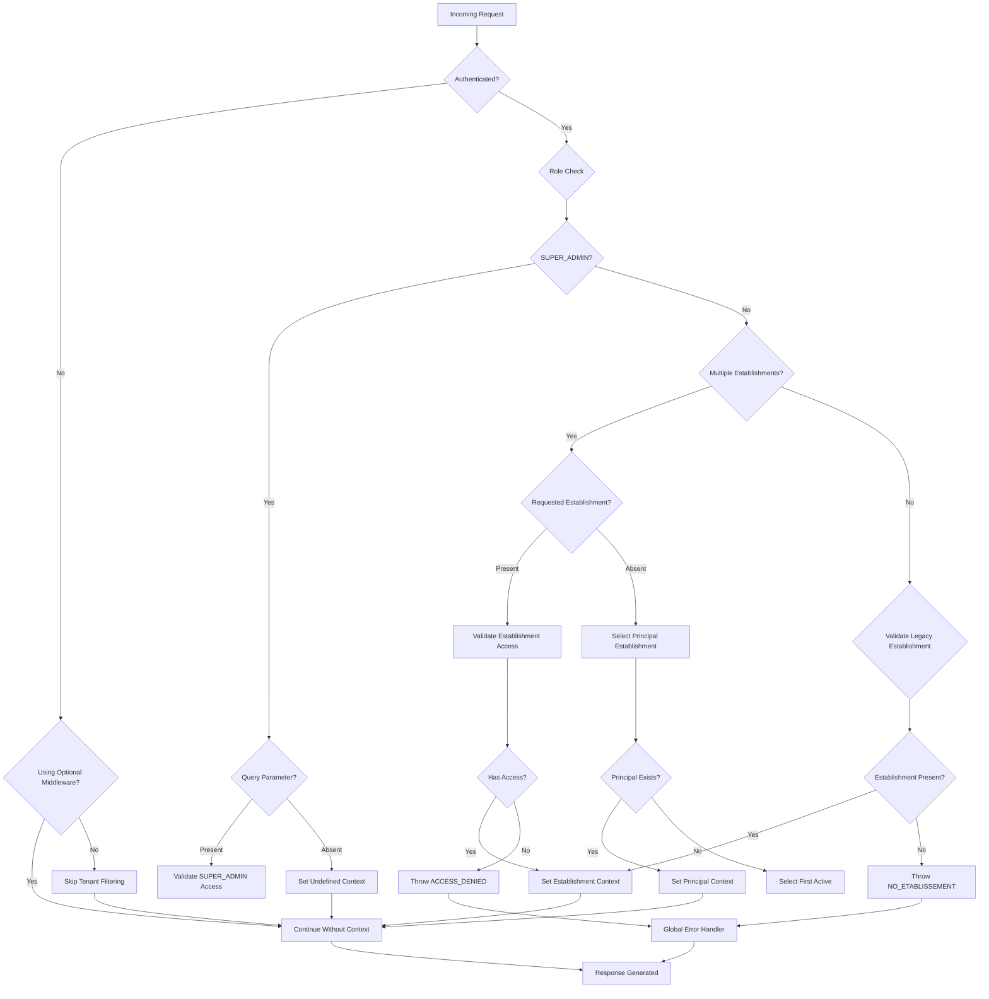

# Tenant Middleware

<cite>
**Referenced Files in This Document**
- [tenant.middleware.ts](file://backend/src/common/middlewares/tenant.middleware.ts)
- [index.ts](file://backend/src/common/middlewares/index.ts)
- [app.ts](file://backend/src/app.ts)
- [auth.middleware.ts](file://backend/src/modules/auth/middlewares/auth.middleware.ts)
- [express.d.ts](file://backend/src/common/types/express.d.ts)
- [roles.enum.ts](file://shared/src/enums/roles.enum.ts)
- [user.types.ts](file://shared/src/types/user.types.ts)
- [token.service.ts](file://backend/src/modules/auth/services/token.service.ts)
- [auth.service.ts](file://backend/src/modules/auth/services/auth.service.ts)
- [auth.dto.ts](file://backend/src/modules/auth/dto/auth.dto.ts)
- [etablissement-selection.service.ts](file://backend/src/modules/auth/services/etablissement-selection.service.ts)
- [auth.controller.ts](file://backend/src/modules/auth/controllers/auth.controller.ts)
</cite>

## Update Summary
**Changes Made**
- Updated to reflect enhanced tenant middleware v3.0 with establishment selection algorithm
- Added multi-establishment support with improved JWT integration
- Enhanced role-based access control with establishment-specific roles
- Added establishment selection modal integration for frontend
- Updated middleware algorithm to support establishment switching

## Table of Contents
1. [Introduction](#introduction)
2. [Project Structure](#project-structure)
3. [Core Components](#core-components)
4. [Architecture Overview](#architecture-overview)
5. [Detailed Component Analysis](#detailed-component-analysis)
6. [Dependency Analysis](#dependency-analysis)
7. [Performance Considerations](#performance-considerations)
8. [Troubleshooting Guide](#troubleshooting-guide)
9. [Conclusion](#conclusion)

## Introduction
This document provides comprehensive technical documentation for the Tenant Middleware system in the eLISAschool backend. The Tenant Middleware implements multi-tenancy capabilities by automatically filtering requests based on establishment boundaries. It reads the establishment ID from JWT tokens and attaches it to incoming requests, enabling services to filter data according to the authenticated user's establishment context. The system supports role-based access control with special privileges for SUPER_ADMIN users who can access all establishments.

**Enhanced v3.0 Features:**
- Establishment selection algorithm with automatic fallback mechanisms
- Multi-establishment support with establishment switching capabilities
- Improved JWT integration with establishment-specific role resolution
- Enhanced security with establishment access validation
- Frontend establishment selection modal integration

The middleware operates as a critical security component that ensures data isolation between different establishments while maintaining flexibility for administrative oversight. It integrates seamlessly with the existing authentication system and provides both mandatory and optional tenant filtering modes.

## Project Structure
The Tenant Middleware is organized within the common middlewares module and integrates with the broader application architecture:

**Diagram sources**
- [app.ts:230-236](file://backend/src/app.ts#L230-L236)
- [auth.middleware.ts:41-80](file://backend/src/modules/auth/middlewares/auth.middleware.ts#L41-L80)
- [tenant.middleware.ts:41-119](file://backend/src/common/middlewares/tenant.middleware.ts#L41-L119)
- [auth.controller.ts:410-423](file://backend/src/modules/auth/controllers/auth.controller.ts#L410-L423)

**Section sources**
- [app.ts:230-236](file://backend/src/app.ts#L230-L236)
- [index.ts:7-8](file://backend/src/common/middlewares/index.ts#L7-L8)

## Core Components

### Enhanced Tenant Middleware v3.0 Implementation
The primary tenant middleware implements automatic establishment ID attachment from JWT tokens with role-based filtering logic and establishment selection algorithm:

**Key Features:**
- Automatic establishment ID extraction from authenticated user context
- Role-based access control with SUPER_ADMIN privilege escalation
- Query parameter override capability for administrative users
- Establishment selection algorithm with fallback mechanisms
- Establishment access validation for multi-establishment users
- Comprehensive error handling with AppError exceptions
- Integration with Express request/response lifecycle

**Enhanced Algorithm:**
1. **SUPER_ADMIN**: Can access all establishments with optional establishment filtering
2. **Multi-establishment users**: Use establishment selection algorithm
3. **Single-establishment users**: Use establishment ID from JWT (legacy compatibility)
4. **Establishment switching**: Query parameter override with access validation

**Establishment Selection Algorithm:**
- If query parameter `etablissementId` provided: Validate access and switch
- If no query parameter: Use establishment principal or first active establishment
- Fallback mechanism ensures establishment context availability

**Section sources**
- [tenant.middleware.ts:32-119](file://backend/src/common/middlewares/tenant.middleware.ts#L32-L119)

### Enhanced Authentication Integration
The middleware relies on the enhanced authentication system for user context with establishment-specific role resolution:

**Enhanced JWT Payload Integration:**
- User ID extraction from token subject claim
- Email resolution from token email claim  
- Role assignment from token role claim
- Establishment array with establishment-specific roles
- Establishment principal flag for fallback selection
- Active status validation for establishment access

**Enhanced Type Safety Guarantees:**
- Strongly typed request extensions via Express declaration merging
- Compile-time validation of user context properties
- Establishment-specific role resolution
- Multi-establishment support in type definitions

**Section sources**
- [auth.middleware.ts:17-80](file://backend/src/modules/auth/middlewares/auth.middleware.ts#L17-L80)
- [auth.dto.ts:84-118](file://backend/src/modules/auth/dto/auth.dto.ts#L84-L118)

### Establishment Selection Service Integration
The middleware integrates with establishment selection services for comprehensive establishment management:

**Establishment Management Features:**
- Available establishment retrieval with role information
- Establishment principal identification
- Establishment activation status validation
- Establishment ordering with principal first priority

**Section sources**
- [etablissement-selection.service.ts:284-308](file://backend/src/modules/auth/services/etablissement-selection.service.ts#L284-L308)

## Architecture Overview

### Enhanced Multi-Tenancy Flow Architecture

**Diagram sources**
- [auth.middleware.ts:41-80](file://backend/src/modules/auth/middlewares/auth.middleware.ts#L41-L80)
- [tenant.middleware.ts:41-119](file://backend/src/common/middlewares/tenant.middleware.ts#L41-L119)
- [etablissement-selection.service.ts:284-308](file://backend/src/modules/auth/services/etablissement-selection.service.ts#L284-L308)

### Enhanced Establishment Selection Algorithm Flow

**Diagram sources**
- [tenant.middleware.ts:41-119](file://backend/src/common/middlewares/tenant.middleware.ts#L41-L119)
- [roles.enum.ts:12-39](file://shared/src/enums/roles.enum.ts#L12-L39)

### Enhanced Type System Integration

**Diagram sources**
- [express.d.ts:14-25](file://backend/src/common/types/express.d.ts#L14-L25)
- [auth.middleware.ts:20-33](file://backend/src/modules/auth/middlewares/auth.middleware.ts#L20-L33)
- [auth.dto.ts:105-118](file://backend/src/modules/auth/dto/auth.dto.ts#L105-L118)
- [roles.enum.ts:12-39](file://shared/src/enums/roles.enum.ts#L12-L39)

**Section sources**
- [express.d.ts:10-27](file://backend/src/common/types/express.d.ts#L10-L27)
- [user.types.ts:50-56](file://shared/src/types/user.types.ts#L50-L56)

## Detailed Component Analysis

### Enhanced Tenant Middleware Core Logic

The tenant middleware implements sophisticated role-based establishment filtering with the following enhanced decision tree:

**Primary Decision Logic:**
1. **Authentication Check**: If no user context exists, skip tenant filtering
2. **Role Classification**: Determine user role from JWT claims
3. **SUPER_ADMIN Privileges**: Allow establishment override via query parameter
4. **Multi-establishment Processing**: Apply establishment selection algorithm
5. **Establishment Validation**: Ensure establishment access for multi-establishment users
6. **Context Attachment**: Attach validated establishment ID to request object

**Enhanced Establishment Selection Algorithm:**
- **Query Parameter Priority**: If `etablissementId` query parameter provided, validate access and switch
- **Principal Establishment Fallback**: Use establishment principal if available and active
- **First Active Establishment**: Fallback to first establishment in case no principal exists
- **Access Validation**: Ensure user has active access to selected establishment

**Enhanced Error Handling Strategy:**
- Non-existent establishment ID for non-SUPER_ADMIN roles triggers AppError with 403 status
- Access denied for unauthorized establishment switching
- Establishment not found or inactive scenarios
- Error propagation through Express error handling middleware
- Graceful fallback for optional middleware mode

**Section sources**
- [tenant.middleware.ts:41-119](file://backend/src/common/middlewares/tenant.middleware.ts#L41-L119)

### Enhanced Authentication Integration Details

The middleware seamlessly integrates with the enhanced authentication system through shared type definitions and establishment-specific role resolution:

**Enhanced JWT Payload Integration:**
- User ID extraction from token subject claim
- Email resolution from token email claim  
- Role assignment from token role claim
- Establishment array with establishment-specific roles
- Establishment principal flag for fallback selection
- Active status validation for establishment access
- Multi-establishment support with establishment switching

**Enhanced Type Safety Guarantees:**
- Strongly typed request extensions via Express declaration merging
- Compile-time validation of user context properties
- Establishment-specific role resolution
- Multi-establishment support in type definitions
- Establishment selection modal integration support

**Section sources**
- [auth.middleware.ts:41-80](file://backend/src/modules/auth/middlewares/auth.middleware.ts#L41-L80)
- [auth.dto.ts:84-118](file://backend/src/modules/auth/dto/auth.dto.ts#L84-L118)
- [express.d.ts:14-25](file://backend/src/common/types/express.d.ts#L14-L25)

### Enhanced Application Integration Points

The middleware is strategically positioned in the application bootstrap process with enhanced establishment management:

**Enhanced Middleware Registration:**
- Applied globally to all `/api/` routes after public endpoints
- Positioned after authentication middleware but before route handlers
- Ensures all protected routes receive establishment context
- Supports establishment-specific route protection

**Enhanced Route Coverage:**
- Automatic filtering for all academic modules (students, grades, schedules)
- Establishment-aware resource management across all domain areas
- Consistent data isolation enforcement
- Establishment switching support for administrative functions

**Establishment Management Integration:**
- Establishment selection endpoint for multi-establishment users
- Establishment list endpoint for frontend integration
- Establishment switching via query parameters
- Establishment principal identification

**Section sources**
- [app.ts:230-236](file://backend/src/app.ts#L230-L236)
- [auth.controller.ts:410-423](file://backend/src/modules/auth/controllers/auth.controller.ts#L410-L423)

## Dependency Analysis

### Enhanced Component Dependencies

**Diagram sources**
- [tenant.middleware.ts:17-20](file://backend/src/common/middlewares/tenant.middleware.ts#L17-L20)
- [auth.middleware.ts:35-36](file://backend/src/modules/auth/middlewares/auth.middleware.ts#L35-L36)
- [auth.service.ts:194-202](file://backend/src/modules/auth/services/auth.service.ts#L194-L202)

### Enhanced Coupling and Cohesion Analysis

**Enhanced High Cohesion Areas:**
- Role-based filtering logic encapsulated within single middleware module
- Establishment selection algorithm in dedicated middleware
- Type safety maintained through enhanced shared type definitions
- Error handling centralized in error filter component
- Establishment management integrated through service layer

**Enhanced Interface Contracts:**
- Express middleware interface compliance
- Strong typing through declaration merging
- Establishment-specific role resolution
- Multi-establishment support interfaces

**Enhanced Potential Dependencies:**
- Authentication middleware dependency for user context
- Error handling middleware for exception propagation
- Establishment selection service for establishment management
- Token service for JWT payload generation
- Establishment controller for establishment endpoints

**Section sources**
- [index.ts:7-8](file://backend/src/common/middlewares/index.ts#L7-L8)
- [roles.enum.ts:12-39](file://shared/src/enums/roles.enum.ts#L12-L39)

## Performance Considerations

### Enhanced Middleware Execution Efficiency
The tenant middleware operates with minimal overhead through optimized establishment selection:

**Enhanced Processing Complexity:**
- Time Complexity: O(n) where n is number of user establishments for access validation
- Memory Complexity: O(1) - No additional allocations beyond request extension
- CPU Usage: Negligible - String comparisons, basic property access, and array iteration

**Enhanced Optimization Strategies:**
- Early termination for unauthenticated requests
- Minimal branching logic for role-based decisions
- Efficient establishment array iteration for access validation
- Establishment principal caching for faster fallback selection
- Query parameter optimization for establishment switching

### Enhanced Scalability Implications
- Stateless operation enables horizontal scaling
- No persistent state maintained between requests
- Lightweight integration with enhanced authentication pipeline
- Establishment selection algorithm scales with establishment count
- Multi-establishment support maintains performance through efficient algorithms

## Troubleshooting Guide

### Enhanced Common Issues and Solutions

**Issue: "Accès non autorisé à cet établissement" Error**
- **Cause**: User attempts to access establishment without proper authorization
- **Solution**: Verify user establishment assignment and active status
- **Prevention**: Ensure establishment access validation passes before establishment switching

**Issue: "Aucun établissement actif associé à votre compte" Error**
- **Cause**: User has inactive establishments or no active establishment assignment
- **Solution**: Check establishment principal flag and active status
- **Prevention**: Ensure establishment principal exists and is marked as active

**Issue: SUPER_ADMIN Cannot Override Establishment**
- **Cause**: Missing or invalid etablissementId query parameter
- **Solution**: Include proper query parameter: `?etablissementId=establishment-id`
- **Validation**: Check query parameter parsing and establishment access validation

**Issue: Establishment Selection Not Working**
- **Cause**: Establishment not found or inactive
- **Solution**: Verify establishment exists and is marked as active
- **Prevention**: Implement establishment validation before selection

**Enhanced Debugging Steps:**
1. Verify JWT token contains establishment array with active establishments
2. Check user role assignment in authentication middleware
3. Confirm establishment principal flag and active status
4. Review establishment selection algorithm execution
5. Monitor establishment access validation logs
6. Verify middleware registration order in application bootstrap

**Section sources**
- [tenant.middleware.ts:71-96](file://backend/src/common/middlewares/tenant.middleware.ts#L71-L96)
- [auth.middleware.ts:60-68](file://backend/src/modules/auth/middlewares/auth.middleware.ts#L60-L68)

### Enhanced Error Handling Flow

**Diagram sources**
- [tenant.middleware.ts:41-119](file://backend/src/common/middlewares/tenant.middleware.ts#L41-L119)

## Conclusion

The Enhanced Tenant Middleware v3.0 represents a significant advancement in multi-tenancy implementation for the eLISAschool backend system. Its design successfully balances security requirements with operational flexibility through sophisticated establishment selection algorithms, multi-establishment support, and enhanced JWT integration.

**Key Enhancements:**
- Sophisticated establishment selection algorithm with intelligent fallback mechanisms
- Comprehensive multi-establishment support with establishment switching capabilities
- Enhanced JWT integration with establishment-specific role resolution
- Establishment access validation for security assurance
- Frontend establishment selection modal integration
- Improved error handling and user experience

**Enhanced Architectural Benefits:**
- Intelligent establishment selection reduces user burden through automatic fallback
- Establishment switching enables administrative oversight without compromising security
- Establishment access validation prevents unauthorized cross-establishment access
- Establishment principal identification streamlines user experience
- Establishment list endpoint supports frontend establishment selection modal
- Enhanced type safety ensures compile-time establishment context validation

**Technical Strengths:**
- Establishment selection algorithm optimizes user experience while maintaining security
- Multi-establishment support scales with organizational growth
- Enhanced JWT payload provides comprehensive establishment context
- Establishment validation prevents data leakage between organizations
- Frontend integration enables seamless establishment switching

The enhanced middleware establishes a robust foundation for enterprise-scale educational management systems while significantly improving user experience through intelligent establishment management. Its modular design enables easy testing, debugging, and potential extension for advanced multi-tenancy scenarios with continued emphasis on security and user experience.