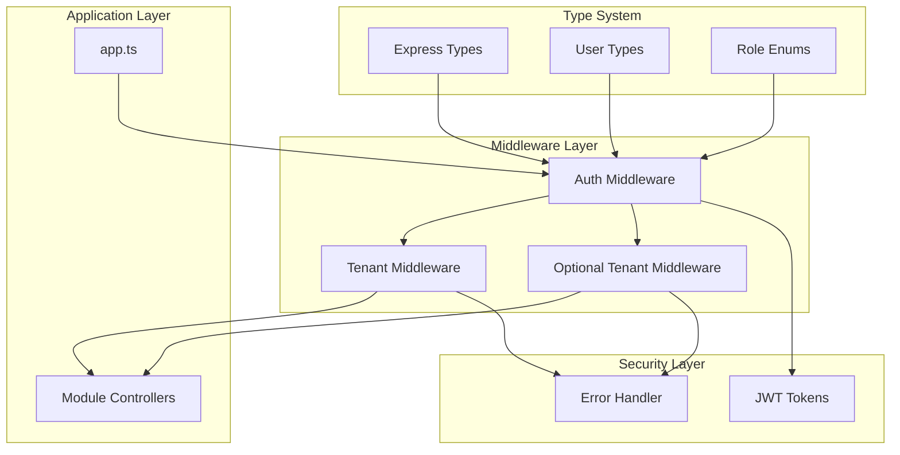
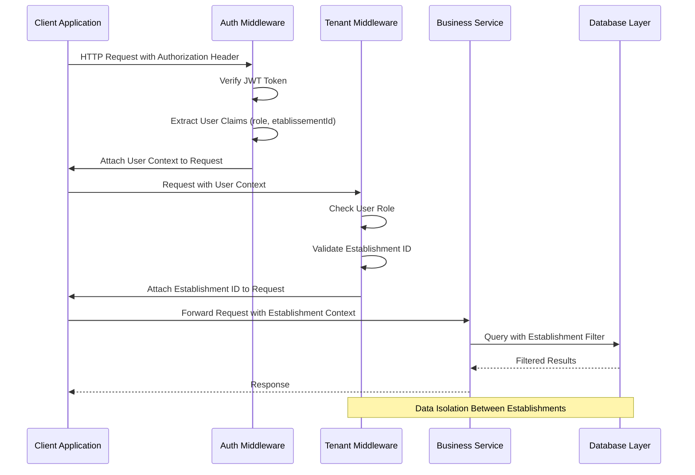
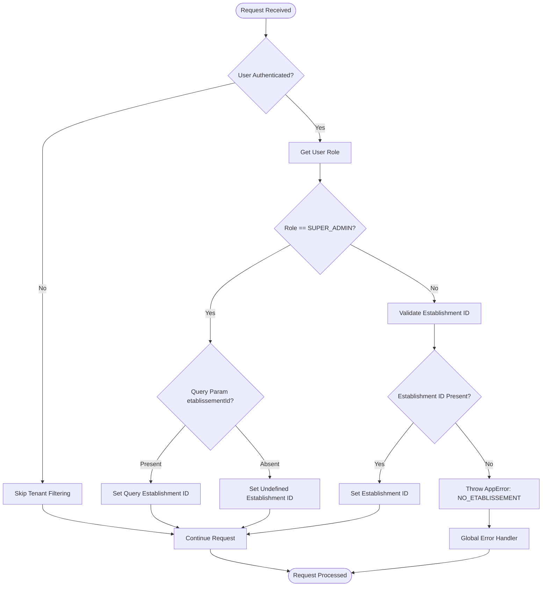
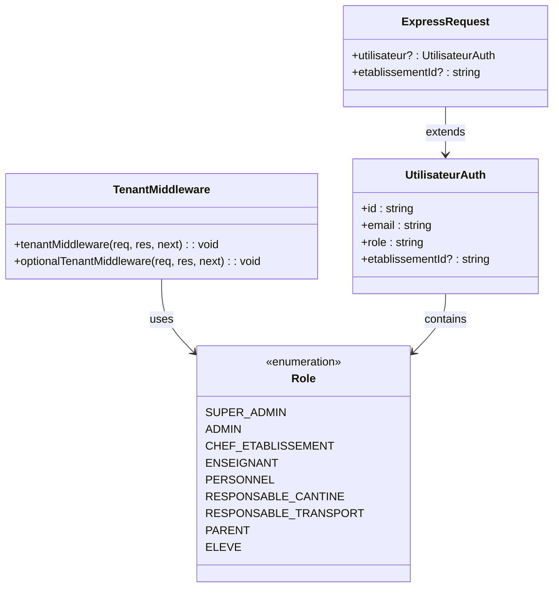
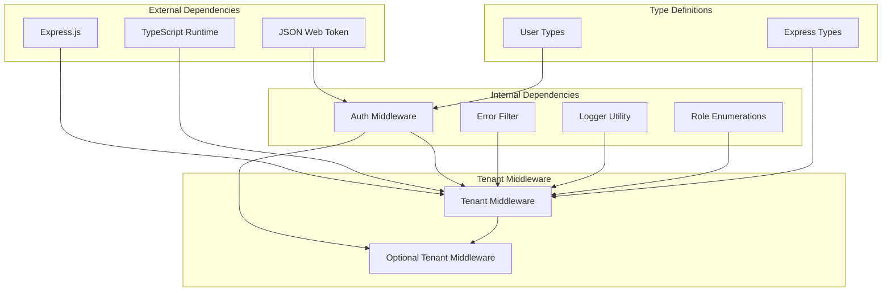
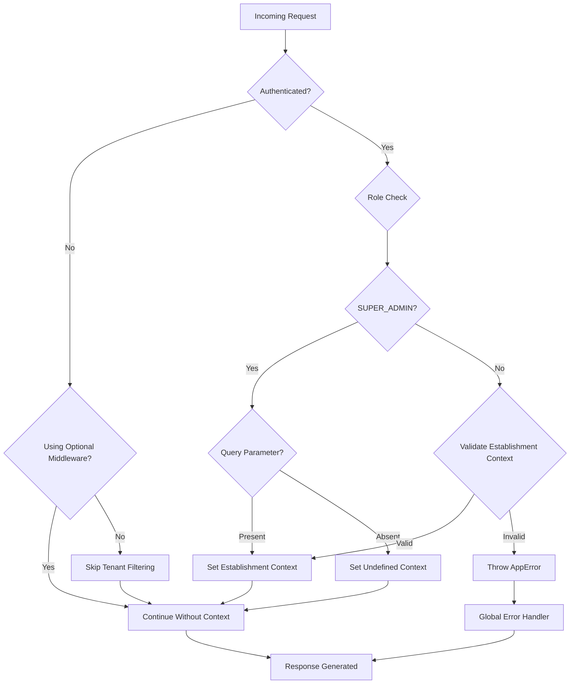

# Tenant Middleware

<cite>
**Referenced Files in This Document**
- [tenant.middleware.ts](file://backend/src/common/middlewares/tenant.middleware.ts)
- [index.ts](file://backend/src/common/middlewares/index.ts)
- [app.ts](file://backend/src/app.ts)
- [auth.middleware.ts](file://backend/src/modules/auth/middlewares/auth.middleware.ts)
- [express.d.ts](file://backend/src/common/types/express.d.ts)
- [roles.enum.ts](file://shared/src/enums/roles.enum.ts)
- [user.types.ts](file://shared/src/types/user.types.ts)
</cite>

## Table of Contents
1. [Introduction](#introduction)
2. [Project Structure](#project-structure)
3. [Core Components](#core-components)
4. [Architecture Overview](#architecture-overview)
5. [Detailed Component Analysis](#detailed-component-analysis)
6. [Dependency Analysis](#dependency-analysis)
7. [Performance Considerations](#performance-considerations)
8. [Troubleshooting Guide](#troubleshooting-guide)
9. [Conclusion](#conclusion)

## Introduction
This document provides comprehensive technical documentation for the Tenant Middleware system in the eLISAschool backend. The Tenant Middleware implements multi-tenancy capabilities by automatically filtering requests based on establishment boundaries. It reads the establishment ID from JWT tokens and attaches it to incoming requests, enabling services to filter data according to the authenticated user's establishment context. The system supports role-based access control with special privileges for SUPER_ADMIN users who can access all establishments.

The middleware operates as a critical security component that ensures data isolation between different establishments while maintaining flexibility for administrative oversight. It integrates seamlessly with the existing authentication system and provides both mandatory and optional tenant filtering modes.

## Project Structure
The Tenant Middleware is organized within the common middlewares module and integrates with the broader application architecture:

**Diagram sources**
- [app.ts:157-162](file://backend/src/app.ts#L157-L162)
- [auth.middleware.ts:30-60](file://backend/src/modules/auth/middlewares/auth.middleware.ts#L30-L60)
- [tenant.middleware.ts:27-61](file://backend/src/common/middlewares/tenant.middleware.ts#L27-L61)

**Section sources**
- [app.ts:157-162](file://backend/src/app.ts#L157-L162)
- [index.ts:7-8](file://backend/src/common/middlewares/index.ts#L7-L8)

## Core Components

### Tenant Middleware Implementation
The primary tenant middleware implements automatic establishment ID attachment from JWT tokens with role-based filtering logic:

**Key Features:**
- Automatic establishment ID extraction from authenticated user context
- Role-based access control with SUPER_ADMIN privilege escalation
- Query parameter override capability for administrative users
- Comprehensive error handling with AppError exceptions
- Integration with Express request/response lifecycle

**Behavior Patterns:**
- SUPER_ADMIN users can access all establishments with optional establishment filtering
- ADMIN and CHEF_ETABLISSEMENT roles use establishment ID from JWT
- Other roles require establishment ID presence in JWT claims
- Optional middleware mode for non-critical establishment filtering

**Section sources**
- [tenant.middleware.ts:19-61](file://backend/src/common/middlewares/tenant.middleware.ts#L19-L61)

### Optional Tenant Middleware
Provides flexible establishment filtering without blocking requests when establishment context is unavailable:

**Key Features:**
- Conditional establishment ID attachment based on availability
- Non-blocking operation that never throws errors
- Graceful degradation when establishment context is missing
- Useful for optional establishment filtering scenarios

**Section sources**
- [tenant.middleware.ts:63-71](file://backend/src/common/middlewares/tenant.middleware.ts#L63-L71)

### Authentication Integration
The middleware relies on the authentication system for user context:

**Integration Points:**
- JWT token verification and payload extraction
- User role determination and establishment assignment
- Session data validation and error propagation
- Token service integration for access validation

**Section sources**
- [auth.middleware.ts:30-60](file://backend/src/modules/auth/middlewares/auth.middleware.ts#L30-L60)

## Architecture Overview

### Multi-Tenancy Flow Architecture

**Diagram sources**
- [auth.middleware.ts:30-60](file://backend/src/modules/auth/middlewares/auth.middleware.ts#L30-L60)
- [tenant.middleware.ts:27-61](file://backend/src/common/middlewares/tenant.middleware.ts#L27-L61)

### Role-Based Access Control Flow

**Diagram sources**
- [tenant.middleware.ts:27-61](file://backend/src/common/middlewares/tenant.middleware.ts#L27-L61)
- [roles.enum.ts:12-39](file://shared/src/enums/roles.enum.ts#L12-L39)

### Type System Integration

**Diagram sources**
- [express.d.ts:14-24](file://backend/src/common/types/express.d.ts#L14-L24)
- [auth.middleware.ts:17-22](file://backend/src/modules/auth/middlewares/auth.middleware.ts#L17-L22)
- [roles.enum.ts:12-39](file://shared/src/enums/roles.enum.ts#L12-L39)

**Section sources**
- [express.d.ts:10-27](file://backend/src/common/types/express.d.ts#L10-L27)
- [user.types.ts:50-56](file://shared/src/types/user.types.ts#L50-L56)

## Detailed Component Analysis

### Tenant Middleware Core Logic

The tenant middleware implements sophisticated role-based establishment filtering with the following decision tree:

**Primary Decision Logic:**
1. **Authentication Check**: If no user context exists, skip tenant filtering
2. **Role Classification**: Determine user role from JWT claims
3. **SUPER_ADMIN Privileges**: Allow establishment override via query parameter
4. **Establishment Validation**: Ensure establishment ID exists for non-SUPER_ADMIN roles
5. **Context Attachment**: Attach validated establishment ID to request object

**Error Handling Strategy:**
- Non-existent establishment ID for non-SUPER_ADMIN roles triggers AppError with 403 status
- Error propagation through Express error handling middleware
- Graceful fallback for optional middleware mode

**Section sources**
- [tenant.middleware.ts:27-61](file://backend/src/common/middlewares/tenant.middleware.ts#L27-L61)

### Authentication Integration Details

The middleware seamlessly integrates with the authentication system through shared type definitions:

**JWT Payload Integration:**
- User ID extraction from token subject claim
- Email resolution from token email claim  
- Role assignment from token role claim
- Establishment ID extraction from token etablissementId claim

**Type Safety Guarantees:**
- Strongly typed request extensions via Express declaration merging
- Compile-time validation of user context properties
- Consistent type definitions across frontend and backend

**Section sources**
- [auth.middleware.ts:30-54](file://backend/src/modules/auth/middlewares/auth.middleware.ts#L30-L54)
- [express.d.ts:14-24](file://backend/src/common/types/express.d.ts#L14-L24)

### Application Integration Points

The middleware is strategically positioned in the application bootstrap process:

**Middleware Registration:**
- Applied globally to all `/api/` routes after public endpoints
- Positioned after authentication middleware but before route handlers
- Ensures all protected routes receive establishment context

**Route Coverage:**
- Automatic filtering for all academic modules (students, grades, schedules)
- Establishment-aware resource management across all domain areas
- Consistent data isolation enforcement

**Section sources**
- [app.ts:157-162](file://backend/src/app.ts#L157-L162)

## Dependency Analysis

### Component Dependencies

**Diagram sources**
- [tenant.middleware.ts:14-17](file://backend/src/common/middlewares/tenant.middleware.ts#L14-L17)
- [auth.middleware.ts:9-12](file://backend/src/modules/auth/middlewares/auth.middleware.ts#L9-L12)

### Coupling and Cohesion Analysis

**High Cohesion Areas:**
- Role-based filtering logic encapsulated within single middleware module
- Type safety maintained through shared type definitions
- Error handling centralized in error filter component

**Interface Contracts:**
- Express middleware interface compliance
- Strong typing through declaration merging
- Consistent error response format

**Potential Dependencies:**
- Authentication middleware dependency for user context
- Error handling middleware for exception propagation
- Role enumeration for access control decisions

**Section sources**
- [index.ts:7-8](file://backend/src/common/middlewares/index.ts#L7-L8)
- [roles.enum.ts:12-39](file://shared/src/enums/roles.enum.ts#L12-L39)

## Performance Considerations

### Middleware Execution Efficiency
The tenant middleware operates with minimal overhead:

**Processing Complexity:**
- Time Complexity: O(1) - Single conditional checks and property assignments
- Memory Complexity: O(1) - No additional allocations beyond request extension
- CPU Usage: Negligible - String comparisons and basic property access

**Optimization Strategies:**
- Early termination for unauthenticated requests
- Minimal branching logic for role-based decisions
- Efficient error handling without stack unwinding

### Scalability Implications
- Stateless operation enables horizontal scaling
- No persistent state maintained between requests
- Lightweight integration with existing authentication pipeline

## Troubleshooting Guide

### Common Issues and Solutions

**Issue: "Aucun établissement associé à votre compte" Error**
- **Cause**: Non-SUPER_ADMIN user attempting to access without establishment ID
- **Solution**: Ensure user JWT contains valid establishment ID claim
- **Prevention**: Verify user establishment assignment in authentication service

**Issue: SUPER_ADMIN Cannot Override Establishment**
- **Cause**: Missing or invalid etablissementId query parameter
- **Solution**: Include proper query parameter: `?etablissementId=establishment-id`
- **Validation**: Check query parameter parsing and type conversion

**Issue: Request Proceeds Without Establishment Context**
- **Cause**: Optional tenant middleware usage or unauthenticated request
- **Solution**: Use mandatory tenant middleware for critical endpoints
- **Monitoring**: Implement logging for establishment context absence

**Debugging Steps:**
1. Verify JWT token contains establishment ID claim
2. Check user role assignment in authentication middleware
3. Confirm middleware registration order in application bootstrap
4. Review error logs for AppError propagation

**Section sources**
- [tenant.middleware.ts:48-53](file://backend/src/common/middlewares/tenant.middleware.ts#L48-L53)
- [auth.middleware.ts:48-54](file://backend/src/modules/auth/middlewares/auth.middleware.ts#L48-L54)

### Error Handling Flow

**Diagram sources**
- [tenant.middleware.ts:27-61](file://backend/src/common/middlewares/tenant.middleware.ts#L27-L61)

## Conclusion

The Tenant Middleware represents a robust implementation of multi-tenancy in the eLISAschool backend system. Its design successfully balances security requirements with operational flexibility through role-based establishment filtering and administrative override capabilities.

**Key Strengths:**
- Seamless integration with existing authentication infrastructure
- Comprehensive role-based access control implementation
- Type-safe architecture with strong compile-time guarantees
- Minimal performance impact with efficient execution logic
- Flexible deployment options supporting both mandatory and optional filtering

**Architectural Benefits:**
- Automatic data isolation between establishments
- Administrative oversight capabilities for SUPER_ADMIN users
- Consistent establishment context across all business services
- Extensible design supporting future multi-tenancy enhancements

The middleware establishes a solid foundation for enterprise-scale educational management systems while maintaining simplicity and maintainability. Its modular design enables easy testing, debugging, and potential extension for advanced multi-tenancy scenarios.