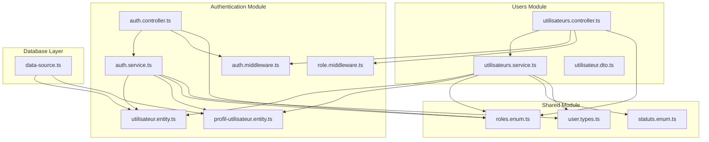
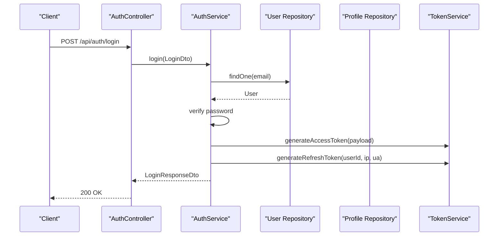
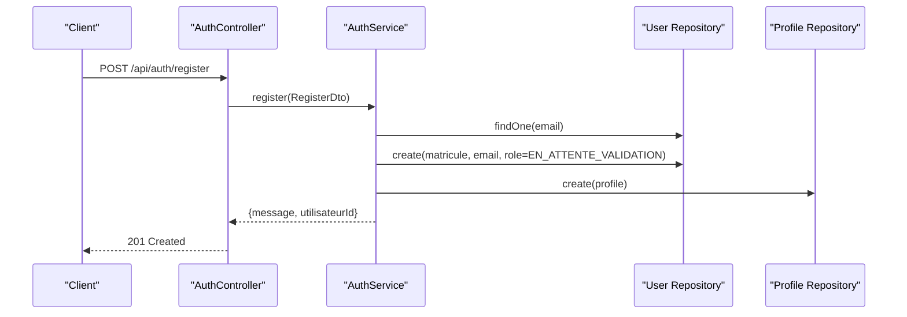
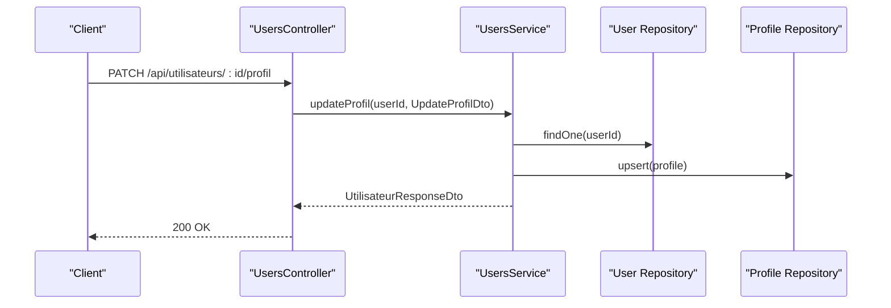
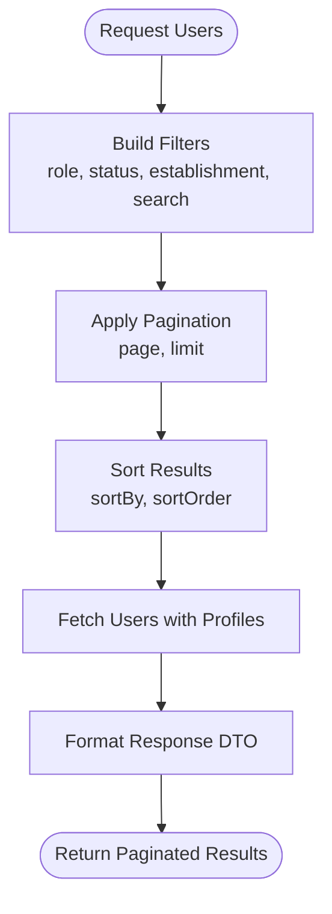
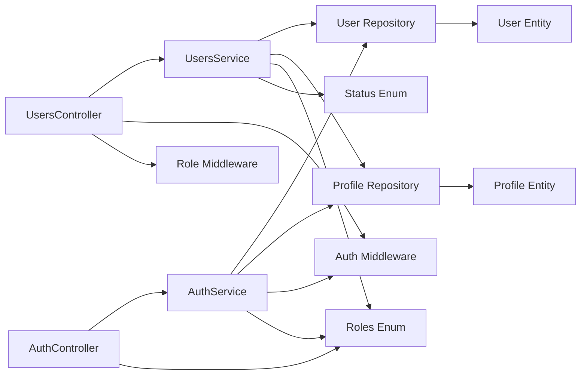

# User Account Administration

<cite>
**Referenced Files in This Document**
- [utilisateurs.controller.ts](file://backend/src/modules/utilisateurs/controllers/utilisateurs.controller.ts)
- [utilisateur.dto.ts](file://backend/src/modules/utilisateurs/dto/utilisateur.dto.ts)
- [utilisateurs.service.ts](file://backend/src/modules/utilisateurs/services/utilisateurs.service.ts)
- [utilisateur.entity.ts](file://backend/src/modules/auth/entities/utilisateur.entity.ts)
- [profil-utilisateur.entity.ts](file://backend/src/modules/auth/entities/profil-utilisateur.entity.ts)
- [auth.middleware.ts](file://backend/src/modules/auth/middlewares/auth.middleware.ts)
- [role.middleware.ts](file://backend/src/modules/auth/middlewares/role.middleware.ts)
- [auth.controller.ts](file://backend/src/modules/auth/controllers/auth.controller.ts)
- [auth.service.ts](file://backend/src/modules/auth/services/auth.service.ts)
- [roles.enum.ts](file://shared/src/enums/roles.enum.ts)
- [statuts.enum.ts](file://shared/src/enums/statuts.enum.ts)
- [user.types.ts](file://shared/src/types/user.types.ts)
- [data-source.ts](file://backend/src/database/data-source.ts)
</cite>

## Table of Contents
1. [Introduction](#introduction)
2. [Project Structure](#project-structure)
3. [Core Components](#core-components)
4. [Architecture Overview](#architecture-overview)
5. [Detailed Component Analysis](#detailed-component-analysis)
6. [Dependency Analysis](#dependency-analysis)
7. [Performance Considerations](#performance-considerations)
8. [Troubleshooting Guide](#troubleshooting-guide)
9. [Conclusion](#conclusion)

## Introduction
This document provides comprehensive documentation for user account administration within the eLISAschool platform. It covers user management workflows, account provisioning, lifecycle operations, and integration with the authentication system. The documentation explains how to create, modify, deactivate, and delete user accounts, manage profiles, synchronize user data, and operate user endpoints securely. Practical examples illustrate onboarding, maintenance, bulk operations, and data export capabilities.

## Project Structure
The user account administration functionality spans three primary modules:
- Authentication module: Handles login, registration, token management, and current user retrieval.
- Users module: Manages user CRUD operations, profile updates, status changes, and user listing with pagination and filtering.
- Shared module: Defines roles, statuses, and user-related types used across the application.

**Diagram sources**
- [auth.controller.ts:1-268](file://backend/src/modules/auth/controllers/auth.controller.ts#L1-L268)
- [auth.service.ts:1-485](file://backend/src/modules/auth/services/auth.service.ts#L1-L485)
- [auth.middleware.ts:1-92](file://backend/src/modules/auth/middlewares/auth.middleware.ts#L1-L92)
- [role.middleware.ts:1-152](file://backend/src/modules/auth/middlewares/role.middleware.ts#L1-L152)
- [utilisateurs.controller.ts:1-207](file://backend/src/modules/utilisateurs/controllers/utilisateurs.controller.ts#L1-L207)
- [utilisateurs.service.ts:1-344](file://backend/src/modules/utilisateurs/services/utilisateurs.service.ts#L1-L344)
- [utilisateur.dto.ts:1-119](file://backend/src/modules/utilisateurs/dto/utilisateur.dto.ts#L1-L119)
- [utilisateur.entity.ts:1-143](file://backend/src/modules/auth/entities/utilisateur.entity.ts#L1-L143)
- [profil-utilisateur.entity.ts:1-105](file://backend/src/modules/auth/entities/profil-utilisateur.entity.ts#L1-L105)
- [roles.enum.ts:1-187](file://shared/src/enums/roles.enum.ts#L1-L187)
- [statuts.enum.ts:1-133](file://shared/src/enums/statuts.enum.ts#L1-L133)
- [user.types.ts:1-61](file://shared/src/types/user.types.ts#L1-L61)
- [data-source.ts:1-40](file://backend/src/database/data-source.ts#L1-L40)

**Section sources**
- [utilisateurs.controller.ts:1-207](file://backend/src/modules/utilisateurs/controllers/utilisateurs.controller.ts#L1-L207)
- [utilisateurs.service.ts:1-344](file://backend/src/modules/utilisateurs/services/utilisateurs.service.ts#L1-L344)
- [utilisateur.dto.ts:1-119](file://backend/src/modules/utilisateurs/dto/utilisateur.dto.ts#L1-L119)
- [auth.controller.ts:1-268](file://backend/src/modules/auth/controllers/auth.controller.ts#L1-L268)
- [auth.service.ts:1-485](file://backend/src/modules/auth/services/auth.service.ts#L1-L485)
- [utilisateur.entity.ts:1-143](file://backend/src/modules/auth/entities/utilisateur.entity.ts#L1-L143)
- [profil-utilisateur.entity.ts:1-105](file://backend/src/modules/auth/entities/profil-utilisateur.entity.ts#L1-L105)
- [roles.enum.ts:1-187](file://shared/src/enums/roles.enum.ts#L1-L187)
- [statuts.enum.ts:1-133](file://shared/src/enums/statuts.enum.ts#L1-L133)
- [user.types.ts:1-61](file://shared/src/types/user.types.ts#L1-L61)
- [data-source.ts:1-40](file://backend/src/database/data-source.ts#L1-L40)

## Core Components
- User Controller: Exposes REST endpoints for listing, retrieving, creating, updating, changing status, and deleting users. Includes profile update endpoints and role-based access control.
- User Service: Implements business logic for user creation, updates, profile management, status changes, deletions, and paginated queries with filters. Uses repositories for data persistence and formats unified response DTOs.
- User DTOs: Define strict validation schemas for user creation, updates, profile updates, and query parameters using Zod. Also define response DTO structures.
- Authentication Controller and Service: Manage login, registration, token refresh, logout, password reset/change, email verification, and current user retrieval.
- Authentication Middleware: Validates JWT access tokens and attaches user context to requests. Role middleware enforces role-based access control.
- Entities: User entity defines authentication and identification fields, password hashing, and helper methods. Profile entity stores personal details linked to users.
- Enums and Types: Centralized role and status enumerations, and shared user types for cross-module consistency.

Key responsibilities:
- User Management: Creation, modification, deactivation, deletion, and listing with pagination and filters.
- Profile Management: Personal details, contact info, and demographic data synchronization.
- Lifecycle Operations: Status transitions (active, inactive, suspended, pending validation).
- Security: JWT-based authentication, role-based authorization, and secure password handling.

**Section sources**
- [utilisateurs.controller.ts:47-203](file://backend/src/modules/utilisateurs/controllers/utilisateurs.controller.ts#L47-L203)
- [utilisateurs.service.ts:51-308](file://backend/src/modules/utilisateurs/services/utilisateurs.service.ts#L51-L308)
- [utilisateur.dto.ts:14-86](file://backend/src/modules/utilisateurs/dto/utilisateur.dto.ts#L14-L86)
- [auth.controller.ts:55-264](file://backend/src/modules/auth/controllers/auth.controller.ts#L55-L264)
- [auth.service.ts:61-480](file://backend/src/modules/auth/services/auth.service.ts#L61-L480)
- [auth.middleware.ts:30-60](file://backend/src/modules/auth/middlewares/auth.middleware.ts#L30-L60)
- [role.middleware.ts:20-149](file://backend/src/modules/auth/middlewares/role.middleware.ts#L20-L149)
- [utilisateur.entity.ts:52-140](file://backend/src/modules/auth/entities/utilisateur.entity.ts#L52-L140)
- [profil-utilisateur.entity.ts:34-101](file://backend/src/modules/auth/entities/profil-utilisateur.entity.ts#L34-L101)
- [roles.enum.ts:12-39](file://shared/src/enums/roles.enum.ts#L12-L39)
- [statuts.enum.ts:105-110](file://shared/src/enums/statuts.enum.ts#L105-L110)
- [user.types.ts:14-56](file://shared/src/types/user.types.ts#L14-L56)

## Architecture Overview
The user administration architecture follows layered patterns:
- Presentation Layer: Controllers handle HTTP requests and responses.
- Application Layer: Services encapsulate business logic and orchestrate operations.
- Domain Layer: Entities represent persistent data structures with validation and helper methods.
- Shared Layer: Enums and types ensure consistency across modules.
- Data Access: TypeORM repositories and DataSource manage database connections.

**Diagram sources**
- [auth.controller.ts:55-74](file://backend/src/modules/auth/controllers/auth.controller.ts#L55-L74)
- [auth.service.ts:61-161](file://backend/src/modules/auth/services/auth.service.ts#L61-L161)
- [utilisateur.entity.ts:120-122](file://backend/src/modules/auth/entities/utilisateur.entity.ts#L120-L122)
- [data-source.ts:17-28](file://backend/src/database/data-source.ts#L17-L28)

**Section sources**
- [auth.controller.ts:1-268](file://backend/src/modules/auth/controllers/auth.controller.ts#L1-L268)
- [auth.service.ts:1-485](file://backend/src/modules/auth/services/auth.service.ts#L1-L485)
- [utilisateurs.controller.ts:1-207](file://backend/src/modules/utilisateurs/controllers/utilisateurs.controller.ts#L1-L207)
- [utilisateurs.service.ts:1-344](file://backend/src/modules/utilisateurs/services/utilisateurs.service.ts#L1-L344)
- [data-source.ts:1-40](file://backend/src/database/data-source.ts#L1-L40)

## Detailed Component Analysis

### User Controller Endpoints
The user controller exposes the following endpoints:
- GET /api/utilisateurs: List users with pagination and filters (requires admin roles).
- GET /api/utilisateurs/:id: Retrieve a specific user (self-view or admin access).
- POST /api/utilisateurs: Create a new user (admin-only).
- PATCH /api/utilisateurs/:id: Update user details (admin-only).
- PATCH /api/utilisateurs/:id/profil: Update user profile (self or admin).
- PATCH /api/utilisateurs/:id/statut: Change user status (admin-only).
- DELETE /api/utilisateurs/:id: Delete a user (super admin-only).

Authorization:
- All user endpoints are protected by authentication middleware.
- Role middleware restricts access to specific roles (e.g., admin-only, manager-only).

Validation:
- Zod schemas validate request bodies and query parameters, returning structured validation errors.

Response Pattern:
- Standardized success envelope with data, message, and timestamp.

**Section sources**
- [utilisateurs.controller.ts:47-203](file://backend/src/modules/utilisateurs/controllers/utilisateurs.controller.ts#L47-L203)
- [auth.middleware.ts:30-60](file://backend/src/modules/auth/middlewares/auth.middleware.ts#L30-L60)
- [role.middleware.ts:20-149](file://backend/src/modules/auth/middlewares/role.middleware.ts#L20-L149)

### User Service Operations
User service implements core business operations:
- create: Validates uniqueness, generates unique matricule, creates user and profile records, logs activity.
- findAll: Builds paginated, filterable, and sortable queries with joins to profiles.
- findOne: Retrieves a single user with associated profile.
- update: Updates user attributes with optional email uniqueness check.
- updateProfil: Upserts profile data for a given user.
- changeStatut: Transitions user status with audit logging.
- remove: Deletes a user record.

Data Synchronization:
- User and profile entities are synchronized via repository operations and formatted into a unified response DTO.

**Section sources**
- [utilisateurs.service.ts:51-308](file://backend/src/modules/utilisateurs/services/utilisateurs.service.ts#L51-L308)
- [utilisateur.entity.ts:52-140](file://backend/src/modules/auth/entities/utilisateur.entity.ts#L52-L140)
- [profil-utilisateur.entity.ts:34-101](file://backend/src/modules/auth/entities/profil-utilisateur.entity.ts#L34-L101)

### User DTO Structures
DTOs define strict validation schemas:
- CreateUtilisateurDto: Email, password, role, name, phone, gender, birth date, address, establishment, language.
- UpdateUtilisateurDto: Optional fields for email, role, status, language, establishment.
- UpdateProfilDto: Personal details including secondary phone, birth info, nationality, address, city, neighborhood.
- QueryUtilisateursDto: Pagination, search term, role, status, establishment, sort field, and order.

Response DTO:
- UtilisateurResponseDto: User identity, credentials metadata, preferences, timestamps, and optional profile.

**Section sources**
- [utilisateur.dto.ts:14-111](file://backend/src/modules/utilisateurs/dto/utilisateur.dto.ts#L14-L111)

### Authentication Integration
Authentication endpoints and flows integrate tightly with user management:
- Login: Validates credentials, checks status and lockout, generates access and refresh tokens.
- Registration: Creates user with default role, generates matricule, sets pending validation status, and creates profile.
- Password Management: Reset, change, and forgot-password flows with token validation and expiration.
- Current User: Retrieves authenticated user with profile details.

Security:
- JWT access tokens are validated by middleware and attached to requests.
- Refresh tokens are managed and revoked upon logout or password changes.
- Passwords are hashed using bcrypt with salt rounds.

**Section sources**
- [auth.controller.ts:55-264](file://backend/src/modules/auth/controllers/auth.controller.ts#L55-L264)
- [auth.service.ts:61-480](file://backend/src/modules/auth/services/auth.service.ts#L61-L480)
- [auth.middleware.ts:30-60](file://backend/src/modules/auth/middlewares/auth.middleware.ts#L30-L60)
- [utilisateur.entity.ts:107-122](file://backend/src/modules/auth/entities/utilisateur.entity.ts#L107-L122)

### User Lifecycle Operations
Lifecycle stages and transitions:
- Provisioning: Registration creates user with EN_ATTENTE_VALIDATION status and pending email verification.
- Activation: Email verification updates status to ACTIF when appropriate.
- Maintenance: Regular updates to profile, credentials, and preferences.
- Deactivation/Suspension: Admin changes status to INACTIF or SUSPENDU for policy compliance.
- Deletion: Super admin removes user records.

Status Enumerations:
- StatutUtilisateur includes ACTIF, INACTIF, SUSPENDU, EN_ATTENTE_VALIDATION.

**Section sources**
- [auth.service.ts:166-234](file://backend/src/modules/auth/services/auth.service.ts#L166-L234)
- [auth.service.ts:426-447](file://backend/src/modules/auth/services/auth.service.ts#L426-L447)
- [statuts.enum.ts:105-110](file://shared/src/enums/statuts.enum.ts#L105-L110)

### Practical Workflows

#### User Onboarding Workflow
- Registration endpoint receives user data and validates against registration schema.
- Service ensures password meets minimum length and complexity requirements.
- Unique email and matricule are enforced.
- Profile is created alongside user record.
- Audit log records the user creation event.

**Diagram sources**
- [auth.controller.ts:80-95](file://backend/src/modules/auth/controllers/auth.controller.ts#L80-L95)
- [auth.service.ts:166-234](file://backend/src/modules/auth/services/auth.service.ts#L166-L234)

#### Account Maintenance Procedure
- Update user details: Admin modifies role, status, language, or establishment.
- Update profile: User or admin updates personal information with optional phone numbers and addresses.
- Change password: Authenticated user changes password after validating current password.

**Diagram sources**
- [utilisateurs.controller.ts:135-156](file://backend/src/modules/utilisateurs/controllers/utilisateurs.controller.ts#L135-L156)
- [utilisateurs.service.ts:242-267](file://backend/src/modules/utilisateurs/services/utilisateurs.service.ts#L242-L267)

#### Bulk User Operations
- Listing with filters: Use query parameters to filter by role, status, establishment, and search term.
- Pagination: Control page and limit to process large datasets incrementally.
- Batch status changes: Admin endpoint to change status across selected users (conceptual extension).

**Diagram sources**
- [utilisateurs.controller.ts:47-60](file://backend/src/modules/utilisateurs/controllers/utilisateurs.controller.ts#L47-L60)
- [utilisateurs.service.ts:105-168](file://backend/src/modules/utilisateurs/services/utilisateurs.service.ts#L105-L168)

#### User Data Export Capabilities
- Retrieve paginated user lists with profile details for reporting and analytics.
- Use query parameters to narrow datasets (role, status, establishment).
- Export formats can be derived from the standardized response DTO structure.

**Section sources**
- [utilisateurs.controller.ts:47-60](file://backend/src/modules/utilisateurs/controllers/utilisateurs.controller.ts#L47-L60)
- [utilisateurs.service.ts:105-168](file://backend/src/modules/utilisateurs/services/utilisateurs.service.ts#L105-L168)
- [utilisateur.dto.ts:91-111](file://backend/src/modules/utilisateurs/dto/utilisateur.dto.ts#L91-L111)

## Dependency Analysis
The user administration system exhibits clear separation of concerns:
- Controllers depend on services for business logic.
- Services depend on repositories and entities for persistence and domain logic.
- Middlewares enforce authentication and authorization policies.
- Shared enums and types unify role and status definitions across modules.
- Data access relies on a centralized DataSource.

**Diagram sources**
- [utilisateurs.controller.ts:1-207](file://backend/src/modules/utilisateurs/controllers/utilisateurs.controller.ts#L1-L207)
- [utilisateurs.service.ts:1-344](file://backend/src/modules/utilisateurs/services/utilisateurs.service.ts#L1-L344)
- [utilisateur.entity.ts:1-143](file://backend/src/modules/auth/entities/utilisateur.entity.ts#L1-L143)
- [profil-utilisateur.entity.ts:1-105](file://backend/src/modules/auth/entities/profil-utilisateur.entity.ts#L1-L105)
- [auth.controller.ts:1-268](file://backend/src/modules/auth/controllers/auth.controller.ts#L1-L268)
- [auth.service.ts:1-485](file://backend/src/modules/auth/services/auth.service.ts#L1-L485)
- [auth.middleware.ts:1-92](file://backend/src/modules/auth/middlewares/auth.middleware.ts#L1-L92)
- [role.middleware.ts:1-152](file://backend/src/modules/auth/middlewares/role.middleware.ts#L1-L152)
- [roles.enum.ts:1-187](file://shared/src/enums/roles.enum.ts#L1-L187)
- [statuts.enum.ts:1-133](file://shared/src/enums/statuts.enum.ts#L1-L133)

**Section sources**
- [utilisateurs.controller.ts:1-207](file://backend/src/modules/utilisateurs/controllers/utilisateurs.controller.ts#L1-L207)
- [utilisateurs.service.ts:1-344](file://backend/src/modules/utilisateurs/services/utilisateurs.service.ts#L1-L344)
- [auth.controller.ts:1-268](file://backend/src/modules/auth/controllers/auth.controller.ts#L1-L268)
- [auth.service.ts:1-485](file://backend/src/modules/auth/services/auth.service.ts#L1-L485)
- [roles.enum.ts:1-187](file://shared/src/enums/roles.enum.ts#L1-L187)
- [statuts.enum.ts:1-133](file://shared/src/enums/statuts.enum.ts#L1-L133)

## Performance Considerations
- Pagination and Filtering: Use query parameters to limit result sets and avoid full-table scans.
- Indexing: Ensure database indexes exist on frequently filtered columns (email, matricule, role, status, establishmentId).
- Lazy Loading: Leverage joins for profile data only when needed to minimize overhead.
- Token Management: Efficient refresh token storage and revocation reduce authentication overhead.
- Logging: Audit logs should be batched or buffered to minimize I/O impact during high-volume operations.

## Troubleshooting Guide
Common issues and resolutions:
- Validation Errors: Zod validation returns structured errors with field paths; review request payloads against DTO schemas.
- Authentication Failures: Missing or invalid tokens lead to 401 responses; ensure proper Bearer token usage.
- Authorization Errors: Role middleware throws 403 when insufficient permissions; verify user role and required access level.
- Duplicate Email: User creation/update fails with conflict when email already exists; choose unique identifiers.
- User Not Found: Operations targeting non-existent users return 404; verify IDs and soft-deleted records.
- Account Locked/Inactive/Suspended: Login attempts fail with appropriate messages; check status and unlock duration.
- Password Requirements: Registration and password changes enforce minimum length and complexity; adjust client-side validation accordingly.

**Section sources**
- [utilisateurs.controller.ts:27-37](file://backend/src/modules/utilisateurs/controllers/utilisateurs.controller.ts#L27-L37)
- [auth.middleware.ts:35-46](file://backend/src/modules/auth/middlewares/auth.middleware.ts#L35-L46)
- [role.middleware.ts:28-44](file://backend/src/modules/auth/middlewares/role.middleware.ts#L28-L44)
- [utilisateurs.service.ts:57-59](file://backend/src/modules/utilisateurs/services/utilisateurs.service.ts#L57-L59)
- [utilisateurs.service.ts:178-180](file://backend/src/modules/utilisateurs/services/utilisateurs.service.ts#L178-L180)
- [auth.service.ts:79-94](file://backend/src/modules/auth/services/auth.service.ts#L79-L94)
- [auth.service.ts:170-176](file://backend/src/modules/auth/services/auth.service.ts#L170-L176)

## Conclusion
The eLISAschool user account administration system provides a robust, secure, and scalable foundation for managing users throughout their lifecycle. With strict validation, role-based access control, comprehensive authentication, and unified DTOs, administrators can efficiently provision, maintain, and govern user accounts. The modular design enables extensibility for bulk operations, advanced filtering, and export capabilities, supporting both operational needs and future enhancements.