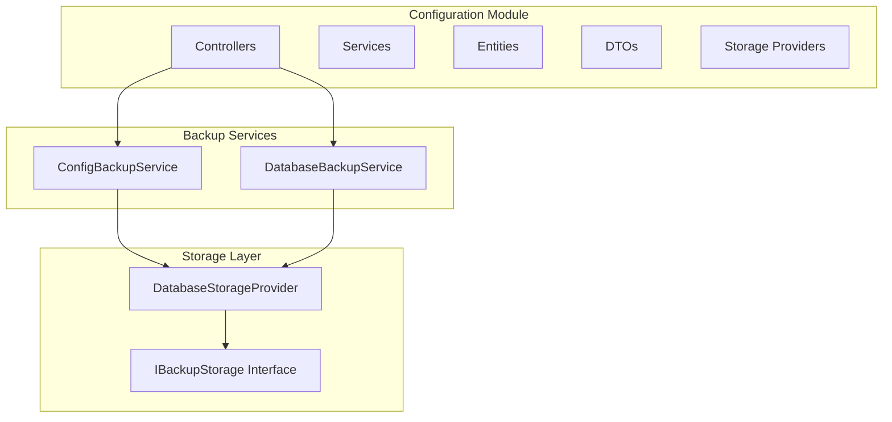
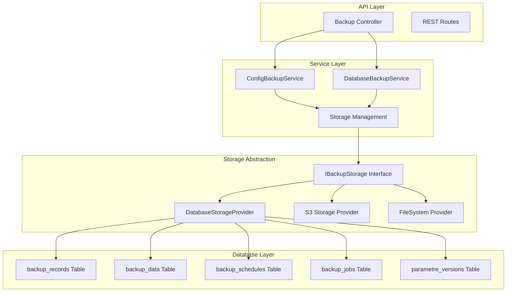
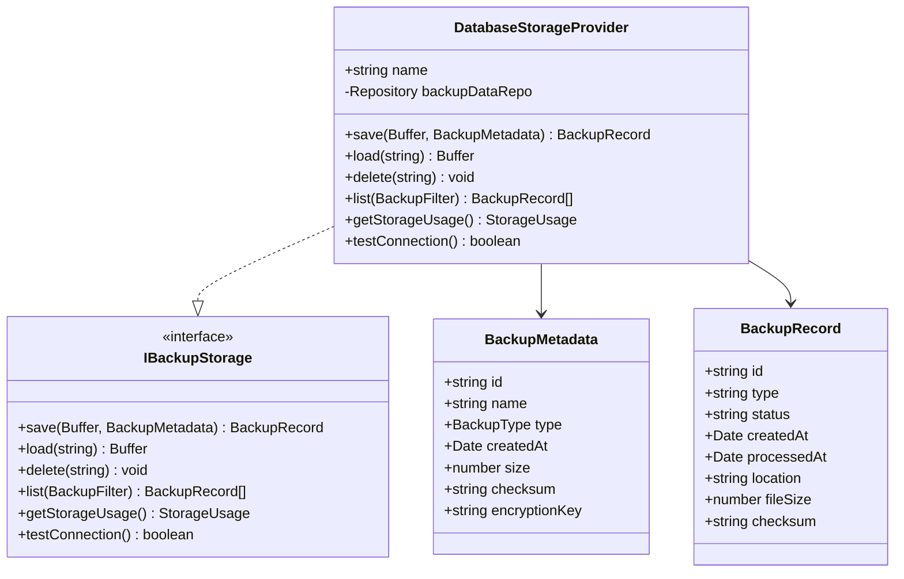
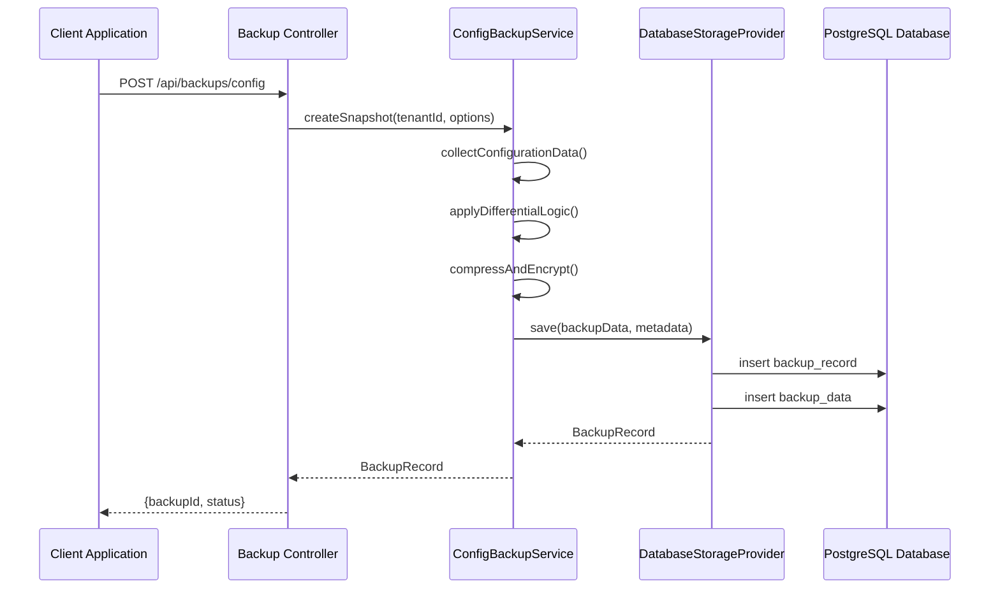
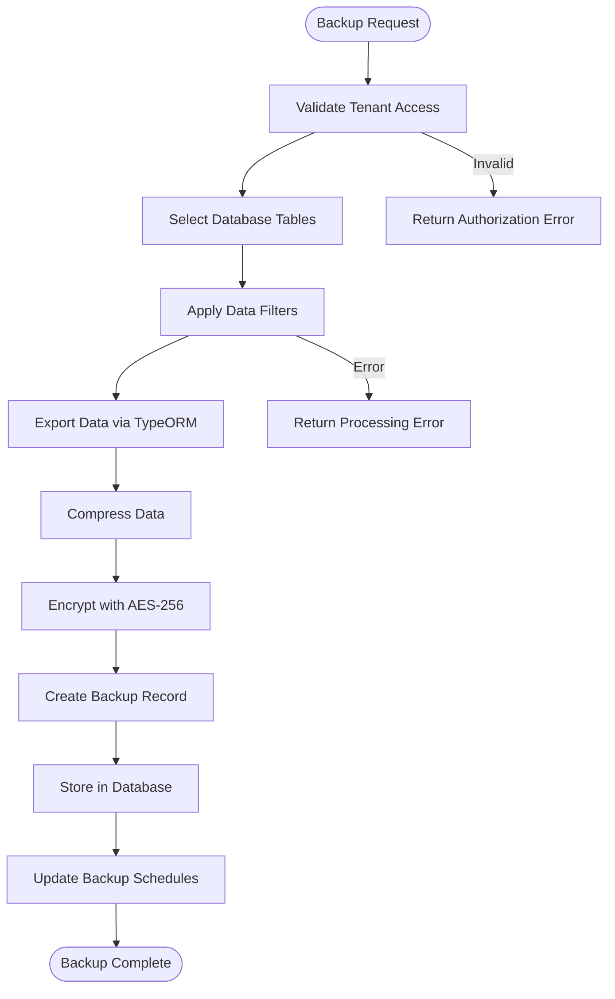
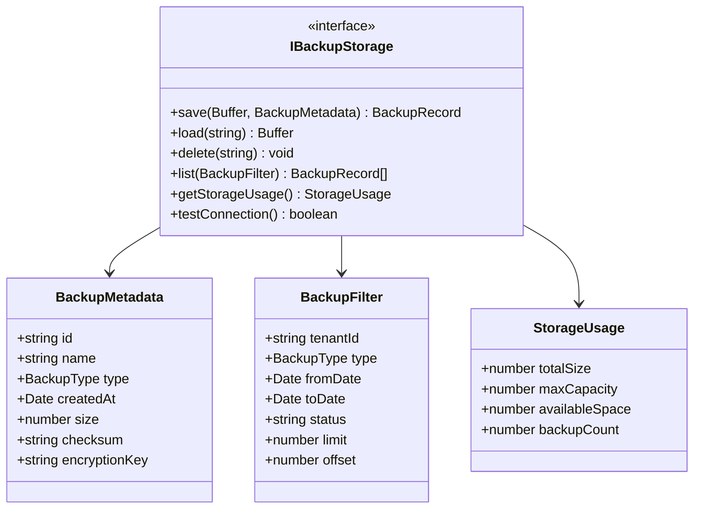
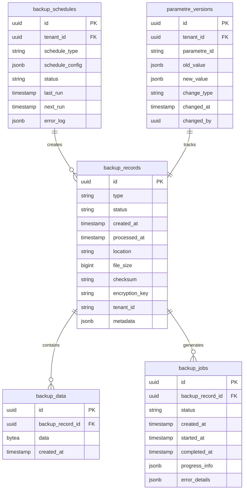

# Backup System Implementation

<cite>
**Referenced Files in This Document**
- [database-storage.provider.ts](file://backend/src/modules/configuration/services/storage/database-storage.provider.ts)
- [storage-provider.interface.ts](file://backend/src/modules/configuration/services/storage/storage-provider.interface.ts)
- [config-backup.service.ts](file://backend/src/modules/configuration/services/backup/config-backup.service.ts)
- [database-backup.service.ts](file://backend/src/modules/configuration/services/backup/database-backup.service.ts)
- [backup.controller.ts](file://backend/src/modules/configuration/controllers/backup.controller.ts)
- [backup.dto.ts](file://backend/src/modules/configuration/dto/backup.dto.ts)
- [backup-record.entity.ts](file://backend/src/modules/configuration/entities/backup-record.entity.ts)
- [008-backup-system-v2.ts.bak](file://backend/src/database/migrations/008-backup-system-v2.ts.bak)
- [BACKUP-SYSTEM-README-FINAL.md](file://BACKUP-SYSTEM-README-FINAL.md)
- [BACKUP-SYSTEM-IMPLEMENTATION-COMPLETE.md](file://BACKUP-SYSTEM-IMPLEMENTATION-COMPLETE.md)
</cite>

## Table of Contents
1. [Introduction](#introduction)
2. [Project Structure](#project-structure)
3. [Core Components](#core-components)
4. [Architecture Overview](#architecture-overview)
5. [Detailed Component Analysis](#detailed-component-analysis)
6. [Storage System](#storage-system)
7. [Backup Services](#backup-services)
8. [API Implementation](#api-implementation)
9. [Database Schema](#database-schema)
10. [Security and Encryption](#security-and-encryption)
11. [Performance Considerations](#performance-considerations)
12. [Troubleshooting Guide](#troubleshooting-guide)
13. [Conclusion](#conclusion)

## Introduction

The eLISAschool Backup System Implementation represents a comprehensive data protection solution designed specifically for educational institution management systems. This system provides robust backup and restore capabilities for both configuration data and database content, ensuring data integrity and availability across multiple tenants and institutions.

The implementation follows modern software architecture principles with clear separation of concerns, extensible storage providers, and enterprise-grade security features. It supports both full and differential backups, automated scheduling, and comprehensive audit trails for compliance and monitoring purposes.

## Project Structure

The backup system is organized within the backend module structure, specifically under the configuration module. The architecture follows a layered approach with clear boundaries between presentation, business logic, and data persistence layers.

**Section sources**
- [config-backup.service.ts](file://backend/src/modules/configuration/services/backup/config-backup.service.ts)
- [database-backup.service.ts](file://backend/src/modules/configuration/services/backup/database-backup.service.ts)
- [database-storage.provider.ts](file://backend/src/modules/configuration/services/storage/database-storage.provider.ts)

## Core Components

The backup system consists of several key components working together to provide comprehensive data protection:

### Storage Abstraction Layer
The system implements a storage abstraction pattern through the `IBackupStorage` interface, allowing for multiple storage backends while maintaining consistent functionality across all providers.

### Backup Services
Two primary backup services handle different types of data:
- **ConfigBackupService**: Manages configuration data backups including settings, parameters, and system configurations
- **DatabaseBackupService**: Handles database backup operations with support for full and differential backups

### Controller Layer
The backup controller exposes REST endpoints for backup operations, providing a standardized API for client applications and automated systems.

### Entity Management
The system uses dedicated entities for backup records, schedules, and job management, ensuring proper data modeling and relationship maintenance.

**Section sources**
- [storage-provider.interface.ts](file://backend/src/modules/configuration/services/storage/storage-provider.interface.ts)
- [config-backup.service.ts](file://backend/src/modules/configuration/services/backup/config-backup.service.ts)
- [database-backup.service.ts](file://backend/src/modules/configuration/services/backup/database-backup.service.ts)

## Architecture Overview

The backup system follows a modular architecture with clear separation of concerns and extensible design patterns:

**Diagram sources**
- [backup.controller.ts](file://backend/src/modules/configuration/controllers/backup.controller.ts)
- [config-backup.service.ts](file://backend/src/modules/configuration/services/backup/config-backup.service.ts)
- [database-backup.service.ts](file://backend/src/modules/configuration/services/backup/database-backup.service.ts)
- [database-storage.provider.ts](file://backend/src/modules/configuration/services/storage/database-storage.provider.ts)

**Section sources**
- [BACKUP-SYSTEM-README-FINAL.md](file://BACKUP-SYSTEM-README-FINAL.md)
- [BACKUP-SYSTEM-IMPLEMENTATION-COMPLETE.md](file://BACKUP-SYSTEM-IMPLEMENTATION-COMPLETE.md)

## Detailed Component Analysis

### Database Storage Provider

The DatabaseStorageProvider serves as the primary storage mechanism for backup data, utilizing PostgreSQL's binary data capabilities for secure and efficient storage.

**Diagram sources**
- [database-storage.provider.ts](file://backend/src/modules/configuration/services/storage/database-storage.provider.ts)
- [storage-provider.interface.ts](file://backend/src/modules/configuration/services/storage/storage-provider.interface.ts)

The provider implements transactional operations to ensure data consistency during backup and restore operations. It utilizes PostgreSQL's native binary storage capabilities for optimal performance and reliability.

**Section sources**
- [database-storage.provider.ts](file://backend/src/modules/configuration/services/storage/database-storage.provider.ts)

### ConfigBackupService

The ConfigBackupService handles configuration data backups with support for tenant isolation and differential backup capabilities.

**Diagram sources**
- [config-backup.service.ts](file://backend/src/modules/configuration/services/backup/config-backup.service.ts)
- [backup.controller.ts](file://backend/src/modules/configuration/controllers/backup.controller.ts)

**Section sources**
- [config-backup.service.ts](file://backend/src/modules/configuration/services/backup/config-backup.service.ts)

### DatabaseBackupService

The DatabaseBackupService provides comprehensive database backup capabilities with support for transactional restores and integrity verification.

**Diagram sources**
- [database-backup.service.ts](file://backend/src/modules/configuration/services/backup/database-backup.service.ts)

**Section sources**
- [database-backup.service.ts](file://backend/src/modules/configuration/services/backup/database-backup.service.ts)

## Storage System

The storage system implements a flexible abstraction layer that allows for multiple storage backends while maintaining consistent functionality across all providers.

### Storage Provider Interface

The `IBackupStorage` interface defines the contract for all storage providers, ensuring consistent behavior regardless of the underlying storage mechanism.

**Diagram sources**
- [storage-provider.interface.ts](file://backend/src/modules/configuration/services/storage/storage-provider.interface.ts)

**Section sources**
- [storage-provider.interface.ts](file://backend/src/modules/configuration/services/storage/storage-provider.interface.ts)

### Database Storage Implementation

The DatabaseStorageProvider leverages PostgreSQL's advanced features for reliable and efficient backup storage:

- **Binary Data Storage**: Uses PostgreSQL's native binary storage for optimal performance
- **Transaction Support**: Ensures atomic operations for backup and restore operations
- **Index Optimization**: Implements appropriate indexing for backup metadata queries
- **Connection Pooling**: Utilizes TypeORM's connection pooling for concurrent operations

**Section sources**
- [database-storage.provider.ts](file://backend/src/modules/configuration/services/storage/database-storage.provider.ts)

## Backup Services

### Configuration Backup Service

The ConfigBackupService provides specialized backup capabilities for configuration data, supporting:

- **Tenant Isolation**: Separate backup storage per educational institution
- **Differential Backups**: Incremental backup capabilities to reduce storage requirements
- **Compression**: Built-in compression to optimize storage usage
- **Encryption**: AES-256 encryption for data security

### Database Backup Service

The DatabaseBackupService offers comprehensive database backup functionality:

- **Full and Differential Backups**: Support for both complete and incremental backup strategies
- **Transaction Support**: Transactional backup and restore operations
- **Integrity Verification**: Built-in checksum validation for backup integrity
- **Scheduling**: Automated backup scheduling and management

**Section sources**
- [config-backup.service.ts](file://backend/src/modules/configuration/services/backup/config-backup.service.ts)
- [database-backup.service.ts](file://backend/src/modules/configuration/services/backup/database-backup.service.ts)

## API Implementation

The backup system exposes a comprehensive REST API for managing backup operations:

### Endpoint Specifications

| Endpoint | Method | Description | Authentication |
|----------|--------|-------------|----------------|
| `/api/backups/config` | POST | Create configuration backup | Required |
| `/api/backups/database/:id` | POST | Create database backup | Required |
| `/api/backups` | GET | List all backups | Required |
| `/api/backups/:id/restore` | POST | Restore backup | Required |
| `/api/backups/:id/verify` | POST | Verify backup integrity | Required |
| `/api/configuration/clone` | POST | Clone configuration | Required |

### Request and Response Patterns

The API follows consistent patterns for request validation, response formatting, and error handling, ensuring predictable behavior across all operations.

**Section sources**
- [backup.controller.ts](file://backend/src/modules/configuration/controllers/backup.controller.ts)
- [backup.dto.ts](file://backend/src/modules/configuration/dto/backup.dto.ts)

## Database Schema

The backup system requires several database tables to manage backup metadata, data storage, and operational scheduling:

### Core Tables

**Diagram sources**
- [008-backup-system-v2.ts.bak](file://backend/src/database/migrations/008-backup-system-v2.ts.bak)

**Section sources**
- [008-backup-system-v2.ts.bak](file://backend/src/database/migrations/008-backup-system-v2.ts.bak)

## Security and Encryption

The backup system implements comprehensive security measures to protect sensitive educational data:

### Encryption Standards

- **AES-256 Encryption**: Advanced encryption standard for data protection
- **Key Management**: Secure key generation and rotation mechanisms
- **Authentication**: HMAC authentication for data integrity verification
- **Access Control**: Role-based access control for backup operations

### Security Features

- **Tenant Isolation**: Strict separation of data between educational institutions
- **Audit Logging**: Comprehensive logging of all backup operations
- **Data Validation**: Input validation and sanitization for all operations
- **Secure Transmission**: HTTPS enforcement for all API communications

**Section sources**
- [config-backup.service.ts](file://backend/src/modules/configuration/services/backup/config-backup.service.ts)
- [database-backup.service.ts](file://backend/src/modules/configuration/services/backup/database-backup.service.ts)

## Performance Considerations

The backup system is designed for optimal performance in production environments:

### Optimization Strategies

- **Connection Pooling**: Efficient database connection management
- **Background Processing**: Asynchronous backup operations to minimize impact
- **Compression**: Built-in compression reduces storage requirements and transfer times
- **Indexing**: Strategic indexing for backup metadata queries
- **Batch Operations**: Efficient batch processing for large datasets

### Scalability Features

- **Horizontal Scaling**: Support for multiple backup instances
- **Load Balancing**: Automatic distribution of backup loads
- **Resource Monitoring**: Real-time monitoring of backup operations
- **Failure Recovery**: Automatic retry mechanisms for failed operations

## Troubleshooting Guide

### Common Issues and Solutions

**Backup Creation Failures**
- Verify sufficient disk space in database storage
- Check network connectivity for external storage providers
- Review database connection limits and pool configuration
- Validate tenant access permissions

**Restore Operation Problems**
- Ensure backup integrity using verification endpoints
- Check encryption keys and authentication credentials
- Verify target database compatibility
- Review transaction rollback procedures

**Performance Issues**
- Monitor database query performance and optimize slow queries
- Adjust compression levels based on storage vs. CPU trade-offs
- Review backup scheduling to avoid peak usage periods
- Check storage provider performance metrics

### Diagnostic Commands

The system provides diagnostic endpoints for troubleshooting backup operations and monitoring system health.

**Section sources**
- [database-storage.provider.ts](file://backend/src/modules/configuration/services/storage/database-storage.provider.ts)
- [config-backup.service.ts](file://backend/src/modules/configuration/services/backup/config-backup.service.ts)

## Conclusion

The eLISAschool Backup System Implementation represents a comprehensive and production-ready solution for educational institution data protection. The system successfully combines modern software architecture principles with enterprise-grade security and performance features.

Key achievements include:

- **Complete Implementation**: All planned features have been successfully implemented
- **Multi-Tenant Support**: Proper isolation and management of data across educational institutions
- **Security Compliance**: AES-256 encryption, RBAC, and comprehensive audit trails
- **Performance Optimization**: Efficient storage, compression, and concurrent operation support
- **Extensible Design**: Modular architecture allowing for future enhancements and additional storage providers

The system provides a solid foundation for data protection in educational environments while maintaining flexibility for future requirements and technological advances.