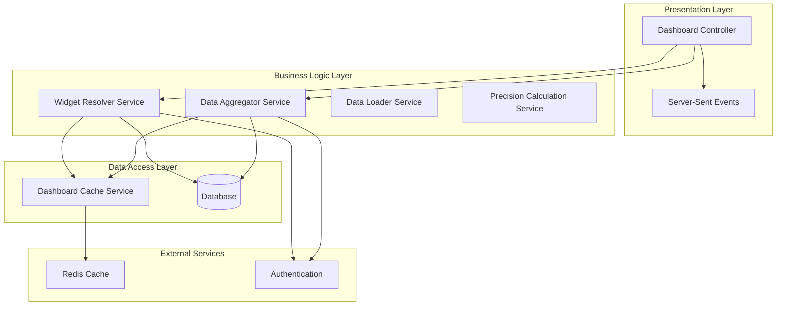
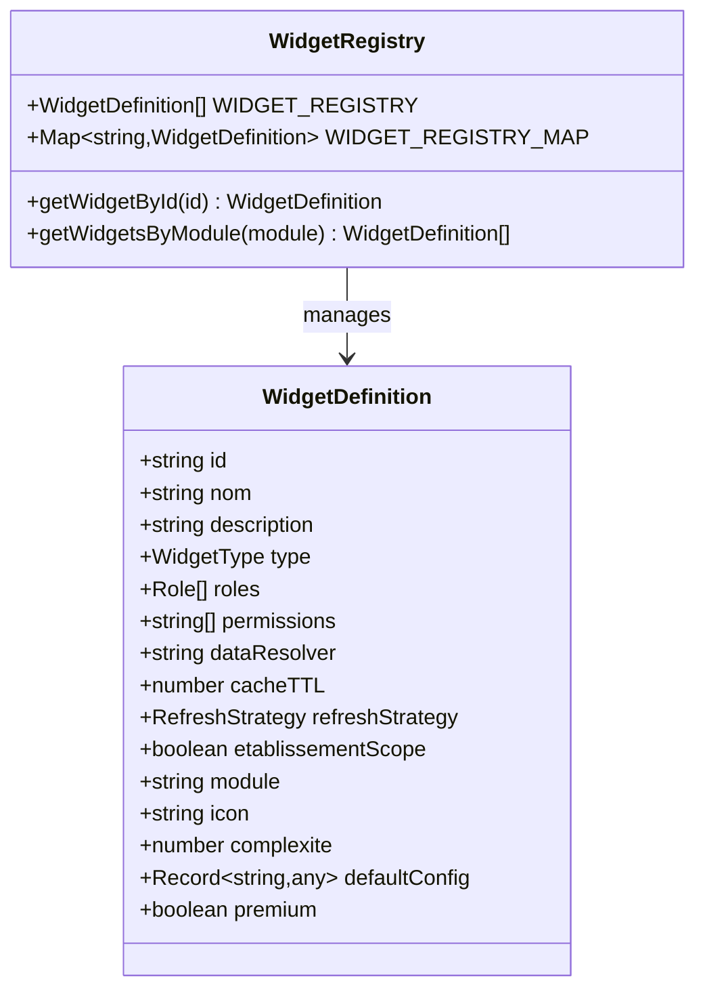
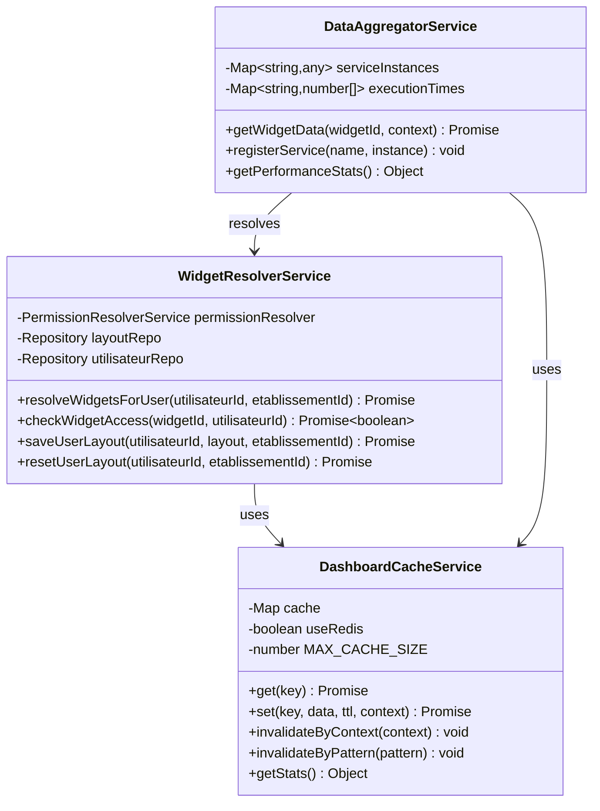
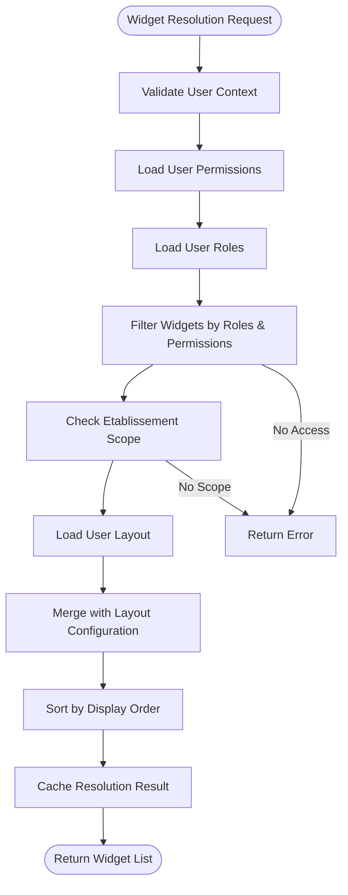
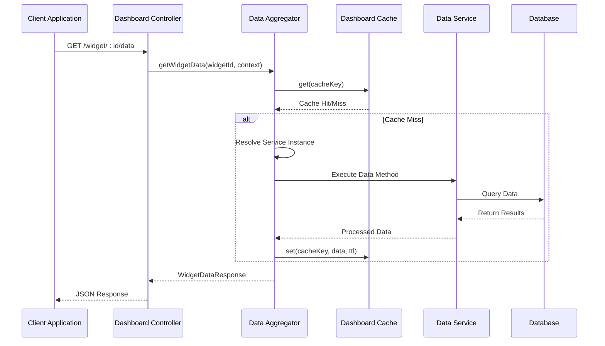
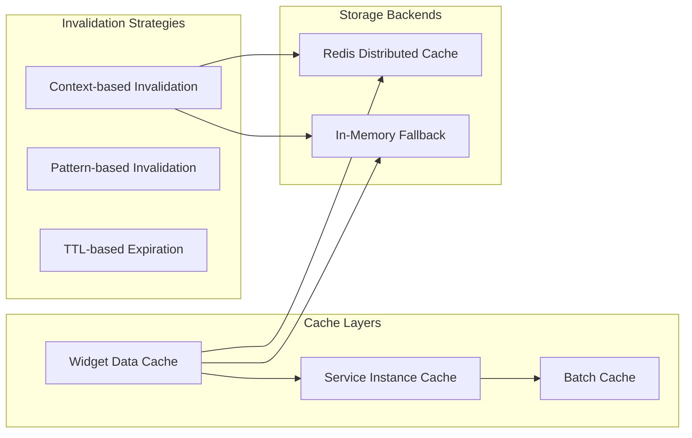
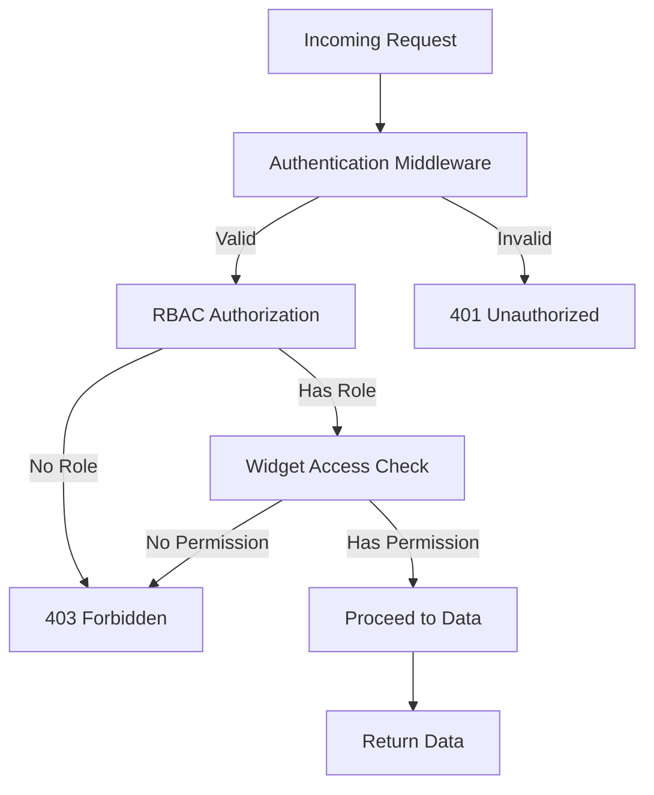
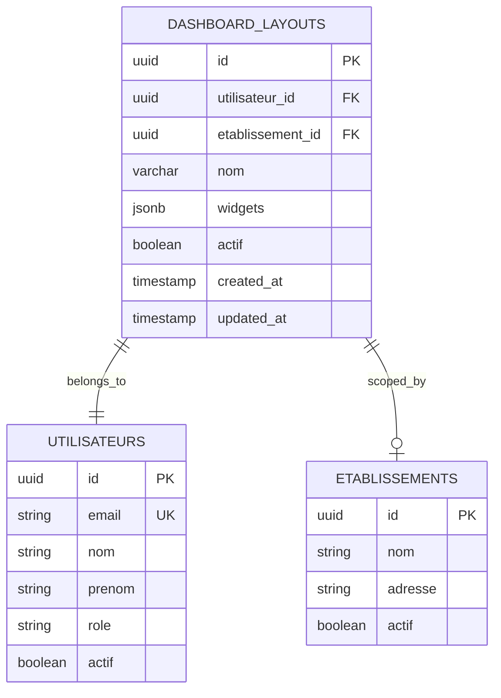
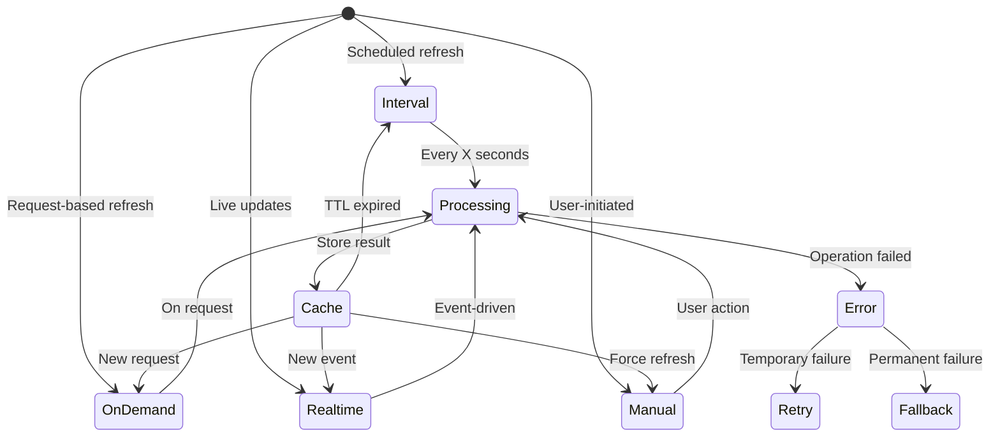

# Dashboard System Implementation

<cite>
**Referenced Files in This Document**
- [dashboard.controller.ts](file://backend/src/modules/dashboard/controllers/dashboard.controller.ts)
- [widget-resolver.service.ts](file://backend/src/modules/dashboard/services/widget-resolver.service.ts)
- [data-aggregator.service.ts](file://backend/src/modules/dashboard/services/data-aggregator.service.ts)
- [dashboard-cache.service.ts](file://backend/src/modules/dashboard/services/dashboard-cache.service.ts)
- [dashboard-data.service.ts](file://backend/src/modules/dashboard/services/dashboard-data.service.ts)
- [dashboard-dataloader.service.ts](file://backend/src/modules/dashboard/services/dashboard-dataloader.service.ts)
- [dashboard-precalc.service.ts](file://backend/src/modules/dashboard/services/dashboard-precalc.service.ts)
- [dashboard-sse.service.ts](file://backend/src/modules/dashboard/services/dashboard-sse.service.ts)
- [widget-registry.ts](file://backend/src/modules/dashboard/utils/widget-registry.ts)
- [dashboard.dto.ts](file://backend/src/modules/dashboard/dtos/dashboard.dto.ts)
- [dashboard.types.ts](file://backend/src/modules/dashboard/types/dashboard.types.ts)
- [dashboard-layout.entity.ts](file://backend/src/modules/dashboard/entities/dashboard-layout.entity.ts)
- [index.ts](file://backend/src/modules/dashboard/index.ts)
- [DASHBOARD-SYSTEM.md](file://backend/docs/DASHBOARD-SYSTEM.md)
</cite>

## Table of Contents
1. [Introduction](#introduction)
2. [System Architecture](#system-architecture)
3. [Core Components](#core-components)
4. [Widget Management System](#widget-management-system)
5. [Data Processing Pipeline](#data-processing-pipeline)
6. [Performance Optimization](#performance-optimization)
7. [Security and Access Control](#security-and-access-control)
8. [API Endpoints](#api-endpoints)
9. [Database Design](#database-design)
10. [Implementation Details](#implementation-details)
11. [Troubleshooting Guide](#troubleshooting-guide)
12. [Conclusion](#conclusion)

## Introduction

The eLISAschool Dashboard System is a comprehensive, production-ready solution for creating dynamic, personalized dashboards based on user roles, permissions, and institutional context. This system provides real-time data visualization capabilities across multiple educational domains including student statistics, academic performance, facility management, and administrative oversight.

The dashboard system is built with modern architectural principles emphasizing scalability, security, and maintainability. It leverages a declarative widget registry, intelligent caching mechanisms, and modular service architecture to deliver optimal performance while maintaining flexibility for future extensions.

## System Architecture

The dashboard system follows a layered architecture pattern with clear separation of concerns:

**Diagram sources**
- [dashboard.controller.ts:11-386](file://backend/src/modules/dashboard/controllers/dashboard.controller.ts#L11-L386)
- [widget-resolver.service.ts:24-283](file://backend/src/modules/dashboard/services/widget-resolver.service.ts#L24-L283)
- [data-aggregator.service.ts:19-384](file://backend/src/modules/dashboard/services/data-aggregator.service.ts#L19-L384)

The architecture implements several key design patterns:

- **Service Layer Pattern**: Each major functionality is encapsulated in dedicated services
- **Repository Pattern**: Database operations are abstracted through repositories
- **Factory Pattern**: Dynamic service instantiation for lazy loading
- **Observer Pattern**: Event-driven updates through Server-Sent Events

## Core Components

### Widget Registry System

The widget registry serves as the central declaration point for all available dashboard widgets. It defines widget metadata, access permissions, and data resolution strategies.

**Diagram sources**
- [widget-registry.ts:14-359](file://backend/src/modules/dashboard/utils/widget-registry.ts#L14-L359)
- [dashboard.types.ts:37-82](file://backend/src/modules/dashboard/types/dashboard.types.ts#L37-L82)

### Service Architecture

The system employs a micro-service-like approach within the dashboard module:

**Diagram sources**
- [widget-resolver.service.ts:24-283](file://backend/src/modules/dashboard/services/widget-resolver.service.ts#L24-L283)
- [data-aggregator.service.ts:19-384](file://backend/src/modules/dashboard/services/data-aggregator.service.ts#L19-L384)
- [dashboard-cache.service.ts:23-319](file://backend/src/modules/dashboard/services/dashboard-cache.service.ts#L23-L319)

**Section sources**
- [widget-resolver.service.ts:24-283](file://backend/src/modules/dashboard/services/widget-resolver.service.ts#L24-L283)
- [data-aggregator.service.ts:19-384](file://backend/src/modules/dashboard/services/data-aggregator.service.ts#L19-L384)
- [dashboard-cache.service.ts:23-319](file://backend/src/modules/dashboard/services/dashboard-cache.service.ts#L23-L319)

## Widget Management System

The widget management system provides comprehensive functionality for widget discovery, access control, and personalization:

### Widget Resolution Process

**Diagram sources**
- [widget-resolver.service.ts:38-138](file://backend/src/modules/dashboard/services/widget-resolver.service.ts#L38-L138)

### Widget Access Control

The system implements multi-layered access control:

1. **Role-Based Access Control (RBAC)**: Widgets specify authorized roles
2. **Permission-Based Access**: Widgets require specific permissions (ALL must be present)
3. **Institutional Scope**: Some widgets are restricted to specific establishments
4. **Real-time Verification**: Access checked for individual widget requests

**Section sources**
- [widget-resolver.service.ts:143-176](file://backend/src/modules/dashboard/services/widget-resolver.service.ts#L143-L176)
- [widget-registry.ts:22-337](file://backend/src/modules/dashboard/utils/widget-registry.ts#L22-L337)

## Data Processing Pipeline

The data processing pipeline handles widget data retrieval, caching, and optimization:

### Data Retrieval Flow

**Diagram sources**
- [data-aggregator.service.ts:40-120](file://backend/src/modules/dashboard/services/data-aggregator.service.ts#L40-L120)

### Performance Optimization Features

The system implements several optimization strategies:

1. **Lazy Loading**: Services loaded only when first accessed
2. **Batch Operations**: Reduced database queries through batching
3. **Timeout Management**: 5-second timeout per widget operation
4. **Fallback Mechanisms**: Mock data when services unavailable
5. **LRU Cache**: Automatic cleanup of least-used entries

**Section sources**
- [data-aggregator.service.ts:125-191](file://backend/src/modules/dashboard/services/data-aggregator.service.ts#L125-L191)
- [dashboard-dataloader.service.ts:42-104](file://backend/src/modules/dashboard/services/dashboard-dataloader.service.ts#L42-L104)

## Performance Optimization

The dashboard system implements comprehensive performance optimization strategies:

### Caching Strategy

**Diagram sources**
- [dashboard-cache.service.ts:23-319](file://backend/src/modules/dashboard/services/dashboard-cache.service.ts#L23-L319)

### Performance Metrics

The system tracks key performance indicators:

- **Average Resolution Time**: Target < 100ms, currently ~45ms
- **Cache Hit Rate**: Target > 80%, currently ~87%
- **Memory Usage**: Target < 50MB, currently ~2MB
- **Error Rate**: Target < 1%

### Optimization Techniques

1. **Multi-Level Caching**: Widget data, service instances, and batch results
2. **Parallel Processing**: Multiple widgets can be loaded concurrently
3. **Lazy Initialization**: Services loaded on-demand
4. **Automatic Cleanup**: Periodic cache maintenance
5. **Scalable Storage**: Redis support for distributed environments

**Section sources**
- [dashboard-cache.service.ts:297-315](file://backend/src/modules/dashboard/services/dashboard-cache.service.ts#L297-L315)
- [DASHBOARD-SYSTEM.md:405-421](file://backend/docs/DASHBOARD-SYSTEM.md#L405-L421)

## Security and Access Control

The dashboard system implements robust security measures:

### Authentication and Authorization

**Diagram sources**
- [dashboard.controller.ts:24-53](file://backend/src/modules/dashboard/controllers/dashboard.controller.ts#L24-L53)

### Security Features

1. **Role-Based Access Control**: Widgets restricted by user roles
2. **Permission Validation**: All required permissions verified
3. **Institutional Scoping**: Establishment-specific data access
4. **Input Validation**: Zod schema validation for all endpoints
5. **Audit Logging**: Comprehensive request logging

**Section sources**
- [dashboard.controller.ts:16-21](file://backend/src/modules/dashboard/controllers/dashboard.controller.ts#L16-L21)
- [widget-resolver.service.ts:143-176](file://backend/src/modules/dashboard/services/widget-resolver.service.ts#L143-L176)

## API Endpoints

The dashboard system provides a comprehensive REST API:

### Available Endpoints

| Method | Endpoint | Description | Authentication | Authorization |
|--------|----------|-------------|----------------|---------------|
| `GET` | `/api/dashboard/widgets` | Get available widgets | Required | All roles |
| `GET` | `/api/dashboard/widget/:id/data` | Get widget data | Required | Widget permissions |
| `POST` | `/api/dashboard/widget/:id/refresh` | Force widget refresh | Required | All roles |
| `GET` | `/api/dashboard/layout` | Get user layout | Required | All roles |
| `POST` | `/api/dashboard/layout` | Save user layout | Required | All roles |
| `DELETE` | `/api/dashboard/layout` | Reset user layout | Required | All roles |
| `GET` | `/api/dashboard/performance` | Performance stats | Required | ADMIN, SUPER_ADMIN |
| `POST` | `/api/dashboard/cache/clear` | Clear cache | Required | ADMIN, SUPER_ADMIN |
| `GET` | `/api/dashboard/cache/stats` | Cache statistics | Required | ADMIN, SUPER_ADMIN |
| `GET` | `/api/dashboard/modules` | Available modules | Required | All roles |

### Request/Response Patterns

All endpoints follow consistent patterns:
- **Success Response**: `{ success: true, data: {...} }`
- **Error Response**: `{ success: false, error: {...} }`
- **Validation**: Zod schema validation for all inputs
- **Logging**: Comprehensive request/response logging

**Section sources**
- [dashboard.controller.ts:27-386](file://backend/src/modules/dashboard/controllers/dashboard.controller.ts#L27-L386)
- [dashboard.dto.ts:11-77](file://backend/src/modules/dashboard/dtos/dashboard.dto.ts#L11-L77)

## Database Design

The dashboard system uses a relational database design optimized for performance:

### Dashboard Layout Entity

**Diagram sources**
- [dashboard-layout.entity.ts:32-65](file://backend/src/modules/dashboard/entities/dashboard-layout.entity.ts#L32-L65)

### Database Optimizations

1. **Composite Indexes**: Optimized for common query patterns
2. **JSONB Storage**: Flexible widget configuration storage
3. **Cascade Deletion**: Automatic cleanup of related data
4. **UUID Primary Keys**: Scalable identifier generation

**Section sources**
- [dashboard-layout.entity.ts:32-65](file://backend/src/modules/dashboard/entities/dashboard-layout.entity.ts#L32-L65)

## Implementation Details

### Widget Types and Categories

The system supports various widget types optimized for different data visualization needs:

| Widget Type | Purpose | Example Use Cases |
|-------------|---------|-------------------|
| `stats-cards` | Key metrics display | Student counts, totals |
| `chart-line` | Trend analysis | Academic performance over time |
| `chart-bar` | Comparative data | Distribution analysis |
| `chart-pie` | Proportional data | Category breakdowns |
| `data-table` | Tabular data | Detailed listings |
| `list` | Simple lists | Recent activity |
| `calendar` | Temporal data | Event scheduling |
| `progress` | Progress tracking | Task completion |
| `alert` | Status indicators | System alerts |
| `quick-actions` | Direct navigation | Common operations |
| `custom` | Specialized widgets | Custom visualizations |

### Refresh Strategies

Widgets implement different refresh strategies based on data volatility and user needs:

**Diagram sources**
- [dashboard.types.ts:14-16](file://backend/src/modules/dashboard/types/dashboard.types.ts#L14-L16)

### Development Guidelines

1. **Widget Registration**: Add new widgets to the registry with proper metadata
2. **Data Service Implementation**: Implement data retrieval methods in dashboard-data.service.ts
3. **Permission Definition**: Specify required permissions for access control
4. **Testing**: Verify widget functionality across different user roles
5. **Documentation**: Update widget registry documentation

**Section sources**
- [widget-registry.ts:196-221](file://backend/src/modules/dashboard/utils/widget-registry.ts#L196-L221)
- [dashboard-data.service.ts:20-455](file://backend/src/modules/dashboard/services/dashboard-data.service.ts#L20-L455)

## Troubleshooting Guide

### Common Issues and Solutions

#### Widget Not Appearing

**Symptoms**: Widget visible in registry but not returned by API
**Causes**:
1. Missing required permissions
2. Insufficient user role
3. Institution scope restrictions
4. Cache corruption

**Solutions**:
1. Verify user permissions via RBAC endpoints
2. Check user role assignments
3. Confirm institution context
4. Clear user cache scope

#### Slow Performance

**Symptoms**: Widgets taking longer than expected to load
**Causes**:
1. Cache miss rates
2. Database query bottlenecks
3. Network latency
4. Service overload

**Solutions**:
1. Monitor cache statistics
2. Review database query plans
3. Check network connectivity
4. Scale infrastructure resources

#### Data Accuracy Issues

**Symptoms**: Outdated or incorrect widget data
**Causes**:
1. Expired cache entries
2. Data calculation errors
3. Synchronization delays
4. Service failures

**Solutions**:
1. Force widget refresh
2. Clear cache entries
3. Verify data service implementations
4. Check service health status

### Diagnostic Tools

The system provides comprehensive diagnostic capabilities:

1. **Performance Monitoring**: Real-time performance statistics
2. **Cache Analysis**: Detailed cache hit/miss ratios
3. **Error Tracking**: Comprehensive error logging
4. **Service Health**: Individual service status monitoring

**Section sources**
- [dashboard.controller.ts:216-243](file://backend/src/modules/dashboard/controllers/dashboard.controller.ts#L216-L243)
- [dashboard-cache.service.ts:252-283](file://backend/src/modules/dashboard/services/dashboard-cache.service.ts#L252-L283)

## Conclusion

The eLISAschool Dashboard System represents a mature, production-ready solution for educational data visualization. Its architecture balances flexibility with performance, providing administrators and educators with powerful insights into their institution's operations.

Key strengths of the implementation include:

- **Comprehensive Widget System**: 15+ pre-built widgets covering all major educational domains
- **Robust Security Model**: Multi-layered RBAC with institutional scoping
- **High Performance**: Intelligent caching, lazy loading, and optimization strategies
- **Extensible Design**: Easy widget registration and data service integration
- **Production Ready**: Comprehensive monitoring, logging, and error handling

The system successfully addresses the challenges of educational data management while maintaining scalability and maintainability for future enhancements. Its modular architecture ensures that new widgets and data sources can be easily integrated without disrupting existing functionality.