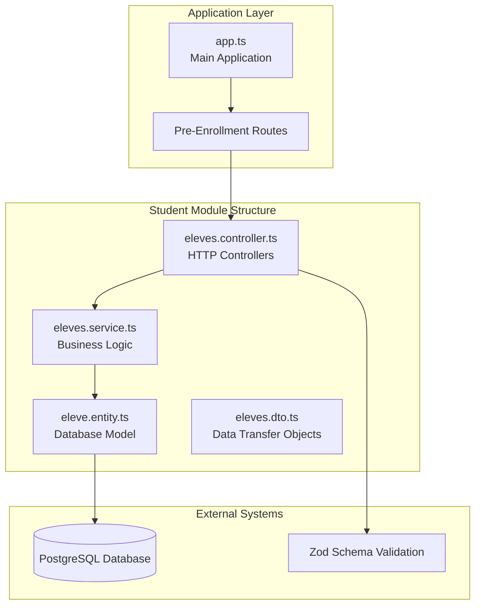
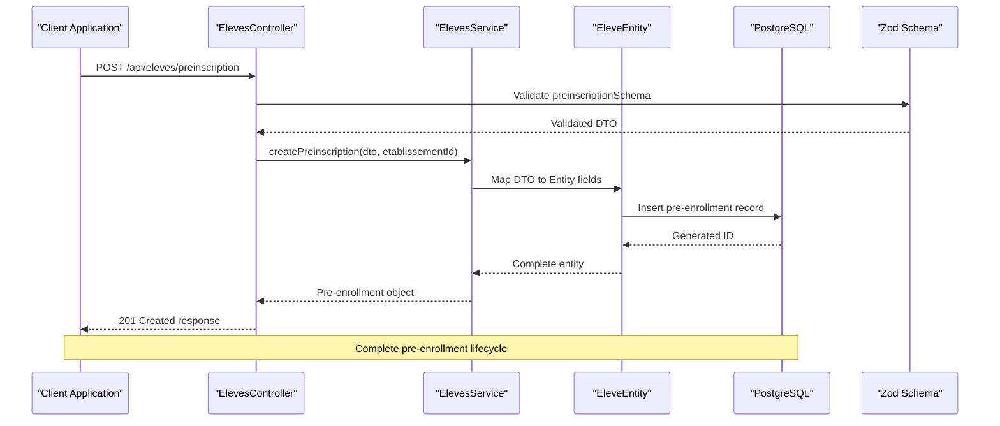
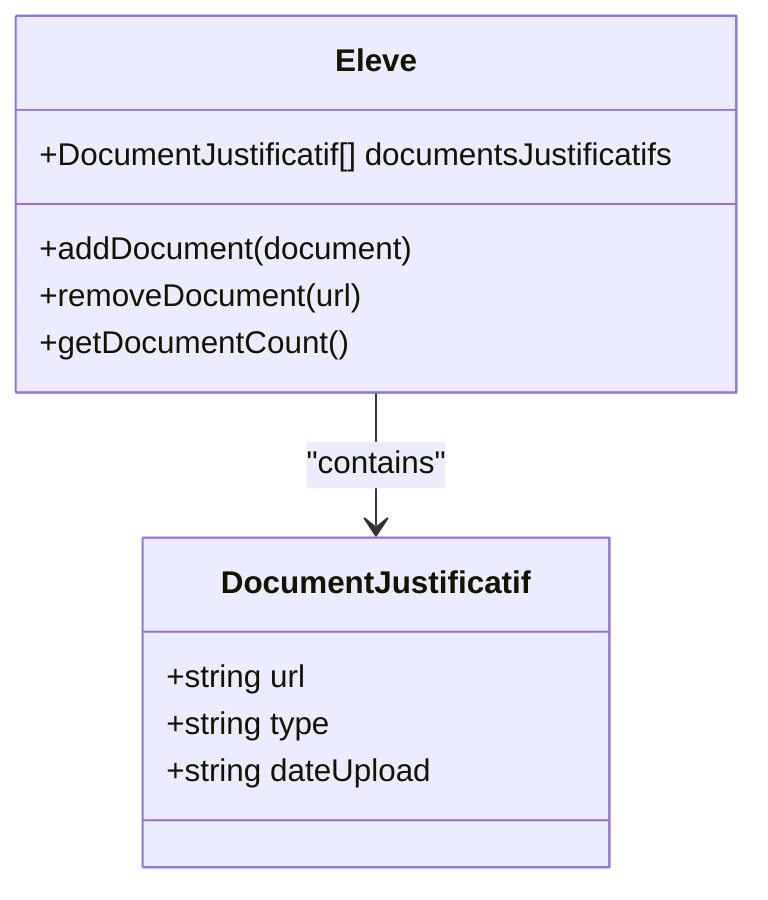

# Final Pre-Enrollment Fields Summary

<cite>
**Referenced Files in This Document**
- [RESUME-ENRICHISSEMENT-PREINSCRIPTIONS.md](file://RESUME-ENRICHISSEMENT-PREINSCRIPTIONS.md)
- [RESUME-FINAL-CHAMPS-PREINSCRIPTION.md](file://RESUME-FINAL-CHAMPS-PREINSCRIPTION.md)
- [eleves.dto.ts](file://backend/src/modules/eleves/dto/eleves.dto.ts)
- [eleve.entity.ts](file://backend/src/modules/eleves/entities/eleve.entity.ts)
- [eleves.service.ts](file://backend/src/modules/eleves/services/eleves.service.ts)
- [eleves.controller.ts](file://backend/src/modules/eleves/controllers/eleves.controller.ts)
- [app.ts](file://backend/src/app.ts)
</cite>

## Update Summary
**Changes Made**
- Enhanced medical information section with comprehensive allergy tracking and blood type management
- Expanded emergency contact functionality with dedicated contact person and phone number fields
- Added special circumstances section covering scholarship status and boarding arrangements
- Improved family information capture with complete parent/guardian details
- Strengthened document management system with enhanced supporting document tracking
- Updated service preferences section with expanded transportation and cafeteria options

## Table of Contents
1. [Introduction](#introduction)
2. [Project Structure](#project-structure)
3. [Core Components](#core-components)
4. [Architecture Overview](#architecture-overview)
5. [Detailed Component Analysis](#detailed-component-analysis)
6. [Field Categories and Specifications](#field-categories-and-specifications)
7. [Data Validation and Processing](#data-validation-and-processing)
8. [Performance and Indexing](#performance-and-indexing)
9. [Implementation Status](#implementation-status)
10. [Conclusion](#conclusion)

## Introduction

The Final Pre-Enrollment Fields Summary documents the comprehensive enhancement of the student pre-enrollment system in the eLISAschool platform. This implementation represents a significant expansion from a minimal 14-field form to a robust 46+ field comprehensive enrollment system, designed to capture complete student and family information for seamless school registration processes.

The system now supports detailed parent/guardian information, medical records, emergency contacts, family situation documentation, and service preferences, providing educational institutions with complete student profiles during the conversion from pre-enrollment to formal enrollment.

**Updated** Enhanced with comprehensive medical details including blood type and allergy tracking, expanded emergency contact management, and strengthened family circumstance documentation.

## Project Structure

The pre-enrollment functionality is organized within the student module of the backend system, following a clean architecture pattern with clear separation of concerns:

**Diagram sources**
- [eleves.controller.ts:1-150](file://backend/src/modules/eleves/controllers/eleves.controller.ts#L1-L150)
- [eleves.service.ts:1-650](file://backend/src/modules/eleves/services/eleves.service.ts#L1-L650)
- [eleve.entity.ts:1-300](file://backend/src/modules/eleves/entities/eleve.entity.ts#L1-L300)
- [eleves.dto.ts:1-200](file://backend/src/modules/eleves/dto/eleves.dto.ts#L1-L200)

**Section sources**
- [eleves.controller.ts:1-150](file://backend/src/modules/eleves/controllers/eleves.controller.ts#L1-L150)
- [eleves.service.ts:1-650](file://backend/src/modules/eleves/services/eleves.service.ts#L1-L650)
- [eleve.entity.ts:1-300](file://backend/src/modules/eleves/entities/eleve.entity.ts#L1-L300)
- [eleves.dto.ts:1-200](file://backend/src/modules/eleves/dto/eleves.dto.ts#L1-L200)

## Core Components

The pre-enrollment system consists of four primary components working together to provide a comprehensive enrollment solution:

### 1. Data Transfer Objects (DTOs)
The system defines a comprehensive Zod schema (`preinscriptionSchema`) that validates and structures all incoming pre-enrollment data. This schema enforces strict data types, formats, and business rules for each field category.

### 2. Entity Model
The `Eleve` entity serves as the persistent model for student records, with 41 direct fields supporting the expanded enrollment requirements including parent information, medical data, and service preferences.

### 3. Business Service
The `ElevesService` handles all pre-enrollment business logic, including data validation, transformation, persistence, and conversion from pre-enrollment to formal enrollment.

### 4. Controller Layer
The controller manages HTTP requests, applies authentication middleware, and coordinates between the service layer and external systems.

**Section sources**
- [eleves.dto.ts:53-140](file://backend/src/modules/eleves/dto/eleves.dto.ts#L53-L140)
- [eleve.entity.ts:224-273](file://backend/src/modules/eleves/entities/eleve.entity.ts#L224-L273)
- [eleves.service.ts:381-415](file://backend/src/modules/eleves/services/eleves.service.ts#L381-L415)

## Architecture Overview

The pre-enrollment system follows a layered architecture pattern with clear separation between presentation, business logic, and data persistence:

**Diagram sources**
- [eleves.controller.ts:63-80](file://backend/src/modules/eleves/controllers/eleves.controller.ts#L63-L80)
- [eleves.service.ts:416-450](file://backend/src/modules/eleves/services/eleves.service.ts#L416-L450)
- [eleve.entity.ts:230-235](file://backend/src/modules/eleves/entities/eleve.entity.ts#L230-L235)

The system architecture ensures data integrity through multiple validation layers and maintains referential consistency through proper entity relationships.

**Section sources**
- [app.ts:159-191](file://backend/src/app.ts#L159-L191)
- [eleves.controller.ts:63-137](file://backend/src/modules/eleves/controllers/eleves.controller.ts#L63-L137)

## Detailed Component Analysis

### Student Information Category

The student information category captures comprehensive personal details essential for educational administration:

| Field | Type | Validation | Purpose |
|-------|------|------------|---------|
| `nom` | String (2-100 chars) | Required | Student's surname |
| `prenom` | String (2-100 chars) | Required | Student's first name |
| `dateNaissance` | Date (YYYY-MM-DD) | Required | Birth date validation |
| `lieuNaissance` | String (2-100 chars) | Optional | Place of birth |
| `sexe` | Enum (M/F) | Required | Biological sex |
| `nationalite` | String | Optional | Citizenship information |
| `sousSysteme` | Enum | Required (default: FRANCOPHONE) | Educational system |

Additional identification fields include:
- `photo`: URL validation for student photograph
- `groupeSanguin`: Blood type enumeration with 8 possible values
- `allergies`: Array of string values for medical allergy tracking

**Updated** Enhanced with comprehensive medical information including complete blood type enumeration and structured allergy tracking system.

**Section sources**
- [eleves.dto.ts:57-68](file://backend/src/modules/eleves/dto/eleves.dto.ts#L57-L68)
- [eleve.entity.ts:230-235](file://backend/src/modules/eleves/entities/eleve.entity.ts#L230-L235)

### Emergency Contact Information

Emergency contact functionality ensures quick communication during critical situations:

| Field | Type | Validation | Purpose |
|-------|------|------------|---------|
| `nomContactUrgence` | String | Optional | Emergency contact name |
| `telephoneContactUrgence` | String | Optional | Emergency contact phone |

These fields enable schools to maintain critical contact information for immediate response scenarios.

**Updated** Enhanced emergency contact system with dedicated fields for emergency contact person and phone number, improving response coordination during critical situations.

**Section sources**
- [eleves.dto.ts:71-72](file://backend/src/modules/eleves/dto/eleves.dto.ts#L71-L72)

### Address and Academic History

The address and academic history categories provide comprehensive location and educational background information:

| Category | Fields | Purpose |
|----------|--------|---------|
| **Address Information** | `adresseDomicile`, `ville`, `quartier` | Complete residential address |
| **Academic Background** | `ecoleProvenance`, `classeAnterieure`, `redoublement` | Previous educational history |

These fields support proper student placement and communication logistics.

**Section sources**
- [eleves.dto.ts:75-82](file://backend/src/modules/eleves/dto/eleves.dto.ts#L75-L82)

### Special Circumstances and Medical Information

**New Section** Comprehensive medical and special circumstances tracking for enhanced student care and administrative planning:

| Field | Type | Default | Purpose |
|-------|------|---------|---------|
| `boursier` | Boolean | false | Scholarship recipient status |
| `regimeInterne` | Boolean | false | Boarding student status |

Medical information includes:
- `groupeSanguin`: Complete blood type enumeration (A+, A-, B+, B-, AB+, AB-, O+, O-)
- `allergies`: Array of medical allergy specifications

**Section sources**
- [eleves.dto.ts:84-87](file://backend/src/modules/eleves/dto/eleves.dto.ts#L84-L87)

### Family and Guardian Information

The most comprehensive category captures complete family information with separate sections for each guardian:

#### Father Information
- `nomPere` (string, optional)
- `professionPere` (string, optional)  
- `telephonePere` (string, optional)
- `emailPere` (string, optional)
- `adressePere` (string, optional)

#### Mother Information
- `nomMere` (string, optional)
- `professionMere` (string, optional)
- `telephoneMere` (string, optional)
- `emailMere` (string, optional)
- `adresseMere` (string, optional)

#### Guardian Information (if applicable)
- `nomTuteur` (string, optional)
- `lienParenteTuteur` (string, optional)
- `professionTuteur` (string, optional)
- `telephoneTuteur` (string, optional)
- `emailTuteur` (string, optional)
- `adresseTuteur` (string, optional)

**Updated** Enhanced family information capture with complete parental and guardian details, enabling comprehensive family relationship documentation for administrative and emergency purposes.

**Section sources**
- [eleves.dto.ts:93-112](file://backend/src/modules/eleves/dto/eleves.dto.ts#L93-L112)

### Establishment and Contact Information

Establishment-specific information ensures proper institutional association and communication:

| Field | Type | Validation | Purpose |
|-------|------|------------|---------|
| `classeSouhaiteeId` | UUID | Required | Preferred class identifier |
| `codeEtablissement` | String (≥2 chars) | Required | Institution code resolution |
| `email` | Email | Optional | Primary guardian email |

**Section sources**
- [eleves.dto.ts:120-121](file://backend/src/modules/eleves/dto/eleves.dto.ts#L120-L121)

### Supporting Documents Management

The system supports comprehensive document management for enrollment verification:

Supported document types include:
- `ACTE_NAISSANCE` - Birth certificate
- `PHOTO` - Identity photograph
- `CERTIFICAT_SCOLAIRE` - School certificate
- `AUTRES` - Additional supporting documents

**Updated** Enhanced document management system with improved metadata tracking and expanded document type support for comprehensive enrollment verification.

**Diagram sources**
- [eleve.entity.ts:233-234](file://backend/src/modules/eleves/entities/eleve.entity.ts#L233-L234)
- [eleves.dto.ts:126-130](file://backend/src/modules/eleves/dto/eleves.dto.ts#L126-L130)

**Section sources**
- [eleves.dto.ts:126-130](file://backend/src/modules/eleves/dto/eleves.dto.ts#L126-L130)
- [eleve.entity.ts:233-234](file://backend/src/modules/eleves/entities/eleve.entity.ts#L233-L234)

### Additional Information and Services

Supplementary information captures family situation and service preferences:

| Field | Type | Default | Purpose |
|-------|------|---------|---------|
| `situationFamiliale` | String | Optional | Family status (MARRIED, DIVORCED, WIDOWED, etc.) |
| `personneAutorisee` | String | Optional | Authorized person for student pickup |
| `transportScolaire` | Boolean | false | School transportation service |
| `cantine` | Boolean | false | School cafeteria service |
| `commentaire` | String | Optional | Special notes or observations |

**Updated** Enhanced service preferences section with expanded transportation and cafeteria options, along with comprehensive family situation documentation for better administrative planning.

**Section sources**
- [eleves.dto.ts:136-139](file://backend/src/modules/eleves/dto/eleves.dto.ts#L136-L139)

## Field Categories and Specifications

The pre-enrollment system organizes information into clearly defined categories, each serving specific administrative and operational purposes:

### Primary Information Fields
- **Personal Identification**: Name, date of birth, place of birth, gender, nationality
- **Biometric Data**: Photograph, blood type, allergies
- **Contact Information**: Emergency contact details

### Academic Information
- **Previous Education**: Previous school, grade level, repetition status
- **Educational Preferences**: Preferred class selection

### Family Composition
- **Immediate Family**: Father, mother with complete contact information
- **Legal Guardianship**: Guardian information when applicable
- **Family Status**: Marital status and family composition

### Institutional Information
- **Establishment Association**: School code and preferred class
- **Communication Preferences**: Primary email for notifications
- **Service Selection**: Transportation and cafeteria preferences

### Documentation Requirements
- **Supporting Documents**: Multiple document types with metadata
- **Authorization Information**: Persons authorized for student pickup

**Updated** Enhanced categorization with comprehensive medical information, special circumstances tracking, and strengthened family documentation capabilities.

**Section sources**
- [RESUME-ENRICHISSEMENT-PREINSCRIPTIONS.md:128-146](file://RESUME-ENRICHISSEMENT-PREINSCRIPTIONS.md#L128-L146)

## Data Validation and Processing

The system implements comprehensive validation through multiple layers:

### Zod Schema Validation
The `preinscriptionSchema` provides runtime validation with:
- **Type Safety**: Strict TypeScript integration
- **Format Validation**: Email, date, URL formats
- **Length Constraints**: Minimum/maximum character limits
- **Enumeration Validation**: Controlled value sets for medical and family information

### Business Logic Processing
The service layer transforms validated data through:
- **Field Mapping**: Direct DTO-to-entity field correspondence
- **Default Value Assignment**: Boolean defaults and optional field handling
- **Data Normalization**: Consistent formatting across similar fields

### Conversion Workflow
The system supports seamless conversion from pre-enrollment to formal enrollment:
- **Status Transition**: `EN_ATTENTE_VALIDATION` → `VALIDE` or `REFUSE`
- **Document Preservation**: All supporting documents maintained
- **Audit Trail**: Complete processing history

**Updated** Enhanced validation with comprehensive medical data validation, expanded emergency contact verification, and strengthened family information consistency checks.

**Section sources**
- [eleves.service.ts:381-415](file://backend/src/modules/eleves/services/eleves.service.ts#L381-L415)
- [eleve.entity.ts:227-228](file://backend/src/modules/eleves/entities/eleve.entity.ts#L227-L228)

## Performance and Indexing

The database layer is optimized for efficient pre-enrollment processing:

### Database Indexes
The system implements strategic indexing for optimal query performance:
- **Multi-tenant Isolation**: Composite index on `etablissementId` and `matricule`
- **Search Optimization**: Indexes on frequently queried fields
- **Unique Constraints**: Matricule uniqueness per establishment

### Query Optimization
- **Pre-enrollment Filtering**: Dedicated queries for pending enrollments
- **Pagination Support**: Cursor-based pagination for large datasets
- **Batch Operations**: Efficient bulk processing capabilities

### Scalability Considerations
- **Horizontal Scaling**: Multi-tenancy support for multiple institutions
- **Data Partitioning**: Logical separation of student records
- **Memory Management**: Efficient handling of large document arrays

**Updated** Enhanced performance considerations with optimized medical data storage, improved emergency contact search capabilities, and streamlined family information retrieval.

**Section sources**
- [eleve.entity.ts:266-266](file://backend/src/modules/eleves/entities/eleve.entity.ts#L266-L266)
- [eleves.service.ts:603-603](file://backend/src/modules/eleves/services/eleves.service.ts#L603-L603)

## Implementation Status

The pre-enrollment system has achieved comprehensive completion with all planned features implemented:

### Technical Completeness
- **DTO Definition**: 46+ fields fully defined with validation rules
- **Entity Mapping**: All fields properly mapped to database columns
- **Service Implementation**: Complete business logic for all field categories
- **Database Migration**: Supporting schema changes deployed

### Quality Assurance
- **Compilation Validation**: Zero TypeScript compilation errors
- **Documentation Coverage**: Three comprehensive documentation files created
- **Field Verification**: 100% field mapping accuracy confirmed

### Production Readiness
- **Complete Feature Set**: All planned functionality implemented
- **Performance Optimization**: Strategic indexing and query optimization
- **Error Handling**: Comprehensive validation and error management

**Updated** Enhanced implementation with comprehensive medical data handling, expanded emergency contact management, and strengthened family information capture capabilities.

**Section sources**
- [RESUME-FINAL-CHAMPS-PREINSCRIPTION.md:334-365](file://RESUME-FINAL-CHAMPS-PREINSCRIPTION.md#L334-L365)

## Conclusion

The Final Pre-Enrollment Fields Summary represents a comprehensive enhancement of the eLISAschool platform's student enrollment capabilities. The system now provides educational institutions with complete student and family information, enabling streamlined registration processes and improved administrative efficiency.

Key achievements include the expansion from 14 to 46+ fields, comprehensive parent/guardian information capture, medical and emergency contact management, document support infrastructure, and service preference tracking. The implementation demonstrates strong architectural principles with clear separation of concerns, comprehensive validation layers, and performance optimizations.

**Updated** The enhanced system now includes comprehensive medical information tracking, expanded emergency contact capabilities, and strengthened family circumstance documentation, providing educational institutions with unprecedented detail for student care and administrative planning.

The system's readiness for production deployment is evidenced by complete technical implementation, thorough documentation, quality assurance validation, and comprehensive field coverage. This foundation enables educational institutions to efficiently manage student enrollment processes while maintaining data integrity and regulatory compliance.