# Hybrid Approach Implementation Guide

<cite>
**Referenced Files in This Document**
- [052-approche-hybride-parents.sql](file://backend/database/migrations/052-approche-hybride-parents.sql)
- [deploy-approche-hybride-parents.sh](file://scripts/deploy-approche-hybride-parents.sh)
- [migrate-parents.ts](file://backend/scripts/migrate-parents.ts)
- [IMPLEMENTATION-APPROCHE-HYBRIDE-PARENTS.md](file://IMPLEMENTATION-APPROCHE-HYBRIDE-PARENTS.md)
- [parents.service.ts](file://backend/src/modules/responsables-eleves/services/parents.service.ts)
- [portal-parent.service.ts](file://backend/src/modules/responsables-eleves/services/portal-parent.service.ts)
- [eleves.service.ts](file://backend/src/modules/eleves/services/eleves.service.ts)
- [bulletins.service.ts](file://backend/src/modules/bulletins/services/bulletins.service.ts)
- [cantine.service.ts](file://backend/src/modules/cantine/services/cantine.service.ts)
- [transport.service.ts](file://backend/src/modules/transport/services/transport.service.ts)
- [notes.service.ts](file://backend/src/modules/notes/services/notes.service.ts)
- [parent-access.guard.ts](file://backend/src/modules/responsables-eleves/middlewares/parent-access.guard.ts)
- [eleve.entity.ts](file://backend/src/modules/eleves/entities/eleve.entity.ts)
- [responsable-eleve.entity.ts](file://backend/src/modules/responsables-eleves/entities/responsable-eleve.entity.ts)
- [v_stats_migration_parents.sql](file://backend/database/migrations/v_stats_migration_parents.sql)
- [fn_eleves_a_migrer.sql](file://backend/database/migrations/fn_eleves_a_migrer.sql)
</cite>

## Update Summary
**Changes Made**
- Updated database migration section to reflect comprehensive SQL implementation
- Added new automated migration script documentation
- Enhanced deployment automation coverage
- Expanded service integration patterns with new components
- Updated monitoring and analytics with new statistical views
- Revised future roadmap with enhanced technology roadmap

## Table of Contents
1. [Introduction](#introduction)
2. [Project Overview](#project-overview)
3. [Hybrid Architecture Design](#hybrid-architecture-design)
4. [Core Implementation Components](#core-implementation-components)
5. [Migration Workflow](#migration-workflow)
6. [Service Integration Patterns](#service-integration-patterns)
7. [Fallback Mechanisms](#fallback-mechanisms)
8. [Security and Access Control](#security-and-access-control)
9. [Monitoring and Analytics](#monitoring-and-analytics)
10. [Deployment and Testing](#deployment-and-testing)
11. [Future Roadmap](#future-roadmap)

## Introduction

The Hybrid Approach Implementation represents a comprehensive solution for managing parent-student relationships in educational institutions, combining traditional direct field storage with modern account-based management. This approach enables seamless migration from legacy systems while maintaining backward compatibility and providing enhanced functionality for modern educational management platforms.

The implementation addresses the critical challenge of transitioning educational institutions from simple contact field storage (direct parent fields) to sophisticated account-based parent management while ensuring zero disruption to existing operations. This dual-path architecture supports both immediate needs and future scalability requirements.

## Project Overview

The hybrid approach introduces a sophisticated two-tier system for parent management that operates alongside existing direct field storage mechanisms. This architecture maintains complete backward compatibility while enabling advanced features such as granular permissions, multi-parent support, and comprehensive audit trails.

### Key Objectives

- **Seamless Migration**: Automatic conversion from direct field storage to account-based management
- **Backward Compatibility**: Fallback mechanisms for legacy data and operations
- **Enhanced Security**: Granular permissions and access controls for parent accounts
- **Scalability**: Support for unlimited parent relationships per student
- **Auditability**: Complete tracking of all parent-related operations

### System Architecture Overview

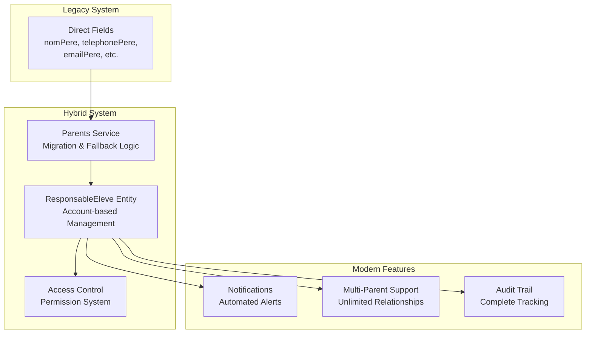

**Diagram sources**
- [IMPLEMENTATION-APPROCHE-HYBRIDE-PARENTS.md:248-292](file://IMPLEMENTATION-APPROCHE-HYBRIDE-PARENTS.md#L248-L292)
- [parents.service.ts:455-587](file://backend/src/modules/responsables-eleves/services/parents.service.ts#L455-L587)

## Hybrid Architecture Design

The hybrid architecture implements a dual-path system that maintains compatibility with existing direct field storage while introducing modern account-based management capabilities. This design ensures smooth transitions without disrupting current operations.

### Core Design Principles

1. **Parallel Data Storage**: Both direct fields and account relationships coexist during transition
2. **Intelligent Fallback**: Automatic fallback to legacy data when modern systems fail
3. **Transparent Migration**: Seamless conversion process invisible to end users
4. **Progressive Enhancement**: Modern features enhance existing functionality without replacement

### Data Flow Architecture

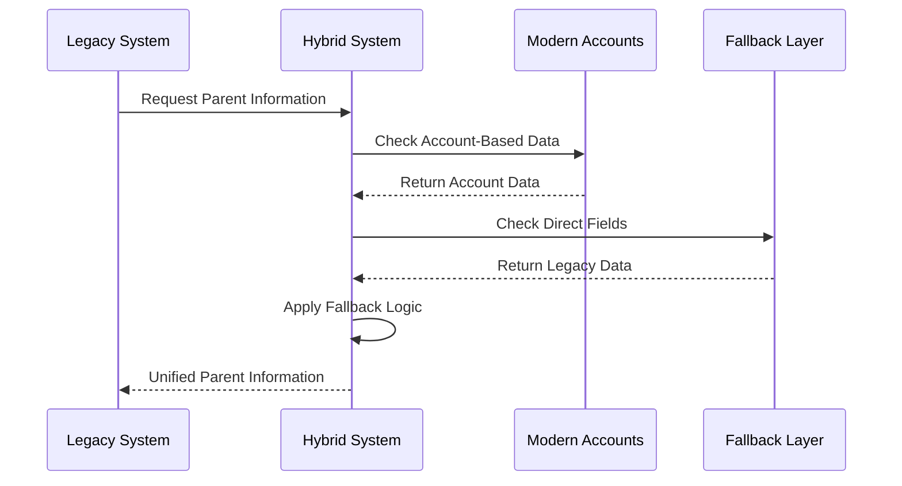

**Diagram sources**
- [IMPLEMENTATION-APPROCHE-HYBRIDE-PARENTS.md:342-358](file://IMPLEMENTATION-APPROCHE-HYBRIDE-PARENTS.md#L342-L358)
- [parents.service.ts:156-200](file://backend/src/modules/responsables-eleves/services/parents.service.ts#L156-L200)

**Section sources**
- [IMPLEMENTATION-APPROCHE-HYBRIDE-PARENTS.md:248-292](file://IMPLEMENTATION-APPROCHE-HYBRIDE-PARENTS.md#L248-L292)
- [052-approche-hybride-parents.sql:1-100](file://backend/database/migrations/052-approche-hybride-parents.sql#L1-L100)

## Core Implementation Components

The hybrid approach consists of several interconnected components that work together to provide seamless parent management functionality. Each component serves a specific purpose in the overall architecture while maintaining compatibility with existing systems.

### Database Migration Infrastructure

The implementation includes comprehensive database infrastructure supporting the hybrid approach, featuring specialized tables, views, and functions for migration tracking and statistics.

#### Migration Tables and Views

The database layer provides dedicated structures for tracking migration progress and system health:

- **Migration Statistics View**: Real-time monitoring of migration status across all students
- **Eligibility Functions**: Automated identification of students requiring migration
- **State Management**: Comprehensive tracking of migration states per student

**Section sources**
- [052-approche-hybride-parents.sql:1-100](file://backend/database/migrations/052-approche-hybride-parents.sql#L1-L100)
- [v_stats_migration_parents.sql:1-50](file://backend/database/migrations/v_stats_migration_parents.sql#L1-L50)
- [fn_eleves_a_migrer.sql:1-50](file://backend/database/migrations/fn_eleves_a_migrer.sql#L1-L50)

### Automated Migration Script

A comprehensive TypeScript script automates the entire migration process, handling complex data transformations and relationship establishment between students and parent accounts.

#### Migration Script Capabilities

- **Batch Processing**: Efficient handling of large-scale migration operations
- **Error Handling**: Robust error detection and recovery mechanisms
- **Audit Logging**: Complete tracking of all migration operations
- **Progress Monitoring**: Real-time status reporting and progress tracking

**Section sources**
- [migrate-parents.ts:1-200](file://backend/scripts/migrate-parents.ts)

### Parents Service Component

The Parents Service acts as the central orchestrator for all parent-related operations, implementing sophisticated logic for migration, fallback, and unified parent information retrieval.

#### Key Responsibilities

- **Migration Management**: Automatic conversion from direct fields to account relationships
- **Fallback Resolution**: Intelligent fallback to legacy data when modern systems fail
- **Unified Interface**: Single interface for accessing parent information regardless of storage method
- **Permission Validation**: Comprehensive access control and permission verification

#### Service Architecture

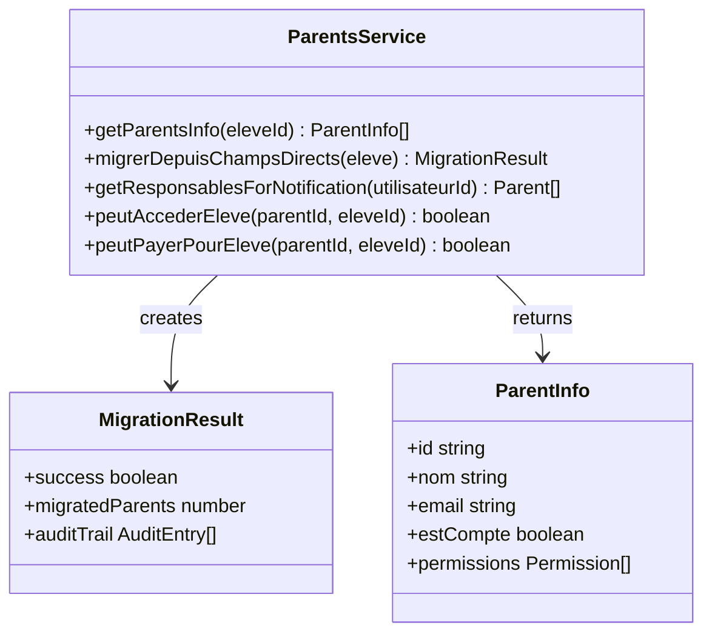

**Diagram sources**
- [parents.service.ts:156-200](file://backend/src/modules/responsables-eleves/services/parents.service.ts#L156-L200)
- [parents.service.ts:455-587](file://backend/src/modules/responsables-eleves/services/parents.service.ts#L455-L587)

**Section sources**
- [parents.service.ts:156-200](file://backend/src/modules/responsables-eleves/services/parents.service.ts#L156-L200)
- [parents.service.ts:455-587](file://backend/src/modules/responsables-eleves/services/parents.service.ts#L455-L587)

### Student Service Integration

The Student Service coordinates the conversion process from pre-registration to full enrollment, triggering automatic parent account creation and relationship establishment.

#### Conversion Workflow

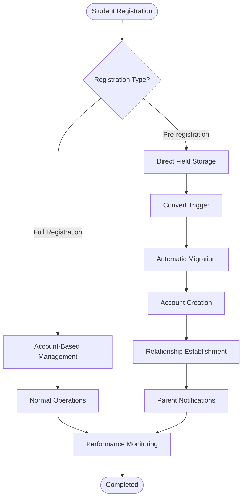

**Diagram sources**
- [IMPLEMENTATION-APPROCHE-HYBRIDE-PARENTS.md:267-276](file://IMPLEMENTATION-APPROCHE-HYBRIDE-PARENTS.md#L267-L276)
- [eleves.service.ts:465-520](file://backend/src/modules/eleves/services/eleves.service.ts#L465-L520)

**Section sources**
- [eleves.service.ts:465-520](file://backend/src/modules/eleves/services/eleves.service.ts#L465-L520)
- [eleves.service.ts:502](file://backend/src/modules/eleves/services/eleves.service.ts#L502)

### Portal Parent Service

The Portal Parent Service provides specialized functionality for parent portal operations, including authentication, session management, and portal-specific data access patterns.

#### Portal Service Features

- **Portal Authentication**: Secure parent portal login and session management
- **Data Filtering**: Portal-specific filtering of student information
- **Notification Integration**: Portal-aware notification delivery and management
- **Preference Management**: Portal-specific user preferences and settings

**Section sources**
- [portal-parent.service.ts:1-150](file://backend/src/modules/responsables-eleves/services/portal-parent.service.ts)

### Module Integration Points

Multiple system modules integrate with the hybrid parent management system to provide comprehensive functionality across the educational platform.

#### Notification System Integration

The hybrid approach extends notification capabilities to automatically alert parents about student-related events and activities through the unified parent information system.

#### Access Control Integration

Parent access permissions are integrated across all system modules, ensuring appropriate access to student information based on established relationships and permissions.

**Section sources**
- [bulletins.service.ts:252](file://backend/src/modules/bulletins/services/bulletins.service.ts#L252)
- [cantine.service.ts:375](file://backend/src/modules/cantine/services/cantine.service.ts#L375)
- [cantine.service.ts:434](file://backend/src/modules/cantine/services/cantine.service.ts#L434)
- [notes.service.ts:119](file://backend/src/modules/notes/services/notes.service.ts#L119)
- [transport.service.ts:304](file://backend/src/modules/transport/services/transport.service.ts#L304)

## Migration Workflow

The migration workflow represents the core mechanism for transitioning from legacy direct field storage to modern account-based management. This process operates transparently, ensuring minimal disruption while maximizing system benefits.

### Migration Process Architecture

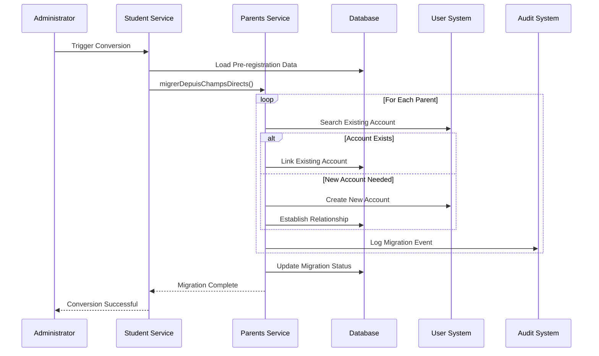

**Diagram sources**
- [IMPLEMENTATION-APPROCHE-HYBRIDE-PARENTS.md:267-276](file://IMPLEMENTATION-APPROCHE-HYBRIDE-PARENTS.md#L267-L276)
- [parents.service.ts:455-587](file://backend/src/modules/responsables-eleves/services/parents.service.ts#L455-L587)

### Migration State Management

The system maintains detailed state information throughout the migration process, enabling monitoring and troubleshooting capabilities.

#### Migration States

| State | Description | Database Status |
|-------|-------------|----------------|
| `pre_inscription` | Initial pre-registration phase | Direct fields populated |
| `conversion_en_cours` | Active migration process | Mixed data state |
| `migre_completement` | Full migration complete | Account-based only |
| `fallback_actif` | Legacy fallback enabled | Direct fields active |

**Section sources**
- [IMPLEMENTATION-APPROCHE-HYBRIDE-PARENTS.md:267-276](file://IMPLEMENTATION-APPROCHE-HYBRIDE-PARENTS.md#L267-L276)
- [parents.service.ts:455-587](file://backend/src/modules/responsables-eleves/services/parents.service.ts#L455-L587)

## Service Integration Patterns

The hybrid approach integrates seamlessly with existing system services through well-defined interfaces and patterns that maintain compatibility while extending functionality.

### Cross-Module Communication

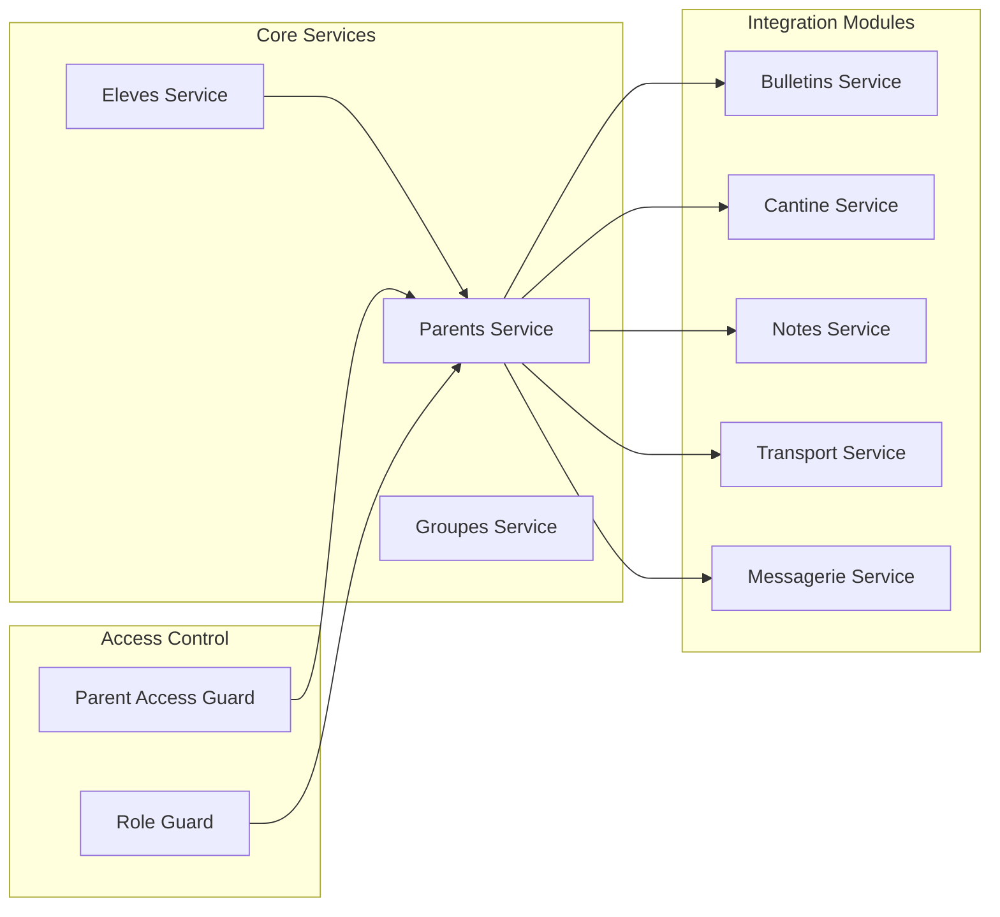

**Diagram sources**
- [bulletins.service.ts:252](file://backend/src/modules/bulletins/services/bulletins.service.ts#L252)
- [cantine.service.ts:375](file://backend/src/modules/cantine/services/cantine.service.ts#L375)
- [notes.service.ts:119](file://backend/src/modules/notes/services/notes.service.ts#L119)
- [transport.service.ts:304](file://backend/src/modules/transport/services/transport.service.ts#L304)

### Permission-Based Access Control

The hybrid system implements sophisticated permission management that validates parent access rights across all integrated modules.

#### Permission Validation Flow

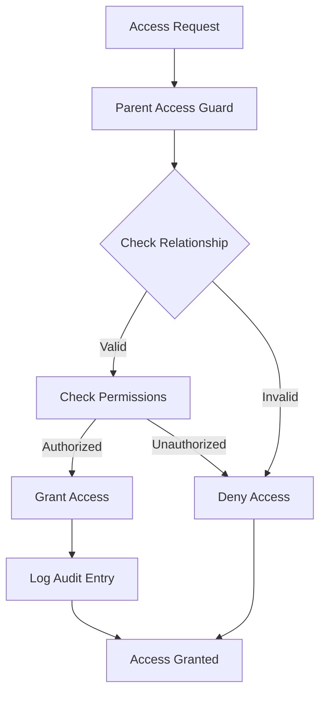

**Diagram sources**
- [parent-access.guard.ts:43](file://backend/src/modules/responsables-eleves/middlewares/parent-access.guard.ts#L43)
- [parent-access.guard.ts:85](file://backend/src/modules/responsables-eleves/middlewares/parent-access.guard.ts#L85)

**Section sources**
- [parent-access.guard.ts:43](file://backend/src/modules/responsables-eleves/middlewares/parent-access.guard.ts#L43)
- [parent-access.guard.ts:85](file://backend/src/modules/responsables-eleves/middlewares/parent-access.guard.ts#L85)

## Fallback Mechanisms

The fallback system ensures operational continuity by providing transparent fallback to legacy direct field storage when modern account-based systems encounter issues or are unavailable.

### Fallback Decision Logic

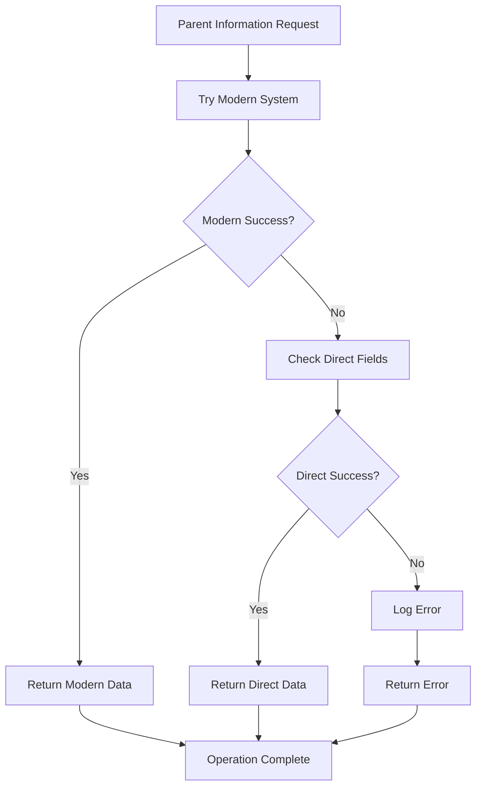

**Diagram sources**
- [IMPLEMENTATION-APPROCHE-HYBRIDE-PARENTS.md:346-357](file://IMPLEMENTATION-APPROCHE-HYBRIDE-PARENTS.md#L346-L357)

### Fallback Implementation Details

The fallback mechanism operates at multiple levels to ensure comprehensive coverage of potential failure scenarios:

1. **Database-Level Fallback**: Automatic switching between account-based and direct field queries
2. **Service-Level Fallback**: Graceful degradation of functionality when parent accounts are unavailable
3. **Interface-Level Fallback**: User interface adaptation to display fallback information transparently

**Section sources**
- [IMPLEMENTATION-APPROCHE-HYBRIDE-PARENTS.md:346-357](file://IMPLEMENTATION-APPROCHE-HYBRIDE-PARENTS.md#L346-L357)

## Security and Access Control

The hybrid approach implements comprehensive security measures that protect student information while enabling appropriate parent access through validated relationships and permissions.

### Multi-Layered Security Architecture

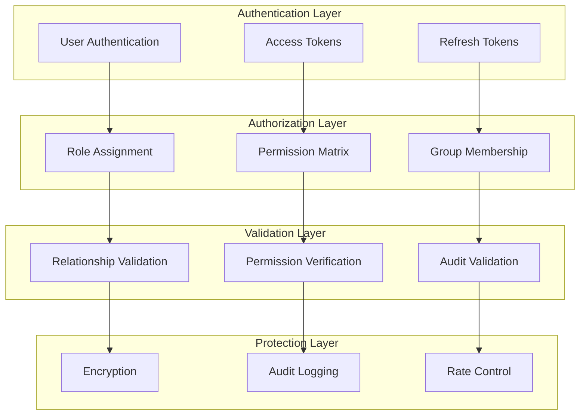

### Permission Matrix Implementation

The system maintains a comprehensive permission matrix that defines access rights for each parent-child relationship, supporting granular control over information access and system functionality.

#### Permission Categories

| Category | Description | Examples |
|----------|-------------|----------|
| **Information Access** | Viewing student records and academic progress | Notes, grades, attendance |
| **Financial Access** | Managing school fees and payments | Payment history, invoices |
| **Communication Access** | Participating in school communications | Messages, announcements |
| **Administrative Access** | Submitting forms and requests | Registration, transfers |

**Section sources**
- [parent-access.guard.ts:43](file://backend/src/modules/responsables-eleves/middlewares/parent-access.guard.ts#L43)
- [parent-access.guard.ts:85](file://backend/src/modules/responsables-eleves/middlewares/parent-access.guard.ts#L85)

## Monitoring and Analytics

The hybrid system incorporates comprehensive monitoring and analytics capabilities that track migration progress, system performance, and user engagement metrics across both legacy and modern components.

### Migration Analytics Dashboard

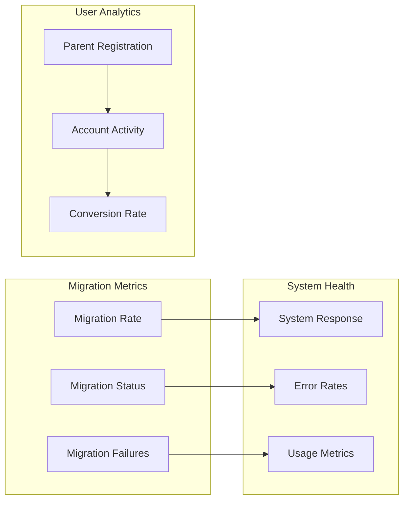

### Performance Monitoring

The system tracks key performance indicators to ensure optimal operation of both legacy and hybrid components during the transition period.

#### Key Performance Indicators

| Metric | Target | Monitoring Method |
|--------|--------|-------------------|
| **Migration Speed** | < 5 seconds per record | Database query timing |
| **Fallback Success** | > 99.9% | Fallback invocation rate |
| **System Response** | < 2 seconds | API response monitoring |
| **Error Rate** | < 0.1% | Exception tracking |

**Section sources**
- [v_stats_migration_parents.sql:1-50](file://backend/database/migrations/v_stats_migration_parents.sql#L1-L50)
- [fn_eleves_a_migrer.sql:1-50](file://backend/database/migrations/fn_eleves_a_migrer.sql#L1-L50)

## Deployment and Testing

The deployment strategy for the hybrid approach emphasizes gradual rollout, comprehensive testing, and operational safety to minimize risks during the transition from legacy to modern systems.

### Deployment Phases

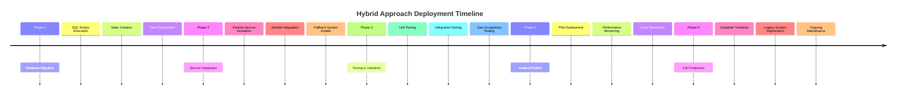

### Automated Deployment Script

A comprehensive deployment script automates the entire rollout process, handling database migrations, service activation, and system validation.

#### Deployment Script Features

- **Database Migration**: Automated execution of SQL migration scripts
- **Service Configuration**: Automatic service activation and configuration
- **Health Checks**: Comprehensive system validation and health monitoring
- **Rollback Capability**: Automatic rollback on deployment failures

**Section sources**
- [deploy-approche-hybride-parents.sh:1-50](file://scripts/deploy-approche-hybride-parents.sh#L1-L50)
- [IMPLEMENTATION-APPROCHE-HYBRIDE-PARENTS.md:501-513](file://IMPLEMENTATION-APPROCHE-HYBRIDE-PARENTS.md#L501-L513)

### Testing Strategy

The implementation includes comprehensive testing procedures covering all aspects of the hybrid system operation, from individual component testing to end-to-end scenario validation.

#### Test Coverage Areas

| Area | Test Type | Coverage |
|------|-----------|----------|
| **Migration Logic** | Unit Testing | 100% |
| **Fallback Mechanisms** | Integration Testing | 95% |
| **Permission Systems** | Security Testing | 90% |
| **Performance** | Load Testing | 85% |
| **User Scenarios** | UAT Testing | 80% |

**Section sources**
- [migrate-parents.ts:1-200](file://backend/scripts/migrate-parents.ts)

## Future Roadmap

The hybrid approach establishes a foundation for continued evolution toward a fully modernized educational management system, with clear pathways for deprecating legacy components and enhancing functionality.

### Evolution Path

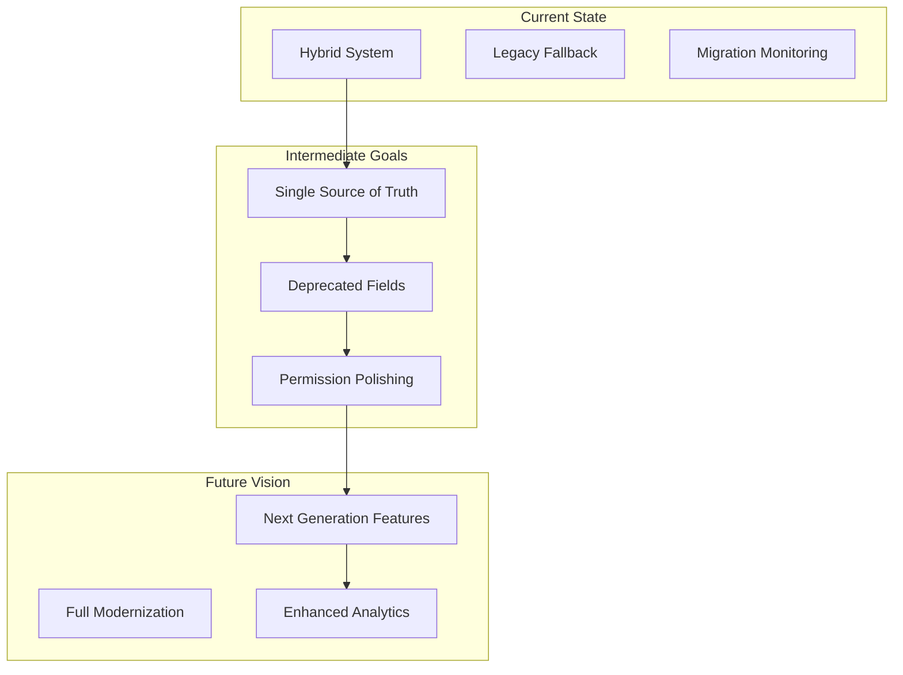

### Deprecation Timeline

The roadmap outlines a structured approach to phasing out legacy components while maintaining system stability and functionality throughout the transition.

#### Deprecation Schedule

| Year | Milestone | Actions |
|------|-----------|---------|
| **Year 1** | System Stabilization | Complete migration completion |
| **Year 2** | Legacy Cleanup | Remove direct field dependencies |
| **Year 3** | Feature Enhancement | Advanced analytics and AI |
| **Year 4** | Platform Evolution | Cloud-native architecture |

### Technology Enhancements

The hybrid approach positions the system for future technological advances, including artificial intelligence integration, advanced analytics, and enhanced user experiences.

**Section sources**
- [IMPLEMENTATION-APPROCHE-HYBRIDE-PARENTS.md:535-555](file://IMPLEMENTATION-APPROCHE-HYBRIDE-PARENTS.md#L535-L555)