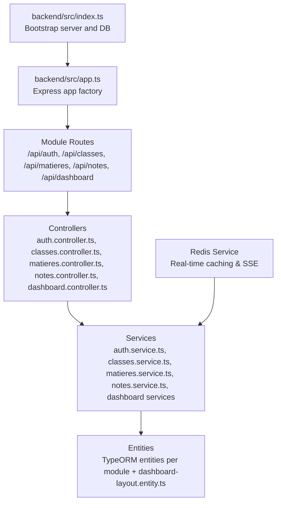
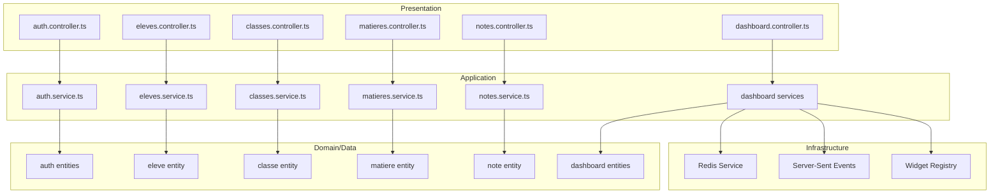
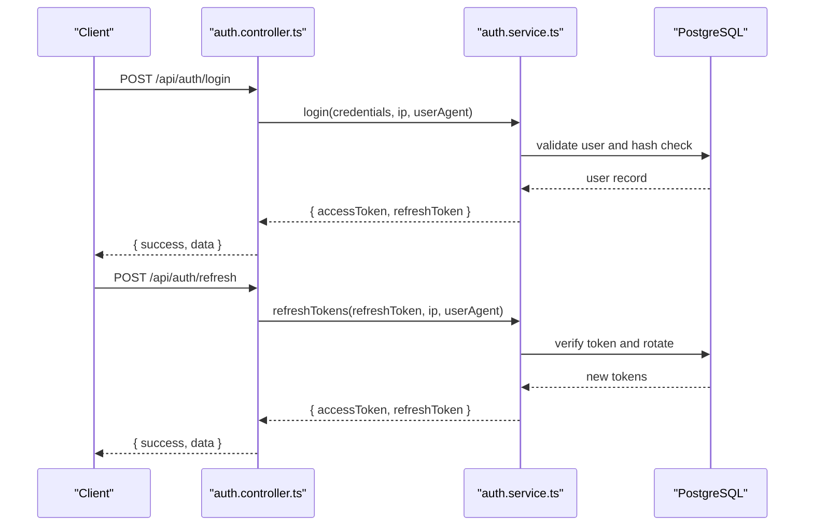
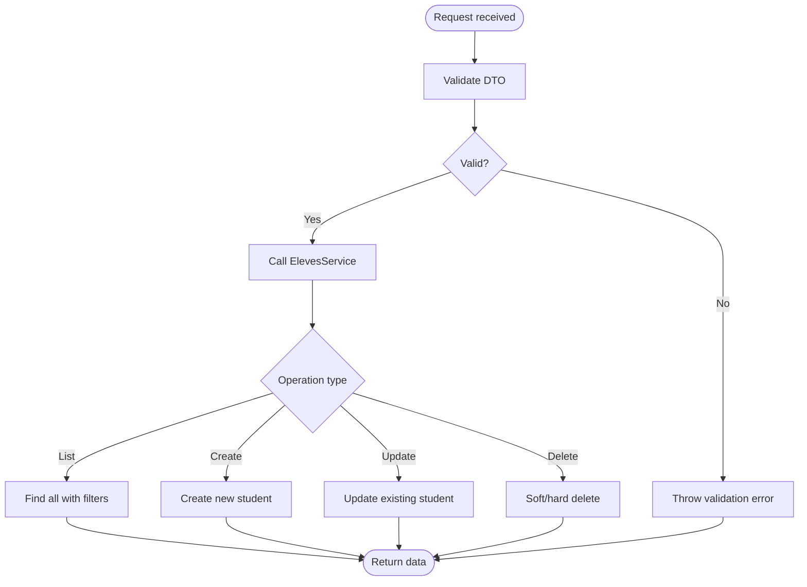
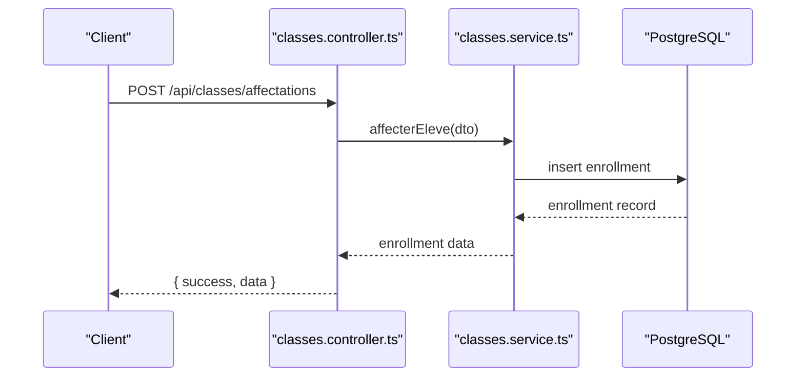
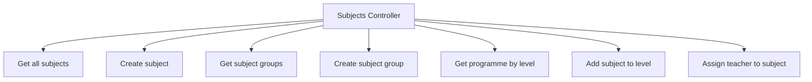
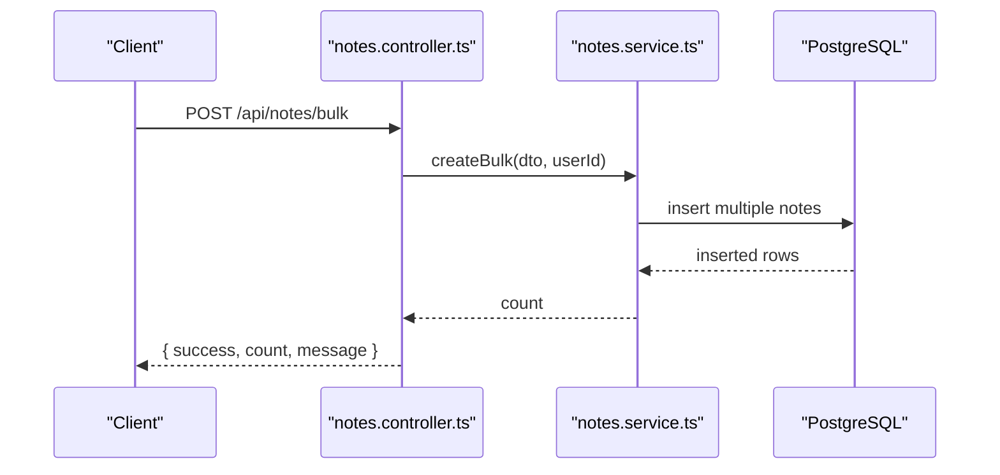
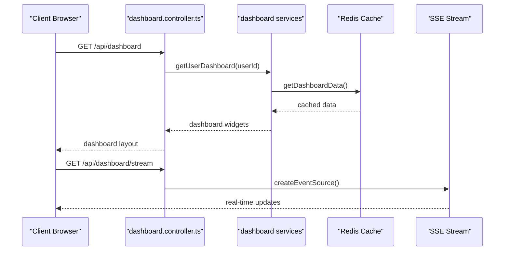
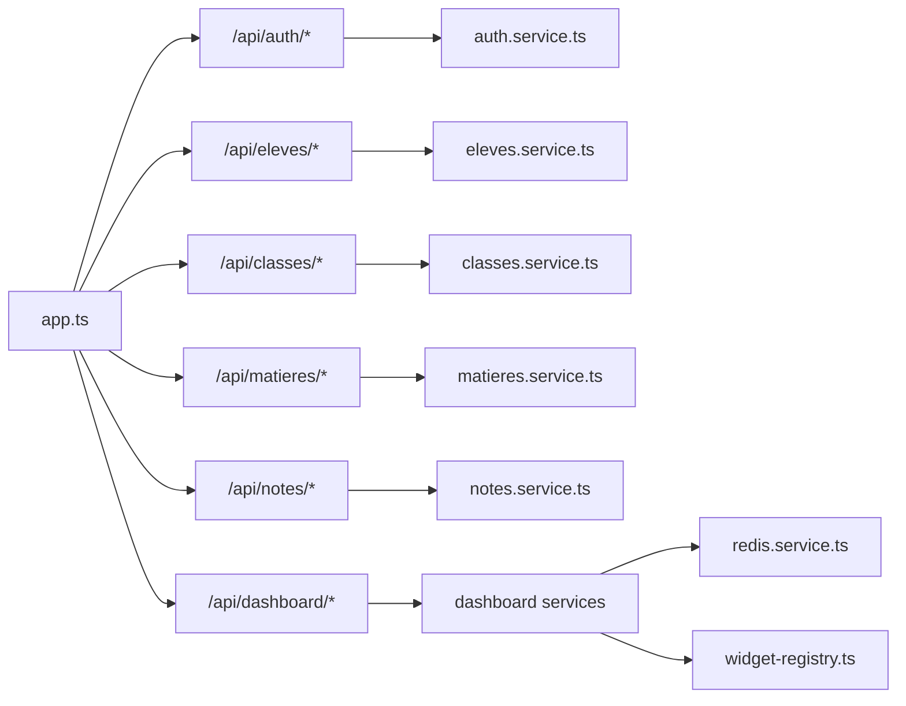

# Modules & Features

<cite>
**Referenced Files in This Document**
- [README.md](file://README.md)
- [backend/src/index.ts](file://backend/src/index.ts)
- [backend/src/app.ts](file://backend/src/app.ts)
- [backend/package.json](file://backend/package.json)
- [backend/src/modules/auth/index.ts](file://backend/src/modules/auth/index.ts)
- [backend/src/modules/auth/controllers/auth.controller.ts](file://backend/src/modules/auth/controllers/auth.controller.ts)
- [backend/src/modules/eleves/index.ts](file://backend/src/modules/eleves/index.ts)
- [backend/src/modules/eleves/controllers/eleves.controller.ts](file://backend/src/modules/eleves/controllers/eleves.controller.ts)
- [backend/src/modules/classes/index.ts](file://backend/src/modules/classes/index.ts)
- [backend/src/modules/classes/controllers/classes.controller.ts](file://backend/src/modules/classes/controllers/classes.controller.ts)
- [backend/src/modules/matieres/index.ts](file://backend/src/modules/matieres/index.ts)
- [backend/src/modules/matieres/controllers/matieres.controller.ts](file://backend/src/modules/matieres/controllers/matieres.controller.ts)
- [backend/src/modules/notes/index.ts](file://backend/src/modules/notes/index.ts)
- [backend/src/modules/notes/controllers/notes.controller.ts](file://backend/src/modules/notes/controllers/notes.controller.ts)
- [backend/src/modules/dashboard/controllers/dashboard.controller.ts](file://backend/src/modules/dashboard/controllers/dashboard.controller.ts)
- [backend/src/modules/dashboard/services/dashboard-cache.service.ts](file://backend/src/modules/dashboard/services/dashboard-cache.service.ts)
- [backend/src/modules/dashboard/services/dashboard-sse.service.ts](file://backend/src/modules/dashboard/services/dashboard-sse.service.ts)
- [backend/src/modules/dashboard/utils/widget-registry.ts](file://backend/src/modules/dashboard/utils/widget-registry.ts)
- [backend/src/common/services/redis.service.ts](file://backend/src/common/services/redis.service.ts)
- [backend/database/migrations/010-dashboard-layouts.sql](file://backend/database/migrations/010-dashboard-layouts.sql)
- [backend/database/migrations/010-notification-providers.sql](file://backend/database/migrations/010-notification-providers.sql)
</cite>

## Update Summary
**Changes Made**
- Added comprehensive documentation for the new Dashboard System module
- Documented real-time capabilities with Server-Sent Events (SSE)
- Added Redis integration details for caching and performance optimization
- Included widget registry system and modular dashboard architecture
- Updated module dependency analysis to include dashboard module
- Enhanced performance considerations with caching strategies

## Table of Contents
1. [Introduction](#introduction)
2. [Project Structure](#project-structure)
3. [Core Components](#core-components)
4. [Architecture Overview](#architecture-overview)
5. [Detailed Component Analysis](#detailed-component-analysis)
6. [Dashboard System Module](#dashboard-system-module)
7. [Dependency Analysis](#dependency-analysis)
8. [Performance Considerations](#performance-considerations)
9. [Troubleshooting Guide](#troubleshooting-guide)
10. [Conclusion](#conclusion)
11. [Appendices](#appendices)

## Introduction
eLISAschool is a modular Progressive Web App (PWA) backend designed for advanced school administration in Sub-Saharan Africa. It provides a comprehensive set of functional modules covering academic management, student records, grading systems, class administration, subject management, administrative functions, and now a sophisticated Dashboard System with real-time capabilities. The backend is built with Node.js, Express.js, TypeScript, and TypeORM, and integrates PostgreSQL with Row Level Security (RLS). Security is enforced via JWT, AES-256 encryption, and Role-Based Access Control (RBAC). The system exposes RESTful APIs organized by domain-focused modules, each with dedicated controllers, DTOs, entities, and services.

**Section sources**
- [README.md:1-39](file://README.md#L1-L39)

## Project Structure
The backend follows a modular monolith architecture with a clear separation of concerns:
- Root entry initializes environment, connects to PostgreSQL via TypeORM, and starts the Express server.
- The application composes routes from individual modules and applies shared middleware (security, logging, rate limiting).
- Each module encapsulates its own controllers, DTOs, entities, and services, exporting a consolidated index for easy consumption.
- **New**: The Dashboard System module provides real-time analytics and customizable widgets with Redis caching.

Key structural highlights:
- Entry point: initializes database and server lifecycle.
- Application factory: configures middleware, health endpoints, and mounts module routes.
- Module composition: centralized route mounting in the application factory.
- **Enhanced**: Dashboard module with SSE streaming, Redis caching, and widget resolution.

**Diagram sources**
- [backend/src/index.ts:22-61](file://backend/src/index.ts#L22-L61)
- [backend/src/app.ts:58-204](file://backend/src/app.ts#L58-L204)
- [backend/src/common/services/redis.service.ts](file://backend/src/common/services/redis.service.ts)

**Section sources**
- [backend/src/index.ts:1-62](file://backend/src/index.ts#L1-L62)
- [backend/src/app.ts:1-205](file://backend/src/app.ts#L1-L205)

## Core Components
This section outlines the primary modules and their responsibilities, focusing on purpose, key features, data relationships, and user workflows.

- Authentication and Authorization
  - Purpose: Secure user onboarding, session management, and access control.
  - Key features: Login, registration, refresh tokens, logout, forgot/reset/change password, email verification, current user retrieval.
  - Data relationships: Users, roles, permissions, refresh tokens, audit logs.
  - User workflows: Registration -> Email verification -> Login -> Token refresh -> Protected actions -> Logout.
  - Security: JWT, bcrypt hashing, RBAC guards, request logging, rate limiting.

- Students (Eleves)
  - Purpose: Manage student profiles, enrollments, and lifecycle.
  - Key features: List students, create/update/delete student records, role-restricted access.
  - Data relationships: Student entity linked to classes, grades, and related academic records.
  - User workflows: Admin/SuperAdmin/Personnel create/update student; Chef d'Établissement views; deletion restricted to admin roles.

- Classes (Classes)
  - Purpose: Organize students into classes by level and academic year.
  - Key features: CRUD for classes, list by level/year, student enrollment/affectation.
  - Data relationships: Class entity linked to levels, academic years, and students.
  - User workflows: Admin/SuperAdmin create/update/delete classes; Personnel/Chef affect students to classes.

- Subjects (Matieres)
  - Purpose: Define subjects, groups, and curriculum mapping per level.
  - Key features: CRUD for subjects, manage subject groups, curriculum programme per level, teacher assignment.
  - Data relationships: Subject entity, grouping, level mapping, teacher affectation.
  - User workflows: Admin/SuperAdmin create subjects and groups; Chef/Admin assign teachers; retrieve programme per level.

- Grading System (Notes)
  - Purpose: Capture, compute, and manage student assessments.
  - Key features: CRUD for notes, bulk creation, query filtering, role-restricted write access.
  - Data relationships: Note entity linked to students, subjects, periods, classes.
  - User workflows: Teachers create/update/delete notes; Admin/Chef/Equipe view; bulk upload for efficiency.

**Section sources**
- [backend/src/modules/auth/controllers/auth.controller.ts:55-264](file://backend/src/modules/auth/controllers/auth.controller.ts#L55-L264)
- [backend/src/modules/eleves/controllers/eleves.controller.ts:25-54](file://backend/src/modules/eleves/controllers/eleves.controller.ts#L25-L54)
- [backend/src/modules/classes/controllers/classes.controller.ts:25-63](file://backend/src/modules/classes/controllers/classes.controller.ts#L25-L63)
- [backend/src/modules/matieres/controllers/matieres.controller.ts:30-85](file://backend/src/modules/matieres/controllers/matieres.controller.ts#L30-L85)
- [backend/src/modules/notes/controllers/notes.controller.ts:27-71](file://backend/src/modules/notes/controllers/notes.controller.ts#L27-L71)

## Architecture Overview
The system employs a layered architecture:
- Presentation Layer: Express routes per module.
- Application Layer: Controllers orchestrate requests, apply validation, enforce roles, and delegate to services.
- Domain Layer: Services encapsulate business logic and coordinate with repositories/entities.
- Data Layer: TypeORM entities and repositories persist data to PostgreSQL with RLS.

Inter-module communication:
- Controllers depend on services within the same module.
- Shared utilities (filters, interceptors, logging) are reused across modules.
- RBAC guards and middlewares enforce authorization centrally.
- **Enhanced**: Dashboard module integrates with Redis for real-time updates and SSE streaming.

**Diagram sources**
- [backend/src/modules/auth/controllers/auth.controller.ts:34](file://backend/src/modules/auth/controllers/auth.controller.ts#L34)
- [backend/src/modules/eleves/controllers/eleves.controller.ts:15](file://backend/src/modules/eleves/controllers/eleves.controller.ts#L15)
- [backend/src/modules/classes/controllers/classes.controller.ts:15](file://backend/src/modules/classes/controllers/classes.controller.ts#L15)
- [backend/src/modules/matieres/controllers/matieres.controller.ts:20](file://backend/src/modules/matieres/controllers/matieres.controller.ts#L20)
- [backend/src/modules/notes/controllers/notes.controller.ts:15](file://backend/src/modules/notes/controllers/notes.controller.ts#L15)
- [backend/src/modules/dashboard/controllers/dashboard.controller.ts:281](file://backend/src/modules/dashboard/controllers/dashboard.controller.ts#L281)

## Detailed Component Analysis

### Authentication and Authorization Module
Purpose:
- Centralized identity and access management with secure token lifecycle and audit trails.

Key features:
- Multi-step authentication pipeline with validation, hashing, and token issuance.
- Refresh token rotation and logout mechanisms.
- Password recovery and email verification.
- Current user profile retrieval.

Data relationships:
- User entity with roles and permissions.
- Refresh token storage for session management.
- Audit logs for security events.

User workflows:
- Registration and verification.
- Login and token refresh.
- Password reset and change.
- Logout and logout-all.

**Diagram sources**
- [backend/src/modules/auth/controllers/auth.controller.ts:55-120](file://backend/src/modules/auth/controllers/auth.controller.ts#L55-L120)

**Section sources**
- [backend/src/modules/auth/index.ts:9-15](file://backend/src/modules/auth/index.ts#L9-L15)
- [backend/src/modules/auth/controllers/auth.controller.ts:55-264](file://backend/src/modules/auth/controllers/auth.controller.ts#L55-L264)

### Students Module
Purpose:
- Maintain student records and support enrollment-related operations.

Key features:
- List students with optional subsystem filter.
- Create, update, and delete student records.
- Role-based access controls for write operations.

User workflows:
- Retrieve lists for reporting/administration.
- Onboard new students with personnel/admin roles.
- Update personal or academic details.
- Archive student records with administrative privileges.

**Diagram sources**
- [backend/src/modules/eleves/controllers/eleves.controller.ts:17-39](file://backend/src/modules/eleves/controllers/eleves.controller.ts#L17-L39)

**Section sources**
- [backend/src/modules/eleves/index.ts:1-5](file://backend/src/modules/eleves/index.ts#L1-L5)
- [backend/src/modules/eleves/controllers/eleves.controller.ts:25-54](file://backend/src/modules/eleves/controllers/eleves.controller.ts#L25-L54)

### Classes Module
Purpose:
- Organize students into structured classes aligned with levels and academic years.

Key features:
- CRUD for classes.
- Filter by level and academic year.
- Student enrollment/affectation workflow.

User workflows:
- Admin/SuperAdmin create/update/delete classes.
- Personnel/Chef affect students to classes.
- Query classes for scheduling and reporting.

**Diagram sources**
- [backend/src/modules/classes/controllers/classes.controller.ts:57-63](file://backend/src/modules/classes/controllers/classes.controller.ts#L57-L63)

**Section sources**
- [backend/src/modules/classes/index.ts:1-5](file://backend/src/modules/classes/index.ts#L1-L5)
- [backend/src/modules/classes/controllers/classes.controller.ts:25-63](file://backend/src/modules/classes/controllers/classes.controller.ts#L25-L63)

### Subjects Module
Purpose:
- Define subjects, subject groups, curriculum mapping, and teacher assignments.

Key features:
- CRUD for subjects and subject groups.
- Curriculum programme per level.
- Teacher affectation to subjects.

User workflows:
- Admin/SuperAdmin define subjects and groups.
- Chef/Admin map subjects to levels.
- Assign teachers to subjects for teaching load.

**Diagram sources**
- [backend/src/modules/matieres/controllers/matieres.controller.ts:30-85](file://backend/src/modules/matieres/controllers/matieres.controller.ts#L30-L85)

**Section sources**
- [backend/src/modules/matieres/index.ts:1-5](file://backend/src/modules/matieres/index.ts#L1-L5)
- [backend/src/modules/matieres/controllers/matieres.controller.ts:30-85](file://backend/src/modules/matieres/controllers/matieres.controller.ts#L30-L85)

### Grading System Module
Purpose:
- Capture and manage assessment data with flexible querying and bulk operations.

Key features:
- CRUD for notes.
- Bulk creation endpoint for efficient data entry.
- Query filtering by various criteria.
- Role-restricted write access for teachers and administrators.

User workflows:
- Teachers enter individual or bulk grades.
- Admin/Chef/Equipe view and manage grades.
- Query and export grade data for reports.

**Diagram sources**
- [backend/src/modules/notes/controllers/notes.controller.ts:50-56](file://backend/src/modules/notes/controllers/notes.controller.ts#L50-L56)

**Section sources**
- [backend/src/modules/notes/index.ts:7-11](file://backend/src/modules/notes/index.ts#L7-L11)
- [backend/src/modules/notes/controllers/notes.controller.ts:27-71](file://backend/src/modules/notes/controllers/notes.controller.ts#L27-L71)

## Dashboard System Module

**New** The Dashboard System module provides real-time analytics, customizable widgets, and performance optimization features for school administration.

### Purpose
- Centralized dashboard for real-time school metrics and analytics.
- Customizable widget-based interface with role-based access control.
- Real-time data streaming via Server-Sent Events (SSE).
- High-performance caching with Redis integration.

### Key Features
- **Real-time Analytics**: Live data streaming for instant insights.
- **Widget System**: 18 pre-built widgets covering academic, administrative, and operational metrics.
- **Custom Layouts**: User-configurable dashboard layouts with drag-and-drop functionality.
- **Performance Optimization**: Intelligent caching, batch data loading, and pre-calculation jobs.
- **SSE Integration**: Server-Sent Events for real-time updates without polling.
- **Redis Caching**: High-speed caching for frequently accessed data and user sessions.

### Data Relationships
- DashboardLayout entity stores user preferences and widget configurations.
- WidgetRegistry manages widget definitions and their dependencies.
- Redis service provides caching layer for performance optimization.
- SSE service handles real-time event broadcasting.

### User Workflows
- **Administrator**: Full dashboard access, widget management, cache statistics.
- **Chef d'Établissement**: View academic metrics, student performance dashboards.
- **Teacher**: Subject-specific widgets, grade distribution analytics.
- **Student**: Personal progress widgets, schedule information.

**Diagram sources**
- [backend/src/modules/dashboard/controllers/dashboard.controller.ts:281](file://backend/src/modules/dashboard/controllers/dashboard.controller.ts#L281)
- [backend/src/modules/dashboard/services/dashboard-sse.service.ts](file://backend/src/modules/dashboard/services/dashboard-sse.service.ts)

### Dashboard Services Architecture
The dashboard module consists of several specialized services working together:

- **DashboardCacheService**: Manages Redis caching with TTL, hit/miss statistics, and cache warming.
- **DashboardDataLoader**: Optimizes database queries with batching and lazy loading.
- **WidgetResolverService**: Handles RBAC-based widget visibility and dynamic widget resolution.
- **DataAggregatorService**: Orchestrates complex data aggregation from multiple sources.
- **DashboardPrecalcService**: Runs scheduled jobs for pre-calculating frequently accessed metrics.
- **DashboardSSEService**: Provides real-time streaming capabilities for live updates.

**Section sources**
- [backend/src/modules/dashboard/controllers/dashboard.controller.ts:281-324](file://backend/src/modules/dashboard/controllers/dashboard.controller.ts#L281-L324)
- [backend/src/modules/dashboard/services/dashboard-cache.service.ts](file://backend/src/modules/dashboard/services/dashboard-cache.service.ts)
- [backend/src/modules/dashboard/services/dashboard-sse.service.ts](file://backend/src/modules/dashboard/services/dashboard-sse.service.ts)
- [backend/src/modules/dashboard/utils/widget-registry.ts](file://backend/src/modules/dashboard/utils/widget-registry.ts)

## Dependency Analysis
Module routing and composition:
- The application factory imports and mounts controllers from all modules under /api/<module>.
- Controllers depend on services; services depend on entities and repositories.
- Shared middleware (security, logging, rate limiting) is applied globally.
- **Enhanced**: Dashboard module depends on Redis service for caching and SSE for real-time updates.

**Diagram sources**
- [backend/src/app.ts:149-185](file://backend/src/app.ts#L149-L185)
- [backend/src/common/services/redis.service.ts](file://backend/src/common/services/redis.service.ts)

**Section sources**
- [backend/src/app.ts:149-185](file://backend/src/app.ts#L149-L185)

## Performance Considerations
- Middleware stack: Helmet, CORS, rate limiting, compression, and JSON parsing are configured early to reduce overhead and protect the server.
- Logging: Request logging interceptor helps monitor traffic and troubleshoot performance bottlenecks.
- Scalability: Modular design allows independent scaling of services and database connections; consider connection pooling and caching strategies for high-throughput endpoints.
- Validation: Zod-based DTO validation prevents malformed payloads and reduces error handling overhead.
- **Enhanced**: Dashboard module implements comprehensive caching strategies:
  - Redis-based caching for frequently accessed data
  - Intelligent cache warming and invalidation
  - Batch data loading to reduce database queries
  - Pre-calculation jobs for complex metrics
  - SSE streaming for real-time updates without additional polling

**Section sources**
- [backend/src/modules/dashboard/services/dashboard-cache.service.ts](file://backend/src/modules/dashboard/services/dashboard-cache.service.ts)
- [backend/src/modules/dashboard/services/dashboard-dataloader.service.ts](file://backend/src/modules/dashboard/services/dashboard-dataloader.service.ts)
- [backend/src/modules/dashboard/services/dashboard-precalc.service.ts](file://backend/src/modules/dashboard/services/dashboard-precalc.service.ts)

## Troubleshooting Guide
Common areas to inspect:
- Health endpoint: Verify service availability and version metadata.
- Error handling: Global error filter and not-found handler centralize error responses.
- Logging: Request logger interceptor captures incoming requests for debugging.
- Environment configuration: Ensure environment variables are loaded and database connection parameters are correct.
- **Enhanced**: Dashboard troubleshooting:
  - Redis connectivity: Verify Redis service is running and accessible.
  - Cache statistics: Monitor cache hit rates and memory usage.
  - SSE connections: Check for proper event stream establishment.
  - Widget rendering: Validate widget dependencies and RBAC permissions.

Operational checks:
- Confirm database initialization and migrations are executed.
- Validate JWT secret and token expiration settings.
- Review RBAC guard enforcement for protected endpoints.
- **Enhanced**: Dashboard-specific checks:
  - Redis configuration and connection pooling.
  - Dashboard layout migration completion.
  - Widget registry integrity and module dependencies.

**Section sources**
- [backend/src/app.ts:124-143](file://backend/src/app.ts#L124-L143)
- [backend/src/app.ts:197-201](file://backend/src/app.ts#L197-L201)
- [backend/src/index.ts:25-27](file://backend/src/index.ts#L25-L27)
- [backend/database/migrations/010-dashboard-layouts.sql](file://backend/database/migrations/010-dashboard-layouts.sql)

## Conclusion
eLISAschool's modular backend provides a robust foundation for school administration across Sub-Saharan Africa. The architecture cleanly separates concerns, enforces security and access control, and organizes functionality into cohesive modules. The documented modules—authentication, students, classes, subjects, grading, and the new Dashboard System—cover core administrative needs with clear workflows and extensibility points. The Dashboard System module introduces real-time capabilities, Redis integration, and performance optimization features that significantly enhance the platform's analytical and operational capabilities. Future enhancements can focus on expanding module coverage, implementing advanced caching strategies, optimizing bulk operations, and further enhancing the real-time dashboard experience.

## Appendices
- Technology stack: Node.js, Express.js, TypeScript, TypeORM, PostgreSQL with RLS, JWT, AES-256, RBAC, Redis, Server-Sent Events.
- Deployment: Docker Compose and development scripts are available for quick setup.
- **Enhanced**: Dashboard module dependencies include Redis for caching, SSE for real-time updates, and comprehensive widget registry system.

**Section sources**
- [README.md:29-39](file://README.md#L29-L39)
- [backend/package.json:9-21](file://backend/package.json#L9-L21)
- [backend/database/migrations/010-dashboard-layouts.sql](file://backend/database/migrations/010-dashboard-layouts.sql)
- [backend/database/migrations/010-notification-providers.sql](file://backend/database/migrations/010-notification-providers.sql)