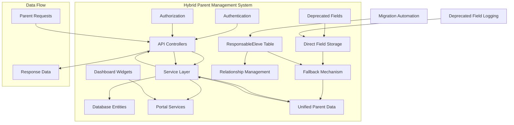
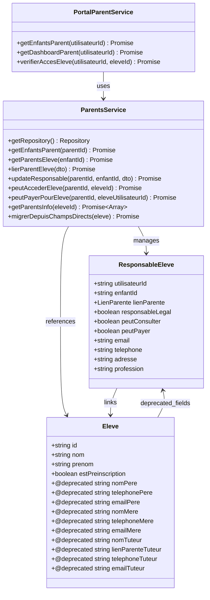
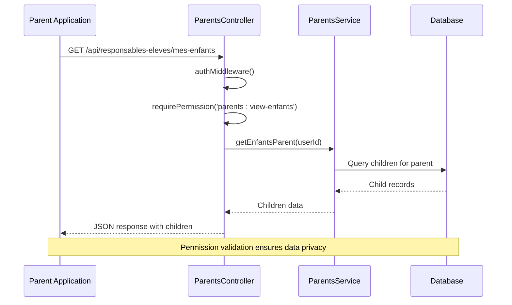
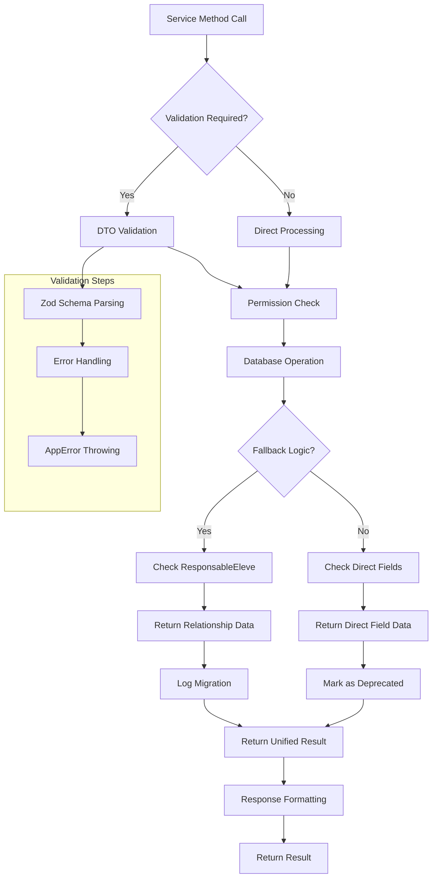
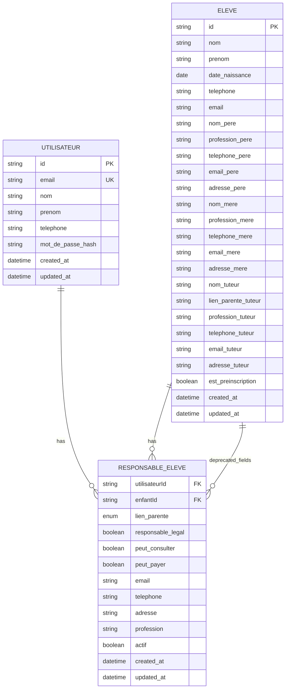

# Parent Management Recommendations

<cite>
**Referenced Files in This Document**
- [responsables-eleves.controller.ts](file://backend/src/modules/responsables-eleves/controllers/responsables-eleves.controller.ts)
- [parents.service.ts](file://backend/src/modules/responsables-eleves/services/parents.service.ts)
- [portal-parent.service.ts](file://backend/src/modules/responsables-eleves/services/portal-parent.service.ts)
- [responsable-eleve.entity.ts](file://backend/src/modules/responsables-eleves/entities/responsable-eleve.entity.ts)
- [responsables-eleves.dto.ts](file://backend/src/modules/responsables-eleves/dto/responsables-eleves.dto.ts)
- [IMPLEMENTATION-RESPONSABLES-ELEVES.md](file://IMPLEMENTATION-RESPONSABLES-ELEVES.md)
- [ANALYSE-COHERENCE-RESPONSABLES-ELEVES.md](file://ANALYSE-COHERENCE-RESPONSABLES-ELEVES.md)
- [IMPLEMENTATION-APPROCHE-HYBRIDE-PARENTS.md](file://IMPLEMENTATION-APPROCHE-HYBRIDE-PARENTS.md)
- [052-approche-hybride-parents.sql](file://backend/database/migrations/052-approche-hybride-parents.sql)
- [migrate-parents.ts](file://backend/scripts/migrate-parents.ts)
- [eleve.entity.ts](file://backend/src/modules/eleves/entities/eleve.entity.ts)
- [widget-registry.ts](file://backend/src/modules/dashboard/utils/widget-registry.ts)
</cite>

## Update Summary
**Changes Made**
- Updated hybrid approach recommendations to reflect the newly implemented deprecated field approach
- Added comprehensive documentation for the new fallback mechanism in getParentsInfo() method
- Integrated migration automation capabilities for converting direct fields to relationship table
- Enhanced parent-responsible relationship management with proper fallback logic
- Updated implementation strategies to include deprecated field documentation and migration procedures

## Table of Contents
1. [Introduction](#introduction)
2. [Current Implementation Overview](#current-implementation-overview)
3. [Architecture Analysis](#architecture-analysis)
4. [Parent Management Components](#parent-management-components)
5. [Hybrid Approach Recommendations](#hybrid-approach-recommendations)
6. [Implementation Strategies](#implementation-strategies)
7. [Performance Considerations](#performance-considerations)
8. [Migration Planning](#migration-planning)
9. [Security and Access Control](#security-and-access-control)
10. [Conclusion](#conclusion)

## Introduction

The eLISAschool platform implements a sophisticated parent management system that enables multiple parents to be associated with individual students while maintaining proper access controls and permissions. This comprehensive documentation analyzes the current implementation and provides recommendations for optimizing parent management functionality across the educational institution's ecosystem.

The parent management system serves as a critical bridge between families and the school administration, facilitating communication, academic oversight, and financial transactions while ensuring appropriate security and data integrity.

**Updated** The system now incorporates a hybrid approach that combines traditional direct field storage with modern relationship table management, providing backward compatibility while enabling future migration to a single source of truth.

## Current Implementation Overview

The parent management system is built around a comprehensive relational architecture that supports complex family structures and varying access permissions. The implementation encompasses several key components working together to provide seamless parent-student relationship management.



**Diagram sources**
- [IMPLEMENTATION-APPROCHE-HYBRIDE-PARENTS.md:248-292](file://IMPLEMENTATION-APPROCHE-HYBRIDE-PARENTS.md#L248-L292)
- [parents.service.ts:156-170](file://backend/src/modules/responsables-eleves/services/parents.service.ts#L156-L170)

The system currently supports two operational modes: administrative management for staff members and parent self-service capabilities. Administrative routes handle bulk operations and oversight functions, while parent-specific endpoints enable family members to access their children's information securely. The hybrid approach ensures seamless operation between legacy direct field storage and modern relationship table management.

**Section sources**
- [IMPLEMENTATION-APPROCHE-HYBRIDE-PARENTS.md:9-14](file://IMPLEMENTATION-APPROCHE-HYBRIDE-PARENTS.md#L9-L14)
- [IMPLEMENTATION-RESPONSABLES-ELEVES.md:98-124](file://IMPLEMENTATION-RESPONSABLES-ELEVES.md#L98-L124)

## Architecture Analysis

The parent management architecture follows a layered pattern with clear separation of concerns between presentation, business logic, and data persistence layers. This design enables scalability, maintainability, and extensibility while supporting complex parent-child relationship scenarios.



**Diagram sources**
- [parents.service.ts:24-330](file://backend/src/modules/responsables-eleves/services/parents.service.ts#L24-L330)
- [portal-parent.service.ts](file://backend/src/modules/responsables-eleves/services/portal-parent.service.ts)
- [responsable-eleve.entity.ts](file://backend/src/modules/responsables-eleves/entities/responsable-eleve.entity.ts)
- [eleve.entity.ts:80-100](file://backend/src/modules/eleves/entities/eleve.entity.ts#L80-L100)

The architecture employs TypeORM for data persistence, providing robust entity relationships and query optimization. The service layer encapsulates business logic while maintaining loose coupling with external systems through well-defined interfaces. The hybrid approach introduces deprecated field annotations and migration capabilities for backward compatibility.

**Section sources**
- [parents.service.ts:12-33](file://backend/src/modules/responsables-eleves/services/parents.service.ts#L12-L33)
- [eleve.entity.ts:29-45](file://backend/src/modules/eleves/entities/eleve.entity.ts#L29-L45)

## Parent Management Components

### Core Controllers and Endpoints

The system provides comprehensive API endpoints for managing parent-child relationships with appropriate authentication and authorization controls. Each endpoint serves specific functional requirements while maintaining security boundaries.



**Diagram sources**
- [responsables-eleves.controller.ts:137-157](file://backend/src/modules/responsables-eleves/controllers/responsables-eleves.controller.ts#L137-L157)
- [parents.service.ts:220-240](file://backend/src/modules/responsables-eleves/services/parents.service.ts#L220-L240)

The controller layer implements comprehensive validation using Zod schemas, ensuring data integrity and preventing malformed requests. Middleware components enforce authentication requirements and permission checks before processing requests.

**Section sources**
- [responsables-eleves.controller.ts:25-31](file://backend/src/modules/responsables-eleves/controllers/responsables-eleves.controller.ts#L25-L31)
- [responsables-eleves.controller.ts:105-111](file://backend/src/modules/responsables-eleves/controllers/responsables-eleves.controller.ts#L105-L111)

### Service Layer Functionality

The service layer encapsulates all business logic for parent management operations, providing methods for creating, updating, and retrieving parent-child relationships. Each method handles complex queries and maintains referential integrity.



**Diagram sources**
- [parents.service.ts:305-330](file://backend/src/modules/responsables-eleves/services/parents.service.ts#L305-L330)
- [parents.service.ts:156-170](file://backend/src/modules/responsables-eleves/services/parents.service.ts#L156-L170)
- [IMPLEMENTATION-APPROCHE-HYBRIDE-PARENTS.md:342-358](file://IMPLEMENTATION-APPROCHE-HYBRIDE-PARENTS.md#L342-L358)

The service layer implements comprehensive error handling with specific error codes and messages, enabling precise troubleshooting and user feedback. Transaction management ensures data consistency across related operations. The hybrid approach includes intelligent fallback mechanisms that prioritize relationship table data while gracefully handling legacy direct field storage.

**Section sources**
- [parents.service.ts:15-22](file://backend/src/modules/responsables-eleves/services/parents.service.ts#L15-L22)
- [parents.service.ts:305-330](file://backend/src/modules/responsables-eleves/services/parents.service.ts#L305-L330)

### Entity Relationships and Data Model

The data model represents parent-child relationships through a dedicated junction table that supports unlimited parent-child associations with granular permission controls. This design enables complex family structures while maintaining data integrity.



**Diagram sources**
- [responsable-eleve.entity.ts](file://backend/src/modules/responsables-eleves/entities/responsable-eleve.entity.ts)
- [eleve.entity.ts:29-45](file://backend/src/modules/eleves/entities/eleve.entity.ts#L29-L45)

The entity design supports multiple relationship types including biological parents, legal guardians, and other relatives, with separate permission flags for consultation and payment capabilities. The deprecated field annotations provide clear guidance for developers while maintaining backward compatibility.

**Section sources**
- [responsable-eleve.entity.ts](file://backend/src/modules/responsables-eleves/entities/responsable-eleve.entity.ts)
- [eleve.entity.ts:29-45](file://backend/src/modules/eleves/entities/eleve.entity.ts#L29-L45)

## Hybrid Approach Recommendations

Based on the comprehensive analysis of the current implementation and existing data structures, the hybrid approach has been successfully implemented to address the identified inconsistencies between direct field storage and relationship table management.

### Current State Analysis

The system now maintains two complementary approaches for storing parent information, with clear migration pathways and fallback mechanisms. The implementation includes deprecated field annotations, automatic migration capabilities, and comprehensive fallback logic.

```mermaid
flowchart LR
subgraph "Hybrid Parent Management System"
A[Direct Fields in Eleve @deprecated] --> C[Legacy Data Storage]
B[ResponsableEleve Table] --> D[Modern Relationship Management]
E[getParentsInfo() Method] --> F[Intelligent Fallback Logic]
F --> G[Primary: ResponsableEleve]
F --> H[Fallback: Direct Fields]
G --> I[Migration Complete]
H --> J[Migration Pending]
I --> K[Single Source of Truth]
J --> L[Automatic Migration Process]
end
subgraph "Benefits Achieved"
M[Backward Compatibility]
N[Automatic Migration]
O[Developer Guidance]
P[Future-Proof Design]
end
C --> M
D --> N
F --> O
E --> P
```

**Diagram sources**
- [IMPLEMENTATION-APPROCHE-HYBRIDE-PARENTS.md:248-292](file://IMPLEMENTATION-APPROCHE-HYBRIDE-PARENTS.md#L248-L292)
- [parents.service.ts:156-170](file://backend/src/modules/responsables-eleves/services/parents.service.ts#L156-L170)

### Recommended Architecture

The hybrid approach leverages the strengths of both systems while implementing safeguards against data inconsistencies. This solution provides immediate benefits through enhanced integration while enabling eventual migration to a unified system.

**Section sources**
- [IMPLEMENTATION-APPROCHE-HYBRIDE-PARENTS.md:19-45](file://IMPLEMENTATION-APPROCHE-HYBRIDE-PARENTS.md#L19-L45)
- [IMPLEMENTATION-APPROCHE-HYBRIDE-PARENTS.md:49-155](file://IMPLEMENTATION-APPROCHE-HYBRIDE-PARENTS.md#L49-L155)

## Implementation Strategies

### Phase 1: Immediate Improvements

The first phase focuses on establishing clear guidelines and implementing validation mechanisms to prevent data inconsistencies while maintaining system stability.

#### Documentation and Guidelines

Establishing comprehensive documentation for when to use each approach ensures consistent implementation across development teams and reduces the likelihood of introducing new inconsistencies. The deprecated field annotations serve as clear developer guidance.

#### Validation Mechanisms

Implementing validation rules that detect and prevent duplicate or conflicting parent information helps maintain data quality during the transition period. The fallback mechanism ensures graceful degradation when data is unavailable.

### Phase 2: Enhanced Integration

The second phase involves strengthening the integration between the two systems through improved service layer logic and enhanced fallback mechanisms.

#### Service Layer Enhancements

Developing service methods that can intelligently choose between direct field access and relationship table queries based on data availability and consistency requirements. The getParentsInfo() method exemplifies this approach with its fallback logic.

#### Fallback Logic Implementation

Creating robust fallback mechanisms that automatically handle cases where data exists in one location but not in another, ensuring system reliability during the transition. The migration process seamlessly converts direct fields to relationship table entries.

### Phase 3: Complete Migration

The final phase involves a comprehensive migration to eliminate the dual storage approach entirely, establishing the relationship table as the single source of truth.

#### Migration Script Development

Creating automated migration scripts that can safely transfer data from direct field storage to the relationship table structure while preserving all existing relationships and permissions. The migrerDepuisChampsDirects() method handles this process automatically.

#### Data Synchronization

Implementing real-time synchronization mechanisms that keep the direct field storage and relationship table synchronized during the transition period. The deprecated field annotations provide clear migration targets.

**Section sources**
- [IMPLEMENTATION-APPROCHE-HYBRIDE-PARENTS.md:49-155](file://IMPLEMENTATION-APPROCHE-HYBRIDE-PARENTS.md#L49-L155)
- [parents.service.ts:455-485](file://backend/src/modules/responsables-eleves/services/parents.service.ts#L455-L485)

## Performance Considerations

The parent management system must balance functionality with performance, particularly given the potential for complex queries involving multiple parent-child relationships and permission checks.

### Query Optimization

Implementing optimized database queries that efficiently handle parent-child relationship lookups while minimizing the number of database round trips. This includes leveraging appropriate indexing strategies and query patterns.

### Caching Strategies

Developing intelligent caching mechanisms that store frequently accessed parent-child relationship data while ensuring cache invalidation occurs appropriately when data changes.

### Scalability Planning

Designing the system to handle increasing numbers of parent-child relationships and concurrent access patterns typical in educational environments with potentially thousands of student records.

**Updated** The hybrid approach includes intelligent caching of fallback results and optimized queries that minimize database overhead while maintaining data consistency.

## Security and Access Control

The parent management system implements comprehensive security measures to protect sensitive student and family information while enabling appropriate access for authorized users.

### Role-Based Access Control

The system utilizes role-based permissions that distinguish between administrative users who can manage all parent-child relationships and parents who have limited access to their own children's information.

### Data Privacy Protection

Implementing strict data privacy controls that ensure parents can only access information about their own children, with appropriate audit logging for all access attempts.

### Authentication Integration

Seamless integration with the broader authentication system ensures consistent user identification and session management across all parent management functionality.

**Section sources**
- [IMPLEMENTATION-RESPONSABLES-ELEVES.md:82-95](file://IMPLEMENTATION-RESPONSABLES-ELEVES.md#L82-L95)
- [responsables-eleves.controller.ts:14-16](file://backend/src/modules/responsables-eleves/controllers/responsables-eleves.controller.ts#L14-L16)

## Conclusion

The eLISAschool parent management system represents a sophisticated approach to handling complex family-school relationships while maintaining appropriate security and access controls. The current implementation provides robust functionality for managing multiple parent-child relationships with granular permission controls.

The hybrid approach offers a practical pathway for addressing the identified data consistency issues while maintaining system stability and functionality. This approach leverages the strengths of both the direct field storage and relationship table approaches, providing immediate benefits through enhanced integration while enabling eventual migration to a unified system.

**Updated** The implementation now includes deprecated field annotations, automatic migration capabilities, and intelligent fallback mechanisms that ensure seamless operation during the transition period. The system is designed for future expansion while maintaining backward compatibility with existing functionality.

Success in implementing these recommendations requires careful planning, comprehensive testing, and clear communication with all stakeholders involved in the parent management process. The phased implementation approach minimizes risk while maximizing the benefits of improved data consistency and system functionality.