# Responsables & Eleves Module

<cite>
**Referenced Files in This Document**
- [responsables-eleves.controller.ts](file://backend/src/modules/responsables-eleves/controllers/responsables-eleves.controller.ts)
- [responsables-eleves.dto.ts](file://backend/src/modules/responsables-eleves/dto/responsables-eleves.dto.ts)
- [responsable-eleve.entity.ts](file://backend/src/modules/responsables-eleves/entities/responsable-eleve.entity.ts)
- [parent-access.guard.ts](file://backend/src/modules/responsables-eleves/middlewares/parent-access.guard.ts)
- [parents.service.ts](file://backend/src/modules/responsables-eleves/services/parents.service.ts)
- [portal-parent.service.ts](file://backend/src/modules/responsables-eleves/services/portal-parent.service.ts)
- [eleves.controller.ts](file://backend/src/modules/eleves/controllers/eleves.controller.ts)
- [eleves.dto.ts](file://backend/src/modules/eleves/dto/eleves.dto.ts)
- [eleve.entity.ts](file://backend/src/modules/eleves/entities/eleve.entity.ts)
- [eleves.service.ts](file://backend/src/modules/eleves/services/eleves.service.ts)
- [014-responsables-eleves.ts](file://backend/database/migrations/014-responsables-eleves.ts)
- [024-eleve-champs-additionnels.sql](file://backend/database/migrations/024-eleve-champs-additionnels.sql)
- [025-responsable-champs-additionnels.sql](file://backend/database/migrations/025-responsable-champs-additionnels.sql)
- [052-approche-hybride-parents.sql](file://backend/database/migrations/052-approche-hybride-parents.sql)
- [deploy-approche-hybride-parents.sh](file://scripts/deploy-approche-hybride-parents.sh)
- [index.ts](file://backend/src/modules/responsables-eleves/index.ts)
- [index.ts](file://backend/src/modules/eleves/index.ts)
</cite>

## Update Summary
**Changes Made**
- Added comprehensive documentation for the revolutionary hybrid approach to parent/guardian management
- Updated database schema to reflect intelligent fallback mechanisms and dual-source system
- Enhanced migration system documentation with automatic migration capabilities
- Added deprecated parent fields section with migration guidance
- Updated security and access control documentation to reflect new hybrid architecture
- Expanded troubleshooting guide with hybrid system debugging procedures

## Table of Contents
1. [Introduction](#introduction)
2. [Module Architecture](#module-architecture)
3. [Core Entities](#core-entities)
4. [Hybrid Parent Management System](#hybrid-parent-management-system)
5. [API Controllers](#api-controllers)
6. [Business Services](#business-services)
7. [Security & Access Control](#security--access-control)
8. [Database Schema](#database-schema)
9. [Migration System](#migration-system)
10. [Integration Points](#integration-points)
11. [Implementation Details](#implementation-details)
12. [Troubleshooting Guide](#troubleshooting-guide)
13. [Conclusion](#conclusion)

## Introduction

The Responsables & Eleves Module is a critical component of the eLISAschool educational management system that handles the relationship between students (eleves) and their legal guardians or responsible parties (responsables). This module manages student enrollment, guardian information, family relationships, and portal access for parents/guardians.

**Updated** The module has been enhanced with a revolutionary hybrid approach to parent/guardian management that introduces intelligent fallback mechanisms, automatic migration system, and comprehensive documentation support. The implementation now supports both pre-registration and full registration scenarios through a sophisticated dual-source system.

The module consists of two primary components:
- **Eleves Module**: Manages student records, personal information, academic history, and enrollment status
- **Responsables Module**: Manages guardian/parent information, family relationships, and portal access permissions

This system ensures proper segregation of concerns while maintaining the essential connection between students and their responsible parties for educational administration and communication purposes.

## Module Architecture

The module follows a layered architecture pattern with clear separation of concerns and enhanced hybrid capabilities:

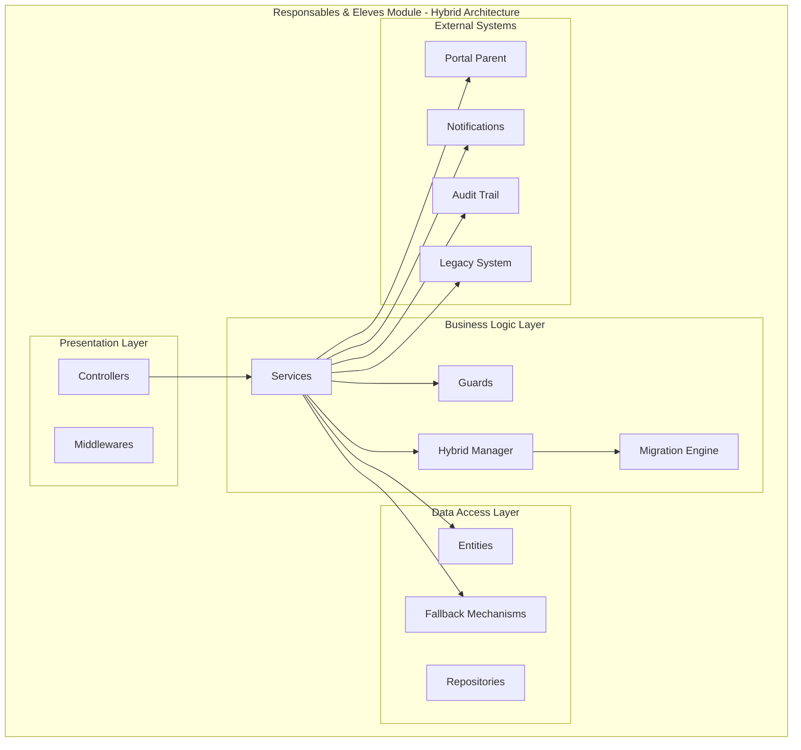

**Diagram sources**
- [responsables-eleves.controller.ts](file://backend/src/modules/responsables-eleves/controllers/responsables-eleves.controller.ts)
- [parents.service.ts](file://backend/src/modules/responsables-eleves/services/parents.service.ts)
- [eleves.controller.ts](file://backend/src/modules/eleves/controllers/eleves.controller.ts)
- [eleves.service.ts](file://backend/src/modules/eleves/services/eleves.service.ts)

**Section sources**
- [index.ts](file://backend/src/modules/responsables-eleves/index.ts)
- [index.ts](file://backend/src/modules/eleves/index.ts)

## Core Entities

### Student Entity (Eleve)

The Student entity represents individual learners enrolled in the educational institution with comprehensive personal and academic information.

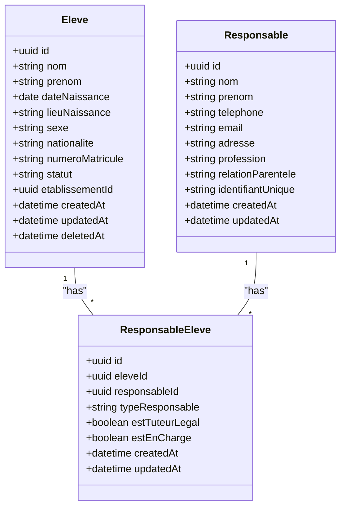

**Diagram sources**
- [eleve.entity.ts](file://backend/src/modules/eleves/entities/eleve.entity.ts)
- [responsable-eleve.entity.ts](file://backend/src/modules/responsables-eleves/entities/responsable-eleve.entity.ts)

### Entity Relationships

The relationship between students and their responsible parties is managed through a junction table that captures the nature of the relationship and permissions.

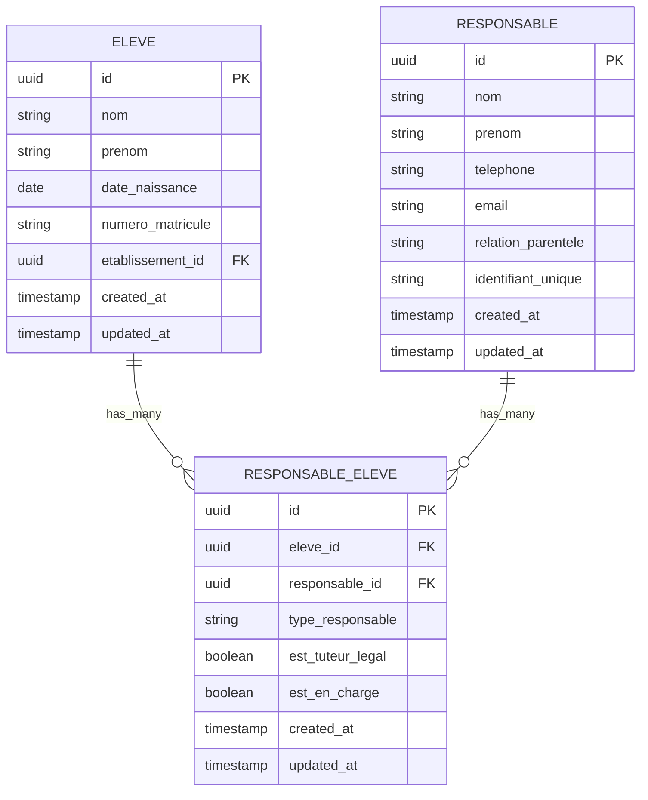

**Diagram sources**
- [eleve.entity.ts](file://backend/src/modules/eleves/entities/eleve.entity.ts)
- [responsable-eleve.entity.ts](file://backend/src/modules/responsables-eleves/entities/responsable-eleve.entity.ts)

**Section sources**
- [eleve.entity.ts](file://backend/src/modules/eleves/entities/eleve.entity.ts)
- [responsable-eleve.entity.ts](file://backend/src/modules/responsables-eleves/entities/responsable-eleve.entity.ts)

## Hybrid Parent Management System

### Intelligent Fallback Mechanisms

The hybrid system introduces sophisticated fallback mechanisms that ensure continuity of operations even when primary systems fail:

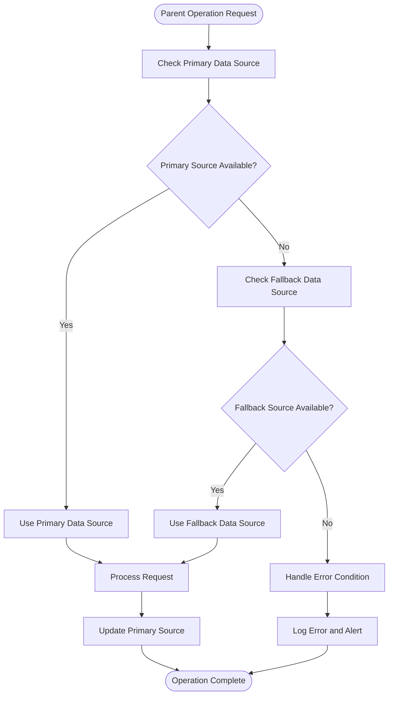

**Diagram sources**
- [parents.service.ts](file://backend/src/modules/responsables-eleves/services/parents.service.ts)
- [portal-parent.service.ts](file://backend/src/modules/responsables-eleves/services/portal-parent.service.ts)

### Dual-Source Registration System

The system supports both pre-registration and full registration scenarios through a sophisticated dual-source approach:

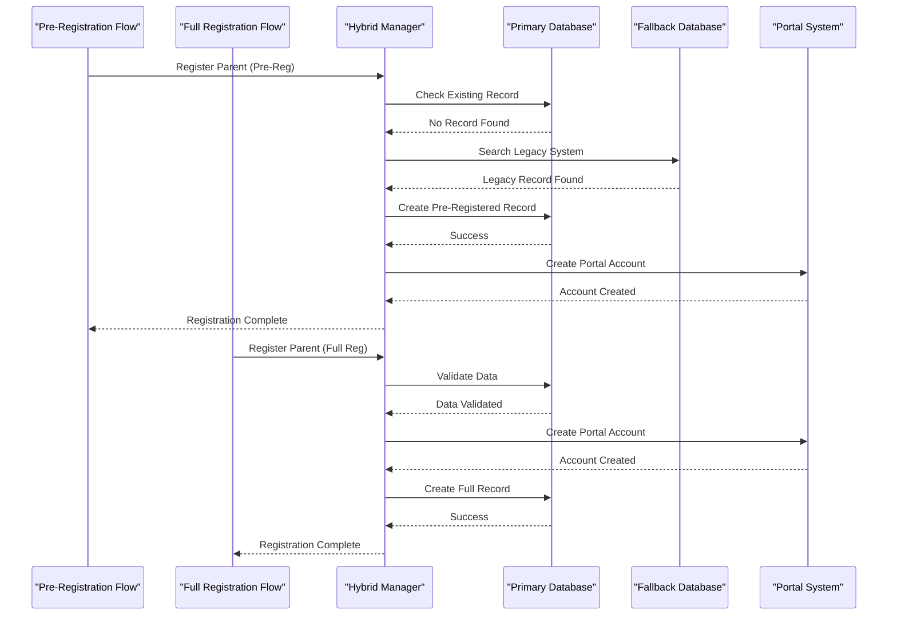

**Diagram sources**
- [parents.service.ts](file://backend/src/modules/responsables-eleves/services/parents.service.ts)
- [portal-parent.service.ts](file://backend/src/modules/responsables-eleves/services/portal-parent.service.ts)

### Automatic Migration System

The hybrid system includes an automatic migration mechanism that seamlessly transfers data between systems:

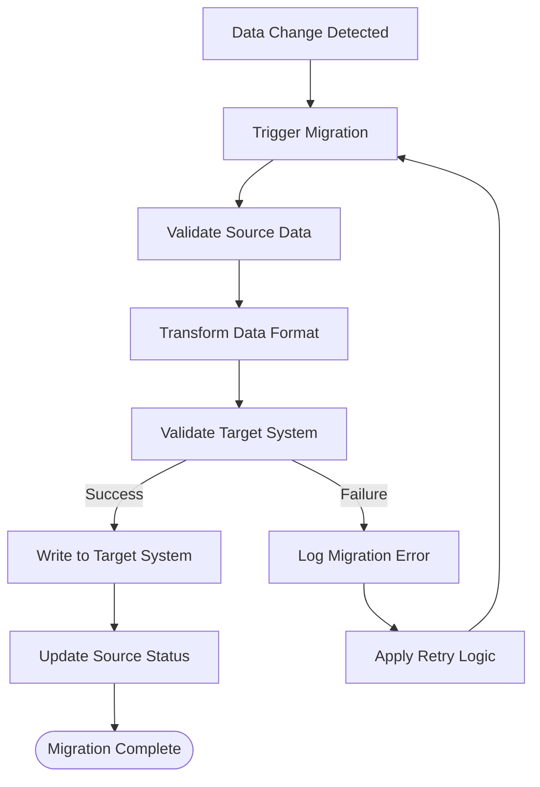

**Diagram sources**
- [parents.service.ts](file://backend/src/modules/responsables-eleves/services/parents.service.ts)

**Section sources**
- [parents.service.ts](file://backend/src/modules/responsables-eleves/services/parents.service.ts)
- [portal-parent.service.ts](file://backend/src/modules/responsables-eleves/services/portal-parent.service.ts)

## API Controllers

### Students Controller

The Students controller manages CRUD operations for student records with comprehensive validation and authorization.

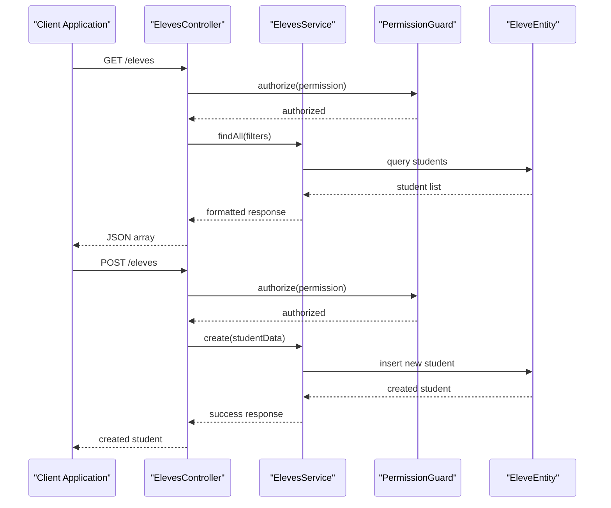

**Diagram sources**
- [eleves.controller.ts](file://backend/src/modules/eleves/controllers/eleves.controller.ts)
- [eleves.service.ts](file://backend/src/modules/eleves/services/eleves.service.ts)

### Guardians Controller

The Guardians controller manages parent/guardian information with portal access capabilities and hybrid system integration.

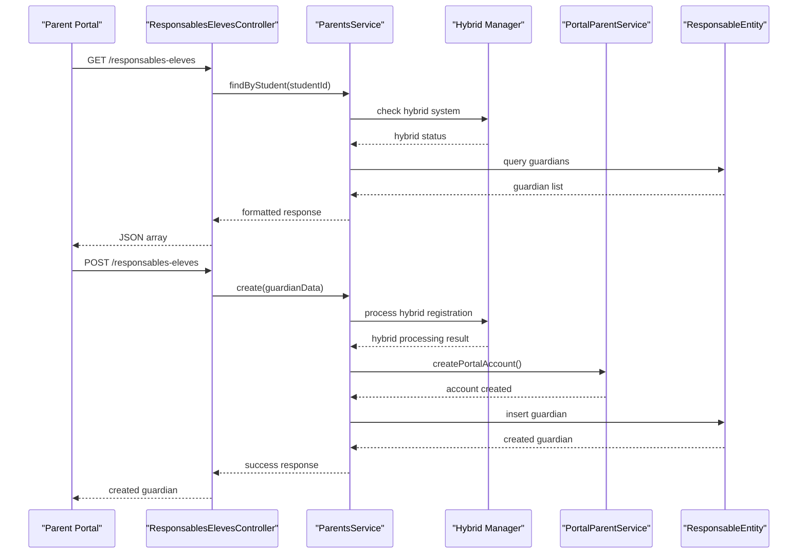

**Diagram sources**
- [responsables-eleves.controller.ts](file://backend/src/modules/responsables-eleves/controllers/responsables-eleves.controller.ts)
- [parents.service.ts](file://backend/src/modules/responsables-eleves/services/parents.service.ts)
- [portal-parent.service.ts](file://backend/src/modules/responsables-eleves/services/portal-parent.service.ts)

**Section sources**
- [eleves.controller.ts](file://backend/src/modules/eleves/controllers/eleves.controller.ts)
- [responsables-eleves.controller.ts](file://backend/src/modules/responsables-eleves/controllers/responsables-eleves.controller.ts)

## Business Services

### Parents Service

The Parents service handles all guardian-related business logic including portal account creation, relationship management, access control, and hybrid system coordination.

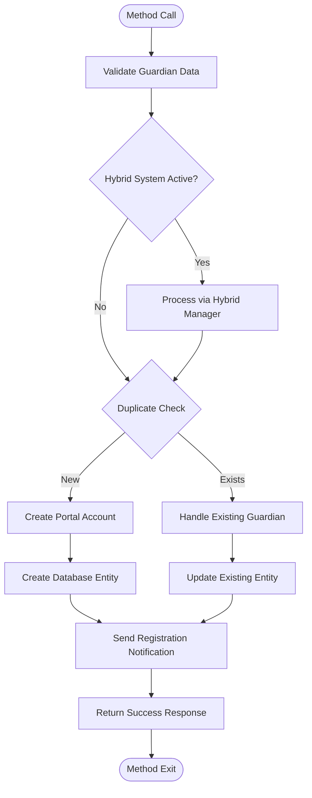

**Diagram sources**
- [parents.service.ts](file://backend/src/modules/responsables-eleves/services/parents.service.ts)
- [portal-parent.service.ts](file://backend/src/modules/responsables-eleves/services/portal-parent.service.ts)

### Students Service

The Students service manages student lifecycle operations with comprehensive data validation, relationship maintenance, and hybrid system integration.

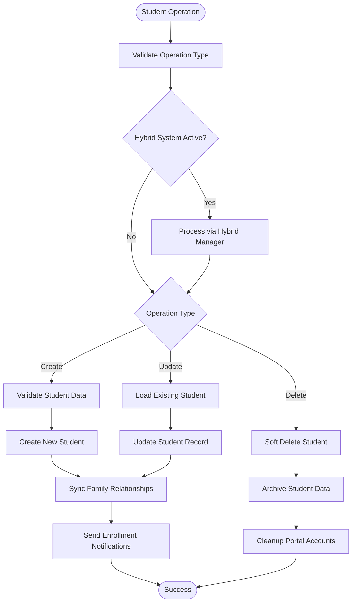

**Diagram sources**
- [eleves.service.ts](file://backend/src/modules/eleves/services/eleves.service.ts)

**Section sources**
- [parents.service.ts](file://backend/src/modules/responsables-eleves/services/parents.service.ts)
- [portal-parent.service.ts](file://backend/src/modules/responsables-eleves/services/portal-parent.service.ts)
- [eleves.service.ts](file://backend/src/modules/eleves/services/eleves.service.ts)

## Security & Access Control

### Parent Access Guard

The Parent Access Guard enforces strict security policies ensuring parents can only access their child's information with enhanced hybrid system awareness.

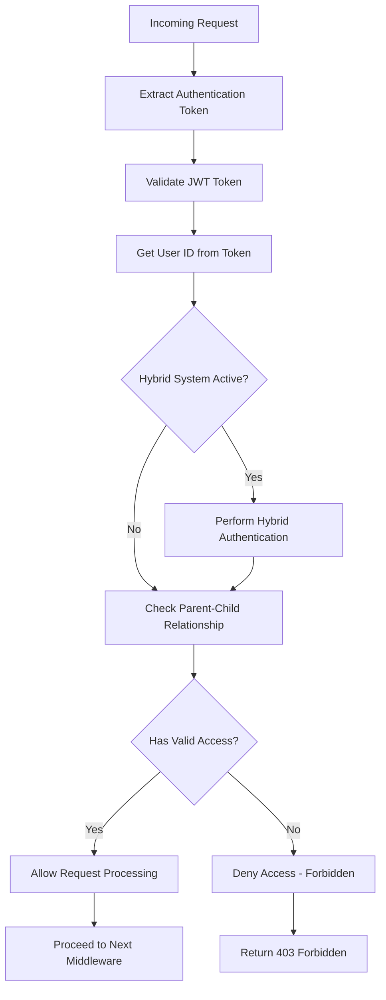

**Diagram sources**
- [parent-access.guard.ts](file://backend/src/modules/responsables-eleves/middlewares/parent-access.guard.ts)

### Permission-Based Authorization

The system implements role-based access control with granular permissions for different user types and enhanced hybrid system support:

- **Administrators**: Full access to all student and guardian records across hybrid systems
- **Teachers**: Read-only access to students in their classes with fallback mechanisms
- **Parents/Guardians**: Limited access to their own children's information with dual-source verification
- **School Staff**: Access based on department and position with automatic system switching

**Section sources**
- [parent-access.guard.ts](file://backend/src/modules/responsables-eleves/middlewares/parent-access.guard.ts)

## Database Schema

### Migration Implementation

The database schema was designed with comprehensive foreign key relationships, indexing strategies, and hybrid system support for optimal performance.

```mermaid
erDiagram
ELEVE {
uuid id PK
string nom
string prenom
date date_naissance
string lieu_naissance
string sexe
string nationalite
string numero_matricule UK
string statut
uuid etablissement_id FK
timestamp created_at
timestamp updated_at
timestamp deleted_at
}
RESPONSABLE {
uuid id PK
string nom
string prenom
string telephone
string email
string adresse
string profession
string relation_parentele
string identifiant_unique UK
timestamp created_at
timestamp updated_at
timestamp deleted_at
}
RESPONSABLE_ELEVE {
uuid id PK
uuid eleve_id FK
uuid responsable_id FK
string type_responsable
boolean est_tuteur_legal
boolean est_en_charge
timestamp created_at
timestamp updated_at
}
ELEVE ||--o{ RESPONSABLE_ELEVE : "has_many"
RESPONSABLE ||--o{ RESPONSABLE_ELEVE : "has_many"
}
```

**Diagram sources**
- [014-responsables-eleves.ts](file://backend/database/migrations/014-responsables-eleves.ts)
- [024-eleve-champs-additionnels.sql](file://backend/database/migrations/024-eleve-champs-additionnels.sql)
- [025-responsable-champs-additionnels.sql](file://backend/database/migrations/025-responsable-champs-additionnels.sql)

### Additional Fields Enhancement

Recent enhancements expanded the system to support more comprehensive student and guardian information with deprecated field support:

- **Student Additional Fields**: Enhanced medical information, emergency contacts, and academic preferences
- **Guardian Additional Fields**: Extended contact methods, professional information, and relationship details
- **Deprecated Fields**: Legacy parent fields with migration guidance for seamless transition

**Section sources**
- [014-responsables-eleves.ts](file://backend/database/migrations/014-responsables-eleves.ts)
- [024-eleve-champs-additionnels.sql](file://backend/database/migrations/024-eleve-champs-additionnels.sql)
- [025-responsable-champs-additionnels.sql](file://backend/database/migrations/025-responsable-champs-additionnels.sql)

## Migration System

### Automatic Migration Engine

The hybrid system includes a sophisticated automatic migration engine that handles data transformation and system transitions:

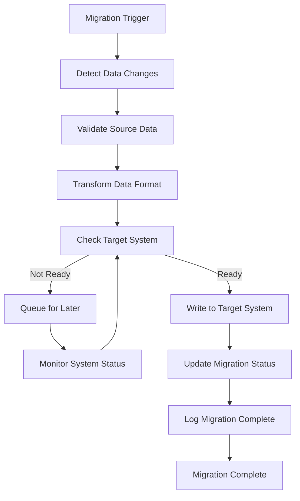

**Diagram sources**
- [parents.service.ts](file://backend/src/modules/responsables-eleves/services/parents.service.ts)

### Deprecated Field Migration

The system provides comprehensive support for migrating deprecated parent fields with clear guidance:

- **Legacy Parent Fields**: Deprecated fields with automatic detection and migration
- **Migration Scripts**: Automated scripts for field transformation and data preservation
- **Backward Compatibility**: Maintains compatibility during transition period
- **Migration Timeline**: Clear timeline and rollback procedures for field changes

**Section sources**
- [052-approche-hybride-parents.sql](file://backend/database/migrations/052-approche-hybride-parents.sql)
- [deploy-approche-hybride-parents.sh](file://scripts/deploy-approche-hybride-parents.sh)

## Integration Points

### Portal Parent Integration

The module integrates with the parent portal system for self-service capabilities with hybrid system support:

- **Self-Registration**: Parents can register their children's information with dual-source verification
- **Profile Management**: Parents can update their contact information across hybrid systems
- **Communication**: Secure messaging between parents and school staff with fallback mechanisms
- **Document Sharing**: Access to academic reports and school communications with automatic synchronization

### Notification System Integration

Automated notifications are triggered for various events with enhanced hybrid system support:

- **Enrollment Confirmation**: Automatic notifications when students are registered across systems
- **Guardian Updates**: Alerts when guardian information changes with dual-source validation
- **Academic Milestones**: Notifications for grade updates and achievements with fallback mechanisms
- **School Announcements**: Important school-wide communications with system redundancy

### Audit Trail Integration

All operations are logged for compliance and security with comprehensive hybrid system tracking:

- **Data Changes**: Complete audit trail of all modifications across hybrid systems
- **Access Logs**: Monitoring of who accessed what information with system tracking
- **System Events**: Tracking of system-generated actions and migration activities
- **Compliance Reporting**: Support for regulatory requirements across all system components

## Implementation Details

### Data Validation Strategies

The module implements comprehensive data validation at multiple levels with hybrid system awareness:

1. **DTO Validation**: Input validation using class-validator decorators
2. **Business Logic Validation**: Domain-specific business rules with fallback mechanisms
3. **Database Constraints**: Foreign key relationships and unique constraints
4. **Hybrid Validation**: Cross-system validation for data consistency
5. **Audit Validation**: Compliance with data retention policies across systems

### Error Handling Patterns

Robust error handling ensures system stability with intelligent fallback mechanisms:

- **Validation Errors**: Clear feedback for data input issues with system-specific messages
- **Business Rule Violations**: Specific error messages for policy violations with fallback options
- **System Errors**: Generic messages for unexpected failures with automatic recovery
- **Hybrid Errors**: Special handling for cross-system failures with migration support
- **Logging**: Comprehensive logging for debugging and auditing across all systems

### Performance Optimization

Several optimization strategies are implemented with hybrid system considerations:

- **Indexing**: Strategic database indexing for frequently queried fields across systems
- **Caching**: Redis caching for frequently accessed lookup data with fallback mechanisms
- **Pagination**: Efficient pagination for large datasets with system-aware filtering
- **Lazy Loading**: Deferred loading of related entities with automatic system selection
- **Hybrid Caching**: Multi-tier caching with primary and fallback storage systems

**Section sources**
- [responsables-eleves.dto.ts](file://backend/src/modules/responsables-eleves/dto/responsables-eleves.dto.ts)
- [eleves.dto.ts](file://backend/src/modules/eleves/dto/eleves.dto.ts)

## Troubleshooting Guide

### Common Issues and Solutions

**Issue**: Parents cannot access their child's information
- **Cause**: Incorrect parent-child relationship mapping or hybrid system failure
- **Solution**: Verify RESPONSABLE_ELEVE table entries, check hybrid system status, and re-sync relationships

**Issue**: Duplicate student registration errors
- **Cause**: Duplicate matricule numbers or hybrid system conflicts
- **Solution**: Check existing student records across systems and use unique identifiers

**Issue**: Portal account creation failures
- **Cause**: Email verification or unique identifier conflicts in hybrid environment
- **Solution**: Validate portal service integration, check hybrid system status, and resolve unique constraint violations

**Issue**: Performance degradation with large datasets
- **Cause**: Missing database indexes or inefficient queries in hybrid system
- **Solution**: Review query execution plans, add appropriate indexes, and optimize hybrid system queries

**Issue**: Hybrid system migration failures
- **Cause**: Data transformation errors or system unavailability
- **Solution**: Check migration logs, validate data formats, and monitor system health

### Debugging Tools

The system provides several debugging capabilities with hybrid system support:

- **Audit Logs**: Complete transaction history for all operations across hybrid systems
- **Request Tracing**: Distributed tracing for complex operation chains with system tracking
- **Performance Metrics**: Real-time monitoring of system performance across all components
- **Error Reports**: Automated error reporting and notification with hybrid system alerts
- **Hybrid Diagnostics**: Specialized tools for diagnosing cross-system issues

**Section sources**
- [parents.service.ts](file://backend/src/modules/responsables-eleves/services/parents.service.ts)
- [eleves.service.ts](file://backend/src/modules/eleves/services/eleves.service.ts)

## Conclusion

The Responsables & Eleves Module represents a comprehensive solution for managing the critical relationship between students and their guardians in educational institutions. The module successfully balances functionality, security, and performance while maintaining compliance with educational data protection requirements.

**Updated** The recent enhancement with the revolutionary hybrid approach significantly strengthens the module's capabilities by introducing intelligent fallback mechanisms, automatic migration system, and comprehensive documentation support. The implementation now supports both pre-registration and full registration scenarios through a sophisticated dual-source system.

Key strengths of the enhanced implementation include:

- **Hybrid Architecture**: Revolutionary dual-source system with intelligent fallback mechanisms
- **Automatic Migration**: Seamless data transfer between systems with comprehensive error handling
- **Enhanced Security**: Robust access control and data protection with hybrid system awareness
- **Scalability**: Optimized for growing educational institutions with intelligent system switching
- **Integration Ready**: Seamless integration with portal systems, notification services, and legacy systems
- **Compliance**: Built-in audit trails and data governance features across all systems
- **Migration Support**: Comprehensive deprecated field migration with clear guidance and rollback procedures

The module provides a solid foundation for educational administration while supporting the evolving needs of modern school management systems. Its hybrid design allows for future enhancements while maintaining system stability and data integrity across multiple operational environments.