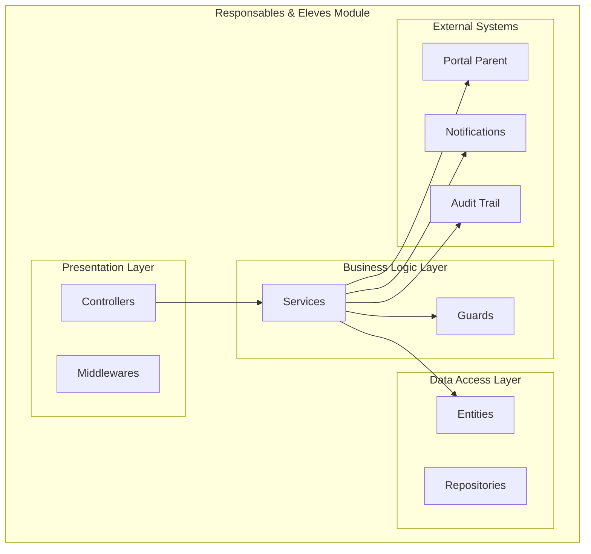
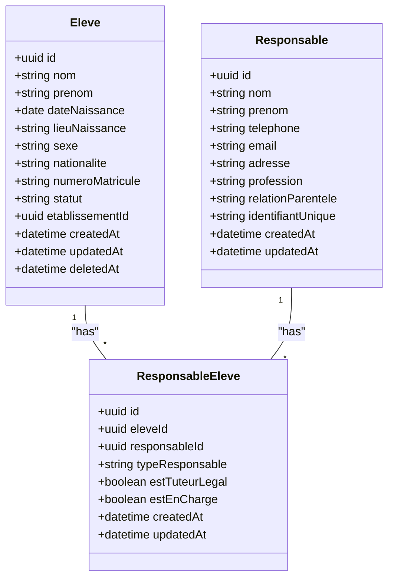
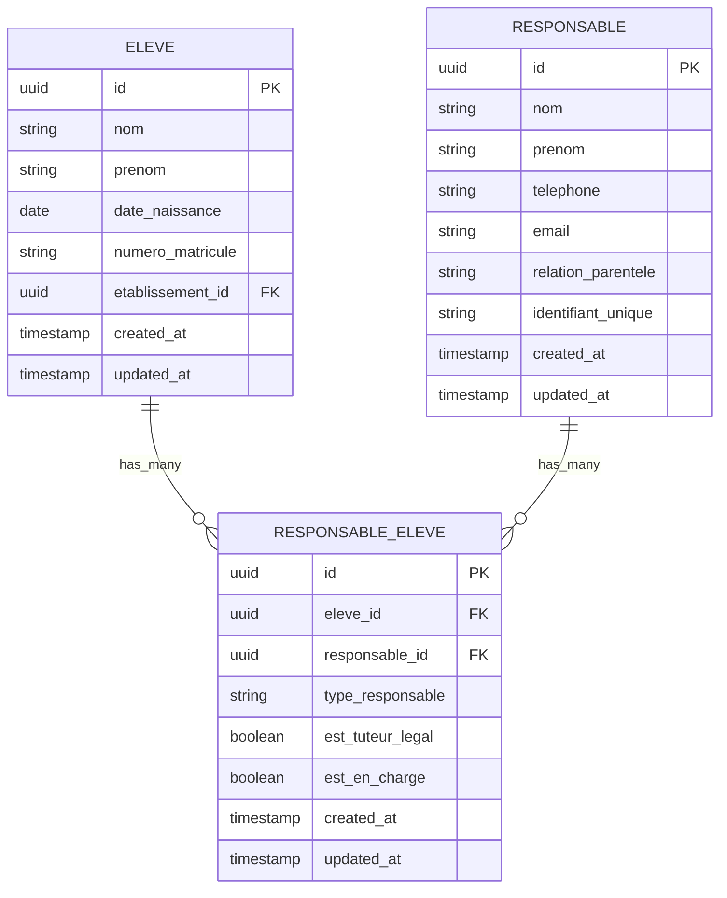
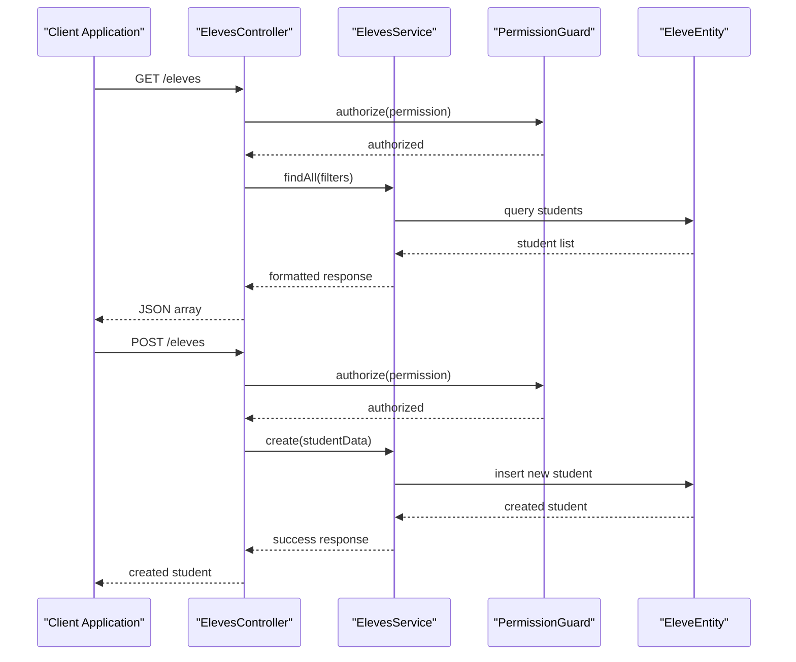
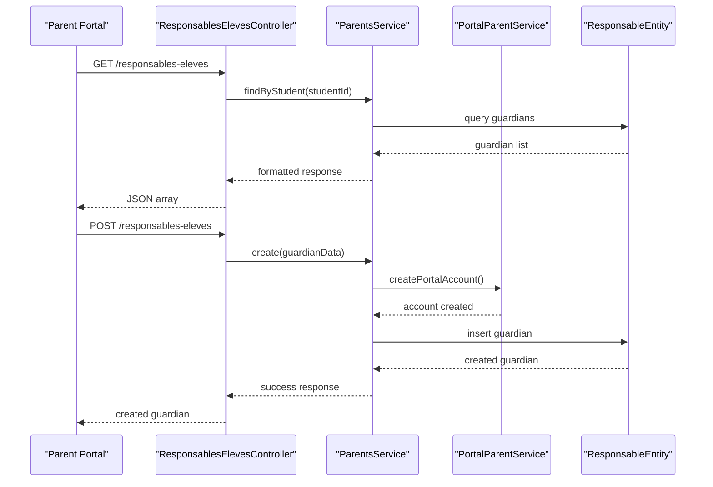
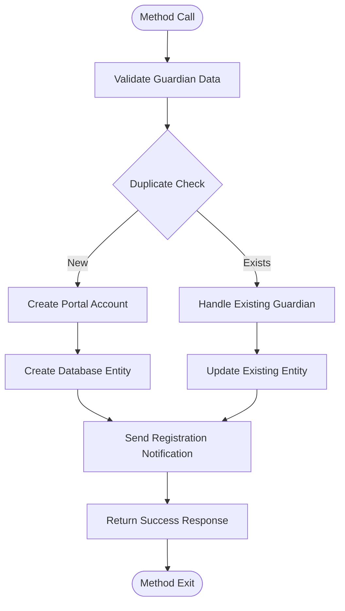
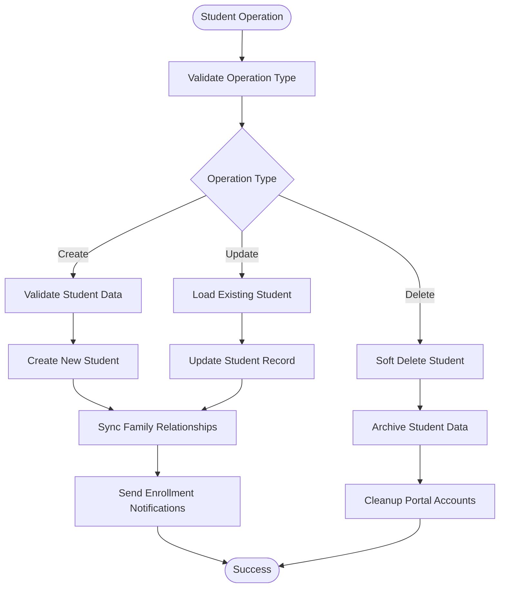
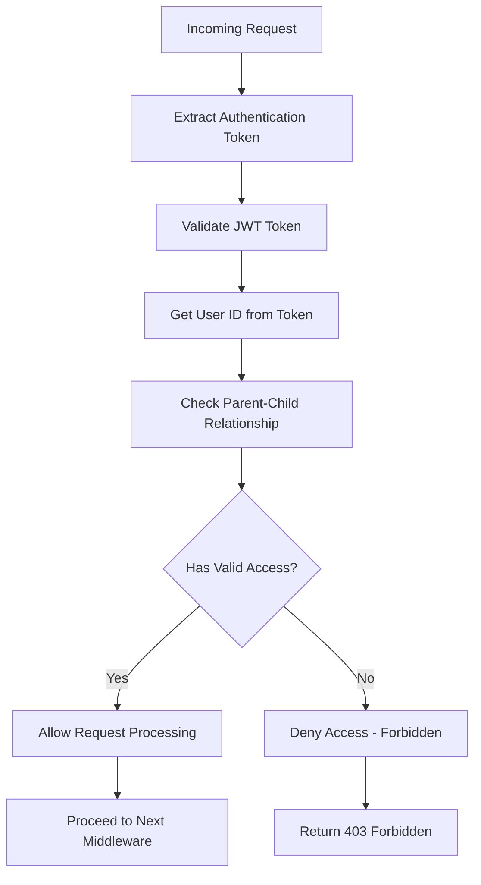
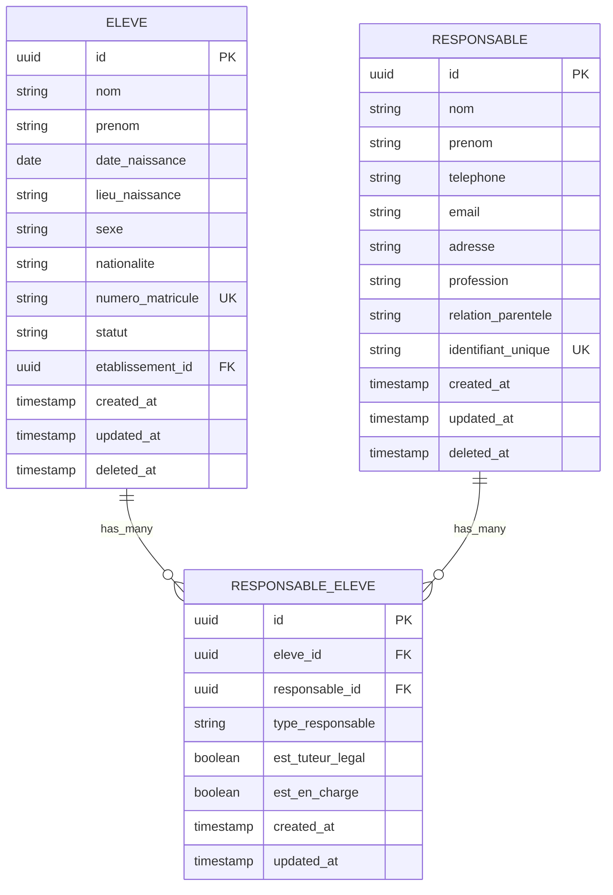

# Responsables & Eleves Module

<cite>
**Referenced Files in This Document**
- [responsables-eleves.controller.ts](file://backend/src/modules/responsables-eleves/controllers/responsables-eleves.controller.ts)
- [responsables-eleves.dto.ts](file://backend/src/modules/responsables-eleves/dto/responsables-eleves.dto.ts)
- [responsable-eleve.entity.ts](file://backend/src/modules/responsables-eleves/entities/responsable-eleve.entity.ts)
- [parent-access.guard.ts](file://backend/src/modules/responsables-eleves/middlewares/parent-access.guard.ts)
- [parents.service.ts](file://backend/src/modules/responsables-eleves/services/parents.service.ts)
- [portal-parent.service.ts](file://backend/src/modules/responsables-eleves/services/portal-parent.service.ts)
- [eleves.controller.ts](file://backend/src/modules/eleves/controllers/eleves.controller.ts)
- [eleves.dto.ts](file://backend/src/modules/eleves/dto/eleves.dto.ts)
- [eleve.entity.ts](file://backend/src/modules/eleves/entities/eleve.entity.ts)
- [eleves.service.ts](file://backend/src/modules/eleves/services/eleves.service.ts)
- [014-responsables-eleves.ts](file://backend/database/migrations/014-responsables-eleves.ts)
- [024-eleve-champs-additionnels.sql](file://backend/database/migrations/024-eleve-champs-additionnels.sql)
- [025-responsable-champs-additionnels.sql](file://backend/database/migrations/025-responsable-champs-additionnels.sql)
- [index.ts](file://backend/src/modules/responsables-eleves/index.ts)
- [index.ts](file://backend/src/modules/eleves/index.ts)
</cite>

## Table of Contents
1. [Introduction](#introduction)
2. [Module Architecture](#module-architecture)
3. [Core Entities](#core-entities)
4. [API Controllers](#api-controllers)
5. [Business Services](#business-services)
6. [Security & Access Control](#security--access-control)
7. [Database Schema](#database-schema)
8. [Integration Points](#integration-points)
9. [Implementation Details](#implementation-details)
10. [Troubleshooting Guide](#troubleshooting-guide)
11. [Conclusion](#conclusion)

## Introduction

The Responsables & Eleves Module is a critical component of the eLISAschool educational management system that handles the relationship between students (eleves) and their legal guardians or responsible parties (responsables). This module manages student enrollment, guardian information, family relationships, and portal access for parents/guardians.

The module consists of two primary components:
- **Eleves Module**: Manages student records, personal information, academic history, and enrollment status
- **Responsables Module**: Manages guardian/parent information, family relationships, and portal access permissions

This system ensures proper segregation of concerns while maintaining the essential connection between students and their responsible parties for educational administration and communication purposes.

## Module Architecture

The module follows a layered architecture pattern with clear separation of concerns:

**Diagram sources**
- [responsables-eleves.controller.ts](file://backend/src/modules/responsables-eleves/controllers/responsables-eleves.controller.ts)
- [parents.service.ts](file://backend/src/modules/responsables-eleves/services/parents.service.ts)
- [eleves.controller.ts](file://backend/src/modules/eleves/controllers/eleves.controller.ts)
- [eleves.service.ts](file://backend/src/modules/eleves/services/eleves.service.ts)

**Section sources**
- [index.ts](file://backend/src/modules/responsables-eleves/index.ts)
- [index.ts](file://backend/src/modules/eleves/index.ts)

## Core Entities

### Student Entity (Eleve)

The Student entity represents individual learners enrolled in the educational institution with comprehensive personal and academic information.

**Diagram sources**
- [eleve.entity.ts](file://backend/src/modules/eleves/entities/eleve.entity.ts)
- [responsable-eleve.entity.ts](file://backend/src/modules/responsables-eleves/entities/responsable-eleve.entity.ts)

### Entity Relationships

The relationship between students and their responsible parties is managed through a junction table that captures the nature of the relationship and permissions.

**Diagram sources**
- [eleve.entity.ts](file://backend/src/modules/eleves/entities/eleve.entity.ts)
- [responsable-eleve.entity.ts](file://backend/src/modules/responsables-eleves/entities/responsable-eleve.entity.ts)

**Section sources**
- [eleve.entity.ts](file://backend/src/modules/eleves/entities/eleve.entity.ts)
- [responsable-eleve.entity.ts](file://backend/src/modules/responsables-eleves/entities/responsable-eleve.entity.ts)

## API Controllers

### Students Controller

The Students controller manages CRUD operations for student records with comprehensive validation and authorization.

**Diagram sources**
- [eleves.controller.ts](file://backend/src/modules/eleves/controllers/eleves.controller.ts)
- [eleves.service.ts](file://backend/src/modules/eleves/services/eleves.service.ts)

### Guardians Controller

The Guardians controller manages parent/guardian information with portal access capabilities.

**Diagram sources**
- [responsables-eleves.controller.ts](file://backend/src/modules/responsables-eleves/controllers/responsables-eleves.controller.ts)
- [parents.service.ts](file://backend/src/modules/responsables-eleves/services/parents.service.ts)
- [portal-parent.service.ts](file://backend/src/modules/responsables-eleves/services/portal-parent.service.ts)

**Section sources**
- [eleves.controller.ts](file://backend/src/modules/eleves/controllers/eleves.controller.ts)
- [responsables-eleves.controller.ts](file://backend/src/modules/responsables-eleves/controllers/responsables-eleves.controller.ts)

## Business Services

### Parents Service

The Parents service handles all guardian-related business logic including portal account creation, relationship management, and access control.

**Diagram sources**
- [parents.service.ts](file://backend/src/modules/responsables-eleves/services/parents.service.ts)
- [portal-parent.service.ts](file://backend/src/modules/responsables-eleves/services/portal-parent.service.ts)

### Students Service

The Students service manages student lifecycle operations with comprehensive data validation and relationship maintenance.

**Diagram sources**
- [eleves.service.ts](file://backend/src/modules/eleves/services/eleves.service.ts)

**Section sources**
- [parents.service.ts](file://backend/src/modules/responsables-eleves/services/parents.service.ts)
- [portal-parent.service.ts](file://backend/src/modules/responsables-eleves/services/portal-parent.service.ts)
- [eleves.service.ts](file://backend/src/modules/eleves/services/eleves.service.ts)

## Security & Access Control

### Parent Access Guard

The Parent Access Guard enforces strict security policies ensuring parents can only access their child's information.

**Diagram sources**
- [parent-access.guard.ts](file://backend/src/modules/responsables-eleves/middlewares/parent-access.guard.ts)

### Permission-Based Authorization

The system implements role-based access control with granular permissions for different user types:

- **Administrators**: Full access to all student and guardian records
- **Teachers**: Read-only access to students in their classes
- **Parents/Guardians**: Limited access to their own children's information
- **School Staff**: Access based on department and position

**Section sources**
- [parent-access.guard.ts](file://backend/src/modules/responsables-eleves/middlewares/parent-access.guard.ts)

## Database Schema

### Migration Implementation

The database schema was designed with comprehensive foreign key relationships and indexing strategies for optimal performance.

**Diagram sources**
- [014-responsables-eleves.ts](file://backend/database/migrations/014-responsables-eleves.ts)
- [024-eleve-champs-additionnels.sql](file://backend/database/migrations/024-eleve-champs-additionnels.sql)
- [025-responsable-champs-additionnels.sql](file://backend/database/migrations/025-responsable-champs-additionnels.sql)

### Additional Fields Enhancement

Recent enhancements expanded the system to support more comprehensive student and guardian information:

- **Student Additional Fields**: Enhanced medical information, emergency contacts, and academic preferences
- **Guardian Additional Fields**: Extended contact methods, professional information, and relationship details

**Section sources**
- [014-responsables-eleves.ts](file://backend/database/migrations/014-responsables-eleves.ts)
- [024-eleve-champs-additionnels.sql](file://backend/database/migrations/024-eleve-champs-additionnels.sql)
- [025-responsable-champs-additionnels.sql](file://backend/database/migrations/025-responsable-champs-additionnels.sql)

## Integration Points

### Portal Parent Integration

The module integrates with the parent portal system for self-service capabilities:

- **Self-Registration**: Parents can register their children's information
- **Profile Management**: Parents can update their contact information
- **Communication**: Secure messaging between parents and school staff
- **Document Sharing**: Access to academic reports and school communications

### Notification System Integration

Automated notifications are triggered for various events:

- **Enrollment Confirmation**: Automatic notifications when students are registered
- **Guardian Updates**: Alerts when guardian information changes
- **Academic Milestones**: Notifications for grade updates and achievements
- **School Announcements**: Important school-wide communications

### Audit Trail Integration

All operations are logged for compliance and security:

- **Data Changes**: Complete audit trail of all modifications
- **Access Logs**: Monitoring of who accessed what information
- **System Events**: Tracking of system-generated actions
- **Compliance Reporting**: Support for regulatory requirements

## Implementation Details

### Data Validation Strategies

The module implements comprehensive data validation at multiple levels:

1. **DTO Validation**: Input validation using class-validator decorators
2. **Business Logic Validation**: Domain-specific business rules
3. **Database Constraints**: Foreign key relationships and unique constraints
4. **Audit Validation**: Compliance with data retention policies

### Error Handling Patterns

Robust error handling ensures system stability:

- **Validation Errors**: Clear feedback for data input issues
- **Business Rule Violations**: Specific error messages for policy violations
- **System Errors**: Generic messages for unexpected failures
- **Logging**: Comprehensive logging for debugging and auditing

### Performance Optimization

Several optimization strategies are implemented:

- **Indexing**: Strategic database indexing for frequently queried fields
- **Caching**: Redis caching for frequently accessed lookup data
- **Pagination**: Efficient pagination for large datasets
- **Lazy Loading**: Deferred loading of related entities

**Section sources**
- [responsables-eleves.dto.ts](file://backend/src/modules/responsables-eleves/dto/responsables-eleves.dto.ts)
- [eleves.dto.ts](file://backend/src/modules/eleves/dto/eleves.dto.ts)

## Troubleshooting Guide

### Common Issues and Solutions

**Issue**: Parents cannot access their child's information
- **Cause**: Incorrect parent-child relationship mapping
- **Solution**: Verify RESPONSABLE_ELEVE table entries and re-sync relationships

**Issue**: Duplicate student registration errors
- **Cause**: Duplicate matricule numbers
- **Solution**: Check existing student records and use unique identifiers

**Issue**: Portal account creation failures
- **Cause**: Email verification or unique identifier conflicts
- **Solution**: Validate portal service integration and unique constraint violations

**Issue**: Performance degradation with large datasets
- **Cause**: Missing database indexes or inefficient queries
- **Solution**: Review query execution plans and add appropriate indexes

### Debugging Tools

The system provides several debugging capabilities:

- **Audit Logs**: Complete transaction history for all operations
- **Request Tracing**: Distributed tracing for complex operation chains
- **Performance Metrics**: Real-time monitoring of system performance
- **Error Reports**: Automated error reporting and notification

**Section sources**
- [parents.service.ts](file://backend/src/modules/responsables-eleves/services/parents.service.ts)
- [eleves.service.ts](file://backend/src/modules/eleves/services/eleves.service.ts)

## Conclusion

The Responsables & Eleves Module represents a comprehensive solution for managing the critical relationship between students and their guardians in educational institutions. The module successfully balances functionality, security, and performance while maintaining compliance with educational data protection requirements.

Key strengths of the implementation include:

- **Modular Design**: Clear separation of concerns between students and guardians
- **Security Focus**: Robust access control and data protection measures
- **Scalability**: Optimized for growing educational institutions
- **Integration Ready**: Seamless integration with portal systems and notification services
- **Compliance**: Built-in audit trails and data governance features

The module provides a solid foundation for educational administration while supporting the evolving needs of modern school management systems. Its design allows for future enhancements while maintaining system stability and data integrity.