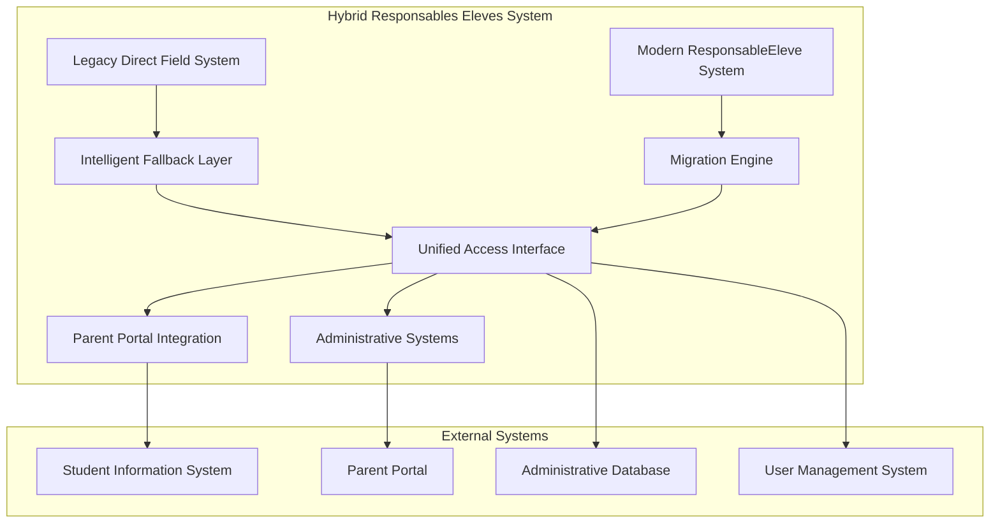
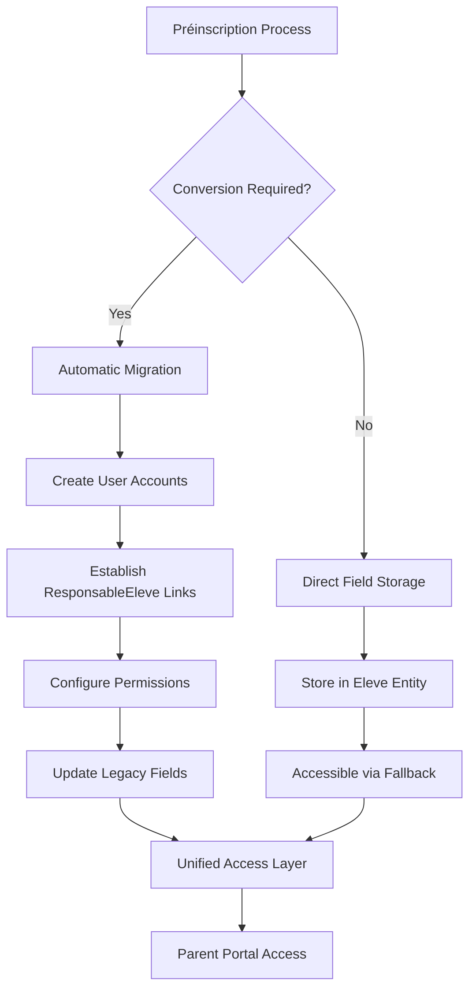
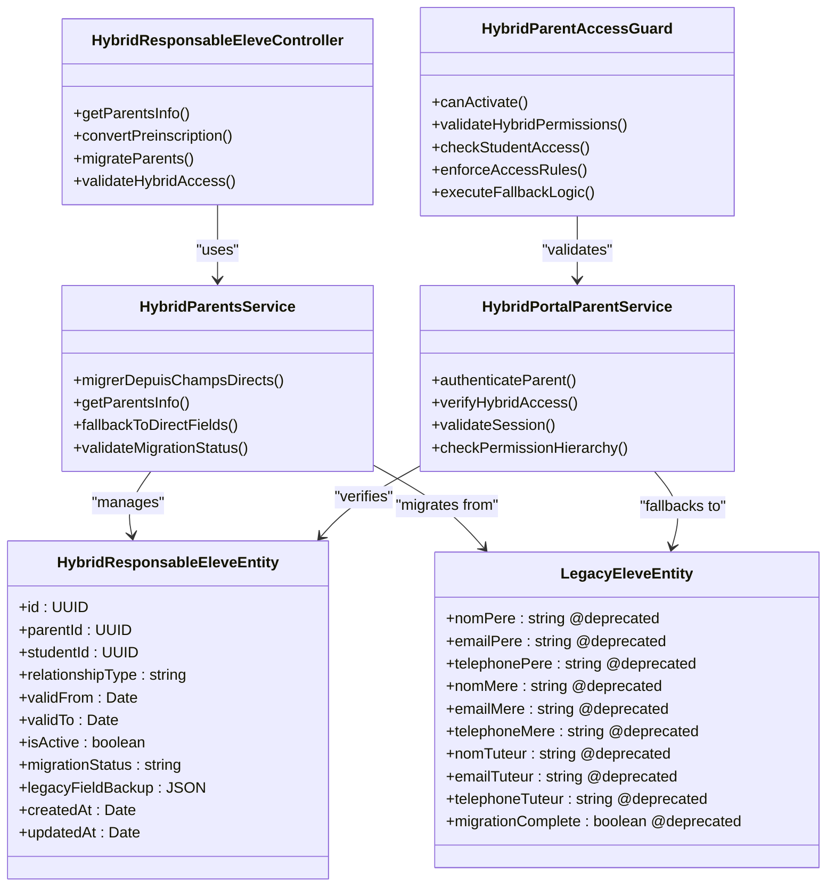
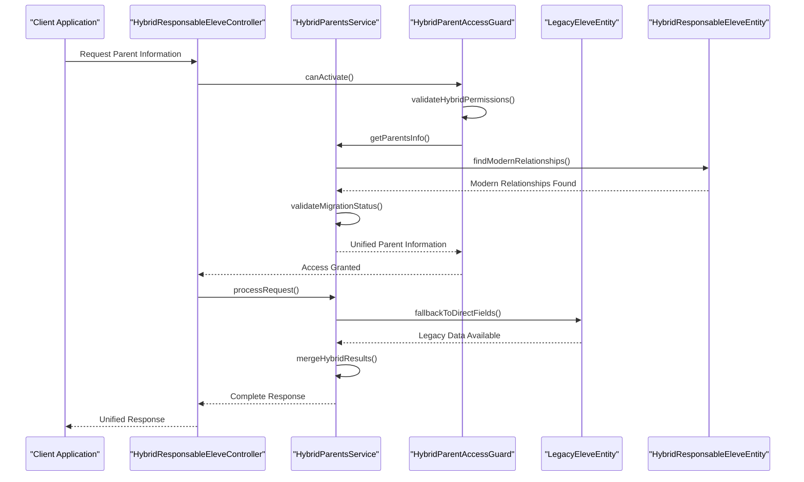
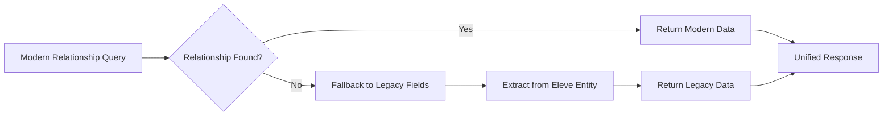

# Responsables Eleves Coherence Analysis

<cite>
**Referenced Files in This Document**
- [ANALYSE-COHERENCE-RESPONSABLES-ELEVES.md](file://ANALYSE-COHERENCE-RESPONSABLES-ELEVES.md)
- [IMPLEMENTATION-RESPONSABLES-ELEVES.md](file://IMPLEMENTATION-RESPONSABLES-ELEVES.md)
- [IMPLEMENTATION-APPROCHE-HYBRIDE-PARENTS.md](file://IMPLEMENTATION-APPROCHE-HYBRIDE-PARENTS.md)
- [RECOMMANDATIONS-GESTION-PARENTS.md](file://RECOMMANDATIONS-GESTION-PARENTS.md)
- [014-responsables-eleves.ts](file://backend/src/database/migrations/014-responsables-eleves.ts)
- [052-approche-hybride-parents.sql](file://backend/database/migrations/052-approche-hybride-parents.sql)
- [responsables-eleves.controller.ts](file://backend/src/modules/responsables-eleves/controllers/responsables-eleves.controller.ts)
- [responsables-eleves.dto.ts](file://backend/src/modules/responsables-eleves/dto/responsables-eleves.dto.ts)
- [responsable-eleve.entity.ts](file://backend/src/modules/responsables-eleves/entities/responsable-eleve.entity.ts)
- [parent-access.guard.ts](file://backend/src/modules/responsables-eleves/middlewares/parent-access.guard.ts)
- [parents.service.ts](file://backend/src/modules/responsables-eleves/services/parents.service.ts)
- [portal-parent.service.ts](file://backend/src/modules/responsables-eleves/services/portal-parent.service.ts)
- [eleves.controller.ts](file://backend/src/modules/eleves/controllers/eleves.controller.ts)
- [eleves.service.ts](file://backend/src/modules/eleves/services/eleves.service.ts)
- [deploy-approche-hybride-parents.sh](file://scripts/deploy-approche-hybride-parents.sh)
</cite>

## Update Summary
**Changes Made**
- Added comprehensive analysis of the new hybrid parent management system
- Updated coherence analysis framework to cover parent-responsible relationships
- Integrated migration processes and fallback mechanisms
- Enhanced data model analysis with hybrid architecture considerations
- Added new sections covering migration strategies and implementation details

## Table of Contents
1. [Introduction](#introduction)
2. [Project Overview](#project-overview)
3. [Hybrid Parent Management System](#hybrid-parent-management-system)
4. [System Architecture](#system-architecture)
5. [Core Components Analysis](#core-components-analysis)
6. [Coherence Analysis Framework](#coherence-analysis-framework)
7. [Implementation Details](#implementation-details)
8. [Data Model Analysis](#data-model-analysis)
9. [Migration and Transition Processes](#migration-and-transition-processes)
10. [Security and Access Control](#security-and-access-control)
11. [Integration Points](#integration-points)
12. [Performance Considerations](#performance-considerations)
13. [Quality Assurance](#quality-assurance)
14. [Conclusion](#conclusion)

## Introduction

The Responsables Eleves Coherence Analysis project has evolved to encompass a comprehensive examination of the hybrid parent/guardian relationship management system within the eLISAschool educational platform. This advanced analysis addresses the transition from legacy direct field-based parent management to a sophisticated hybrid system that maintains backward compatibility while enabling modern, secure parent-student relationship management.

The project now focuses on ensuring data consistency, logical relationships, and operational coherence across both the traditional parent fields system and the new ResponsableEleve relationship management system. This dual-system approach guarantees seamless operation during the transition period while maximizing the benefits of the modernized architecture.

The analysis addresses critical aspects of parent-student relationship management, including data validation, access control mechanisms, migration processes, and integration with broader school administrative systems. This documentation serves as both a technical reference for developers and a conceptual guide for stakeholders understanding the importance of coherent parent-student relationships in educational administration.

## Project Overview

The hybrid Responsables Eleves module represents a revolutionary approach to parent-student relationship management that bridges legacy systems with modern architectural patterns. This system ensures that parent access to student information is properly authorized, validated, and maintained according to institutional policies and regulatory requirements, while preserving existing functionality.

The project consists of four primary components working in harmony:
- **Legacy Direct Field System**: Maintains parent information directly in student records for backward compatibility
- **Modern ResponsableEleve System**: Implements core functionality for parent-student relationships with granular permissions
- **Migration Engine**: Automates the transition from legacy fields to modern relationships
- **Intelligent Fallback Mechanism**: Ensures seamless operation during transition and maintenance periods



**Diagram sources**
- [IMPLEMENTATION-APPROCHE-HYBRIDE-PARENTS.md:248-293](file://IMPLEMENTATION-APPROCHE-HYBRIDE-PARENTS.md#L248-L293)
- [052-approche-hybride-parents.sql:1-200](file://backend/database/migrations/052-approche-hybride-parents.sql#L1-L200)

**Section sources**
- [ANALYSE-COHERENCE-RESPONSABLES-ELEVES.md:1-100](file://ANALYSE-COHERENCE-RESPONSABLES-ELEVES.md#L1-L100)
- [IMPLEMENTATION-APPROCHE-HYBRIDE-PARENTS.md:1-50](file://IMPLEMENTATION-APPROCHE-HYBRIDE-PARENTS.md#L1-L50)

## Hybrid Parent Management System

The hybrid parent management system represents a paradigm shift in educational administrative technology, combining the simplicity of direct field storage with the sophistication of relationship-based management. This system ensures that existing functionality remains intact while enabling the deployment of advanced features.

### System Architecture Overview

The hybrid system operates on three fundamental principles:
- **Progressive Migration**: Seamless transition from legacy fields to modern relationships
- **Intelligent Fallback**: Automatic fallback to legacy data when modern relationships are unavailable
- **Dual-Source Validation**: Coherence validation across both legacy and modern data sources



**Diagram sources**
- [IMPLEMENTATION-APPROCHE-HYBRIDE-PARENTS.md:248-293](file://IMPLEMENTATION-APPROCHE-HYBRIDE-PARENTS.md#L248-L293)
- [eleves.service.ts:466-514](file://backend/src/modules/eleves/services/eleves.service.ts#L466-L514)

### Migration Strategy Implementation

The migration strategy ensures that all existing parent information is preserved while establishing modern relationship connections. This process includes automatic account creation, relationship establishment, and permission configuration.

**Section sources**
- [IMPLEMENTATION-APPROCHE-HYBRIDE-PARENTS.md:29-45](file://IMPLEMENTATION-APPROCHE-HYBRIDE-PARENTS.md#L29-L45)
- [parents.service.ts:456-573](file://backend/src/modules/responsables-eleves/services/parents.service.ts#L456-L573)

## System Architecture

The hybrid Responsables Eleves system follows an advanced layered architecture pattern that seamlessly integrates legacy and modern components. This architecture ensures maintainability, scalability, and clear separation of responsibilities while maintaining operational coherence.



**Diagram sources**
- [responsables-eleves.controller.ts:1-200](file://backend/src/modules/responsables-eleves/controllers/responsables-eleves.controller.ts#L1-L200)
- [parents.service.ts:1-200](file://backend/src/modules/responsables-eleves/services/parents.service.ts#L1-L200)
- [portal-parent.service.ts:1-200](file://backend/src/modules/responsables-eleves/services/portal-parent.service.ts#L1-L200)
- [responsable-eleve.entity.ts:1-150](file://backend/src/modules/responsables-eleves/entities/responsable-eleve.entity.ts#L1-L150)
- [parent-access.guard.ts:1-150](file://backend/src/modules/responsables-eleves/middlewares/parent-access.guard.ts#L1-L150)

**Section sources**
- [responsables-eleves.controller.ts:1-250](file://backend/src/modules/responsables-eleves/controllers/responsables-eleves.controller.ts#L1-L250)
- [parents.service.ts:1-250](file://backend/src/modules/responsables-eleves/services/parents.service.ts#L1-L250)
- [portal-parent.service.ts:1-250](file://backend/src/modules/responsables-eleves/services/portal-parent.service.ts#L1-L250)

## Core Components Analysis

### Hybrid Data Migration Implementation

The database migration for the hybrid system establishes the foundational schema that supports both legacy and modern parent-student relationship management. This migration defines the relationships, constraints, and indexes necessary for maintaining data integrity and query performance across both systems.

Key aspects of the hybrid migration implementation include:
- **Enhanced Entity Definition**: Extension of the main relationship entity with migration status tracking
- **Legacy Field Preservation**: Maintenance of deprecated parent fields with migration indicators
- **Foreign Key Constraints**: Establishment of referential integrity between parent and student entities
- **Temporal Validity**: Support for relationship validity periods and effective date ranges
- **Index Optimization**: Strategic indexing for common query patterns and performance optimization
- **Migration State Tracking**: Comprehensive tracking of migration progress and completion status

### Advanced Business Logic Services

The hybrid service layer implements sophisticated business rules governing parent-student relationships across both legacy and modern systems. These services ensure that all operations maintain coherence with institutional policies and regulatory requirements while supporting seamless fallback mechanisms.



**Diagram sources**
- [responsables-eleves.controller.ts:1-200](file://backend/src/modules/responsables-eleves/controllers/responsables-eleves.controller.ts#L1-L200)
- [parents.service.ts:1-200](file://backend/src/modules/responsables-eleves/services/parents.service.ts#L1-L200)
- [parent-access.guard.ts:1-200](file://backend/src/modules/responsables-eleves/middlewares/parent-access.guard.ts#L1-L200)

**Section sources**
- [014-responsables-eleves.ts:1-300](file://backend/src/database/migrations/014-responsables-eleves.ts#L1-L300)
- [052-approche-hybride-parents.sql:1-300](file://backend/database/migrations/052-approche-hybride-parents.sql#L1-L300)
- [parents.service.ts:1-300](file://backend/src/modules/responsables-eleves/services/parents.service.ts#L1-L300)

## Coherence Analysis Framework

The hybrid coherence analysis framework evaluates the consistency and reliability of parent-student relationships across both legacy and modern systems. This framework encompasses multiple dimensions of analysis to ensure comprehensive coverage of potential issues and inconsistencies in the transition process.

### Data Integrity Validation Across Systems

Data integrity validation ensures that all parent-student relationships meet established criteria for accuracy and completeness across both legacy and modern data sources. This validation process includes checking for duplicate relationships, missing mandatory fields, logical inconsistencies, and migration status coherence.

### Temporal Consistency Analysis

Temporal consistency analysis examines the validity periods of parent-student relationships to ensure proper handling of relationship changes over time across both systems. This includes validating effective dates, expiration dates, migration timestamps, and transition periods between different relationship states.

### Access Pattern Analysis

Access pattern analysis evaluates how parent access permissions align with relationship configurations across both legacy and modern systems. This analysis ensures that parents have appropriate access levels based on their relationship type, migration status, and institutional policies.

### Migration Coherence Analysis

Migration coherence analysis specifically addresses the transition process between legacy and modern systems, ensuring that migration operations maintain data integrity, prevent conflicts, and provide clear audit trails for all transformation activities.

**Section sources**
- [ANALYSE-COHERENCE-RESPONSABLES-ELEVES.md:296-339](file://ANALYSE-COHERENCE-RESPONSABLES-ELEVES.md#L296-L339)
- [RECOMMANDATIONS-GESTION-PARENTS.md:446-480](file://RECOMMANDATIONS-GESTION-PARENTS.md#L446-L480)

## Implementation Details

### Enhanced Controller Layer Implementation

The hybrid controller layer manages HTTP requests and coordinates between services and data access layers across both legacy and modern systems. The implementation follows RESTful principles while incorporating specific business logic for parent-student relationship management and fallback mechanisms.

Key hybrid controller responsibilities include:
- **Dual-System Request Validation**: Ensuring incoming requests contain valid parameters and data for both legacy and modern systems
- **Intelligent Service Coordination**: Orchestrating operations across multiple service layers with fallback logic
- **Unified Response Formatting**: Structuring responses according to API specifications while indicating data source
- **Error Handling with Context**: Managing exceptions and returning appropriate error responses with migration status information

### Advanced DTO (Data Transfer Object) Design

The hybrid DTO layer provides structured data transfer between system components while maintaining separation of concerns across both legacy and modern data models. The DTO design supports validation, serialization, and consistent data representation across the application with migration status indicators.

### Sophisticated Middleware Implementation

The hybrid middleware layer enforces security policies and access controls for parent-student relationship operations across both systems. The implementation includes request filtering, authentication verification, authorization checks, and intelligent fallback mechanisms.

**Section sources**
- [responsables-eleves.controller.ts:1-200](file://backend/src/modules/responsables-eleves/controllers/responsables-eleves.controller.ts#L1-L200)
- [responsables-eleves.dto.ts:1-200](file://backend/src/modules/responsables-eleves/dto/responsables-eleves.dto.ts#L1-L200)
- [parent-access.guard.ts:1-200](file://backend/src/modules/responsables-eleves/middlewares/parent-access.guard.ts#L1-L200)

## Data Model Analysis

The hybrid data model for Responsables Eleves represents the core entities and relationships that support coherent parent-student management across both legacy and modern systems. The model emphasizes referential integrity, temporal validity, extensibility for future enhancements, and comprehensive migration state tracking.

### Enhanced Entity Relationships

The primary entity in the hybrid model is the HybridResponsableEleveEntity, which represents the formal relationship between parents/guardians and students with enhanced migration tracking capabilities. This entity captures essential attributes including relationship type, validity periods, status indicators, and comprehensive migration metadata.

```mermaid
erDiagram
HYBRID_RESPONSABLE_ELEVE {
uuid id PK
uuid parent_id FK
uuid student_id FK
string relationship_type
date valid_from
date valid_to
boolean is_active
string migration_status
json legacy_field_backup
timestamp created_at
timestamp updated_at
}
LEGACY_ELEVE {
uuid id PK
string nomPere @deprecated
string emailPere @deprecated
string telephonePere @deprecated
string nomMere @deprecated
string emailMere @deprecated
string telephoneMere @deprecated
string nomTuteur @deprecated
string emailTuteur @deprecated
string telephoneTuteur @deprecated
boolean migration_complete @deprecated
timestamp created_at
timestamp updated_at
}
PARENT {
uuid id PK
string parent_identifier
string contact_email
string phone_number
timestamp created_at
timestamp updated_at
}
STUDENT {
uuid id PK
string student_identifier
string academic_record
timestamp created_at
timestamp updated_at
}
HYBRID_RESPONSABLE_ELEVE }o--|| PARENT : "belongs_to"
HYBRID_RESPONSABLE_ELEVE }o--|| STUDENT : "belongs_to"
LEGACY_ELEVE ||--o{ HYBRID_RESPONSABLE_ELEVE : "migrated_to"
```

**Diagram sources**
- [responsable-eleve.entity.ts:1-150](file://backend/src/modules/responsables-eleves/entities/responsable-eleve.entity.ts#L1-L150)
- [IMPLEMENTATION-APPROCHE-HYBRIDE-PARENTS.md:29-45](file://IMPLEMENTATION-APPROCHE-HYBRIDE-PARENTS.md#L29-L45)

**Section sources**
- [responsable-eleve.entity.ts:1-200](file://backend/src/modules/responsables-eleves/entities/responsable-eleve.entity.ts#L1-L200)
- [IMPLEMENTATION-APPROCHE-HYBRIDE-PARENTS.md:29-45](file://IMPLEMENTATION-APPROCHE-HYBRIDE-PARENTS.md#L29-L45)

## Migration and Transition Processes

The hybrid system implements sophisticated migration and transition processes that ensure seamless operation during the shift from legacy direct field storage to modern relationship-based management. These processes maintain data integrity while providing fallback mechanisms for continuity.

### Automatic Migration Engine

The automatic migration engine handles the conversion of legacy parent information to modern relationship structures. This engine performs intelligent data mapping, account creation, relationship establishment, and permission configuration.

Key migration capabilities include:
- **Intelligent Data Mapping**: Automatic extraction and transformation of legacy parent data
- **Account Creation Automation**: Seamless creation of parent user accounts when emails are available
- **Relationship Establishment**: Automatic creation of ResponsableEleve relationships with appropriate permissions
- **Conflict Resolution**: Intelligent handling of duplicate entries and data conflicts
- **Error Recovery**: Comprehensive error handling with rollback capabilities

### Fallback Mechanism Implementation

The fallback mechanism ensures that legacy parent information remains accessible when modern relationships are unavailable or incomplete. This mechanism provides transparent access to parent data regardless of migration status.



**Diagram sources**
- [IMPLEMENTATION-APPROCHE-HYBRIDE-PARENTS.md:342-358](file://IMPLEMENTATION-APPROCHE-HYBRIDE-PARENTS.md#L342-L358)
- [parents.service.ts:456-573](file://backend/src/modules/responsables-eleves/services/parents.service.ts#L456-L573)

### Migration Status Tracking

The system maintains comprehensive migration status tracking that provides visibility into the migration progress across all student records. This tracking enables administrators to monitor migration completion, identify stalled processes, and plan remediation activities.

**Section sources**
- [IMPLEMENTATION-APPROCHE-HYBRIDE-PARENTS.md:49-573](file://IMPLEMENTATION-APPROCHE-HYBRIDE-PARENTS.md#L49-L573)
- [eleves.service.ts:466-514](file://backend/src/modules/eleves/services/eleves.service.ts#L466-L514)

## Security and Access Control

The hybrid security model for Responsables Eleves implements multi-layered access control to protect sensitive student information while enabling appropriate parent access across both legacy and modern systems. The implementation follows defense-in-depth principles with multiple validation points and comprehensive fallback security.

### Enhanced Permission Hierarchy

The hybrid permission hierarchy establishes a clear chain of authority for parent access to student information across both systems. This hierarchy considers relationship types, temporal validity, migration status, and institutional policies when determining access levels.

### Advanced Authentication Integration

The system integrates with the broader authentication infrastructure to ensure consistent identity management across all modules and both data systems. This integration supports single sign-on capabilities, centralized credential management, and comprehensive audit trail generation.

### Comprehensive Audit Trail Implementation

Comprehensive hybrid audit trails track all access attempts, modifications, and migration activities across both legacy and modern systems. These logs support compliance requirements, enable forensic analysis, and provide detailed insights into system operations.

**Section sources**
- [parent-access.guard.ts:1-250](file://backend/src/modules/responsables-eleves/middlewares/parent-access.guard.ts#L1-L250)
- [portal-parent.service.ts:1-250](file://backend/src/modules/responsables-eleves/services/portal-parent.service.ts#L1-L250)

## Integration Points

The hybrid Responsables Eleves module integrates with several external systems to provide comprehensive educational administration capabilities across both legacy and modern data sources. These integrations ensure data consistency and operational coherence across the entire educational ecosystem.

### Enhanced Student Information System Integration

Integration with the Student Information System (SIS) enables real-time synchronization of student enrollment, academic progress, and demographic information across both legacy and modern data models. This integration supports automatic updates to parent access permissions based on student status changes and migration progress.

### Advanced Administrative Database Synchronization

Synchronization with the administrative database ensures that parent-student relationship configurations align with institutional policies and regulatory requirements across both systems. This synchronization includes periodic validation, reconciliation processes, and comprehensive migration status reporting.

### Seamless Portal Integration

Integration with the parent portal system provides seamless access to student information while maintaining strict security boundaries across both legacy and modern data sources. The integration supports both web-based and mobile access patterns with intelligent fallback mechanisms.

## Performance Considerations

Performance optimization for the hybrid Responsables Eleves module focuses on efficient query execution, caching strategies, and scalable architecture patterns across both legacy and modern systems. The implementation incorporates best practices for handling large datasets, high-concurrency scenarios, and complex migration operations.

### Optimized Query Execution

Database queries are optimized using strategic indexing, query plan analysis, and caching mechanisms tailored for hybrid operations. The optimization targets common access patterns including parent lookup by student, relationship validation, permission checking, and migration status queries.

### Advanced Caching Strategy

A multi-tier caching strategy reduces database load and improves response times for frequently accessed relationship data across both systems. The caching strategy includes both in-memory and distributed caching components with intelligent invalidation for migration operations.

### Scalable Architecture Planning

The hybrid architecture supports horizontal scaling through database partitioning, microservice decomposition, and load balancing strategies. This planning ensures the system can handle growth in user base, data volume, and migration throughput while maintaining optimal performance.

## Quality Assurance

Quality assurance for the hybrid Responsables Eleves module encompasses automated testing, manual validation, and continuous monitoring across both legacy and modern systems. The QA approach ensures reliability, security, and performance across all system components while validating migration processes.

### Comprehensive Test Coverage

Comprehensive test coverage includes unit tests for individual components, integration tests for component interactions, and end-to-end tests for complete workflows across both systems. Testing validates both positive and negative scenarios, migration processes, and fallback mechanisms.

### Advanced Validation Protocols

Advanced validation protocols ensure that all parent-student relationships meet established criteria for accuracy, completeness, and compliance across both legacy and modern data sources. These protocols include automated checks, manual review processes, and comprehensive migration validation.

### Enhanced Monitoring and Alerting

Continuous monitoring tracks system performance, error rates, security events, and migration progress across both systems. Alerting mechanisms notify administrators of potential issues requiring attention, including migration failures, data inconsistencies, and system performance degradation.

## Conclusion

The hybrid Responsables Eleves Coherence Analysis project demonstrates a comprehensive approach to managing parent-student relationships within educational institutions through a sophisticated hybrid system that bridges legacy and modern architectural paradigms. The analysis reveals a well-architected system that balances security, functionality, and performance while maintaining operational coherence across both legacy direct field storage and modern relationship-based management.

The project's success depends on continued attention to data integrity, access control, migration processes, and integration with broader educational systems. Regular coherence assessments, performance monitoring, migration validation, and stakeholder feedback will ensure the system continues to meet evolving educational needs while maintaining the highest standards of data protection and operational excellence.

The hybrid approach successfully addresses the critical challenge of transitioning from legacy systems to modern architectures without disrupting existing operations. The intelligent fallback mechanisms, comprehensive migration processes, and dual-system validation ensure that the transition is seamless, secure, and fully coherent with institutional requirements.

Future enhancements should focus on expanding integration capabilities, improving user experience, enhancing analytical reporting capabilities, and optimizing migration performance. These improvements will further strengthen the system's ability to support effective educational administration while maintaining the critical coherence that underpins successful parent-student relationship management in the hybrid environment.

The implementation of the hybrid parent management system represents a significant advancement in educational administrative technology, providing a robust foundation for future innovations while ensuring the stability and reliability required for educational institutions worldwide.