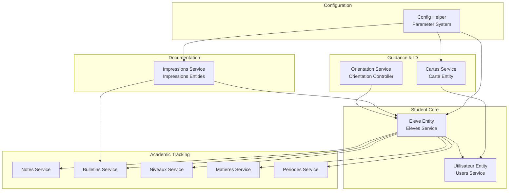
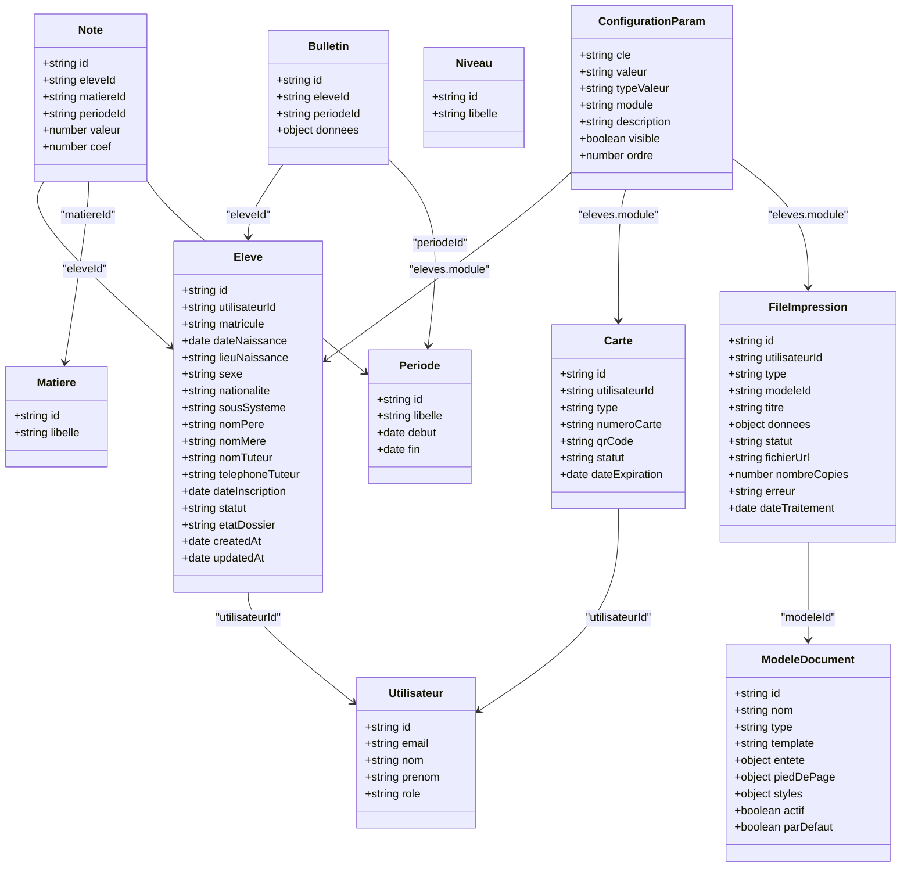
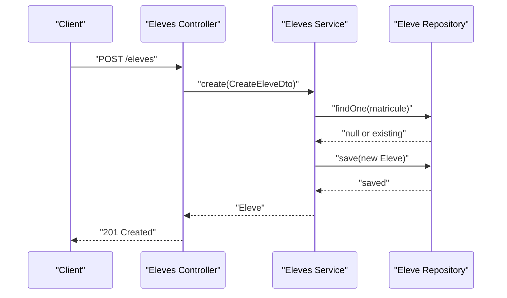
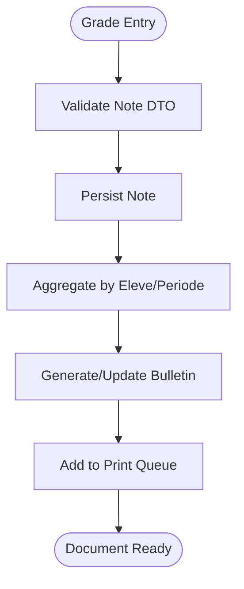
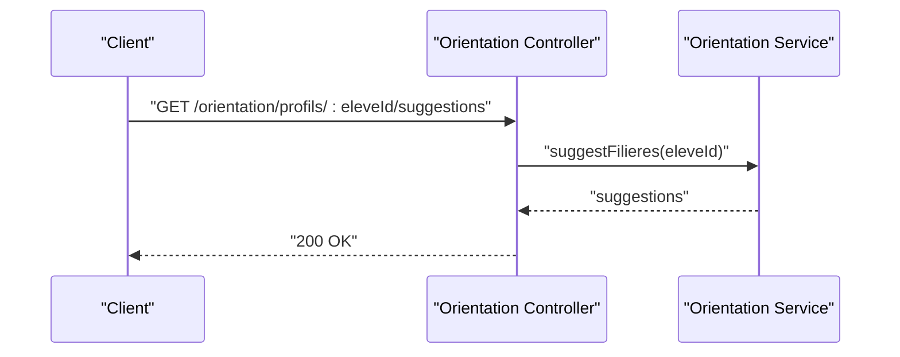
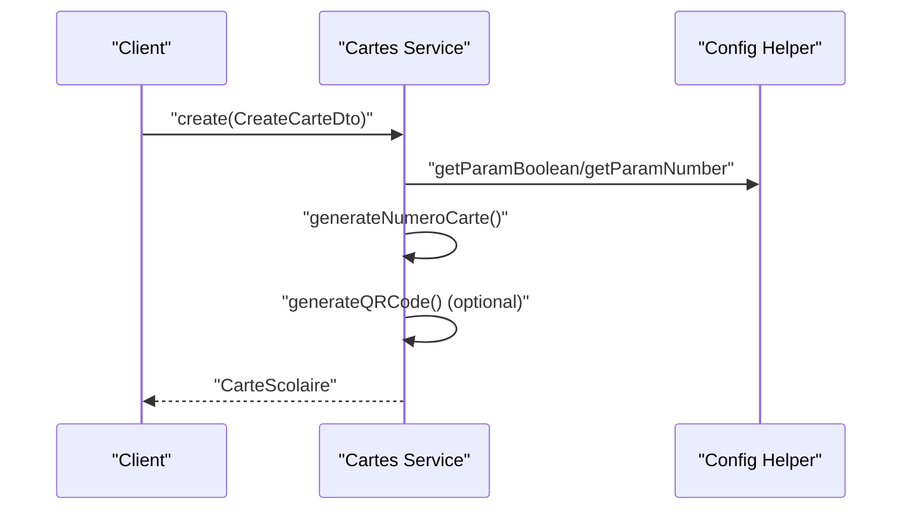
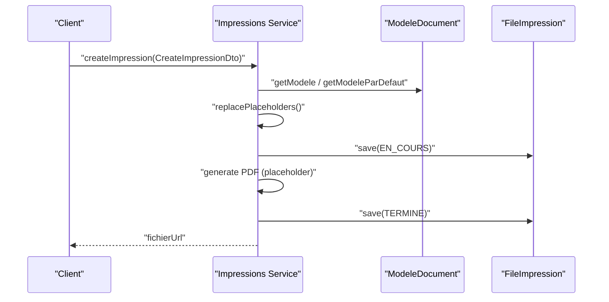
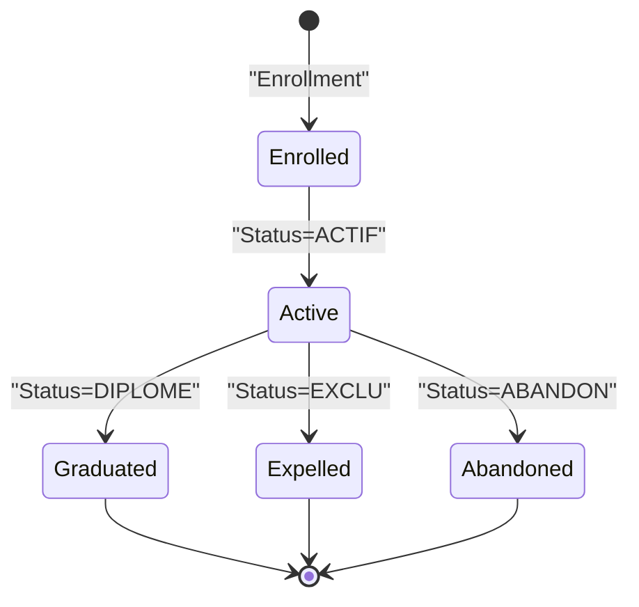
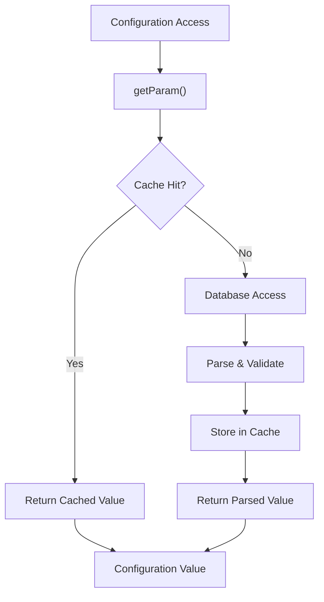
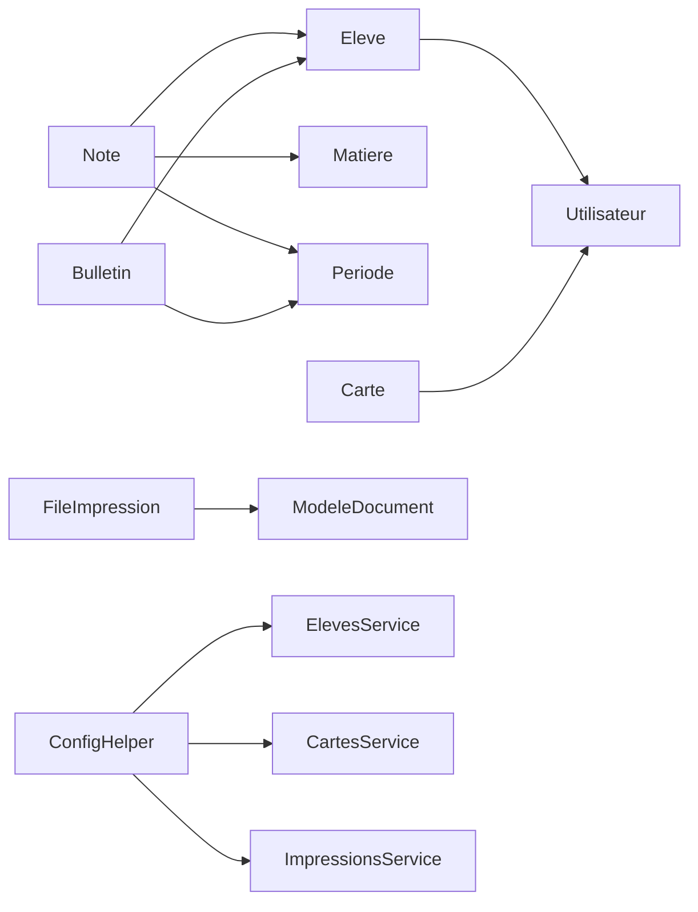

# Student Management

<cite>
**Referenced Files in This Document**
- [eleves.service.ts](file://backend/src/modules/eleves/services/eleves.service.ts)
- [eleves.dto.ts](file://backend/src/modules/eleves/dto/eleves.dto.ts)
- [eleve.entity.ts](file://backend/src/modules/eleves/entities/eleve.entity.ts)
- [eleves.controller.ts](file://backend/src/modules/eleves/controllers/eleves.controller.ts)
- [orientation.service.ts](file://backend/src/modules/orientation/services/orientation.service.ts)
- [orientation.controller.ts](file://backend/src/modules/orientation/controllers/orientation.controller.ts)
- [cartes.service.ts](file://backend/src/modules/cartes/services/cartes.service.ts)
- [carte.entity.ts](file://backend/src/modules/cartes/entities/carte.entity.ts)
- [carte.dto.ts](file://backend/src/modules/cartes/dto/carte.dto.ts)
- [impressions.service.ts](file://backend/src/modules/impressions/services/impressions.service.ts)
- [impressions.entity.ts](file://backend/src/modules/impressions/entities/impressions.entity.ts)
- [impressions.dto.ts](file://backend/src/modules/impressions/dto/impressions.dto.ts)
- [bulletins.service.ts](file://backend/src/modules/bulletins/services/bulletins.service.ts)
- [notes.service.ts](file://backend/src/modules/notes/services/notes.service.ts)
- [niveaux.service.ts](file://backend/src/modules/niveaux/services/niveaux.service.ts)
- [matieres.service.ts](file://backend/src/modules/matieres/services/matieres.service.ts)
- [utilisateurs.service.ts](file://backend/src/modules/utilisateurs/services/utilisateurs.service.ts)
- [utilisateur.entity.ts](file://backend/src/modules/utilisateurs/entities/utilisateur.entity.ts)
- [periodes.service.ts](file://backend/src/modules/periodes/services/periodes.service.ts)
- [periode.entity.ts](file://backend/src/modules/periodes/entities/periode.entity.ts)
- [config.helper.ts](file://backend/src/modules/configuration/utils/config.helper.ts)
- [005-complete-config-params-100.ts](file://backend/src/database/migrations/005-complete-config-params-100.ts)
- [005-advanced-config-params.ts](file://backend/src/database/migrations/005-advanced-config-params.ts)
- [CONFIGURATION_100_PERCENT.md](file://CONFIGURATION_100_PERCENT.md)
</cite>

## Update Summary
**Changes Made**
- Added comprehensive documentation for five new student management configuration parameters
- Updated enrollment and profile management section to include automatic matricule generation
- Enhanced photo and medical record requirements documentation
- Added maximum class size configuration parameter coverage
- Updated troubleshooting guide with configuration-related error handling

## Table of Contents
1. [Introduction](#introduction)
2. [Project Structure](#project-structure)
3. [Core Components](#core-components)
4. [Architecture Overview](#architecture-overview)
5. [Detailed Component Analysis](#detailed-component-analysis)
6. [Configuration Parameters](#configuration-parameters)
7. [Dependency Analysis](#dependency-analysis)
8. [Performance Considerations](#performance-considerations)
9. [Troubleshooting Guide](#troubleshooting-guide)
10. [Conclusion](#conclusion)
11. [Appendices](#appendices)

## Introduction
This document describes the student management modules within the eLISAschool backend. It focuses on student enrollment, personal records, academic tracking, and identification systems. The system now includes advanced configuration management for enrollment limits, automatic ID generation, and documentation requirements. It also explains the student lifecycle from enrollment through graduation, including academic progress tracking, behavioral records, and administrative documentation. Integration between student data and academic modules is emphasized to ensure data consistency across the system.

## Project Structure
The student management domain is organized around feature-based modules:
- Student enrollment and profiles: eleves module (entities, DTOs, service, controller)
- Orientation guidance: orientation module (entities, DTOs, service, controller)
- ID cards and identification: cartes module (entities, DTOs, service)
- Document printing and templates: impressions module (entities, DTOs, service)
- Academic tracking: bulletins, notes, niveaux, matieres modules
- Supporting identity: utilisateurs module (users)
- Periods and configuration: periodes module and configuration helpers

**Diagram sources**
- [eleve.entity.ts:21-80](file://backend/src/modules/eleves/entities/eleve.entity.ts#L21-L80)
- [utilisateur.entity.ts:1-200](file://backend/src/modules/utilisateurs/entities/utilisateur.entity.ts#L1-L200)
- [notes.service.ts:1-200](file://backend/src/modules/notes/services/notes.service.ts#L1-L200)
- [bulletins.service.ts:1-200](file://backend/src/modules/bulletins/services/bulletins.service.ts#L1-L200)
- [niveaux.service.ts:1-200](file://backend/src/modules/niveaux/services/niveaux.service.ts#L1-L200)
- [matieres.service.ts:1-200](file://backend/src/modules/matieres/services/matieres.service.ts#L1-L200)
- [periodes.service.ts:1-200](file://backend/src/modules/periodes/services/periodes.service.ts#L1-L200)
- [orientation.service.ts:1-200](file://backend/src/modules/orientation/services/orientation.service.ts#L1-L200)
- [cartes.service.ts:1-200](file://backend/src/modules/cartes/services/cartes.service.ts#L1-L200)
- [impressions.service.ts:1-200](file://backend/src/modules/impressions/services/impressions.service.ts#L1-L200)
- [config.helper.ts:1-131](file://backend/src/modules/configuration/utils/config.helper.ts#L1-L131)

**Section sources**
- [eleves.service.ts:14-78](file://backend/src/modules/eleves/services/eleves.service.ts#L14-L78)
- [eleves.dto.ts:10-31](file://backend/src/modules/eleves/dto/eleves.dto.ts#L10-L31)
- [eleve.entity.ts:21-80](file://backend/src/modules/eleves/entities/eleve.entity.ts#L21-L80)
- [utilisateurs.service.ts:1-200](file://backend/src/modules/utilisateurs/services/utilisateurs.service.ts#L1-L200)
- [utilisateur.entity.ts:1-200](file://backend/src/modules/utilisateurs/entities/utilisateur.entity.ts#L1-L200)

## Core Components
- Student enrollment and profile management:
  - Eleve entity defines student identifiers, personal info, family contact, enrollment date, status, and dossier completeness.
  - Eleves service handles creation, updates, retrieval, and deletion with validation and duplicate checks.
  - Eleves DTOs define strict input schemas for creation and updates.
  - Eleves controller exposes CRUD endpoints with authentication and role-based access.
- Academic tracking:
  - Notes service manages grades per subject and period.
  - Bulletins service aggregates grades into transcripts and supports generation via templates.
  - Niveaux and Matieres services manage class levels and subjects.
  - Periodes service defines academic periods.
- Guidance services:
  - Orientation service provides career profiles, suggestions, and appointment scheduling.
  - Orientation controller exposes endpoints for profiles, suggestions, and appointments.
- ID and identification:
  - Cartes service creates and manages student ID cards with configurable validity, QR code, and status.
  - Carte entity stores card metadata, type, status, expiration, and links to users.
- Document printing:
  - Impressions service manages document templates and print queue generation.
  - Impressions entities define document types, statuses, and model configurations.

**Section sources**
- [eleves.service.ts:21-75](file://backend/src/modules/eleves/services/eleves.service.ts#L21-L75)
- [eleves.dto.ts:10-31](file://backend/src/modules/eleves/dto/eleves.dto.ts#L10-L31)
- [eleve.entity.ts:24-80](file://backend/src/modules/eleves/entities/eleve.entity.ts#L24-L80)
- [notes.service.ts:1-200](file://backend/src/modules/notes/services/notes.service.ts#L1-L200)
- [bulletins.service.ts:1-200](file://backend/src/modules/bulletins/services/bulletins.service.ts#L1-L200)
- [niveaux.service.ts:1-200](file://backend/src/modules/niveaux/services/niveaux.service.ts#L1-L200)
- [matieres.service.ts:1-200](file://backend/src/modules/matieres/services/matieres.service.ts#L1-L200)
- [periodes.service.ts:1-200](file://backend/src/modules/periodes/services/periodes.service.ts#L1-L200)
- [orientation.service.ts:1-200](file://backend/src/modules/orientation/services/orientation.service.ts#L1-L200)
- [cartes.service.ts:43-134](file://backend/src/modules/cartes/services/cartes.service.ts#L43-L134)
- [carte.entity.ts:22-60](file://backend/src/modules/cartes/entities/carte.entity.ts#L22-L60)
- [impressions.service.ts:122-178](file://backend/src/modules/impressions/services/impressions.service.ts#L122-L178)
- [impressions.entity.ts:21-138](file://backend/src/modules/impressions/entities/impressions.entity.ts#L21-L138)

## Architecture Overview
The system follows a layered architecture with feature-based modules. Students are represented by the Eleve entity linked to the Utilisateur entity. Academic data is managed by dedicated services for grades, transcripts, levels, subjects, and periods. Orientation and ID modules integrate with students via user IDs. Printing leverages templates and a queued generation pipeline. Configuration parameters are centrally managed through the configuration helper system.

**Diagram sources**
- [eleve.entity.ts:24-80](file://backend/src/modules/eleves/entities/eleve.entity.ts#L24-L80)
- [utilisateur.entity.ts:1-200](file://backend/src/modules/utilisateurs/entities/utilisateur.entity.ts#L1-L200)
- [notes.service.ts:1-200](file://backend/src/modules/notes/services/notes.service.ts#L1-L200)
- [bulletins.service.ts:1-200](file://backend/src/modules/bulletins/services/bulletins.service.ts#L1-L200)
- [niveaux.service.ts:1-200](file://backend/src/modules/niveaux/services/niveaux.service.ts#L1-L200)
- [matieres.service.ts:1-200](file://backend/src/modules/matieres/services/matieres.service.ts#L1-L200)
- [periodes.service.ts:1-200](file://backend/src/modules/periodes/services/periodes.service.ts#L1-L200)
- [carte.entity.ts:22-60](file://backend/src/modules/cartes/entities/carte.entity.ts#L22-L60)
- [impressions.entity.ts:45-138](file://backend/src/modules/impressions/entities/impressions.entity.ts#L45-L138)
- [config.helper.ts:1-131](file://backend/src/modules/configuration/utils/config.helper.ts#L1-L131)

## Detailed Component Analysis

### Student Enrollment and Profile Management
- Enrollment process:
  - Creation validates uniqueness of matricule and user linkage, sets enrollment date, and persists the record.
  - Updates handle date normalization and optional status/state transitions.
- Personal records:
  - Fields include personal info, parents/guardians, and enrollment date.
  - Status and dossier completeness support lifecycle and administrative workflows.
- Lifecycle integration:
  - Status values include ACTIF, EXCLU, ABANDON, DIPLOME to reflect progression and outcomes.

**Diagram sources**
- [eleves.controller.ts:1-200](file://backend/src/modules/eleves/controllers/eleves.controller.ts#L1-L200)
- [eleves.service.ts:21-37](file://backend/src/modules/eleves/services/eleves.service.ts#L21-L37)
- [eleve.entity.ts:24-80](file://backend/src/modules/eleves/entities/eleve.entity.ts#L24-L80)

**Section sources**
- [eleves.service.ts:21-75](file://backend/src/modules/eleves/services/eleves.service.ts#L21-L75)
- [eleves.dto.ts:10-31](file://backend/src/modules/eleves/dto/eleves.dto.ts#L10-L31)
- [eleve.entity.ts:24-80](file://backend/src/modules/eleves/entities/eleve.entity.ts#L24-L80)

### Academic Tracking
- Notes service:
  - Stores individual grade entries with subject and period references.
  - Supports aggregation and filtering for reporting and transcript generation.
- Bulletins service:
  - Aggregates grades per period and supports bulk generation for classes.
  - Integrates with the printing module for standardized document output.
- Levels and subjects:
  - Niveaux and Matieres services maintain hierarchical academic structure.
- Periods:
  - Periodes service defines academic terms for grading and reporting.

**Diagram sources**
- [notes.service.ts:1-200](file://backend/src/modules/notes/services/notes.service.ts#L1-L200)
- [bulletins.service.ts:1-200](file://backend/src/modules/bulletins/services/bulletins.service.ts#L1-L200)
- [niveaux.service.ts:1-200](file://backend/src/modules/niveaux/services/niveaux.service.ts#L1-L200)
- [matieres.service.ts:1-200](file://backend/src/modules/matieres/services/matieres.service.ts#L1-L200)
- [periodes.service.ts:1-200](file://backend/src/modules/periodes/services/periodes.service.ts#L1-L200)

**Section sources**
- [notes.service.ts:1-200](file://backend/src/modules/notes/services/notes.service.ts#L1-L200)
- [bulletins.service.ts:1-200](file://backend/src/modules/bulletins/services/bulletins.service.ts#L1-L200)
- [niveaux.service.ts:1-200](file://backend/src/modules/niveaux/services/niveaux.service.ts#L1-L200)
- [matieres.service.ts:1-200](file://backend/src/modules/matieres/services/matieres.service.ts#L1-L200)
- [periodes.service.ts:1-200](file://backend/src/modules/periodes/services/periodes.service.ts#L1-L200)

### Orientation Guidance Services
- Profiles and suggestions:
  - Career profiles and field suggestions are computed and exposed via service endpoints.
- Appointments:
  - Appointment scheduling and cancellation are supported with role-based access controls.
- Integration:
  - Orientation data is student-centric and relies on the Eleve entity's identifier.

**Diagram sources**
- [orientation.controller.ts:50-55](file://backend/src/modules/orientation/controllers/orientation.controller.ts#L50-L55)
- [orientation.service.ts:1-200](file://backend/src/modules/orientation/services/orientation.service.ts#L1-L200)

**Section sources**
- [orientation.service.ts:1-200](file://backend/src/modules/orientation/services/orientation.service.ts#L1-L200)
- [orientation.controller.ts:34-128](file://backend/src/modules/orientation/controllers/orientation.controller.ts#L34-L128)

### ID Card Issuance and Management
- Card creation:
  - Generates unique card numbers, sets expiration based on configuration, and optionally adds QR codes.
- Renewal and validation:
  - Supports renewal workflows and verification for scanning and expiry checks.
- Configuration:
  - Uses centralized configuration for enabling QR codes, validity duration, and photo inclusion.

**Diagram sources**
- [cartes.service.ts:43-66](file://backend/src/modules/cartes/services/cartes.service.ts#L43-L66)
- [cartes.service.ts:107-134](file://backend/src/modules/cartes/services/cartes.service.ts#L107-L134)
- [cartes.service.ts:139-158](file://backend/src/modules/cartes/services/cartes.service.ts#L139-L158)
- [config.helper.ts:1-200](file://backend/src/modules/configuration/utils/config.helper.ts#L1-L200)

**Section sources**
- [cartes.service.ts:43-134](file://backend/src/modules/cartes/services/cartes.service.ts#L43-L134)
- [carte.entity.ts:7-60](file://backend/src/modules/cartes/entities/carte.entity.ts#L7-L60)
- [carte.dto.ts:3-16](file://backend/src/modules/cartes/dto/carte.dto.ts#L3-L16)

### Document Printing Capabilities
- Templates and models:
  - ModeleDocument stores reusable templates with header/footer options and styles.
- Print queue:
  - FileImpression tracks jobs, status, copies, and errors.
- Generation pipeline:
  - Documents are generated by combining templates, data, and configuration, then marked as ready.

**Diagram sources**
- [impressions.service.ts:122-178](file://backend/src/modules/impressions/services/impressions.service.ts#L122-L178)
- [impressions.entity.ts:45-138](file://backend/src/modules/impressions/entities/impressions.entity.ts#L45-L138)
- [impressions.dto.ts:10-58](file://backend/src/modules/impressions/dto/impressions.dto.ts#L10-L58)

**Section sources**
- [impressions.service.ts:122-178](file://backend/src/modules/impressions/services/impressions.service.ts#L122-L178)
- [impressions.entity.ts:21-138](file://backend/src/modules/impressions/entities/impressions.entity.ts#L21-L138)
- [impressions.dto.ts:10-58](file://backend/src/modules/impressions/dto/impressions.dto.ts#L10-L58)

### Student Lifecycle Management
- From enrollment to graduation:
  - Enrollment via Eleves service.
  - Academic progress tracked via Notes and Bulletins services.
  - Behavioral and administrative records can be modeled via Eleve status and dossier completeness.
  - ID issuance and renewal handled by Cartes service.
  - Transcripts and certificates printed via Impressions service.
- Data consistency:
  - Shared user identity via Utilisateur entity ensures alignment between profiles and academic records.
  - Academic periods and levels provide structured contexts for grades and transcripts.

**Diagram sources**
- [eleve.entity.ts:69-73](file://backend/src/modules/eleves/entities/eleve.entity.ts#L69-L73)
- [eleves.service.ts:60-69](file://backend/src/modules/eleves/services/eleves.service.ts#L60-L69)

**Section sources**
- [eleve.entity.ts:69-73](file://backend/src/modules/eleves/entities/eleve.entity.ts#L69-L73)
- [eleves.service.ts:60-69](file://backend/src/modules/eleves/services/eleves.service.ts#L60-L69)

## Configuration Parameters

### Student Management Configuration Parameters
The student management system now includes comprehensive configuration parameters managed through the centralized configuration system:

#### Enrollment Configuration Parameters
- **eleves.max_students_per_class**: Maximum number of students allowed per class (default: 45)
- **eleves.auto_generate_matricule**: Automatically generate student matricules (default: true)
- **eleves.matricule_prefix**: Prefix used for automatic matricule generation (default: "ELV")
- **eleves.require_photo**: Require photo upload for student enrollment (default: false)
- **eleves.require_medical_record**: Require medical record attachment (default: false)
- **eleves.default_annee_scolaire**: Default academic year for new enrollments (default: empty)

#### Configuration Implementation Details
The configuration parameters are accessed through the centralized configuration helper system which provides:
- Type-safe parameter retrieval with caching
- Runtime parameter modification support
- Module-specific parameter grouping
- Validation and default value handling

**Diagram sources**
- [config.helper.ts:24-37](file://backend/src/modules/configuration/utils/config.helper.ts#L24-L37)
- [config.helper.ts:42-54](file://backend/src/modules/configuration/utils/config.helper.ts#L42-L54)

**Section sources**
- [005-complete-config-params-100.ts:134-206](file://backend/src/database/migrations/005-complete-config-params-100.ts#L134-L206)
- [005-advanced-config-params.ts:99-136](file://backend/src/database/migrations/005-advanced-config-params.ts#L99-L136)
- [CONFIGURATION_100_PERCENT.md:13-19](file://CONFIGURATION_100_PERCENT.md#L13-L19)
- [config.helper.ts:1-131](file://backend/src/modules/configuration/utils/config.helper.ts#L1-L131)

## Dependency Analysis
- Coupling:
  - Eleve depends on Utilisateur for identity.
  - Notes depend on Eleve, Matiere, and Periode for academic context.
  - Bulletins depend on Eleve and Periode for aggregation.
  - Cartes depends on Utilisateur for issuing and on configuration for parameters.
  - Impressions depends on ModeleDocument and FileImpression for templating and queueing.
  - Configuration helper centralizes access to all module-specific parameters.
- Cohesion:
  - Each module encapsulates related responsibilities (enrollment, orientation, ID, printing, academics).
- External integrations:
  - Configuration helper centralizes feature toggles and parameters for ID and printing.

**Diagram sources**
- [eleve.entity.ts:24-80](file://backend/src/modules/eleves/entities/eleve.entity.ts#L24-L80)
- [utilisateur.entity.ts:1-200](file://backend/src/modules/utilisateurs/entities/utilisateur.entity.ts#L1-L200)
- [notes.service.ts:1-200](file://backend/src/modules/notes/services/notes.service.ts#L1-L200)
- [bulletins.service.ts:1-200](file://backend/src/modules/bulletins/services/bulletins.service.ts#L1-L200)
- [carte.entity.ts:22-60](file://backend/src/modules/cartes/entities/carte.entity.ts#L22-L60)
- [impressions.entity.ts:45-138](file://backend/src/modules/impressions/entities/impressions.entity.ts#L45-L138)
- [config.helper.ts:1-131](file://backend/src/modules/configuration/utils/config.helper.ts#L1-L131)

**Section sources**
- [utilisateurs.service.ts:1-200](file://backend/src/modules/utilisateurs/services/utilisateurs.service.ts#L1-L200)
- [utilisateur.entity.ts:1-200](file://backend/src/modules/utilisateurs/entities/utilisateur.entity.ts#L1-L200)

## Performance Considerations
- Indexing:
  - Eleve entity includes indices on utilisateurId and matricule to optimize lookups during enrollment and profile queries.
- Batch operations:
  - Bulk transcript generation and mass printing reduce repeated processing overhead.
- Configuration caching:
  - Centralized configuration parameters minimize repeated reads and improve card and print generation performance.
- Asynchronous processing:
  - Print queue with status tracking enables non-blocking generation and retry mechanisms.
- Parameter caching:
  - Configuration helper implements 60-second cache TTL for frequently accessed parameters.

## Troubleshooting Guide
- Duplicate matricule or user linkage:
  - Creation throws explicit errors when matricule or user association already exists.
- Not found errors:
  - Retrieval operations raise errors when entities are missing.
- Print failures:
  - Generation pipeline captures errors and updates job status with error messages for diagnostics.
- Card validation:
  - Verification checks status and expiration to prevent invalid scans.
- Configuration parameter issues:
  - Invalid parameter values trigger validation errors during parameter parsing.
  - Missing parameters fall back to configured default values.
  - Type conversion errors are handled gracefully with fallback defaults.

**Section sources**
- [eleves.service.ts:22-26](file://backend/src/modules/eleves/services/eleves.service.ts#L22-L26)
- [eleves.service.ts:50-54](file://backend/src/modules/eleves/services/eleves.service.ts#L50-L54)
- [impressions.service.ts:172-177](file://backend/src/modules/impressions/services/impressions.service.ts#L172-L177)
- [cartes.service.ts:139-158](file://backend/src/modules/cartes/services/cartes.service.ts#L139-L158)
- [config.helper.ts:42-54](file://backend/src/modules/configuration/utils/config.helper.ts#L42-L54)

## Conclusion
The student management modules in eLISAschool provide a cohesive foundation for enrollment, academic tracking, guidance, ID issuance, and document printing. The addition of comprehensive configuration parameters enhances system flexibility and administrative control. By linking student profiles to academic data and leveraging configuration-driven features, the system maintains consistency and scalability across the student lifecycle while supporting diverse institutional requirements.

## Appendices
- API endpoints overview:
  - Students: CRUD endpoints under eleves controller.
  - Orientation: Profiles, suggestions, and appointments under orientation controller.
  - ID Cards: Creation, renewal, verification under cartes service.
  - Printing: Templates and print jobs under impressions service.
- Configuration parameters:
  - Student enrollment parameters: max_students_per_class, auto_generate_matricule, matricule_prefix
  - Documentation requirements: require_photo, require_medical_record
  - Academic year settings: default_annee_scolaire