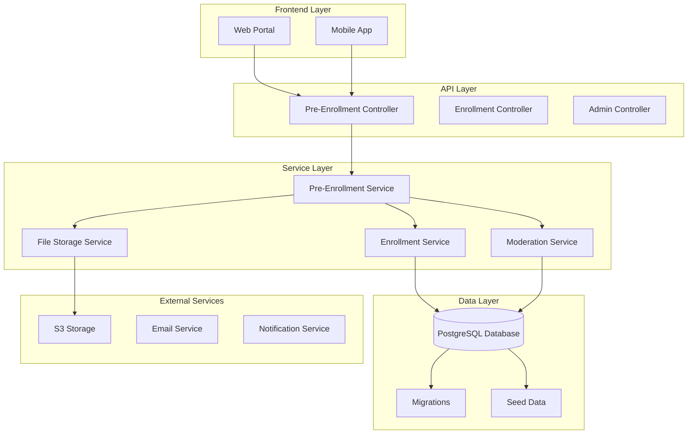
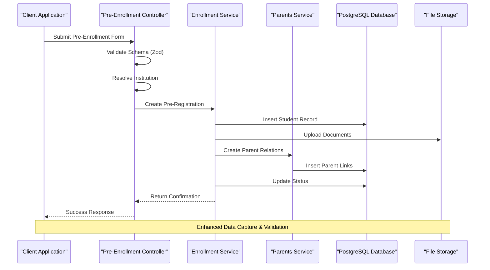
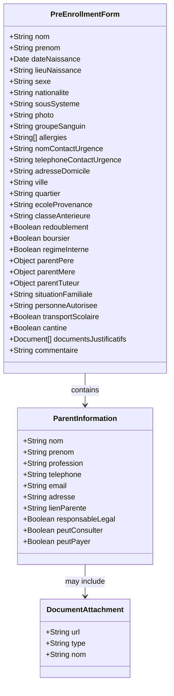
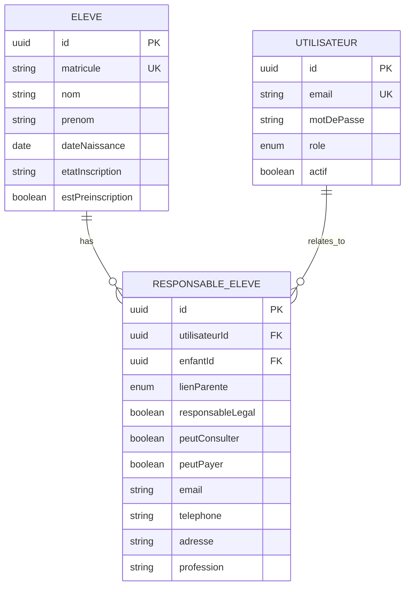

# Student Pre-Enrollment Enhancement Summary

<cite>
**Referenced Files in This Document**
- [app.ts](file://backend/src/app.ts)
- [eleves.controller.ts](file://backend/src/modules/eleves/controllers/eleves.controller.ts)
- [eleves.service.ts](file://backend/src/modules/eleves/services/eleves.service.ts)
- [eleves.dto.ts](file://backend/src/modules/eleves/dto/eleves.dto.ts)
- [responsables-eleves.dto.ts](file://backend/src/modules/responsables-eleves/dto/responsables-eleves.dto.ts)
- [parents.service.ts](file://backend/src/modules/responsables-eleves/services/parents.service.ts)
- [051-champs-preinscription-enrichis.sql](file://backend/database/migrations/051-champs-preinscription-enrichis.sql)
- [014-responsables-eleves.ts](file://backend/src/database/migrations/014-responsables-eleves.ts)
- [RESUME-ENRICHISSEMENT-PREINSCRIPTIONS.md](file://RESUME-ENRICHISSEMENT-PREINSCRIPTIONS.md)
- [RECOMMANDATIONS-GESTION-PARENTS.md](file://RECOMMANDATIONS-GESTION-PARENTS.md)
- [ANALYSE-COHERENCE-RESPONSABLES-ELEVES.md](file://ANALYSE-COHERENCE-RESPONSABLES-ELEVES.md)
</cite>

## Update Summary
**Changes Made**
- Updated data model evolution section to reflect comprehensive field additions
- Enhanced parent/guardian relationship management documentation
- Added detailed schema expansion analysis
- Updated processing workflows to include new validation steps
- Revised migration strategy documentation for hybrid approach

## Table of Contents
1. [Introduction](#introduction)
2. [Project Structure](#project-structure)
3. [Core Components](#core-components)
4. [Architecture Overview](#architecture-overview)
5. [Detailed Component Analysis](#detailed-component-analysis)
6. [Enhancement Features](#enhancement-features)
7. [Data Model Evolution](#data-model-evolution)
8. [Processing Workflows](#processing-workflows)
9. [Migration Strategy](#migration-strategy)
10. [Performance Considerations](#performance-considerations)
11. [Quality Assurance](#quality-assurance)
12. [Conclusion](#conclusion)

## Introduction

The Student Pre-Enrollment Enhancement represents a comprehensive modernization initiative for the eLISAschool student enrollment system. This enhancement transforms the basic pre-enrollment process from a minimal 14-field form into a sophisticated 46+ field comprehensive application system. The initiative focuses on capturing detailed student and family information, implementing robust parent/guardian management, and establishing a seamless conversion pathway from pre-enrollment to full registration.

The enhancement addresses critical gaps in the existing system by introducing structured medical information capture, comprehensive family contact management, document verification capabilities, and advanced service provisioning options. This transformation enables educational institutions to maintain detailed student profiles while supporting efficient administrative workflows.

## Project Structure

The pre-enrollment enhancement is built within the eLISAschool modular architecture, leveraging TypeScript-based NestJS framework with PostgreSQL database backend. The system follows a layered architecture pattern with clear separation of concerns across controllers, services, DTOs, and database entities.

**Diagram sources**
- [app.ts:163-190](file://backend/src/app.ts#L163-L190)
- [eleves.controller.ts:64-121](file://backend/src/modules/eleves/controllers/eleves.controller.ts#L64-L121)

**Section sources**
- [app.ts:163-190](file://backend/src/app.ts#L163-L190)
- [eleves.controller.ts:64-121](file://backend/src/modules/eleves/controllers/eleves.controller.ts#L64-L121)

## Core Components

The enhancement consists of several interconnected components working together to provide a comprehensive pre-enrollment solution:

### Pre-Enrollment Controller
Handles public pre-enrollment submissions with comprehensive validation and establishment lookup. The controller validates incoming data against the enriched schema and resolves educational institution details.

### Enrollment Management Service
Manages the complete lifecycle of student enrollment from initial pre-registration through final registration conversion. This service coordinates data validation, parent/guardian management, and institutional workflow integration.

### Enhanced Data Validation
Implements comprehensive Zod-based validation ensuring data integrity across all 46+ form fields. The validation system covers format compliance, business rule enforcement, and cross-field consistency checks.

### Parent/Guardian Management System
Provides sophisticated parent/guardian relationship management with support for multiple legal guardians, permission assignment, and account creation capabilities.

**Section sources**
- [eleves.controller.ts:64-121](file://backend/src/modules/eleves/controllers/eleves.controller.ts#L64-L121)
- [eleves.service.ts:466-632](file://backend/src/modules/eleves/services/eleves.service.ts#L466-L632)
- [eleves.dto.ts:53-89](file://backend/src/modules/eleves/dto/eleves.dto.ts#L53-L89)

## Architecture Overview

The pre-enrollment enhancement follows a microservice-oriented architecture pattern integrated within the eLISAschool ecosystem. The system maintains backward compatibility while introducing advanced features for enhanced student management.

**Diagram sources**
- [eleves.controller.ts:64-85](file://backend/src/modules/eleves/controllers/eleves.controller.ts#L64-L85)
- [eleves.service.ts:466-541](file://backend/src/modules/eleves/services/eleves.service.ts#L466-L541)

## Detailed Component Analysis

### Enhanced Pre-Enrollment Schema

The pre-enrollment form has been expanded from 14 basic fields to 46 comprehensive fields covering all aspects of student and family information.

**Diagram sources**
- [eleves.dto.ts:53-89](file://backend/src/modules/eleves/dto/eleves.dto.ts#L53-L89)
- [RESUME-ENRICHISSEMENT-PREINSCRIPTIONS.md:223-295](file://RESUME-ENRICHISSEMENT-PREINSCRIPTIONS.md#L223-L295)

### Parent/Guardian Relationship Management

The system implements a sophisticated parent/guardian relationship model supporting multiple legal guardians with granular permission controls.

**Diagram sources**
- [parents.service.ts:148-464](file://backend/src/modules/responsables-eleves/services/parents.service.ts#L148-L464)
- [014-responsables-eleves.ts:46-59](file://backend/src/database/migrations/014-responsables-eleves.ts#L46-L59)

**Section sources**
- [eleves.dto.ts:53-89](file://backend/src/modules/eleves/dto/eleves.dto.ts#L53-L89)
- [parents.service.ts:148-464](file://backend/src/modules/responsables-eleves/services/parents.service.ts#L148-L464)

## Enhancement Features

### Comprehensive Medical Information Capture
The enhanced system captures detailed medical information including blood type, allergies, emergency contacts, and health conditions. This information is crucial for school safety protocols and emergency response procedures.

### Multi-Parent Family Support
Support for multiple legal guardians with individual permission assignments, enabling schools to manage complex family situations while maintaining appropriate access controls.

### Document Verification System
Integrated document upload and verification capabilities supporting various educational and identification documents with automated validation and storage management.

### Advanced Service Provisioning
Options for transportation, cafeteria services, and boarding arrangements with automated integration into school management systems.

### Real-Time Validation and Error Handling
Comprehensive client-side and server-side validation with detailed error reporting and user-friendly correction guidance.

**Section sources**
- [RESUME-ENRICHISSEMENT-PREINSCRIPTIONS.md:128-194](file://RESUME-ENRICHISSEMENT-PREINSCRIPTIONS.md#L128-L194)
- [RECOMMANDATIONS-GESTION-PARENTS.md:446-480](file://RECOMMANDATIONS-GESTION-PARENTS.md#L446-L480)

## Data Model Evolution

The pre-enrollment enhancement introduces significant database schema modifications to support the expanded information capture requirements.

### Database Migration Strategy
The migration process involves careful schema evolution to maintain backward compatibility while introducing new capabilities for enhanced data management.

### Field Categories and Relationships
The enhanced schema organizes information into logical categories: student identity, medical history, family relationships, academic background, and service preferences.

### Data Integrity and Validation
Implementation of comprehensive data validation rules ensuring consistency and accuracy across all captured information.

**Section sources**
- [051-champs-preinscription-enrichis.sql](file://backend/database/migrations/051-champs-preinscription-enrichis.sql)
- [ANALYSE-COHERENCE-RESPONSABLES-ELEVES.md:1-60](file://ANALYSE-COHERENCE-RESPONSABLES-ELEVES.md#L1-L60)

## Processing Workflows

### Pre-Enrollment Submission Process
The submission process validates incoming data against comprehensive schemas, resolves institutional affiliations, and captures all relevant student and family information.

### Conversion to Full Registration
Automated conversion process transforms pre-enrollment records into full student registrations with parent/guardian relationship establishment and account creation.

### Moderation and Approval Workflow
Institutional review process for pre-enrollment submissions with approval/rejection capabilities and automated notification systems.

### Document Management Integration
Seamless integration with document storage systems supporting secure file uploads, validation, and retrieval for verification purposes.

**Section sources**
- [eleves.controller.ts:64-121](file://backend/src/modules/eleves/controllers/eleves.controller.ts#L64-L121)
- [eleves.service.ts:466-632](file://backend/src/modules/eleves/services/eleves.service.ts#L466-L632)

## Migration Strategy

### Hybrid Approach Implementation
The system employs a hybrid approach supporting both traditional direct field storage and modern parent/guardian relationship management during the transition period.

### Progressive Migration Path
Structured migration process allowing institutions to gradually adopt new parent/guardian relationship capabilities while maintaining compatibility with existing direct field data.

### Backward Compatibility Measures
Comprehensive measures ensuring existing systems and data remain functional during the transition to enhanced capabilities.

### Risk Mitigation Strategies
Multiple validation layers and rollback mechanisms protecting institutional data integrity throughout the migration process.

**Section sources**
- [RECOMMANDATIONS-GESTION-PARENTS.md:446-480](file://RECOMMANDATIONS-GESTION-PARENTS.md#L446-L480)
- [parents.service.ts:148-464](file://backend/src/modules/responsables-eleves/services/parents.service.ts#L148-L464)

## Performance Considerations

### Scalability Architecture
The enhanced system maintains scalability through optimized database queries, efficient indexing strategies, and streamlined data processing workflows.

### Validation Performance
Comprehensive validation occurs efficiently through optimized Zod schema processing and database constraint enforcement.

### Storage Optimization
Document storage and retrieval optimized through efficient file management and caching strategies.

### Monitoring and Analytics
Comprehensive monitoring capabilities tracking system performance, user engagement, and data quality metrics.

## Quality Assurance

### Data Validation Standards
Implementation of industry-standard validation ensuring data accuracy, completeness, and consistency across all enhanced fields.

### Security and Privacy Protection
Robust security measures protecting sensitive student and family information through encryption, access controls, and audit trails.

### Testing and Verification
Comprehensive testing framework validating system functionality, data integrity, and user experience across all enhanced features.

### Compliance and Standards
Adherence to educational data standards and privacy regulations ensuring institutional compliance and data protection.

## Conclusion

The Student Pre-Enrollment Enhancement represents a transformative upgrade to the eLISAschool student management system. By expanding from a basic 14-field form to a comprehensive 46+ field application, the system now supports detailed student and family information capture essential for modern educational institutions.

The enhancement successfully balances innovation with practicality through its hybrid approach, maintaining backward compatibility while introducing advanced capabilities. The sophisticated parent/guardian relationship management, comprehensive medical information capture, and document verification systems position the platform for future growth and institutional needs.

Key achievements include improved data quality, enhanced administrative efficiency, better student safety through comprehensive medical information, and streamlined conversion processes from pre-enrollment to full registration. The modular architecture ensures maintainability and extensibility for future enhancements.

This enhancement establishes eLISAschool as a comprehensive educational management platform capable of supporting diverse institutional requirements while maintaining operational excellence and data integrity.