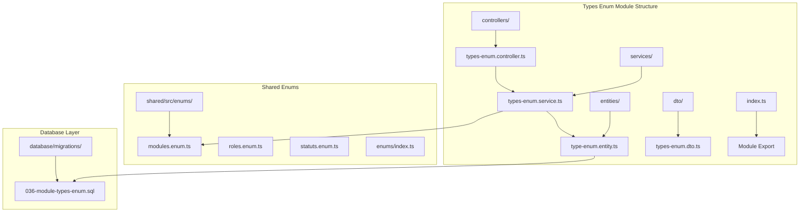
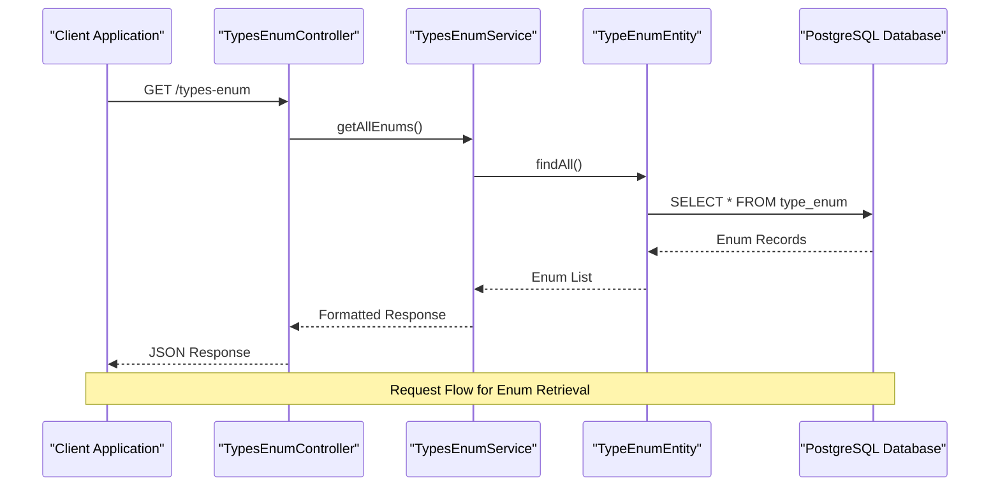
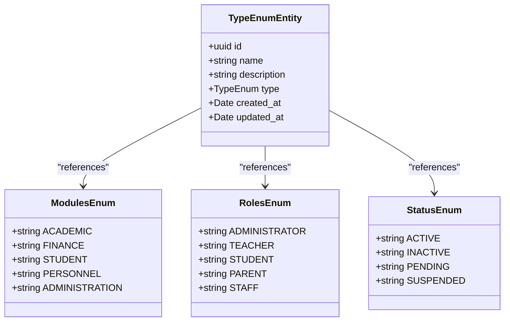
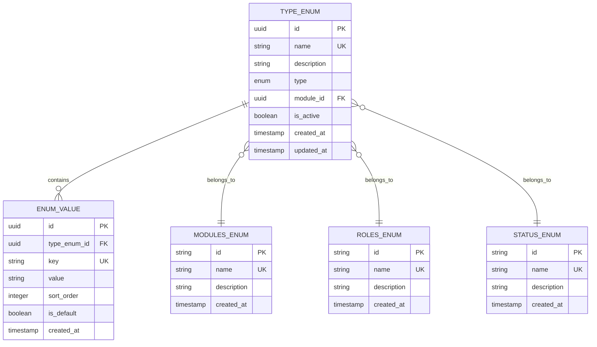

# Types Enumeration Module

<cite>
**Referenced Files in This Document**
- [types-enum.controller.ts](file://backend/src/modules/types-enum/controllers/types-enum.controller.ts)
- [types-enum.service.ts](file://backend/src/modules/types-enum/services/types-enum.service.ts)
- [type-enum.entity.ts](file://backend/src/modules/types-enum/entities/type-enum.entity.ts)
- [types-enum.dto.ts](file://backend/src/modules/types-enum/dto/types-enum.dto.ts)
- [index.ts](file://backend/src/modules/types-enum/index.ts)
- [modules.enum.ts](file://shared/src/enums/modules.enum.ts)
- [roles.enum.ts](file://shared/src/enums/roles.enum.ts)
- [statuts.enum.ts](file://shared/src/enums/statuts.enum.ts)
- [index.ts](file://shared/src/enums/index.ts)
- [036-module-types-enum.sql](file://backend/database/migrations/036-module-types-enum.sql)
- [test-types-enum.sh](file://scripts/test-types-enum.sh)
</cite>

## Table of Contents
1. [Introduction](#introduction)
2. [Project Structure](#project-structure)
3. [Core Components](#core-components)
4. [Architecture Overview](#architecture-overview)
5. [Detailed Component Analysis](#detailed-component-analysis)
6. [Enum Management System](#enum-management-system)
7. [Database Schema](#database-schema)
8. [Integration Points](#integration-points)
9. [Performance Considerations](#performance-considerations)
10. [Testing Strategy](#testing-strategy)
11. [Conclusion](#conclusion)

## Introduction

The Types Enumeration Module is a core component of the eLISAschool system that provides centralized management of application-wide enumerations and type definitions. This module serves as a foundation for maintaining consistency across various domain-specific enumerations such as modules, roles, and statuses throughout the educational management platform.

The module implements a robust enumeration management system that ensures type safety, maintains referential integrity, and provides a unified interface for accessing standardized values across all backend services. It plays a crucial role in supporting the modular architecture of the eLISAschool platform while ensuring data consistency and validation.

## Project Structure

The Types Enumeration Module follows a clean architecture pattern with clear separation of concerns across controllers, services, entities, and DTOs. The module is strategically located within the backend/src/modules directory, reflecting its central role in the application's infrastructure.

**Diagram sources**
- [types-enum.controller.ts](file://backend/src/modules/types-enum/controllers/types-enum.controller.ts)
- [types-enum.service.ts](file://backend/src/modules/types-enum/services/types-enum.service.ts)
- [type-enum.entity.ts](file://backend/src/modules/types-enum/entities/type-enum.entity.ts)
- [036-module-types-enum.sql](file://backend/database/migrations/036-module-types-enum.sql)

**Section sources**
- [types-enum.controller.ts](file://backend/src/modules/types-enum/controllers/types-enum.controller.ts)
- [types-enum.service.ts](file://backend/src/modules/types-enum/services/types-enum.service.ts)
- [type-enum.entity.ts](file://backend/src/modules/types-enum/entities/type-enum.entity.ts)
- [types-enum.dto.ts](file://backend/src/modules/types-enum/dto/types-enum.dto.ts)

## Core Components

The Types Enumeration Module consists of four primary components that work together to provide comprehensive enumeration management capabilities:

### Controller Layer
The controller handles HTTP requests and coordinates between the service layer and external clients. It provides endpoints for CRUD operations on enumeration types and values, ensuring proper request validation and response formatting.

### Service Layer
The service layer implements the business logic for enumeration management, including validation, persistence, and retrieval operations. It maintains transaction boundaries and ensures data consistency across operations.

### Entity Layer
The entity represents the database model for enumeration types and values, defining the structure and relationships within the PostgreSQL database schema.

### DTO Layer
The DTO layer provides data transfer objects for validation and serialization, ensuring proper data formatting for API responses and request processing.

**Section sources**
- [types-enum.controller.ts](file://backend/src/modules/types-enum/controllers/types-enum.controller.ts)
- [types-enum.service.ts](file://backend/src/modules/types-enum/services/types-enum.service.ts)
- [type-enum.entity.ts](file://backend/src/modules/types-enum/entities/type-enum.entity.ts)
- [types-enum.dto.ts](file://backend/src/modules/types-enum/dto/types-enum.dto.ts)

## Architecture Overview

The Types Enumeration Module implements a layered architecture that promotes separation of concerns and maintainability. The architecture follows RESTful principles while incorporating advanced features such as caching, validation, and transaction management.

**Diagram sources**
- [types-enum.controller.ts](file://backend/src/modules/types-enum/controllers/types-enum.controller.ts)
- [types-enum.service.ts](file://backend/src/modules/types-enum/services/types-enum.service.ts)
- [type-enum.entity.ts](file://backend/src/modules/types-enum/entities/type-enum.entity.ts)

The architecture emphasizes loose coupling between components while maintaining strong cohesion within each layer. The module integrates seamlessly with the broader eLISAschool ecosystem through shared enum definitions and standardized interfaces.

## Detailed Component Analysis

### TypesEnumController

The controller serves as the primary interface for enumeration management operations, implementing comprehensive CRUD functionality with proper error handling and validation. It coordinates between HTTP requests and service layer operations while ensuring appropriate response formatting.

Key responsibilities include:
- Handling HTTP GET requests for enumeration retrieval
- Managing request validation through DTO decorators
- Coordinating with service layer for business logic execution
- Providing structured error responses for invalid operations

### TypesEnumService

The service layer implements sophisticated business logic for enumeration management, including data validation, persistence operations, and caching mechanisms. It maintains transaction boundaries and ensures data consistency across all operations.

Core functionalities encompass:
- Enum type validation and creation
- Value management and association
- Caching strategies for improved performance
- Error handling and transaction management

### TypeEnumEntity

The entity defines the database schema for enumeration types, establishing relationships and constraints that ensure data integrity. It implements proper TypeScript typing and database annotations for seamless ORM integration.

Database characteristics include:
- UUID primary key for global uniqueness
- Timestamp tracking for audit purposes
- Foreign key relationships for value associations
- Index optimization for query performance

### TypesEnumDTO

The DTO layer provides structured data transfer objects that enforce validation rules and ensure proper data formatting. It leverages class-validator decorators for comprehensive input validation.

Validation features include:
- Required field enforcement
- Type checking and conversion
- Custom validation logic
- Error message localization

**Section sources**
- [types-enum.controller.ts](file://backend/src/modules/types-enum/controllers/types-enum.controller.ts)
- [types-enum.service.ts](file://backend/src/modules/types-enum/services/types-enum.service.ts)
- [type-enum.entity.ts](file://backend/src/modules/types-enum/entities/type-enum.entity.ts)
- [types-enum.dto.ts](file://backend/src/modules/types-enum/dto/types-enum.dto.ts)

## Enum Management System

The Types Enumeration Module provides a comprehensive system for managing application-wide enumerations, integrating with shared enum definitions to maintain consistency across the platform.

### Shared Enum Integration

The module leverages shared enum definitions from the `shared/src/enums` directory, ensuring alignment with core application values:

**Diagram sources**
- [modules.enum.ts](file://shared/src/enums/modules.enum.ts)
- [roles.enum.ts](file://shared/src/enums/roles.enum.ts)
- [statuts.enum.ts](file://shared/src/enums/statuts.enum.ts)
- [type-enum.entity.ts](file://backend/src/modules/types-enum/entities/type-enum.entity.ts)

### Enum Categories

The system manages three primary categories of enumerations:

1. **Module Enumerations**: Define functional areas and system modules
2. **Role Enumerations**: Specify user permissions and access levels
3. **Status Enumerations**: Control entity lifecycle and operational states

Each category maintains strict validation rules and follows established naming conventions for consistency.

**Section sources**
- [modules.enum.ts](file://shared/src/enums/modules.enum.ts)
- [roles.enum.ts](file://shared/src/enums/roles.enum.ts)
- [statuts.enum.ts](file://shared/src/enums/statuts.enum.ts)
- [type-enum.entity.ts](file://backend/src/modules/types-enum/entities/type-enum.entity.ts)

## Database Schema

The database schema for the Types Enumeration Module is designed for scalability and maintainability, implementing proper normalization and indexing strategies.

### Core Schema Design

**Diagram sources**
- [type-enum.entity.ts](file://backend/src/modules/types-enum/entities/type-enum.entity.ts)
- [036-module-types-enum.sql](file://backend/database/migrations/036-module-types-enum.sql)

### Migration Strategy

The module utilizes a comprehensive migration strategy that ensures database consistency and supports future enhancements:

- Atomic migration operations for rollback capability
- Foreign key constraint enforcement
- Index optimization for query performance
- Data seeding for initial configuration values

**Section sources**
- [036-module-types-enum.sql](file://backend/database/migrations/036-module-types-enum.sql)
- [type-enum.entity.ts](file://backend/src/modules/types-enum/entities/type-enum.entity.ts)

## Integration Points

The Types Enumeration Module integrates with multiple system components to provide comprehensive enumeration support across the eLISAschool platform.

### Frontend Integration

The module provides standardized API endpoints that enable frontend applications to access enumeration data dynamically. This integration supports real-time updates and maintains consistency across user interfaces.

### Backend Service Integration

Multiple backend services depend on the enumeration system for validation, authorization, and data consistency. The module serves as a central reference point for all system-wide values.

### External System Integration

The module supports integration with external systems through standardized data formats and validation rules, enabling seamless interoperability with partner organizations and third-party services.

## Performance Considerations

The Types Enumeration Module implements several performance optimization strategies to ensure efficient operation under various load conditions.

### Caching Strategy

The service layer incorporates intelligent caching mechanisms that reduce database load and improve response times for frequently accessed enumeration values. Cache invalidation strategies ensure data freshness while maintaining performance benefits.

### Query Optimization

Database queries are optimized through proper indexing, query planning, and result caching. The schema design minimizes join operations and maximizes query performance for common enumeration retrieval patterns.

### Scalability Features

The module supports horizontal scaling through distributed caching and database clustering strategies. Load balancing and connection pooling ensure optimal resource utilization across multiple instances.

## Testing Strategy

The Types Enumeration Module employs comprehensive testing strategies to ensure reliability and maintain quality standards.

### Unit Testing

Individual components undergo rigorous unit testing with mock dependencies and isolated test scenarios. Test coverage targets ensure comprehensive validation of all functionality.

### Integration Testing

Integration tests validate component interactions and data flow between modules. These tests simulate real-world usage patterns and verify system behavior under various conditions.

### Performance Testing

Load testing and stress testing evaluate system performance under high demand scenarios. Performance benchmarks establish baseline metrics for optimization and capacity planning.

**Section sources**
- [test-types-enum.sh](file://scripts/test-types-enum.sh)

## Conclusion

The Types Enumeration Module represents a critical infrastructure component of the eLISAschool platform, providing centralized management of application-wide enumerations with robust validation, caching, and integration capabilities. Its modular architecture, comprehensive testing strategy, and performance optimizations position it as a cornerstone of the system's data consistency and reliability.

The module successfully balances flexibility with structure, enabling future enhancements while maintaining backward compatibility and system stability. Its integration with shared enum definitions ensures alignment with core application values and facilitates seamless operation across all system components.

Through careful design and implementation, the Types Enumeration Module delivers a scalable, maintainable solution for enumeration management that supports the evolving needs of the educational management platform while upholding high standards for data integrity and system performance.