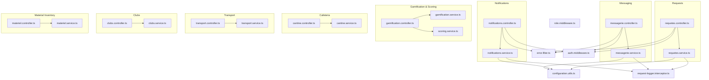
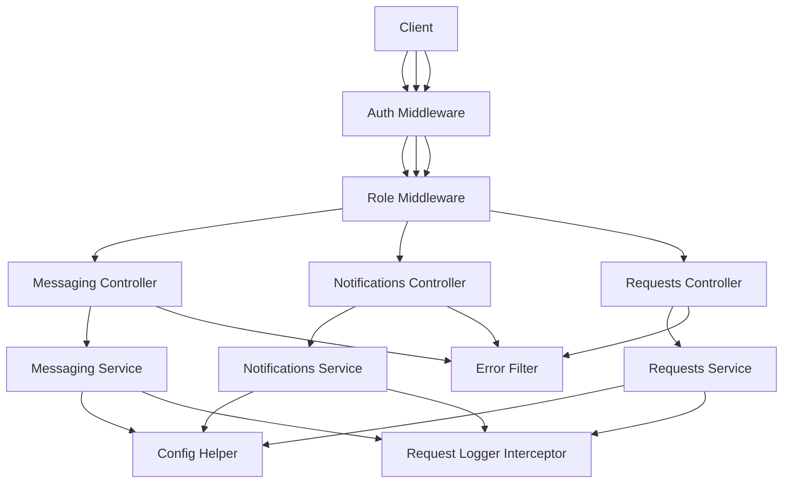
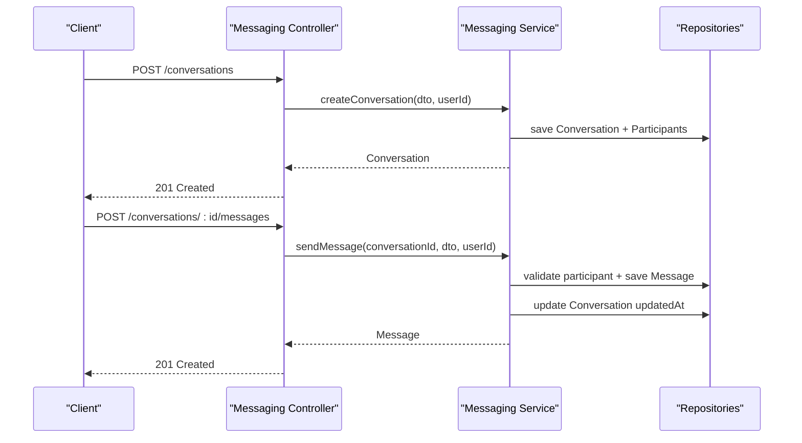
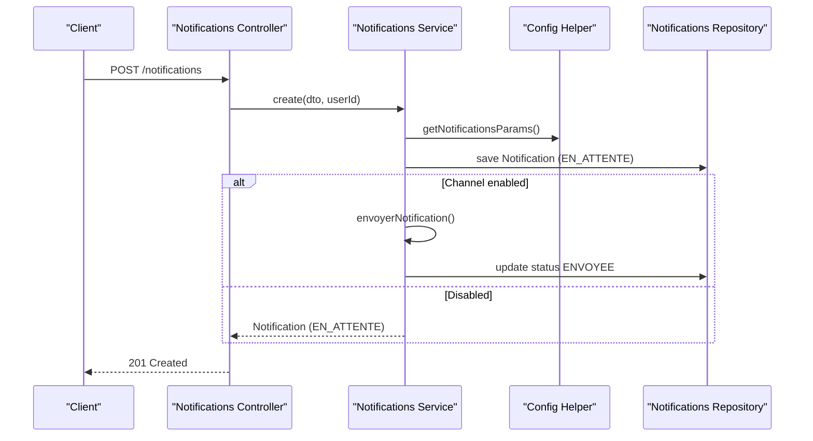
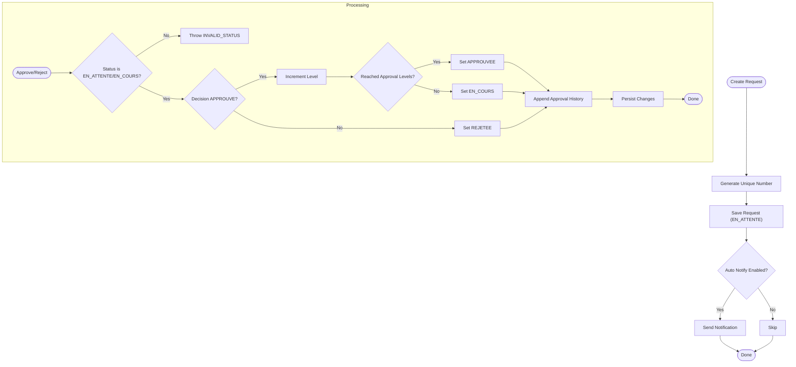
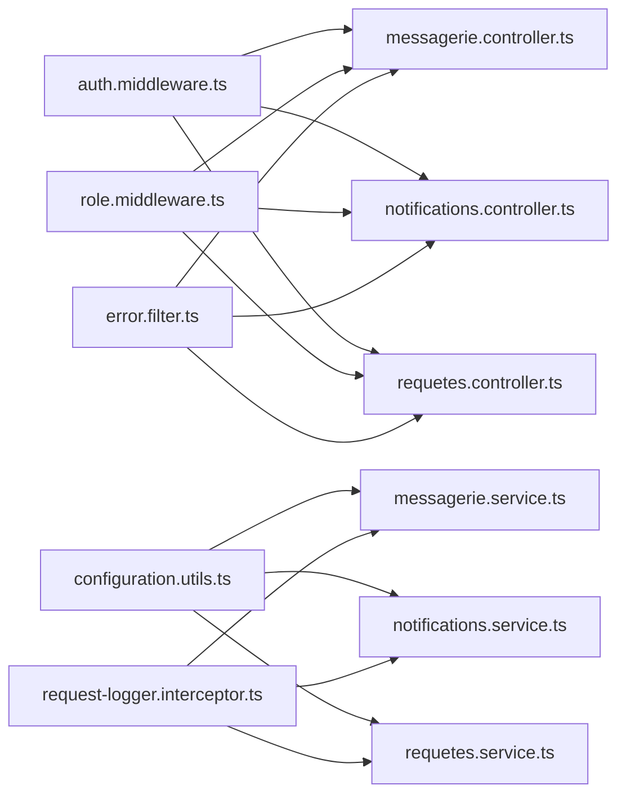

# Utility Modules

<cite>
**Referenced Files in This Document**
- [messagerie.controller.ts](file://backend/src/modules/messagerie/controllers/messagerie.controller.ts)
- [messagerie.service.ts](file://backend/src/modules/messagerie/services/messagerie.service.ts)
- [notifications.controller.ts](file://backend/src/modules/notifications/controllers/notifications.controller.ts)
- [notifications.service.ts](file://backend/src/modules/notifications/services/notifications.service.ts)
- [requetes.controller.ts](file://backend/src/modules/requetes/controllers/requetes.controller.ts)
- [requetes.service.ts](file://backend/src/modules/requetes/services/requetes.service.ts)
- [gamification.controller.ts](file://backend/src/modules/gamification/controllers/gamification.controller.ts)
- [gamification.service.ts](file://backend/src/modules/gamification/services/gamification.service.ts)
- [scoring.service.ts](file://backend/src/modules/scoring/services/scoring.service.ts)
- [cantine.controller.ts](file://backend/src/modules/cantine/controllers/cantine.controller.ts)
- [cantine.service.ts](file://backend/src/modules/cantine/services/cantine.service.ts)
- [transport.controller.ts](file://backend/src/modules/transport/controllers/transport.controller.ts)
- [transport.service.ts](file://backend/src/modules/transport/services/transport.service.ts)
- [clubs.controller.ts](file://backend/src/modules/clubs/controllers/clubs.controller.ts)
- [clubs.service.ts](file://backend/src/modules/clubs/services/clubs.service.ts)
- [materiel.controller.ts](file://backend/src/modules/materiel/controllers/materiel.controller.ts)
- [materiel.service.ts](file://backend/src/modules/materiel/services/materiel.service.ts)
- [configuration.utils.ts](file://backend/src/modules/configuration/utils/config.helper.ts)
- [error.filter.ts](file://backend/src/common/filters/error.filter.ts)
- [request-logger.interceptor.ts](file://backend/src/common/interceptors/request-logger.interceptor.ts)
- [auth.middleware.ts](file://backend/src/modules/auth/middlewares/auth.middleware.ts)
- [role.middleware.ts](file://backend/src/modules/auth/middlewares/role.middleware.ts)
- [index.ts](file://backend/src/modules/index.ts)
</cite>

## Table of Contents
1. [Introduction](#introduction)
2. [Project Structure](#project-structure)
3. [Core Components](#core-components)
4. [Architecture Overview](#architecture-overview)
5. [Detailed Component Analysis](#detailed-component-analysis)
6. [Dependency Analysis](#dependency-analysis)
7. [Performance Considerations](#performance-considerations)
8. [Troubleshooting Guide](#troubleshooting-guide)
9. [Conclusion](#conclusion)
10. [Appendices](#appendices)

## Introduction
This document describes the utility modules that provide specialized services and support functions across the educational platform. These modules enhance the overall user experience by enabling secure messaging, robust notification delivery, structured request management, gamification and scoring, cafeteria services, transportation management, extracurricular activities, and material inventory tracking. The documentation explains integration patterns with core modules, service-layer implementations, and user interaction workflows, while also highlighting extensibility points for future enhancements.

## Project Structure
Utility modules are organized by feature domain under the backend modules directory. Each module follows a consistent structure:
- Controllers: Express route handlers with middleware and DTO validation
- Services: Business logic with database repositories and configuration-driven behavior
- Entities: TypeORM entities for persistence
- DTOs: Validation schemas for requests and responses
- Utilities: Shared helpers (e.g., configuration helpers)

**Diagram sources**
- [messagerie.controller.ts:1-64](file://backend/src/modules/messagerie/controllers/messagerie.controller.ts#L1-L64)
- [messagerie.service.ts:1-273](file://backend/src/modules/messagerie/services/messagerie.service.ts#L1-L273)
- [notifications.controller.ts:1-165](file://backend/src/modules/notifications/controllers/notifications.controller.ts#L1-L165)
- [notifications.service.ts:1-277](file://backend/src/modules/notifications/services/notifications.service.ts#L1-L277)
- [requetes.controller.ts:1-65](file://backend/src/modules/requetes/controllers/requetes.controller.ts#L1-L65)
- [requetes.service.ts:1-202](file://backend/src/modules/requetes/services/requetes.service.ts#L1-L202)
- [gamification.controller.ts](file://backend/src/modules/gamification/controllers/gamification.controller.ts)
- [gamification.service.ts](file://backend/src/modules/gamification/services/gamification.service.ts)
- [scoring.service.ts](file://backend/src/modules/scoring/services/scoring.service.ts)
- [cantine.controller.ts](file://backend/src/modules/cantine/controllers/cantine.controller.ts)
- [cantine.service.ts](file://backend/src/modules/cantine/services/cantine.service.ts)
- [transport.controller.ts](file://backend/src/modules/transport/controllers/transport.controller.ts)
- [transport.service.ts](file://backend/src/modules/transport/services/transport.service.ts)
- [clubs.controller.ts](file://backend/src/modules/clubs/controllers/clubs.controller.ts)
- [clubs.service.ts](file://backend/src/modules/clubs/services/clubs.service.ts)
- [materiel.controller.ts](file://backend/src/modules/materiel/controllers/materiel.controller.ts)
- [materiel.service.ts](file://backend/src/modules/materiel/services/materiel.service.ts)
- [configuration.utils.ts](file://backend/src/modules/configuration/utils/config.helper.ts)
- [error.filter.ts](file://backend/src/common/filters/error.filter.ts)
- [request-logger.interceptor.ts](file://backend/src/common/interceptors/request-logger.interceptor.ts)
- [auth.middleware.ts](file://backend/src/modules/auth/middlewares/auth.middleware.ts)
- [role.middleware.ts](file://backend/src/modules/auth/middlewares/role.middleware.ts)

**Section sources**
- [messagerie.controller.ts:1-64](file://backend/src/modules/messagerie/controllers/messagerie.controller.ts#L1-L64)
- [notifications.controller.ts:1-165](file://backend/src/modules/notifications/controllers/notifications.controller.ts#L1-L165)
- [requetes.controller.ts:1-65](file://backend/src/modules/requetes/controllers/requetes.controller.ts#L1-L65)
- [configuration.utils.ts](file://backend/src/modules/configuration/utils/config.helper.ts)

## Core Components
This section outlines the primary utility modules and their responsibilities.

- Messaging System: Secure, authenticated chat with conversations, messages, and participant management. Supports configurable limits and attachments.
- Notification Framework: Multi-channel notifications (in-app, email, push, SMS) with scheduling, read tracking, and bulk creation.
- Request Management: Structured request lifecycle with approval levels, history tracking, and status transitions.
- Gamification and Scoring Systems: Achievement-based systems and scoring mechanisms integrated via dedicated services.
- Cafeteria Services: Meal ordering and management features.
- Transportation Management: Student transport coordination and tracking.
- Extracurricular Activities: Clubs and activity management.
- Material Inventory: Equipment and supply tracking.

Integration highlights:
- Authentication and authorization middleware protect endpoints.
- Centralized configuration via configuration utilities drives behavior.
- Error handling and request logging are applied consistently.

**Section sources**
- [messagerie.service.ts:1-273](file://backend/src/modules/messagerie/services/messagerie.service.ts#L1-L273)
- [notifications.service.ts:1-277](file://backend/src/modules/notifications/services/notifications.service.ts#L1-L277)
- [requetes.service.ts:1-202](file://backend/src/modules/requetes/services/requetes.service.ts#L1-L202)
- [gamification.service.ts](file://backend/src/modules/gamification/services/gamification.service.ts)
- [scoring.service.ts](file://backend/src/modules/scoring/services/scoring.service.ts)
- [cantine.service.ts](file://backend/src/modules/cantine/services/cantine.service.ts)
- [transport.service.ts](file://backend/src/modules/transport/services/transport.service.ts)
- [clubs.service.ts](file://backend/src/modules/clubs/services/clubs.service.ts)
- [materiel.service.ts](file://backend/src/modules/materiel/services/materiel.service.ts)
- [auth.middleware.ts](file://backend/src/modules/auth/middlewares/auth.middleware.ts)
- [role.middleware.ts](file://backend/src/modules/auth/middlewares/role.middleware.ts)
- [error.filter.ts](file://backend/src/common/filters/error.filter.ts)
- [request-logger.interceptor.ts](file://backend/src/common/interceptors/request-logger.interceptor.ts)

## Architecture Overview
The utility modules follow a layered architecture:
- Controllers handle HTTP requests, apply middleware, and delegate to services.
- Services encapsulate business logic, interact with repositories, and enforce configuration-driven policies.
- Entities define persistence models.
- DTOs validate inputs.
- Shared utilities (configuration, logging, error handling) are reused across modules.

**Diagram sources**
- [messagerie.controller.ts:1-64](file://backend/src/modules/messagerie/controllers/messagerie.controller.ts#L1-L64)
- [messagerie.service.ts:1-273](file://backend/src/modules/messagerie/services/messagerie.service.ts#L1-L273)
- [notifications.controller.ts:1-165](file://backend/src/modules/notifications/controllers/notifications.controller.ts#L1-L165)
- [notifications.service.ts:1-277](file://backend/src/modules/notifications/services/notifications.service.ts#L1-L277)
- [requetes.controller.ts:1-65](file://backend/src/modules/requetes/controllers/requetes.controller.ts#L1-L65)
- [requetes.service.ts:1-202](file://backend/src/modules/requetes/services/requetes.service.ts#L1-L202)
- [configuration.utils.ts](file://backend/src/modules/configuration/utils/config.helper.ts)
- [request-logger.interceptor.ts](file://backend/src/common/interceptors/request-logger.interceptor.ts)
- [error.filter.ts](file://backend/src/common/filters/error.filter.ts)
- [auth.middleware.ts](file://backend/src/modules/auth/middlewares/auth.middleware.ts)
- [role.middleware.ts](file://backend/src/modules/auth/middlewares/role.middleware.ts)

## Detailed Component Analysis

### Messaging System
The messaging module enables secure conversations with participant management, message CRUD, and read tracking. It validates inputs, enforces configuration limits, and logs operations.

Key capabilities:
- Create conversations with configurable participant caps and admin controls
- Send messages with length checks and optional attachments
- Retrieve paginated messages with read receipts
- Delete messages with soft-deletion semantics
- Count unread messages across conversations

**Diagram sources**
- [messagerie.controller.ts:24-54](file://backend/src/modules/messagerie/controllers/messagerie.controller.ts#L24-L54)
- [messagerie.service.ts:45-158](file://backend/src/modules/messagerie/services/messagerie.service.ts#L45-L158)

**Section sources**
- [messagerie.controller.ts:1-64](file://backend/src/modules/messagerie/controllers/messagerie.controller.ts#L1-L64)
- [messagerie.service.ts:1-273](file://backend/src/modules/messagerie/services/messagerie.service.ts#L1-L273)

### Notification Framework
The notifications module supports multi-channel delivery (in-app, email, push, SMS) with scheduling, read tracking, and bulk operations. It reads channel preferences from centralized configuration and updates statuses accordingly.

Key capabilities:
- Create single or bulk notifications with prioritization and categorization
- Query user-specific notifications with filtering and pagination
- Mark individual/all notifications as read
- Delete notifications
- Count unread notifications
- Scheduled delivery processing

**Diagram sources**
- [notifications.controller.ts:66-84](file://backend/src/modules/notifications/controllers/notifications.controller.ts#L66-L84)
- [notifications.service.ts:44-77](file://backend/src/modules/notifications/services/notifications.service.ts#L44-L77)
- [notifications.service.ts:195-229](file://backend/src/modules/notifications/services/notifications.service.ts#L195-L229)

**Section sources**
- [notifications.controller.ts:1-165](file://backend/src/modules/notifications/controllers/notifications.controller.ts#L1-L165)
- [notifications.service.ts:1-277](file://backend/src/modules/notifications/services/notifications.service.ts#L1-L277)

### Request Management
The requests module manages structured workflows with approval levels, status tracking, and historical approvals. It generates unique identifiers and integrates with configuration for approval behavior.

Key capabilities:
- Create requests with automatic numbering and initial status
- List all or user-specific requests with filtering
- Retrieve single request with relations
- Process approvals with multi-level validation
- Cancel requests when eligible
- Compute statistics

**Diagram sources**
- [requetes.controller.ts:41-55](file://backend/src/modules/requetes/controllers/requetes.controller.ts#L41-L55)
- [requetes.service.ts:43-68](file://backend/src/modules/requetes/services/requetes.service.ts#L43-L68)
- [requetes.service.ts:107-153](file://backend/src/modules/requetes/services/requetes.service.ts#L107-L153)

**Section sources**
- [requetes.controller.ts:1-65](file://backend/src/modules/requetes/controllers/requetes.controller.ts#L1-L65)
- [requetes.service.ts:1-202](file://backend/src/modules/requetes/services/requetes.service.ts#L1-L202)

### Gamification and Scoring Systems
Gamification and scoring services provide achievement-based experiences and performance metrics. They integrate with core modules to enrich student engagement and progress tracking.

Extensibility:
- New badges, achievements, and scoring rules can be added via service extensions.
- Events can trigger scoring updates and notifications.

**Section sources**
- [gamification.controller.ts](file://backend/src/modules/gamification/controllers/gamification.controller.ts)
- [gamification.service.ts](file://backend/src/modules/gamification/services/gamification.service.ts)
- [scoring.service.ts](file://backend/src/modules/scoring/services/scoring.service.ts)

### Cafeteria Services
Cafeteria services manage meal ordering, availability, and consumption tracking. They coordinate with user profiles and schedules to streamline cafeteria operations.

Extensibility:
- Integrate payment providers and dietary restrictions.
- Add reporting and analytics dashboards.

**Section sources**
- [cantine.controller.ts](file://backend/src/modules/cantine/controllers/cantine.controller.ts)
- [cantine.service.ts](file://backend/src/modules/cantine/services/cantine.service.ts)

### Transportation Management
Transportation services handle student transport registration, route assignments, and attendance tracking. They support scheduling and real-time updates.

Extensibility:
- Integrate GPS tracking and driver management.
- Add capacity constraints and waitlists.

**Section sources**
- [transport.controller.ts](file://backend/src/modules/transport/controllers/transport.controller.ts)
- [transport.service.ts](file://backend/src/modules/transport/services/transport.service.ts)

### Extracurricular Activities (Clubs)
Club management includes activity creation, member enrollment, scheduling, and progress tracking. It supports diverse activity types and administrative oversight.

Extensibility:
- Add activity categories, skill levels, and mentorship features.
- Integrate calendar sync and resource booking.

**Section sources**
- [clubs.controller.ts](file://backend/src/modules/clubs/controllers/clubs.controller.ts)
- [clubs.service.ts](file://backend/src/modules/clubs/services/clubs.service.ts)

### Material Inventory
Material inventory services track equipment, supplies, and issuance records. They support check-in/check-out workflows, low-stock alerts, and maintenance scheduling.

Extensibility:
- Add barcode scanning and asset tagging.
- Integrate procurement workflows and vendor management.

**Section sources**
- [materiel.controller.ts](file://backend/src/modules/materiel/controllers/materiel.controller.ts)
- [materiel.service.ts](file://backend/src/modules/materiel/services/materiel.service.ts)

## Dependency Analysis
Utility modules share common infrastructure:
- Authentication and role-based middleware protect endpoints.
- Centralized configuration drives behavior (limits, channels, approval levels).
- Error handling and request logging are consistently applied.
- Services depend on repositories and the shared configuration helper.

**Diagram sources**
- [auth.middleware.ts](file://backend/src/modules/auth/middlewares/auth.middleware.ts)
- [role.middleware.ts](file://backend/src/modules/auth/middlewares/role.middleware.ts)
- [configuration.utils.ts](file://backend/src/modules/configuration/utils/config.helper.ts)
- [error.filter.ts](file://backend/src/common/filters/error.filter.ts)
- [request-logger.interceptor.ts](file://backend/src/common/interceptors/request-logger.interceptor.ts)
- [messagerie.controller.ts:1-64](file://backend/src/modules/messagerie/controllers/messagerie.controller.ts#L1-L64)
- [notifications.controller.ts:1-165](file://backend/src/modules/notifications/controllers/notifications.controller.ts#L1-L165)
- [requetes.controller.ts:1-65](file://backend/src/modules/requetes/controllers/requetes.controller.ts#L1-L65)
- [messagerie.service.ts:1-273](file://backend/src/modules/messagerie/services/messagerie.service.ts#L1-L273)
- [notifications.service.ts:1-277](file://backend/src/modules/notifications/services/notifications.service.ts#L1-L277)
- [requetes.service.ts:1-202](file://backend/src/modules/requetes/services/requetes.service.ts#L1-L202)

**Section sources**
- [auth.middleware.ts](file://backend/src/modules/auth/middlewares/auth.middleware.ts)
- [role.middleware.ts](file://backend/src/modules/auth/middlewares/role.middleware.ts)
- [configuration.utils.ts](file://backend/src/modules/configuration/utils/config.helper.ts)
- [error.filter.ts](file://backend/src/common/filters/error.filter.ts)
- [request-logger.interceptor.ts](file://backend/src/common/interceptors/request-logger.interceptor.ts)

## Performance Considerations
- Pagination and filtering in controllers reduce payload sizes and database load.
- Centralized configuration avoids hard-coded values and improves tuning without redeployment.
- Logging and error handling are lightweight and avoid overhead in hot paths.
- Bulk operations in notifications and requests minimize round-trips.
- Repository queries use joins and counts efficiently; consider adding indexes for frequently filtered fields.

## Troubleshooting Guide
Common issues and resolutions:
- Validation errors: Ensure DTOs conform to schemas; errors are returned with explicit codes.
- Authorization failures: Verify authentication tokens and roles; admin-only endpoints require elevated permissions.
- Resource not found: Confirm IDs and relationships; services throw explicit not-found errors.
- Configuration disabled channels: Enable required channels or adjust centralized parameters.
- Exceeded limits: Respect configured caps for participants, message length, and attachment sizes.

**Section sources**
- [error.filter.ts](file://backend/src/common/filters/error.filter.ts)
- [messagerie.service.ts:49-56](file://backend/src/modules/messagerie/services/messagerie.service.ts#L49-L56)
- [messagerie.service.ts:128-135](file://backend/src/modules/messagerie/services/messagerie.service.ts#L128-L135)
- [notifications.service.ts:50-59](file://backend/src/modules/notifications/services/notifications.service.ts#L50-L59)
- [requetes.service.ts:111-113](file://backend/src/modules/requetes/services/requetes.service.ts#L111-L113)

## Conclusion
The utility modules form a cohesive ecosystem that enhances the educational platform’s functionality and user experience. By leveraging shared middleware, centralized configuration, and consistent service patterns, these modules are both maintainable and extensible. Integrating specialized services—messaging, notifications, requests, gamification, cafeteria, transport, clubs, and inventory—enables a comprehensive solution tailored to modern school environments.

## Appendices
- Integration checklist for extending utility modules:
  - Add controller routes with validation and middleware.
  - Implement service logic with configuration-driven behavior.
  - Define DTOs and entities as needed.
  - Apply logging and error handling.
  - Update module index exports and routing.