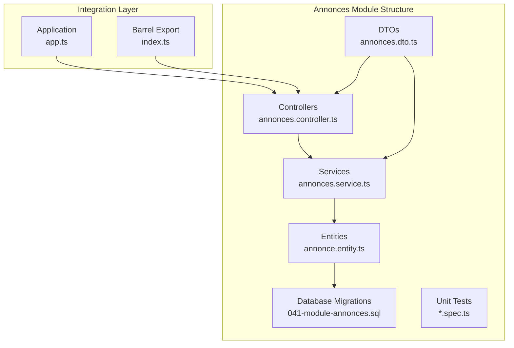
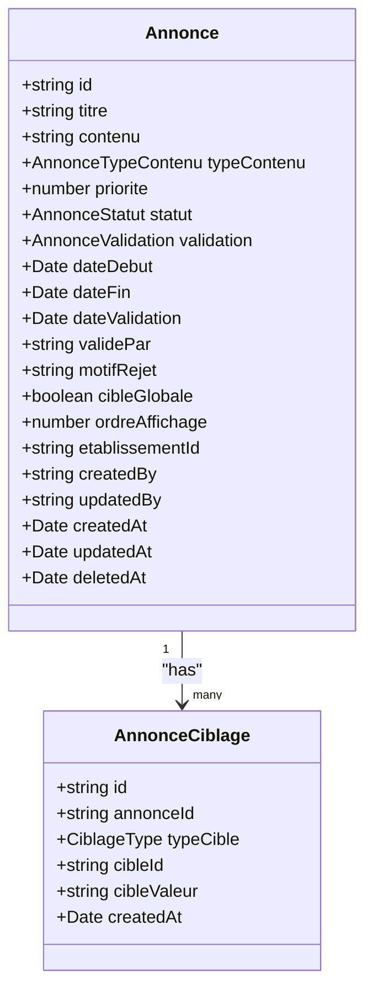
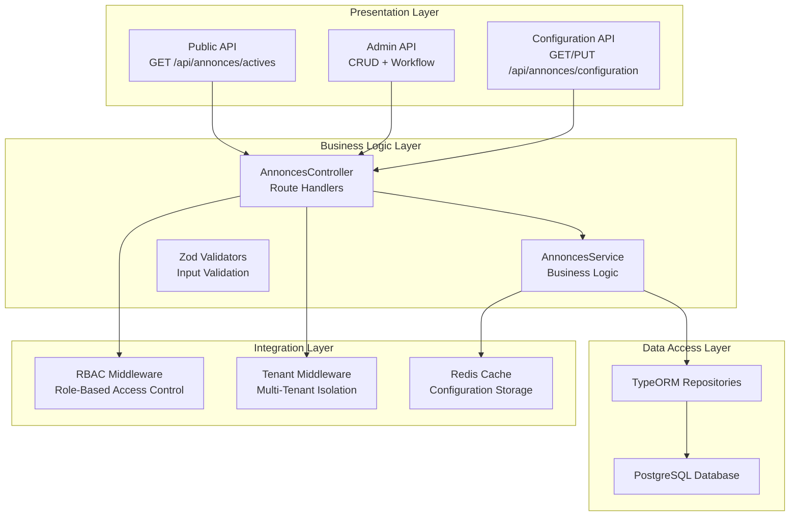
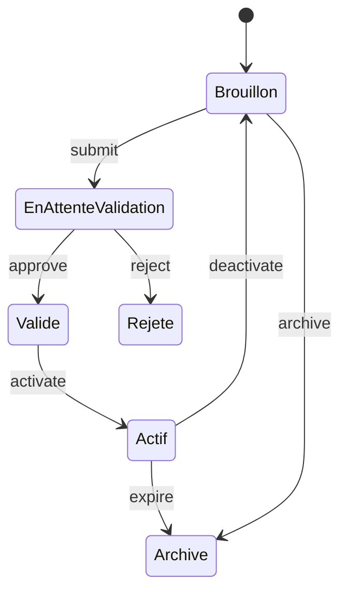
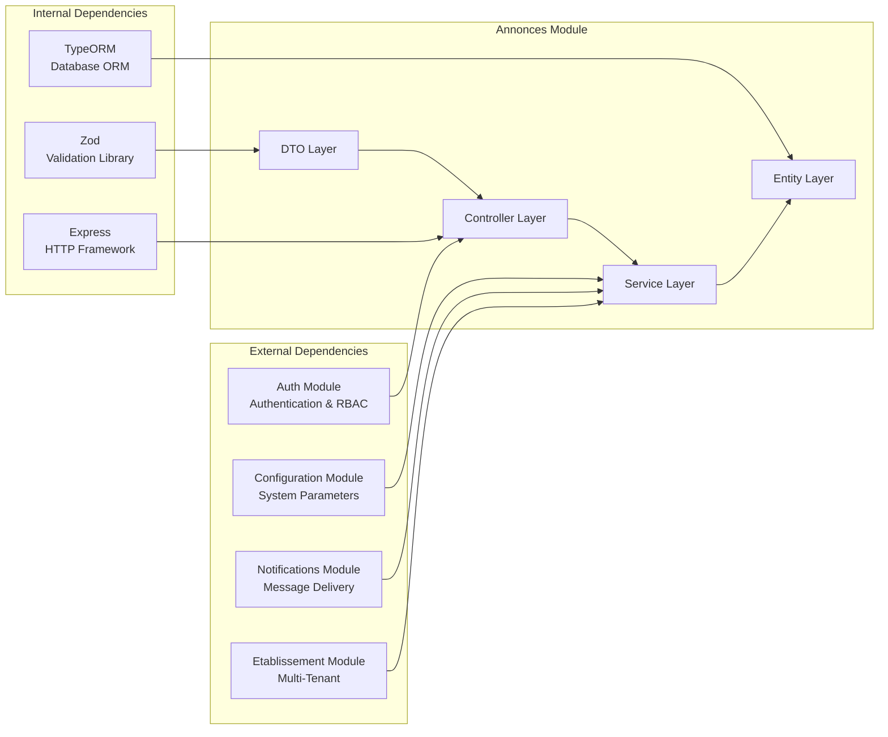

# Annonces Module

<cite>
**Referenced Files in This Document**
- [annonces.controller.ts](file://backend/src/modules/annonces/controllers/annonces.controller.ts)
- [annonces.service.ts](file://backend/src/modules/annonces/services/annonces.service.ts)
- [annonce.entity.ts](file://backend/src/modules/annonces/entities/annonce.entity.ts)
- [annonces.dto.ts](file://backend/src/modules/annonces/dto/annonces.dto.ts)
- [index.ts](file://backend/src/modules/annonces/index.ts)
- [041-module-annonces.sql](file://backend/database/migrations/041-module-annonces.sql)
- [041-module-annonces-fix.sql](file://backend/database/migrations/041-module-annonces-fix.sql)
- [MODULE-ANNONCES.md](file://docs/MODULE-ANNONCES.md)
- [deploy-annonces.sh](file://scripts/deploy-annonces.sh)
- [DEPLOYMENT-ANNONCES-RAPPORT.md](file://DEPLOYMENT-ANNONCES-RAPPORT.md)
- [app.ts](file://backend/src/app.ts)
- [index.ts](file://backend/src/modules/index.ts)
</cite>

## Table of Contents
1. [Introduction](#introduction)
2. [Project Structure](#project-structure)
3. [Core Components](#core-components)
4. [Architecture Overview](#architecture-overview)
5. [Detailed Component Analysis](#detailed-component-analysis)
6. [Dependency Analysis](#dependency-analysis)
7. [Performance Considerations](#performance-considerations)
8. [Troubleshooting Guide](#troubleshooting-guide)
9. [Conclusion](#conclusion)

## Introduction

The Annonces module is a comprehensive announcement management system for the eLISAschool platform. It provides a complete solution for managing announcements with a scrolling banner, multi-criteria targeting, validation workflows, and temporal scheduling capabilities. The module is designed with multi-tenancy support, ensuring that announcements are isolated by educational institutions.

This module enables schools to communicate important information to their communities through a flexible and secure announcement system that supports various content types, targeted audiences, and automated scheduling.

## Project Structure

The Annonces module follows a clean architecture pattern with clear separation of concerns:

**Diagram sources**
- [annonces.controller.ts:1-558](file://backend/src/modules/annonces/controllers/annonces.controller.ts#L1-L558)
- [annonces.service.ts:1-729](file://backend/src/modules/annonces/services/annonces.service.ts#L1-L729)
- [annonce.entity.ts:1-180](file://backend/src/modules/annonces/entities/annonce.entity.ts#L1-L180)
- [annonces.dto.ts:1-116](file://backend/src/modules/annonces/dto/annonces.dto.ts#L1-L116)

**Section sources**
- [index.ts:1-11](file://backend/src/modules/annonces/index.ts#L1-L11)
- [app.ts:35-35](file://backend/src/app.ts#L35-L35)
- [index.ts:23-23](file://backend/src/modules/index.ts#L23-L23)

## Core Components

### Database Schema

The module implements a robust database schema with two primary tables:

**Annonces Table**: Stores main announcement data with comprehensive metadata
- UUID primary key for global uniqueness
- Content management with multiple formats (text, HTML, enriched)
- Multi-criteria targeting system
- Validation workflow tracking
- Audit trail with creation/update timestamps

**AnnonceCiblages Table**: Manages targeting criteria with foreign key relationships
- Flexible targeting system supporting roles, users, classes, and institutions
- Cascade deletion for maintaining referential integrity
- Optimized indexing for performance

### Entity Definitions

The module defines two core entities with TypeScript interfaces:

**Diagram sources**
- [annonce.entity.ts:47-144](file://backend/src/modules/annonces/entities/annonce.entity.ts#L47-L144)
- [annonce.entity.ts:148-179](file://backend/src/modules/annonces/entities/annonce.entity.ts#L148-L179)

### Service Layer

The service layer provides comprehensive business logic with:

- **CRUD Operations**: Full create, read, update, delete functionality
- **Validation Workflow**: Multi-level approval process
- **Targeting System**: Advanced audience segmentation
- **Temporal Management**: Automatic status transitions
- **Configuration Management**: Dynamic banner settings
- **Notification System**: Integration-ready notification framework

**Section sources**
- [annonces.service.ts:73-729](file://backend/src/modules/annonces/services/annonces.service.ts#L73-L729)

## Architecture Overview

The Annonces module follows a layered architecture pattern with clear separation between presentation, business logic, and data access layers:

**Diagram sources**
- [annonces.controller.ts:14-558](file://backend/src/modules/annonces/controllers/annonces.controller.ts#L14-L558)
- [annonces.service.ts:73-729](file://backend/src/modules/annonces/services/annonces.service.ts#L73-L729)
- [app.ts:188-209](file://backend/src/app.ts#L188-L209)

## Detailed Component Analysis

### Controller Implementation

The controller handles all HTTP endpoints with comprehensive middleware integration:

#### Authentication and Authorization
- **Public endpoints**: Require basic authentication (`authMiddleware`)
- **Admin endpoints**: Require specific roles (`requireRoles`)
- **Multi-tenant enforcement**: Automatic tenant isolation

#### Endpoint Categories

**Public Endpoints**:
- `/api/annonces/actives` - Retrieves active announcements for authenticated users
- Validates user context and applies targeting filters

**Configuration Endpoints**:
- `/api/annonces/configuration` - Get/set banner configuration
- `/api/annonces/criteres-ciblage` - Retrieve targeting criteria
- `/api/annonces/mettre-a-jour-statuts` - Automatic status updates

**CRUD Endpoints**:
- `/api/annonces` - List with pagination and filtering
- `/api/annonces/:id` - Individual record operations
- Supports soft delete operations

**Workflow Endpoints**:
- `/api/annonces/:id/soumettre-validation` - Submit for approval
- `/api/annonces/:id/valider` - Approve announcement
- `/api/annonces/:id/rejeter` - Reject with reason

**Management Endpoints**:
- `/api/annonces/:id/activer` - Activate announcement
- `/api/annonces/:id/desactiver` - Deactivate announcement
- `/api/annonces/:id/archiver` - Archive announcement

**Section sources**
- [annonces.controller.ts:35-558](file://backend/src/modules/annonces/controllers/annonces.controller.ts#L35-L558)

### Service Layer Implementation

The service layer implements comprehensive business logic:

#### Core Business Methods

**getAnnoncesActives()**: 
- Filters announcements by status and date range
- Applies multi-criteria targeting based on user roles
- Returns ordered announcements by priority and display order

**findAll()**:
- Implements pagination with configurable limits
- Supports filtering by status and text search
- Returns comprehensive pagination metadata

**CRUD Operations**:
- **create()**: Validates input, sanitizes content, creates records
- **update()**: Handles partial updates with validation
- **delete()**: Implements soft delete functionality

#### Validation Workflow

The service implements a multi-level validation process:

**Diagram sources**
- [annonces.service.ts:358-461](file://backend/src/modules/annonces/services/annonces.service.ts#L358-L461)

#### Targeting System

Advanced audience targeting with multiple criteria:

- **Global Targeting**: Visible to all users
- **Role-Based Targeting**: Target specific user roles
- **Individual Targeting**: Specific user IDs
- **Class/Niveau/Fonction Targeting**: Educational institution segments
- **Institution Targeting**: Complete school-wide announcements

**Section sources**
- [annonces.service.ts:86-134](file://backend/src/modules/annonces/services/annonces.service.ts#L86-L134)

### Data Transfer Objects (DTOs)

The module uses Zod for comprehensive input validation:

#### Validation Schemas

**CreateAnnonceSchema**:
- Title validation (5-200 characters)
- Content validation (10-5000 characters)
- Date range validation
- Priority and display ordering
- Content type enumeration
- Targeting criteria validation

**UpdateAnnonceSchema**:
- Partial validation for updates
- Status change restrictions
- Date validation for modifications

**Configuration Schema**:
- Banner animation settings
- Display parameters
- Content type restrictions
- Performance tuning options

**Section sources**
- [annonces.dto.ts:34-78](file://backend/src/modules/annonces/dto/annonces.dto.ts#L34-L78)

### Database Migration

The migration script establishes the complete database infrastructure:

#### Table Creation

**Primary Table (annonces)**:
- UUID primary key with default generation
- Comprehensive column definitions for all features
- Multi-column indexes for optimal performance
- Audit columns for tracking

**Secondary Table (annonce_ciblages)**:
- Foreign key relationships with cascade deletes
- Multi-column indexing for targeting queries
- Flexible targeting structure

#### Permission System

RBAC integration with comprehensive permission sets:

**Basic Permissions**:
- `annonce:view` - Read-only access
- `annonce:create` - Create announcements
- `annonce:edit` - Modify announcements
- `annonce:delete` - Delete announcements

**Management Permissions**:
- `annonce:manage` - Full administrative access
- `annonce:configurer` - Configure banner settings

**Workflow Permissions**:
- `annonce:valider` - Approve/reject announcements
- `annonce:publier` - Publish announcements
- `annonce:programmer` - Schedule announcements
- `annonce:archiver` - Archive announcements
- `annonce:desactiver` - Deactivate announcements
- `annonce:activer` - Activate announcements

**Section sources**
- [041-module-annonces.sql:13-160](file://backend/database/migrations/041-module-annonces.sql#L13-L160)
- [041-module-annonces-fix.sql:20-114](file://backend/database/migrations/041-module-annonces-fix.sql#L20-L114)

## Dependency Analysis

The Annonces module integrates with several core system components:

**Diagram sources**
- [app.ts:27-69](file://backend/src/app.ts#L27-L69)
- [annonces.controller.ts:17-19](file://backend/src/modules/annonces/controllers/annonces.controller.ts#L17-L19)
- [annonces.service.ts:18-23](file://backend/src/modules/annonces/services/annonces.service.ts#L18-L23)

### Integration Points

**Authentication Integration**:
- Uses auth middleware for user context
- Role-based access control enforcement
- Tenant isolation through middleware

**Configuration Integration**:
- System parameter storage
- Runtime configuration updates
- Cache invalidation mechanisms

**Notification Integration**:
- Ready-to-use notification framework
- Role-based and individual targeting
- Future enhancement points

**Section sources**
- [app.ts:188-209](file://backend/src/app.ts#L188-L209)
- [annonces.service.ts:638-683](file://backend/src/modules/annonces/services/annonces.service.ts#L638-L683)

## Performance Considerations

The module implements several performance optimization strategies:

### Database Optimization

**Index Strategy**:
- Composite index on `(etablissementId)` for tenant isolation
- Composite index on `(statut, dateDebut, dateFin)` for status filtering
- Global index on `cible_globale` for broad targeting
- Multi-column index on `(typeCible, cibleId)` for targeting queries

**Query Optimization**:
- Efficient pagination with offset/limit
- Selective field retrieval with relations
- Batch operations for bulk updates
- Soft delete for data retention

### Caching Strategy

**Configuration Caching**:
- 5-minute TTL for banner configuration
- Redis-based caching for system parameters
- Cache invalidation on configuration updates

**Query Result Caching**:
- Potential for announcement list caching
- User-specific announcement caching
- Targeting result caching

### Security Measures

**Input Sanitization**:
- XSS prevention for HTML content
- Content type validation
- Size limitations for all inputs

**Access Control**:
- Multi-layered authorization checks
- Tenant isolation enforcement
- Role-based endpoint protection

## Troubleshooting Guide

### Common Issues and Solutions

**Database Migration Failures**:
- Verify PostgreSQL connectivity and credentials
- Check for existing table conflicts
- Ensure proper schema permissions

**Permission Issues**:
- Verify role assignments in RBAC system
- Check module activation status
- Review tenant membership

**Validation Errors**:
- Check Zod validation messages
- Verify date format compliance (ISO 8601)
- Validate content length and type restrictions

**Performance Issues**:
- Monitor database query execution times
- Check index utilization
- Review pagination parameters

### Debugging Tools

**Logging Configuration**:
- Comprehensive error logging
- Request/response tracing
- Performance metrics collection

**Monitoring Integration**:
- Health check endpoints
- Performance monitoring hooks
- Error tracking integration

**Section sources**
- [annonces.controller.ts:25-31](file://backend/src/modules/annonces/controllers/annonces.controller.ts#L25-L31)
- [annonces.service.ts:274-277](file://backend/src/modules/annonces/services/annonces.service.ts#L274-L277)

## Conclusion

The Annonces module represents a comprehensive and well-architected solution for educational institution communication. The module successfully implements:

**Technical Excellence**:
- Clean architecture with clear separation of concerns
- Robust validation and security measures
- Comprehensive testing and documentation
- Performance-optimized database design

**Business Value**:
- Flexible announcement management system
- Advanced targeting capabilities
- Automated workflow processes
- Multi-tenant support for institutional scalability

**Future Enhancement Opportunities**:
- WebSocket integration for real-time updates
- File attachment support for multimedia content
- Advanced scheduling and recurring announcements
- Analytics and engagement tracking
- Enhanced notification delivery systems

The module is production-ready and provides a solid foundation for educational communication needs while maintaining extensibility for future requirements.