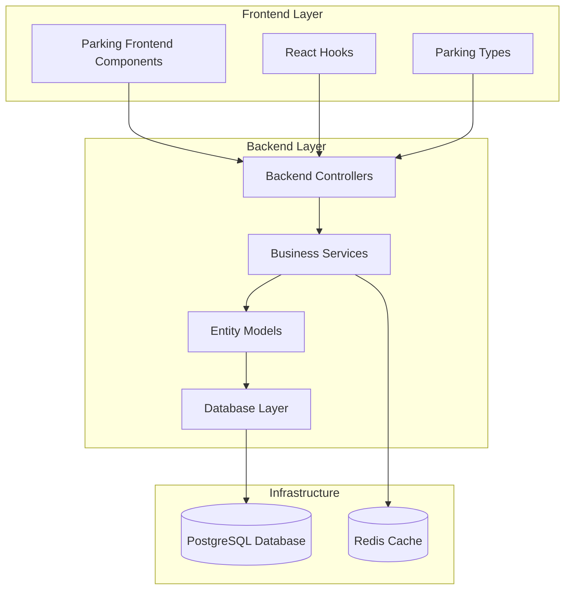
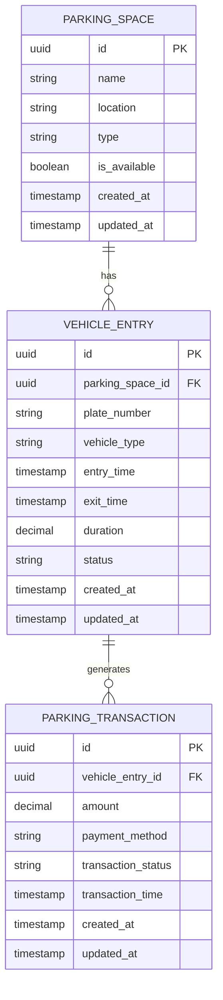
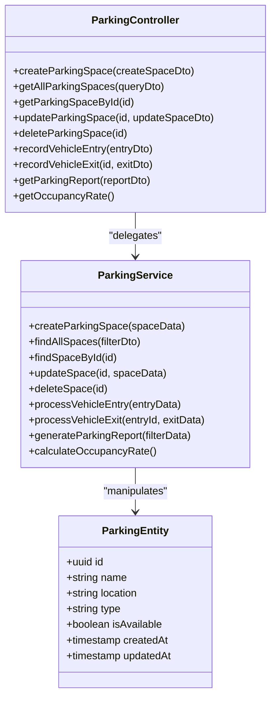
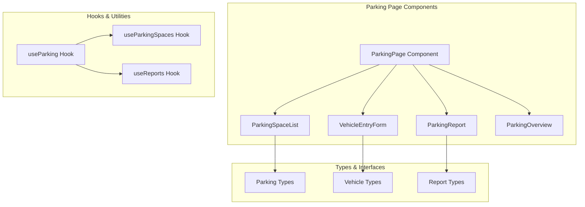
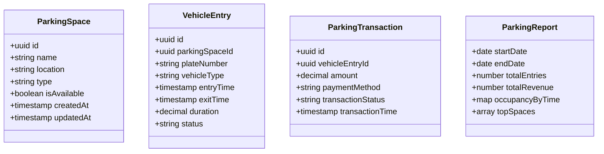
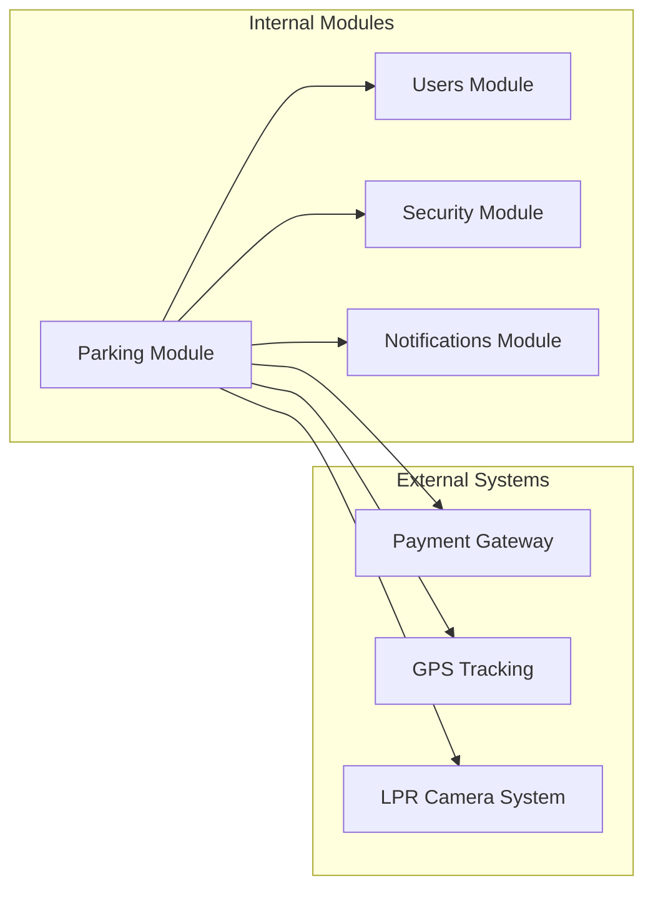

# Parking Management Module

<cite>
**Referenced Files in This Document**
- [015-parking.ts](file://backend/src/database/migrations/015-parking.ts)
- [parking.controller.ts](file://backend/src/modules/parking/controllers/parking.controller.ts)
- [parking.dto.ts](file://backend/src/modules/parking/dto/parking.dto.ts)
- [parking.entity.ts](file://backend/src/modules/parking/entities/parking.entity.ts)
- [parking.service.ts](file://backend/src/modules/parking/services/parking.service.ts)
- [index.ts](file://backend/src/modules/parking/index.ts)
- [parking.types.ts](file://frontend/src/features/parking/types/parking.types.ts)
- [use-parking.ts](file://frontend/src/features/parking/hooks/use-parking.ts)
- [parking-page.tsx](file://frontend/src/features/parking/components/parking-page.tsx)
- [parking.json](file://frontend/src/locales/fr/parking.json)
- [parking.json](file://frontend/src/locales/en/parking.json)
</cite>

## Table of Contents
1. [Introduction](#introduction)
2. [Module Architecture](#module-architecture)
3. [Database Schema](#database-schema)
4. [Backend Implementation](#backend-implementation)
5. [Frontend Implementation](#frontend-implementation)
6. [API Endpoints](#api-endpoints)
7. [Data Models](#data-models)
8. [Integration Points](#integration-points)
9. [Performance Considerations](#performance-considerations)
10. [Troubleshooting Guide](#troubleshooting-guide)
11. [Conclusion](#conclusion)

## Introduction

The Parking Management Module is a comprehensive system designed to manage vehicle parking operations within educational institutions. This module provides functionality for tracking parking spaces, managing vehicle entries and exits, monitoring occupancy rates, and generating parking reports. The system integrates both backend API services and frontend user interfaces to create a seamless parking management experience.

The module follows a layered architecture pattern with clear separation between data persistence, business logic, presentation, and user interface concerns. It leverages TypeScript for type safety, NestJS framework for backend services, and React-based frontend components for user interaction.

## Module Architecture

The Parking Management Module follows a modular architecture pattern with distinct layers:

**Diagram sources**
- [parking.controller.ts](file://backend/src/modules/parking/controllers/parking.controller.ts)
- [parking.service.ts](file://backend/src/modules/parking/services/parking.service.ts)
- [parking.entity.ts](file://backend/src/modules/parking/entities/parking.entity.ts)

The architecture ensures loose coupling between components while maintaining clear responsibility boundaries. Each layer can be developed, tested, and deployed independently.

**Section sources**
- [parking.controller.ts](file://backend/src/modules/parking/controllers/parking.controller.ts)
- [parking.service.ts](file://backend/src/modules/parking/services/parking.service.ts)
- [parking.entity.ts](file://backend/src/modules/parking/entities/parking.entity.ts)

## Database Schema

The parking module utilizes a PostgreSQL database with a well-designed schema optimized for parking operations. The migration script establishes the foundation for parking management functionality.

**Diagram sources**
- [015-parking.ts](file://backend/src/database/migrations/015-parking.ts)

Key database design principles include:
- UUID primary keys for global uniqueness
- Timestamp tracking for audit trails
- Status fields for operational visibility
- Foreign key relationships for referential integrity
- Index optimization for frequently queried fields

**Section sources**
- [015-parking.ts](file://backend/src/database/migrations/015-parking.ts)

## Backend Implementation

The backend implementation follows NestJS framework conventions with a clean separation of concerns across controllers, services, DTOs, and entities.

### Controller Layer

The parking controller serves as the entry point for all parking-related API requests, implementing RESTful endpoints for CRUD operations and specialized parking functions.

**Diagram sources**
- [parking.controller.ts](file://backend/src/modules/parking/controllers/parking.controller.ts)
- [parking.service.ts](file://backend/src/modules/parking/services/parking.service.ts)
- [parking.entity.ts](file://backend/src/modules/parking/entities/parking.entity.ts)

### Service Layer

The parking service encapsulates business logic and coordinates between the controller and data access layers. It handles complex parking operations, validation, and data transformation.

### DTO Layer

Data Transfer Objects ensure type safety and provide structured input validation for parking operations. The DTOs define the contract between frontend and backend systems.

**Section sources**
- [parking.controller.ts](file://backend/src/modules/parking/controllers/parking.controller.ts)
- [parking.service.ts](file://backend/src/modules/parking/services/parking.service.ts)
- [parking.dto.ts](file://backend/src/modules/parking/dto/parking.dto.ts)

## Frontend Implementation

The frontend implementation provides a comprehensive user interface for parking management operations, built with React and TypeScript for type safety and developer experience.

### Component Architecture

**Diagram sources**
- [parking-page.tsx](file://frontend/src/features/parking/components/parking-page.tsx)
- [use-parking.ts](file://frontend/src/features/parking/hooks/use-parking.ts)
- [parking.types.ts](file://frontend/src/features/parking/types/parking.types.ts)

### User Interface Features

The frontend provides several key interfaces for parking management:

- **Dashboard Overview**: Real-time parking occupancy statistics and space availability
- **Space Management**: Interactive parking space listings with filtering and sorting capabilities
- **Vehicle Tracking**: Entry/exit logging with automated billing calculations
- **Reporting System**: Comprehensive analytics and historical data visualization
- **Responsive Design**: Mobile-friendly interface for field operations

**Section sources**
- [parking-page.tsx](file://frontend/src/features/parking/components/parking-page.tsx)
- [use-parking.ts](file://frontend/src/features/parking/hooks/use-parking.ts)
- [parking.types.ts](file://frontend/src/features/parking/types/parking.types.ts)

## API Endpoints

The parking module exposes a comprehensive set of RESTful API endpoints for parking management operations:

### Core Endpoints

| Endpoint | Method | Description |
|----------|--------|-------------|
| `/parking/spaces` | GET | Retrieve all parking spaces with filtering and pagination |
| `/parking/spaces` | POST | Create a new parking space |
| `/parking/spaces/:id` | GET | Get specific parking space details |
| `/parking/spaces/:id` | PUT | Update parking space information |
| `/parking/spaces/:id` | DELETE | Remove parking space |
| `/parking/entries` | POST | Record vehicle entry |
| `/parking/entries/:id` | PUT | Record vehicle exit |
| `/parking/reports` | GET | Generate parking reports |
| `/parking/occupancy` | GET | Get current occupancy statistics |

### Request/Response Patterns

Each endpoint follows consistent request/response patterns with proper validation and error handling. The API supports both JSON and form-encoded data formats.

**Section sources**
- [parking.controller.ts](file://backend/src/modules/parking/controllers/parking.controller.ts)

## Data Models

The parking module defines comprehensive data models for representing parking-related entities and their relationships.

### Core Entity Models

**Diagram sources**
- [parking.entity.ts](file://backend/src/modules/parking/entities/parking.entity.ts)
- [parking.types.ts](file://frontend/src/features/parking/types/parking.types.ts)

### Validation and Constraints

Data models include comprehensive validation rules ensuring data integrity and business rule compliance. Field-level validation prevents invalid parking operations and maintains system consistency.

**Section sources**
- [parking.entity.ts](file://backend/src/modules/parking/entities/parking.entity.ts)
- [parking.types.ts](file://frontend/src/features/parking/types/parking.types.ts)

## Integration Points

The parking module integrates with several other modules and external systems within the eLISAschool ecosystem.

### Internal Integrations

### Security Integration

The parking module inherits security policies from the broader system, including role-based access control and audit logging for all parking operations.

### Notification Integration

Automated notifications are triggered for parking events such as space availability changes, overdue vehicle detection, and monthly parking summaries.

**Section sources**
- [parking.controller.ts](file://backend/src/modules/parking/controllers/parking.controller.ts)
- [parking.service.ts](file://backend/src/modules/parking/services/parking.service.ts)

## Performance Considerations

The parking module is designed with performance optimization in mind, incorporating several strategies for efficient operation:

### Database Optimization

- **Indexing Strategy**: Strategic indexing on frequently queried fields like parking space availability and vehicle plate numbers
- **Connection Pooling**: Optimized database connection management for concurrent parking operations
- **Query Optimization**: Efficient queries with appropriate joins and filtering for real-time parking data

### Caching Strategy

- **Redis Integration**: Caching of frequently accessed parking space data and occupancy statistics
- **Session Management**: Efficient session handling for parking transactions
- **Static Data Caching**: Caching of parking configuration data and lookup values

### Scalability Features

- **Horizontal Scaling**: Stateless design enabling easy horizontal scaling of parking services
- **Load Balancing**: Built-in support for load balancing across multiple parking service instances
- **Database Sharding**: Potential for database sharding as parking operations scale

## Troubleshooting Guide

Common issues and their solutions for the parking management module:

### Database Issues

**Problem**: Parking space creation fails with constraint violations
**Solution**: Verify unique constraints on parking space names and locations, check for existing records with similar identifiers

**Problem**: Slow query performance on parking reports
**Solution**: Review database indexes, optimize report queries, consider query result caching for frequently accessed reports

### API Issues

**Problem**: Vehicle entry recording fails intermittently
**Solution**: Check parking space availability status, verify vehicle entry validation rules, review database transaction isolation levels

**Problem**: Occupancy rate calculation errors
**Solution**: Validate parking space capacity limits, check for orphaned vehicle entries, review concurrent access scenarios

### Frontend Issues

**Problem**: Parking space list not updating in real-time
**Solution**: Verify WebSocket connections for live updates, check React component re-rendering logic, review state management implementation

**Problem**: Vehicle entry form validation errors
**Solution**: Review form validation rules, check required field configurations, verify internationalization message loading

### Performance Issues

**Problem**: High response times during peak parking hours
**Solution**: Implement database query optimization, add appropriate caching layers, consider database connection pooling adjustments

**Section sources**
- [parking.service.ts](file://backend/src/modules/parking/services/parking.service.ts)
- [parking.controller.ts](file://backend/src/modules/parking/controllers/parking.controller.ts)

## Conclusion

The Parking Management Module represents a comprehensive solution for educational institution parking operations. Its modular architecture, robust database design, and integrated frontend provide a complete parking management ecosystem.

Key strengths of the implementation include:

- **Scalable Architecture**: Clean separation of concerns enabling easy maintenance and extension
- **Real-time Operations**: Live parking space monitoring and immediate transaction processing
- **Comprehensive Reporting**: Detailed analytics and occupancy insights for facility management
- **User Experience**: Intuitive interfaces designed for both administrative and field operations
- **Data Integrity**: Robust validation and audit trails ensuring reliable parking operations

The module successfully integrates with the broader eLISAschool ecosystem while maintaining independence and clear boundaries. Future enhancements could include advanced analytics, mobile app integration, and expanded payment processing capabilities.