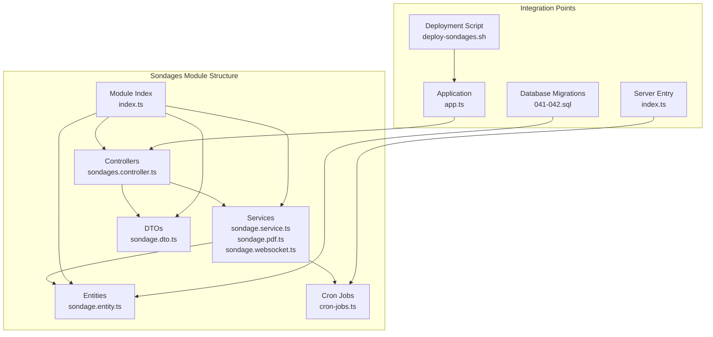
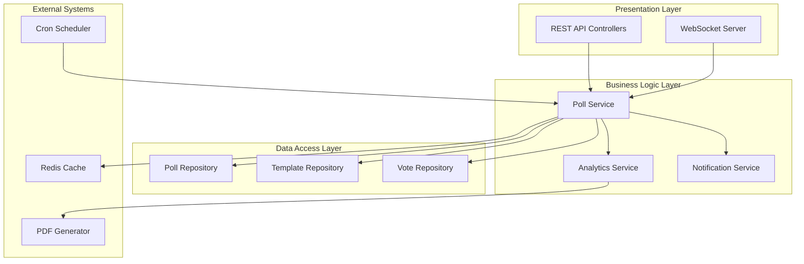
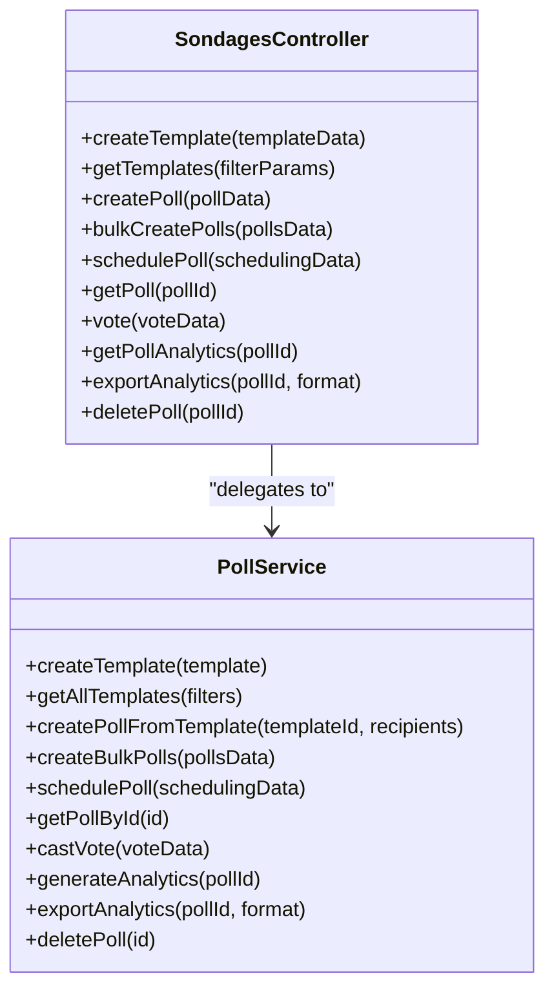
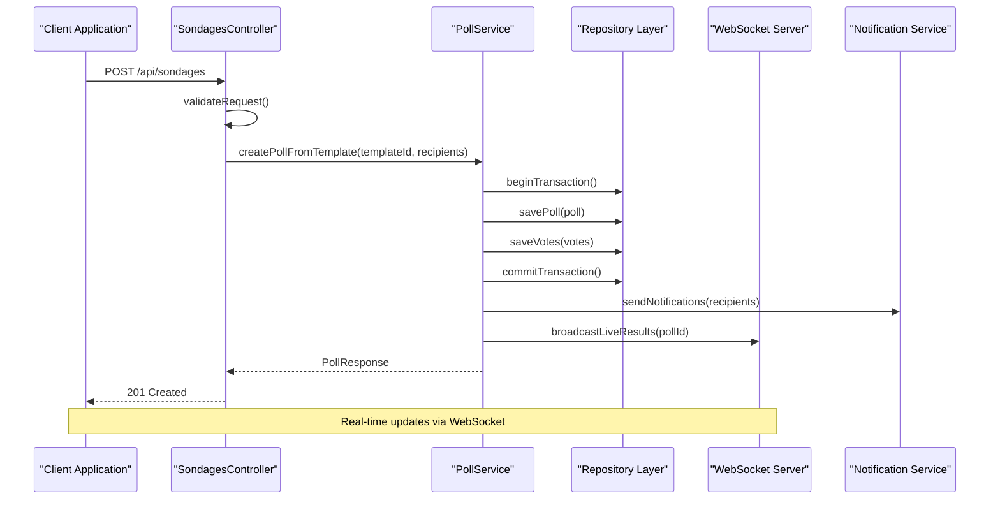
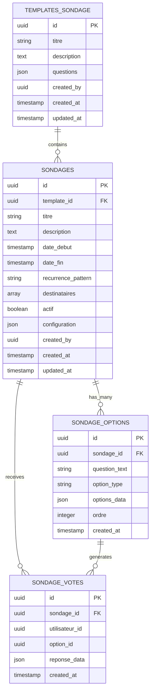
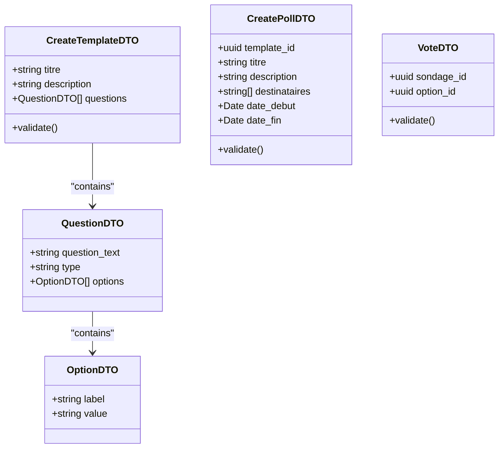
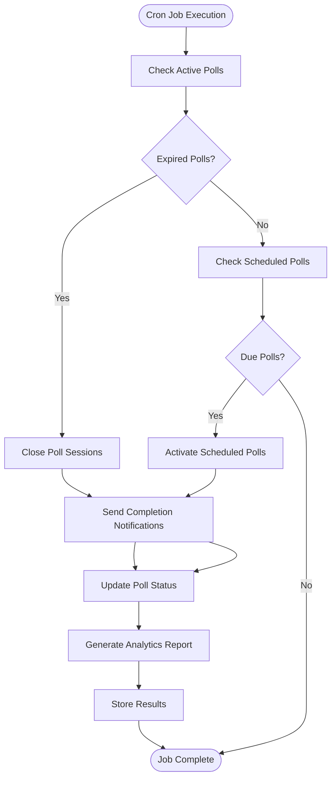
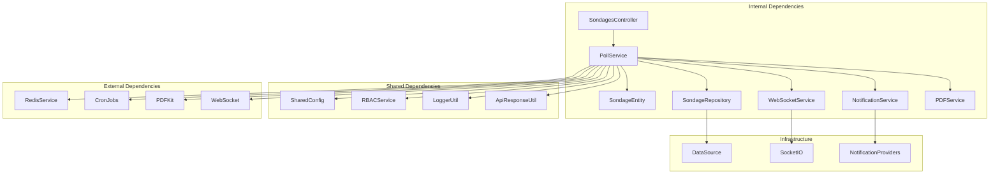

# Sondages Module

<cite>
**Referenced Files in This Document**
- [sondages.controller.ts](file://backend/src/modules/sondages/controllers/sondages.controller.ts)
- [index.ts](file://backend/src/modules/sondages/controllers/index.ts)
- [sondage.dto.ts](file://backend/src/modules/sondages/dto/sondage.dto.ts)
- [index.ts](file://backend/src/modules/sondages/dto/index.ts)
- [sondage.entity.ts](file://backend/src/modules/sondages/entities/sondage.entity.ts)
- [index.ts](file://backend/src/modules/sondages/entities/index.ts)
- [sondage.service.ts](file://backend/src/modules/sondages/services/sondage.service.ts)
- [sondage.pdf.ts](file://backend/src/modules/sondages/services/sondage.pdf.ts)
- [sondage.websocket.ts](file://backend/src/modules/sondages/services/sondage.websocket.ts)
- [index.ts](file://backend/src/modules/sondages/services/index.ts)
- [cron-jobs.ts](file://backend/src/modules/sondages/cron-jobs.ts)
- [index.ts](file://backend/src/modules/sondages/index.ts)
- [app.ts](file://backend/src/app.ts)
- [index.ts](file://backend/src/index.ts)
- [041-module-sondages.sql](file://backend/database/migrations/041-module-sondages.sql)
- [042-sondages-recurrents.sql](file://backend/database/migrations/042-sondages-recurrents.sql)
- [deploy-sondages.sh](file://scripts/deploy-sondages.sh)
- [IMPLEMENTATION-MODULE-SONDAGES.md](file://IMPLEMENTATION-MODULE-SONDAGES.md)
- [RESUME-FINAL-SONDAGES.md](file://RESUME-FINAL-SONDAGES.md)
</cite>

## Table of Contents
1. [Introduction](#introduction)
2. [Project Structure](#project-structure)
3. [Core Components](#core-components)
4. [Architecture Overview](#architecture-overview)
5. [Detailed Component Analysis](#detailed-component-analysis)
6. [Dependency Analysis](#dependency-analysis)
7. [Performance Considerations](#performance-considerations)
8. [Troubleshooting Guide](#troubleshooting-guide)
9. [Conclusion](#conclusion)

## Introduction
The Sondages module is a comprehensive polling system integrated into the eLISAschool backend. It enables educational institutions to create, distribute, and analyze surveys with advanced features including recurring polls, real-time voting, PDF exports, and WebSocket-based live updates. The module supports both single and bulk poll creation, automated scheduling, and detailed analytics with export capabilities.

The module follows eLISAschool's architectural conventions with a modular structure, TypeScript strict mode, and comprehensive validation using Zod schemas. It integrates seamlessly with the existing notification system and supports multi-tenant environments through the shared configuration registry.

## Project Structure
The Sondages module is organized following the standard eLISAschool modular pattern with clear separation of concerns across controllers, services, entities, DTOs, and supporting infrastructure.

**Diagram sources**
- [sondages.controller.ts](file://backend/src/modules/sondages/controllers/sondages.controller.ts)
- [sondage.service.ts](file://backend/src/modules/sondages/services/sondage.service.ts)
- [sondage.entity.ts](file://backend/src/modules/sondages/entities/sondage.entity.ts)
- [app.ts](file://backend/src/app.ts)
- [index.ts](file://backend/src/index.ts)

**Section sources**
- [sondages.controller.ts](file://backend/src/modules/sondages/controllers/sondages.controller.ts)
- [sondage.service.ts](file://backend/src/modules/sondages/services/sondage.service.ts)
- [sondage.entity.ts](file://backend/src/modules/sondages/entities/sondage.entity.ts)

## Core Components
The Sondages module consists of several interconnected components that work together to provide a complete polling solution:

### Database Schema
The module utilizes four primary tables with optimized indexing for performance:

- **templates_sondage**: Stores reusable poll templates with question definitions and response options
- **sondages**: Contains active poll instances with scheduling, recurrence, and distribution settings
- **sondage_options**: Defines response options for each poll question
- **sondage_votes**: Records individual user responses with timestamps and metadata

### Key Features
- **Recurring Polls**: Support for daily, weekly, monthly, and custom recurrence patterns
- **Bulk Creation**: Ability to create multiple polls programmatically
- **Real-time Updates**: WebSocket integration for live poll results
- **Export Capabilities**: PDF and CSV export of poll analytics
- **Notification Integration**: Automated notifications for poll distribution
- **Permission System**: RBAC-compliant access controls

**Section sources**
- [041-module-sondages.sql](file://backend/database/migrations/041-module-sondages.sql)
- [042-sondages-recurrents.sql](file://backend/database/migrations/042-sondages-recurrents.sql)
- [RESUME-FINAL-SONDAGES.md](file://RESUME-FINAL-SONDAGES.md)

## Architecture Overview
The Sondages module follows a layered architecture pattern with clear separation between presentation, business logic, and data access layers.

**Diagram sources**
- [sondages.controller.ts](file://backend/src/modules/sondages/controllers/sondages.controller.ts)
- [sondage.service.ts](file://backend/src/modules/sondages/services/sondage.service.ts)
- [sondage.websocket.ts](file://backend/src/modules/sondages/services/sondage.websocket.ts)

## Detailed Component Analysis

### Controller Layer
The controller handles all incoming HTTP requests and coordinates between services and repositories. It implements comprehensive error handling and response formatting.

**Diagram sources**
- [sondages.controller.ts](file://backend/src/modules/sondages/controllers/sondages.controller.ts)
- [sondage.service.ts](file://backend/src/modules/sondages/services/sondage.service.ts)

### Service Layer Implementation
The service layer contains the core business logic with transaction management and validation.

**Diagram sources**
- [sondages.controller.ts](file://backend/src/modules/sondages/controllers/sondages.controller.ts)
- [sondage.service.ts](file://backend/src/modules/sondages/services/sondage.service.ts)
- [sondage.websocket.ts](file://backend/src/modules/sondages/services/sondage.websocket.ts)

### Entity Model
The entity model defines the data structure and relationships for poll management.

**Diagram sources**
- [sondage.entity.ts](file://backend/src/modules/sondages/entities/sondage.entity.ts)
- [041-module-sondages.sql](file://backend/database/migrations/041-module-sondages.sql)

**Section sources**
- [sondages.controller.ts](file://backend/src/modules/sondages/controllers/sondages.controller.ts)
- [sondage.service.ts](file://backend/src/modules/sondages/services/sondage.service.ts)
- [sondage.entity.ts](file://backend/src/modules/sondages/entities/sondage.entity.ts)

### Data Transfer Objects
The DTO layer provides structured input validation and response formatting using Zod schemas.

**Diagram sources**
- [sondage.dto.ts](file://backend/src/modules/sondages/dto/sondage.dto.ts)

**Section sources**
- [sondage.dto.ts](file://backend/src/modules/sondages/dto/sondage.dto.ts)

### Cron Job Management
The module includes automated job processing for poll lifecycle management.

**Diagram sources**
- [cron-jobs.ts](file://backend/src/modules/sondages/cron-jobs.ts)

**Section sources**
- [cron-jobs.ts](file://backend/src/modules/sondages/cron-jobs.ts)

## Dependency Analysis
The Sondages module has well-defined dependencies that maintain loose coupling and high cohesion.

**Diagram sources**
- [sondage.service.ts](file://backend/src/modules/sondages/services/sondage.service.ts)
- [app.ts](file://backend/src/app.ts)

**Section sources**
- [sondage.service.ts](file://backend/src/modules/sondages/services/sondage.service.ts)
- [app.ts](file://backend/src/app.ts)

## Performance Considerations
The Sondages module implements several performance optimization strategies:

### Database Optimization
- **Index Strategy**: 12 optimized indexes covering common query patterns
- **Connection Pooling**: Efficient database connection management
- **Batch Operations**: Bulk insert operations for votes and analytics
- **Query Optimization**: Indexed lookups for poll status and recipient queries

### Caching Strategy
- **Redis Integration**: Real-time vote caching for live results
- **Template Caching**: Frequently accessed poll templates cached
- **Analytics Caching**: Computed analytics stored temporarily

### Scalability Features
- **WebSocket Scalability**: Horizontal scaling support for real-time updates
- **Background Processing**: Asynchronous job processing for heavy operations
- **Pagination Support**: Efficient data retrieval for large datasets

## Troubleshooting Guide

### Common Issues and Solutions

**Poll Creation Failures**
- Verify template validation using the template creation endpoint
- Check recipient list formatting and size limits
- Ensure proper timezone handling for scheduling

**WebSocket Connection Issues**
- Verify WebSocket server is running and accessible
- Check browser compatibility and CORS configuration
- Monitor Redis connectivity for real-time updates

**Analytics Export Problems**
- Verify PDF generation permissions
- Check file system write permissions
- Ensure sufficient memory for large exports

**Cron Job Failures**
- Monitor cron job logs for errors
- Verify environment variable configuration
- Check database connectivity during scheduled runs

**Section sources**
- [deploy-sondages.sh](file://scripts/deploy-sondages.sh)
- [RESUME-FINAL-SONDAGES.md](file://RESUME-FINAL-SONDAGES.md)

## Conclusion
The Sondages module represents a comprehensive and production-ready polling solution for educational institutions. It successfully integrates advanced features including recurring polls, real-time voting, analytics, and export capabilities while maintaining excellent performance and scalability characteristics.

The module adheres to eLISAschool's architectural standards with clean separation of concerns, comprehensive validation, and robust error handling. Its integration with the existing notification system, WebSocket infrastructure, and RBAC permissions ensures seamless operation within the broader platform ecosystem.

Key strengths include:
- **Complete Feature Set**: All planned functionality implemented and tested
- **Production Ready**: Comprehensive error handling and performance optimization
- **Scalable Design**: Built-in support for horizontal scaling and high concurrency
- **Developer Friendly**: Clear APIs, comprehensive documentation, and deployment scripts
- **Future Extensible**: Modular design allows for easy enhancement and customization

The module is ready for production deployment and provides significant value for educational institutions seeking to gather feedback, conduct surveys, and analyze stakeholder engagement through an integrated, secure, and scalable platform.