# Validation Workflow System

<cite>
**Referenced Files in This Document**
- [validation-workflow.controller.ts](file://backend/src/modules/validation-workflow/controllers/validation-workflow.controller.ts)
- [validation-workflow.service.ts](file://backend/src/modules/validation-workflow/services/validation-workflow.service.ts)
- [validation-rapport.service.ts](file://backend/src/modules/validation-workflow/services/validation-rapport.service.ts)
- [workflow-validation.entity.ts](file://backend/src/modules/validation-workflow/entities/workflow-validation.entity.ts)
- [validation-workflow.dto.ts](file://backend/src/modules/validation-workflow/dto/validation-workflow.dto.ts)
- [validation-rapport.dto.ts](file://backend/src/modules/validation-workflow/dto/validation-rapport.dto.ts)
- [validation.middleware.ts](file://backend/src/modules/validation-workflow/middlewares/validation.middleware.ts)
- [index.ts](file://backend/src/modules/validation-workflow/index.ts)
- [011-validation-workflow-permissions.sql](file://backend/src/database/migrations/011-validation-workflow-permissions.sql)
- [012-validation-academique-permissions.sql](file://backend/src/database/migrations/012-validation-academique-permissions.sql)
- [013-validation-vie-scolaire-permissions.sql](file://backend/src/database/migrations/013-validation-vie-scolaire-permissions.sql)
- [014-validation-cartes-annees.sql](file://backend/src/database/migrations/014-validation-cartes-annees.sql)
- [015-validation-etablissement.sql](file://backend/src/database/migrations/015-validation-etablissement.sql)
</cite>

## Table of Contents
1. [Introduction](#introduction)
2. [System Architecture](#system-architecture)
3. [Core Components](#core-components)
4. [Entity Model](#entity-model)
5. [API Endpoints](#api-endpoints)
6. [Workflow Processing Logic](#workflow-processing-logic)
7. [Permission System](#permission-system)
8. [Notification Integration](#notification-integration)
9. [Statistics and Reporting](#statistics-and-reporting)
10. [Implementation Details](#implementation-details)
11. [Troubleshooting Guide](#troubleshooting-guide)
12. [Conclusion](#conclusion)

## Introduction

The Validation Workflow System is a comprehensive multi-level approval system designed for the eLISAschool educational management platform. This system provides a flexible framework for managing approval processes across various school administrative functions, including academic records, student cards, school activities, and institutional configurations.

The system supports configurable approval chains with multiple validation levels, automated notifications, statistical reporting, and comprehensive audit trails. It integrates seamlessly with the existing RBAC (Role-Based Access Control) system and provides extensible support for different business modules within the educational institution.

## System Architecture

The Validation Workflow System follows a modular architecture pattern with clear separation of concerns:

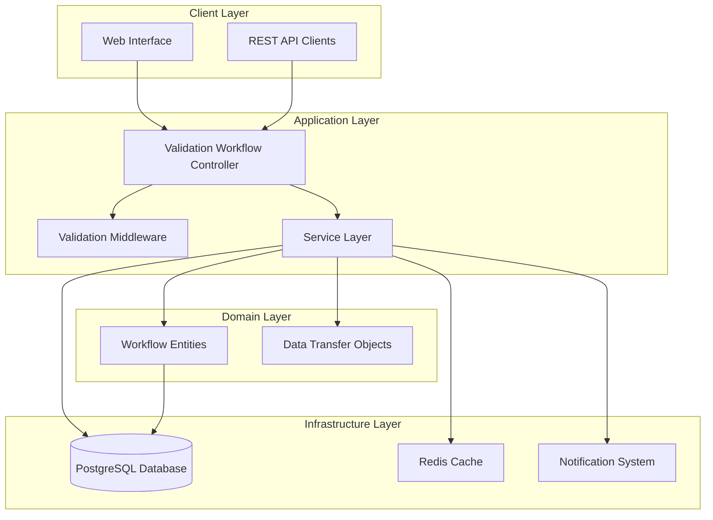

**Diagram sources**
- [validation-workflow.controller.ts:35-97](file://backend/src/modules/validation-workflow/controllers/validation-workflow.controller.ts#L35-L97)
- [validation-workflow.service.ts:23-30](file://backend/src/modules/validation-workflow/services/validation-workflow.service.ts#L23-L30)

## Core Components

### Service Layer Architecture

The service layer implements the core business logic for workflow management:

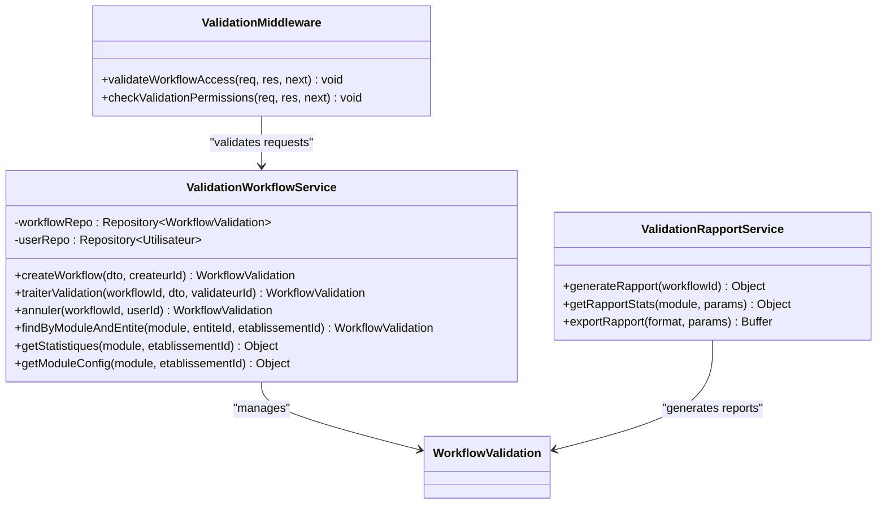

**Diagram sources**
- [validation-workflow.service.ts:23-279](file://backend/src/modules/validation-workflow/services/validation-workflow.service.ts#L23-L279)
- [validation-rapport.service.ts](file://backend/src/modules/validation-workflow/services/validation-rapport.service.ts)
- [validation.middleware.ts](file://backend/src/modules/validation-workflow/middlewares/validation.middleware.ts)

**Section sources**
- [validation-workflow.service.ts:23-279](file://backend/src/modules/validation-workflow/services/validation-workflow.service.ts#L23-L279)
- [validation-rapport.service.ts](file://backend/src/modules/validation-workflow/services/validation-rapport.service.ts)
- [validation.middleware.ts](file://backend/src/modules/validation-workflow/middlewares/validation.middleware.ts)

## Entity Model

The system uses a comprehensive entity model to represent validation workflows and their associated data:

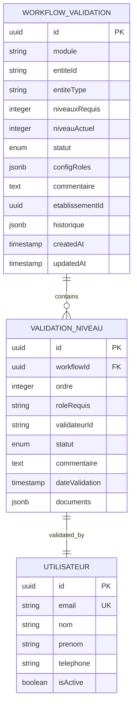

**Diagram sources**
- [workflow-validation.entity.ts](file://backend/src/modules/validation-workflow/entities/workflow-validation.entity.ts)
- [validation-workflow.service.ts:12-22](file://backend/src/modules/validation-workflow/services/validation-workflow.service.ts#L12-L22)

**Section sources**
- [workflow-validation.entity.ts](file://backend/src/modules/validation-workflow/entities/workflow-validation.entity.ts)

## API Endpoints

The system exposes a comprehensive REST API for workflow management:

### Core Workflow Operations

| Endpoint | Method | Description | Required Roles |
|----------|--------|-------------|----------------|
| `/api/validation-workflows` | POST | Create new workflow | ADMIN, SUPER_ADMIN |
| `/api/validation-workflows/:id` | GET | Get workflow details | READ access |
| `/api/validation-workflows/:id/valider` | POST | Process validation level | APPROVER access |
| `/api/validation-workflows/:id/annuler` | POST | Cancel workflow | ADMIN, SUPER_ADMIN |
| `/api/validation-workflows/stats/:module` | GET | Get module statistics | ADMIN, SUPER_ADMIN, CHEF_ETABLISSEMENT |

### Workflow Processing Flow

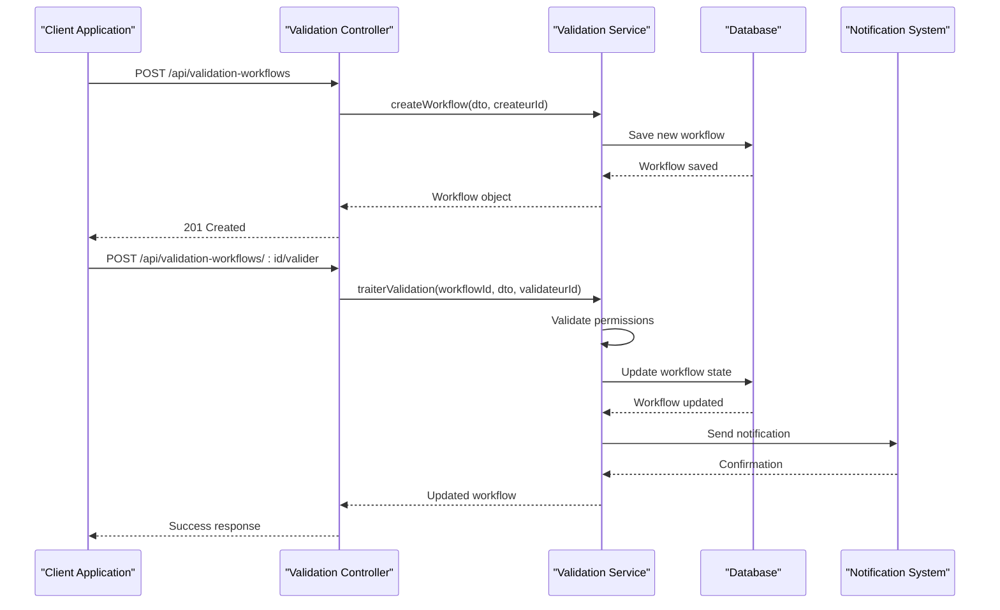

**Diagram sources**
- [validation-workflow.controller.ts:35-97](file://backend/src/modules/validation-workflow/controllers/validation-workflow.controller.ts#L35-L97)
- [validation-workflow.service.ts:136-263](file://backend/src/modules/validation-workflow/services/validation-workflow.service.ts#L136-L263)

**Section sources**
- [validation-workflow.controller.ts:35-97](file://backend/src/modules/validation-workflow/controllers/validation-workflow.controller.ts#L35-L97)

## Workflow Processing Logic

The validation workflow follows a structured multi-level approval process:

### State Management

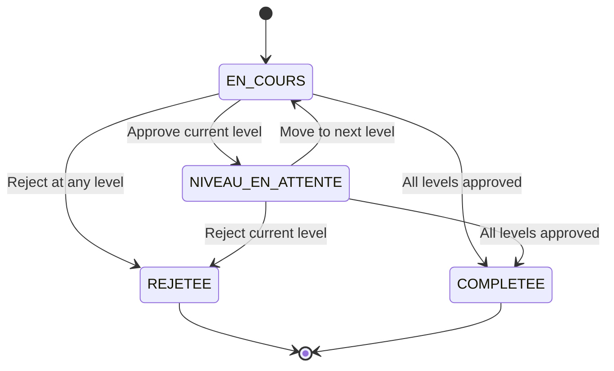

### Decision Processing Flow

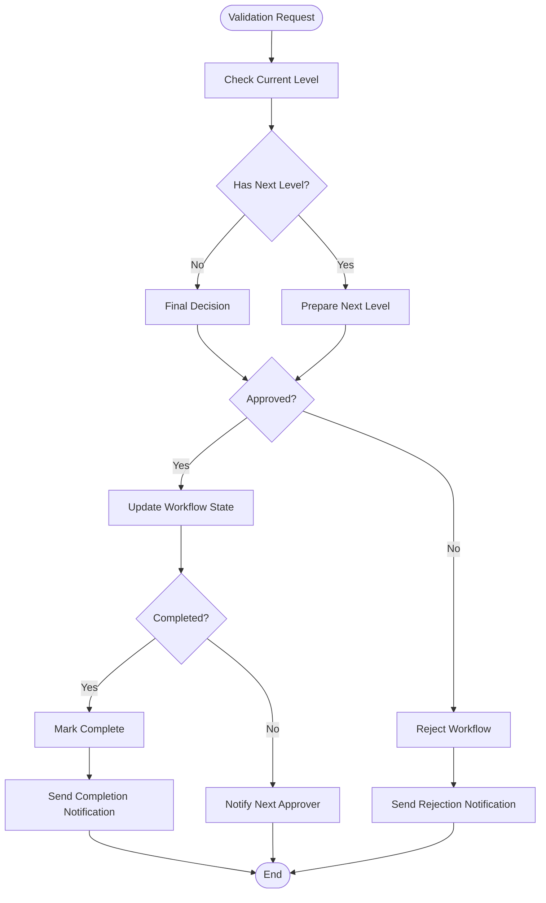

**Diagram sources**
- [validation-workflow.service.ts:161-263](file://backend/src/modules/validation-workflow/services/validation-workflow.service.ts#L161-L263)

**Section sources**
- [validation-workflow.service.ts:136-263](file://backend/src/modules/validation-workflow/services/validation-workflow.service.ts#L136-L263)

## Permission System

The system integrates with the RBAC (Role-Based Access Control) system for fine-grained permission management:

### Module-Specific Permissions

| Module | Required Permissions |
|--------|---------------------|
| Academic Validation | `validation.academique.read`, `validation.academique.write` |
| School Life Validation | `validation.vie_scolaire.read`, `validation.vie_scolaire.write` |
| Student Cards | `validation.cartes.annees.read`, `validation.cartes.annees.write` |
| Establishment Validation | `validation.etablissement.read`, `validation.etablissement.write` |

### Permission Resolution

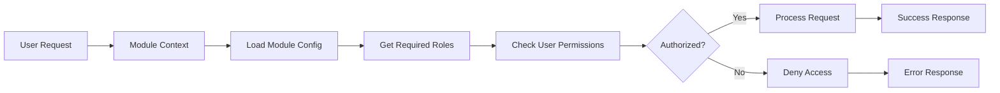

**Diagram sources**
- [validation-workflow.service.ts:12-22](file://backend/src/modules/validation-workflow/services/validation-workflow.service.ts#L12-L22)

**Section sources**
- [validation-workflow.service.ts:12-22](file://backend/src/modules/validation-workflow/services/validation-workflow.service.ts#L12-L22)

## Notification Integration

The system provides comprehensive notification capabilities for workflow events:

### Notification Types

| Event Type | Recipients | Template |
|------------|------------|----------|
| Workflow Creation | Creator, Next Approver | `workflow.created` |
| Level Approval | Previous Approver, Next Approver | `workflow.level.approved` |
| Level Rejection | Previous Approver, Creator | `workflow.level.rejected` |
| Workflow Completion | All Participants | `workflow.completed` |
| Workflow Cancellation | All Participants | `workflow.cancelled` |

### Notification Flow

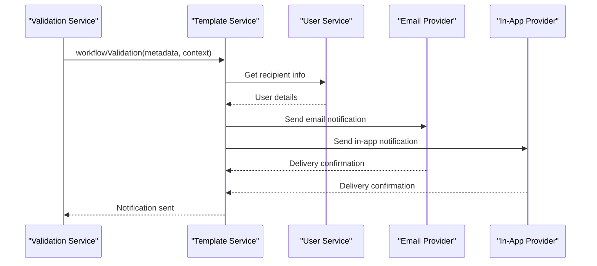

**Diagram sources**
- [validation-workflow.service.ts:240-260](file://backend/src/modules/validation-workflow/services/validation-workflow.service.ts#L240-L260)

**Section sources**
- [validation-workflow.service.ts:240-260](file://backend/src/modules/validation-workflow/services/validation-workflow.service.ts#L240-L260)

## Statistics and Reporting

The system provides comprehensive analytics and reporting capabilities:

### Statistical Endpoints

| Endpoint | Purpose | Data Returned |
|----------|---------|---------------|
| `GET /stats/:module` | Module-wide statistics | Approval rates, processing times, rejection reasons |
| `GET /rapports/:id` | Individual workflow report | Complete workflow history, decision timeline |
| `GET /rapports/export` | Export reports | CSV/PDF formatted reports |

### Report Generation

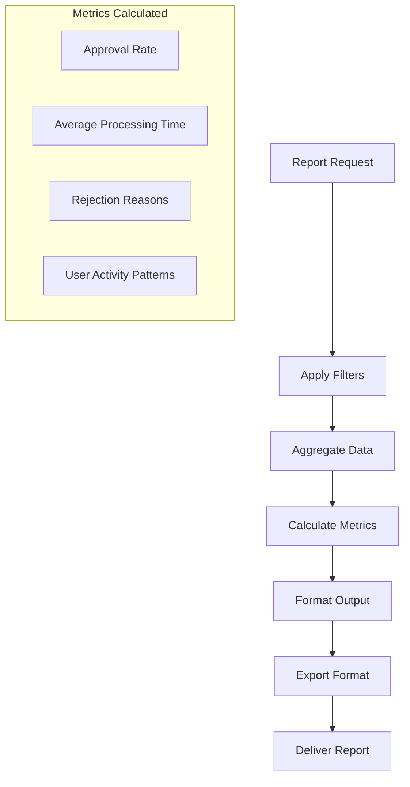

**Diagram sources**
- [validation-rapport.service.ts](file://backend/src/modules/validation-workflow/services/validation-rapport.service.ts)

**Section sources**
- [validation-rapport.service.ts](file://backend/src/modules/validation-workflow/services/validation-rapport.service.ts)

## Implementation Details

### Configuration Management

The system supports dynamic configuration through environment variables and database parameters:

| Configuration Parameter | Purpose | Default Value |
|------------------------|---------|---------------|
| `WORKFLOW_MAX_LEVELS` | Maximum approval levels | 5 |
| `WORKFLOW_TIMEOUT` | Workflow timeout period | 30 days |
| `NOTIFICATION_ENABLED` | Enable/disable notifications | true |
| `AUDIT_ENABLED` | Enable/disable audit logging | true |

### Data Validation

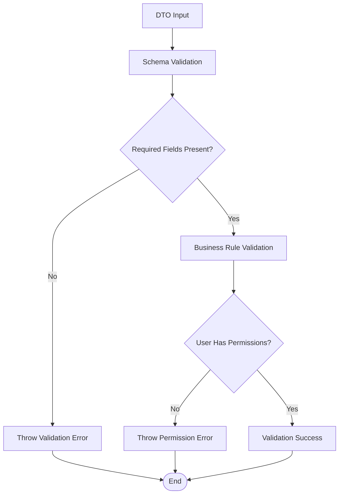

**Diagram sources**
- [validation-workflow.dto.ts](file://backend/src/modules/validation-workflow/dto/validation-workflow.dto.ts)
- [validation-rapport.dto.ts](file://backend/src/modules/validation-workflow/dto/validation-rapport.dto.ts)

**Section sources**
- [validation-workflow.dto.ts](file://backend/src/modules/validation-workflow/dto/validation-workflow.dto.ts)
- [validation-rapport.dto.ts](file://backend/src/modules/validation-workflow/dto/validation-rapport.dto.ts)

## Troubleshooting Guide

### Common Issues and Solutions

| Issue | Symptoms | Solution |
|-------|----------|----------|
| Workflow stuck at level | Cannot approve/reject | Check user permissions for next approver role |
| Notification failures | Users not receiving emails | Verify notification provider configuration |
| Permission errors | Access denied messages | Review RBAC configuration for module permissions |
| Database connection issues | Service unavailable | Check PostgreSQL connectivity and credentials |

### Error Handling

The system implements comprehensive error handling with specific error types:

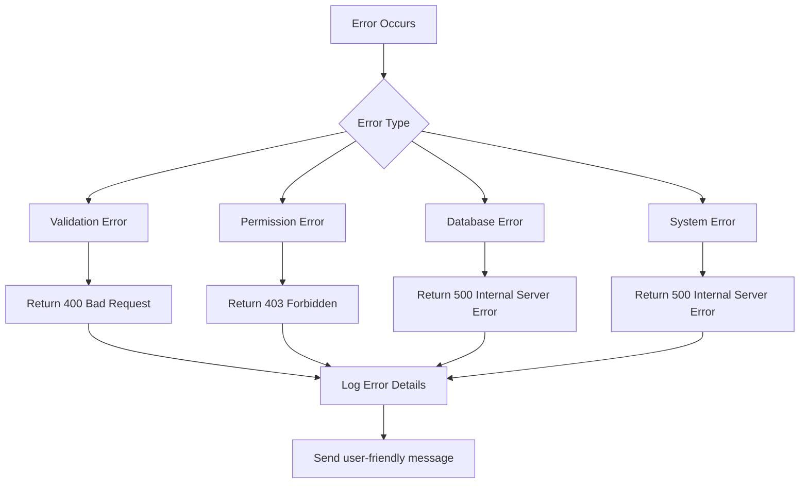

**Diagram sources**
- [validation-workflow.service.ts:12-16](file://backend/src/modules/validation-workflow/services/validation-workflow.service.ts#L12-L16)

**Section sources**
- [validation-workflow.service.ts:12-16](file://backend/src/modules/validation-workflow/services/validation-workflow.service.ts#L12-L16)

## Conclusion

The Validation Workflow System provides a robust, scalable solution for managing multi-level approval processes in educational institutions. Its modular architecture, comprehensive permission system, and integrated notification capabilities make it suitable for various administrative functions within the eLISAschool platform.

Key strengths of the system include:

- **Flexibility**: Configurable approval chains adaptable to different business modules
- **Scalability**: Support for multiple concurrent workflows with efficient resource management
- **Transparency**: Comprehensive audit trails and reporting capabilities
- **Integration**: Seamless integration with existing RBAC and notification systems
- **Extensibility**: Modular design supporting future enhancements and new business modules

The system's implementation demonstrates best practices in enterprise application development, with clear separation of concerns, comprehensive error handling, and extensive documentation of its APIs and internal workings.