# Validation Workflow System

<cite>
**Referenced Files in This Document**
- [validation-workflow.controller.ts](file://backend/src/modules/validation-workflow/controllers/validation-workflow.controller.ts)
- [validation-workflow.service.ts](file://backend/src/modules/validation-workflow/services/validation-workflow.service.ts)
- [validation-rapport.service.ts](file://backend/src/modules/validation-workflow/services/validation-rapport.service.ts)
- [workflow-validation.entity.ts](file://backend/src/modules/validation-workflow/entities/workflow-validation.entity.ts)
- [validation-workflow.dto.ts](file://backend/src/modules/validation-workflow/dto/validation-workflow.dto.ts)
- [validation-rapport.dto.ts](file://backend/src/modules/validation-workflow/dto/validation-rapport.dto.ts)
- [validation.middleware.ts](file://backend/src/modules/validation-workflow/middlewares/validation.middleware.ts)
- [finance-workflow.service.ts](file://backend/src/modules/finances/services/finance-workflow.service.ts)
- [finances.controller.ts](file://backend/src/modules/finances/controllers/finances.controller.ts)
- [audit.service.ts](file://backend/src/modules/audit/services/audit.service.ts)
- [index.ts](file://backend/src/modules/validation-workflow/index.ts)
- [011-validation-workflow-permissions.sql](file://backend/src/database/migrations/011-validation-workflow-permissions.sql)
- [012-validation-academique-permissions.sql](file://backend/src/database/migrations/012-validation-academique-permissions.sql)
- [013-validation-vie-scolaire-permissions.sql](file://backend/src/database/migrations/013-validation-vie-scolaire-permissions.sql)
- [014-validation-cartes-annees.sql](file://backend/src/database/migrations/014-validation-cartes-annees.sql)
- [015-validation-etablissement.sql](file://backend/src/database/migrations/015-validation-etablissement.sql)
</cite>

## Update Summary
**Changes Made**
- Enhanced integration with financial module workflows
- Added multi-level approval processes with dynamic role requirements
- Implemented workflow routing for financial transactions
- Integrated comprehensive audit trail functionality
- Added new financial workflow endpoints and services

## Table of Contents
1. [Introduction](#introduction)
2. [System Architecture](#system-architecture)
3. [Core Components](#core-components)
4. [Entity Model](#entity-model)
5. [API Endpoints](#api-endpoints)
6. [Workflow Processing Logic](#workflow-processing-logic)
7. [Financial Module Integration](#financial-module-integration)
8. [Permission System](#permission-system)
9. [Notification Integration](#notification-integration)
10. [Audit Trail Integration](#audit-trail-integration)
11. [Statistics and Reporting](#statistics-and-reporting)
12. [Implementation Details](#implementation-details)
13. [Troubleshooting Guide](#troubleshooting-guide)
14. [Conclusion](#conclusion)

## Introduction

The Validation Workflow System is a comprehensive multi-level approval system designed for the eLISAschool educational management platform. This system provides a flexible framework for managing approval processes across various school administrative functions, including academic records, student cards, school activities, and institutional configurations.

**Updated** Enhanced with comprehensive integration into the financial module, featuring multi-level approval processes with dynamic role requirements, workflow routing for financial transactions, and comprehensive audit trail integration.

The system supports configurable approval chains with multiple validation levels, automated notifications, statistical reporting, and comprehensive audit trails. It integrates seamlessly with the existing RBAC (Role-Based Access Control) system and provides extensible support for different business modules within the educational institution, now including sophisticated financial workflow management.

## System Architecture

The Validation Workflow System follows a modular architecture pattern with clear separation of concerns and enhanced financial module integration:

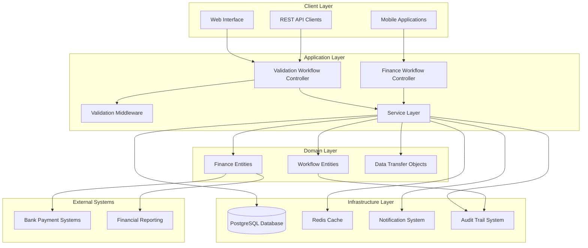

**Diagram sources**
- [validation-workflow.controller.ts:35-97](file://backend/src/modules/validation-workflow/controllers/validation-workflow.controller.ts#L35-L97)
- [finance-workflow.service.ts:40-51](file://backend/src/modules/finances/services/finance-workflow.service.ts#L40-L51)
- [finances.controller.ts:368-426](file://backend/src/modules/finances/controllers/finances.controller.ts#L368-L426)

## Core Components

### Service Layer Architecture

The service layer implements the core business logic for workflow management with enhanced financial integration:

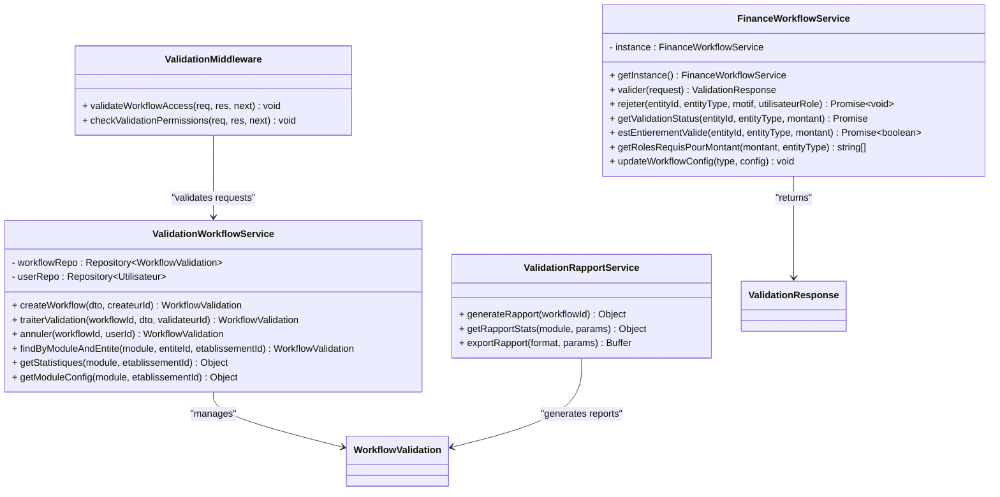

**Diagram sources**
- [validation-workflow.service.ts:23-279](file://backend/src/modules/validation-workflow/services/validation-workflow.service.ts#L23-L279)
- [finance-workflow.service.ts:40-297](file://backend/src/modules/finances/services/finance-workflow.service.ts#L40-L297)
- [validation-rapport.service.ts](file://backend/src/modules/validation-workflow/services/validation-rapport.service.ts)
- [validation.middleware.ts](file://backend/src/modules/validation-workflow/middlewares/validation.middleware.ts)

**Section sources**
- [validation-workflow.service.ts:23-279](file://backend/src/modules/validation-workflow/services/validation-workflow.service.ts#L23-L279)
- [finance-workflow.service.ts:40-297](file://backend/src/modules/finances/services/finance-workflow.service.ts#L40-L297)
- [validation-rapport.service.ts](file://backend/src/modules/validation-workflow/services/validation-rapport.service.ts)
- [validation.middleware.ts](file://backend/src/modules/validation-workflow/middlewares/validation.middleware.ts)

## Entity Model

The system uses a comprehensive entity model to represent validation workflows and their associated data with enhanced financial integration:

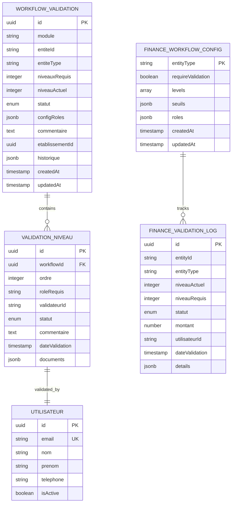

**Diagram sources**
- [workflow-validation.entity.ts](file://backend/src/modules/validation-workflow/entities/workflow-validation.entity.ts)
- [finance-workflow.service.ts:18-39](file://backend/src/modules/finances/services/finance-workflow.service.ts#L18-L39)

**Section sources**
- [workflow-validation.entity.ts](file://backend/src/modules/validation-workflow/entities/workflow-validation.entity.ts)
- [finance-workflow.service.ts:18-39](file://backend/src/modules/finances/services/finance-workflow.service.ts#L18-L39)

## API Endpoints

The system exposes a comprehensive REST API for workflow management with enhanced financial workflow endpoints:

### Core Workflow Operations

| Endpoint | Method | Description | Required Roles |
|----------|--------|-------------|----------------|
| `/api/validation-workflows` | POST | Create new workflow | ADMIN, SUPER_ADMIN |
| `/api/validation-workflows/:id` | GET | Get workflow details | READ access |
| `/api/validation-workflows/:id/valider` | POST | Process validation level | APPROVER access |
| `/api/validation-workflows/:id/annuler` | POST | Cancel workflow | ADMIN, SUPER_ADMIN |
| `/api/validation-workflows/stats/:module` | GET | Get module statistics | ADMIN, SUPER_ADMIN, CHEF_ETABLISSEMENT |

### Financial Workflow Operations

**Updated** New financial workflow endpoints for comprehensive financial transaction validation:

| Endpoint | Method | Description | Required Roles |
|----------|--------|-------------|----------------|
| `/api/finances/workflow/validate` | POST | Validate financial entity | APPLICABLE FINANCE ROLES |
| `/api/finances/workflow/reject` | POST | Reject financial entity | APPLICABLE FINANCE ROLES |
| `/api/finances/workflow/status/:entityType/:entityId` | GET | Get financial validation status | READ access |
| `/api/finances/workflow/config/:entityType` | GET | Get workflow configuration | ADMIN, SUPER_ADMIN |
| `/api/finances/workflow/config/:entityType` | PUT | Update workflow configuration | ADMIN, SUPER_ADMIN |

### Workflow Processing Flow

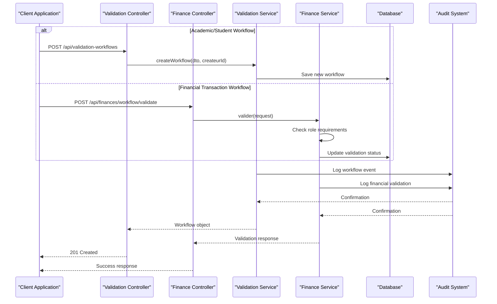

**Diagram sources**
- [validation-workflow.controller.ts:35-97](file://backend/src/modules/validation-workflow/controllers/validation-workflow.controller.ts#L35-L97)
- [finances.controller.ts:368-426](file://backend/src/modules/finances/controllers/finances.controller.ts#L368-L426)
- [validation-workflow.service.ts:136-263](file://backend/src/modules/validation-workflow/services/validation-workflow.service.ts#L136-L263)
- [finance-workflow.service.ts:134-173](file://backend/src/modules/finances/services/finance-workflow.service.ts#L134-L173)

**Section sources**
- [validation-workflow.controller.ts:35-97](file://backend/src/modules/validation-workflow/controllers/validation-workflow.controller.ts#L35-L97)
- [finances.controller.ts:368-426](file://backend/src/modules/finances/controllers/finances.controller.ts#L368-L426)

## Workflow Processing Logic

The validation workflow follows a structured multi-level approval process with enhanced financial transaction support:

### State Management

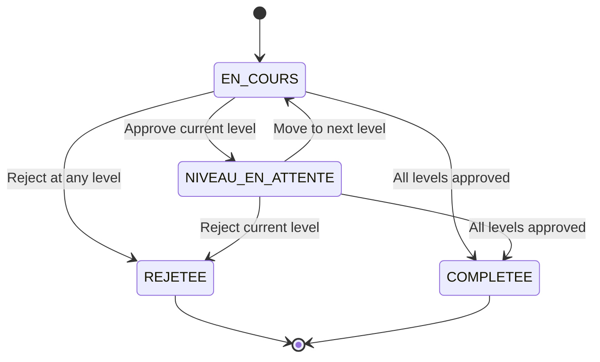

### Financial Workflow Decision Processing

**Updated** Enhanced decision processing flow for financial transactions with dynamic role requirements:

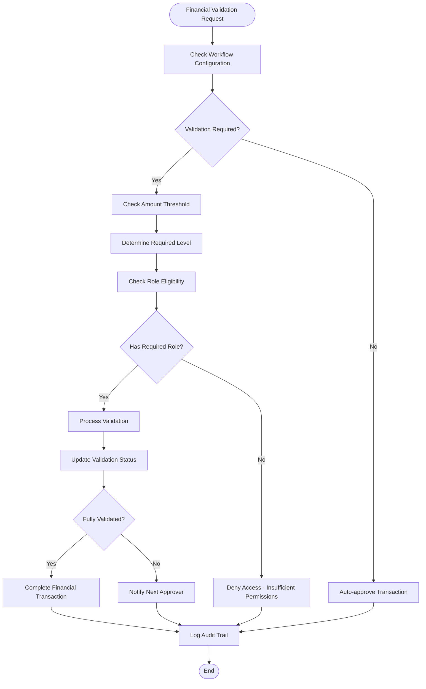

**Diagram sources**
- [finance-workflow.service.ts:134-173](file://backend/src/modules/finances/services/finance-workflow.service.ts#L134-L173)
- [finance-workflow.service.ts:175-194](file://backend/src/modules/finances/services/finance-workflow.service.ts#L175-L194)

**Section sources**
- [validation-workflow.service.ts:136-263](file://backend/src/modules/validation-workflow/services/validation-workflow.service.ts#L136-L263)
- [finance-workflow.service.ts:134-173](file://backend/src/modules/finances/services/finance-workflow.service.ts#L134-L173)

## Financial Module Integration

**New Section** The system now provides comprehensive integration with the financial module featuring sophisticated multi-level approval processes:

### Financial Workflow Types

| Workflow Type | Levels | Amount Thresholds | Required Roles |
|---------------|--------|-------------------|----------------|
| **Payment** | 2 | Level 2: > 500,000 FCFA | CAISSIER/COMPTABLE → COMPTABLE/CHEF |
| **Expense** | 3 | Level 2: ≥ 500,000 FCFA Level 3: ≥ 2,000,000 FCFA | DEMANDEUR → CHEF_ETABLISSEMENT → ADMIN/DIRECTEUR |
| **Budget** | 4 | Level 4: > 10,000,000 FCFA | COMPTABLE → CHEF_ETABLISSEMENT → ADMIN → DIRECTEUR/SUPER_ADMIN |

### Dynamic Role Requirements

**Updated** Financial workflows implement dynamic role requirements based on transaction amounts:

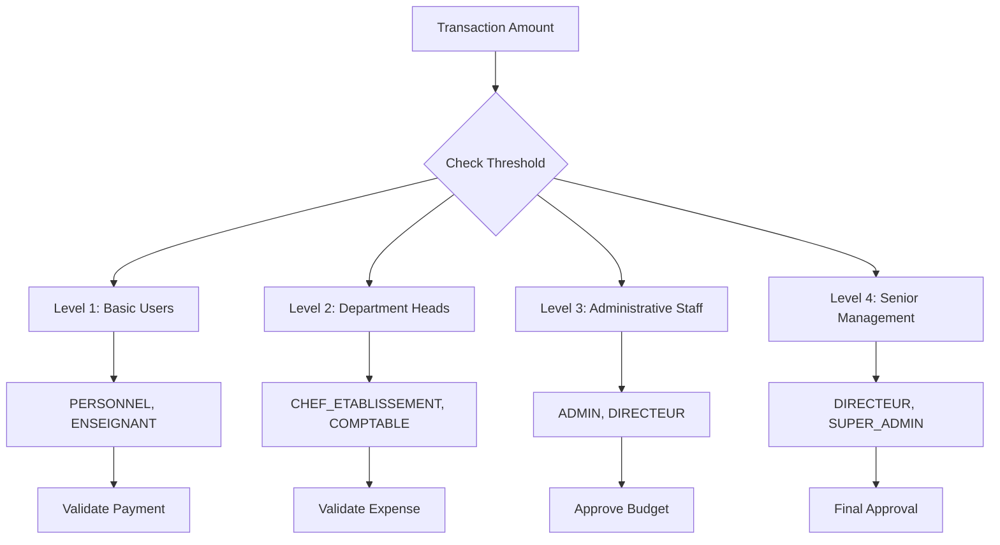

**Diagram sources**
- [finance-workflow.service.ts:18-23](file://backend/src/modules/finances/services/finance-workflow.service.ts#L18-L23)
- [finance-workflow.service.ts:122-129](file://backend/src/modules/finances/services/finance-workflow.service.ts#L122-L129)

**Section sources**
- [finance-workflow.service.ts:18-23](file://backend/src/modules/finances/services/finance-workflow.service.ts#L18-L23)
- [finance-workflow.service.ts:122-129](file://backend/src/modules/finances/services/finance-workflow.service.ts#L122-L129)

## Permission System

The system integrates with the RBAC (Role-Based Access Control) system for fine-grained permission management with enhanced financial workflow permissions:

### Module-Specific Permissions

| Module | Required Permissions |
|--------|---------------------|
| Academic Validation | `validation.academique.read`, `validation.academique.write` |
| School Life Validation | `validation.vie_scolaire.read`, `validation.vie_scolaire.write` |
| Student Cards | `validation.cartes.annees.read`, `validation.cartes.annees.write` |
| Establishment Validation | `validation.etablissement.read`, `validation.etablissement.write` |
| **Financial Validation** | `validation.finances.read`, `validation.finances.write` |

### Financial Workflow Permission Resolution

**Updated** Enhanced permission resolution for financial workflows:

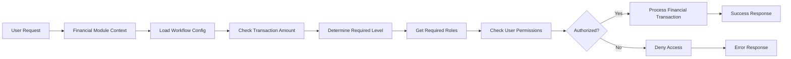

**Diagram sources**
- [finance-workflow.service.ts:106-129](file://backend/src/modules/finances/services/finance-workflow.service.ts#L106-L129)

**Section sources**
- [finance-workflow.service.ts:106-129](file://backend/src/modules/finances/services/finance-workflow.service.ts#L106-L129)

## Notification Integration

The system provides comprehensive notification capabilities for workflow events with enhanced financial transaction notifications:

### Notification Types

| Event Type | Recipients | Template |
|------------|------------|----------|
| Workflow Creation | Creator, Next Approver | `workflow.created` |
| Level Approval | Previous Approver, Next Approver | `workflow.level.approved` |
| Level Rejection | Previous Approver, Creator | `workflow.level.rejected` |
| Workflow Completion | All Participants | `workflow.completed` |
| Workflow Cancellation | All Participants | `workflow.cancelled` |
| **Financial Validation** | Applicable Parties | `finance.validation.update` |
| **Financial Approval** | Higher Level Approvers | `finance.approval.required` |
| **Financial Completion** | All Stakeholders | `finance.transaction.complete` |

### Financial Transaction Notification Flow

**Updated** Enhanced notification flow for financial transactions:

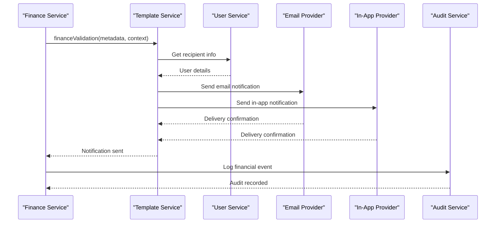

**Diagram sources**
- [finance-workflow.service.ts:134-173](file://backend/src/modules/finances/services/finance-workflow.service.ts#L134-L173)

**Section sources**
- [finance-workflow.service.ts:134-173](file://backend/src/modules/finances/services/finance-workflow.service.ts#L134-L173)

## Audit Trail Integration

**New Section** The system provides comprehensive audit trail integration for all workflow activities:

### Audit Events

| Event Category | Audit Type | Description | Priority |
|----------------|------------|-------------|----------|
| **Workflow Events** | CRUD Operations | Creation, Update, Deletion of workflows | High |
| **Validation Events** | Status Changes | Level approvals, rejections, completions | Critical |
| **Financial Events** | Transaction Tracking | Payment validations, expense approvals | Critical |
| **System Events** | Configuration Changes | Workflow updates, role modifications | Medium |
| **User Events** | Access Logs | Login attempts, permission changes | Medium |

### Audit Trail Structure

**Updated** Enhanced audit trail structure for financial workflow integration:

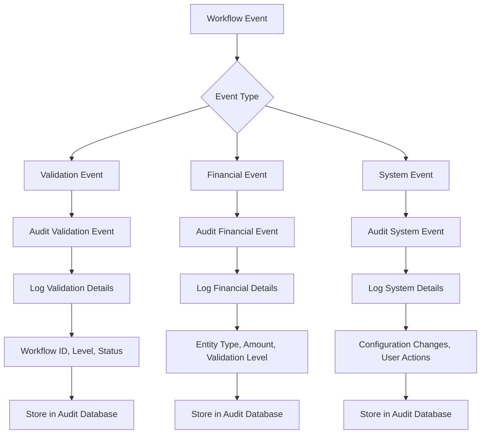

**Diagram sources**
- [audit.service.ts](file://backend/src/modules/audit/services/audit.service.ts)

**Section sources**
- [audit.service.ts](file://backend/src/modules/audit/services/audit.service.ts)

## Statistics and Reporting

The system provides comprehensive analytics and reporting capabilities with enhanced financial workflow insights:

### Statistical Endpoints

| Endpoint | Purpose | Data Returned |
|----------|---------|---------------|
| `GET /stats/:module` | Module-wide statistics | Approval rates, processing times, rejection reasons |
| `GET /rapports/:id` | Individual workflow report | Complete workflow history, decision timeline |
| `GET /rapports/export` | Export reports | CSV/PDF formatted reports |
| `GET /finances/workflow/stats` | Financial workflow analytics | Validation patterns, approval times, amount distributions |

### Financial Workflow Analytics

**Updated** New financial workflow analytics capabilities:

| Metric | Description | Calculation |
|--------|-------------|-------------|
| **Average Validation Time** | Time from creation to final approval | Sum of (completionDate - creationDate) / Total workflows |
| **Approval Rate by Amount Range** | Success rate for different transaction amounts | Successful validations / Total validations per range |
| **Approver Efficiency** | Average validations per approver per period | Total validations / Number of unique approvers |
| **Workflow Completion Rate** | Overall workflow completion percentage | Completed workflows / Total active workflows |
| **Financial Impact** | Total validated amount by status | Sum of amounts for approved/rejected/completed workflows |

### Report Generation

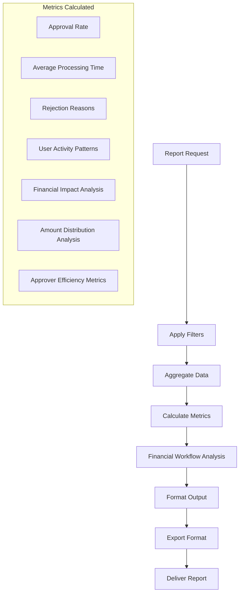

**Diagram sources**
- [validation-rapport.service.ts](file://backend/src/modules/validation-workflow/services/validation-rapport.service.ts)

**Section sources**
- [validation-rapport.service.ts](file://backend/src/modules/validation-workflow/services/validation-rapport.service.ts)

## Implementation Details

### Configuration Management

The system supports dynamic configuration through environment variables and database parameters with enhanced financial workflow settings:

| Configuration Parameter | Purpose | Default Value |
|------------------------|---------|---------------|
| `WORKFLOW_MAX_LEVELS` | Maximum approval levels | 5 |
| `WORKFLOW_TIMEOUT` | Workflow timeout period | 30 days |
| `FINANCE_WORKFLOW_ENABLED` | Enable financial workflows | true |
| `FINANCE_THRESHOLD_LEVEL_2` | Amount threshold for level 2 | 500,000 FCFA |
| `FINANCE_THRESHOLD_LEVEL_3` | Amount threshold for level 3 | 2,000,000 FCFA |
| `FINANCE_THRESHOLD_LEVEL_4` | Amount threshold for level 4 | 10,000,000 FCFA |
| `NOTIFICATION_ENABLED` | Enable/disable notifications | true |
| `AUDIT_ENABLED` | Enable/disable audit logging | true |

### Data Validation

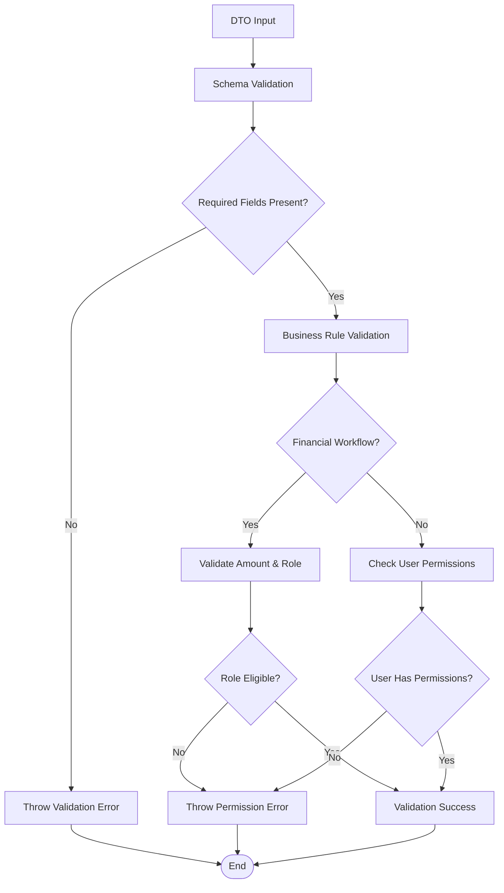

**Diagram sources**
- [validation-workflow.dto.ts](file://backend/src/modules/validation-workflow/dto/validation-workflow.dto.ts)
- [validation-rapport.dto.ts](file://backend/src/modules/validation-workflow/dto/validation-rapport.dto.ts)
- [finance-workflow.service.ts:106-129](file://backend/src/modules/finances/services/finance-workflow.service.ts#L106-L129)

**Section sources**
- [validation-workflow.dto.ts](file://backend/src/modules/validation-workflow/dto/validation-workflow.dto.ts)
- [validation-rapport.dto.ts](file://backend/src/modules/validation-workflow/dto/validation-rapport.dto.ts)
- [finance-workflow.service.ts:106-129](file://backend/src/modules/finances/services/finance-workflow.service.ts#L106-L129)

## Troubleshooting Guide

### Common Issues and Solutions

| Issue | Symptoms | Solution |
|-------|----------|----------|
| Workflow stuck at level | Cannot approve/reject | Check user permissions for next approver role |
| Financial workflow errors | Amount-based validation failures | Verify threshold configuration and role assignments |
| Notification failures | Users not receiving emails | Verify notification provider configuration |
| Permission errors | Access denied messages | Review RBAC configuration for module permissions |
| Database connection issues | Service unavailable | Check PostgreSQL connectivity and credentials |
| **Financial audit gaps** | Missing financial validation logs | Verify audit service integration and configuration |
| **Workflow routing issues** | Incorrect approval routing | Check workflow configuration and role hierarchy |

### Error Handling

The system implements comprehensive error handling with specific error types and enhanced financial workflow error management:

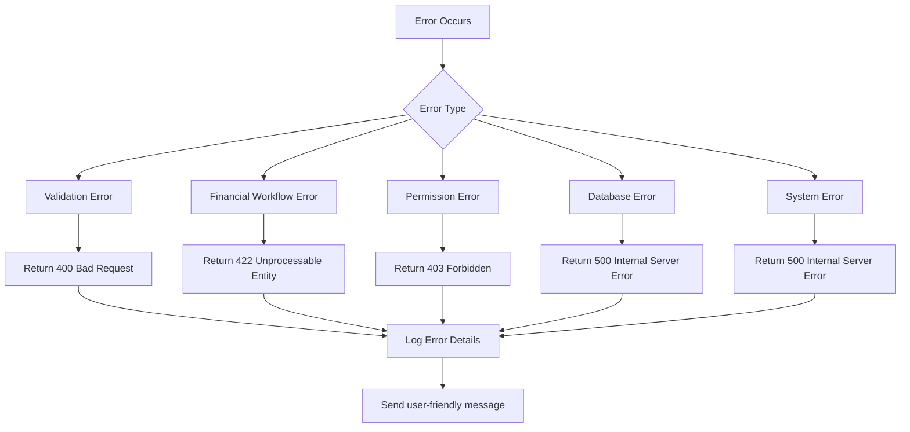

**Diagram sources**
- [validation-workflow.service.ts:12-16](file://backend/src/modules/validation-workflow/services/validation-workflow.service.ts#L12-L16)
- [finance-workflow.service.ts:152-158](file://backend/src/modules/finances/services/finance-workflow.service.ts#L152-L158)

**Section sources**
- [validation-workflow.service.ts:12-16](file://backend/src/modules/validation-workflow/services/validation-workflow.service.ts#L12-L16)
- [finance-workflow.service.ts:152-158](file://backend/src/modules/finances/services/finance-workflow.service.ts#L152-L158)

## Conclusion

The Validation Workflow System provides a robust, scalable solution for managing multi-level approval processes in educational institutions with comprehensive financial module integration. Its modular architecture, enhanced permission system, integrated notification capabilities, and comprehensive audit trail make it suitable for various administrative functions within the eLISAschool platform.

**Updated** Key enhancements of the system include:

- **Enhanced Financial Integration**: Comprehensive multi-level approval processes for financial transactions with dynamic role requirements
- **Advanced Workflow Routing**: Intelligent routing based on transaction amounts and required approval levels
- **Comprehensive Audit Trail**: Detailed logging of all workflow activities including financial transactions
- **Dynamic Role Management**: Automatic role assignment based on transaction thresholds and approval requirements
- **Financial Analytics**: Advanced reporting and analytics for financial workflow performance
- **Seamless Integration**: Tight integration between validation workflows and financial module operations

The system's implementation demonstrates best practices in enterprise application development, with clear separation of concerns, comprehensive error handling, extensive documentation of its APIs and internal workings, and robust financial workflow management capabilities.