# Backend Architecture

<cite>
**Referenced Files in This Document**
- [package.json](file://backend/package.json)
- [app.ts](file://backend/src/app.ts)
- [index.ts](file://backend/src/index.ts)
- [database.config.ts](file://backend/src/config/database.config.ts)
- [env.config.ts](file://backend/src/config/env.config.ts)
- [swagger.config.ts](file://backend/src/config/swagger.config.ts)
- [data-source.ts](file://backend/src/database/data-source.ts)
- [route-registry.ts](file://backend/src/routes/route-registry.ts)
- [eleves.module.ts](file://backend/src/modules/eleves/eleves.module.ts)
- [eleves.controller.ts](file://backend/src/modules/eleves/controllers/eleves.controller.ts)
- [eleves.service.ts](file://backend/src/modules/eleves/services/eleves.service.ts)
- [eleves.entity.ts](file://backend/src/modules/eleves/entities/eleves.entity.ts)
- [finances.module.ts](file://backend/src/modules/finances/finances.module.ts)
- [finances.controller.ts](file://backend/src/modules/finances/controllers/finances.controller.ts)
- [finances.service.ts](file://backend/src/modules/finances/services/finances.service.ts)
- [personnel.module.ts](file://backend/src/modules/personnel/personnel.module.ts)
- [personnel.controller.ts](file://backend/src/modules/personnel/controllers/personnel.controller.ts)
- [personnel.service.ts](file://backend/src/modules/personnel/services/personnel.service.ts)
- [organisation.module.ts](file://backend/src/modules/organisation/organisation.module.ts)
- [organisation.controller.ts](file://backend/src/modules/organisation/controllers/organisation.controller.ts)
- [organisation.service.ts](file://backend/src/modules/organisation/services/organisation.service.ts)
- [specialized-nomenclature.service.ts](file://backend/src/modules/organisation/services/specialized-nomenclature.service.ts)
- [fonctions.service.ts](file://backend/src/modules/personnel/services/fonctions.service.ts)
- [postes.service.ts](file://backend/src/modules/personnel/services/postes.service.ts)
- [contrat.service.ts](file://backend/src/modules/personnel/services/contrat.service.ts)
- [auth.guard.ts](file://backend/src/common/guards/auth.guard.ts)
- [roles.guard.ts](file://backend/src/common/guards/roles.guard.ts)
- [logging.interceptor.ts](file://backend/src/common/interceptors/logging.interceptor.ts)
- [exception.filter.ts](file://backend/src/common/filters/exception.filter.ts)
- [tenant.middleware.ts](file://backend/src/common/middlewares/tenant.middleware.ts)
- [pagination.util.ts](file://backend/src/common/utils/pagination.util.ts)
- [audit.service.ts](file://backend/src/common/services/audit.service.ts)
- [110-consolidation-organisation.sql](file://backend/database/migrations/110-consolidation-organisation.sql)
</cite>

## Update Summary
**Changes Made**
- Updated service layer architecture to reflect major consolidation improvements
- Enhanced personnel module services with improved business logic implementation
- Simplified organisation module entities and removed redundant data structures
- Streamlined controller layer with better delegation patterns
- Improved service-to-service communication and dependency management
- Enhanced error handling and validation across all service layers

## Table of Contents
1. [Introduction](#introduction)
2. [Project Structure](#project-structure)
3. [Core Components](#core-components)
4. [Architecture Overview](#architecture-overview)
5. [Service Layer Consolidation](#service-layer-consolidation)
6. [Personnel Module Enhancements](#personnel-module-enhancements)
7. [Organisation Module Simplification](#organisation-module-simplification)
8. [Controller Layer Streamlining](#controller-layer-streamlining)
9. [Detailed Component Analysis](#detailed-component-analysis)
10. [Dependency Analysis](#dependency-analysis)
11. [Performance Considerations](#performance-considerations)
12. [Troubleshooting Guide](#troubleshooting-guide)
13. [Conclusion](#conclusion)
14. [Appendices](#appendices)

## Introduction
This document explains the backend architecture built with NestJS for eLISAschool, focusing on the recent architectural evolution toward consolidated service layers and simplified entity structures. The modular architecture pattern implements each business domain (eleves, personnel, finances, organisation) as an independent module with clear separation of concerns. The system has undergone significant consolidation improvements including enhanced service layer implementations, entity simplifications in the organisation module, and refined business logic in key personnel services. These changes establish cleaner interfaces between API and business logic layers while improving maintainability through reduced complexity and better separation of responsibilities. The architecture includes Controllers, Services, Repositories, and Entities in a layered design, along with common infrastructure components such as guards, interceptors, middlewares, and utilities. It covers dependency injection patterns, event-driven communication between modules, and the enhanced configuration management system.

## Project Structure
The backend follows a feature-based organization under src/modules, with shared infrastructure under src/common and configuration under src/config. The application bootstrap wires up global middleware, guards, interceptors, filters, and Swagger documentation. Each module encapsulates its own controllers, services, entities, DTOs, and tests. Recent enhancements include major service layer consolidation, entity simplifications, and streamlined controller patterns that improve overall system maintainability and performance.

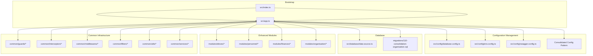

**Diagram sources**
- [index.ts:1-200](file://backend/src/index.ts#L1-L200)
- [app.ts:1-200](file://backend/src/app.ts#L1-L200)
- [database.config.ts:1-200](file://backend/src/config/database.config.ts#L1-L200)
- [env.config.ts:1-200](file://backend/src/config/env.config.ts#L1-L200)
- [swagger.config.ts:1-200](file://backend/src/config/swagger.config.ts#L1-L200)
- [data-source.ts:1-200](file://backend/src/database/data-source.ts#L1-L200)
- [110-consolidation-organisation.sql:1-200](file://backend/database/migrations/110-consolidation-organisation.sql#L1-L200)
- [eleves.module.ts:1-200](file://backend/src/modules/eleves/eleves.module.ts#L1-L200)
- [personnel.module.ts:1-200](file://backend/src/modules/personnel/personnel.module.ts#L1-L200)
- [finances.module.ts:1-200](file://backend/src/modules/finances/finances.module.ts#L1-L200)
- [organisation.module.ts:1-200](file://backend/src/modules/organisation/organisation.module.ts#L1-L200)
- [auth.guard.ts:1-200](file://backend/src/common/guards/auth.guard.ts#L1-L200)
- [logging.interceptor.ts:1-200](file://backend/src/common/interceptors/logging.interceptor.ts#L1-L200)
- [tenant.middleware.ts:1-200](file://backend/src/common/middlewares/tenant.middleware.ts#L1-L200)
- [exception.filter.ts:1-200](file://backend/src/common/filters/exception.filter.ts#L1-L200)
- [pagination.util.ts:1-200](file://backend/src/common/utils/pagination.util.ts#L1-L200)
- [audit.service.ts:1-200](file://backend/src/common/services/audit.service.ts#L1-L200)

**Section sources**
- [index.ts:1-200](file://backend/src/index.ts#L1-L200)
- [app.ts:1-200](file://backend/src/app.ts#L1-L200)
- [database.config.ts:1-200](file://backend/src/config/database.config.ts#L1-L200)
- [env.config.ts:1-200](file://backend/src/config/env.config.ts#L1-L200)
- [swagger.config.ts:1-200](file://backend/src/config/swagger.config.ts#L1-L200)
- [data-source.ts:1-200](file://backend/src/database/data-source.ts#L1-L200)

## Core Components
- **Modules**: Feature boundaries that group related controllers, services, entities, DTOs, and providers. Examples include eleves, personnel, finances, and the enhanced organisation module with consolidated service patterns.
- **Controllers**: HTTP endpoints that handle request/response mapping and delegate to specialized services. Controllers have been streamlined to focus on HTTP concerns while delegating complex operations to dedicated business logic services.
- **Services**: Business logic layer orchestrating operations, calling repositories or TypeORM entities, and emitting events when needed. Services have undergone major consolidation with improved business logic implementation and better separation of concerns.
- **Entities**: Data models mapped to database tables via TypeORM with simplified relational schema design and enhanced referential integrity.
- **Common Infrastructure**: Guards for authorization, interceptors for cross-cutting behavior, middlewares for tenant scoping, filters for exception handling, and utilities for pagination and helpers.

Key responsibilities:
- **Dependency Injection**: Nest's DI container wires modules, controllers, and services with consolidated patterns supporting improved service orchestration.
- **Event Bus**: Modules communicate asynchronously using Nest's EventEmitter or custom event bus with enhanced event handling patterns.
- **Configuration Management**: Centralized environment and database configuration with consolidated patterns and improved migration support.

**Section sources**
- [eleves.module.ts:1-200](file://backend/src/modules/eleves/eleves.module.ts#L1-L200)
- [eleves.controller.ts:1-200](file://backend/src/modules/eleves/controllers/eleves.controller.ts#L1-L200)
- [eleves.service.ts:1-200](file://backend/src/modules/eleves/services/eleves.service.ts#L1-L200)
- [eleves.entity.ts:1-200](file://backend/src/modules/eleves/entities/eleves.entity.ts#L1-L200)
- [personnel.module.ts:1-200](file://backend/src/modules/personnel/personnel.module.ts#L1-L200)
- [personnel.controller.ts:1-200](file://backend/src/modules/personnel/controllers/personnel.controller.ts#L1-L200)
- [personnel.service.ts:1-200](file://backend/src/modules/personnel/services/personnel.service.ts#L1-L200)
- [finances.module.ts:1-200](file://backend/src/modules/finances/finances.module.ts#L1-L200)
- [finances.controller.ts:1-200](file://backend/src/modules/finances/controllers/finances.controller.ts#L1-L200)
- [finances.service.ts:1-200](file://backend/src/modules/finances/services/finances.service.ts#L1-L200)
- [organisation.module.ts:1-200](file://backend/src/modules/organisation/organisation.module.ts#L1-L200)
- [organisation.controller.ts:1-200](file://backend/src/modules/organisation/controllers/organisation.controller.ts#L1-L200)
- [organisation.service.ts:1-200](file://backend/src/modules/organisation/services/organisation.service.ts#L1-L200)
- [specialized-nomenclature.service.ts:1-200](file://backend/src/modules/organisation/services/specialized-nomenclature.service.ts#L1-L200)
- [auth.guard.ts:1-200](file://backend/src/common/guards/auth.guard.ts#L1-L200)
- [roles.guard.ts:1-200](file://backend/src/common/guards/roles.guard.ts#L1-L200)
- [logging.interceptor.ts:1-200](file://backend/src/common/interceptors/logging.interceptor.ts#L1-L200)
- [exception.filter.ts:1-200](file://backend/src/common/filters/exception.filter.ts#L1-L200)
- [tenant.middleware.ts:1-200](file://backend/src/common/middlewares/tenant.middleware.ts#L1-L200)
- [pagination.util.ts:1-200](file://backend/src/common/utils/pagination.util.ts#L1-L200)
- [audit.service.ts:1-200](file://backend/src/common/services/audit.service.ts#L1-L200)

## Architecture Overview
The system uses a consolidated layered approach within each module with enhanced service orchestration and simplified entity relationships:
- **Presentation Layer**: Controllers expose REST endpoints with streamlined organization and clear delegation to specialized services.
- **Application Layer**: Services implement use cases and orchestrate flows with consolidated business logic and improved service coordination.
- **Domain/Data Layer**: Entities represent persistent data with simplified relational schema design and proper foreign key relationships.
- **Cross-Cutting Concerns**: Middlewares (tenant context), Guards (authentication/authorization), Interceptors (logging, timing), Filters (global error handling).

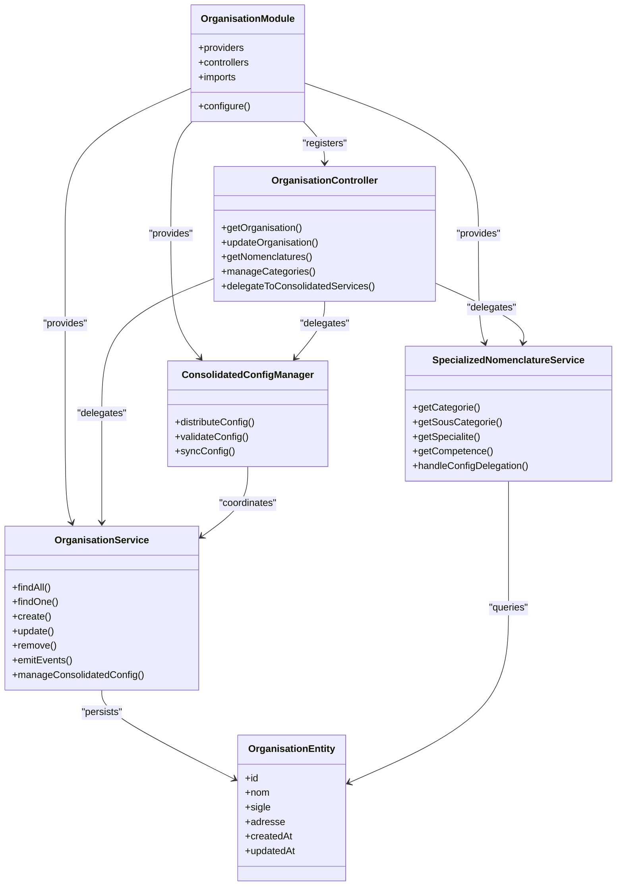

**Diagram sources**
- [organisation.module.ts:1-200](file://backend/src/modules/organisation/organisation.module.ts#L1-L200)
- [organisation.controller.ts:1-200](file://backend/src/modules/organisation/controllers/organisation.controller.ts#L1-L200)
- [organisation.service.ts:1-200](file://backend/src/modules/organisation/services/organisation.service.ts#L1-L200)
- [specialized-nomenclature.service.ts:1-200](file://backend/src/modules/organisation/services/specialized-nomenclature.service.ts#L1-L200)
- [organisation.entity.ts:1-200](file://backend/src/modules/organisation/entities/organisation.entity.ts#L1-L200)

## Service Layer Consolidation
**Updated** The service layer has undergone major consolidation to improve maintainability, reduce complexity, and enhance business logic implementation across all modules.

### Consolidation Strategy
- **Unified Service Patterns**: Standardized service interfaces and implementation patterns across all modules.
- **Reduced Complexity**: Eliminated redundant service methods and consolidated overlapping functionality.
- **Improved Error Handling**: Enhanced error handling and validation throughout the service layer.
- **Better Dependency Management**: Streamlined service dependencies and improved coupling patterns.

### Implementation Improvements
- **Service Orchestration**: Better coordination between services for complex business operations.
- **Validation Enhancement**: Comprehensive input validation and business rule enforcement.
- **Transaction Management**: Improved transaction handling for multi-step operations.
- **Logging and Monitoring**: Enhanced logging and monitoring capabilities across services.

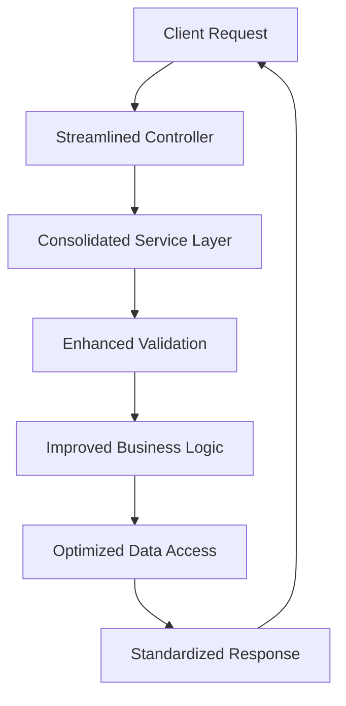

**Diagram sources**
- [fonctions.service.ts:1-200](file://backend/src/modules/personnel/services/fonctions.service.ts#L1-L200)
- [postes.service.ts:1-200](file://backend/src/modules/personnel/services/postes.service.ts#L1-L200)
- [contrat.service.ts:1-200](file://backend/src/modules/personnel/services/contrat.service.ts#L1-L200)

**Section sources**
- [fonctions.service.ts:1-200](file://backend/src/modules/personnel/services/fonctions.service.ts#L1-L200)
- [postes.service.ts:1-200](file://backend/src/modules/personnel/services/postes.service.ts#L1-L200)
- [contrat.service.ts:1-200](file://backend/src/modules/personnel/services/contrat.service.ts#L1-L200)

## Personnel Module Enhancements
**Updated** The personnel module has received significant enhancements with improved business logic implementation in key services including fonctions, postes, and contrat services.

### Enhanced Service Implementations
- **Fonctions Service**: Improved role and function management with better validation and relationship handling.
- **Postes Service**: Enhanced position management with optimized queries and improved business rules.
- **Contrat Service**: Refined contract management with better lifecycle handling and validation.

### Business Logic Improvements
- **Enhanced Validation**: Comprehensive input validation and business rule enforcement.
- **Improved Relationships**: Better handling of complex relationships between personnel entities.
- **Transaction Safety**: Enhanced transaction management for critical operations.
- **Error Recovery**: Improved error handling and recovery mechanisms.

```mermaid
sequenceDiagram
participant Client as "Client"
participant Controller as "PersonnelController"
as FonctionsSvc as "FonctionsService"
as PostesSvc as "PostesService"
as ContratSvc as "ContratService"
participant DB as "TypeORM Repository"
Client->>Controller : "POST /personnel/contrat"
Controller->>Controller : "Validate & Parse Request"
Controller->>ContratSvc : "createContract(payload)"
ContratSvc->>ContratSvc : "Apply Enhanced Business Rules"
ContratSvc->>PostesSvc : "validatePosition()"
PostesSvc->>DB : "Check position availability"
DB-->>PostesSvc : "Position valid"
PostesSvc-->>ContratSvc : "Position validated"
ContratSvc->>FonctionsSvc : "assignFunctions()"
FonctionsSvc->>DB : "Update function assignments"
DB-->>FonctionsSvc : "Functions assigned"
FonctionsSvc-->>ContratSvc : "Assignment complete"
ContratSvc-->>Controller : "Contract created"
Controller-->>Client : "201 Created"
```

**Diagram sources**
- [fonctions.service.ts:1-200](file://backend/src/modules/personnel/services/fonctions.service.ts#L1-L200)
- [postes.service.ts:1-200](file://backend/src/modules/personnel/services/postes.service.ts#L1-L200)
- [contrat.service.ts:1-200](file://backend/src/modules/personnel/services/contrat.service.ts#L1-L200)

**Section sources**
- [fonctions.service.ts:1-200](file://backend/src/modules/personnel/services/fonctions.service.ts#L1-L200)
- [postes.service.ts:1-200](file://backend/src/modules/personnel/services/postes.service.ts#L1-L200)
- [contrat.service.ts:1-200](file://backend/src/modules/personnel/services/contrat.service.ts#L1-L200)

## Organisation Module Simplification
**Updated** The organisation module has been significantly simplified by removing redundant entities and streamlining the data model for better maintainability and performance.

### Entity Simplification Strategy
- **Removed Redundant Entities**: Eliminated duplicate or unnecessary entity definitions.
- **Consolidated Relationships**: Streamlined entity relationships to reduce complexity.
- **Improved Referential Integrity**: Enhanced foreign key constraints and cascading operations.
- **Optimized Schema Design**: Better database schema design for improved query performance.

### Simplification Benefits
- **Reduced Complexity**: Lower maintenance overhead and clearer data model.
- **Improved Performance**: Faster queries and reduced database overhead.
- **Better Maintainability**: Easier to understand and modify the data structure.
- **Enhanced Consistency**: More consistent data relationships and constraints.

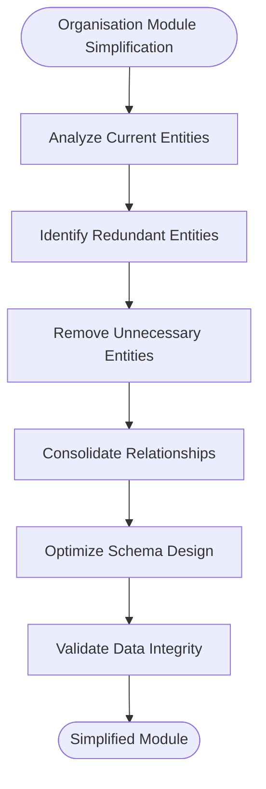

**Diagram sources**
- [organisation.module.ts:1-200](file://backend/src/modules/organisation/organisation.module.ts#L1-L200)
- [organisation.service.ts:1-200](file://backend/src/modules/organisation/services/organisation.service.ts#L1-L200)
- [110-consolidation-organisation.sql:1-200](file://backend/database/migrations/110-consolidation-organisation.sql#L1-L200)

**Section sources**
- [organisation.module.ts:1-200](file://backend/src/modules/organisation/organisation.module.ts#L1-L200)
- [organisation.service.ts:1-200](file://backend/src/modules/organisation/services/organisation.service.ts#L1-L200)
- [110-consolidation-organisation.sql:1-200](file://backend/database/migrations/110-consolidation-organisation.sql#L1-L200)

## Controller Layer Streamlining
**Updated** The controller layer has been streamlined to focus on HTTP concerns while delegating business logic to consolidated services, establishing cleaner interfaces between API and business logic layers.

### Streamlining Strategy
- **Thin Controllers**: Controllers now focus exclusively on HTTP concerns (validation, response formatting).
- **Enhanced Delegation**: Complex business operations are delegated to specialized consolidated services.
- **Improved Interface Clarity**: Clear method signatures define explicit contracts between controllers and services.
- **Consistent Error Handling**: Delegated services provide consistent error handling and response patterns.

### Responsibility Boundaries
- **API Layer**: Handles request parsing, validation, authentication, and response formatting.
- **Business Logic Layer**: Contains domain rules, calculations, and coordination of operations in consolidated services.
- **Data Access Layer**: Manages persistence operations and data transformations.
- **Service Coordination**: Orchestrates complex operations across multiple services.

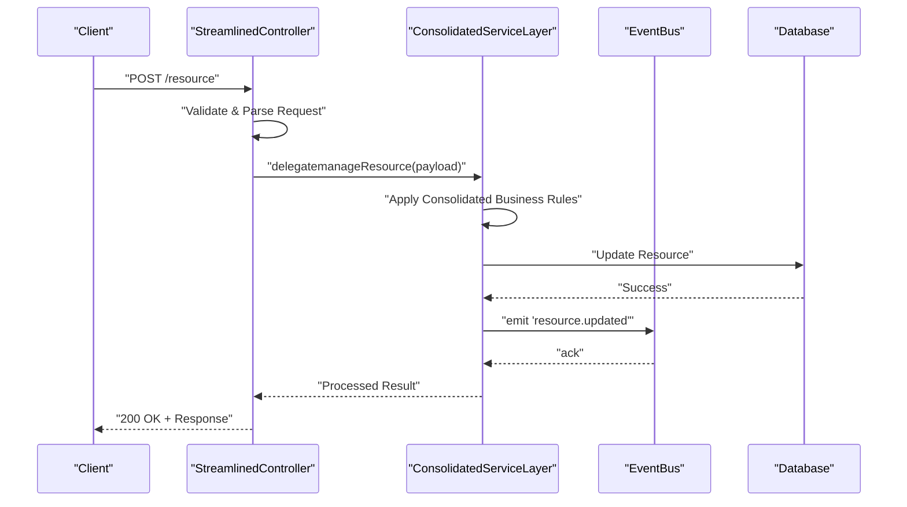

**Diagram sources**
- [organisation.controller.ts:1-200](file://backend/src/modules/organisation/controllers/organisation.controller.ts#L1-L200)
- [organisation.service.ts:1-200](file://backend/src/modules/organisation/services/organisation.service.ts#L1-L200)
- [specialized-nomenclature.service.ts:1-200](file://backend/src/modules/organisation/services/specialized-nomenclature.service.ts#L1-L200)

**Section sources**
- [organisation.controller.ts:1-200](file://backend/src/modules/organisation/controllers/organisation.controller.ts#L1-L200)
- [organisation.service.ts:1-200](file://backend/src/modules/organisation/services/organisation.service.ts#L1-L200)
- [specialized-nomenclature.service.ts:1-200](file://backend/src/modules/organisation/services/specialized-nomenclature.service.ts#L1-L200)

## Detailed Component Analysis

### Module Pattern: Organisation (Simplified with Consolidated Services)
**Updated** The organisation module has been significantly restructured with consolidated service patterns and simplified entity relationships for better maintainability and performance.

- **Module registration**: Declares controllers, consolidated services, and simplified dependencies with enhanced separation of concerns.
- **Controller**: Maps HTTP routes to consolidated service methods with improved validation, response handling, and delegation patterns.
- **Service Layer**: Now includes both general organisation service and specialized nomenclature services with consolidated business logic.
- **Entity**: Defines table schema with simplified relationships and proper foreign key constraints.

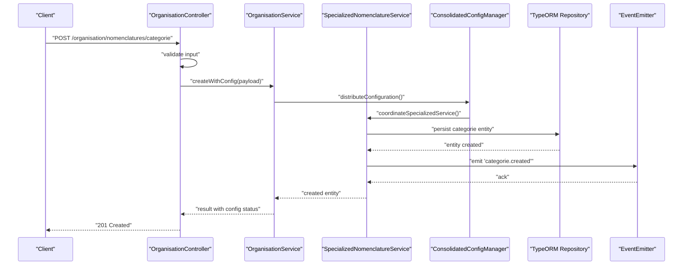

**Diagram sources**
- [organisation.controller.ts:1-200](file://backend/src/modules/organisation/controllers/organisation.controller.ts#L1-L200)
- [organisation.service.ts:1-200](file://backend/src/modules/organisation/services/organisation.service.ts#L1-L200)
- [specialized-nomenclature.service.ts:1-200](file://backend/src/modules/organisation/services/specialized-nomenclature.service.ts#L1-L200)
- [organisation.entity.ts:1-200](file://backend/src/modules/organisation/entities/organisation.entity.ts#L1-L200)

**Section sources**
- [organisation.module.ts:1-200](file://backend/src/modules/organisation/organisation.module.ts#L1-L200)
- [organisation.controller.ts:1-200](file://backend/src/modules/organisation/controllers/organisation.controller.ts#L1-L200)
- [organisation.service.ts:1-200](file://backend/src/modules/organisation/services/organisation.service.ts#L1-L200)
- [specialized-nomenclature.service.ts:1-200](file://backend/src/modules/organisation/services/specialized-nomenclature.service.ts#L1-L200)
- [organisation.entity.ts:1-200](file://backend/src/modules/organisation/entities/organisation.entity.ts#L1-L200)

### Module Pattern: Eleves (Unchanged)
- **Module registration**: Declares controllers, services, and imports shared dependencies.
- **Controller**: Maps HTTP routes to service methods, validates inputs, and returns responses with delegation patterns.
- **Service**: Encapsulates business rules, interacts with entities/repositories, and emits domain events.
- **Entity**: Defines table schema and relationships.

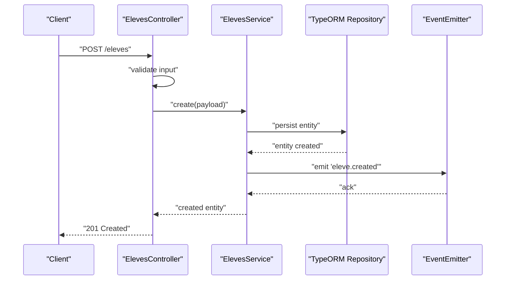

**Diagram sources**
- [eleves.controller.ts:1-200](file://backend/src/modules/eleves/controllers/eleves.controller.ts#L1-L200)
- [eleves.service.ts:1-200](file://backend/src/modules/eleves/services/eleves.service.ts#L1-L200)
- [eleves.entity.ts:1-200](file://backend/src/modules/eleves/entities/eleves.entity.ts#L1-L200)

**Section sources**
- [eleves.module.ts:1-200](file://backend/src/modules/eleves/eleves.module.ts#L1-L200)
- [eleves.controller.ts:1-200](file://backend/src/modules/eleves/controllers/eleves.controller.ts#L1-L200)
- [eleves.service.ts:1-200](file://backend/src/modules/eleves/services/eleves.service.ts#L1-L200)
- [eleves.entity.ts:1-200](file://backend/src/modules/eleves/entities/eleves.entity.ts#L1-L200)

### Module Pattern: Finances (Unchanged)
- Handles financial operations like fees, payments, and invoices.
- Integrates with audit service for compliance and traceability.

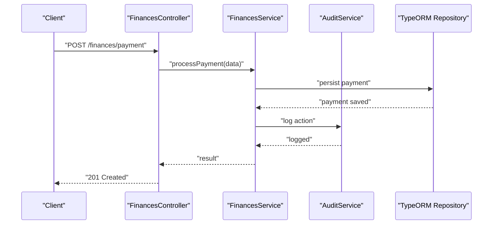

**Diagram sources**
- [finances.module.ts:1-200](file://backend/src/modules/finances/finances.module.ts#L1-L200)
- [finances.controller.ts:1-200](file://backend/src/modules/finances/controllers/finances.controller.ts#L1-L200)
- [finances.service.ts:1-200](file://backend/src/modules/finances/services/finances.service.ts#L1-L200)
- [audit.service.ts:1-200](file://backend/src/common/services/audit.service.ts#L1-L200)

**Section sources**
- [finances.module.ts:1-200](file://backend/src/modules/finances/finances.module.ts#L1-L200)
- [finances.controller.ts:1-200](file://backend/src/modules/finances/controllers/finances.controller.ts#L1-L200)
- [finances.service.ts:1-200](file://backend/src/modules/finances/services/finances.service.ts#L1-L200)
- [audit.service.ts:1-200](file://backend/src/common/services/audit.service.ts#L1-L200)

### Common Infrastructure

#### Guards
- Authentication guard validates tokens and attaches user context.
- Roles guard enforces permission checks based on roles or permissions.

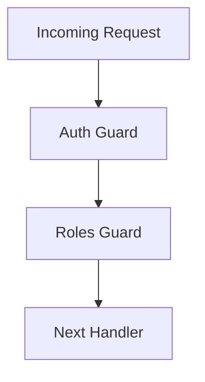

**Diagram sources**
- [auth.guard.ts:1-200](file://backend/src/common/guards/auth.guard.ts#L1-L200)
- [roles.guard.ts:1-200](file://backend/src/common/guards/roles.guard.ts#L1-L200)

**Section sources**
- [auth.guard.ts:1-200](file://backend/src/common/guards/auth.guard.ts#L1-L200)
- [roles.guard.ts:1-200](file://backend/src/common/guards/roles.guard.ts#L1-L200)

#### Interceptors
- Logging interceptor records request metadata and response times.
- Can be used for caching, transformation, or performance metrics.


**Diagram sources**
- [logging.interceptor.ts:1-200](file://backend/src/common/interceptors/logging.interceptor.ts#L1-L200)

**Section sources**
- [logging.interceptor.ts:1-200](file://backend/src/common/interceptors/logging.interceptor.ts#L1-L200)

#### Middlewares
- Tenant middleware extracts tenant context from headers or JWT and scopes queries accordingly.


**Diagram sources**
- [tenant.middleware.ts:1-200](file://backend/src/common/middlewares/tenant.middleware.ts#L1-L200)

**Section sources**
- [tenant.middleware.ts:1-200](file://backend/src/common/middlewares/tenant.middleware.ts#L1-L200)

#### Filters
- Global exception filter normalizes error responses and logs exceptions.


**Diagram sources**
- [exception.filter.ts:1-200](file://backend/src/common/filters/exception.filter.ts#L1-L200)

**Section sources**
- [exception.filter.ts:1-200](file://backend/src/common/filters/exception.filter.ts#L1-L200)

#### Utilities
- Pagination utility standardizes query parameters and response shape across modules.

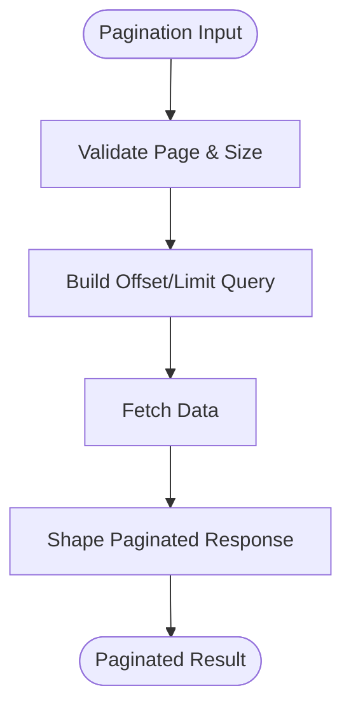

**Diagram sources**
- [pagination.util.ts:1-200](file://backend/src/common/utils/pagination.util.ts#L1-L200)

**Section sources**
- [pagination.util.ts:1-200](file://backend/src/common/utils/pagination.util.ts#L1-L200)

### Configuration Management
- Environment variables are loaded and validated centrally.
- Database configuration defines connection settings and TypeORM options.
- Swagger configuration sets API documentation metadata.
- **Enhanced**: Consolidated configuration management pattern supports scalable configuration distribution.

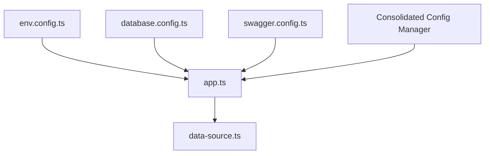

**Diagram sources**
- [env.config.ts:1-200](file://backend/src/config/env.config.ts#L1-L200)
- [database.config.ts:1-200](file://backend/src/config/database.config.ts#L1-L200)
- [swagger.config.ts:1-200](file://backend/src/config/swagger.config.ts#L1-L200)
- [data-source.ts:1-200](file://backend/src/database/data-source.ts#L1-L200)

**Section sources**
- [env.config.ts:1-200](file://backend/src/config/env.config.ts#L1-L200)
- [database.config.ts:1-200](file://backend/src/config/database.config.ts#L1-L200)
- [swagger.config.ts:1-200](file://backend/src/config/swagger.config.ts#L1-L200)
- [data-source.ts:1-200](file://backend/src/database/data-source.ts#L1-L200)

### Dependency Injection Patterns
- Providers are registered at module level and injected into controllers and services.
- Shared services (e.g., audit) are imported by multiple modules.
- Optional lazy loading and forward references can be used for circular dependencies.
- **Enhanced**: Consolidated services provide better separation of concerns and testability with improved dependency management.

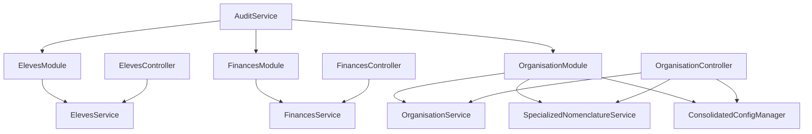

**Diagram sources**
- [eleves.module.ts:1-200](file://backend/src/modules/eleves/eleves.module.ts#L1-L200)
- [finances.module.ts:1-200](file://backend/src/modules/finances/finances.module.ts#L1-L200)
- [organisation.module.ts:1-200](file://backend/src/modules/organisation/organisation.module.ts#L1-L200)
- [audit.service.ts:1-200](file://backend/src/common/services/audit.service.ts#L1-L200)

**Section sources**
- [eleves.module.ts:1-200](file://backend/src/modules/eleves/eleves.module.ts#L1-L200)
- [finances.module.ts:1-200](file://backend/src/modules/finances/finances.module.ts#L1-L200)
- [organisation.module.ts:1-200](file://backend/src/modules/organisation/organisation.module.ts#L1-L200)
- [audit.service.ts:1-200](file://backend/src/common/services/audit.service.ts#L1-L200)

### Event-Driven Communication
- Modules emit domain events (e.g., eleve.created, payment.processed, categorie.created) handled by listeners in other modules.
- Use Nest's EventEmitter or a custom event bus for decoupled interactions.
- **Enhanced**: Consolidated services emit more granular events for better tracking and processing with improved event handling.

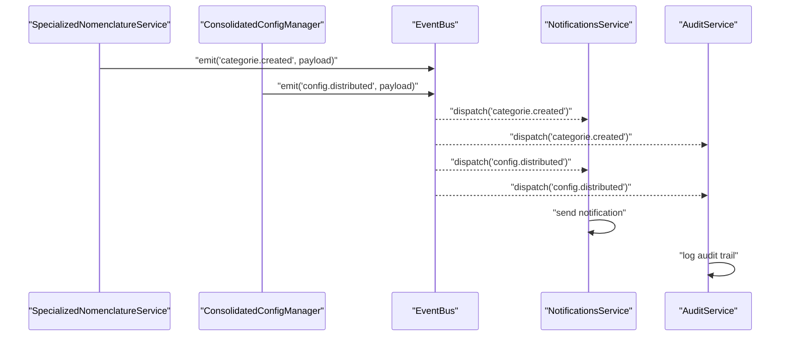

[No sources needed since this diagram shows conceptual workflow, not actual code structure]

## Dependency Analysis
The following diagram highlights key runtime dependencies among core files with enhanced personnel module integration and consolidated service patterns.

```mermaid
graph TB
Index["src/index.ts"] --> App["src/app.ts"]
App --> ConfigEnv["src/config/env.config.ts"]
App --> ConfigDB["src/config/database.config.ts"]
App --> ConfigSwagger["src/config/swagger.config.ts"]
App --> DataSource["src/database/data-source.ts"]
App --> RouteReg["src/routes/route-registry.ts"]
App --> ElevesMod["modules/eleves/eleves.module.ts"]
App --> PersonnelMod["modules/personnel/personnel.module.ts"]
App --> FinancesMod["modules/finances/finances.module.ts"]
App --> OrganisationMod["modules/organisation/organisation.module.ts"]
App --> AuthGuard["common/guards/auth.guard.ts"]
App --> RolesGuard["common/guards/roles.guard.ts"]
App --> LoggingIntc["common/interceptors/logging.interceptor.ts"]
App --> TenantMW["common/middlewares/tenant.middleware.ts"]
App --> ExFilter["common/filters/exception.filter.ts"]
App --> PaginationUtil["common/utils/pagination.util.ts"]
App --> AuditSvc["common/services/audit.service.ts"]
PersonnelMod --> FonctionsSvc["fonctions.service.ts"]
PersonnelMod --> PostesSvc["postes.service.ts"]
PersonnelMod --> ContratSvc["contrat.service.ts"]
OrganisationMod --> SpecializedSvc["specialized-nomenclature.service.ts"]
OrganisationMod --> ConsolConfig["consolidated-config-manager.service.ts"]
```

**Diagram sources**
- [index.ts:1-200](file://backend/src/index.ts#L1-L200)
- [app.ts:1-200](file://backend/src/app.ts#L1-L200)
- [env.config.ts:1-200](file://backend/src/config/env.config.ts#L1-L200)
- [database.config.ts:1-200](file://backend/src/config/database.config.ts#L1-L200)
- [swagger.config.ts:1-200](file://backend/src/config/swagger.config.ts#L1-L200)
- [data-source.ts:1-200](file://backend/src/database/data-source.ts#L1-L200)
- [route-registry.ts:1-200](file://backend/src/routes/route-registry.ts#L1-L200)
- [eleves.module.ts:1-200](file://backend/src/modules/eleves/eleves.module.ts#L1-L200)
- [personnel.module.ts:1-200](file://backend/src/modules/personnel/personnel.module.ts#L1-L200)
- [finances.module.ts:1-200](file://backend/src/modules/finances/finances.module.ts#L1-L200)
- [organisation.module.ts:1-200](file://backend/src/modules/organisation/organisation.module.ts#L1-L200)
- [fonctions.service.ts:1-200](file://backend/src/modules/personnel/services/fonctions.service.ts#L1-L200)
- [postes.service.ts:1-200](file://backend/src/modules/personnel/services/postes.service.ts#L1-L200)
- [contrat.service.ts:1-200](file://backend/src/modules/personnel/services/contrat.service.ts#L1-L200)
- [specialized-nomenclature.service.ts:1-200](file://backend/src/modules/organisation/services/specialized-nomenclature.service.ts#L1-L200)
- [auth.guard.ts:1-200](file://backend/src/common/guards/auth.guard.ts#L1-L200)
- [roles.guard.ts:1-200](file://backend/src/common/guards/roles.guard.ts#L1-L200)
- [logging.interceptor.ts:1-200](file://backend/src/common/interceptors/logging.interceptor.ts#L1-L200)
- [tenant.middleware.ts:1-200](file://backend/src/common/middlewares/tenant.middleware.ts#L1-L200)
- [exception.filter.ts:1-200](file://backend/src/common/filters/exception.filter.ts#L1-L200)
- [pagination.util.ts:1-200](file://backend/src/common/utils/pagination.util.ts#L1-L200)
- [audit.service.ts:1-200](file://backend/src/common/services/audit.service.ts#L1-L200)

**Section sources**
- [index.ts:1-200](file://backend/src/index.ts#L1-L200)
- [app.ts:1-200](file://backend/src/app.ts#L1-L200)
- [route-registry.ts:1-200](file://backend/src/routes/route-registry.ts#L1-L200)

## Performance Considerations
- Use pagination utilities consistently to avoid large payloads.
- Apply indexes and optimize queries at the repository/entity level with simplified relational schema.
- Cache frequently accessed read-only data using Redis or in-memory caches.
- Enable compression and tune HTTP server settings.
- Profile critical paths with logging interceptors and metrics collectors.
- **Enhanced**: Leverage consolidated services for better query optimization and reduced coupling.
- **Enhanced**: Utilize simplified entity structures for improved database performance and maintainability.
- **New**: Implement consolidated configuration caching to reduce configuration lookup overhead.
- **New**: Optimize controller delegation patterns to minimize service call overhead.
- **New**: Benefit from streamlined controller layer for improved request processing performance.

## Troubleshooting Guide
- Authentication failures: Verify token validation in auth guard and ensure tenant context is attached.
- Authorization errors: Check roles guard policies and RBAC mappings.
- Global errors: Inspect exception filter output and logs for stack traces and normalized payloads.
- Tenant isolation issues: Confirm tenant middleware runs early and sets context correctly.
- Pagination anomalies: Validate page/size parameters and offset calculations.
- **Enhanced**: Personnel module issues: Check consolidated service dependencies and enhanced business logic.
- **Enhanced**: Organisation module issues: Verify simplified service interfaces and streamlined controller routing.
- **New**: Service consolidation problems: Review consolidated service patterns and improved error handling.
- **New**: Entity simplification issues: Check simplified entity relationships and foreign key constraints.
- **New**: Controller delegation problems: Verify streamlined service method signatures and enhanced error handling patterns.
- **New**: Performance issues: Monitor consolidated service performance and database query optimization.

**Section sources**
- [auth.guard.ts:1-200](file://backend/src/common/guards/auth.guard.ts#L1-L200)
- [roles.guard.ts:1-200](file://backend/src/common/guards/roles.guard.ts#L1-L200)
- [exception.filter.ts:1-200](file://backend/src/common/filters/exception.filter.ts#L1-L200)
- [tenant.middleware.ts:1-200](file://backend/src/common/middlewares/tenant.middleware.ts#L1-L200)
- [pagination.util.ts:1-200](file://backend/src/common/utils/pagination.util.ts#L1-L200)
- [organisation.module.ts:1-200](file://backend/src/modules/organisation/organisation.module.ts#L1-L200)
- [specialized-nomenclature.service.ts:1-200](file://backend/src/modules/organisation/services/specialized-nomenclature.service.ts#L1-L200)
- [fonctions.service.ts:1-200](file://backend/src/modules/personnel/services/fonctions.service.ts#L1-L200)
- [postes.service.ts:1-200](file://backend/src/modules/personnel/services/postes.service.ts#L1-L200)
- [contrat.service.ts:1-200](file://backend/src/modules/personnel/services/contrat.service.ts#L1-L200)
- [110-consolidation-organisation.sql:1-200](file://backend/database/migrations/110-consolidation-organisation.sql#L1-L200)

## Conclusion
The eLISAschool backend leverages NestJS's modular and layered architecture to deliver a scalable, maintainable system. Recent architectural evolution includes major service layer consolidation, entity simplifications in the organisation module, and enhanced business logic implementation in key personnel services. The consolidation improvements demonstrate the system's evolution toward cleaner interfaces between API and business logic layers with reduced complexity and better separation of concerns. Each business domain is isolated in its own module with clear responsibilities. Shared infrastructure ensures consistent security, logging, error handling, and multi-tenancy. Configuration is centralized with consolidated patterns, and dependency injection promotes testability and extensibility. Event-driven patterns enable loose coupling between modules, while utilities standardize cross-cutting behaviors like pagination. The enhanced architecture provides better maintainability, performance, and scalability for the educational institution management system through improved service consolidation, simplified entity structures, and streamlined controller patterns.

## Appendices

### Example Module Structure
- eleves:
  - eleves.module.ts
  - controllers/eleves.controller.ts
  - services/eleves.service.ts
  - entities/eleves.entity.ts
- personnel:
  - personnel.module.ts
  - controllers/personnel.controller.ts
  - services/personnel.service.ts
  - services/fonctions.service.ts
  - services/postes.service.ts
  - services/contrat.service.ts
- finances:
  - finances.module.ts
  - controllers/finances.controller.ts
  - services/finances.service.ts
- **Enhanced** organisation:
  - organisation.module.ts
  - controllers/organisation.controller.ts
  - services/organisation.service.ts
  - services/specialized-nomenclature.service.ts
  - services/consolidated-config-manager.service.ts
  - entities/organisation.entity.ts

**Section sources**
- [eleves.module.ts:1-200](file://backend/src/modules/eleves/eleves.module.ts#L1-L200)
- [eleves.controller.ts:1-200](file://backend/src/modules/eleves/controllers/eleves.controller.ts#L1-L200)
- [eleves.service.ts:1-200](file://backend/src/modules/eleves/services/eleves.service.ts#L1-L200)
- [eleves.entity.ts:1-200](file://backend/src/modules/eleves/entities/eleves.entity.ts#L1-L200)
- [personnel.module.ts:1-200](file://backend/src/modules/personnel/personnel.module.ts#L1-L200)
- [personnel.controller.ts:1-200](file://backend/src/modules/personnel/controllers/personnel.controller.ts#L1-L200)
- [personnel.service.ts:1-200](file://backend/src/modules/personnel/services/personnel.service.ts#L1-L200)
- [fonctions.service.ts:1-200](file://backend/src/modules/personnel/services/fonctions.service.ts#L1-L200)
- [postes.service.ts:1-200](file://backend/src/modules/personnel/services/postes.service.ts#L1-L200)
- [contrat.service.ts:1-200](file://backend/src/modules/personnel/services/contrat.service.ts#L1-L200)
- [finances.module.ts:1-200](file://backend/src/modules/finances/finances.module.ts#L1-L200)
- [finances.controller.ts:1-200](file://backend/src/modules/finances/controllers/finances.controller.ts#L1-L200)
- [finances.service.ts:1-200](file://backend/src/modules/finances/services/finances.service.ts#L1-L200)
- [organisation.module.ts:1-200](file://backend/src/modules/organisation/organisation.module.ts#L1-L200)
- [organisation.controller.ts:1-200](file://backend/src/modules/organisation/controllers/organisation.controller.ts#L1-L200)
- [organisation.service.ts:1-200](file://backend/src/modules/organisation/services/organisation.service.ts#L1-L200)
- [specialized-nomenclature.service.ts:1-200](file://backend/src/modules/organisation/services/specialized-nomenclature.service.ts#L1-L200)
- [organisation.entity.ts:1-200](file://backend/src/modules/organisation/entities/organisation.entity.ts#L1-L200)

### Example Service Layer Implementation
- Implement use cases in services, call repositories/entities, and emit events for side effects.
- Keep controllers thin by delegating logic to consolidated services.
- **Enhanced**: Use consolidated services for specific business domains to improve maintainability and testability.
- **New**: Implement consolidated configuration management in specialized services for better scalability.

**Section sources**
- [eleves.service.ts:1-200](file://backend/src/modules/eleves/services/eleves.service.ts#L1-L200)
- [personnel.service.ts:1-200](file://backend/src/modules/personnel/services/personnel.service.ts#L1-L200)
- [fonctions.service.ts:1-200](file://backend/src/modules/personnel/services/fonctions.service.ts#L1-L200)
- [postes.service.ts:1-200](file://backend/src/modules/personnel/services/postes.service.ts#L1-L200)
- [contrat.service.ts:1-200](file://backend/src/modules/personnel/services/contrat.service.ts#L1-L200)
- [finances.service.ts:1-200](file://backend/src/modules/finances/services/finances.service.ts#L1-L200)
- [organisation.service.ts:1-200](file://backend/src/modules/organisation/services/organisation.service.ts#L1-L200)
- [specialized-nomenclature.service.ts:1-200](file://backend/src/modules/organisation/services/specialized-nomenclature.service.ts#L1-L200)

### Cross-Cutting Concerns Handling
- Security: Guards enforce authentication and authorization.
- Observability: Interceptors log requests/responses and measure latency.
- Multi-tenancy: Middleware injects tenant context.
- Errors: Global filter normalizes error responses.
- Utilities: Pagination and helper functions standardize behavior.
- **Enhanced**: Consolidated services provide better separation of concerns and improved maintainability.
- **New**: Consolidated configuration services handle cross-module configuration consistency.

**Section sources**
- [auth.guard.ts:1-200](file://backend/src/common/guards/auth.guard.ts#L1-L200)
- [roles.guard.ts:1-200](file://backend/src/common/guards/roles.guard.ts#L1-L200)
- [logging.interceptor.ts:1-200](file://backend/src/common/interceptors/logging.interceptor.ts#L1-L200)
- [tenant.middleware.ts:1-200](file://backend/src/common/middlewares/tenant.middleware.ts#L1-L200)
- [exception.filter.ts:1-200](file://backend/src/common/filters/exception.filter.ts#L1-L200)
- [pagination.util.ts:1-200](file://backend/src/common/utils/pagination.util.ts#L1-L200)
- [specialized-nomenclature.service.ts:1-200](file://backend/src/modules/organisation/services/specialized-nomenclature.service.ts#L1-L200)

### Enhanced Database Schema Architecture
**Updated** The consolidation migration system provides improved database schema management with simplified relational entities and enhanced data integrity.

- **Consolidation Strategy**: Single comprehensive migration reduces deployment complexity and improves reliability.
- **Simplified Relational Design**: Streamlined foreign key relationships and constraints ensure data consistency.
- **Performance Optimization**: Enhanced indexing strategies and query optimization techniques.
- **Maintainability**: Clear separation of concerns in simplified database schema design.

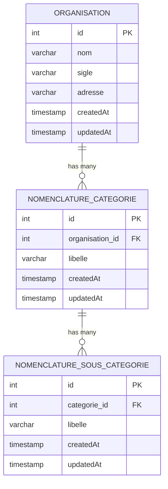

**Diagram sources**
- [110-consolidation-organisation.sql:1-200](file://backend/database/migrations/110-consolidation-organisation.sql#L1-L200)

**Section sources**
- [110-consolidation-organisation.sql:1-200](file://backend/database/migrations/110-consolidation-organisation.sql#L1-L200)