# Backend Architecture

<cite>
**Referenced Files in This Document**
- [package.json](file://backend/package.json)
- [app.ts](file://backend/src/app.ts)
- [index.ts](file://backend/src/index.ts)
- [database.config.ts](file://backend/src/config/database.config.ts)
- [env.config.ts](file://backend/src/config/env.config.ts)
- [swagger.config.ts](file://backend/src/config/swagger.config.ts)
- [data-source.ts](file://backend/src/database/data-source.ts)
- [route-registry.ts](file://backend/src/routes/route-registry.ts)
- [eleves.module.ts](file://backend/src/modules/eleves/eleves.module.ts)
- [eleves.controller.ts](file://backend/src/modules/eleves/controllers/eleves.controller.ts)
- [eleves.service.ts](file://backend/src/modules/eleves/services/eleves.service.ts)
- [eleves.entity.ts](file://backend/src/modules/eleves/entities/eleves.entity.ts)
- [finances.module.ts](file://backend/src/modules/finances/finances.module.ts)
- [finances.controller.ts](file://backend/src/modules/finances/controllers/finances.controller.ts)
- [finances.service.ts](file://backend/src/modules/finances/services/finances.service.ts)
- [personnel.module.ts](file://backend/src/modules/personnel/personnel.module.ts)
- [personnel.controller.ts](file://backend/src/modules/personnel/controllers/personnel.controller.ts)
- [personnel.service.ts](file://backend/src/modules/personnel/services/personnel.service.ts)
- [auth.guard.ts](file://backend/src/common/guards/auth.guard.ts)
- [roles.guard.ts](file://backend/src/common/guards/roles.guard.ts)
- [logging.interceptor.ts](file://backend/src/common/interceptors/logging.interceptor.ts)
- [exception.filter.ts](file://backend/src/common/filters/exception.filter.ts)
- [tenant.middleware.ts](file://backend/src/common/middlewares/tenant.middleware.ts)
- [pagination.util.ts](file://backend/src/common/utils/pagination.util.ts)
- [audit.service.ts](file://backend/src/common/services/audit.service.ts)
</cite>

## Table of Contents
1. [Introduction](#introduction)
2. [Project Structure](#project-structure)
3. [Core Components](#core-components)
4. [Architecture Overview](#architecture-overview)
5. [Detailed Component Analysis](#detailed-component-analysis)
6. [Dependency Analysis](#dependency-analysis)
7. [Performance Considerations](#performance-considerations)
8. [Troubleshooting Guide](#troubleshooting-guide)
9. [Conclusion](#conclusion)
10. [Appendices](#appendices)

## Introduction
This document explains the backend architecture built with NestJS for eLISAschool. It focuses on the modular architecture pattern where each business domain (for example, eleves, personnel, finances) is implemented as an independent module with clear separation of concerns. It also documents the layered architecture including Controllers, Services, Repositories, and Entities, along with common infrastructure components such as guards, interceptors, middlewares, and utilities. Finally, it covers dependency injection patterns, event-driven communication between modules, and configuration management.

## Project Structure
The backend follows a feature-based organization under src/modules, with shared infrastructure under src/common and configuration under src/config. The application bootstrap wires up global middleware, guards, interceptors, filters, and Swagger documentation. Each module encapsulates its own controllers, services, entities, DTOs, and tests.

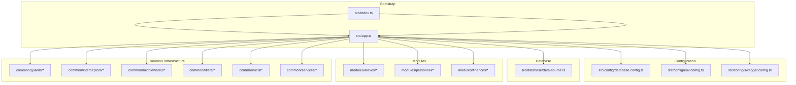

**Diagram sources**
- [index.ts:1-200](file://backend/src/index.ts#L1-L200)
- [app.ts:1-200](file://backend/src/app.ts#L1-L200)
- [database.config.ts:1-200](file://backend/src/config/database.config.ts#L1-L200)
- [env.config.ts:1-200](file://backend/src/config/env.config.ts#L1-L200)
- [swagger.config.ts:1-200](file://backend/src/config/swagger.config.ts#L1-L200)
- [data-source.ts:1-200](file://backend/src/database/data-source.ts#L1-L200)
- [eleves.module.ts:1-200](file://backend/src/modules/eleves/eleves.module.ts#L1-L200)
- [personnel.module.ts:1-200](file://backend/src/modules/personnel/personnel.module.ts#L1-L200)
- [finances.module.ts:1-200](file://backend/src/modules/finances/finances.module.ts#L1-L200)
- [auth.guard.ts:1-200](file://backend/src/common/guards/auth.guard.ts#L1-L200)
- [logging.interceptor.ts:1-200](file://backend/src/common/interceptors/logging.interceptor.ts#L1-L200)
- [tenant.middleware.ts:1-200](file://backend/src/common/middlewares/tenant.middleware.ts#L1-L200)
- [exception.filter.ts:1-200](file://backend/src/common/filters/exception.filter.ts#L1-L200)
- [pagination.util.ts:1-200](file://backend/src/common/utils/pagination.util.ts#L1-L200)
- [audit.service.ts:1-200](file://backend/src/common/services/audit.service.ts#L1-L200)

**Section sources**
- [index.ts:1-200](file://backend/src/index.ts#L1-L200)
- [app.ts:1-200](file://backend/src/app.ts#L1-L200)
- [database.config.ts:1-200](file://backend/src/config/database.config.ts#L1-L200)
- [env.config.ts:1-200](file://backend/src/config/env.config.ts#L1-L200)
- [swagger.config.ts:1-200](file://backend/src/config/swagger.config.ts#L1-L200)
- [data-source.ts:1-200](file://backend/src/database/data-source.ts#L1-L200)

## Core Components
- Modules: Feature boundaries that group related controllers, services, entities, DTOs, and providers. Examples include eleves, personnel, and finances.
- Controllers: HTTP endpoints that handle request/response mapping and delegate to services.
- Services: Business logic layer orchestrating operations, calling repositories or TypeORM entities, and emitting events when needed.
- Entities: Data models mapped to database tables via TypeORM.
- Common Infrastructure: Guards for authorization, interceptors for cross-cutting behavior, middlewares for tenant scoping, filters for exception handling, and utilities for pagination and helpers.

Key responsibilities:
- Dependency Injection: Nest’s DI container wires modules, controllers, and services.
- Event Bus: Modules can communicate asynchronously using Nest’s EventEmitter or custom event bus.
- Configuration: Centralized environment and database configuration.

**Section sources**
- [eleves.module.ts:1-200](file://backend/src/modules/eleves/eleves.module.ts#L1-L200)
- [eleves.controller.ts:1-200](file://backend/src/modules/eleves/controllers/eleves.controller.ts#L1-L200)
- [eleves.service.ts:1-200](file://backend/src/modules/eleves/services/eleves.service.ts#L1-L200)
- [eleves.entity.ts:1-200](file://backend/src/modules/eleves/entities/eleves.entity.ts#L1-L200)
- [personnel.module.ts:1-200](file://backend/src/modules/personnel/personnel.module.ts#L1-L200)
- [personnel.controller.ts:1-200](file://backend/src/modules/personnel/controllers/personnel.controller.ts#L1-L200)
- [personnel.service.ts:1-200](file://backend/src/modules/personnel/services/personnel.service.ts#L1-L200)
- [finances.module.ts:1-200](file://backend/src/modules/finances/finances.module.ts#L1-L200)
- [finances.controller.ts:1-200](file://backend/src/modules/finances/controllers/finances.controller.ts#L1-L200)
- [finances.service.ts:1-200](file://backend/src/modules/finances/services/finances.service.ts#L1-L200)
- [auth.guard.ts:1-200](file://backend/src/common/guards/auth.guard.ts#L1-L200)
- [roles.guard.ts:1-200](file://backend/src/common/guards/roles.guard.ts#L1-L200)
- [logging.interceptor.ts:1-200](file://backend/src/common/interceptors/logging.interceptor.ts#L1-L200)
- [exception.filter.ts:1-200](file://backend/src/common/filters/exception.filter.ts#L1-L200)
- [tenant.middleware.ts:1-200](file://backend/src/common/middlewares/tenant.middleware.ts#L1-L200)
- [pagination.util.ts:1-200](file://backend/src/common/utils/pagination.util.ts#L1-L200)
- [audit.service.ts:1-200](file://backend/src/common/services/audit.service.ts#L1-L200)

## Architecture Overview
The system uses a layered approach within each module:
- Presentation Layer: Controllers expose REST endpoints.
- Application Layer: Services implement use cases and orchestrate flows.
- Domain/Data Layer: Entities represent persistent data; repositories may be provided by TypeORM or custom repository classes.
- Cross-Cutting Concerns: Middlewares (tenant context), Guards (authentication/authorization), Interceptors (logging, timing), Filters (global error handling).

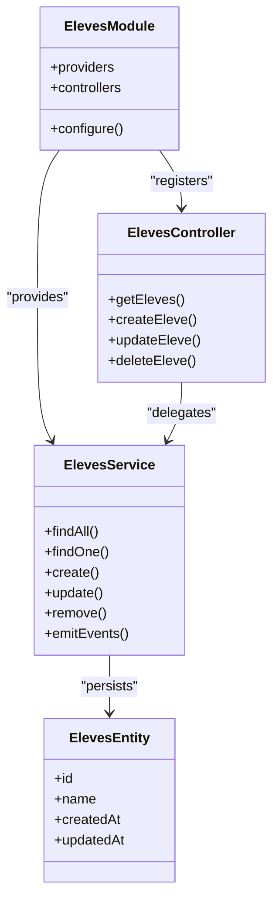

**Diagram sources**
- [eleves.module.ts:1-200](file://backend/src/modules/eleves/eleves.module.ts#L1-L200)
- [eleves.controller.ts:1-200](file://backend/src/modules/eleves/controllers/eleves.controller.ts#L1-L200)
- [eleves.service.ts:1-200](file://backend/src/modules/eleves/services/eleves.service.ts#L1-L200)
- [eleves.entity.ts:1-200](file://backend/src/modules/eleves/entities/eleves.entity.ts#L1-L200)

## Detailed Component Analysis

### Module Pattern: Eleves
- Module registration: Declares controllers, services, and imports shared dependencies.
- Controller: Maps HTTP routes to service methods, validates inputs, and returns responses.
- Service: Encapsulates business rules, interacts with entities/repositories, and emits domain events.
- Entity: Defines table schema and relationships.

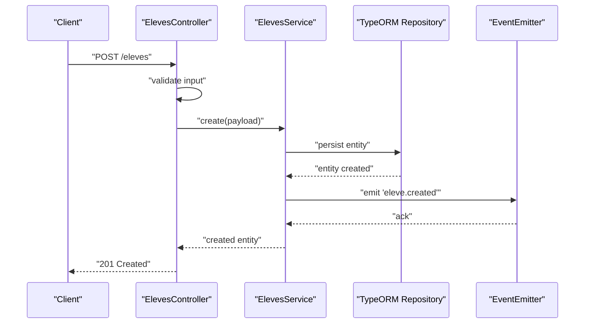

**Diagram sources**
- [eleves.controller.ts:1-200](file://backend/src/modules/eleves/controllers/eleves.controller.ts#L1-L200)
- [eleves.service.ts:1-200](file://backend/src/modules/eleves/services/eleves.service.ts#L1-L200)
- [eleves.entity.ts:1-200](file://backend/src/modules/eleves/entities/eleves.entity.ts#L1-L200)

**Section sources**
- [eleves.module.ts:1-200](file://backend/src/modules/eleves/eleves.module.ts#L1-L200)
- [eleves.controller.ts:1-200](file://backend/src/modules/eleves/controllers/eleves.controller.ts#L1-L200)
- [eleves.service.ts:1-200](file://backend/src/modules/eleves/services/eleves.service.ts#L1-L200)
- [eleves.entity.ts:1-200](file://backend/src/modules/eleves/entities/eleves.entity.ts#L1-L200)

### Module Pattern: Personnel
- Similar structure to Eleves with dedicated controller and service for HR-related operations.
- Uses shared guards and interceptors for consistent security and logging.

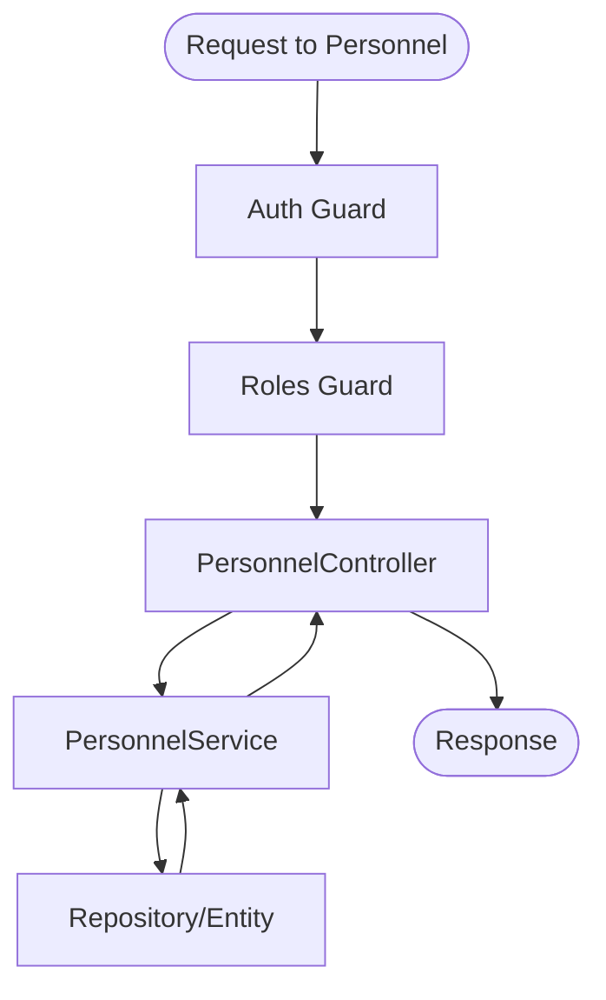

**Diagram sources**
- [personnel.module.ts:1-200](file://backend/src/modules/personnel/personnel.module.ts#L1-L200)
- [personnel.controller.ts:1-200](file://backend/src/modules/personnel/controllers/personnel.controller.ts#L1-L200)
- [personnel.service.ts:1-200](file://backend/src/modules/personnel/services/personnel.service.ts#L1-L200)
- [auth.guard.ts:1-200](file://backend/src/common/guards/auth.guard.ts#L1-L200)
- [roles.guard.ts:1-200](file://backend/src/common/guards/roles.guard.ts#L1-L200)

**Section sources**
- [personnel.module.ts:1-200](file://backend/src/modules/personnel/personnel.module.ts#L1-L200)
- [personnel.controller.ts:1-200](file://backend/src/modules/personnel/controllers/personnel.controller.ts#L1-L200)
- [personnel.service.ts:1-200](file://backend/src/modules/personnel/services/personnel.service.ts#L1-L200)

### Module Pattern: Finances
- Handles financial operations like fees, payments, and invoices.
- Integrates with audit service for compliance and traceability.

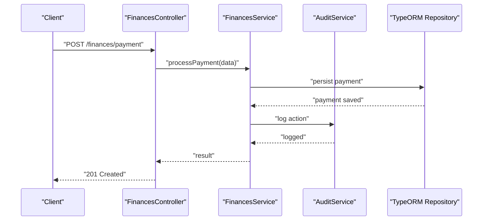

**Diagram sources**
- [finances.module.ts:1-200](file://backend/src/modules/finances/finances.module.ts#L1-L200)
- [finances.controller.ts:1-200](file://backend/src/modules/finances/controllers/finances.controller.ts#L1-L200)
- [finances.service.ts:1-200](file://backend/src/modules/finances/services/finances.service.ts#L1-L200)
- [audit.service.ts:1-200](file://backend/src/common/services/audit.service.ts#L1-L200)

**Section sources**
- [finances.module.ts:1-200](file://backend/src/modules/finances/finances.module.ts#L1-L200)
- [finances.controller.ts:1-200](file://backend/src/modules/finances/controllers/finances.controller.ts#L1-L200)
- [finances.service.ts:1-200](file://backend/src/modules/finances/services/finances.service.ts#L1-L200)
- [audit.service.ts:1-200](file://backend/src/common/services/audit.service.ts#L1-L200)

### Common Infrastructure

#### Guards
- Authentication guard validates tokens and attaches user context.
- Roles guard enforces permission checks based on roles or permissions.

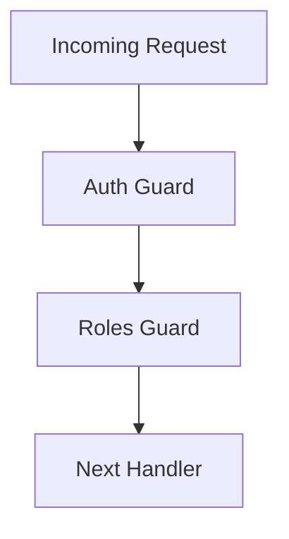

**Diagram sources**
- [auth.guard.ts:1-200](file://backend/src/common/guards/auth.guard.ts#L1-L200)
- [roles.guard.ts:1-200](file://backend/src/common/guards/roles.guard.ts#L1-L200)

**Section sources**
- [auth.guard.ts:1-200](file://backend/src/common/guards/auth.guard.ts#L1-L200)
- [roles.guard.ts:1-200](file://backend/src/common/guards/roles.guard.ts#L1-L200)

#### Interceptors
- Logging interceptor records request metadata and response times.
- Can be used for caching, transformation, or performance metrics.

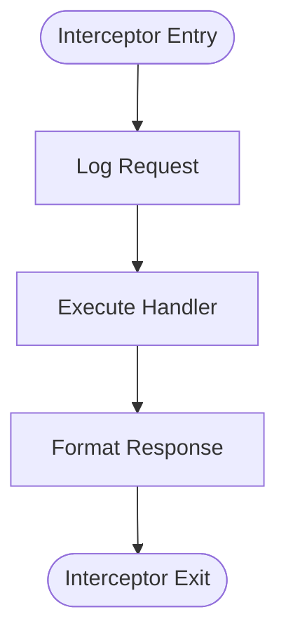

**Diagram sources**
- [logging.interceptor.ts:1-200](file://backend/src/common/interceptors/logging.interceptor.ts#L1-L200)

**Section sources**
- [logging.interceptor.ts:1-200](file://backend/src/common/interceptors/logging.interceptor.ts#L1-L200)

#### Middlewares
- Tenant middleware extracts tenant context from headers or JWT and scopes queries accordingly.

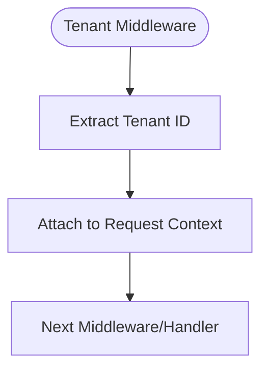

**Diagram sources**
- [tenant.middleware.ts:1-200](file://backend/src/common/middlewares/tenant.middleware.ts#L1-L200)

**Section sources**
- [tenant.middleware.ts:1-200](file://backend/src/common/middlewares/tenant.middleware.ts#L1-L200)

#### Filters
- Global exception filter normalizes error responses and logs exceptions.

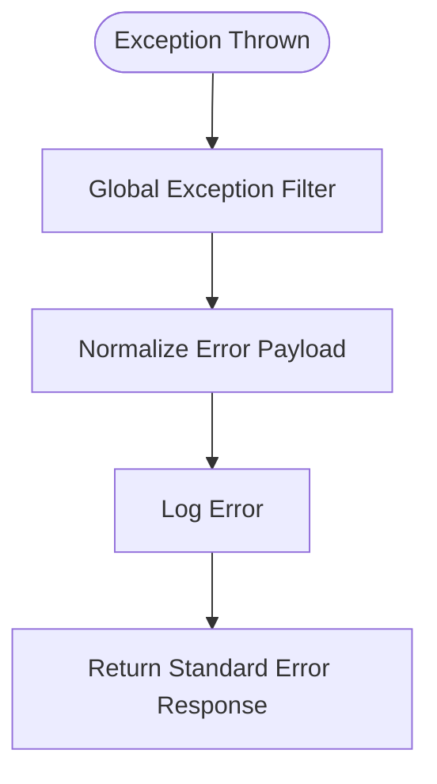

**Diagram sources**
- [exception.filter.ts:1-200](file://backend/src/common/filters/exception.filter.ts#L1-L200)

**Section sources**
- [exception.filter.ts:1-200](file://backend/src/common/filters/exception.filter.ts#L1-L200)

#### Utilities
- Pagination utility standardizes query parameters and response shape across modules.

**Diagram sources**
- [pagination.util.ts:1-200](file://backend/src/common/utils/pagination.util.ts#L1-L200)

**Section sources**
- [pagination.util.ts:1-200](file://backend/src/common/utils/pagination.util.ts#L1-L200)

### Configuration Management
- Environment variables are loaded and validated centrally.
- Database configuration defines connection settings and TypeORM options.
- Swagger configuration sets API documentation metadata.

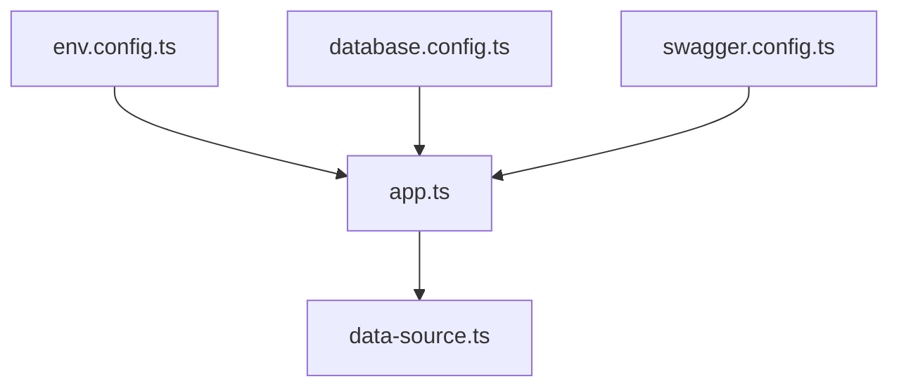

**Diagram sources**
- [env.config.ts:1-200](file://backend/src/config/env.config.ts#L1-L200)
- [database.config.ts:1-200](file://backend/src/config/database.config.ts#L1-L200)
- [swagger.config.ts:1-200](file://backend/src/config/swagger.config.ts#L1-L200)
- [data-source.ts:1-200](file://backend/src/database/data-source.ts#L1-L200)

**Section sources**
- [env.config.ts:1-200](file://backend/src/config/env.config.ts#L1-L200)
- [database.config.ts:1-200](file://backend/src/config/database.config.ts#L1-L200)
- [swagger.config.ts:1-200](file://backend/src/config/swagger.config.ts#L1-L200)
- [data-source.ts:1-200](file://backend/src/database/data-source.ts#L1-L200)

### Dependency Injection Patterns
- Providers are registered at module level and injected into controllers and services.
- Shared services (e.g., audit) are imported by multiple modules.
- Optional lazy loading and forward references can be used for circular dependencies.

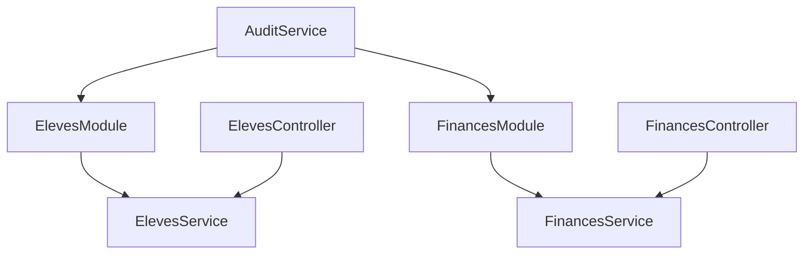

**Diagram sources**
- [eleves.module.ts:1-200](file://backend/src/modules/eleves/eleves.module.ts#L1-L200)
- [finances.module.ts:1-200](file://backend/src/modules/finances/finances.module.ts#L1-L200)
- [audit.service.ts:1-200](file://backend/src/common/services/audit.service.ts#L1-L200)

**Section sources**
- [eleves.module.ts:1-200](file://backend/src/modules/eleves/eleves.module.ts#L1-L200)
- [finances.module.ts:1-200](file://backend/src/modules/finances/finances.module.ts#L1-L200)
- [audit.service.ts:1-200](file://backend/src/common/services/audit.service.ts#L1-L200)

### Event-Driven Communication
- Modules emit domain events (e.g., eleve.created, payment.processed) handled by listeners in other modules.
- Use Nest’s EventEmitter or a custom event bus for decoupled interactions.

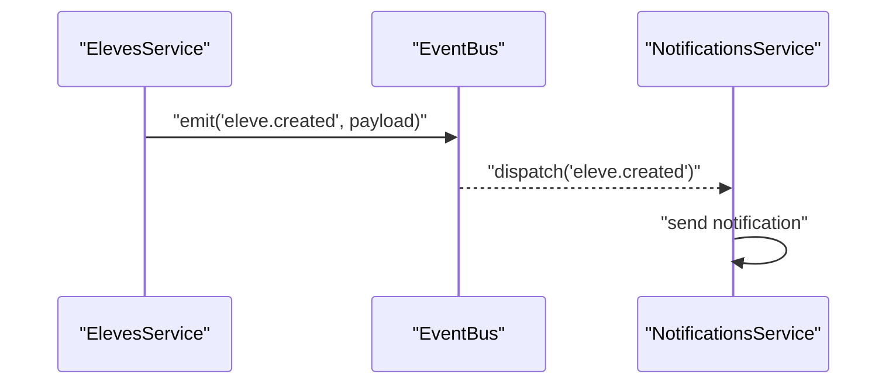

[No sources needed since this diagram shows conceptual workflow, not actual code structure]

## Dependency Analysis
The following diagram highlights key runtime dependencies among core files.

```mermaid
graph TB
Index["src/index.ts"] --> App["src/app.ts"]
App --> ConfigEnv["src/config/env.config.ts"]
App --> ConfigDB["src/config/database.config.ts"]
App --> ConfigSwagger["src/config/swagger.config.ts"]
App --> DataSource["src/database/data-source.ts"]
App --> RouteReg["src/routes/route-registry.ts"]
App --> ElevesMod["modules/eleves/eleves.module.ts"]
App --> PersonnelMod["modules/personnel/personnel.module.ts"]
App --> FinancesMod["modules/finances/finances.module.ts"]
App --> AuthGuard["common/guards/auth.guard.ts"]
App --> RolesGuard["common/guards/roles.guard.ts"]
App --> LoggingIntc["common/interceptors/logging.interceptor.ts"]
App --> TenantMW["common/middlewares/tenant.middleware.ts"]
App --> ExFilter["common/filters/exception.filter.ts"]
App --> PaginationUtil["common/utils/pagination.util.ts"]
App --> AuditSvc["common/services/audit.service.ts"]
```

**Diagram sources**
- [index.ts:1-200](file://backend/src/index.ts#L1-L200)
- [app.ts:1-200](file://backend/src/app.ts#L1-L200)
- [env.config.ts:1-200](file://backend/src/config/env.config.ts#L1-L200)
- [database.config.ts:1-200](file://backend/src/config/database.config.ts#L1-L200)
- [swagger.config.ts:1-200](file://backend/src/config/swagger.config.ts#L1-L200)
- [data-source.ts:1-200](file://backend/src/database/data-source.ts#L1-L200)
- [route-registry.ts:1-200](file://backend/src/routes/route-registry.ts#L1-L200)
- [eleves.module.ts:1-200](file://backend/src/modules/eleves/eleves.module.ts#L1-L200)
- [personnel.module.ts:1-200](file://backend/src/modules/personnel/personnel.module.ts#L1-L200)
- [finances.module.ts:1-200](file://backend/src/modules/finances/finances.module.ts#L1-L200)
- [auth.guard.ts:1-200](file://backend/src/common/guards/auth.guard.ts#L1-L200)
- [roles.guard.ts:1-200](file://backend/src/common/guards/roles.guard.ts#L1-L200)
- [logging.interceptor.ts:1-200](file://backend/src/common/interceptors/logging.interceptor.ts#L1-L200)
- [tenant.middleware.ts:1-200](file://backend/src/common/middlewares/tenant.middleware.ts#L1-L200)
- [exception.filter.ts:1-200](file://backend/src/common/filters/exception.filter.ts#L1-L200)
- [pagination.util.ts:1-200](file://backend/src/common/utils/pagination.util.ts#L1-L200)
- [audit.service.ts:1-200](file://backend/src/common/services/audit.service.ts#L1-L200)

**Section sources**
- [index.ts:1-200](file://backend/src/index.ts#L1-L200)
- [app.ts:1-200](file://backend/src/app.ts#L1-L200)
- [route-registry.ts:1-200](file://backend/src/routes/route-registry.ts#L1-L200)

## Performance Considerations
- Use pagination utilities consistently to avoid large payloads.
- Apply indexes and optimize queries at the repository/entity level.
- Cache frequently accessed read-only data using Redis or in-memory caches.
- Enable compression and tune HTTP server settings.
- Profile critical paths with logging interceptors and metrics collectors.

[No sources needed since this section provides general guidance]

## Troubleshooting Guide
- Authentication failures: Verify token validation in auth guard and ensure tenant context is attached.
- Authorization errors: Check roles guard policies and RBAC mappings.
- Global errors: Inspect exception filter output and logs for stack traces and normalized payloads.
- Tenant isolation issues: Confirm tenant middleware runs early and sets context correctly.
- Pagination anomalies: Validate page/size parameters and offset calculations.

**Section sources**
- [auth.guard.ts:1-200](file://backend/src/common/guards/auth.guard.ts#L1-L200)
- [roles.guard.ts:1-200](file://backend/src/common/guards/roles.guard.ts#L1-L200)
- [exception.filter.ts:1-200](file://backend/src/common/filters/exception.filter.ts#L1-L200)
- [tenant.middleware.ts:1-200](file://backend/src/common/middlewares/tenant.middleware.ts#L1-L200)
- [pagination.util.ts:1-200](file://backend/src/common/utils/pagination.util.ts#L1-L200)

## Conclusion
The eLISAschool backend leverages NestJS’s modular and layered architecture to deliver a scalable, maintainable system. Each business domain is isolated in its own module with clear responsibilities. Shared infrastructure ensures consistent security, logging, error handling, and multi-tenancy. Configuration is centralized, and dependency injection promotes testability and extensibility. Event-driven patterns enable loose coupling between modules, while utilities standardize cross-cutting behaviors like pagination.

[No sources needed since this section summarizes without analyzing specific files]

## Appendices

### Example Module Structure
- eleves:
  - eleves.module.ts
  - controllers/eleves.controller.ts
  - services/eleves.service.ts
  - entities/eleves.entity.ts
- personnel:
  - personnel.module.ts
  - controllers/personnel.controller.ts
  - services/personnel.service.ts
- finances:
  - finances.module.ts
  - controllers/finances.controller.ts
  - services/finances.service.ts

**Section sources**
- [eleves.module.ts:1-200](file://backend/src/modules/eleves/eleves.module.ts#L1-L200)
- [eleves.controller.ts:1-200](file://backend/src/modules/eleves/controllers/eleves.controller.ts#L1-L200)
- [eleves.service.ts:1-200](file://backend/src/modules/eleves/services/eleves.service.ts#L1-L200)
- [eleves.entity.ts:1-200](file://backend/src/modules/eleves/entities/eleves.entity.ts#L1-L200)
- [personnel.module.ts:1-200](file://backend/src/modules/personnel/personnel.module.ts#L1-L200)
- [personnel.controller.ts:1-200](file://backend/src/modules/personnel/controllers/personnel.controller.ts#L1-L200)
- [personnel.service.ts:1-200](file://backend/src/modules/personnel/services/personnel.service.ts#L1-L200)
- [finances.module.ts:1-200](file://backend/src/modules/finances/finances.module.ts#L1-L200)
- [finances.controller.ts:1-200](file://backend/src/modules/finances/controllers/finances.controller.ts#L1-L200)
- [finances.service.ts:1-200](file://backend/src/modules/finances/services/finances.service.ts#L1-L200)

### Example Service Layer Implementation
- Implement use cases in services, call repositories/entities, and emit events for side effects.
- Keep controllers thin by delegating logic to services.

**Section sources**
- [eleves.service.ts:1-200](file://backend/src/modules/eleves/services/eleves.service.ts#L1-L200)
- [personnel.service.ts:1-200](file://backend/src/modules/personnel/services/personnel.service.ts#L1-L200)
- [finances.service.ts:1-200](file://backend/src/modules/finances/services/finances.service.ts#L1-L200)

### Cross-Cutting Concerns Handling
- Security: Guards enforce authentication and authorization.
- Observability: Interceptors log requests/responses and measure latency.
- Multi-tenancy: Middleware injects tenant context.
- Errors: Global filter normalizes error responses.
- Utilities: Pagination and helper functions standardize behavior.

**Section sources**
- [auth.guard.ts:1-200](file://backend/src/common/guards/auth.guard.ts#L1-L200)
- [roles.guard.ts:1-200](file://backend/src/common/guards/roles.guard.ts#L1-L200)
- [logging.interceptor.ts:1-200](file://backend/src/common/interceptors/logging.interceptor.ts#L1-L200)
- [tenant.middleware.ts:1-200](file://backend/src/common/middlewares/tenant.middleware.ts#L1-L200)
- [exception.filter.ts:1-200](file://backend/src/common/filters/exception.filter.ts#L1-L200)
- [pagination.util.ts:1-200](file://backend/src/common/utils/pagination.util.ts#L1-L200)