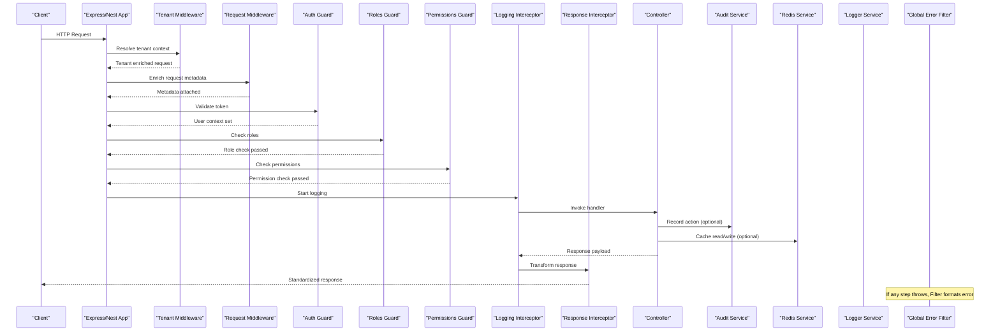
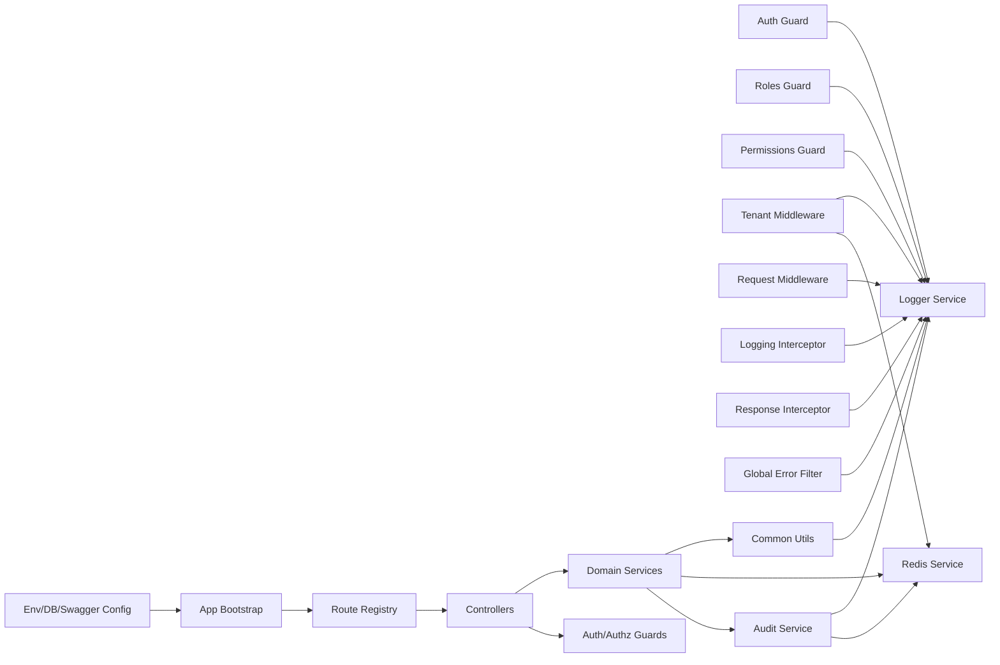

# Common Infrastructure & Cross-Cutting Concerns

<cite>
**Referenced Files in This Document**
- [app.ts](file://backend/src/app.ts)
- [index.ts](file://backend/src/index.ts)
- [route-registry.ts](file://backend/src/routes/route-registry.ts)
- [auth.guard.ts](file://backend/src/modules/auth/guards/auth.guard.ts)
- [roles.guard.ts](file://backend/src/modules/auth/guards/roles.guard.ts)
- [permissions.guard.ts](file://backend/src/modules/auth/guards/permissions.guard.ts)
- [tenant.middleware.ts](file://backend/src/common/middlewares/tenant.middleware.ts)
- [request.middleware.ts](file://backend/src/common/middlewares/request.middleware.ts)
- [logging.interceptor.ts](file://backend/src/common/interceptors/logging.interceptor.ts)
- [response.interceptor.ts](file://backend/src/common/interceptors/response.interceptor.ts)
- [global-error.filter.ts](file://backend/src/common/filters/global-error.filter.ts)
- [pagination.util.ts](file://backend/src/common/utils/pagination.util.ts)
- [validation.util.ts](file://backend/src/common/utils/validation.util.ts)
- [crypto.util.ts](file://backend/src/common/utils/crypto.util.ts)
- [image.util.ts](file://backend/src/common/utils/image.util.ts)
- [audit.service.ts](file://backend/src/modules/audit/services/audit.service.ts)
- [redis.service.ts](file://backend/src/common/services/redis.service.ts)
- [logger.service.ts](file://backend/src/common/services/logger.service.ts)
- [env.config.ts](file://backend/src/config/env.config.ts)
- [database.config.ts](file://backend/src/config/database.config.ts)
- [swagger.config.ts](file://backend/src/config/swagger.config.ts)
- [index.ts](file://backend/src/common/index.ts)
</cite>

## Table of Contents
1. [Introduction](#introduction)
2. [Project Structure](#project-structure)
3. [Core Components](#core-components)
4. [Architecture Overview](#architecture-overview)
5. [Detailed Component Analysis](#detailed-component-analysis)
6. [Dependency Analysis](#dependency-analysis)
7. [Performance Considerations](#performance-considerations)
8. [Troubleshooting Guide](#troubleshooting-guide)
9. [Conclusion](#conclusion)
10. [Appendices](#appendices)

## Introduction
This document explains the common infrastructure and cross-cutting concerns implemented across the backend application. It covers authentication guards, authorization guards, custom interceptors for logging and response transformation, middlewares for tenant resolution and request processing, global error filters, utility functions (pagination, validation, cryptography, image processing), audit trail system, caching with Redis, and logging strategies. It also provides examples and patterns to implement custom guards, interceptors, and middlewares consistently.

## Project Structure
The relevant infrastructure is organized under:
- Authentication and Authorization: modules/auth/guards
- Cross-cutting utilities: common/utils
- Cross-cutting services: common/services
- Global configuration: config
- Application bootstrap and route registration: app.ts, index.ts, routes/route-registry.ts
- Cross-cutting components: common/interceptors, common/middlewares, common/filters

```mermaid
graph TB
subgraph "Bootstrap"
A["index.ts"] --> B["app.ts"]
B --> C["routes/route-registry.ts"]
end
subgraph "Cross-Cutting"
D["common/middlewares/tenant.middleware.ts"]
E["common/middlewares/request.middleware.ts"]
F["common/interceptors/logging.interceptor.ts"]
G["common/interceptors/response.interceptor.ts"]
H["common/filters/global-error.filter.ts"]
end
subgraph "Auth & Authz"
I["modules/auth/guards/auth.guard.ts"]
J["modules/auth/guards/roles.guard.ts"]
K["modules/auth/guards/permissions.guard.ts"]
end
subgraph "Utilities"
L["common/utils/pagination.util.ts"]
M["common/utils/validation.util.ts"]
N["common/utils/crypto.util.ts"]
O["common/utils/image.util.ts"]
end
subgraph "Services"
P["common/services/redis.service.ts"]
Q["common/services/logger.service.ts"]
R["modules/audit/services/audit.service.ts"]
end
subgraph "Config"
S["config/env.config.ts"]
T["config/database.config.ts"]
U["config/swagger.config.ts"]
end
B --> D
B --> E
B --> F
B --> G
B --> H
C --> I
C --> J
C --> K
F --> Q
G --> Q
H --> Q
D --> P
E --> P
R --> P
R --> Q
L --> Q
M --> Q
N --> Q
O --> Q
S --> B
T --> B
U --> B
```

**Diagram sources**
- [index.ts](file://backend/src/index.ts)
- [app.ts](file://backend/src/app.ts)
- [route-registry.ts](file://backend/src/routes/route-registry.ts)
- [tenant.middleware.ts](file://backend/src/common/middlewares/tenant.middleware.ts)
- [request.middleware.ts](file://backend/src/common/middlewares/request.middleware.ts)
- [logging.interceptor.ts](file://backend/src/common/interceptors/logging.interceptor.ts)
- [response.interceptor.ts](file://backend/src/common/interceptors/response.interceptor.ts)
- [global-error.filter.ts](file://backend/src/common/filters/global-error.filter.ts)
- [auth.guard.ts](file://backend/src/modules/auth/guards/auth.guard.ts)
- [roles.guard.ts](file://backend/src/modules/auth/guards/roles.guard.ts)
- [permissions.guard.ts](file://backend/src/modules/auth/guards/permissions.guard.ts)
- [pagination.util.ts](file://backend/src/common/utils/pagination.util.ts)
- [validation.util.ts](file://backend/src/common/utils/validation.util.ts)
- [crypto.util.ts](file://backend/src/common/utils/crypto.util.ts)
- [image.util.ts](file://backend/src/common/utils/image.util.ts)
- [redis.service.ts](file://backend/src/common/services/redis.service.ts)
- [logger.service.ts](file://backend/src/common/services/logger.service.ts)
- [audit.service.ts](file://backend/src/modules/audit/services/audit.service.ts)
- [env.config.ts](file://backend/src/config/env.config.ts)
- [database.config.ts](file://backend/src/config/database.config.ts)
- [swagger.config.ts](file://backend/src/config/swagger.config.ts)

**Section sources**
- [index.ts](file://backend/src/index.ts)
- [app.ts](file://backend/src/app.ts)
- [route-registry.ts](file://backend/src/routes/route-registry.ts)

## Core Components
- Authentication Guard: Validates JWT presence and integrity before allowing access to protected endpoints.
- Authorization Guards: Roles and permissions-based checks applied after authentication.
- Interceptors: Logging around request execution and standardized response transformation.
- Middlewares: Tenant context resolution and request enrichment.
- Global Error Filter: Centralized error handling and consistent error responses.
- Utilities: Pagination helpers, validation helpers, cryptographic operations, and image processing utilities.
- Audit Service: Records user actions and changes for compliance and traceability.
- Redis Service: Provides caching and session-related storage.
- Logger Service: Structured logging with correlation IDs and contextual metadata.

**Section sources**
- [auth.guard.ts](file://backend/src/modules/auth/guards/auth.guard.ts)
- [roles.guard.ts](file://backend/src/modules/auth/guards/roles.guard.ts)
- [permissions.guard.ts](file://backend/src/modules/auth/guards/permissions.guard.ts)
- [logging.interceptor.ts](file://backend/src/common/interceptors/logging.interceptor.ts)
- [response.interceptor.ts](file://backend/src/common/interceptors/response.interceptor.ts)
- [tenant.middleware.ts](file://backend/src/common/middlewares/tenant.middleware.ts)
- [request.middleware.ts](file://backend/src/common/middlewares/request.middleware.ts)
- [global-error.filter.ts](file://backend/src/common/filters/global-error.filter.ts)
- [pagination.util.ts](file://backend/src/common/utils/pagination.util.ts)
- [validation.util.ts](file://backend/src/common/utils/validation.util.ts)
- [crypto.util.ts](file://backend/src/common/utils/crypto.util.ts)
- [image.util.ts](file://backend/src/common/utils/image.util.ts)
- [audit.service.ts](file://backend/src/modules/audit/services/audit.service.ts)
- [redis.service.ts](file://backend/src/common/services/redis.service.ts)
- [logger.service.ts](file://backend/src/common/services/logger.service.ts)

## Architecture Overview
The request lifecycle flows through middlewares, then controllers guarded by auth/authz, intercepted by logging and response transformers, and finally handled by a global error filter. Services such as audit and redis are used within controllers or domain services.

**Diagram sources**
- [tenant.middleware.ts](file://backend/src/common/middlewares/tenant.middleware.ts)
- [request.middleware.ts](file://backend/src/common/middlewares/request.middleware.ts)
- [auth.guard.ts](file://backend/src/modules/auth/guards/auth.guard.ts)
- [roles.guard.ts](file://backend/src/modules/auth/guards/roles.guard.ts)
- [permissions.guard.ts](file://backend/src/modules/auth/guards/permissions.guard.ts)
- [logging.interceptor.ts](file://backend/src/common/interceptors/logging.interceptor.ts)
- [response.interceptor.ts](file://backend/src/common/interceptors/response.interceptor.ts)
- [audit.service.ts](file://backend/src/modules/audit/services/audit.service.ts)
- [redis.service.ts](file://backend/src/common/services/redis.service.ts)
- [logger.service.ts](file://backend/src/common/services/logger.service.ts)
- [global-error.filter.ts](file://backend/src/common/filters/global-error.filter.ts)

## Detailed Component Analysis

### Authentication Guard
Purpose:
- Ensures requests carry a valid token and attaches user context for downstream use.

Key behaviors:
- Token extraction from headers or cookies.
- Signature verification and expiration checks.
- User context injection into the request object.

Usage pattern:
- Apply at controller or method level to protect endpoints.

Example implementation reference:
- [Authentication guard implementation](file://backend/src/modules/auth/guards/auth.guard.ts)

**Section sources**
- [auth.guard.ts](file://backend/src/modules/auth/guards/auth.guard.ts)

### Authorization Guards (Roles and Permissions)
Purpose:
- Enforce role-based and permission-based access control after authentication.

Key behaviors:
- Roles guard validates that the authenticated user has required roles.
- Permissions guard validates fine-grained permissions against the current tenant and user.

Usage pattern:
- Compose multiple guards when both roles and permissions are needed.

Example implementation references:
- [Roles guard implementation](file://backend/src/modules/auth/guards/roles.guard.ts)
- [Permissions guard implementation](file://backend/src/modules/auth/guards/permissions.guard.ts)

**Section sources**
- [roles.guard.ts](file://backend/src/modules/auth/guards/roles.guard.ts)
- [permissions.guard.ts](file://backend/src/modules/auth/guards/permissions.guard.ts)

### Custom Interceptors (Logging and Response Transformation)
Purpose:
- Provide structured logging around request execution and transform responses to a consistent shape.

Key behaviors:
- Logging interceptor captures timing, method, path, correlation ID, and outcome.
- Response interceptor wraps payloads with standard envelope and status codes.

Usage pattern:
- Register globally or per-controller/method.

Example implementation references:
- [Logging interceptor implementation](file://backend/src/common/interceptors/logging.interceptor.ts)
- [Response interceptor implementation](file://backend/src/common/interceptors/response.interceptor.ts)

**Section sources**
- [logging.interceptor.ts](file://backend/src/common/interceptors/logging.interceptor.ts)
- [response.interceptor.ts](file://backend/src/common/interceptors/response.interceptor.ts)

### Middlewares (Tenant Resolution and Request Processing)
Purpose:
- Resolve multi-tenant context and enrich requests with metadata.

Key behaviors:
- Tenant middleware extracts tenant identifier and loads tenant-specific configuration.
- Request middleware adds correlation IDs, timestamps, and normalized headers.

Usage pattern:
- Register early in the pipeline to ensure all downstream logic sees enriched context.

Example implementation references:
- [Tenant middleware implementation](file://backend/src/common/middlewares/tenant.middleware.ts)
- [Request middleware implementation](file://backend/src/common/middlewares/request.middleware.ts)

**Section sources**
- [tenant.middleware.ts](file://backend/src/common/middlewares/tenant.middleware.ts)
- [request.middleware.ts](file://backend/src/common/middlewares/request.middleware.ts)

### Global Error Filter
Purpose:
- Centralize error handling, sanitize sensitive details, and return consistent error responses.

Key behaviors:
- Captures exceptions thrown anywhere in the pipeline.
- Maps known errors to appropriate HTTP status codes.
- Includes correlation ID and timestamp for tracing.

Usage pattern:
- Register globally so it applies to all routes.

Example implementation reference:
- [Global error filter implementation](file://backend/src/common/filters/global-error.filter.ts)

**Section sources**
- [global-error.filter.ts](file://backend/src/common/filters/global-error.filter.ts)

### Utility Functions

#### Pagination
Purpose:
- Simplify building paginated queries and responses.

Key behaviors:
- Normalize page and limit parameters.
- Compute skip/take values safely.
- Build query conditions and total counts.

Usage pattern:
- Use in service layer to construct database queries and format responses.

Example implementation reference:
- [Pagination utilities](file://backend/src/common/utils/pagination.util.ts)

**Section sources**
- [pagination.util.ts](file://backend/src/common/utils/pagination.util.ts)

#### Validation
Purpose:
- Provide reusable validation helpers for DTOs and business rules.

Key behaviors:
- Type-safe validators for common fields.
- Domain-specific rule composition.

Usage pattern:
- Apply before persistence or business processing.

Example implementation reference:
- [Validation utilities](file://backend/src/common/utils/validation.util.ts)

**Section sources**
- [validation.util.ts](file://backend/src/common/utils/validation.util.ts)

#### Cryptography
Purpose:
- Securely hash passwords, generate tokens, and perform symmetric encryption where needed.

Key behaviors:
- Password hashing with salt and cost factor.
- Token generation and verification helpers.
- Optional data encryption/decryption utilities.

Usage pattern:
- Use in authentication flows and sensitive data handling.

Example implementation reference:
- [Cryptography utilities](file://backend/src/common/utils/crypto.util.ts)

**Section sources**
- [crypto.util.ts](file://backend/src/common/utils/crypto.util.ts)

#### Image Processing
Purpose:
- Resize, compress, and convert images for storage and delivery.

Key behaviors:
- Input validation and size limits.
- Format conversion and quality tuning.
- Safe file naming and path sanitization.

Usage pattern:
- Use in upload handlers and asset pipelines.

Example implementation reference:
- [Image utilities](file://backend/src/common/utils/image.util.ts)

**Section sources**
- [image.util.ts](file://backend/src/common/utils/image.util.ts)

### Audit Trail System
Purpose:
- Record user actions and state changes for compliance and debugging.

Key behaviors:
- Captures actor identity, tenant, action type, entity, and diff snapshots.
- Persists audit entries asynchronously to avoid blocking request flow.

Usage pattern:
- Call audit service from controllers or domain services on important mutations.

Example implementation reference:
- [Audit service implementation](file://backend/src/modules/audit/services/audit.service.ts)

**Section sources**
- [audit.service.ts](file://backend/src/modules/audit/services/audit.service.ts)

### Caching Mechanisms with Redis
Purpose:
- Improve performance via caching frequently accessed data and short-lived sessions.

Key behaviors:
- Connection management and health checks.
- Typed get/set with TTL support.
- Cache invalidation helpers.

Usage pattern:
- Wrap expensive reads with cache-first strategy; invalidate on writes.

Example implementation reference:
- [Redis service implementation](file://backend/src/common/services/redis.service.ts)

**Section sources**
- [redis.service.ts](file://backend/src/common/services/redis.service.ts)

### Logging Strategies
Purpose:
- Provide structured, correlated logs across the application.

Key behaviors:
- Correlation ID propagation across requests.
- Contextual metadata (tenant, user, endpoint).
- Log levels and formatting suitable for log aggregation systems.

Usage pattern:
- Inject logger service into services/controllers; use in interceptors and middlewares.

Example implementation reference:
- [Logger service implementation](file://backend/src/common/services/logger.service.ts)

**Section sources**
- [logger.service.ts](file://backend/src/common/services/logger.service.ts)

### Configuration and Bootstrap
Purpose:
- Centralize environment variables, database connectivity, and API documentation setup.

Key behaviors:
- Environment variable loading and validation.
- Database connection initialization.
- Swagger/OpenAPI configuration.

Usage pattern:
- Import during application bootstrap to configure runtime behavior.

Example implementation references:
- [Environment configuration](file://backend/src/config/env.config.ts)
- [Database configuration](file://backend/src/config/database.config.ts)
- [Swagger configuration](file://backend/src/config/swagger.config.ts)
- [Application bootstrap](file://backend/src/app.ts)
- [Server entrypoint](file://backend/src/index.ts)
- [Route registry](file://backend/src/routes/route-registry.ts)

**Section sources**
- [env.config.ts](file://backend/src/config/env.config.ts)
- [database.config.ts](file://backend/src/config/database.config.ts)
- [swagger.config.ts](file://backend/src/config/swagger.config.ts)
- [app.ts](file://backend/src/app.ts)
- [index.ts](file://backend/src/index.ts)
- [route-registry.ts](file://backend/src/routes/route-registry.ts)

## Dependency Analysis
The following diagram shows how core components depend on each other and shared services.

**Diagram sources**
- [auth.guard.ts](file://backend/src/modules/auth/guards/auth.guard.ts)
- [roles.guard.ts](file://backend/src/modules/auth/guards/roles.guard.ts)
- [permissions.guard.ts](file://backend/src/modules/auth/guards/permissions.guard.ts)
- [tenant.middleware.ts](file://backend/src/common/middlewares/tenant.middleware.ts)
- [request.middleware.ts](file://backend/src/common/middlewares/request.middleware.ts)
- [logging.interceptor.ts](file://backend/src/common/interceptors/logging.interceptor.ts)
- [response.interceptor.ts](file://backend/src/common/interceptors/response.interceptor.ts)
- [global-error.filter.ts](file://backend/src/common/filters/global-error.filter.ts)
- [audit.service.ts](file://backend/src/modules/audit/services/audit.service.ts)
- [redis.service.ts](file://backend/src/common/services/redis.service.ts)
- [logger.service.ts](file://backend/src/common/services/logger.service.ts)
- [env.config.ts](file://backend/src/config/env.config.ts)
- [database.config.ts](file://backend/src/config/database.config.ts)
- [swagger.config.ts](file://backend/src/config/swagger.config.ts)
- [app.ts](file://backend/src/app.ts)
- [index.ts](file://backend/src/index.ts)
- [route-registry.ts](file://backend/src/routes/route-registry.ts)

**Section sources**
- [index.ts](file://backend/src/index.ts)
- [app.ts](file://backend/src/app.ts)
- [route-registry.ts](file://backend/src/routes/route-registry.ts)

## Performance Considerations
- Prefer cache-first reads with short TTLs for hot data; invalidate aggressively on writes.
- Keep audit logging asynchronous to avoid impacting latency.
- Avoid heavy image processing in request paths; offload to background jobs when possible.
- Use pagination utilities to prevent large result sets and excessive memory usage.
- Ensure correlation IDs are propagated to reduce log noise and improve tracing.

[No sources needed since this section provides general guidance]

## Troubleshooting Guide
- Authentication failures: Verify token source, secret configuration, and expiration handling.
- Authorization denials: Confirm roles and permissions are correctly assigned per tenant.
- Tenant isolation issues: Ensure tenant context is resolved early and persisted throughout the request.
- Caching anomalies: Check Redis connectivity, TTL settings, and invalidation keys.
- Logging gaps: Confirm correlation IDs are present and logger service is initialized.
- Error responses: Inspect global error filter mapping and ensure sensitive data is not leaked.

**Section sources**
- [global-error.filter.ts](file://backend/src/common/filters/global-error.filter.ts)
- [logger.service.ts](file://backend/src/common/services/logger.service.ts)
- [redis.service.ts](file://backend/src/common/services/redis.service.ts)
- [tenant.middleware.ts](file://backend/src/common/middlewares/tenant.middleware.ts)
- [auth.guard.ts](file://backend/src/modules/auth/guards/auth.guard.ts)
- [roles.guard.ts](file://backend/src/modules/auth/guards/roles.guard.ts)
- [permissions.guard.ts](file://backend/src/modules/auth/guards/permissions.guard.ts)

## Conclusion
The common infrastructure provides a robust foundation for secure, observable, and scalable request handling. By composing guards, interceptors, middlewares, and services consistently, teams can enforce security policies, maintain tenant isolation, and deliver predictable responses while keeping performance and observability in focus.

[No sources needed since this section summarizes without analyzing specific files]

## Appendices

### Examples and Patterns

#### Implementing a Custom Guard
- Create a class implementing the guard interface.
- Extract required context (e.g., headers, params).
- Perform authorization checks using services or utilities.
- Throw standardized errors on denial.

Reference:
- [Custom guard example](file://backend/src/modules/auth/guards/permissions.guard.ts)

**Section sources**
- [permissions.guard.ts](file://backend/src/modules/auth/guards/permissions.guard.ts)

#### Implementing a Custom Interceptor
- Implement the interceptor interface to wrap handler execution.
- Add pre/post hooks for logging or response shaping.
- Return transformed responses consistently.

References:
- [Logging interceptor](file://backend/src/common/interceptors/logging.interceptor.ts)
- [Response interceptor](file://backend/src/common/interceptors/response.interceptor.ts)

**Section sources**
- [logging.interceptor.ts](file://backend/src/common/interceptors/logging.interceptor.ts)
- [response.interceptor.ts](file://backend/src/common/interceptors/response.interceptor.ts)

#### Implementing a Custom Middleware
- Implement middleware function signature compatible with the framework.
- Read and write request/response objects.
- Ensure next() is called to continue the pipeline.

References:
- [Tenant middleware](file://backend/src/common/middlewares/tenant.middleware.ts)
- [Request middleware](file://backend/src/common/middlewares/request.middleware.ts)

**Section sources**
- [tenant.middleware.ts](file://backend/src/common/middlewares/tenant.middleware.ts)
- [request.middleware.ts](file://backend/src/common/middlewares/request.middleware.ts)

#### Using Utilities
- Pagination: build safe skip/take and totals.
- Validation: compose field and domain validators.
- Cryptography: hash secrets and verify tokens.
- Image processing: validate inputs and transform outputs.

References:
- [Pagination utilities](file://backend/src/common/utils/pagination.util.ts)
- [Validation utilities](file://backend/src/common/utils/validation.util.ts)
- [Cryptography utilities](file://backend/src/common/utils/crypto.util.ts)
- [Image utilities](file://backend/src/common/utils/image.util.ts)

**Section sources**
- [pagination.util.ts](file://backend/src/common/utils/pagination.util.ts)
- [validation.util.ts](file://backend/src/common/utils/validation.util.ts)
- [crypto.util.ts](file://backend/src/common/utils/crypto.util.ts)
- [image.util.ts](file://backend/src/common/utils/image.util.ts)

#### Integrating Audit and Caching
- Call audit service on significant mutations.
- Use Redis service for cache reads/writes with appropriate TTLs.

References:
- [Audit service](file://backend/src/modules/audit/services/audit.service.ts)
- [Redis service](file://backend/src/common/services/redis.service.ts)

**Section sources**
- [audit.service.ts](file://backend/src/modules/audit/services/audit.service.ts)
- [redis.service.ts](file://backend/src/common/services/redis.service.ts)

#### Bootstrapping and Registration
- Configure environment, database, and OpenAPI.
- Register middlewares, interceptors, and filters globally.
- Wire up route registry and guards.

References:
- [Environment configuration](file://backend/src/config/env.config.ts)
- [Database configuration](file://backend/src/config/database.config.ts)
- [Swagger configuration](file://backend/src/config/swagger.config.ts)
- [Application bootstrap](file://backend/src/app.ts)
- [Server entrypoint](file://backend/src/index.ts)
- [Route registry](file://backend/src/routes/route-registry.ts)

**Section sources**
- [env.config.ts](file://backend/src/config/env.config.ts)
- [database.config.ts](file://backend/src/config/database.config.ts)
- [swagger.config.ts](file://backend/src/config/swagger.config.ts)
- [app.ts](file://backend/src/app.ts)
- [index.ts](file://backend/src/index.ts)
- [route-registry.ts](file://backend/src/routes/route-registry.ts)