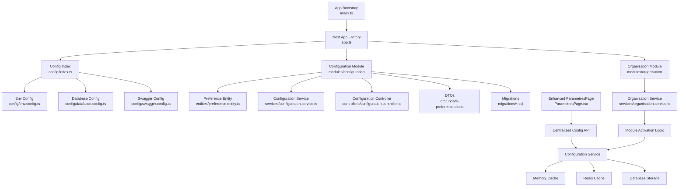
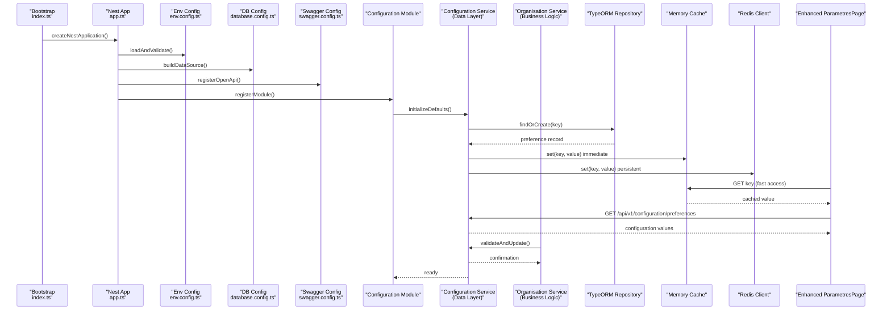
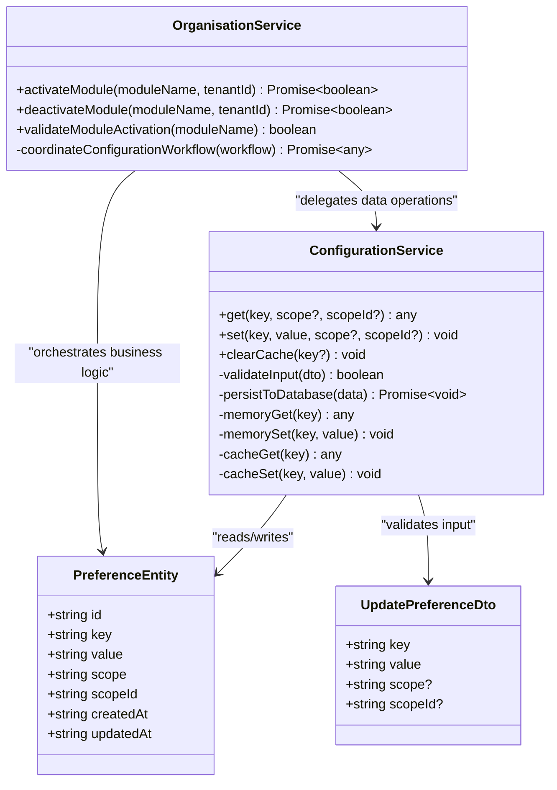
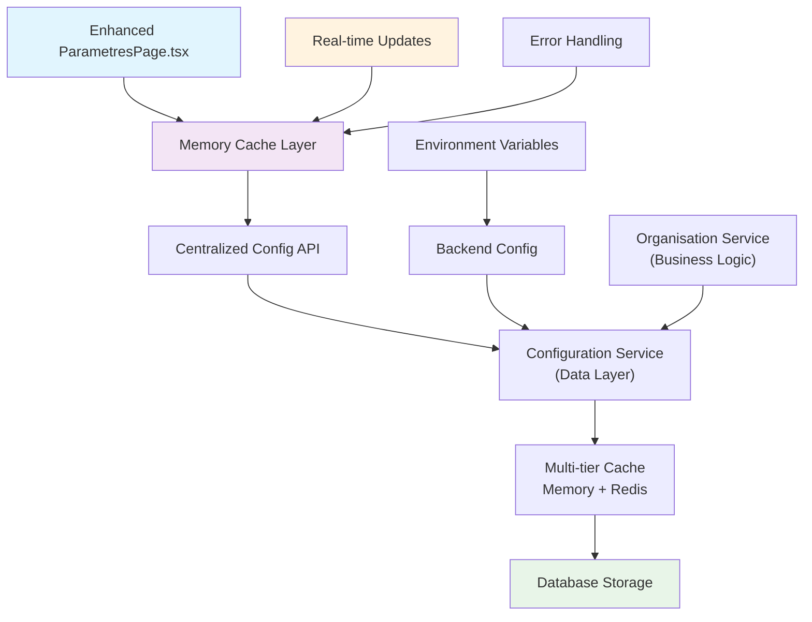
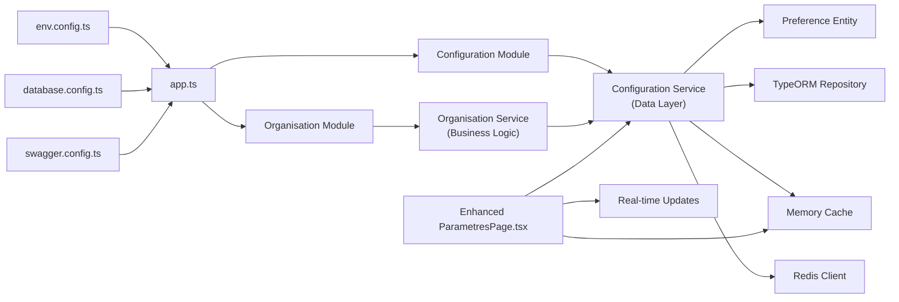

# Configuration & Environment Management

<cite>
**Referenced Files in This Document**
- [backend/src/config/index.ts](file://backend/src/config/index.ts)
- [backend/src/config/database.config.ts](file://backend/src/config/database.config.ts)
- [backend/src/config/env.config.ts](file://backend/src/config/env.config.ts)
- [backend/src/config/swagger.config.ts](file://backend/src/config/swagger.config.ts)
- [backend/src/app.ts](file://backend/src/app.ts)
- [backend/src/index.ts](file://backend/src/index.ts)
- [backend/src/modules/configuration/services/configuration.service.ts](file://backend/src/modules/configuration/services/configuration.service.ts)
- [backend/src/modules/configuration/controllers/configuration.controller.ts](file://backend/src/modules/configuration/controllers/configuration.controller.ts)
- [backend/src/modules/configuration/dto/update-preference.dto.ts](file://backend/src/modules/configuration/dto/update-preference.dto.ts)
- [backend/src/modules/configuration/entities/preference.entity.ts](file://backend/src/modules/configuration/entities/preference.entity.ts)
- [backend/src/modules/organisation/services/organisation.service.ts](file://backend/src/modules/organisation/services/organisation.service.ts)
- [backend/src/modules/configuration/migrations/046-preferences-utilisateur-et-config.sql](file://backend/src/modules/configuration/migrations/046-preferences-utilisateur-et-config.sql)
- [backend/src/modules/configuration/migrations/082-fix-contrainte-unique-preferences.sql](file://backend/src/modules/configuration/migrations/082-fix-contrainte-unique-preferences.sql)
- [backend/src/modules/configuration/migrations/083-fix-contrainte-unique-parametres.sql](file://backend/src/modules/configuration/migrations/083-fix-contrainte-unique-parametres.sql)
- [backend/src/modules/configuration/migrations/107-cleanup-configuration-modules-actif.sql](file://backend/src/modules/configuration/migrations/107-cleanup-configuration-modules-actif.sql)
- [backend/src/modules/configuration/migrations/045-preferences-role.sql](file://backend/src/modules/configuration/migrations/045-preferences-role.sql)
- [backend/src/modules/configuration/migrations/044-preferences-globales.sql](file://backend/src/modules/configuration/migrations/044-preferences-globales.sql)
- [backend/src/modules/configuration/migrations/046-dashboard-config.sql](file://backend/src/modules/configuration/migrations/046-dashboard-config.sql)
- [backend/src/modules/configuration/migrations/046-types-contrat-personnalises.sql](file://backend/src/modules/configuration/migrations/046-types-contrat-personnalises.sql)
- [backend/src/modules/configuration/migrations/080-preferences-utilisateur-multi-tenant.sql](file://backend/src/modules/configuration/migrations/080-preferences-utilisateur-multi-tenant.sql)
- [backend/src/modules/configuration/migrations/081-module-apparence-fonds.sql](file://backend/src/modules/configuration/migrations/081-module-apparence-fonds.sql)
- [backend/src/modules/configuration/migrations/099-add-monitoring-params.sql](file://backend/src/modules/configuration/migrations/099-add-monitoring-params.sql)
- [backend/src/modules/configuration/migrations/100-classes-salle-principale.sql](file://backend/src/modules/configuration/migrations/100-classes-salle-principale.sql)
- [backend/src/modules/configuration/migrations/101-normalisation-annee-scolaire-cloture.sql](file://backend/src/modules/configuration/migrations/101-normalisation-annee-scolaire-cloture.sql)
- [backend/src/modules/configuration/migrations/102-periodes-hierarchie.sql](file://backend/src/modules/configuration/migrations/102-periodes-hierarchie.sql)
- [backend/src/modules/configuration/migrations/103-templates-periode-personnalisables.sql](file://backend/src/modules/configuration/migrations/103-templates-periode-personnalisables.sql)
- [backend/src/modules/configuration/migrations/104-refonte-periodes-niveaux-configurables.sql](file://backend/src/modules/configuration/migrations/104-refonte-periodes-niveaux-configurables.sql)
- [backend/src/modules/configuration/migrations/105-migration-templates-v5.sql](file://backend/src/modules/configuration/migrations/105-migration-templates-v5.sql)
- [backend/src/modules/configuration/migrations/106-rename-sequence-to-evaluation.sql](file://backend/src/modules/configuration/migrations/106-rename-sequence-to-evaluation.sql)
- [backend/src/modules/configuration/migrations/108-refactor-salle-principale.sql](file://backend/src/modules/configuration/migrations/108-refactor-salle-principale.sql)
- [frontend/src/routes/ParametresPage.tsx](file://frontend/src/routes/ParametresPage.tsx)
</cite>

## Update Summary
**Changes Made**
- Updated architecture to reflect major refactoring where centralized Configuration.service.ts has been decomposed into specialized services within the organisation module
- Business logic for module activation/deactivation now delegated to Organisation.service while data validation and persistence remain in configuration module entities and DTOs
- Enhanced documentation to clarify the separation of concerns between configuration data management and business logic orchestration
- Updated service interaction patterns and dependency relationships in architectural diagrams

## Table of Contents
1. [Introduction](#introduction)
2. [Project Structure](#project-structure)
3. [Core Components](#core-components)
4. [Architecture Overview](#architecture-overview)
5. [Detailed Component Analysis](#detailed-component-analysis)
6. [Frontend Integration](#frontend-integration)
7. [Dependency Analysis](#dependency-analysis)
8. [Performance Considerations](#performance-considerations)
9. [Troubleshooting Guide](#troubleshooting-guide)
10. [Conclusion](#conclusion)
11. [Appendices](#appendices)

## Introduction
This document explains the configuration and environment management system used by the application. It covers:
- Environment-specific configuration using TypeORM, database connection settings, Redis configuration, and Swagger API documentation setup
- Dynamic configuration for runtime module activation and preference management with enhanced service decomposition
- Configuration validation, default values handling, and environment variable management
- Frontend integration with centralized configuration management through enhanced ParametresPage component
- Practical examples for adding new configuration options, managing environments (development, staging, production), and accessing configuration values throughout the application

The goal is to provide a clear, progressive guide that helps both developers and operators configure and extend the system safely across environments with improved performance and user experience.

## Project Structure
Configuration-related code is organized under backend/src/config and backend/src/modules/configuration, with business logic delegation to backend/src/modules/organisation. The frontend integrates with the centralized configuration system through the enhanced ParametresPage component which provides unified parameter management with memory-based caching and real-time synchronization.

**Diagram sources**
- [backend/src/index.ts](file://backend/src/index.ts)
- [backend/src/app.ts](file://backend/src/app.ts)
- [backend/src/config/index.ts](file://backend/src/config/index.ts)
- [backend/src/config/env.config.ts](file://backend/src/config/env.config.ts)
- [backend/src/config/database.config.ts](file://backend/src/config/database.config.ts)
- [backend/src/config/swagger.config.ts](file://backend/src/config/swagger.config.ts)
- [backend/src/modules/configuration/entities/preference.entity.ts](file://backend/src/modules/configuration/entities/preference.entity.ts)
- [backend/src/modules/configuration/services/configuration.service.ts](file://backend/src/modules/configuration/services/configuration.service.ts)
- [backend/src/modules/configuration/controllers/configuration.controller.ts](file://backend/src/modules/configuration/controllers/configuration.controller.ts)
- [backend/src/modules/configuration/dto/update-preference.dto.ts](file://backend/src/modules/configuration/dto/update-preference.dto.ts)
- [backend/src/modules/organisation/services/organisation.service.ts](file://backend/src/modules/organisation/services/organisation.service.ts)
- [frontend/src/routes/ParametresPage.tsx](file://frontend/src/routes/ParametresPage.tsx)

**Section sources**
- [backend/src/index.ts](file://backend/src/index.ts)
- [backend/src/app.ts](file://backend/src/app.ts)
- [backend/src/config/index.ts](file://backend/src/config/index.ts)
- [backend/src/config/env.config.ts](file://backend/src/config/env.config.ts)
- [backend/src/config/database.config.ts](file://backend/src/config/database.config.ts)
- [backend/src/config/swagger.config.ts](file://backend/src/config/swagger.config.ts)
- [backend/src/modules/configuration/entities/preference.entity.ts](file://backend/src/modules/configuration/entities/preference.entity.ts)
- [backend/src/modules/configuration/services/configuration.service.ts](file://backend/src/modules/configuration/services/configuration.service.ts)
- [backend/src/modules/configuration/controllers/configuration.controller.ts](file://backend/src/modules/configuration/controllers/configuration.controller.ts)
- [backend/src/modules/configuration/dto/update-preference.dto.ts](file://backend/src/modules/configuration/dto/update-preference.dto.ts)
- [backend/src/modules/organisation/services/organisation.service.ts](file://backend/src/modules/organisation/services/organisation.service.ts)
- [frontend/src/routes/ParametresPage.tsx](file://frontend/src/routes/ParametresPage.tsx)

## Core Components
- Environment variables loader and validator: centralizes required keys, provides typed accessors, and validates presence and types at startup.
- TypeORM configuration: builds a data source with environment-aware connection parameters, logging toggles, and synchronization strategy.
- Redis configuration: defines host, port, password, and optional TLS or namespace settings; validated before use.
- Swagger configuration: sets up OpenAPI metadata, authentication schemes, and UI exposure based on environment flags.
- **Updated** Decomposed configuration service architecture: Configuration.service.ts handles data validation and persistence, while Organisation.service manages business logic for module activation/deactivation operations.
- Preference entity and migrations: schema for global, role-based, and user-level preferences; includes constraints and indexes.
- Enhanced frontend integration layer: provides streamlined access to configuration values through centralized APIs with memory-based caching and real-time updates.

Key responsibilities:
- Startup-time validation and early failure on missing critical env vars
- Centralized access points for configuration values with multi-tier caching
- **Updated** Separated business logic from data persistence: Organisation.service orchestrates module activation workflows while Configuration.service manages data integrity
- Runtime feature toggles and per-tenant/user preferences
- Safe defaults and graceful fallbacks when optional settings are absent
- Consistent frontend-backend configuration synchronization with real-time updates
- Memory-based caching for optimal frontend performance

**Section sources**
- [backend/src/config/env.config.ts](file://backend/src/config/env.config.ts)
- [backend/src/config/database.config.ts](file://backend/src/config/database.config.ts)
- [backend/src/config/swagger.config.ts](file://backend/src/config/swagger.config.ts)
- [backend/src/modules/configuration/services/configuration.service.ts](file://backend/src/modules/configuration/services/configuration.service.ts)
- [backend/src/modules/organisation/services/organisation.service.ts](file://backend/src/modules/organisation/services/organisation.service.ts)
- [backend/src/modules/configuration/entities/preference.entity.ts](file://backend/src/modules/configuration/entities/preference.entity.ts)
- [frontend/src/routes/ParametresPage.tsx](file://frontend/src/routes/ParametresPage.tsx)

## Architecture Overview
The configuration architecture separates concerns between compile-time/static configuration (env, DB, Swagger) and runtime configuration (preferences), with enhanced frontend integration providing streamlined parameter management through centralized APIs and memory-based caching. **Updated** The architecture now features a clear separation between data persistence (Configuration.service) and business logic orchestration (Organisation.service).

**Diagram sources**
- [backend/src/index.ts](file://backend/src/index.ts)
- [backend/src/app.ts](file://backend/src/app.ts)
- [backend/src/config/env.config.ts](file://backend/src/config/env.config.ts)
- [backend/src/config/database.config.ts](file://backend/src/config/database.config.ts)
- [backend/src/config/swagger.config.ts](file://backend/src/config/swagger.config.ts)
- [backend/src/modules/configuration/services/configuration.service.ts](file://backend/src/modules/configuration/services/configuration.service.ts)
- [backend/src/modules/organisation/services/organisation.service.ts](file://backend/src/modules/organisation/services/organisation.service.ts)
- [frontend/src/routes/ParametresPage.tsx](file://frontend/src/routes/ParametresPage.tsx)

## Detailed Component Analysis

### Environment Variables and Validation
- Loads process.env and enforces required keys
- Provides typed getters with coercion and validation
- Supports environment-specific overrides via environment names
- Exposes a single accessor interface for other modules

Typical usage pattern:
- Import the env config once at app bootstrap
- Use typed getters instead of direct process.env access
- Fail fast during startup if critical variables are missing

Best practices:
- Keep secrets out of version control
- Provide sensible defaults for non-sensitive settings
- Validate all inputs early

**Section sources**
- [backend/src/config/env.config.ts](file://backend/src/config/env.config.ts)

### Database Connection Settings (TypeORM)
- Builds a DataSource object with environment-aware settings
- Configures entities, migrations, and synchronization behavior
- Enables query logging only in development
- Uses environment variables for host, port, credentials, and database name

Operational notes:
- In development, allow auto-sync for rapid iteration
- In staging/production, prefer migrations over sync
- Ensure connection pooling and timeouts are tuned for workload

**Section sources**
- [backend/src/config/database.config.ts](file://backend/src/config/database.config.ts)

### Redis Configuration
- Defines host, port, password, and optional TLS or namespace
- Validates presence of required fields before initialization
- Integrates with the configuration service for persistent caching

Operational notes:
- Prefer dedicated Redis instances per environment
- Enable TLS in production
- Set appropriate timeouts and retry policies

**Section sources**
- [backend/src/config/env.config.ts](file://backend/src/config/env.config.ts)

### Swagger API Documentation Setup
- Registers OpenAPI metadata and UI routes
- Adds security schemes (e.g., JWT bearer)
- Toggles UI visibility based on environment flags

Operational notes:
- Disable Swagger UI in production or restrict access
- Keep API descriptions updated alongside changes

**Section sources**
- [backend/src/config/swagger.config.ts](file://backend/src/config/swagger.config.ts)

### **Updated** Decomposed Configuration System Architecture
The configuration system has undergone major architectural refactoring with clear separation of concerns:

**Data Persistence Layer (Configuration.service)**:
- Handles all database operations for preferences and configuration data
- Manages validation, sanitization, and persistence of configuration values
- Maintains multi-tier caching strategy (memory + Redis)
- Provides CRUD operations for preference entities

**Business Logic Layer (Organisation.service)**:
- Orchestrates complex business workflows for module activation/deactivation
- Coordinates multiple configuration operations as part of larger business processes
- Implements business rules and validation logic beyond simple data persistence
- Manages dependencies between different configuration aspects

**Updated** Key architectural improvements:
- Clear separation between data operations and business logic
- Improved maintainability through focused service responsibilities
- Better testability with isolated business logic
- Enhanced scalability with modular service design

Resolution order remains unchanged:
1. User-level preference
2. Role-based preference
3. Global preference
4. Built-in default

**Diagram sources**
- [backend/src/modules/configuration/entities/preference.entity.ts](file://backend/src/modules/configuration/entities/preference.entity.ts)
- [backend/src/modules/configuration/services/configuration.service.ts](file://backend/src/modules/configuration/services/configuration.service.ts)
- [backend/src/modules/organisation/services/organisation.service.ts](file://backend/src/modules/organisation/services/organisation.service.ts)
- [backend/src/modules/configuration/dto/update-preference.dto.ts](file://backend/src/modules/configuration/dto/update-preference.dto.ts)

**Section sources**
- [backend/src/modules/configuration/entities/preference.entity.ts](file://backend/src/modules/configuration/entities/preference.entity.ts)
- [backend/src/modules/configuration/services/configuration.service.ts](file://backend/src/modules/configuration/services/configuration.service.ts)
- [backend/src/modules/organisation/services/organisation.service.ts](file://backend/src/modules/organisation/services/organisation.service.ts)
- [backend/src/modules/configuration/dto/update-preference.dto.ts](file://backend/src/modules/configuration/dto/update-preference.dto.ts)

### Configuration Controller and Endpoints
- Exposes endpoints to read and update preferences
- Enforces authorization and scope checks
- Returns standardized responses and errors
- **Updated** Delegates complex business operations to Organisation.service while handling basic CRUD operations directly

Typical flows:
- GET /api/v1/configuration/preferences?key=...&scope=...&scopeId=...
- PATCH /api/v1/configuration/preferences with DTO body
- **Updated** POST /api/v1/organisation/modules/activate - delegates to Organisation.service for complex workflows

**Section sources**
- [backend/src/modules/configuration/controllers/configuration.controller.ts](file://backend/src/modules/configuration/controllers/configuration.controller.ts)

### Data Model and Migrations
The preference model evolved through several migrations to support multi-tenant scoping, constraints, and performance. Key milestones include:
- Initial global preferences table creation
- Role-based preferences
- User-level preferences and multi-tenant scoping
- Unique constraint fixes and cleanup
- Feature-specific additions (dashboard, monitoring, etc.)

Important migration references:
- Global preferences introduction
- Role-based preferences
- User-level and multi-tenant scoping
- Constraint corrections and cleanup
- Feature-specific configuration tables and columns

**Section sources**
- [backend/src/modules/configuration/migrations/044-preferences-globales.sql](file://backend/src/modules/configuration/migrations/044-preferences-globales.sql)
- [backend/src/modules/configuration/migrations/045-preferences-role.sql](file://backend/src/modules/configuration/migrations/045-preferences-role.sql)
- [backend/src/modules/configuration/migrations/046-preferences-utilisateur-et-config.sql](file://backend/src/modules/configuration/migrations/046-preferences-utilisateur-et-config.sql)
- [backend/src/modules/configuration/migrations/080-preferences-utilisateur-multi-tenant.sql](file://backend/src/modules/configuration/migrations/080-preferences-utilisateur-multi-tenant.sql)
- [backend/src/modules/configuration/migrations/082-fix-contrainte-unique-preferences.sql](file://backend/src/modules/configuration/migrations/082-fix-contrainte-unique-preferences.sql)
- [backend/src/modules/configuration/migrations/083-fix-contrainte-unique-parametres.sql](file://backend/src/modules/configuration/migrations/083-fix-contrainte-unique-parametres.sql)
- [backend/src/modules/configuration/migrations/107-cleanup-configuration-modules-actif.sql](file://backend/src/modules/configuration/migrations/107-cleanup-configuration-modules-actif.sql)
- [backend/src/modules/configuration/migrations/046-dashboard-config.sql](file://backend/src/modules/configuration/migrations/046-dashboard-config.sql)
- [backend/src/modules/configuration/migrations/099-add-monitoring-params.sql](file://backend/src/modules/configuration/migrations/099-add-monitoring-params.sql)

## Frontend Integration

### Enhanced Centralized Configuration Management
The frontend has been significantly enhanced with streamlined configuration handling through the ParametresPage component, which provides a unified interface for managing application parameters with memory-based caching and real-time updates.

**Updated** Enhanced frontend integration with centralized configuration management improvements including memory-based caching, real-time synchronization, and improved error handling.

Key improvements:
- Streamlined configuration access patterns replacing fragmented approach across multiple tabs
- Memory-based caching for optimal frontend performance with instant parameter access
- Real-time updates synchronized across the application without page refreshes
- Unified parameter management interface through enhanced ParametresPage
- Improved error handling and fallback mechanisms for robust operation
- Better project memory initialization for faster startup times

Frontend configuration flow:
1. ParametresPage initializes with memory-based cache for immediate access
2. Configuration values are loaded from centralized API and stored in memory
3. Real-time updates are synchronized across all components automatically
4. Error states are handled gracefully with fallback values and retry mechanisms
5. Changes persist to backend while maintaining local cache consistency

**Diagram sources**
- [frontend/src/routes/ParametresPage.tsx](file://frontend/src/routes/ParametresPage.tsx)
- [backend/src/modules/configuration/services/configuration.service.ts](file://backend/src/modules/configuration/services/configuration.service.ts)
- [backend/src/modules/organisation/services/organisation.service.ts](file://backend/src/modules/organisation/services/organisation.service.ts)

**Section sources**
- [frontend/src/routes/ParametresPage.tsx](file://frontend/src/routes/ParametresPage.tsx)
- [backend/src/modules/configuration/services/configuration.service.ts](file://backend/src/modules/configuration/services/configuration.service.ts)
- [backend/src/modules/organisation/services/organisation.service.ts](file://backend/src/modules/organisation/services/organisation.service.ts)

## Dependency Analysis
Configuration dependencies flow from bootstrap to modules and services, with enhanced frontend integration providing streamlined parameter management through memory-based caching and real-time synchronization. **Updated** Dependencies now clearly separate data layer from business logic layer.

**Diagram sources**
- [backend/src/config/env.config.ts](file://backend/src/config/env.config.ts)
- [backend/src/config/database.config.ts](file://backend/src/config/database.config.ts)
- [backend/src/config/swagger.config.ts](file://backend/src/config/swagger.config.ts)
- [backend/src/app.ts](file://backend/src/app.ts)
- [backend/src/modules/configuration/services/configuration.service.ts](file://backend/src/modules/configuration/services/configuration.service.ts)
- [backend/src/modules/organisation/services/organisation.service.ts](file://backend/src/modules/organisation/services/organisation.service.ts)
- [backend/src/modules/configuration/entities/preference.entity.ts](file://backend/src/modules/configuration/entities/preference.entity.ts)
- [frontend/src/routes/ParametresPage.tsx](file://frontend/src/routes/ParametresPage.tsx)

**Section sources**
- [backend/src/config/env.config.ts](file://backend/src/config/env.config.ts)
- [backend/src/config/database.config.ts](file://backend/src/config/database.config.ts)
- [backend/src/config/swagger.config.ts](file://backend/src/config/swagger.config.ts)
- [backend/src/app.ts](file://backend/src/app.ts)
- [backend/src/modules/configuration/services/configuration.service.ts](file://backend/src/modules/configuration/services/configuration.service.ts)
- [backend/src/modules/organisation/services/organisation.service.ts](file://backend/src/modules/organisation/services/organisation.service.ts)
- [backend/src/modules/configuration/entities/preference.entity.ts](file://backend/src/modules/configuration/entities/preference.entity.ts)
- [frontend/src/routes/ParametresPage.tsx](file://frontend/src/routes/ParametresPage.tsx)

## Performance Considerations
- Prefer migrations over auto-sync in non-development environments
- Utilize multi-tier caching strategy: memory cache for immediate access, Redis for persistence
- Cache frequently accessed preferences with appropriate TTLs and invalidation strategies
- Scope queries efficiently using indexes on scope and scopeId
- Avoid excessive preference lookups in hot paths; batch where possible
- Monitor database connections and Redis latency; tune pool sizes accordingly
- Leverage memory-based caching in frontend for optimal parameter access performance
- Implement proper error boundaries and fallback mechanisms for configuration loading
- Optimize real-time update mechanisms to minimize network overhead
- Use efficient cache invalidation strategies to maintain data consistency
- **Updated** Separate business logic from data operations to improve service responsiveness and testability

## Troubleshooting Guide
Common issues and resolutions:
- Missing environment variables: ensure all required keys are present; check startup logs for validation failures
- Database connectivity problems: verify host, port, credentials, and network reachability; confirm migrations applied
- Redis connection errors: validate host/port/password/TLS settings; check firewall rules
- Swagger not available: confirm environment flag and route registration
- Preference resolution unexpected: verify scope and scopeId; check precedence order and cache state
- Frontend configuration loading issues: check API connectivity, memory cache initialization, and real-time update mechanisms
- Parameter synchronization problems: verify real-time update mechanisms, cache invalidation, and memory consistency
- Memory cache inconsistencies: implement proper cache warming and validation strategies
- Real-time update failures: check WebSocket connections and fallback mechanisms
- **Updated** Service communication issues: verify Configuration.service and Organisation.service interactions and error propagation

Operational tips:
- Log configuration loading and validation results with detailed error context
- Add health checks for DB, Redis, and memory cache status
- Provide admin endpoints to inspect current configuration state and cache metrics
- Monitor frontend-backend configuration synchronization and cache hit rates
- Implement comprehensive error tracking for configuration-related issues
- Set up alerts for cache miss rates and real-time update failures
- **Updated** Monitor inter-service communication metrics between Configuration.service and Organisation.service

**Section sources**
- [backend/src/config/env.config.ts](file://backend/src/config/env.config.ts)
- [backend/src/config/database.config.ts](file://backend/src/config/database.config.ts)
- [backend/src/config/swagger.config.ts](file://backend/src/config/swagger.config.ts)
- [backend/src/modules/configuration/services/configuration.service.ts](file://backend/src/modules/configuration/services/configuration.service.ts)
- [backend/src/modules/organisation/services/organisation.service.ts](file://backend/src/modules/organisation/services/organisation.service.ts)
- [frontend/src/routes/ParametresPage.tsx](file://frontend/src/routes/ParametresPage.tsx)

## Conclusion
The configuration system combines robust environment validation, TypeORM-based persistence, multi-tier caching (memory + Redis), and a flexible preference model to support dynamic feature activation and multi-tenant customization. With the recent architectural refactoring that separates data persistence (Configuration.service) from business logic orchestration (Organisation.service), teams can now maintain consistent configuration across both backend and frontend components while ensuring high availability, optimal performance, and seamless user experience. The decomposed architecture provides better maintainability, testability, and scalability for future enhancements.

## Appendices

### Adding a New Configuration Option
Steps:
- Define the option in environment variables if it is static (host, port, flags)
- If dynamic, add a new preference key and default value in the configuration service
- Create or update migrations if the schema requires changes
- Expose an endpoint in the configuration controller if external updates are needed
- For complex business logic, delegate to Organisation.service rather than implementing in Configuration.service
- Update frontend ParametresPage to handle the new configuration option with memory caching
- Document the option and its precedence rules

Examples:
- Static option: add a new env var and getter in env config
- Simple dynamic option: add a new key in the preference store with a default and cache entry
- Complex business workflow: implement in Organisation.service and delegate data operations to Configuration.service
- Frontend integration: update ParametresPage to display and manage the new option with real-time updates

**Section sources**
- [backend/src/config/env.config.ts](file://backend/src/config/env.config.ts)
- [backend/src/modules/configuration/services/configuration.service.ts](file://backend/src/modules/configuration/services/configuration.service.ts)
- [backend/src/modules/organisation/services/organisation.service.ts](file://backend/src/modules/organisation/services/organisation.service.ts)
- [backend/src/modules/configuration/controllers/configuration.controller.ts](file://backend/src/modules/configuration/controllers/configuration.controller.ts)
- [frontend/src/routes/ParametresPage.tsx](file://frontend/src/routes/ParametresPage.tsx)

### Managing Different Environments
- Development: enable verbose logging, auto-sync, and Swagger UI
- Staging: disable auto-sync, enable limited Swagger access, enable detailed metrics
- Production: enforce strict validation, disable Swagger UI, optimize DB and Redis settings

Environment-specific files or variables should be managed outside the repository and injected at runtime.

**Section sources**
- [backend/src/config/database.config.ts](file://backend/src/config/database.config.ts)
- [backend/src/config/swagger.config.ts](file://backend/src/config/swagger.config.ts)
- [backend/src/config/env.config.ts](file://backend/src/config/env.config.ts)

### Accessing Configuration Values Throughout the Application
- For static settings: import the env config and use typed getters
- For simple dynamic settings: inject the configuration service and call get/set methods with appropriate scope and scopeId
- For complex business workflows: use Organisation.service which coordinates multiple configuration operations
- For frontend access: use the centralized configuration API through enhanced ParametresPage with memory caching
- Always handle missing or invalid values gracefully with fallbacks
- Leverage real-time updates for dynamic configuration changes

**Section sources**
- [backend/src/config/env.config.ts](file://backend/src/config/env.config.ts)
- [backend/src/modules/configuration/services/configuration.service.ts](file://backend/src/modules/configuration/services/configuration.service.ts)
- [backend/src/modules/organisation/services/organisation.service.ts](file://backend/src/modules/organisation/services/organisation.service.ts)
- [frontend/src/routes/ParametresPage.tsx](file://frontend/src/routes/ParametresPage.tsx)