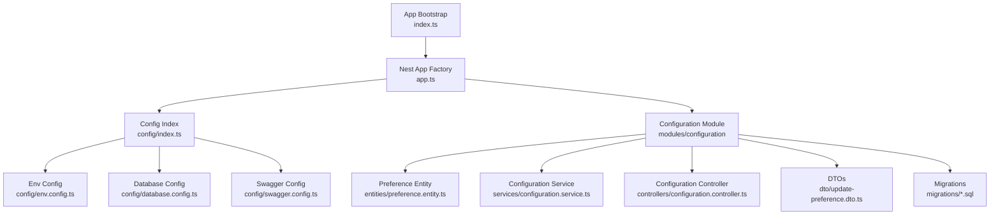
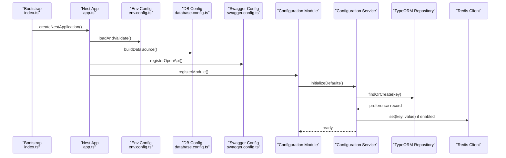
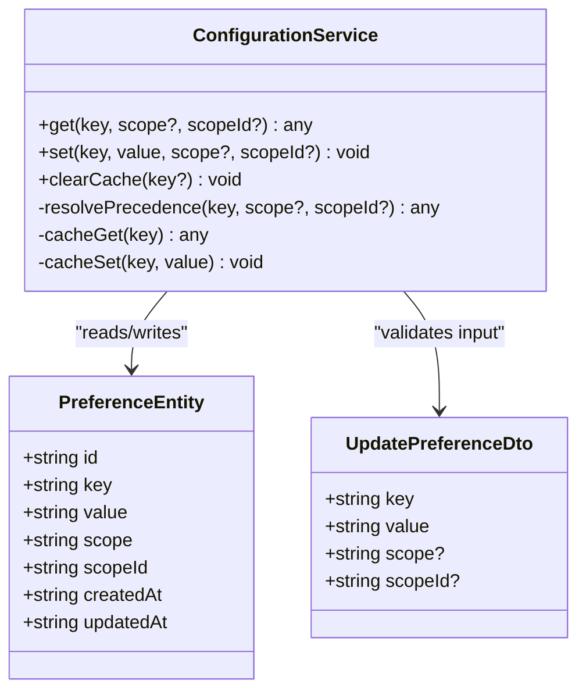
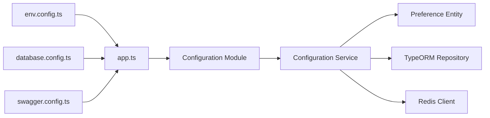

# Configuration & Environment Management

<cite>
**Referenced Files in This Document**
- [backend/src/config/index.ts](file://backend/src/config/index.ts)
- [backend/src/config/database.config.ts](file://backend/src/config/database.config.ts)
- [backend/src/config/env.config.ts](file://backend/src/config/env.config.ts)
- [backend/src/config/swagger.config.ts](file://backend/src/config/swagger.config.ts)
- [backend/src/app.ts](file://backend/src/app.ts)
- [backend/src/index.ts](file://backend/src/index.ts)
- [backend/src/modules/configuration/services/configuration.service.ts](file://backend/src/modules/configuration/services/configuration.service.ts)
- [backend/src/modules/configuration/controllers/configuration.controller.ts](file://backend/src/modules/configuration/controllers/configuration.controller.ts)
- [backend/src/modules/configuration/dto/update-preference.dto.ts](file://backend/src/modules/configuration/dto/update-preference.dto.ts)
- [backend/src/modules/configuration/entities/preference.entity.ts](file://backend/src/modules/configuration/entities/preference.entity.ts)
- [backend/src/modules/configuration/migrations/046-preferences-utilisateur-et-config.sql](file://backend/src/modules/configuration/migrations/046-preferences-utilisateur-et-config.sql)
- [backend/src/modules/configuration/migrations/082-fix-contrainte-unique-preferences.sql](file://backend/src/modules/configuration/migrations/082-fix-contrainte-unique-preferences.sql)
- [backend/src/modules/configuration/migrations/083-fix-contrainte-unique-parametres.sql](file://backend/src/modules/configuration/migrations/083-fix-contrainte-unique-parametres.sql)
- [backend/src/modules/configuration/migrations/107-cleanup-configuration-modules-actif.sql](file://backend/src/modules/configuration/migrations/107-cleanup-configuration-modules-actif.sql)
- [backend/src/modules/configuration/migrations/045-preferences-role.sql](file://backend/src/modules/configuration/migrations/045-preferences-role.sql)
- [backend/src/modules/configuration/migrations/044-preferences-globales.sql](file://backend/src/modules/configuration/migrations/044-preferences-globales.sql)
- [backend/src/modules/configuration/migrations/046-dashboard-config.sql](file://backend/src/modules/configuration/migrations/046-dashboard-config.sql)
- [backend/src/modules/configuration/migrations/046-types-contrat-personnalises.sql](file://backend/src/modules/configuration/migrations/046-types-contrat-personnalises.sql)
- [backend/src/modules/configuration/migrations/080-preferences-utilisateur-multi-tenant.sql](file://backend/src/modules/configuration/migrations/080-preferences-utilisateur-multi-tenant.sql)
- [backend/src/modules/configuration/migrations/081-module-apparence-fonds.sql](file://backend/src/modules/configuration/migrations/081-module-apparence-fonds.sql)
- [backend/src/modules/configuration/migrations/099-add-monitoring-params.sql](file://backend/src/modules/configuration/migrations/099-add-monitoring-params.sql)
- [backend/src/modules/configuration/migrations/100-classes-salle-principale.sql](file://backend/src/modules/configuration/migrations/100-classes-salle-principale.sql)
- [backend/src/modules/configuration/migrations/101-normalisation-annee-scolaire-cloture.sql](file://backend/src/modules/configuration/migrations/101-normalisation-annee-scolaire-cloture.sql)
- [backend/src/modules/configuration/migrations/102-periodes-hierarchie.sql](file://backend/src/modules/configuration/migrations/102-periodes-hierarchie.sql)
- [backend/src/modules/configuration/migrations/103-templates-periode-personnalisables.sql](file://backend/src/modules/configuration/migrations/103-templates-periode-personnalisables.sql)
- [backend/src/modules/configuration/migrations/104-refonte-periodes-niveaux-configurables.sql](file://backend/src/modules/configuration/migrations/104-refonte-periodes-niveaux-configurables.sql)
- [backend/src/modules/configuration/migrations/105-migration-templates-v5.sql](file://backend/src/modules/configuration/migrations/105-migration-templates-v5.sql)
- [backend/src/modules/configuration/migrations/106-rename-sequence-to-evaluation.sql](file://backend/src/modules/configuration/migrations/106-rename-sequence-to-evaluation.sql)
- [backend/src/modules/configuration/migrations/108-refactor-salle-principale.sql](file://backend/src/modules/configuration/migrations/108-refactor-salle-principale.sql)
- [backend/src/modules/configuration/migrations/041-module-annonces-complete.sql](file://backend/src/modules/configuration/migrations/041-module-annonces-complete.sql)
- [backend/src/modules/configuration/migrations/041-module-annonces-fix.sql](file://backend/src/modules/configuration/migrations/041-module-annonces-fix.sql)
- [backend/src/modules/configuration/migrations/041-module-sondages.sql](file://backend/src/modules/configuration/migrations/041-module-sondages.sql)
- [backend/src/modules/configuration/migrations/042-annonces-performance-optimization.sql](file://backend/src/modules/configuration/migrations/042-annonces-performance-optimization.sql)
- [backend/src/modules/configuration/migrations/043-correction-dossier-medical-fk.ts](file://backend/src/modules/configuration/migrations/043-correction-dossier-medical-fk.ts)
- [backend/src/modules/configuration/migrations/043-module-messagerie-complete.sql](file://backend/src/modules/configuration/migrations/043-module-messagerie-complete.sql)
- [backend/src/modules/configuration/migrations/043-permissions-critiques-manquantes.sql](file://backend/src/modules/configuration/migrations/043-permissions-critiques-manquantes.sql)
- [backend/src/modules/configuration/migrations/043-structure-academique-v4.sql](file://backend/src/modules/configuration/migrations/043-structure-academique-v4.sql)
- [backend/src/modules/configuration/migrations/044-messagerie-optimisations-v2.1.sql](file://backend/src/modules/configuration/migrations/044-messagerie-optimisations-v2.1.sql)
- [backend/src/modules/configuration/migrations/044-module-organisation.sql](file://backend/src/modules/configuration/migrations/044-module-organisation.sql)
- [backend/src/modules/configuration/migrations/045-messagerie-fonctionnalites-avancees-v2.2.sql](file://backend/src/modules/configuration/migrations/045-messagerie-fonctionnalites-avancees-v2.2.sql)
- [backend/src/modules/configuration/migrations/045-module-recrutement.sql](file://backend/src/modules/configuration/migrations/045-module-recrutement.sql)
- [backend/src/modules/configuration/migrations/045-organisation-optimisations.sql](file://backend/src/modules/configuration/migrations/045-organisation-optimisations.sql)
- [backend/src/modules/configuration/migrations/046-preferences-utilisateur-et-config.sql](file://backend/src/modules/configuration/migrations/046-preferences-utilisateur-et-config.sql)
- [backend/src/modules/configuration/migrations/047-notifications-ameliorations.sql](file://backend/src/modules/configuration/migrations/047-notifications-ameliorations.sql)
- [backend/src/modules/configuration/migrations/047-optimisations-performance-v3.1.sql](file://backend/src/modules/configuration/migrations/047-optimisations-performance-v3.1.sql)
- [backend/src/modules/configuration/migrations/048-notifications-performance-optimizations.sql](file://backend/src/modules/configuration/migrations/048-notifications-performance-optimizations.sql)
- [backend/src/modules/configuration/migrations/049-ameliorations-inscription-finances.sql](file://backend/src/modules/configuration/migrations/049-ameliorations-inscription-finances.sql)
- [backend/src/modules/configuration/migrations/050-ameliorations-inscription-relances.sql](file://backend/src/modules/configuration/migrations/050-ameliorations-inscription-relances.sql)
- [backend/src/modules/configuration/migrations/050-etablissements-couleurs.sql](file://backend/src/modules/configuration/migrations/050-etablissements-couleurs.sql)
- [backend/src/modules/configuration/migrations/050-multi-tenant-v3-max-etablissements.sql](file://backend/src/modules/configuration/migrations/050-multi-tenant-v3-max-etablissements.sql)
- [backend/src/modules/configuration/migrations/050-suppression-utilisateur-etablissementId.sql](file://backend/src/modules/configuration/migrations/050-suppression-utilisateur-etablissementId.sql)
- [backend/src/modules/configuration/migrations/051-champs-preinscription-enrichis.sql](file://backend/src/modules/configuration/migrations/051-champs-preinscription-enrichis.sql)
- [backend/src/modules/configuration/migrations/052-approche-hybride-parents.sql](file://backend/src/modules/configuration/migrations/052-approche-hybride-parents.sql)
- [backend/src/modules/configuration/migrations/053-structure-academique-complete.sql](file://backend/src/modules/configuration/migrations/053-structure-academique-complete.sql)
- [backend/src/modules/configuration/migrations/054-refonte-structure-academique-v2.sql](file://backend/src/modules/configuration/migrations/054-refonte-structure-academique-v2.sql)
- [backend/src/modules/configuration/migrations/054-structure-academique-complete-fr-en.sql](file://backend/src/modules/configuration/migrations/054-structure-academique-complete-fr-en.sql)
- [backend/src/modules/configuration/migrations/055-structure-academique-ameliorations.sql](file://backend/src/modules/configuration/migrations/055-structure-academique-ameliorations.sql)
- [backend/src/modules/configuration/migrations/056-refactor-note-enseignant-membre-personnel.sql](file://backend/src/modules/configuration/migrations/056-refactor-note-enseignant-membre-personnel.sql)
- [backend/src/modules/configuration/migrations/056-suppression-cycle-scolaire.sql](file://backend/src/modules/configuration/migrations/056-suppression-cycle-scolaire.sql)
- [backend/src/modules/configuration/migrations/057-supprimer-niveau-filiere-id.sql](file://backend/src/modules/configuration/migrations/057-supprimer-niveau-filiere-id.sql)
- [backend/src/modules/configuration/migrations/057-supprimer-parametres-dupliques-etablissement.sql](file://backend/src/modules/configuration/migrations/057-supprimer-parametres-dupliques-etablissement.sql)
- [backend/src/modules/configuration/migrations/058-multi-tenant-structure-academique.sql](file://backend/src/modules/configuration/migrations/058-multi-tenant-structure-academique.sql)
- [backend/src/modules/configuration/migrations/058-unifier-periode-cloturee-statut.sql](file://backend/src/modules/configuration/migrations/058-unifier-periode-cloturee-statut.sql)
- [backend/src/modules/configuration/migrations/059-ajouter-matiere-sous-systeme.sql](file://backend/src/modules/configuration/migrations/059-ajouter-matiere-sous-systeme.sql)
- [backend/src/modules/configuration/migrations/059-multi-tenant-matiere.sql](file://backend/src/modules/configuration/migrations/059-multi-tenant-matiere.sql)
- [backend/src/modules/configuration/migrations/060-ajouter-affectation-matiere-coefficient.sql](file://backend/src/modules/configuration/migrations/060-ajouter-affectation-matiere-coefficient.sql)
- [backend/src/modules/configuration/migrations/061-creer-table-bulletins-matieres.sql](file://backend/src/modules/configuration/migrations/061-creer-table-bulletins-matieres.sql)
- [backend/src/modules/configuration/migrations/062-creer-table-evaluations-competences.sql](file://backend/src/modules/configuration/migrations/062-creer-table-evaluations-competences.sql)
- [backend/src/modules/configuration/migrations/063-creer-module-emploi-du-temps.sql](file://backend/src/modules/configuration/migrations/063-creer-module-emploi-du-temps.sql)
- [backend/src/modules/configuration/migrations/064-validateur-sous-systeme.sql](file://backend/src/modules/configuration/migrations/064-validateur-sous-systeme.sql)
- [backend/src/modules/configuration/migrations/065-creer-templates-emploi-du-temps.sql](file://backend/src/modules/configuration/migrations/065-creer-templates-emploi-du-temps.sql)
- [backend/src/modules/configuration/migrations/069-fix-super-admin-permissions.sql](file://backend/src/modules/configuration/migrations/069-fix-super-admin-permissions.sql)
- [backend/src/modules/configuration/migrations/070-fix-super-admin-all-permission.sql](file://backend/src/modules/configuration/migrations/070-fix-super-admin-all-permission.sql)
- [backend/src/modules/configuration/migrations/070-module-salles.sql](file://backend/src/modules/configuration/migrations/070-module-salles.sql)
- [backend/src/modules/configuration/migrations/072-scoping-cycles-niveaux.sql](file://backend/src/modules/configuration/migrations/072-scoping-cycles-niveaux.sql)
- [backend/src/modules/configuration/migrations/073-competence-unique-composite.sql](file://backend/src/modules/configuration/migrations/073-competence-unique-composite.sql)
- [backend/src/modules/configuration/migrations/074-matiere-niveau-unique-composite.sql](file://backend/src/modules/configuration/migrations/074-matiere-niveau-unique-composite.sql)
- [backend/src/modules/configuration/migrations/075-module-groupes-etablissements.sql](file://backend/src/modules/configuration/migrations/075-module-groupes-etablissements.sql)
- [backend/src/modules/configuration/migrations/076-permissions-groupes-etablissements.sql](file://backend/src/modules/configuration/migrations/076-permissions-groupes-etablissements.sql)
- [backend/src/modules/configuration/migrations/077-update-permissions-groupes.sql](file://backend/src/modules/configuration/migrations/077-update-permissions-groupes.sql)
- [backend/src/modules/configuration/migrations/078-utilisateur-test-groupes.sql](file://backend/src/modules/configuration/migrations/078-utilisateur-test-groupes.sql)
- [backend/src/modules/configuration/migrations/079-add-roleId-utilisateur-etablissements.sql](file://backend/src/modules/configuration/migrations/079-add-roleId-utilisateur-etablissements.sql)
- [backend/src/modules/configuration/migrations/079-correction-permissions-groupes.sql](file://backend/src/modules/configuration/migrations/079-correction-permissions-groupes.sql)
- [backend/src/modules/configuration/migrations/080-preferences-utilisateur-multi-tenant.sql](file://backend/src/modules/configuration/migrations/080-preferences-utilisateur-multi-tenant.sql)
- [backend/src/modules/configuration/migrations/081-module-apparence-fonds.sql](file://backend/src/modules/configuration/migrations/081-module-apparence-fonds.sql)
- [backend/src/modules/configuration/migrations/082-fix-contrainte-unique-preferences.sql](file://backend/src/modules/configuration/migrations/082-fix-contrainte-unique-preferences.sql)
- [backend/src/modules/configuration/migrations/083-fix-contrainte-unique-parametres.sql](file://backend/src/modules/configuration/migrations/083-fix-contrainte-unique-parametres.sql)
- [backend/src/modules/configuration/migrations/084-cleanup-classe-id-notes.sql](file://backend/src/modules/configuration/migrations/084-cleanup-classe-id-notes.sql)
- [backend/src/modules/configuration/migrations/085-periode-etablissement-id.sql](file://backend/src/modules/configuration/migrations/085-periode-etablissement-id.sql)
- [backend/src/modules/configuration/migrations/086-affectation-matiere-etablissement-id.sql](file://backend/src/modules/configuration/migrations/086-affectation-matiere-etablissement-id.sql)
- [backend/src/modules/configuration/migrations/087-affectation-matiere-verifications.sql](file://backend/src/modules/configuration/migrations/087-affectation-matiere-verifications.sql)
- [backend/src/modules/configuration/migrations/088-refactorisation-architecture-academique.sql](file://backend/src/modules/configuration/migrations/088-refactorisation-architecture-academique.sql)
- [backend/src/modules/configuration/migrations/089-finalisation-architecture-academique-v2.sql](file://backend/src/modules/configuration/migrations/089-finalisation-architecture-academique-v2.sql)
- [backend/src/modules/configuration/migrations/090-correction-migration-088-camelcase.sql](file://backend/src/modules/configuration/migrations/090-correction-migration-088-camelcase.sql)
- [backend/src/modules/configuration/migrations/091-peuplement-architecture-academique.sql](file://backend/src/modules/configuration/migrations/091-peuplement-architecture-academique.sql)
- [backend/src/modules/configuration/migrations/092-refactorisation-classeAnneeId.sql](file://backend/src/modules/configuration/migrations/092-refactorisation-classeAnneeId.sql)
- [backend/src/modules/configuration/migrations/099-add-monitoring-params.sql](file://backend/src/modules/configuration/migrations/099-add-monitoring-params.sql)
- [backend/src/modules/configuration/migrations/100-classes-salle-principale.sql](file://backend/src/modules/configuration/migrations/100-classes-salle-principale.sql)
- [backend/src/modules/configuration/migrations/101-normalisation-annee-scolaire-cloture.sql](file://backend/src/modules/configuration/migrations/101-normalisation-annee-scolaire-cloture.sql)
- [backend/src/modules/configuration/migrations/102-periodes-hierarchie.sql](file://backend/src/modules/configuration/migrations/102-periodes-hhierarchie.sql)
- [backend/src/modules/configuration/migrations/103-templates-periode-personnalisables.sql](file://backend/src/modules/configuration/migrations/103-templates-periode-personnalisables.sql)
- [backend/src/modules/configuration/migrations/104-refonte-periodes-niveaux-configurables.sql](file://backend/src/modules/configuration/migrations/104-refonte-periodes-niveaux-configurables.sql)
- [backend/src/modules/configuration/migrations/105-migration-templates-v5.sql](file://backend/src/modules/configuration/migrations/105-migration-templates-v5.sql)
- [backend/src/modules/configuration/migrations/106-rename-sequence-to-evaluation.sql](file://backend/src/modules/configuration/migrations/106-rename-sequence-to-evaluation.sql)
- [backend/src/modules/configuration/migrations/107-cleanup-configuration-modules-actif.sql](file://backend/src/modules/configuration/migrations/107-cleanup-configuration-modules-actif.sql)
- [backend/src/modules/configuration/migrations/108-refactor-salle-principale.sql](file://backend/src/modules/configuration/migrations/108-refactor-salle-principale.sql)
</cite>

## Table of Contents
1. [Introduction](#introduction)
2. [Project Structure](#project-structure)
3. [Core Components](#core-components)
4. [Architecture Overview](#architecture-overview)
5. [Detailed Component Analysis](#detailed-component-analysis)
6. [Dependency Analysis](#dependency-analysis)
7. [Performance Considerations](#performance-considerations)
8. [Troubleshooting Guide](#troubleshooting-guide)
9. [Conclusion](#conclusion)
10. [Appendices](#appendices)

## Introduction
This document explains the configuration and environment management system used by the application. It covers:
- Environment-specific configuration using TypeORM, database connection settings, Redis configuration, and Swagger API documentation setup
- Dynamic configuration for runtime module activation and preference management
- Configuration validation, default values handling, and environment variable management
- Practical examples for adding new configuration options, managing environments (development, staging, production), and accessing configuration values throughout the application

The goal is to provide a clear, progressive guide that helps both developers and operators configure and extend the system safely across environments.

## Project Structure
Configuration-related code is organized under backend/src/config and backend/src/modules/configuration. The application bootstrap wires these configurations into NestJS modules and services.

**Diagram sources**
- [backend/src/index.ts](file://backend/src/index.ts)
- [backend/src/app.ts](file://backend/src/app.ts)
- [backend/src/config/index.ts](file://backend/src/config/index.ts)
- [backend/src/config/env.config.ts](file://backend/src/config/env.config.ts)
- [backend/src/config/database.config.ts](file://backend/src/config/database.config.ts)
- [backend/src/config/swagger.config.ts](file://backend/src/config/swagger.config.ts)
- [backend/src/modules/configuration/entities/preference.entity.ts](file://backend/src/modules/configuration/entities/preference.entity.ts)
- [backend/src/modules/configuration/services/configuration.service.ts](file://backend/src/modules/configuration/services/configuration.service.ts)
- [backend/src/modules/configuration/controllers/configuration.controller.ts](file://backend/src/modules/configuration/controllers/configuration.controller.ts)
- [backend/src/modules/configuration/dto/update-preference.dto.ts](file://backend/src/modules/configuration/dto/update-preference.dto.ts)

**Section sources**
- [backend/src/index.ts](file://backend/src/index.ts)
- [backend/src/app.ts](file://backend/src/app.ts)
- [backend/src/config/index.ts](file://backend/src/config/index.ts)
- [backend/src/config/env.config.ts](file://backend/src/config/env.config.ts)
- [backend/src/config/database.config.ts](file://backend/src/config/database.config.ts)
- [backend/src/config/swagger.config.ts](file://backend/src/config/swagger.config.ts)
- [backend/src/modules/configuration/entities/preference.entity.ts](file://backend/src/modules/configuration/entities/preference.entity.ts)
- [backend/src/modules/configuration/services/configuration.service.ts](file://backend/src/modules/configuration/services/configuration.service.ts)
- [backend/src/modules/configuration/controllers/configuration.controller.ts](file://backend/src/modules/configuration/controllers/configuration.controller.ts)
- [backend/src/modules/configuration/dto/update-preference.dto.ts](file://backend/src/modules/configuration/dto/update-preference.dto.ts)

## Core Components
- Environment variables loader and validator: centralizes required keys, provides typed accessors, and validates presence and types at startup.
- TypeORM configuration: builds a data source with environment-aware connection parameters, logging toggles, and synchronization strategy.
- Redis configuration: defines host, port, password, and optional TLS or namespace settings; validated before use.
- Swagger configuration: sets up OpenAPI metadata, authentication schemes, and UI exposure based on environment flags.
- Dynamic configuration service: reads/writes preferences from the database, supports defaults, caching, and multi-tenant scoping.
- Preference entity and migrations: schema for global, role-based, and user-level preferences; includes constraints and indexes.

Key responsibilities:
- Startup-time validation and early failure on missing critical env vars
- Centralized access points for configuration values
- Runtime feature toggles and per-tenant/user preferences
- Safe defaults and graceful fallbacks when optional settings are absent

**Section sources**
- [backend/src/config/env.config.ts](file://backend/src/config/env.config.ts)
- [backend/src/config/database.config.ts](file://backend/src/config/database.config.ts)
- [backend/src/config/swagger.config.ts](file://backend/src/config/swagger.config.ts)
- [backend/src/modules/configuration/services/configuration.service.ts](file://backend/src/modules/configuration/services/configuration.service.ts)
- [backend/src/modules/configuration/entities/preference.entity.ts](file://backend/src/modules/configuration/entities/preference.entity.ts)

## Architecture Overview
The configuration architecture separates concerns between compile-time/static configuration (env, DB, Swagger) and runtime configuration (preferences).

**Diagram sources**
- [backend/src/index.ts](file://backend/src/index.ts)
- [backend/src/app.ts](file://backend/src/app.ts)
- [backend/src/config/env.config.ts](file://backend/src/config/env.config.ts)
- [backend/src/config/database.config.ts](file://backend/src/config/database.config.ts)
- [backend/src/config/swagger.config.ts](file://backend/src/config/swagger.config.ts)
- [backend/src/modules/configuration/services/configuration.service.ts](file://backend/src/modules/configuration/services/configuration.service.ts)

## Detailed Component Analysis

### Environment Variables and Validation
- Loads process.env and enforces required keys
- Provides typed getters with coercion and validation
- Supports environment-specific overrides via environment names
- Exposes a single accessor interface for other modules

Typical usage pattern:
- Import the env config once at app bootstrap
- Use typed getters instead of direct process.env access
- Fail fast during startup if critical variables are missing

Best practices:
- Keep secrets out of version control
- Provide sensible defaults for non-sensitive settings
- Validate all inputs early

**Section sources**
- [backend/src/config/env.config.ts](file://backend/src/config/env.config.ts)

### Database Connection Settings (TypeORM)
- Builds a DataSource object with environment-aware settings
- Configures entities, migrations, and synchronization behavior
- Enables query logging only in development
- Uses environment variables for host, port, credentials, and database name

Operational notes:
- In development, allow auto-sync for rapid iteration
- In staging/production, prefer migrations over sync
- Ensure connection pooling and timeouts are tuned for workload

**Section sources**
- [backend/src/config/database.config.ts](file://backend/src/config/database.config.ts)

### Redis Configuration
- Defines host, port, password, and optional TLS or namespace
- Validates presence of required fields before initialization
- Integrates with the configuration service for caching preferences

Operational notes:
- Prefer dedicated Redis instances per environment
- Enable TLS in production
- Set appropriate timeouts and retry policies

**Section sources**
- [backend/src/config/env.config.ts](file://backend/src/config/env.config.ts)

### Swagger API Documentation Setup
- Registers OpenAPI metadata and UI routes
- Adds security schemes (e.g., JWT bearer)
- Toggles UI visibility based on environment flags

Operational notes:
- Disable Swagger UI in production or restrict access
- Keep API descriptions updated alongside changes

**Section sources**
- [backend/src/config/swagger.config.ts](file://backend/src/config/swagger.config.ts)

### Dynamic Configuration System (Runtime Preferences)
The dynamic configuration system enables runtime activation of features and management of preferences at multiple scopes:
- Global scope: applies to all tenants
- Role-based scope: applies to users with specific roles
- User-level scope: personal preferences
- Tenant (establishment) scope: tenant-specific overrides

Core components:
- Preference entity: stores key-value pairs with scope metadata
- Configuration service: reads, writes, caches, and resolves precedence
- DTOs: validate incoming updates
- Migrations: evolve schema and seed initial defaults

Resolution order:
1. User-level preference
2. Role-based preference
3. Global preference
4. Built-in default

**Diagram sources**
- [backend/src/modules/configuration/entities/preference.entity.ts](file://backend/src/modules/configuration/entities/preference.entity.ts)
- [backend/src/modules/configuration/services/configuration.service.ts](file://backend/src/modules/configuration/services/configuration.service.ts)
- [backend/src/modules/configuration/dto/update-preference.dto.ts](file://backend/src/modules/configuration/dto/update-preference.dto.ts)

**Section sources**
- [backend/src/modules/configuration/entities/preference.entity.ts](file://backend/src/modules/configuration/entities/preference.entity.ts)
- [backend/src/modules/configuration/services/configuration.service.ts](file://backend/src/modules/configuration/services/configuration.service.ts)
- [backend/src/modules/configuration/dto/update-preference.dto.ts](file://backend/src/modules/configuration/dto/update-preference.dto.ts)

### Configuration Controller and Endpoints
- Exposes endpoints to read and update preferences
- Enforces authorization and scope checks
- Returns standardized responses and errors

Typical flows:
- GET /api/v1/configuration/preferences?key=...&scope=...&scopeId=...
- PATCH /api/v1/configuration/preferences with DTO body

**Section sources**
- [backend/src/modules/configuration/controllers/configuration.controller.ts](file://backend/src/modules/configuration/controllers/configuration.controller.ts)

### Data Model and Migrations
The preference model evolved through several migrations to support multi-tenant scoping, constraints, and performance. Key milestones include:
- Initial global preferences table creation
- Role-based preferences
- User-level preferences and multi-tenant scoping
- Unique constraint fixes and cleanup
- Feature-specific additions (dashboard, monitoring, etc.)

Important migration references:
- Global preferences introduction
- Role-based preferences
- User-level and multi-tenant scoping
- Constraint corrections and cleanup
- Feature-specific configuration tables and columns

**Section sources**
- [backend/src/modules/configuration/migrations/044-preferences-globales.sql](file://backend/src/modules/configuration/migrations/044-preferences-globales.sql)
- [backend/src/modules/configuration/migrations/045-preferences-role.sql](file://backend/src/modules/configuration/migrations/045-preferences-role.sql)
- [backend/src/modules/configuration/migrations/046-preferences-utilisateur-et-config.sql](file://backend/src/modules/configuration/migrations/046-preferences-utilisateur-et-config.sql)
- [backend/src/modules/configuration/migrations/080-preferences-utilisateur-multi-tenant.sql](file://backend/src/modules/configuration/migrations/080-preferences-utilisateur-multi-tenant.sql)
- [backend/src/modules/configuration/migrations/082-fix-contrainte-unique-preferences.sql](file://backend/src/modules/configuration/migrations/082-fix-contrainte-unique-preferences.sql)
- [backend/src/modules/configuration/migrations/083-fix-contrainte-unique-parametres.sql](file://backend/src/modules/configuration/migrations/083-fix-contrainte-unique-parametres.sql)
- [backend/src/modules/configuration/migrations/107-cleanup-configuration-modules-actif.sql](file://backend/src/modules/configuration/migrations/107-cleanup-configuration-modules-actif.sql)
- [backend/src/modules/configuration/migrations/046-dashboard-config.sql](file://backend/src/modules/configuration/migrations/046-dashboard-config.sql)
- [backend/src/modules/configuration/migrations/099-add-monitoring-params.sql](file://backend/src/modules/configuration/migrations/099-add-monitoring-params.sql)

## Dependency Analysis
Configuration dependencies flow from bootstrap to modules and services.

**Diagram sources**
- [backend/src/config/env.config.ts](file://backend/src/config/env.config.ts)
- [backend/src/config/database.config.ts](file://backend/src/config/database.config.ts)
- [backend/src/config/swagger.config.ts](file://backend/src/config/swagger.config.ts)
- [backend/src/app.ts](file://backend/src/app.ts)
- [backend/src/modules/configuration/services/configuration.service.ts](file://backend/src/modules/configuration/services/configuration.service.ts)
- [backend/src/modules/configuration/entities/preference.entity.ts](file://backend/src/modules/configuration/entities/preference.entity.ts)

**Section sources**
- [backend/src/config/env.config.ts](file://backend/src/config/env.config.ts)
- [backend/src/config/database.config.ts](file://backend/src/config/database.config.ts)
- [backend/src/config/swagger.config.ts](file://backend/src/config/swagger.config.ts)
- [backend/src/app.ts](file://backend/src/app.ts)
- [backend/src/modules/configuration/services/configuration.service.ts](file://backend/src/modules/configuration/services/configuration.service.ts)
- [backend/src/modules/configuration/entities/preference.entity.ts](file://backend/src/modules/configuration/entities/preference.entity.ts)

## Performance Considerations
- Prefer migrations over auto-sync in non-development environments
- Cache frequently accessed preferences in Redis with short TTLs
- Scope queries efficiently using indexes on scope and scopeId
- Avoid excessive preference lookups in hot paths; batch where possible
- Monitor database connections and Redis latency; tune pool sizes accordingly

[No sources needed since this section provides general guidance]

## Troubleshooting Guide
Common issues and resolutions:
- Missing environment variables: ensure all required keys are present; check startup logs for validation failures
- Database connectivity problems: verify host, port, credentials, and network reachability; confirm migrations applied
- Redis connection errors: validate host/port/password/TLS settings; check firewall rules
- Swagger not available: confirm environment flag and route registration
- Preference resolution unexpected: verify scope and scopeId; check precedence order and cache state

Operational tips:
- Log configuration loading and validation results
- Add health checks for DB and Redis
- Provide admin endpoints to inspect current configuration state

**Section sources**
- [backend/src/config/env.config.ts](file://backend/src/config/env.config.ts)
- [backend/src/config/database.config.ts](file://backend/src/config/database.config.ts)
- [backend/src/config/swagger.config.ts](file://backend/src/config/swagger.config.ts)
- [backend/src/modules/configuration/services/configuration.service.ts](file://backend/src/modules/configuration/services/configuration.service.ts)

## Conclusion
The configuration system combines robust environment validation, TypeORM-based persistence, Redis-backed caching, and a flexible preference model to support dynamic feature activation and multi-tenant customization. By following the patterns outlined here, teams can safely add new configuration options, manage environments consistently, and maintain high availability and performance.

[No sources needed since this section summarizes without analyzing specific files]

## Appendices

### Adding a New Configuration Option
Steps:
- Define the option in environment variables if it is static (host, port, flags)
- If dynamic, add a new preference key and default value in the configuration service
- Create or update migrations if the schema requires changes
- Expose an endpoint in the configuration controller if external updates are needed
- Document the option and its precedence rules

Examples:
- Static option: add a new env var and getter in env config
- Dynamic option: add a new key in the preference store with a default and cache entry

**Section sources**
- [backend/src/config/env.config.ts](file://backend/src/config/env.config.ts)
- [backend/src/modules/configuration/services/configuration.service.ts](file://backend/src/modules/configuration/services/configuration.service.ts)
- [backend/src/modules/configuration/controllers/configuration.controller.ts](file://backend/src/modules/configuration/controllers/configuration.controller.ts)

### Managing Different Environments
- Development: enable verbose logging, auto-sync, and Swagger UI
- Staging: disable auto-sync, enable limited Swagger access, enable detailed metrics
- Production: enforce strict validation, disable Swagger UI, optimize DB and Redis settings

Environment-specific files or variables should be managed outside the repository and injected at runtime.

**Section sources**
- [backend/src/config/database.config.ts](file://backend/src/config/database.config.ts)
- [backend/src/config/swagger.config.ts](file://backend/src/config/swagger.config.ts)
- [backend/src/config/env.config.ts](file://backend/src/config/env.config.ts)

### Accessing Configuration Values Throughout the Application
- For static settings: import the env config and use typed getters
- For dynamic settings: inject the configuration service and call get/set methods with appropriate scope and scopeId
- Always handle missing or invalid values gracefully with fallbacks

**Section sources**
- [backend/src/config/env.config.ts](file://backend/src/config/env.config.ts)
- [backend/src/modules/configuration/services/configuration.service.ts](file://backend/src/modules/configuration/services/configuration.service.ts)