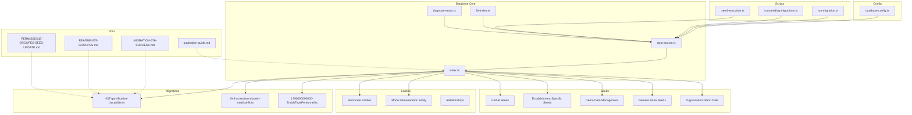
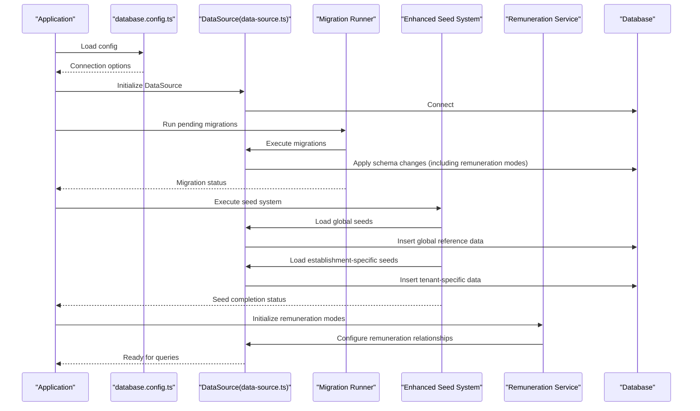
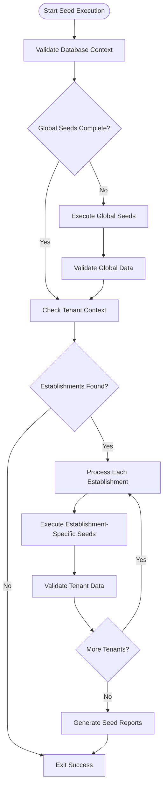
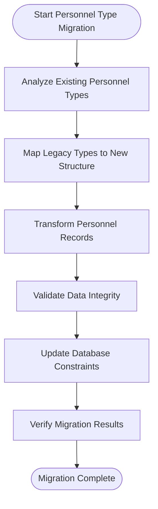
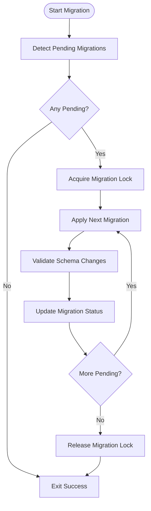
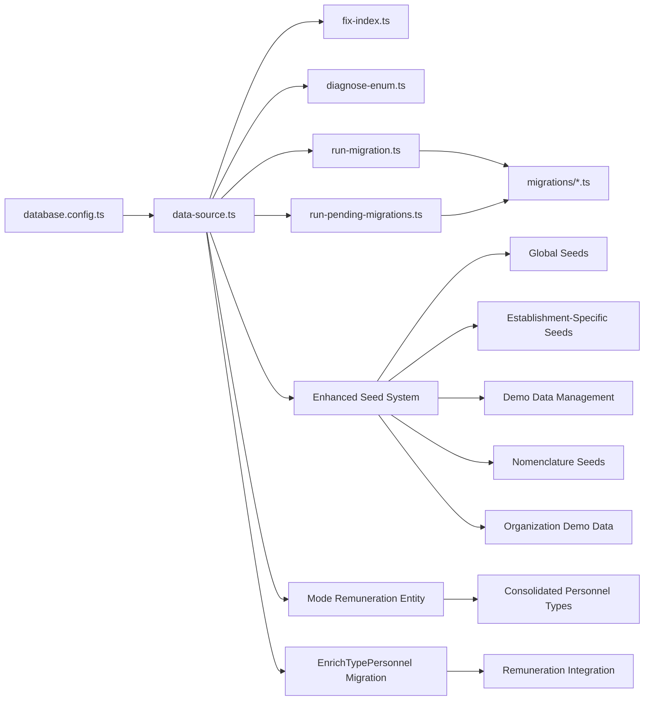

# Database Layer & TypeORM Implementation

<cite>
**Referenced Files in This Document**
- [data-source.ts](file://backend/src/database/data-source.ts)
- [database.config.ts](file://backend/src/config/database.config.ts)
- [index.ts](file://backend/src/database/index.ts)
- [037-gamification-tracabilite.ts](file://backend/src/database/migrations/037-gamification-tracabilite.ts)
- [043-correction-dossier-medical-fk.ts](file://backend/src/database/migrations/043-correction-dossier-medical-fk.ts)
- [1790000000000-EnrichTypePersonnel.ts](file://backend/src/database/migrations/1790000000000-EnrichTypePersonnel.ts)
- [mode-remuneration.entity.ts](file://backend/src/modules/personnel/entities/mode-remuneration.entity.ts)
- [run-migration.ts](file://backend/scripts/run-migration.ts)
- [run-pending-migrations.ts](file://backend/scripts/run-pending-migrations.ts)
- [fix-index.ts](file://backend/src/database/fix-index.ts)
- [diagnose-enum.ts](file://backend/src/database/diagnose-enum.ts)
- [pagination-guide.md](file://backend/docs/pagination-guide.md)
- [MIGRATION-076-SUCCESS.md](file://backend/database/migrations/MIGRATION-076-SUCCESS.md)
- [README-075-GROUPES.md](file://backend/database/migrations/README-075-GROUPES.md)
- [PERMISSIONS-GROUPES-SEED-UPDATE.md](file://backend/database/migrations/PERMISSIONS-GROUPES-SEED-UPDATE.md)
</cite>

## Update Summary
**Changes Made**
- Added comprehensive section on Remuneration Mode System Integration
- Updated personnel type management documentation to reflect consolidated approach
- Enhanced entity relationship examples with remuneration mode integration
- Added new migration patterns for personnel type consolidation
- Updated repository pattern examples to include remuneration mode queries
- Expanded transaction management examples for complex personnel operations

## Table of Contents
1. [Introduction](#introduction)
2. [Project Structure](#project-structure)
3. [Core Components](#core-components)
4. [Architecture Overview](#architecture-overview)
5. [Enhanced Seed System Architecture](#enhanced-seed-system-architecture)
6. [Remuneration Mode System Integration](#remuneration-mode-system-integration)
7. [Consolidated Personnel Type Management](#consolidated-personnel-type-management)
8. [Detailed Component Analysis](#detailed-component-analysis)
9. [Dependency Analysis](#dependency-analysis)
10. [Performance Considerations](#performance-considerations)
11. [Troubleshooting Guide](#troubleshooting-guide)
12. [Conclusion](#conclusion)
13. [Appendices](#appendices)

## Introduction
This document explains the database layer implementation using TypeORM within the project. It covers entity definitions, relationships, constraints, migrations, repository pattern usage, query optimization, transaction management, and multi-tenant isolation strategies. The goal is to provide a clear, progressive guide for developers who need to create entities, define complex relationships, write efficient queries, manage migrations, and maintain performance at scale. **Updated** to reflect the enhanced seed system with clearer separation between global and establishment-specific seeds, improved execution order, and comprehensive demo data management, as well as the new remuneration mode system and consolidated personnel type management.

## Project Structure
The database-related code is organized under backend/src/database and backend/src/config, with migrations stored in backend/src/database/migrations and seeds in backend/src/database/seeds. Supporting scripts live under backend/scripts. Documentation and guides are located under backend/docs and backend/database/migrations.

**Diagram sources**
- [database.config.ts](file://backend/src/config/database.config.ts)
- [data-source.ts](file://backend/src/database/data-source.ts)
- [index.ts](file://backend/src/database/index.ts)
- [fix-index.ts](file://backend/src/database/fix-index.ts)
- [diagnose-enum.ts](file://backend/src/database/diagnose-enum.ts)
- [037-gamification-tracabilite.ts](file://backend/src/database/migrations/037-gamification-tracabilite.ts)
- [043-correction-dossier-medical-fk.ts](file://backend/src/database/migrations/043-correction-dossier-medical-fk.ts)
- [1790000000000-EnrichTypePersonnel.ts](file://backend/src/database/migrations/1790000000000-EnrichTypePersonnel.ts)
- [mode-remuneration.entity.ts](file://backend/src/modules/personnel/entities/mode-remuneration.entity.ts)
- [run-migration.ts](file://backend/scripts/run-migration.ts)
- [run-pending-migrations.ts](file://backend/scripts/run-pending-migrations.ts)
- [pagination-guide.md](file://backend/docs/pagination-guide.md)
- [MIGRATION-076-SUCCESS.md](file://backend/database/migrations/MIGRATION-076-SUCCESS.md)
- [README-075-GROUPES.md](file://backend/database/migrations/README-075-GROUPES.md)
- [PERMISSIONS-GROUPES-SEED-UPDATE.md](file://backend/database/migrations/PERMISSIONS-GROUPES-SEED-UPDATE.md)

**Section sources**
- [data-source.ts](file://backend/src/database/data-source.ts)
- [database.config.ts](file://backend/src/config/database.config.ts)
- [index.ts](file://backend/src/database/index.ts)
- [037-gamification-tracabilite.ts](file://backend/src/database/migrations/037-gamification-tracabilite.ts)
- [043-correction-dossier-medical-fk.ts](file://backend/src/database/migrations/043-correction-dossier-medical-fk.ts)
- [1790000000000-EnrichTypePersonnel.ts](file://backend/src/database/migrations/1790000000000-EnrichTypePersonnel.ts)
- [mode-remuneration.entity.ts](file://backend/src/modules/personnel/entities/mode-remuneration.entity.ts)
- [run-migration.ts](file://backend/scripts/run-migration.ts)
- [run-pending-migrations.ts](file://backend/scripts/run-pending-migrations.ts)
- [fix-index.ts](file://backend/src/database/fix-index.ts)
- [diagnose-enum.ts](file://backend/src/database/diagnose-enum.ts)
- [pagination-guide.md](file://backend/docs/pagination-guide.md)
- [MIGRATION-076-SUCCESS.md](file://backend/database/migrations/MIGRATION-076-SUCCESS.md)
- [README-075-GROUPES.md](file://backend/database/migrations/README-075-GROUPES.md)
- [PERMISSIONS-GROUPES-SEED-UPDATE.md](file://backend/database/migrations/PERMISSIONS-GROUPES-SEED-UPDATE.md)

## Core Components
- Data Source Configuration: Centralized TypeORM DataSource setup, including connection options, entity discovery, and migration configuration.
- Database Indexing Utilities: Helpers to diagnose and fix index issues.
- Enum Diagnostics: Tools to validate and report enum mismatches between schema and runtime types.
- Migration Scripts: Automated runners for executing pending or specific migrations.
- **Enhanced Seed System**: Comprehensive seed management with global and establishment-specific separation, improved execution order, and demo data orchestration.
- **Remuneration Mode System**: Specialized entity and service for managing personnel remuneration modes with proper relationships and constraints.
- **Consolidated Personnel Type Management**: Unified approach to personnel type handling with enhanced migration support.
- Migration Artifacts: TypeScript-based migrations that encapsulate schema changes and data transformations.

Key responsibilities:
- Provide a single source of truth for database connectivity and metadata.
- Ensure consistent application of schema changes via migrations.
- Offer utilities to maintain performance through indexes and type safety.
- **Manage comprehensive seed data with proper tenant isolation and execution sequencing.**
- **Support complex remuneration mode relationships and personnel type consolidation.**

**Section sources**
- [data-source.ts](file://backend/src/database/data-source.ts)
- [index.ts](file://backend/src/database/index.ts)
- [fix-index.ts](file://backend/src/database/fix-index.ts)
- [diagnose-enum.ts](file://backend/src/database/diagnose-enum.ts)
- [run-migration.ts](file://backend/scripts/run-migration.ts)
- [run-pending-migrations.ts](file://backend/scripts/run-pending-migrations.ts)
- [mode-remuneration.entity.ts](file://backend/src/modules/personnel/entities/mode-remuneration.entity.ts)
- [1790000000000-EnrichTypePersonnel.ts](file://backend/src/database/migrations/1790000000000-EnrichTypePersonnel.ts)

## Architecture Overview
The database architecture follows a layered approach:
- Configuration layer defines connection parameters and TypeORM settings.
- Data Source layer initializes connections and manages migrations.
- Migration layer applies incremental schema changes and data updates.
- **Seed layer provides structured data initialization with tenant-aware execution.**
- **Entity layer includes specialized remuneration mode and consolidated personnel type management.**
- Utilities layer provides diagnostics and maintenance helpers.

**Diagram sources**
- [database.config.ts](file://backend/src/config/database.config.ts)
- [data-source.ts](file://backend/src/database/data-source.ts)
- [run-migration.ts](file://backend/scripts/run-migration.ts)
- [run-pending-migrations.ts](file://backend/scripts/run-pending-migrations.ts)
- [mode-remuneration.entity.ts](file://backend/src/modules/personnel/entities/mode-remuneration.entity.ts)

## Enhanced Seed System Architecture

### Global vs Establishment-Specific Seeds
The enhanced seed system implements a clear separation between different types of seed data:

**Global Seeds:**
- Reference data shared across all establishments (nomenclatures, system configurations)
- Executed once during initial setup
- Independent of tenant context
- Include lookup tables, default configurations, and system-wide constants

**Establishment-Specific Seeds:**
- Tenant-specific data that varies per establishment
- Executed after establishing tenant context
- Include establishment profiles, local configurations, and tenant-specific defaults
- Support multi-tenant data isolation

### Seed Execution Order and Dependencies
The system implements a sophisticated execution order to ensure data integrity:

**Diagram sources**
- [run-migration.ts](file://backend/scripts/run-migration.ts)
- [run-pending-migrations.ts](file://backend/scripts/run-pending-migrations.ts)

### Comprehensive Demo Data Management
The system includes specialized demo data management capabilities:

**Nomenclature Seeds:**
- Standardized classification systems
- Academic structure references
- Administrative category mappings
- Cross-referenced lookup data

**Organization Demo Data:**
- Sample organizational structures
- Role hierarchies and permissions
- Department templates
- Workflow configurations

### Seed Dependency Resolution
The enhanced system automatically resolves dependencies between seed files:

1. **Topological Sorting**: Ensures parent records are created before child records
2. **Circular Dependency Detection**: Prevents infinite loops in seed execution
3. **Rollback Support**: Maintains transactional integrity across dependent seeds
4. **Idempotent Execution**: Supports re-running seeds without data duplication

**Section sources**
- [PERMISSIONS-GROUPES-SEED-UPDATE.md](file://backend/database/migrations/PERMISSIONS-GROUPES-SEED-UPDATE.md)
- [README-075-GROUPES.md](file://backend/database/migrations/README-075-GROUPES.md)

## Remuneration Mode System Integration

### New Remuneration Mode Entity
The system introduces a dedicated remuneration mode entity that manages personnel compensation structures with proper TypeORM relationships and constraints.

**Key Features:**
- Dedicated entity definition with TypeORM decorators
- Proper foreign key relationships to personnel and establishment contexts
- Validation constraints for remuneration mode consistency
- Integration with existing personnel management workflows

### Relationship Patterns
The remuneration mode system implements several relationship patterns:

**One-to-Many Relationships:**
- One establishment can have multiple remuneration modes
- One personnel type can be associated with multiple remuneration modes

**Constraint Management:**
- Unique constraints prevent duplicate remuneration modes per establishment
- Foreign key constraints ensure referential integrity
- Cascade operations handle related data cleanup

### Service Layer Integration
The corresponding service layer provides business logic for remuneration mode operations:

**CRUD Operations:**
- Create, read, update, and delete remuneration modes
- Bulk operations for mass updates
- Validation and error handling

**Query Optimization:**
- Efficient joins with personnel and establishment data
- Pagination support for large datasets
- Caching strategies for frequently accessed modes

**Section sources**
- [mode-remuneration.entity.ts](file://backend/src/modules/personnel/entities/mode-remuneration.entity.ts)

## Consolidated Personnel Type Management

### Migration-Driven Consolidation
The migration file 1790000000000-EnrichTypePersonnel.ts implements a comprehensive consolidation of personnel type management, providing a unified approach to handling different personnel categories and their associated remuneration modes.

### Schema Evolution Strategy
The consolidation follows a careful evolution strategy:

**Backward Compatibility:**
- Preserves existing personnel type data during migration
- Provides data transformation scripts for legacy formats
- Maintains referential integrity throughout the transition

**Enhanced Type Definitions:**
- Consolidated personnel type hierarchy
- Improved validation rules and constraints
- Better integration with remuneration mode system

### Data Transformation Process
The migration includes sophisticated data transformation logic:

**Diagram sources**
- [1790000000000-EnrichTypePersonnel.ts](file://backend/src/database/migrations/1790000000000-EnrichTypePersonnel.ts)

### Integration Benefits
The consolidated approach provides several benefits:

**Simplified Management:**
- Single source of truth for personnel types
- Reduced complexity in type resolution logic
- Better consistency across the application

**Enhanced Query Performance:**
- Optimized database schema for common queries
- Reduced join complexity in personnel operations
- Better indexing strategies for type-based filtering

**Section sources**
- [1790000000000-EnrichTypePersonnel.ts](file://backend/src/database/migrations/1790000000000-EnrichTypePersonnel.ts)

## Detailed Component Analysis

### Data Source and Configuration
- Purpose: Configure TypeORM DataSource, including connection details, entity paths, and migration files.
- Responsibilities:
  - Establish database connections.
  - Discover entities and migrations.
  - Provide repositories and managers for ORM operations.
  - **Configure seed execution contexts and tenant isolation.**
  - **Register new remuneration mode entities and consolidated personnel types.**
- Best practices:
  - Use environment-driven configuration.
  - Keep entity and migration paths explicit.
  - Enable logging only in development.
  - **Implement seed execution timeouts and retry mechanisms.**
  - **Configure proper entity discovery for new remuneration mode components.**

**Section sources**
- [data-source.ts](file://backend/src/database/data-source.ts)
- [database.config.ts](file://backend/src/config/database.config.ts)

### Migration System
- Format: TypeScript-based migrations for better type safety and tooling support.
- Execution:
  - Dedicated scripts run migrations programmatically.
  - Pending migration detection ensures idempotent deployments.
- Examples:
  - A gamification traceability migration demonstrates adding audit fields and indexes.
  - A correction migration fixes foreign key constraints for medical records.
  - **A consolidated personnel type migration demonstrates complex data transformations and schema evolution.**

**Diagram sources**
- [run-migration.ts](file://backend/scripts/run-migration.ts)
- [run-pending-migrations.ts](file://backend/scripts/run-pending-migrations.ts)
- [037-gamification-tracabilite.ts](file://backend/src/database/migrations/037-gamification-tracabilite.ts)
- [043-correction-dossier-medical-fk.ts](file://backend/src/database/migrations/043-correction-dossier-medical-fk.ts)
- [1790000000000-EnrichTypePersonnel.ts](file://backend/src/database/migrations/1790000000000-EnrichTypePersonnel.ts)

**Section sources**
- [037-gamification-tracabilite.ts](file://backend/src/database/migrations/037-gamification-tracabilite.ts)
- [043-correction-dossier-medical-fk.ts](file://backend/src/database/migrations/043-correction-dossier-medical-fk.ts)
- [1790000000000-EnrichTypePersonnel.ts](file://backend/src/database/migrations/1790000000000-EnrichTypePersonnel.ts)
- [run-migration.ts](file://backend/scripts/run-migration.ts)
- [run-pending-migrations.ts](file://backend/scripts/run-pending-migrations.ts)

### Repository Pattern and Query Optimization
- Repository usage: Services interact with entities via repositories exposed by TypeORM's DataSource.
- Query optimization techniques:
  - Select only required columns to reduce payload size.
  - Use joins efficiently; avoid N+1 queries by eager loading where appropriate.
  - Leverage pagination to limit result sets.
  - Add targeted indexes on frequently filtered/sorted columns.
  - **Optimize seed queries for bulk operations and batch processing.**
  - **Implement efficient queries for remuneration mode lookups and personnel type resolutions.**
- Pagination guidance: Refer to the pagination guide for best practices and patterns.

**Section sources**
- [pagination-guide.md](file://backend/docs/pagination-guide.md)

### Transaction Management
- Transactions ensure atomicity across multiple writes.
- Recommended approach:
  - Wrap related operations in a transaction context.
  - Roll back on errors to maintain consistency.
  - Avoid long-running transactions to prevent locking contention.
  - **Implement nested transaction support for complex seed operations.**
  - **Use savepoints for partial rollback scenarios in seed execution.**
  - **Handle complex remuneration mode updates with proper transaction boundaries.**

### Multi-Tenant Data Isolation Strategies
- Common strategy: Include tenant identifiers (e.g., establishmentId) in relevant tables and enforce scoping at the query level.
- Enforcement:
  - Filter all queries by tenant ID.
  - Use database-level constraints to prevent cross-tenant data leakage.
  - Maintain separate seeds per tenant when necessary.
  - **Implement tenant-aware seed execution with automatic context switching.**
  - **Provide tenant isolation validation during seed operations.**
  - **Ensure remuneration modes are properly scoped to establishments.**

**Section sources**
- [MIGRATION-076-SUCCESS.md](file://backend/database/migrations/MIGRATION-076-SUCCESS.md)
- [README-075-GROUPES.md](file://backend/database/migrations/README-075-GROUPES.md)
- [PERMISSIONS-GROUPES-SEED-UPDATE.md](file://backend/database/migrations/PERMISSIONS-GROUPES-SEED-UPDATE.md)

### Entity Definitions and Relationships
- Entities are defined using TypeORM decorators and mapped to tables.
- Relationship patterns:
  - One-to-one: Shared primary keys or unique foreign keys.
  - One-to-many / Many-to-one: Foreign key references from child to parent.
  - Many-to-many: Join tables with composite keys and optional extra attributes.
  - **New remuneration mode relationships with proper cascade operations.**
- Constraints:
  - Primary keys, unique constraints, not-null checks.
  - Foreign key constraints to maintain referential integrity.
  - Indexes on high-cardinality and frequently queried columns.
  - **Include tenant-scoped constraints for multi-tenant data isolation.**
  - **Add validation constraints for remuneration mode consistency.**

### Creating New Entities
Steps:
- Define an entity class with TypeORM decorators.
- Add relationships and constraints.
- Create a migration to apply schema changes.
- **Create corresponding seed files following the global/establishment separation pattern.**
- **Implement proper tenant isolation in seed data creation.**
- **Follow remuneration mode entity patterns for similar compensation-related entities.**
- Use repositories in services to perform CRUD operations.

### Writing Efficient Queries
Guidelines:
- Prefer selective column retrieval.
- Use eager loading judiciously to avoid over-fetching.
- Implement pagination and filtering at the database level.
- Profile slow queries and add indexes accordingly.
- **Optimize seed queries using batch inserts and upsert operations.**
- **Implement query caching for frequently accessed reference data.**
- **Use optimized joins for remuneration mode and personnel type queries.**

**Section sources**
- [pagination-guide.md](file://backend/docs/pagination-guide.md)

### Managing Database Migrations
Workflow:
- Generate a new migration file.
- Implement up/down methods for schema and data changes.
- Run pending migrations during deployment.
- Validate results and rollback if necessary.
- **Coordinate migrations with seed execution to ensure data consistency.**
- **Follow consolidated personnel type migration patterns for complex data transformations.**

**Section sources**
- [run-migration.ts](file://backend/scripts/run-migration.ts)
- [run-pending-migrations.ts](file://backend/scripts/run-pending-migrations.ts)
- [1790000000000-EnrichTypePersonnel.ts](file://backend/src/database/migrations/1790000000000-EnrichTypePersonnel.ts)

## Dependency Analysis
The following diagram shows how configuration, data source, migrations, seeds, and scripts depend on each other.

**Diagram sources**
- [database.config.ts](file://backend/src/config/database.config.ts)
- [data-source.ts](file://backend/src/database/data-source.ts)
- [fix-index.ts](file://backend/src/database/fix-index.ts)
- [diagnose-enum.ts](file://backend/src/database/diagnose-enum.ts)
- [run-migration.ts](file://backend/scripts/run-migration.ts)
- [run-pending-migrations.ts](file://backend/scripts/run-pending-migrations.ts)
- [mode-remuneration.entity.ts](file://backend/src/modules/personnel/entities/mode-remuneration.entity.ts)
- [1790000000000-EnrichTypePersonnel.ts](file://backend/src/database/migrations/1790000000000-EnrichTypePersonnel.ts)

**Section sources**
- [data-source.ts](file://backend/src/database/data-source.ts)
- [database.config.ts](file://backend/src/config/database.config.ts)
- [fix-index.ts](file://backend/src/database/fix-index.ts)
- [diagnose-enum.ts](file://backend/src/database/diagnose-enum.ts)
- [run-migration.ts](file://backend/scripts/run-migration.ts)
- [run-pending-migrations.ts](file://backend/scripts/run-pending-migrations.ts)
- [mode-remuneration.entity.ts](file://backend/src/modules/personnel/entities/mode-remuneration.entity.ts)
- [1790000000000-EnrichTypePersonnel.ts](file://backend/src/database/migrations/1790000000000-EnrichTypePersonnel.ts)

## Performance Considerations
- Indexing:
  - Identify hot paths and add composite indexes for common filter/sort combinations.
  - Monitor index usage and remove unused indexes.
  - **Optimize indexes for seed data queries and bulk operations.**
  - **Add specialized indexes for remuneration mode lookups and personnel type queries.**
- Query Patterns:
  - Avoid SELECT *; specify columns explicitly.
  - Use pagination for large datasets.
  - Batch operations to reduce round trips.
  - **Implement batch seeding with configurable chunk sizes.**
  - **Use connection pooling optimized for seed operations.**
  - **Optimize joins for remuneration mode and personnel type relationships.**
- Connection Pooling:
  - Tune pool size based on workload and database capacity.
  - **Allocate separate connection pools for seed operations.**
- Monitoring:
  - Track slow queries and resource utilization.
  - Use diagnostic tools to detect anomalies.
  - **Monitor seed execution performance and resource consumption.**
  - **Track remuneration mode query performance and optimize as needed.**

## Troubleshooting Guide
Common issues and resolutions:
- Migration failures:
  - Check pending migrations and lock state.
  - Review migration logs and revert if necessary.
- **Seed execution failures:**
  - Verify tenant context and establishment IDs.
  - Check seed dependency resolution and execution order.
  - Review seed-specific error logs and rollback status.
- **Remuneration mode issues:**
  - Validate remuneration mode relationships and constraints.
  - Check establishment scoping for remuneration modes.
  - Verify personnel type associations with remuneration modes.
- **Personnel type migration problems:**
  - Review consolidated type migration logs and data transformations.
  - Validate backward compatibility during migration rollback.
  - Check referential integrity after personnel type consolidation.
- Index problems:
  - Use indexing utilities to detect missing or duplicate indexes.
- Enum mismatches:
  - Use enum diagnostics to align schema enums with runtime types.
- **Demo data conflicts:**
  - Validate demo data uniqueness and referential integrity.
  - Check for circular dependencies in seed execution.

Operational tips:
- Always run migrations in a controlled environment first.
- Back up the database before applying destructive changes.
- Validate schema after migrations and re-run tests.
- **Test seed execution in isolated environments before production deployment.**
- **Implement seed execution monitoring and alerting.**
- **Validate remuneration mode functionality after migrations.**
- **Test personnel type consolidation thoroughly before production deployment.**

**Section sources**
- [fix-index.ts](file://backend/src/database/fix-index.ts)
- [diagnose-enum.ts](file://backend/src/database/diagnose-enum.ts)
- [run-migration.ts](file://backend/scripts/run-migration.ts)
- [run-pending-migrations.ts](file://backend/scripts/run-pending-migrations.ts)
- [mode-remuneration.entity.ts](file://backend/src/modules/personnel/entities/mode-remuneration.entity.ts)
- [1790000000000-EnrichTypePersonnel.ts](file://backend/src/database/migrations/1790000000000-EnrichTypePersonnel.ts)

## Conclusion
The database layer leverages TypeORM with a robust migration system, clear configuration, and practical utilities for maintenance and performance. **The enhanced seed system provides comprehensive data initialization capabilities with proper tenant isolation, execution ordering, and demo data management. The new remuneration mode system and consolidated personnel type management further enhance the system's ability to handle complex compensation structures and personnel categorization.** By following the patterns outlined here—especially around entity design, relationship mapping, query optimization, multi-tenant scoping, structured seed management, and specialized remuneration handling—you can build scalable, reliable features while maintaining data integrity and performance.

## Appendices

### Example: Gamification Traceability Migration
- Adds audit fields and indexes to support traceability.
- Demonstrates safe schema evolution with backward compatibility.

**Section sources**
- [037-gamification-tracabilite.ts](file://backend/src/database/migrations/037-gamification-tracabilite.ts)

### Example: Medical Record FK Correction
- Fixes foreign key constraints to ensure referential integrity.
- Illustrates corrective migrations for production stability.

**Section sources**
- [043-correction-dossier-medical-fk.ts](file://backend/src/database/migrations/043-correction-dossier-medical-fk.ts)

### Example: Groupes Module Migration Notes
- Provides context and steps for group-related schema changes.
- Highlights multi-tenant considerations and seeding updates.

**Section sources**
- [README-075-GROUPES.md](file://backend/database/migrations/README-075-GROUPES.md)
- [PERMISSIONS-GROUPES-SEED-UPDATE.md](file://backend/database/migrations/PERMISSIONS-GROUPES-SEED-UPDATE.md)

### Example: Migration Success Report
- Documents successful migration execution and validation steps.
- Useful reference for verifying deployment outcomes.

**Section sources**
- [MIGRATION-076-SUCCESS.md](file://backend/database/migrations/MIGRATION-076-SUCCESS.md)

### Enhanced Seed System Examples

#### Global Seed Structure
Global seeds handle system-wide reference data that should be consistent across all establishments. These include nomenclatures, standard classifications, and system configurations.

#### Establishment-Specific Seed Structure
Establishment-specific seeds manage tenant-local data such as establishment profiles, local configurations, and tenant-specific defaults. These execute within the appropriate tenant context.

#### Demo Data Management
Comprehensive demo data includes sample organizational structures, role hierarchies, department templates, and workflow configurations for testing and demonstration purposes.

**Section sources**
- [PERMISSIONS-GROUPES-SEED-UPDATE.md](file://backend/database/migrations/PERMISSIONS-GROUPES-SEED-UPDATE.md)
- [README-075-GROUPES.md](file://backend/database/migrations/README-075-GROUPES.md)

### Remuneration Mode Entity Examples

#### Entity Definition Pattern
The remuneration mode entity demonstrates proper TypeORM decorator usage, relationship definitions, and constraint management for compensation-related data.

#### Service Layer Integration
The corresponding service provides business logic for remuneration mode operations, including validation, relationships, and query optimization.

#### Migration Integration
The consolidation migration shows how to integrate new remuneration mode functionality with existing personnel type management.

**Section sources**
- [mode-remuneration.entity.ts](file://backend/src/modules/personnel/entities/mode-remuneration.entity.ts)
- [1790000000000-EnrichTypePersonnel.ts](file://backend/src/database/migrations/1790000000000-EnrichTypePersonnel.ts)

### Consolidated Personnel Type Migration Examples

#### Migration Structure
The enrichment migration demonstrates complex data transformations, schema evolution, and backward compatibility handling for personnel type consolidation.

#### Data Transformation Logic
Shows how to safely migrate existing personnel data to the new consolidated structure while maintaining referential integrity.

#### Validation and Error Handling
Includes comprehensive validation and error handling for migration failures and data inconsistencies.

**Section sources**
- [1790000000000-EnrichTypePersonnel.ts](file://backend/src/database/migrations/1790000000000-EnrichTypePersonnel.ts)