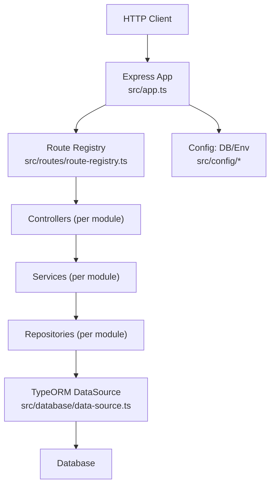
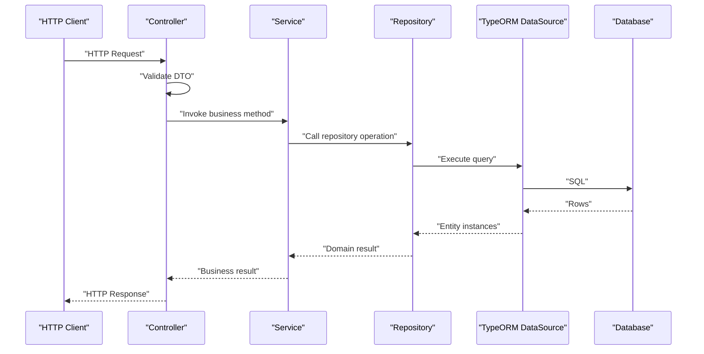
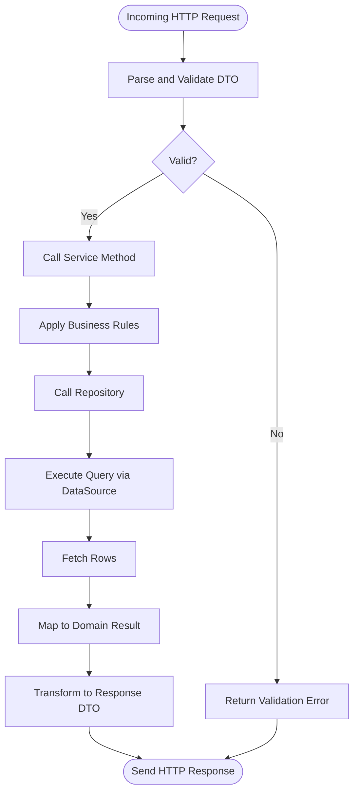
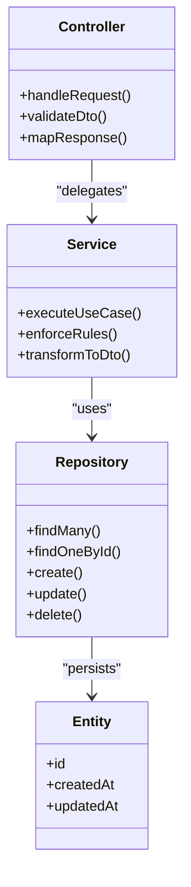
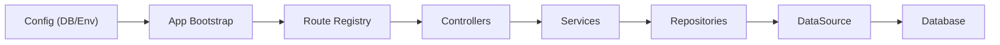

# Layered Architecture & Components

<cite>
**Referenced Files in This Document**
- [app.ts](file://backend/src/app.ts)
- [index.ts](file://backend/src/index.ts)
- [route-registry.ts](file://backend/src/routes/route-registry.ts)
- [data-source.ts](file://backend/src/database/data-source.ts)
- [database.config.ts](file://backend/src/config/database.config.ts)
- [env.config.ts](file://backend/src/config/env.config.ts)
- [pagination-guide.md](file://backend/docs/pagination-guide.md)
- [utilisateurs.service.test.ts](file://backend/test/services/utilisateurs.service.test.ts)
- [utilisateur-etablissement.service.test.ts](file://backend/test/services/utilisateur-etablissement.service.test.ts)
</cite>

## Table of Contents
1. [Introduction](#introduction)
2. [Project Structure](#project-structure)
3. [Core Components](#core-components)
4. [Architecture Overview](#architecture-overview)
5. [Detailed Component Analysis](#detailed-component-analysis)
6. [Dependency Analysis](#dependency-analysis)
7. [Performance Considerations](#performance-considerations)
8. [Troubleshooting Guide](#troubleshooting-guide)
9. [Conclusion](#conclusion)
10. [Appendices](#appendices)

## Introduction
This document explains the backend’s layered architecture pattern and how requests flow from HTTP endpoints through Controllers, Services, Repositories, and Entities. It also documents the DTO pattern for request/response validation and transformation, provides examples of proper layer separation, error handling strategies at each layer, performance considerations, and guidelines for implementing new endpoints following established patterns.

The goal is to make the architecture accessible to both technical and non-technical readers while providing concrete references to source files where applicable.

## Project Structure
At a high level, the backend organizes features by modules under src/modules, with shared infrastructure in src/common and configuration in src/config. The application bootstrap wires routing, database connectivity, and environment configuration.

**Diagram sources**
- [app.ts](file://backend/src/app.ts)
- [route-registry.ts](file://backend/src/routes/route-registry.ts)
- [data-source.ts](file://backend/src/database/data-source.ts)
- [database.config.ts](file://backend/src/config/database.config.ts)
- [env.config.ts](file://backend/src/config/env.config.ts)

**Section sources**
- [index.ts](file://backend/src/index.ts)
- [app.ts](file://backend/src/app.ts)
- [route-registry.ts](file://backend/src/routes/route-registry.ts)
- [data-source.ts](file://backend/src/database/data-source.ts)
- [database.config.ts](file://backend/src/config/database.config.ts)
- [env.config.ts](file://backend/src/config/env.config.ts)

## Core Components
- Controllers: Handle HTTP concerns (routing, request parsing, response formatting). They should remain thin and delegate business logic to services.
- Services: Encapsulate business rules, orchestrate workflows, coordinate multiple repositories, and transform data between layers.
- Repositories: Provide data access abstractions over entities. They encapsulate queries and persistence operations.
- Entities: Represent domain models mapped to database tables via TypeORM.
- DTOs: Define request/response shapes used for validation and transformation at the boundaries.

Responsibilities and interactions:
- Controllers receive requests, validate inputs using DTOs, call service methods, and return standardized responses.
- Services implement use cases, enforce business constraints, and call repository methods.
- Repositories perform CRUD and complex queries against entities.
- Entities define schema and relationships; they are not exposed directly to clients.

Error handling strategy:
- Controllers translate exceptions into HTTP status codes and consistent JSON error envelopes.
- Services throw domain-specific errors or return structured results.
- Repositories propagate low-level errors up to services for contextual wrapping.

Validation and transformation:
- Use DTOs to validate incoming payloads and map them to internal objects.
- Transform entity outputs to response DTOs before returning from controllers.

**Section sources**
- [route-registry.ts](file://backend/src/routes/route-registry.ts)
- [data-source.ts](file://backend/src/database/data-source.ts)
- [database.config.ts](file://backend/src/config/database.config.ts)
- [env.config.ts](file://backend/src/config/env.config.ts)

## Architecture Overview
The layered architecture enforces clear separation of concerns:
- Presentation layer (Controllers) focuses on HTTP semantics.
- Business layer (Services) contains domain logic and orchestration.
- Data access layer (Repositories) abstracts persistence details.
- Domain model layer (Entities) defines persistent structures.

**Diagram sources**
- [route-registry.ts](file://backend/src/routes/route-registry.ts)
- [data-source.ts](file://backend/src/database/data-source.ts)

## Detailed Component Analysis

### Request Flow: From HTTP to Database
This sequence shows a typical endpoint lifecycle:
- Route registration maps URL patterns to controller handlers.
- Controller validates input DTOs and delegates to service.
- Service orchestrates business logic and calls repository.
- Repository uses TypeORM DataSource to execute queries.
- Responses are transformed back to DTOs and returned.

[No sources needed since this diagram shows conceptual workflow, not actual code structure]

### DTO Pattern for Validation and Transformation
- Define request DTOs for input validation (e.g., create/update schemas).
- Define response DTOs for output shaping and filtering sensitive fields.
- Apply validation early in controllers to fail fast.
- Transform entities to response DTOs before sending responses.

Guidelines:
- Keep DTOs focused on API contracts; avoid leaking internal types.
- Centralize mapping utilities if transformations are repeated.
- Use consistent error messages for validation failures.

[No sources needed since this section doesn't analyze specific files]

### Error Handling Across Layers
- Controllers: Convert exceptions to HTTP responses with consistent structure.
- Services: Throw domain errors with context; do not leak implementation details.
- Repositories: Catch low-level errors and rethrow as domain-friendly errors.

Best practices:
- Use typed error classes per layer.
- Log errors with correlation IDs for tracing.
- Avoid exposing stack traces to clients.

[No sources needed since this section doesn't analyze specific files]

### Performance Considerations
- Prefer efficient queries in repositories; avoid N+1 problems.
- Use pagination for list endpoints; see documentation for guidance.
- Cache frequently accessed read-only data when appropriate.
- Batch operations for bulk writes to reduce round trips.

**Section sources**
- [pagination-guide.md](file://backend/docs/pagination-guide.md)

### Implementing New Endpoints: Step-by-Step
Follow these steps to add a new feature consistently:
1. Define Entities: Create TypeORM entities representing domain data.
2. Create DTOs: Define request and response DTOs for validation and shaping.
3. Implement Repository: Add data access methods for your entities.
4. Implement Service: Orchestrate business logic and call repository methods.
5. Implement Controller: Wire routes, validate DTOs, call service, return responses.
6. Register Routes: Ensure route registry includes your controller endpoints.
7. Write Tests: Add unit tests for services and integration tests for endpoints.

Example references:
- Service test patterns can be reviewed in existing tests to align expectations.

**Section sources**
- [utilisateurs.service.test.ts](file://backend/test/services/utilisateurs.service.test.ts)
- [utilisateur-etablissement.service.test.ts](file://backend/test/services/utilisateur-etablissement.service.test.ts)

### Conceptual Overview
The layered approach ensures maintainability and testability:
- Changes in business logic rarely affect controllers.
- Data access changes are isolated within repositories.
- DTOs stabilize API contracts across frontend and backend evolution.

[No sources needed since this diagram shows conceptual workflow, not actual code structure]

## Dependency Analysis
High-level dependencies:
- Application bootstrap depends on configuration and route registry.
- Controllers depend on services.
- Services depend on repositories.
- Repositories depend on TypeORM DataSource.
- Configuration provides database and environment settings.

**Diagram sources**
- [app.ts](file://backend/src/app.ts)
- [route-registry.ts](file://backend/src/routes/route-registry.ts)
- [data-source.ts](file://backend/src/database/data-source.ts)
- [database.config.ts](file://backend/src/config/database.config.ts)
- [env.config.ts](file://backend/src/config/env.config.ts)

**Section sources**
- [index.ts](file://backend/src/index.ts)
- [app.ts](file://backend/src/app.ts)
- [route-registry.ts](file://backend/src/routes/route-registry.ts)
- [data-source.ts](file://backend/src/database/data-source.ts)
- [database.config.ts](file://backend/src/config/database.config.ts)
- [env.config.ts](file://backend/src/config/env.config.ts)

## Performance Considerations
- Pagination: Always paginate large collections to limit payload size and improve response times.
- Query optimization: Use selective field retrieval and joins to minimize data transfer.
- Caching: Introduce caching for stable reference data and dashboard aggregates.
- Connection pooling: Ensure TypeORM DataSource is configured with appropriate pool sizes.
- Monitoring: Track slow queries and endpoint latencies to identify bottlenecks.

**Section sources**
- [pagination-guide.md](file://backend/docs/pagination-guide.md)

## Troubleshooting Guide
Common issues and resolutions:
- Validation failures: Ensure DTOs match client payloads and provide clear error messages.
- Database connection errors: Verify environment variables and database configuration.
- N+1 query problems: Profile repository queries and refactor to batch or eager load.
- Inconsistent responses: Standardize response DTOs and centralize mapping logic.

Debugging tips:
- Enable detailed logging in development.
- Use correlation IDs to trace requests across layers.
- Review service tests to understand expected behaviors and edge cases.

**Section sources**
- [utilisateurs.service.test.ts](file://backend/test/services/utilisateurs.service.test.ts)
- [utilisateur-etablissement.service.test.ts](file://backend/test/services/utilisateur-etablissement.service.test.ts)

## Conclusion
The layered architecture separates concerns cleanly, enabling maintainable and testable code. By adhering to responsibilities—controllers for HTTP, services for business logic, repositories for data access, and entities for domain modeling—you achieve clarity and scalability. DTOs stabilize API contracts and simplify validation and transformation. Following the provided guidelines and examples will help you implement new endpoints consistently and efficiently.

## Appendices
- Reference configuration files for database and environment setup.
- Consult pagination documentation for best practices on list endpoints.
- Review service tests to align testing strategies and assertions.