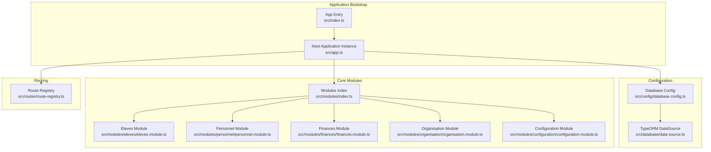
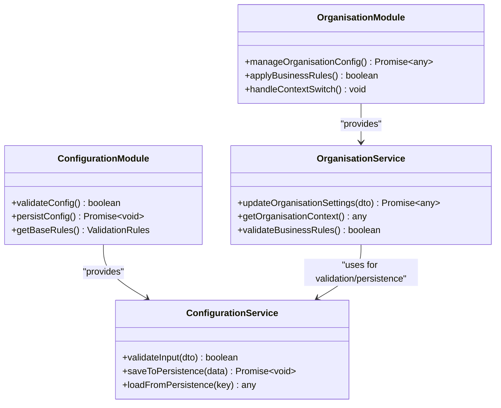
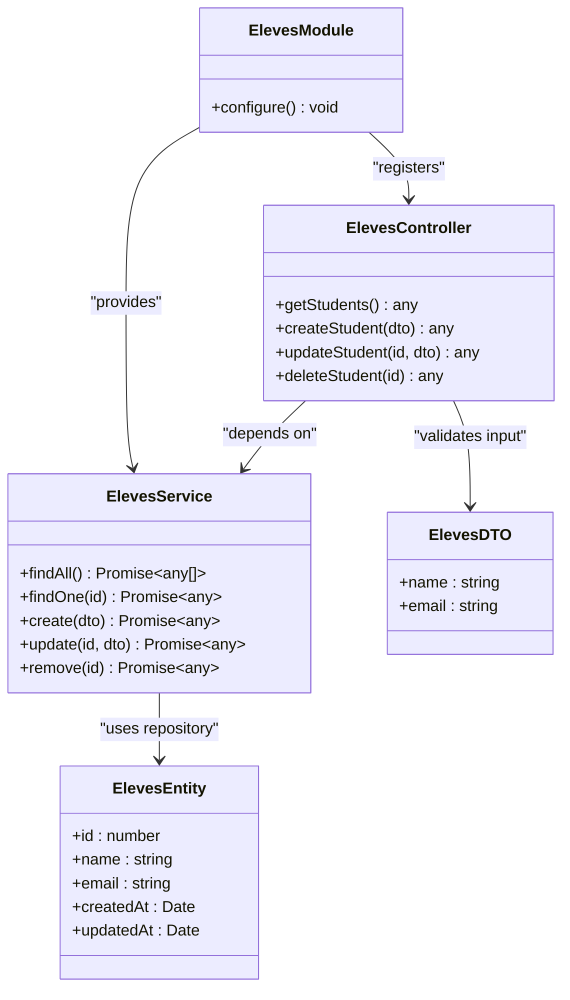
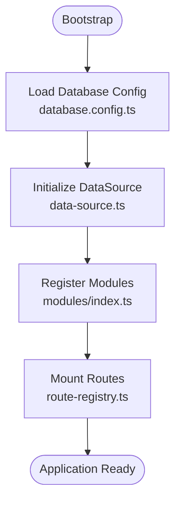
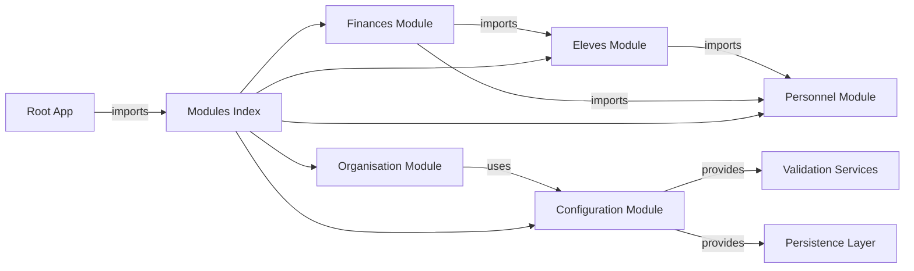

# Modular Architecture Pattern

<cite>
**Referenced Files in This Document**
- [app.ts](file://backend/src/app.ts)
- [index.ts](file://backend/src/index.ts)
- [modules/index.ts](file://backend/src/modules/index.ts)
- [eleves.module.ts](file://backend/src/modules/eleves/eleves.module.ts)
- [eleves.controller.ts](file://backend/src/modules/eleves/controllers/eleves.controller.ts)
- [eleves.service.ts](file://backend/src/modules/eleves/services/eleves.service.ts)
- [eleves.entity.ts](file://backend/src/modules/eleves/entities/eleves.entity.ts)
- [eleves.dto.ts](file://backend/src/modules/eleves/dto/eleves.dto.ts)
- [personnel.module.ts](file://backend/src/modules/personnel/personnel.module.ts)
- [finances.module.ts](file://backend/src/modules/finances/finances.module.ts)
- [organisation.module.ts](file://backend/src/modules/organisation/organisation.module.ts)
- [configuration.module.ts](file://backend/src/modules/configuration/configuration.module.ts)
- [database.config.ts](file://backend/src/config/database.config.ts)
- [data-source.ts](file://backend/src/database/data-source.ts)
- [route-registry.ts](file://backend/src/routes/route-registry.ts)
</cite>

## Update Summary
**Changes Made**
- Updated architecture overview to reflect enhanced modular pattern with distributed configuration management
- Added new section on Configuration and Organisation module separation of concerns
- Enhanced dependency analysis to show improved service boundaries
- Updated module registration patterns to reflect better separation of concerns

## Table of Contents
1. [Introduction](#introduction)
2. [Project Structure](#project-structure)
3. [Core Components](#core-components)
4. [Architecture Overview](#architecture-overview)
5. [Enhanced Module Separation](#enhanced-module-separation)
6. [Detailed Component Analysis](#detailed-component-analysis)
7. [Dependency Analysis](#dependency-analysis)
8. [Performance Considerations](#performance-considerations)
9. [Troubleshooting Guide](#troubleshooting-guide)
10. [Conclusion](#conclusion)
11. [Appendices](#appendices)

## Introduction
This document explains the NestJS modular architecture pattern used across business domains such as eleves, personnel, finances, organisation, and others. The architecture has been enhanced with distributed configuration management where services follow better separation of concerns - the organisation module owns its configuration-related business logic while the configuration module provides foundational validation and persistence capabilities. Each domain is organized as an independent module with clear separation of concerns, standard folder structure (controllers, services, entities, DTOs, index files), dependency injection patterns, module registration, and inter-module communication strategies.

## Project Structure
The backend follows a feature-based organization under src/modules, where each business domain is encapsulated in its own directory. The application bootstrap wires configuration, database, and modules together. A central route registry can be used to aggregate or expose routes from modules. The enhanced architecture now includes specialized modules for configuration management and organisational logic.



**Diagram sources**
- [index.ts](file://backend/src/index.ts)
- [app.ts](file://backend/src/app.ts)
- [database.config.ts](file://backend/src/config/database.config.ts)
- [data-source.ts](file://backend/src/database/data-source.ts)
- [modules/index.ts](file://backend/src/modules/index.ts)
- [eleves.module.ts](file://backend/src/modules/eleves/eleves.module.ts)
- [personnel.module.ts](file://backend/src/modules/personnel/personnel.module.ts)
- [finances.module.ts](file://backend/src/modules/finances/finances.module.ts)
- [organisation.module.ts](file://backend/src/modules/organisation/organisation.module.ts)
- [configuration.module.ts](file://backend/src/modules/configuration/configuration.module.ts)
- [route-registry.ts](file://backend/src/routes/route-registry.ts)

**Section sources**
- [index.ts](file://backend/src/index.ts)
- [app.ts](file://backend/src/app.ts)
- [database.config.ts](file://backend/src/config/database.config.ts)
- [data-source.ts](file://backend/src/database/data-source.ts)
- [modules/index.ts](file://backend/src/modules/index.ts)
- [route-registry.ts](file://backend/src/routes/route-registry.ts)

## Core Components
Each domain module typically includes:
- Controller(s): HTTP endpoints for the domain
- Service(s): Business logic and orchestration
- Entity(ies): TypeORM entities representing persistent data
- DTO(s): Request/response validation schemas
- Module file: Declares providers, imports, exports, and controllers
- Optional index file: Re-exports public symbols for other modules

Example references:
- Eleves module components:
  - [eleves.module.ts](file://backend/src/modules/eleves/eleves.module.ts)
  - [eleves.controller.ts](file://backend/src/modules/eleves/controllers/eleves.controller.ts)
  - [eleves.service.ts](file://backend/src/modules/eleves/services/eleves.service.ts)
  - [eleves.entity.ts](file://backend/src/modules/eleves/entities/eleves.entity.ts)
  - [eleves.dto.ts](file://backend/src/modules/eleves/dto/eleves.dto.ts)
- Personnel module:
  - [personnel.module.ts](file://backend/src/modules/personnel/personnel.module.ts)
- Finances module:
  - [finances.module.ts](file://backend/src/modules/finances/finances.module.ts)
- Organisation module (enhanced):
  - [organisation.module.ts](file://backend/src/modules/organisation/organisation.module.ts)
- Configuration module (enhanced):
  - [configuration.module.ts](file://backend/src/modules/configuration/configuration.module.ts)

Key responsibilities:
- Controllers handle request parsing, validation, and response formatting. They depend on services via constructor injection.
- Services implement domain logic, interact with repositories/entities, and coordinate cross-cutting concerns.
- Entities define schema and relationships using TypeORM decorators.
- DTOs enforce input/output contracts and integrate with validation pipes.
- Module files wire everything together and declare dependencies.

**Updated** Enhanced separation of concerns where organisation module owns configuration business logic while configuration module provides foundational validation and persistence capabilities.

**Section sources**
- [eleves.module.ts](file://backend/src/modules/eleves/eleves.module.ts)
- [eleves.controller.ts](file://backend/src/modules/eleves/controllers/eleves.controller.ts)
- [eleves.service.ts](file://backend/src/modules/eleves/services/eleves.service.ts)
- [eleves.entity.ts](file://backend/src/modules/eleves/entities/eleves.entity.ts)
- [eleves.dto.ts](file://backend/src/modules/eleves/dto/eleves.dto.ts)
- [personnel.module.ts](file://backend/src/modules/personnel/personnel.module.ts)
- [finances.module.ts](file://backend/src/modules/finances/finances.module.ts)
- [organisation.module.ts](file://backend/src/modules/organisation/organisation.module.ts)
- [configuration.module.ts](file://backend/src/modules/configuration/configuration.module.ts)

## Architecture Overview
At runtime, Nest bootstraps the application, configures TypeORM, registers modules, and mounts controllers. Each module encapsulates its own controllers, services, and entities. Cross-module interactions occur through explicit imports and shared services. The enhanced architecture now features improved separation between configuration management and organisational logic.

```mermaid
sequenceDiagram
participant Client as "HTTP Client"
participant Nest as "Nest Application<br/>src/app.ts"
participant Router as "Route Registry<br/>src/routes/route-registry.ts"
participant ModIdx as "Modules Index<br/>src/modules/index.ts"
participant Ctl as "Controller<br/>eleves.controller.ts"
participant Svc as "Service<br/>eleves.service.ts"
participant OrgSvc as "Organisation Service<br/>organisation.service.ts"
param ConfigSvc as "Configuration Service<br/>configuration.service.ts"
participant Repo as "Entity Repository<br/>eleves.entity.ts"
Client->>Nest : "HTTP Request"
Nest->>Router : "Mount routes"
Router->>ModIdx : "Load modules"
ModIdx-->>Nest : "Registered modules"
Nest->>Ctl : "Dispatch to controller"
Ctl->>Svc : "Call service method"
Svc->>OrgSvc : "Request organisational context"
OrgSvc->>ConfigSvc : "Access configuration validation"
ConfigSvc-->>OrgSvc : "Validated configuration"
OrgSvc-->>Svc : "Organisational context"
Svc->>Repo : "Query/update entity"
Repo-->>Svc : "Data result"
Svc-->>Ctl : "Domain result"
Ctl-->>Client : "HTTP Response"
```

**Diagram sources**
- [app.ts](file://backend/src/app.ts)
- [route-registry.ts](file://backend/src/routes/route-registry.ts)
- [modules/index.ts](file://backend/src/modules/index.ts)
- [eleves.controller.ts](file://backend/src/modules/eleves/controllers/eleves.controller.ts)
- [eleves.service.ts](file://backend/src/modules/eleves/services/eleves.service.ts)
- [organisation.module.ts](file://backend/src/modules/organisation/organisation.module.ts)
- [configuration.module.ts](file://backend/src/modules/configuration/configuration.module.ts)
- [eleves.entity.ts](file://backend/src/modules/eleves/entities/eleves.entity.ts)

## Enhanced Module Separation

### Configuration Management Architecture
The enhanced architecture introduces a clear separation between configuration management and organisational logic:

**Configuration Module Responsibilities:**
- Foundational validation capabilities for all configuration data
- Persistence layer abstraction for configuration storage
- Common validation rules and constraints
- Base configuration entities and DTOs

**Organisation Module Responsibilities:**
- Business logic specific to organisational configuration
- Domain-specific validation rules and workflows
- Organisational context management
- Business rule enforcement for configuration changes



**Diagram sources**
- [configuration.module.ts](file://backend/src/modules/configuration/configuration.module.ts)
- [organisation.module.ts](file://backend/src/modules/organisation/organisation.module.ts)

**Section sources**
- [configuration.module.ts](file://backend/src/modules/configuration/configuration.module.ts)
- [organisation.module.ts](file://backend/src/modules/organisation/organisation.module.ts)

## Detailed Component Analysis

### Eleves Module
The eleves module demonstrates the standard structure:
- Controller exposes REST endpoints for student operations.
- Service implements business rules and repository access.
- Entity defines the student model and relations.
- DTOs validate create/update payloads.
- Module wires controllers, services, and TypeORM entities.



**Diagram sources**
- [eleves.module.ts](file://backend/src/modules/eleves/eleves.module.ts)
- [eleves.controller.ts](file://backend/src/modules/eleves/controllers/eleves.controller.ts)
- [eleves.service.ts](file://backend/src/modules/eleves/services/eleves.service.ts)
- [eleves.entity.ts](file://backend/src/modules/eleves/entities/eleves.entity.ts)
- [eleves.dto.ts](file://backend/src/modules/eleves/dto/eleves.dto.ts)

**Section sources**
- [eleves.module.ts](file://backend/src/modules/eleves/eleves.module.ts)
- [eleves.controller.ts](file://backend/src/modules/eleves/controllers/eleves.controller.ts)
- [eleves.service.ts](file://backend/src/modules/eleves/services/eleves.service.ts)
- [eleves.entity.ts](file://backend/src/modules/eleves/entities/eleves.entity.ts)
- [eleves.dto.ts](file://backend/src/modules/eleves/dto/eleves.dto.ts)

### Personnel Module
The personnel module follows the same pattern:
- Module declares controllers and services for HR-related features.
- Services encapsulate personnel lifecycle and policy logic.
- Entities represent staff records and related tables.
- DTOs ensure consistent payload shapes.

References:
- [personnel.module.ts](file://backend/src/modules/personnel/personnel.module.ts)

Best practices:
- Keep personnel-specific logic within this module's services.
- Expose only necessary APIs via controllers.
- Use DTOs for all external inputs.

**Section sources**
- [personnel.module.ts](file://backend/src/modules/personnel/personnel.module.ts)

### Finances Module
The finances module manages financial operations:
- Module aggregates controllers and services for billing, payments, and fees.
- Services coordinate transactions and validations.
- Entities model invoices, payments, and related financial records.
- DTOs define structured requests/responses.

References:
- [finances.module.ts](file://backend/src/modules/finances/finances.module.ts)

Interactions:
- May depend on eleves or personnel modules via explicit imports when referencing students or staff.

**Section sources**
- [finances.module.ts](file://backend/src/modules/finances/finances.module.ts)

### Organisation Module (Enhanced)
The organisation module now focuses specifically on organisational business logic:
- Manages organisational context and settings
- Implements business rules for configuration changes
- Handles multi-tenant organisational data
- Coordinates with configuration module for validation and persistence

**Updated** Enhanced to focus on business logic while delegating validation and persistence to configuration module.

**Section sources**
- [organisation.module.ts](file://backend/src/modules/organisation/organisation.module.ts)

### Configuration Module (Enhanced)
The configuration module provides foundational capabilities:
- Centralized validation rules and constraints
- Abstracted persistence layer for configuration data
- Common configuration entities and DTOs
- Base services for configuration management

**Updated** Enhanced to provide reusable validation and persistence capabilities used by organisation and other modules.

**Section sources**
- [configuration.module.ts](file://backend/src/modules/configuration/configuration.module.ts)

### Module Registration and Bootstrap
The application bootstrap initializes Nest, loads configuration, sets up TypeORM, and registers modules. A central modules index can simplify importing multiple modules into the root application module.



**Diagram sources**
- [database.config.ts](file://backend/src/config/database.config.ts)
- [data-source.ts](file://backend/src/database/data-source.ts)
- [modules/index.ts](file://backend/src/modules/index.ts)
- [route-registry.ts](file://backend/src/routes/route-registry.ts)

**Section sources**
- [index.ts](file://backend/src/index.ts)
- [app.ts](file://backend/src/app.ts)
- [database.config.ts](file://backend/src/config/database.config.ts)
- [data-source.ts](file://backend/src/database/data-source.ts)
- [modules/index.ts](file://backend/src/modules/index.ts)
- [route-registry.ts](file://backend/src/routes/route-registry.ts)

## Dependency Analysis
- Intra-module dependencies:
  - Controllers depend on their module's services.
  - Services depend on TypeORM repositories derived from entities.
- Inter-module dependencies:
  - Modules import each other explicitly when needed (e.g., finances depending on eleves).
  - Organisation module depends on configuration module for validation and persistence.
  - Shared utilities and constants should live in common or shared packages to avoid circular dependencies.

**Updated** Enhanced dependency structure with clear separation between organisation business logic and configuration foundation services.



**Diagram sources**
- [modules/index.ts](file://backend/src/modules/index.ts)
- [eleves.module.ts](file://backend/src/modules/eleves/eleves.module.ts)
- [personnel.module.ts](file://backend/src/modules/personnel/personnel.module.ts)
- [finances.module.ts](file://backend/src/modules/finances/finances.module.ts)
- [organisation.module.ts](file://backend/src/modules/organisation/organisation.module.ts)
- [configuration.module.ts](file://backend/src/modules/configuration/configuration.module.ts)

Guidelines:
- Prefer unidirectional dependencies to reduce coupling.
- Introduce interfaces or shared services for complex cross-module interactions.
- Avoid direct entity access across modules; use services as the integration surface.
- Leverage configuration module for shared validation and persistence needs.

**Section sources**
- [modules/index.ts](file://backend/src/modules/index.ts)
- [eleves.module.ts](file://backend/src/modules/eleves/eleves.module.ts)
- [personnel.module.ts](file://backend/src/modules/personnel/personnel.module.ts)
- [finances.module.ts](file://backend/src/modules/finances/finances.module.ts)
- [organisation.module.ts](file://backend/src/modules/organisation/organisation.module.ts)
- [configuration.module.ts](file://backend/src/modules/configuration/configuration.module.ts)

## Performance Considerations
- Use lazy-loaded modules for large or rarely used features to reduce startup time.
- Apply pagination and filtering at the service/repository layer to minimize payload sizes.
- Cache frequently accessed read-only data using appropriate caching strategies.
- Optimize database queries by selecting only required fields and leveraging indexes.
- Batch operations where possible to reduce round-trips.
- **Updated** Leverage configuration module's caching mechanisms for shared configuration data.

[No sources needed since this section provides general guidance]

## Troubleshooting Guide
Common issues and resolutions:
- Circular dependencies between modules:
  - Refactor shared logic into a separate module or use forwardRef where necessary.
- Missing provider errors:
  - Ensure services are exported and imported correctly in module definitions.
- Validation failures:
  - Verify DTOs match expected request shapes and that global validation is enabled.
- Database connection issues:
  - Check database configuration and TypeORM data source initialization.
- **Updated** Configuration module integration issues:
  - Ensure configuration module is properly imported before organisation module.
  - Verify that configuration services are correctly injected into organisation services.

Checkpoints:
- Confirm module registration order and imports.
- Validate that controllers reference correct services.
- Inspect logs for stack traces around DI resolution.
- **Updated** Verify configuration module dependencies are resolved before organisation module initialization.

**Section sources**
- [app.ts](file://backend/src/app.ts)
- [database.config.ts](file://backend/src/config/database.config.ts)
- [data-source.ts](file://backend/src/database/data-source.ts)
- [organisation.module.ts](file://backend/src/modules/organisation/organisation.module.ts)
- [configuration.module.ts](file://backend/src/modules/configuration/configuration.module.ts)

## Conclusion
The eLISA School backend employs a robust NestJS modular architecture with clear separation of concerns per business domain. The enhanced architecture now features improved distribution of configuration management responsibilities, where the organisation module focuses on business logic while the configuration module provides foundational validation and persistence capabilities. Standardized structures (controllers, services, entities, DTOs) and explicit dependency management enable maintainability and scalability. Following the guidelines for creating new modules and maintaining clean boundaries will help keep the system coherent and performant.

[No sources needed since this section summarizes without analyzing specific files]

## Appendices

### Creating a New Module: Step-by-Step
- Create a new directory under src/modules/<domain>.
- Add:
  - <domain>.module.ts: register controllers, services, and imports.
  - controllers/<domain>.controller.ts: define endpoints.
  - services/<domain>.service.ts: implement business logic.
  - entities/<domain>.entity.ts: define TypeORM models.
  - dto/<domain>.dto.ts: define validation schemas.
  - index.ts: re-export public symbols if needed.
- Import the new module in the modules index or root app module.
- Wire routes via the route registry if applicable.
- **Updated** If your module requires configuration validation or persistence, consider using the configuration module instead of implementing these capabilities directly.

References:
- [eleves.module.ts](file://backend/src/modules/eleves/eleves.module.ts)
- [eleves.controller.ts](file://backend/src/modules/eleves/controllers/eleves.controller.ts)
- [eleves.service.ts](file://backend/src/modules/eleves/services/eleves.service.ts)
- [eleves.entity.ts](file://backend/src/modules/eleves/entities/eleves.entity.ts)
- [eleves.dto.ts](file://backend/src/modules/eleves/dto/eleves.dto.ts)
- [modules/index.ts](file://backend/src/modules/index.ts)
- [route-registry.ts](file://backend/src/routes/route-registry.ts)
- [organisation.module.ts](file://backend/src/modules/organisation/organisation.module.ts)
- [configuration.module.ts](file://backend/src/modules/configuration/configuration.module.ts)

### Best Practices for Module Organization
- One module per business domain.
- Keep controllers thin; delegate to services.
- Use DTOs for all external inputs and outputs.
- Export only what is necessary to preserve encapsulation.
- Prefer composition over inheritance for shared behavior.
- Maintain clear boundaries; avoid direct cross-module entity access.
- **Updated** For configuration-related functionality, leverage the configuration module's validation and persistence capabilities rather than duplicating these concerns.
- **Updated** Follow the separation pattern demonstrated by organisation and configuration modules when designing new modules with configuration needs.

[No sources needed since this section provides general guidance]