# Database Architecture

<cite>
**Referenced Files in This Document**
- [database.config.ts](file://backend/src/config/database.config.ts)
- [data-source.ts](file://backend/src/database/data-source.ts)
- [index.ts](file://backend/src/database/index.ts)
- [050-multi-tenant-v3-max-etablissements.sql](file://backend/database/migrations/050-multi-tenant-v3-max-etablissements.sql)
- [080-preferences-utilisateur-multi-tenant.sql](file://backend/database/migrations/080-preferences-utilisateur-multi-tenant.sql)
- [091-peuplement-architecture-academique.sql](file://backend/database/migrations/091-peuplement-architecture-academique.sql)
- [audit-trail.md](file://backend/docs/audit-trail.md)
- [IMPLEMENTATION-AUDIT-TRAIL.md](file://docs/implementations/IMPLEMENTATION-AUDIT-TRAIL.md)
- [PERMISSIONS-BASE-DONNEES.md](file://docs/PERMISSIONS-BASE-DONNEES.md)
- [ANALYSE-ARCHITECTURE-MULTI-TENANT.md](file://docs/analyses/ANALYSE-ARCHITECTURE-MULTI-TENANT.md)
- [IMPLÉMENTATION-MULTI-TENANT-V3-FINAL.md](file://docs/implementations/IMPLÉMENTATION-MULTI-TENANT-V3-FINAL.md)
- [backup-auto.sh](file://docker/scripts/backup-auto.sh)
- [restore.sh](file://docker/scripts/restore.sh)
- [cron-backup.txt](file://docker/scripts/cron-backup.txt)
- [install-cron.sh](file://docker/scripts/install-cron.sh)
- [fix-index.ts](file://backend/src/database/fix-index.ts)
- [diagnose-enum.ts](file://backend/src/database/diagnose-enum.ts)
- [run-migration.ts](file://backend/scripts/run-migration.ts)
- [run-pending-migrations.ts](file://backend/scripts/run-pending-migrations.ts)
- [run-indexes.sh](file://backend/scripts/run-indexes.sh)
- [analyze-indexes.ts](file://backend/scripts/analyze-indexes.ts)
- [load-test-pagination.ts](file://backend/scripts/load-test-pagination.ts)
</cite>

## Table of Contents
1. [Introduction](#introduction)
2. [Project Structure](#project-structure)
3. [Core Components](#core-components)
4. [Architecture Overview](#architecture-overview)
5. [Detailed Component Analysis](#detailed-component-analysis)
6. [Dependency Analysis](#dependency-analysis)
7. [Performance Considerations](#performance-considerations)
8. [Troubleshooting Guide](#troubleshooting-guide)
9. [Conclusion](#conclusion)
10. [Appendices](#appendices)

## Introduction
This document describes the database architecture for the eLISA School application using PostgreSQL with TypeORM. It explains multi-tenant data isolation, schema design patterns, migration management, entity relationships, indexing strategies, query optimization, audit trail implementation, soft delete patterns, data versioning, connection pooling, transaction management, backup strategies, performance considerations, scaling approaches, and data integrity constraints. The goal is to provide a comprehensive reference for developers and operators to understand and maintain the system’s data layer effectively.

## Project Structure
The database-related code and artifacts are organized as follows:
- Configuration and runtime setup under backend/src/config and backend/src/database
- Migrations under backend/database/migrations (SQL and TypeScript)
- Operational scripts under backend/scripts and docker/scripts
- Documentation under backend/docs and docs

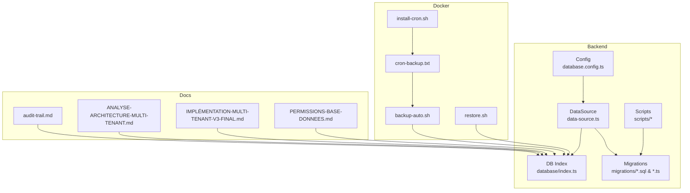

**Diagram sources**
- [database.config.ts](file://backend/src/config/database.config.ts)
- [data-source.ts](file://backend/src/database/data-source.ts)
- [index.ts](file://backend/src/database/index.ts)
- [050-multi-tenant-v3-max-etablissements.sql](file://backend/database/migrations/050-multi-tenant-v3-max-etablissements.sql)
- [080-preferences-utilisateur-multi-tenant.sql](file://backend/database/migrations/080-preferences-utilisateur-multi-tenant.sql)
- [091-peuplement-architecture-academique.sql](file://backend/database/migrations/091-peuplement-architecture-academique.sql)
- [audit-trail.md](file://backend/docs/audit-trail.md)
- [ANALYSE-ARCHITECTURE-MULTI-TENANT.md](file://docs/analyses/ANALYSE-ARCHITECTURE-MULTI-TENANT.md)
- [IMPLÉMENTATION-MULTI-TENANT-V3-FINAL.md](file://docs/implementations/IMPLÉMENTATION-MULTI-TENANT-V3-FINAL.md)
- [PERMISSIONS-BASE-DONNEES.md](file://docs/PERMISSIONS-BASE-DONNEES.md)
- [backup-auto.sh](file://docker/scripts/backup-auto.sh)
- [restore.sh](file://docker/scripts/restore.sh)
- [cron-backup.txt](file://docker/scripts/cron-backup.txt)
- [install-cron.sh](file://docker/scripts/install-cron.sh)

**Section sources**
- [database.config.ts](file://backend/src/config/database.config.ts)
- [data-source.ts](file://backend/src/database/data-source.ts)
- [index.ts](file://backend/src/database/index.ts)

## Core Components
- Data Source and Connection Pooling
  - The TypeORM DataSource is configured centrally and used across modules. It encapsulates connection settings, logging, and synchronization options.
  - Connection pool parameters are defined via environment-driven configuration to tune concurrency and resource usage.
- Migration Management
  - Migrations are stored as SQL and TypeScript files under backend/database/migrations. They evolve the schema incrementally and are executed by dedicated scripts.
  - Scripts orchestrate running pending migrations, applying indexes, and validating state.
- Multi-Tenant Isolation
  - Tenant scoping is enforced at the schema level through tenant identifiers on core entities and enforced via queries and middleware.
  - Preference and user-scoped configurations are isolated per tenant.
- Audit Trail
  - An audit trail module records changes to key entities for compliance and traceability.
- Performance Tooling
  - Index diagnostics and analysis scripts support ongoing performance tuning.

**Section sources**
- [data-source.ts](file://backend/src/database/data-source.ts)
- [run-migration.ts](file://backend/scripts/run-migration.ts)
- [run-pending-migrations.ts](file://backend/scripts/run-pending-migrations.ts)
- [050-multi-tenant-v3-max-etablissements.sql](file://backend/database/migrations/050-multi-tenant-v3-max-etablissements.sql)
- [080-preferences-utilisateur-multi-tenant.sql](file://backend/database/migrations/080-preferences-utilisateur-multi-tenant.sql)
- [audit-trail.md](file://backend/docs/audit-trail.md)
- [analyze-indexes.ts](file://backend/scripts/analyze-indexes.ts)

## Architecture Overview
The database architecture centers on a single PostgreSQL instance with TypeORM managing connections and migrations. Multi-tenancy is implemented by scoping all tenant-specific data to an establishment identifier. Migrations drive schema evolution, while operational scripts manage backups and index maintenance.

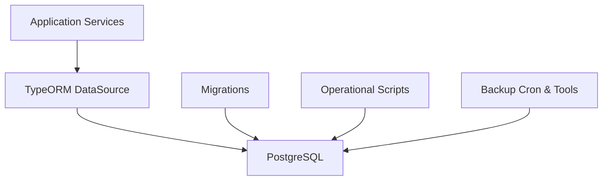

**Diagram sources**
- [data-source.ts](file://backend/src/database/data-source.ts)
- [run-migration.ts](file://backend/scripts/run-migration.ts)
- [backup-auto.sh](file://docker/scripts/backup-auto.sh)

## Detailed Component Analysis

### Multi-Tenant Data Isolation Strategy
- Schema-Level Scoping
  - Core entities include a tenant identifier column to isolate data per establishment.
  - Tenant-scoped preferences and user contexts ensure that operations default to the correct tenant context.
- Query Enforcement
  - Queries are constructed to always filter by tenant ID, preventing cross-tenant leakage.
- Migration Evidence
  - Dedicated migrations introduce or refine tenant scoping columns and constraints.

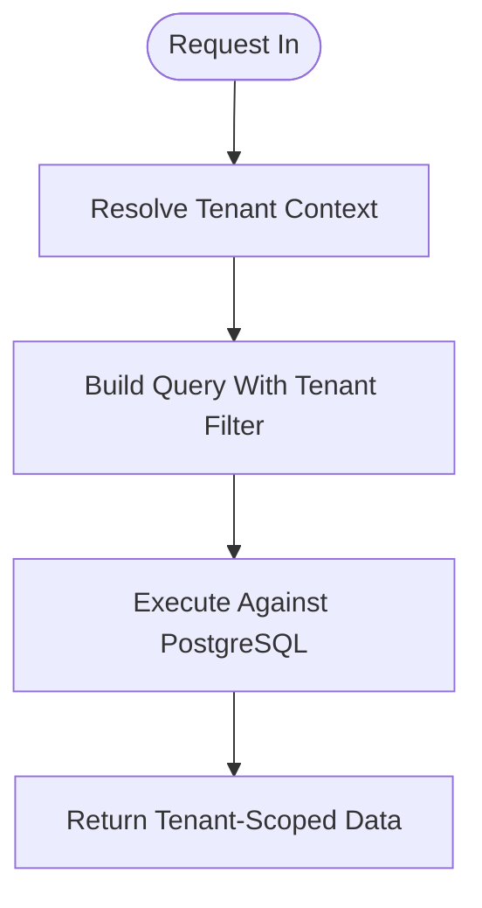

**Diagram sources**
- [050-multi-tenant-v3-max-etablissements.sql](file://backend/database/migrations/050-multi-tenant-v3-max-etablissements.sql)
- [080-preferences-utilisateur-multi-tenant.sql](file://backend/database/migrations/080-preferences-utilisateur-multi-tenant.sql)

**Section sources**
- [050-multi-tenant-v3-max-etablissements.sql](file://backend/database/migrations/050-multi-tenant-v3-max-etablissements.sql)
- [080-preferences-utilisateur-multi-tenant.sql](file://backend/database/migrations/080-preferences-utilisateur-multi-tenant.sql)
- [ANALYSE-ARCHITECTURE-MULTI-TENANT.md](file://docs/analyses/ANALYSE-ARCHITECTURE-MULTI-TENANT.md)
- [IMPLÉMENTATION-MULTI-TENANT-V3-FINAL.md](file://docs/implementations/IMPLÉMENTATION-MULTI-TENANT-V3-FINAL.md)

### Schema Design Patterns
- Entity Relationships
  - Academic structure entities are populated and related via migrations, establishing hierarchical relationships between cycles, levels, classes, and subjects.
- Enumerations and Types
  - Centralized enum definitions improve consistency across entities and reduce string drift.
- Reference Integrity
  - Foreign keys enforce referential integrity across related tables.

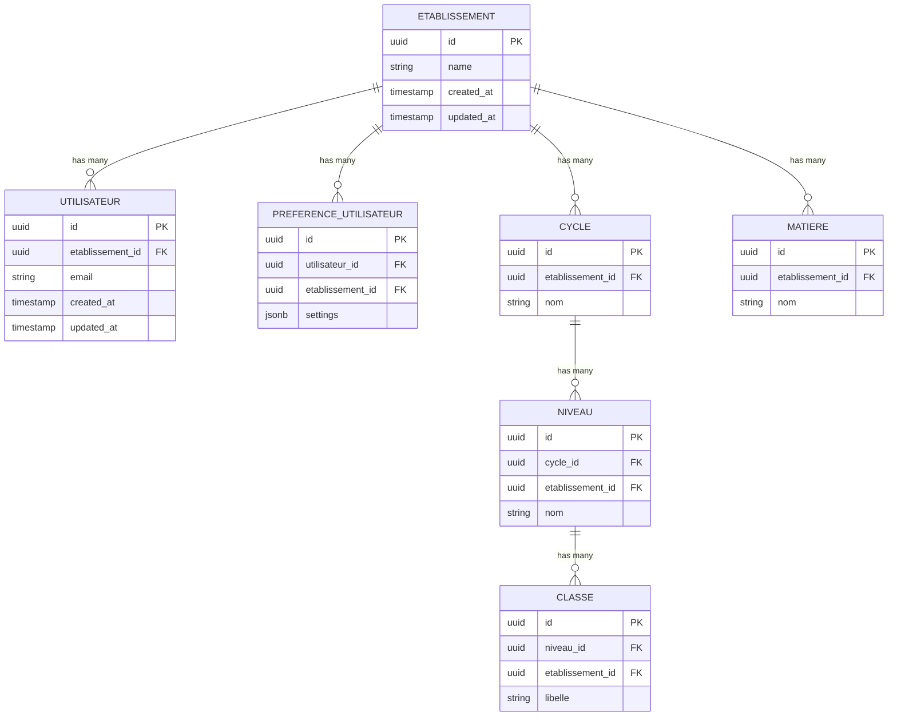

**Diagram sources**
- [091-peuplement-architecture-academique.sql](file://backend/database/migrations/091-peuplement-architecture-academique.sql)
- [080-preferences-utilisateur-multi-tenant.sql](file://backend/database/migrations/080-preferences-utilisateur-multi-tenant.sql)

**Section sources**
- [091-peuplement-architecture-academique.sql](file://backend/database/migrations/091-peuplement-architecture-academique.sql)
- [PERMISSIONS-BASE-DONNEES.md](file://docs/PERMISSIONS-BASE-DONNEES.md)

### Migration Management
- Execution Flow
  - Migrations are applied via scripts that discover pending changes and execute them against the database.
- Versioning and Rollbacks
  - Each migration is versioned; rollback procedures should be planned carefully for destructive changes.
- Validation and Diagnostics
  - Post-migration validation ensures schema consistency and enumerations are correctly registered.

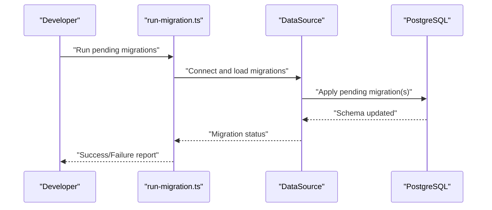

**Diagram sources**
- [run-migration.ts](file://backend/scripts/run-migration.ts)
- [run-pending-migrations.ts](file://backend/scripts/run-pending-migrations.ts)
- [data-source.ts](file://backend/src/database/data-source.ts)

**Section sources**
- [run-migration.ts](file://backend/scripts/run-migration.ts)
- [run-pending-migrations.ts](file://backend/scripts/run-pending-migrations.ts)
- [diagnose-enum.ts](file://backend/src/database/diagnose-enum.ts)

### Indexing Strategies and Query Optimization
- Index Creation and Maintenance
  - Indexes are added via migrations and scripts to optimize common query paths.
- Index Analysis
  - Analyze scripts help identify unused or redundant indexes and suggest improvements.
- Pagination and Load Testing
  - Load tests validate pagination performance under realistic workloads.

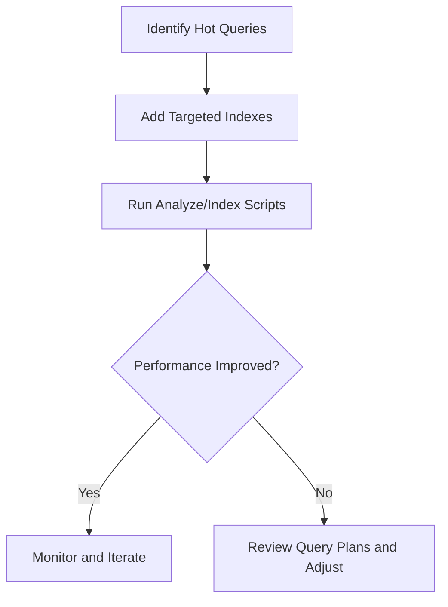

**Diagram sources**
- [run-indexes.sh](file://backend/scripts/run-indexes.sh)
- [analyze-indexes.ts](file://backend/scripts/analyze-indexes.ts)
- [load-test-pagination.ts](file://backend/scripts/load-test-pagination.ts)

**Section sources**
- [run-indexes.sh](file://backend/scripts/run-indexes.sh)
- [analyze-indexes.ts](file://backend/scripts/analyze-indexes.ts)
- [load-test-pagination.ts](file://backend/scripts/load-test-pagination.ts)

### Audit Trail Implementation
- Change Tracking
  - Audit entries record who changed what, when, and the nature of the change for critical entities.
- Storage and Retention
  - Audit logs are persisted separately to avoid impacting primary business transactions.
- Compliance and Reporting
  - Audit trails support compliance requirements and enable forensic analysis.

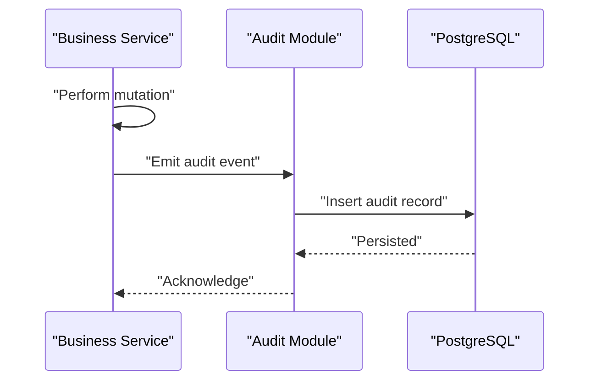

**Diagram sources**
- [audit-trail.md](file://backend/docs/audit-trail.md)
- [IMPLEMENTATION-AUDIT-TRAIL.md](file://docs/implementations/IMPLEMENTATION-AUDIT-TRAIL.md)

**Section sources**
- [audit-trail.md](file://backend/docs/audit-trail.md)
- [IMPLEMENTATION-AUDIT-TRAIL.md](file://docs/implementations/IMPLEMENTATION-AUDIT-TRAIL.md)

### Soft Delete Patterns and Data Versioning
- Soft Deletes
  - Entities use flags to mark records as deleted without removing them, preserving history and referential integrity.
- Versioning
  - Version fields or timestamps track updates to support optimistic concurrency control and auditing.

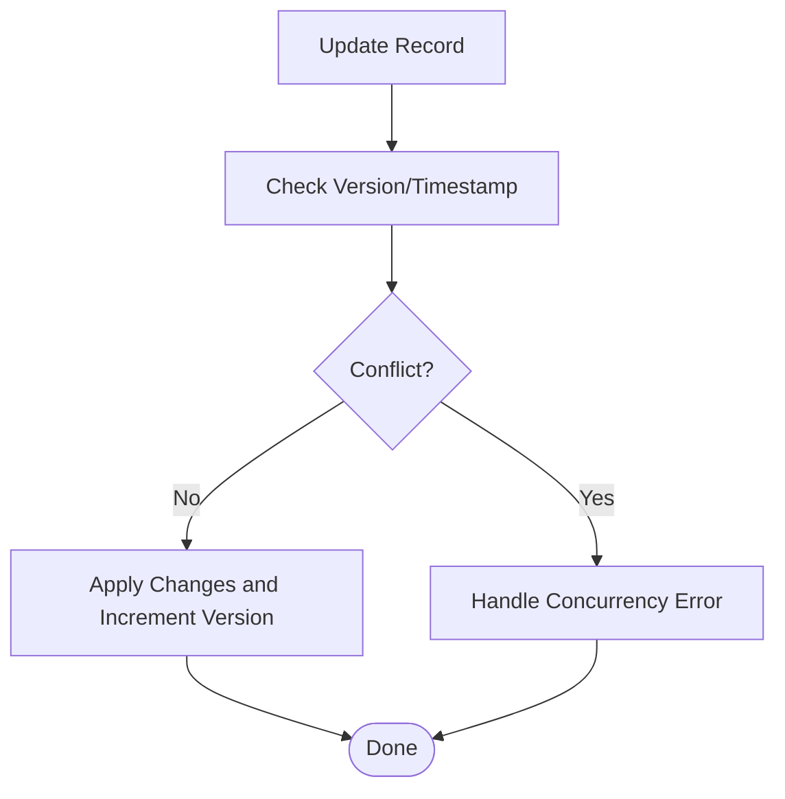

[No diagram sources since this section illustrates conceptual patterns]

### Transaction Management
- Atomic Operations
  - Critical workflows wrap multiple writes in transactions to ensure consistency.
- Error Handling
  - Failures trigger rollbacks to prevent partial updates.

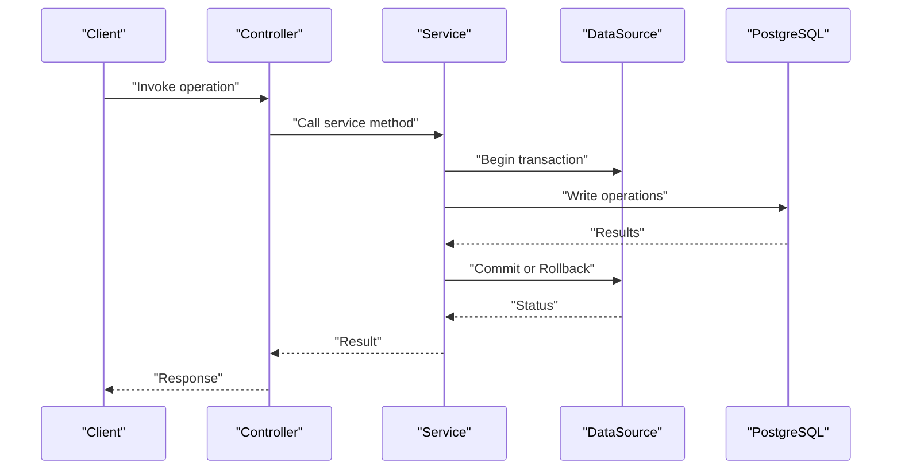

[No diagram sources since this section illustrates conceptual patterns]

### Backup and Restore Strategies
- Automated Backups
  - Cron jobs trigger automated backups to preserve data periodically.
- Manual Restores
  - Restore scripts facilitate recovery from backups during maintenance or incidents.

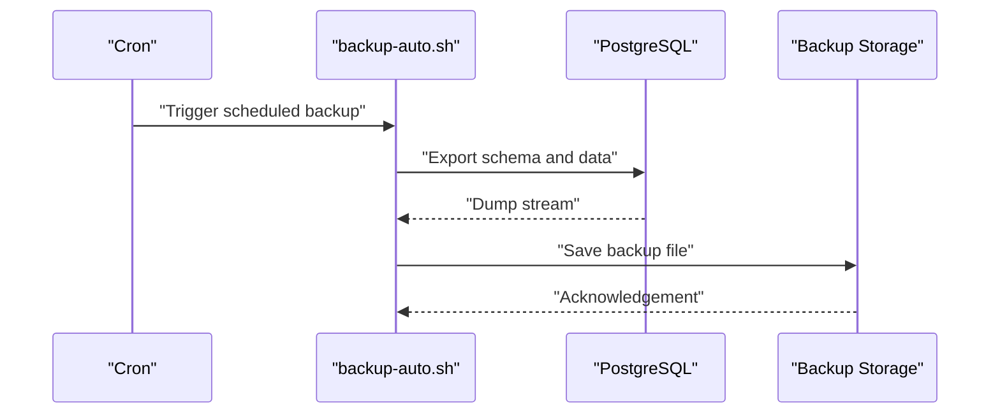

**Diagram sources**
- [cron-backup.txt](file://docker/scripts/cron-backup.txt)
- [backup-auto.sh](file://docker/scripts/backup-auto.sh)
- [restore.sh](file://docker/scripts/restore.sh)
- [install-cron.sh](file://docker/scripts/install-cron.sh)

**Section sources**
- [cron-backup.txt](file://docker/scripts/cron-backup.txt)
- [backup-auto.sh](file://docker/scripts/backup-auto.sh)
- [restore.sh](file://docker/scripts/restore.sh)
- [install-cron.sh](file://docker/scripts/install-cron.sh)

## Dependency Analysis
The database layer depends on configuration for connection settings, uses TypeORM DataSource for execution, and relies on migration scripts and operational utilities for lifecycle management.

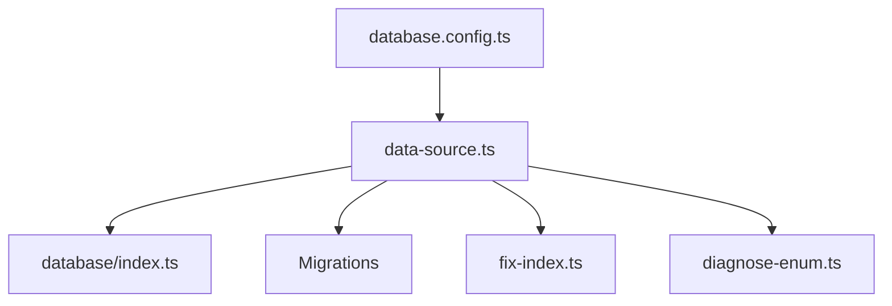

**Diagram sources**
- [database.config.ts](file://backend/src/config/database.config.ts)
- [data-source.ts](file://backend/src/database/data-source.ts)
- [index.ts](file://backend/src/database/index.ts)
- [fix-index.ts](file://backend/src/database/fix-index.ts)
- [diagnose-enum.ts](file://backend/src/database/diagnose-enum.ts)

**Section sources**
- [database.config.ts](file://backend/src/config/database.config.ts)
- [data-source.ts](file://backend/src/database/data-source.ts)
- [index.ts](file://backend/src/database/index.ts)
- [fix-index.ts](file://backend/src/database/fix-index.ts)
- [diagnose-enum.ts](file://backend/src/database/diagnose-enum.ts)

## Performance Considerations
- Connection Pool Tuning
  - Adjust pool size based on expected concurrency and database capacity.
- Indexing Strategy
  - Add targeted indexes for high-frequency queries; regularly analyze index usage.
- Query Optimization
  - Use pagination, selective field projection, and efficient joins.
- Monitoring and Diagnostics
  - Leverage diagnostic scripts to detect bottlenecks and plan optimizations.

[No sources needed since this section provides general guidance]

## Troubleshooting Guide
- Enum Diagnosis
  - Use the enum diagnosis script to verify enumeration registration and consistency.
- Index Issues
  - Use the index fix utility to address missing or duplicate indexes.
- Migration Failures
  - Inspect migration logs and re-run pending migrations after resolving issues.

**Section sources**
- [diagnose-enum.ts](file://backend/src/database/diagnose-enum.ts)
- [fix-index.ts](file://backend/src/database/fix-index.ts)
- [run-migration.ts](file://backend/scripts/run-migration.ts)

## Conclusion
The eLISA School database architecture leverages PostgreSQL and TypeORM with a robust multi-tenant strategy centered on tenant scoping at the schema and query layers. Migrations drive controlled schema evolution, while operational scripts support backups, restores, and performance maintenance. Audit trails and soft deletes enhance compliance and data integrity. Ongoing monitoring and index analysis ensure sustained performance and scalability.

## Appendices
- Key References
  - Multi-tenant analysis and implementation guides
  - Permissions and RBAC database design notes
  - Audit trail documentation

**Section sources**
- [ANALYSE-ARCHITECTURE-MULTI-TENANT.md](file://docs/analyses/ANALYSE-ARCHITECTURE-MULTI-TENANT.md)
- [IMPLÉMENTATION-MULTI-TENANT-V3-FINAL.md](file://docs/implementations/IMPLÉMENTATION-MULTI-TENANT-V3-FINAL.md)
- [PERMISSIONS-BASE-DONNEES.md](file://docs/PERMISSIONS-BASE-DONNEES.md)
- [audit-trail.md](file://backend/docs/audit-trail.md)