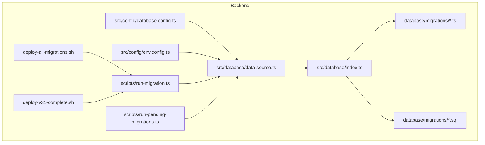
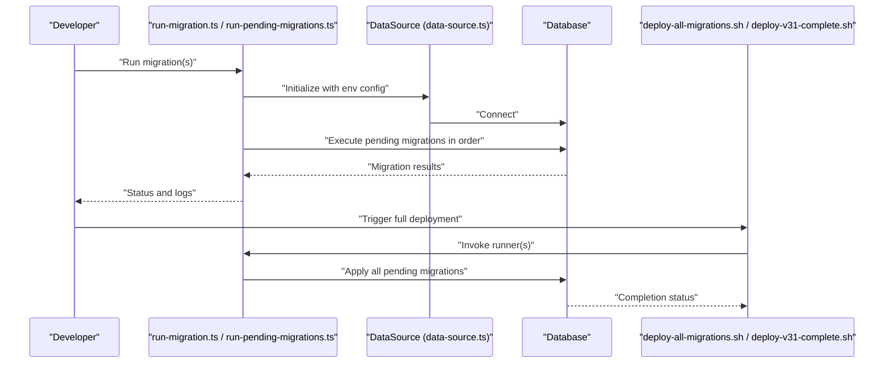
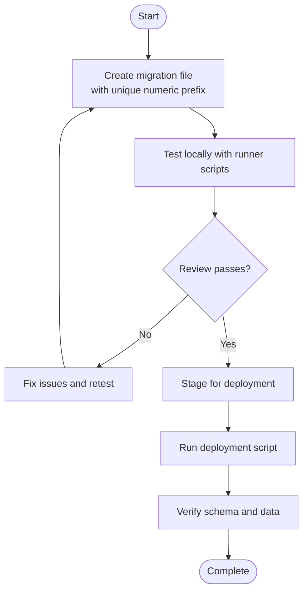
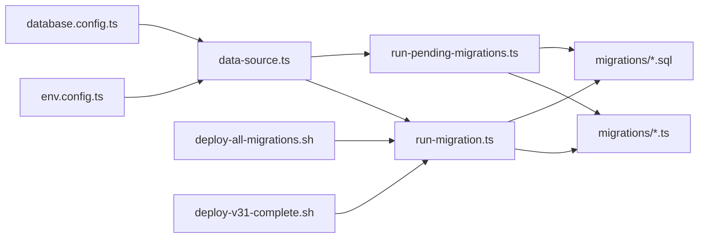

# Database Migrations & Version Control

<cite>
**Referenced Files in This Document**
- [backend/database/migrations/037-gamification-tracabilite.ts](file://backend/database/migrations/037-gamification-tracabilite.ts)
- [backend/database/migrations/043-correction-dossier-medical-fk.ts](file://backend/database/migrations/043-correction-dossier-medical-fk.ts)
- [backend/database/migrations/090-correction-migration-088-camelcase.sql](file://backend/database/migrations/090-correction-migration-088-camelcase.sql)
- [backend/database/migrations/050-multi-tenant-v3-max-etablissements.sql](file://backend/database/migrations/050-multi-tenant-v3-max-etablissements.sql)
- [backend/database/migrations/058-multi-tenant-structure-academique.sql](file://backend/database/migrations/058-multi-tenant-structure-academique.sql)
- [backend/database/migrations/080-preferences-utilisateur-multi-tenant.sql](file://backend/database/migrations/080-preferences-utilisateur-multi-tenant.sql)
- [backend/database/migrations/086-affectation-matiere-etablissement-id.sql](file://backend/database/migrations/086-affectation-matiere-etablissement-id.sql)
- [backend/database/migrations/105-migration-templates-v5.sql](file://backend/database/migrations/105-migration-templates-v5.sql)
- [backend/scripts/run-migration.ts](file://backend/scripts/run-migration.ts)
- [backend/scripts/run-pending-migrations.ts](file://backend/scripts/run-pending-migrations.ts)
- [backend/deploy-all-migrations.sh](file://backend/deploy-all-migrations.sh)
- [backend/deploy-v31-complete.sh](file://backend/deploy-v31-complete.sh)
- [scripts/deploy-migrations-phases.sh](file://scripts/deploy-migrations-phases.sh)
- [scripts/test-migrations-v2.sh](file://scripts/test-migrations-v2.sh)
- [backend/src/config/database.config.ts](file://backend/src/config/database.config.ts)
- [backend/src/config/env.config.ts](file://backend/src/config/env.config.ts)
- [backend/src/database/data-source.ts](file://backend/src/database/data-source.ts)
- [backend/src/database/index.ts](file://backend/src/database/index.ts)
- [backend/docs/pagination-migration-status.ts](file://backend/docs/pagination-migration-status.ts)
- [backend/database/MIGRATION-076-SUCCESS.md](file://backend/database/MIGRATION-076-SUCCESS.md)
- [backend/database/PERMISSIONS-GROUPES-SEED-UPDATE.md](file://backend/database/PERMISSIONS-GROUPES-SEED-UPDATE.md)
- [backend/database/README-075-GROUPES.md](file://backend/database/README-075-GROUPES.md)
</cite>

## Table of Contents
1. [Introduction](#introduction)
2. [Project Structure](#project-structure)
3. [Core Components](#core-components)
4. [Architecture Overview](#architecture-overview)
5. [Detailed Component Analysis](#detailed-component-analysis)
6. [Dependency Analysis](#dependency-analysis)
7. [Performance Considerations](#performance-considerations)
8. [Troubleshooting Guide](#troubleshooting-guide)
9. [Conclusion](#conclusion)
10. [Appendices](#appendices)

## Introduction
This document explains the database migration system used by the project, focusing on TypeORM-based migrations and SQL scripts. It covers file structure, naming conventions, execution order, lifecycle from creation to deployment, rollback procedures, conflict resolution, automation scripts, environment-specific configuration, testing strategies, common patterns (schema changes, data transformations, seed updates), best practices, error handling, debugging techniques, and multi-tenant considerations.

## Project Structure
Migrations are organized under backend/database/migrations and include both TypeScript files (TypeORM-style) and SQL files. Automation and deployment scripts live under backend/scripts and backend root, with additional orchestration scripts at the repository root. Configuration for the database connection and TypeORM DataSource is located under backend/src/config and backend/src/database.

**Diagram sources**
- [backend/src/config/database.config.ts](file://backend/src/config/database.config.ts)
- [backend/src/config/env.config.ts](file://backend/src/config/env.config.ts)
- [backend/src/database/data-source.ts](file://backend/src/database/data-source.ts)
- [backend/src/database/index.ts](file://backend/src/database/index.ts)
- [backend/scripts/run-migration.ts](file://backend/scripts/run-migration.ts)
- [backend/scripts/run-pending-migrations.ts](file://backend/scripts/run-pending-migrations.ts)
- [backend/deploy-all-migrations.sh](file://backend/deploy-all-migrations.sh)
- [backend/deploy-v31-complete.sh](file://backend/deploy-v31-complete.sh)

**Section sources**
- [backend/src/config/database.config.ts](file://backend/src/config/database.config.ts)
- [backend/src/config/env.config.ts](file://backend/src/config/env.config.ts)
- [backend/src/database/data-source.ts](file://backend/src/database/data-source.ts)
- [backend/src/database/index.ts](file://backend/src/database/index.ts)
- [backend/scripts/run-migration.ts](file://backend/scripts/run-migration.ts)
- [backend/scripts/run-pending-migrations.ts](file://backend/scripts/run-pending-migrations.ts)
- [backend/deploy-all-migrations.sh](file://backend/deploy-all-migrations.sh)
- [backend/deploy-v31-complete.sh](file://backend/deploy-v31-complete.sh)

## Core Components
- Migration files:
  - TypeScript migrations (TypeORM style) for complex logic or programmatic operations.
  - SQL migrations for direct schema and data changes.
- Execution scripts:
  - Node-based runners for executing specific or pending migrations.
  - Shell scripts for batch deployments and environment-specific runs.
- Configuration:
  - Environment variables and TypeORM DataSource settings that determine which migrations run and how they connect to the database.

Key responsibilities:
- Define versioned changes to schema and data.
- Provide idempotent and reversible operations where possible.
- Integrate with multi-tenant constraints and tenant-scoped data.

**Section sources**
- [backend/database/migrations/037-gamification-tracabilite.ts](file://backend/database/migrations/037-gamification-tracabilite.ts)
- [backend/database/migrations/043-correction-dossier-medical-fk.ts](file://backend/database/migrations/043-correction-dossier-medical-fk.ts)
- [backend/database/migrations/090-correction-migration-088-camelcase.sql](file://backend/database/migrations/090-correction-migration-088-camelcase.sql)
- [backend/database/migrations/050-multi-tenant-v3-max-etablissements.sql](file://backend/database/migrations/050-multi-tenant-v3-max-etablissements.sql)
- [backend/database/migrations/058-multi-tenant-structure-academique.sql](file://backend/database/migrations/058-multi-tenant-structure-academique.sql)
- [backend/database/migrations/080-preferences-utilisateur-multi-tenant.sql](file://backend/database/migrations/080-preferences-utilisateur-multi-tenant.sql)
- [backend/database/migrations/086-affectation-matiere-etablissement-id.sql](file://backend/database/migrations/086-affectation-matiere-etablissement-id.sql)
- [backend/database/migrations/105-migration-templates-v5.sql](file://backend/database/migrations/105-migration-templates-v5.sql)
- [backend/scripts/run-migration.ts](file://backend/scripts/run-migration.ts)
- [backend/scripts/run-pending-migrations.ts](file://backend/scripts/run-pending-migrations.ts)
- [backend/deploy-all-migrations.sh](file://backend/deploy-all-migrations.sh)
- [backend/deploy-v31-complete.sh](file://backend/deploy-v31-complete.sh)
- [backend/src/config/database.config.ts](file://backend/src/config/database.config.ts)
- [backend/src/config/env.config.ts](file://backend/src/config/env.config.ts)
- [backend/src/database/data-source.ts](file://backend/src/database/data-source.ts)
- [backend/src/database/index.ts](file://backend/src/database/index.ts)

## Architecture Overview
The migration subsystem integrates with TypeORM via a configured DataSource. Scripts invoke TypeORM CLI or custom runners to execute migrations in order. Deployment scripts wrap these commands for consistent environments.

**Diagram sources**
- [backend/scripts/run-migration.ts](file://backend/scripts/run-migration.ts)
- [backend/scripts/run-pending-migrations.ts](file://backend/scripts/run-pending-migrations.ts)
- [backend/src/database/data-source.ts](file://backend/src/database/data-source.ts)
- [backend/deploy-all-migrations.sh](file://backend/deploy-all-migrations.sh)
- [backend/deploy-v31-complete.sh](file://backend/deploy-v31-complete.sh)

## Detailed Component Analysis

### Migration File Structure and Naming Conventions
- Location: backend/database/migrations
- Formats:
  - TypeScript (.ts): Programmatic migrations using TypeORM APIs.
  - SQL (.sql): Direct SQL statements for schema and data changes.
- Naming:
  - Numeric prefix followed by descriptive name (e.g., 037-gamification-tracabilite.ts).
  - Order determined by numeric prefix; later numbers execute after earlier ones.
- Examples:
  - TypeScript: [037-gamification-tracabilite.ts](file://backend/database/migrations/037-gamification-tracabilite.ts), [043-correction-dossier-medical-fk.ts](file://backend/database/migrations/043-correction-dossier-medical-fk.ts)
  - SQL: [090-correction-migration-088-camelcase.sql](file://backend/database/migrations/090-correction-migration-088-camelcase.sql), [105-migration-templates-v5.sql](file://backend/database/migrations/105-migration-templates-v5.sql)

Best practices:
- Keep each migration focused on a single change set.
- Use clear, descriptive names.
- Ensure idempotency where feasible (e.g., conditional DDL/DML).

**Section sources**
- [backend/database/migrations/037-gamification-tracabilite.ts](file://backend/database/migrations/037-gamification-tracabilite.ts)
- [backend/database/migrations/043-correction-dossier-medical-fk.ts](file://backend/database/migrations/043-correction-dossier-medical-fk.ts)
- [backend/database/migrations/090-correction-migration-088-camelcase.sql](file://backend/database/migrations/090-correction-migration-088-camelcase.sql)
- [backend/database/migrations/105-migration-templates-v5.sql](file://backend/database/migrations/105-migration-templates-v5.sql)

### Execution Order and Lifecycle
- Order: Determined by numeric prefixes; lower numbers run first.
- Lifecycle:
  - Creation: Add a new .ts or .sql file with an incremented number.
  - Local development: Run targeted or pending migrations via scripts.
  - Testing: Validate against test databases using dedicated scripts.
  - Deployment: Use deployment scripts to apply all pending migrations consistently.
  - Rollback: Create a corrective migration if needed; avoid destructive rollbacks in production unless carefully planned.

[No sources needed since this diagram shows conceptual workflow, not actual code structure]

**Section sources**
- [backend/scripts/run-migration.ts](file://backend/scripts/run-migration.ts)
- [backend/scripts/run-pending-migrations.ts](file://backend/scripts/run-pending-migrations.ts)
- [backend/deploy-all-migrations.sh](file://backend/deploy-all-migrations.sh)
- [backend/deploy-v31-complete.sh](file://backend/deploy-v31-complete.sh)

### Automated Migration Scripts
- Node-based runners:
  - run-migration.ts: Executes specific or selected migrations.
  - run-pending-migrations.ts: Applies all pending migrations based on current state.
- Shell orchestrators:
  - deploy-all-migrations.sh: Applies all migrations in a controlled manner.
  - deploy-v31-complete.sh: Deploys a complete set for a specific version.
  - scripts/deploy-migrations-phases.sh: Phased deployment across groups.
  - scripts/test-migrations-v2.sh: Validates migrations in test scenarios.

Usage guidance:
- Prefer pending migrations during development to ensure forward-only progression.
- Use targeted runners when fixing a specific migration or running a subset.
- Wrap deployment scripts with pre/post checks (backup, validation).

**Section sources**
- [backend/scripts/run-migration.ts](file://backend/scripts/run-migration.ts)
- [backend/scripts/run-pending-migrations.ts](file://backend/scripts/run-pending-migrations.ts)
- [backend/deploy-all-migrations.sh](file://backend/deploy-all-migrations.sh)
- [backend/deploy-v31-complete.sh](file://backend/deploy-v31-complete.sh)
- [scripts/deploy-migrations-phases.sh](file://scripts/deploy-migrations-phases.sh)
- [scripts/test-migrations-v2.sh](file://scripts/test-migrations-v2.sh)

### Environment-Specific Configurations
- Configuration sources:
  - database.config.ts: Centralized database options.
  - env.config.ts: Environment variable loading and defaults.
  - data-source.ts: TypeORM DataSource initialization.
  - index.ts: Aggregation and export of database-related modules.
- Typical concerns:
  - Connection strings per environment.
  - Logging levels for migrations.
  - Feature flags controlling migration behavior.

Recommendations:
- Keep sensitive values out of source control.
- Validate required environment variables before running migrations.
- Use separate configs for dev, staging, and production.

**Section sources**
- [backend/src/config/database.config.ts](file://backend/src/config/database.config.ts)
- [backend/src/config/env.config.ts](file://backend/src/config/env.config.ts)
- [backend/src/database/data-source.ts](file://backend/src/database/data-source.ts)
- [backend/src/database/index.ts](file://backend/src/database/index.ts)

### Multi-Tenant Integration and Tenant-Specific Data
- Tenant scoping examples:
  - Adding tenant identifiers to tables and indexes.
  - Enforcing tenant isolation through constraints and queries.
  - Updating preferences and configurations scoped to tenants.
- Representative migrations:
  - [050-multi-tenant-v3-max-etablissements.sql](file://backend/database/migrations/050-multi-tenant-v3-max-etablissements.sql)
  - [058-multi-tenant-structure-academique.sql](file://backend/database/migrations/058-multi-tenant-structure-academique.sql)
  - [080-preferences-utilisateur-multi-tenant.sql](file://backend/database/migrations/080-preferences-utilisateur-multi-tenant.sql)
  - [086-affectation-matiere-etablissement-id.sql](file://backend/database/migrations/086-affectation-matiere-etablissement-id.sql)

Guidelines:
- Always include tenant context in DML operations.
- Add appropriate indexes for tenant-scoped queries.
- Validate existing data for tenant consistency during migrations.

**Section sources**
- [backend/database/migrations/050-multi-tenant-v3-max-etablissements.sql](file://backend/database/migrations/050-multi-tenant-v3-max-etablissements.sql)
- [backend/database/migrations/058-multi-tenant-structure-academique.sql](file://backend/database/migrations/058-multi-tenant-structure-academique.sql)
- [backend/database/migrations/080-preferences-utilisateur-multi-tenant.sql](file://backend/database/migrations/080-preferences-utilisateur-multi-tenant.sql)
- [backend/database/migrations/086-affectation-matiere-etablissement-id.sql](file://backend/database/migrations/086-affectation-matiere-etablissement-id.sql)

### Common Migration Patterns
- Schema changes:
  - Add/drop columns, indexes, constraints.
  - Rename entities safely with backward-compatible steps.
  - Example path: [090-correction-migration-088-camelcase.sql](file://backend/database/migrations/090-correction-migration-088-camelcase.sql)
- Data transformations:
  - Backfill missing fields, normalize values, fix inconsistencies.
  - Use transactions to maintain integrity.
  - Example paths:
    - [037-gamification-tracabilite.ts](file://backend/database/migrations/037-gamification-tracabilite.ts)
    - [043-correction-dossier-medical-fk.ts](file://backend/database/migrations/043-correction-dossier-medical-fk.ts)
- Seed data updates:
  - Populate reference data, permissions, templates.
  - Example paths:
    - [105-migration-templates-v5.sql](file://backend/database/migrations/105-migration-templates-v5.sql)
    - [PERMISSIONS-GROUPES-SEED-UPDATE.md](file://backend/database/PERMISSIONS-GROUPES-SEED-UPDATE.md)

**Section sources**
- [backend/database/migrations/090-correction-migration-088-camelcase.sql](file://backend/database/migrations/090-correction-migration-088-camelcase.sql)
- [backend/database/migrations/037-gamification-tracabilite.ts](file://backend/database/migrations/037-gamification-tracabilite.ts)
- [backend/database/migrations/043-correction-dossier-medical-fk.ts](file://backend/database/migrations/043-correction-dossier-medical-fk.ts)
- [backend/database/migrations/105-migration-templates-v5.sql](file://backend/database/migrations/105-migration-templates-v5.sql)
- [backend/database/PERMISSIONS-GROUPES-SEED-UPDATE.md](file://backend/database/PERMISSIONS-GROUPES-SEED-UPDATE.md)

### Rollback Procedures and Conflict Resolution
- Forward-only strategy:
  - Prefer creating corrective migrations rather than reversing previous ones.
  - Document intent and impact clearly.
- Conflict resolution:
  - If two branches introduce conflicting migrations, coordinate numbering and merge strategy.
  - Use targeted runners to validate partial sets during merges.
- Safety measures:
  - Backup before applying migrations in production.
  - Run tests post-migration to verify integrity.

Operational references:
- Targeted execution: [run-migration.ts](file://backend/scripts/run-migration.ts)
- Pending execution: [run-pending-migrations.ts](file://backend/scripts/run-pending-migrations.ts)
- Deployment wrappers: [deploy-all-migrations.sh](file://backend/deploy-all-migrations.sh), [deploy-v31-complete.sh](file://backend/deploy-v31-complete.sh)

**Section sources**
- [backend/scripts/run-migration.ts](file://backend/scripts/run-migration.ts)
- [backend/scripts/run-pending-migrations.ts](file://backend/scripts/run-pending-migrations.ts)
- [backend/deploy-all-migrations.sh](file://backend/deploy-all-migrations.sh)
- [backend/deploy-v31-complete.sh](file://backend/deploy-v31-complete.sh)

### Testing Strategies
- Validation scripts:
  - [test-migrations-v2.sh](file://scripts/test-migrations-v2.sh)
- Status tracking:
  - [pagination-migration-status.ts](file://backend/docs/pagination-migration-status.ts)
- Post-deployment verification:
  - Use targeted runners to assert expected schema and data states.
  - Combine with integration tests to validate business logic.

**Section sources**
- [scripts/test-migrations-v2.sh](file://scripts/test-migrations-v2.sh)
- [backend/docs/pagination-migration-status.ts](file://backend/docs/pagination-migration-status.ts)

### Best Practices
- Idempotency:
  - Guard DDL/DML with existence checks.
- Transactions:
  - Wrap multi-step migrations to ensure atomicity.
- Indexing:
  - Add indexes for tenant-scoped queries and performance-sensitive filters.
- Documentation:
  - Include README notes for complex migrations.
  - Example paths:
    - [MIGRATION-076-SUCCESS.md](file://backend/database/MIGRATION-076-SUCCESS.md)
    - [README-075-GROUPES.md](file://backend/database/README-075-GROUPES.md)

**Section sources**
- [backend/database/MIGRATION-076-SUCCESS.md](file://backend/database/MIGRATION-076-SUCCESS.md)
- [backend/database/README-075-GROUPES.md](file://backend/database/README-075-GROUPES.md)

## Dependency Analysis
The migration system depends on configuration and DataSource initialization. Scripts orchestrate execution and integrate with deployment pipelines.

**Diagram sources**
- [backend/src/config/env.config.ts](file://backend/src/config/env.config.ts)
- [backend/src/config/database.config.ts](file://backend/src/config/database.config.ts)
- [backend/src/database/data-source.ts](file://backend/src/database/data-source.ts)
- [backend/scripts/run-migration.ts](file://backend/scripts/run-migration.ts)
- [backend/scripts/run-pending-migrations.ts](file://backend/scripts/run-pending-migrations.ts)
- [backend/deploy-all-migrations.sh](file://backend/deploy-all-migrations.sh)
- [backend/deploy-v31-complete.sh](file://backend/deploy-v31-complete.sh)

**Section sources**
- [backend/src/config/env.config.ts](file://backend/src/config/env.config.ts)
- [backend/src/config/database.config.ts](file://backend/src/config/database.config.ts)
- [backend/src/database/data-source.ts](file://backend/src/database/data-source.ts)
- [backend/scripts/run-migration.ts](file://backend/scripts/run-migration.ts)
- [backend/scripts/run-pending-migrations.ts](file://backend/scripts/run-pending-migrations.ts)
- [backend/deploy-all-migrations.sh](file://backend/deploy-all-migrations.sh)
- [backend/deploy-v31-complete.sh](file://backend/deploy-v31-complete.sh)

## Performance Considerations
- Batch operations:
  - Process large datasets in chunks to avoid long-running transactions.
- Index management:
  - Add indexes judiciously; consider rebuild strategies for large tables.
- Monitoring:
  - Log migration durations and failures for observability.
- Tenant queries:
  - Ensure tenant-scoped queries leverage proper indexes to minimize overhead.

[No sources needed since this section provides general guidance]

## Troubleshooting Guide
Common issues and remedies:
- Migration conflicts:
  - Use targeted runners to isolate problematic migrations.
  - Coordinate numbering and merge strategies.
- Missing environment variables:
  - Validate env.config.ts inputs before running migrations.
- Data integrity errors:
  - Inspect transaction boundaries and constraint violations.
  - Re-run with detailed logging enabled.
- Multi-tenant anomalies:
  - Verify tenant IDs exist and constraints are enforced.
  - Check indexes for tenant-scoped queries.

Operational references:
- Runners: [run-migration.ts](file://backend/scripts/run-migration.ts), [run-pending-migrations.ts](file://backend/scripts/run-pending-migrations.ts)
- Deployment: [deploy-all-migrations.sh](file://backend/deploy-all-migrations.sh), [deploy-v31-complete.sh](file://backend/deploy-v31-complete.sh)
- Config: [database.config.ts](file://backend/src/config/database.config.ts), [env.config.ts](file://backend/src/config/env.config.ts), [data-source.ts](file://backend/src/database/data-source.ts)

**Section sources**
- [backend/scripts/run-migration.ts](file://backend/scripts/run-migration.ts)
- [backend/scripts/run-pending-migrations.ts](file://backend/scripts/run-pending-migrations.ts)
- [backend/deploy-all-migrations.sh](file://backend/deploy-all-migrations.sh)
- [backend/deploy-v31-complete.sh](file://backend/deploy-v31-complete.sh)
- [backend/src/config/database.config.ts](file://backend/src/config/database.config.ts)
- [backend/src/config/env.config.ts](file://backend/src/config/env.config.ts)
- [backend/src/database/data-source.ts](file://backend/src/database/data-source.ts)

## Conclusion
The migration system combines TypeORM-based TypeScript migrations and SQL scripts, orchestrated by Node and shell scripts. Clear naming, forward-only evolution, robust testing, and careful multi-tenant scoping ensure reliable deployments. Adopt best practices around idempotency, transactions, indexing, and documentation to maintain a healthy evolution of the database schema and data.

[No sources needed since this section summarizes without analyzing specific files]

## Appendices

### Quick Reference: Key Paths
- TypeScript migrations: [backend/database/migrations/*.ts](file://backend/database/migrations/037-gamification-tracabilite.ts)
- SQL migrations: [backend/database/migrations/*.sql](file://backend/database/migrations/090-correction-migration-088-camelcase.sql)
- Runners: [backend/scripts/run-migration.ts](file://backend/scripts/run-migration.ts), [backend/scripts/run-pending-migrations.ts](file://backend/scripts/run-pending-migrations.ts)
- Deployment: [backend/deploy-all-migrations.sh](file://backend/deploy-all-migrations.sh), [backend/deploy-v31-complete.sh](file://backend/deploy-v31-complete.sh)
- Config: [backend/src/config/database.config.ts](file://backend/src/config/database.config.ts), [backend/src/config/env.config.ts](file://backend/src/config/env.config.ts), [backend/src/database/data-source.ts](file://backend/src/database/data-source.ts)

**Section sources**
- [backend/database/migrations/037-gamification-tracabilite.ts](file://backend/database/migrations/037-gamification-tracabilite.ts)
- [backend/database/migrations/090-correction-migration-088-camelcase.sql](file://backend/database/migrations/090-correction-migration-088-camelcase.sql)
- [backend/scripts/run-migration.ts](file://backend/scripts/run-migration.ts)
- [backend/scripts/run-pending-migrations.ts](file://backend/scripts/run-pending-migrations.ts)
- [backend/deploy-all-migrations.sh](file://backend/deploy-all-migrations.sh)
- [backend/deploy-v31-complete.sh](file://backend/deploy-v31-complete.sh)
- [backend/src/config/database.config.ts](file://backend/src/config/database.config.ts)
- [backend/src/config/env.config.ts](file://backend/src/config/env.config.ts)
- [backend/src/database/data-source.ts](file://backend/src/database/data-source.ts)