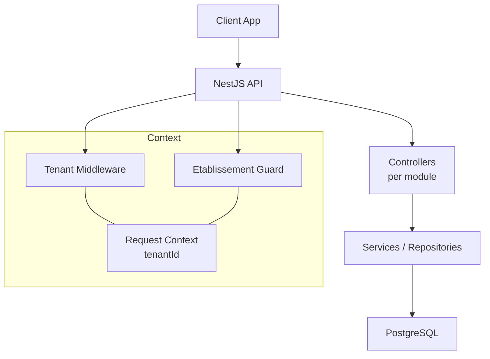
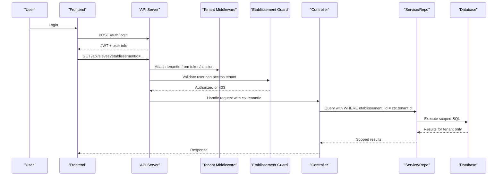
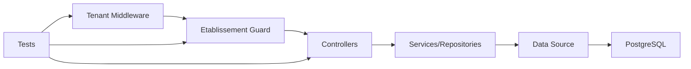

# Multi-Tenant Data Isolation Strategy

<cite>
**Referenced Files in This Document**
- [backend/src/common/middlewares/tenant.middleware.ts](file://backend/src/common/middlewares/tenant.middleware.ts)
- [backend/src/modules/auth/guards/etablissement.guard.ts](file://backend/src/modules/auth/guards/etablissement.guard.ts)
- [backend/src/modules/utilisateurs/services/utilisateur-etablissement.service.ts](file://backend/src/modules/utilisateurs/services/utilisateur-etablissement.service.ts)
- [backend/src/database/data-source.ts](file://backend/src/database/data-source.ts)
- [backend/src/config/database.config.ts](file://backend/src/config/database.config.ts)
- [backend/src/modules/eleves/controllers/eleves.controller.ts](file://backend/src/modules/eleves/controllers/eleves.controller.ts)
- [backend/src/modules/personnel/controllers/personnel.controller.ts](file://backend/src/modules/personnel/controllers/personnel.controller.ts)
- [backend/src/modules/finances/controllers/finances.controller.ts](file://backend/src/modules/finances/controllers/finances.controller.ts)
- [backend/src/modules/notes/controllers/notes.controller.ts](file://backend/src/modules/notes/controllers/notes.controller.ts)
- [backend/src/modules/annees-scolaires/controllers/annees-scolaires.controller.ts](file://backend/src/modules/annees-scolaires/controllers/annees-scolaires.controller.ts)
- [backend/src/modules/organisation/controllers/organisation.controller.ts](file://backend/src/modules/organisation/controllers/organisation.controller.ts)
- [backend/src/modules/groups-etablissements/controllers/groupes-etablissements.controller.ts](file://backend/src/modules/groups-etablissements/controllers/groupes-etablissements.controller.ts)
- [backend/src/modules/monitoring/controllers/monitoring.controller.ts](file://backend/src/modules/monitoring/controllers/monitoring.controller.ts)
- [backend/src/modules/audit/controllers/audit.controller.ts](file://backend/src/modules/audit/controllers/audit.controller.ts)
- [backend/src/modules/configuration/controllers/configuration.controller.ts](file://backend/src/modules/configuration/controllers/configuration.controller.ts)
- [backend/src/modules/types-enum/controllers/types-enum.controller.ts](file://backend/src/modules/types-enum/controllers/types-enum.controller.ts)
- [backend/src/modules/options/controllers/options.controller.ts](file://backend/src/modules/options/controllers/options.controller.ts)
- [backend/src/modules/apparence/controllers/apparence.controller.ts](file://backend/src/modules/apparence/controllers/apparence.controller.ts)
- [backend/src/modules/notifications/controllers/notifications.controller.ts](file://backend/src/modules/notifications/controllers/notifications.controller.ts)
- [backend/src/modules/salles/controllers/salles.controller.ts](file://backend/src/modules/salles/controllers/salles.controller.ts)
- [backend/src/modules/transport/controllers/transport.controller.ts](file://backend/src/modules/transport/controllers/transport.controller.ts)
- [backend/src/modules/cantine/controllers/cantine.controller.ts](file://backend/src/modules/cantine/controllers/cantine.controller.ts)
- [backend/src/modules/recrutement/controllers/recrutement.controller.ts](file://backend/src/modules/recrutement/controllers/recrutement.controller.ts)
- [backend/src/modules/paie/controllers/paie.controller.ts](file://backend/src/modules/paie/controllers/paie.controller.ts)
- [backend/src/modules/sante/controllers/sante.controller.ts](file://backend/src/modules/sante/controllers/sante.controller.ts)
- [backend/src/modules/emploi-du-temps/controllers/emploi-du-temps.controller.ts](file://backend/src/modules/emploi-du-temps/controllers/emploi-du-temps.controller.ts)
- [backend/src/modules/bulletins/controllers/bulletins.controller.ts](file://backend/src/modules/bulletins/controllers/bulletins.controller.ts)
- [backend/src/modules/examens-nationaux/controllers/examens-nationaux.controller.ts](file://backend/src/modules/examens-nationaux/controllers/examens-nationaux.controller.ts)
- [backend/src/modules/diplomes-eleves/controllers/diplomes-eleves.controller.ts](file://backend/src/modules/diplomes-eleves/controllers/diplomes-eleves.controller.ts)
- [backend/src/modules/scoring/controllers/scoring.controller.ts](file://backend/src/modules/scoring/controllers/scoring.controller.ts)
- [backend/src/modules/suivi-eleves/controllers/suivi-eleves.controller.ts](file://backend/src/modules/suivi-eleves/controllers/suivi-eleves.controller.ts)
- [backend/src/modules/suivi-personnel/controllers/suivi-personnel.controller.ts](file://backend/src/modules/suivi-personnel/controllers/suivi-personnel.controller.ts)
- [backend/src/modules/sondages/controllers/sondages.controller.ts](file://backend/src/modules/sondages/controllers/sondages.controller.ts)
- [backend/src/modules/annonces/controllers/annonces.controller.ts](file://backend/src/modules/annonces/controllers/annonces.controller.ts)
- [backend/src/modules/impressions/controllers/impressions.controller.ts](file://backend/src/modules/impressions/controllers/impressions.controller.ts)
- [backend/src/modules/cartes/controllers/cartes.controller.ts](file://backend/src/modules/cartes/controllers/cartes.controller.ts)
- [backend/src/modules/matieres/controllers/matieres.controller.ts](file://backend/src/modules/matieres/controllers/matieres.controller.ts)
- [backend/src/modules/niveaux/controllers/niveaux.controller.ts](file://backend/src/modules/niveaux/controllers/niveaux.controller.ts)
- [backend/src/modules/cycles/controllers/cycles.controller.ts](file://backend/src/modules/cycles/controllers/cycles.controller.ts)
- [backend/src/modules/fonctions/controllers/fonctions.controller.ts](file://backend/src/modules/fonctions/controllers/fonctions.controller.ts)
- [backend/src/modules/postes/controllers/postes.controller.ts](file://backend/src/modules/postes/controllers/postes.controller.ts)
- [backend/src/modules/programmes/controllers/programmes.controller.ts](file://backend/src/modules/programmes/controllers/programmes.controller.ts)
- [backend/src/modules/competences/controllers/competences.controller.ts](file://backend/src/modules/competences/controllers/competences.controller.ts)
- [backend/src/modules/specialites/controllers/specialites.controller.ts](file://backend/src/modules/specialites/controllers/specialites.controller.ts)
- [backend/src/modules/classe/controllers/classe.controller.ts](file://backend/src/modules/classe/controllers/classe.controller.ts)
- [backend/src/modules/responsables-eleves/controllers/responsables-eleves.controller.ts](file://backend/src/modules/responsables-eleves/controllers/responsables-eleves.controller.ts)
- [backend/src/modules/validation-workflow/controllers/validation-workflow.controller.ts](file://backend/src/modules/validation-workflow/controllers/validation-workflow.controller.ts)
- [backend/src/modules/requetes/controllers/requetes.controller.ts](file://backend/src/modules/requetes/controllers/requetes.controller.ts)
- [backend/src/modules/dev/controllers/dev.controller.ts](file://backend/src/modules/dev/controllers/dev.controller.ts)
- [backend/test/multi-tenant-isolation.test.ts](file://backend/test/multi-tenant-isolation.test.ts)
- [backend/test/integration/auth-multi-etablissement.spec.ts](file://backend/test/integration/auth-multi-etablissement.spec.ts)
- [backend/test/integration/configuration-multi-tenant.spec.ts](file://backend/test/integration/configuration-multi-tenant.spec.ts)
- [backend/scripts/run-migration.ts](file://backend/scripts/run-migration.ts)
- [docker/scripts/backup-auto.sh](file://docker/scripts/backup-auto.sh)
- [docker/scripts/restore.sh](file://docker/scripts/restore.sh)
- [docker/scripts/backup-manuel.sh](file://docker/scripts/backup-manuel.sh)
- [docker/scripts/install-cron.sh](file://docker/scripts/install-cron.sh)
- [docker/docker-compose.yml](file://docker/docker-compose.yml)
- [backend/docs/pagination-guide.md](file://backend/docs/pagination-guide.md)
- [docs/ANALYSE-ARCHITECTURE-MULTI-TENANT.md](file://docs/ANALYSE-ARCHITECTURE-MULTI-TENANT.md)
- [docs/IMPLÉMENTATION-MULTI-TENANT-V3-FINAL.md](file://docs/IMPLÉMENTATION-MULTI-TENANT-V3-FINAL.md)
- [docs/CORRECTIONS-COHERENCE-MULTI-TENANT.md](file://docs/CORRECTIONS-COHERENCE-MULTI-TENANT.md)
</cite>

## Table of Contents
1. [Introduction](#introduction)
2. [Project Structure](#project-structure)
3. [Core Components](#core-components)
4. [Architecture Overview](#architecture-overview)
5. [Detailed Component Analysis](#detailed-component-analysis)
6. [Dependency Analysis](#dependency-analysis)
7. [Performance Considerations](#performance-considerations)
8. [Troubleshooting Guide](#troubleshooting-guide)
9. [Conclusion](#conclusion)
10. [Appendices](#appendices)

## Introduction
This document explains the multi-tenant data isolation strategy used by eLISAschool to keep each educational institution’s data strictly separated. The system relies on a tenant identifier (etablissement_id) as a foreign key across the schema, combined with middleware and guards that enforce per-tenant scoping for all requests. It covers request context propagation, automatic filtering patterns, security implications, access control, cross-tenant restrictions, examples of tenant-scoped queries, bulk operations, administrative overrides, backup and restore procedures, migration strategies, and performance considerations for large-scale deployments.

## Project Structure
The multi-tenant implementation spans several layers:
- Middleware and guards inject and validate tenant context
- Controllers apply tenant filters consistently
- Database configuration supports connection-level scoping when needed
- Tests verify isolation boundaries
- Scripts support backups, restores, and migrations

[No sources needed since this diagram shows conceptual workflow, not actual code structure]

## Core Components
- Tenant middleware: Extracts or validates etablissement_id from authenticated sessions/tokens and attaches it to the request context for downstream use.
- Etablissement guard: Enforces that the current user is authorized to operate within the target tenant before controller execution.
- Controller-level scoping: All controllers include tenant-aware query builders or repository calls that filter by etablissement_id.
- Database configuration: Centralized TypeORM setup ensures consistent connection behavior and optional connection parameters for tenant-specific routing if required.
- Tests: Integration and unit tests assert that cross-tenant access is denied and tenant-scoped queries return only expected rows.

Key responsibilities:
- Establish tenant identity early in the request lifecycle
- Propagate tenant context through services and repositories
- Prevent accidental or malicious cross-tenant reads/writes
- Provide admin-only pathways for cross-tenant operations when explicitly allowed

**Section sources**
- [backend/src/common/middlewares/tenant.middleware.ts](file://backend/src/common/middlewares/tenant.middleware.ts)
- [backend/src/modules/auth/guards/etablissement.guard.ts](file://backend/src/modules/auth/guards/etablissement.guard.ts)
- [backend/src/database/data-source.ts](file://backend/src/database/data-source.ts)
- [backend/src/config/database.config.ts](file://backend/src/config/database.config.ts)
- [backend/test/multi-tenant-isolation.test.ts](file://backend/test/multi-tenant-isolation.test.ts)

## Architecture Overview
The architecture enforces tenant isolation at multiple layers:
- Authentication layer resolves user roles and associated tenants
- Authorization layer validates the requested tenant against user permissions
- Request pipeline injects tenant context into the active request
- Controllers and services apply tenant filters automatically
- Database constraints and indexes ensure referential integrity and performance

**Diagram sources**
- [backend/src/common/middlewares/tenant.middleware.ts](file://backend/src/common/middlewares/tenant.middleware.ts)
- [backend/src/modules/auth/guards/etablissement.guard.ts](file://backend/src/modules/auth/guards/etablissement.guard.ts)
- [backend/src/modules/eleves/controllers/eleves.controller.ts](file://backend/src/modules/eleves/controllers/eleves.controller.ts)

## Detailed Component Analysis

### Tenant Middleware
Responsibilities:
- Parse tenant identifier from authentication payload or session
- Validate presence and format
- Attach tenant context to the request object for downstream consumers
- Fail fast with clear errors when tenant context is missing or invalid

Security considerations:
- Never trust client-supplied tenant IDs without server-side validation
- Ensure middleware runs before authorization and business logic

Operational notes:
- Centralizes tenant extraction so controllers remain clean
- Enables consistent error handling and logging for tenant resolution failures

**Section sources**
- [backend/src/common/middlewares/tenant.middleware.ts](file://backend/src/common/middlewares/tenant.middleware.ts)

### Etablissement Guard
Responsibilities:
- Verify that the authenticated user has permission to access the specified tenant
- Reject requests attempting to operate outside permitted tenants
- Integrate with RBAC to allow super-admin or platform-admin bypass where appropriate

Access control patterns:
- Role-based checks combined with tenant membership
- Explicit allowlists for administrative operations
- Deny-by-default posture for cross-tenant actions

**Section sources**
- [backend/src/modules/auth/guards/etablissement.guard.ts](file://backend/src/modules/auth/guards/etablissement.guard.ts)

### User-Etablissement Service
Responsibilities:
- Resolve which tenants a user belongs to
- Provide helper methods to check tenant membership and role within a tenant
- Support switching contexts during login flows or admin dashboards

Integration points:
- Used by guards and middleware to determine valid tenant scopes
- Exposed to controllers for UI-driven tenant selection

**Section sources**
- [backend/src/modules/utilisateurs/services/utilisateur-etablissement.service.ts](file://backend/src/modules/utilisateurs/services/utilisateur-etablissement.service.ts)

### Database Configuration and Data Source
Responsibilities:
- Configure TypeORM connections and options
- Optionally set connection-level parameters for tenant routing or read replicas
- Ensure consistent transaction and isolation settings

Performance and reliability:
- Connection pooling tuned for multi-tenant workloads
- Optional schema hints or search_path adjustments if using schema-per-tenant patterns

**Section sources**
- [backend/src/database/data-source.ts](file://backend/src/database/data-source.ts)
- [backend/src/config/database.config.ts](file://backend/src/config/database.config.ts)

### Controller-Level Scoping Examples
All controllers must scope queries by etablissement_id unless explicitly overridden by an admin operation. Typical patterns:
- List endpoints: add WHERE etablissement_id = ctx.tenantId
- Create endpoints: set etablissement_id from ctx.tenantId
- Update/Delete endpoints: verify resource belongs to ctx.tenantId before mutation
- Aggregations and exports: maintain tenant filter throughout joins and groupings

Examples by module:
- Academic and student data: eleves.controller.ts
- Personnel and HR: personnel.controller.ts
- Financials: finances.controller.ts
- Grades and evaluations: notes.controller.ts
- School year management: annees-scolaires.controller.ts
- Organization settings: organisation.controller.ts
- Groups of establishments: groupes-etablissements.controller.ts
- Monitoring and audit: monitoring.controller.ts, audit.controller.ts
- Configuration and preferences: configuration.controller.ts, types-enum.controller.ts, options.controller.ts, apparence.controller.ts
- Notifications and communications: notifications.controller.ts
- Facilities and logistics: salles.controller.ts, transport.controller.ts, cantine.controller.ts
- Recruitment and payroll: recrutement.controller.ts, paie.controller.ts
- Health and scheduling: sante.controller.ts, emploi-du-temps.controller.ts
- Reports and documents: bulletins.controller.ts, examens-nationaux.controller.ts, diplomes-eleves.controller.ts
- Gamification and tracking: scoring.controller.ts, suivi-eleves.controller.ts, suivi-personnel.controller.ts
- Surveys and announcements: sondages.controller.ts, annonces.controller.ts
- Printing and cards: impressions.controller.ts, cartes.controller.ts
- Academic structure: matieres.controller.ts, niveaux.controller.ts, cycles.controller.ts, fonctions.controller.ts, postes.controller.ts, programmes.controller.ts, competences.controller.ts, specialites.controller.ts, classe.controller.ts
- Parent relationships: responsables-eleves.controller.ts
- Validation workflows: validation-workflow.controller.ts
- Custom queries: requetes.controller.ts
- Development utilities: dev.controller.ts

Note: Each controller should be reviewed to ensure no direct queries bypass the tenant filter.

**Section sources**
- [backend/src/modules/eleves/controllers/eleves.controller.ts](file://backend/src/modules/eleves/controllers/eleves.controller.ts)
- [backend/src/modules/personnel/controllers/personnel.controller.ts](file://backend/src/modules/personnel/controllers/personnel.controller.ts)
- [backend/src/modules/finances/controllers/finances.controller.ts](file://backend/src/modules/finances/controllers/finances.controller.ts)
- [backend/src/modules/notes/controllers/notes.controller.ts](file://backend/src/modules/notes/controllers/notes.controller.ts)
- [backend/src/modules/annees-scolaires/controllers/annees-scolaires.controller.ts](file://backend/src/modules/annees-scolaires/controllers/annees-scolaires.controller.ts)
- [backend/src/modules/organisation/controllers/organisation.controller.ts](file://backend/src/modules/organisation/controllers/organisation.controller.ts)
- [backend/src/modules/groups-etablissements/controllers/groupes-etablissements.controller.ts](file://backend/src/modules/groups-etablissements/controllers/groupes-etablissements.controller.ts)
- [backend/src/modules/monitoring/controllers/monitoring.controller.ts](file://backend/src/modules/monitoring/controllers/monitoring.controller.ts)
- [backend/src/modules/audit/controllers/audit.controller.ts](file://backend/src/modules/audit/controllers/audit.controller.ts)
- [backend/src/modules/configuration/controllers/configuration.controller.ts](file://backend/src/modules/configuration/controllers/configuration.controller.ts)
- [backend/src/modules/types-enum/controllers/types-enum.controller.ts](file://backend/src/modules/types-enum/controllers/types-enum.controller.ts)
- [backend/src/modules/options/controllers/options.controller.ts](file://backend/src/modules/options/controllers/options.controller.ts)
- [backend/src/modules/apparence/controllers/apparence.controller.ts](file://backend/src/modules/apparence/controllers/apparence.controller.ts)
- [backend/src/modules/notifications/controllers/notifications.controller.ts](file://backend/src/modules/notifications/controllers/notifications.controller.ts)
- [backend/src/modules/salles/controllers/salles.controller.ts](file://backend/src/modules/salles/controllers/salles.controller.ts)
- [backend/src/modules/transport/controllers/transport.controller.ts](file://backend/src/modules/transport/controllers/transport.controller.ts)
- [backend/src/modules/cantine/controllers/cantine.controller.ts](file://backend/src/modules/cantine/controllers/cantine.controller.ts)
- [backend/src/modules/recrutement/controllers/recrutement.controller.ts](file://backend/src/modules/recrutement/controllers/recrutement.controller.ts)
- [backend/src/modules/paie/controllers/paie.controller.ts](file://backend/src/modules/paie/controllers/paie.controller.ts)
- [backend/src/modules/sante/controllers/sante.controller.ts](file://backend/src/modules/sante/controllers/sante.controller.ts)
- [backend/src/modules/emploi-du-temps/controllers/emploi-du-temps.controller.ts](file://backend/src/modules/emploi-du-temps/controllers/emploi-du-temps.controller.ts)
- [backend/src/modules/bulletins/controllers/bulletins.controller.ts](file://backend/src/modules/bulletins/controllers/bulletins.controller.ts)
- [backend/src/modules/examens-nationaux/controllers/examens-nationaux.controller.ts](file://backend/src/modules/examens-nationaux/controllers/examens-nationaux.controller.ts)
- [backend/src/modules/diplomes-eleves/controllers/diplomes-eleves.controller.ts](file://backend/src/modules/diplomes-eleves/controllers/diplomes-eleves.controller.ts)
- [backend/src/modules/scoring/controllers/scoring.controller.ts](file://backend/src/modules/scoring/controllers/scoring.controller.ts)
- [backend/src/modules/suivi-eleves/controllers/suivi-eleves.controller.ts](file://backend/src/modules/suivi-eleves/controllers/suivi-eleves.controller.ts)
- [backend/src/modules/suivi-personnel/controllers/suivi-personnel.controller.ts](file://backend/src/modules/suivi-personnel/controllers/suivi-personnel.controller.ts)
- [backend/src/modules/sondages/controllers/sondages.controller.ts](file://backend/src/modules/sondages/controllers/sondages.controller.ts)
- [backend/src/modules/annonces/controllers/annonces.controller.ts](file://backend/src/modules/annonces/controllers/annonces.controller.ts)
- [backend/src/modules/impressions/controllers/impressions.controller.ts](file://backend/src/modules/impressions/controllers/impressions.controller.ts)
- [backend/src/modules/cartes/controllers/cartes.controller.ts](file://backend/src/modules/cartes/controllers/cartes.controller.ts)
- [backend/src/modules/matieres/controllers/matieres.controller.ts](file://backend/src/modules/matieres/controllers/matieres.controller.ts)
- [backend/src/modules/niveaux/controllers/niveaux.controller.ts](file://backend/src/modules/niveaux/controllers/niveaux.controller.ts)
- [backend/src/modules/cycles/controllers/cycles.controller.ts](file://backend/src/modules/cycles/controllers/cycles.controller.ts)
- [backend/src/modules/fonctions/controllers/fonctions.controller.ts](file://backend/src/modules/fonctions/controllers/fonctions.controller.ts)
- [backend/src/modules/postes/controllers/postes.controller.ts](file://backend/src/modules/postes/controllers/postes.controller.ts)
- [backend/src/modules/programmes/controllers/programmes.controller.ts](file://backend/src/modules/programmes/controllers/programmes.controller.ts)
- [backend/src/modules/competences/controllers/competences.controller.ts](file://backend/src/modules/competences/controllers/competences.controller.ts)
- [backend/src/modules/specialites/controllers/specialites.controller.ts](file://backend/src/modules/specialites/controllers/specialites.controller.ts)
- [backend/src/modules/classe/controllers/classe.controller.ts](file://backend/src/modules/classe/controllers/classe.controller.ts)
- [backend/src/modules/responsables-eleves/controllers/responsables-eleves.controller.ts](file://backend/src/modules/responsables-eleves/controllers/responsables-eleves.controller.ts)
- [backend/src/modules/validation-workflow/controllers/validation-workflow.controller.ts](file://backend/src/modules/validation-workflow/controllers/validation-workflow.controller.ts)
- [backend/src/modules/requetes/controllers/requetes.controller.ts](file://backend/src/modules/requetes/controllers/requetes.controller.ts)
- [backend/src/modules/dev/controllers/dev.controller.ts](file://backend/src/modules/dev/controllers/dev.controller.ts)

### Cross-Tenant Operations and Administrative Overrides
Allowed scenarios:
- Super-admin or platform-admin users may perform cross-tenant operations via explicit endpoints
- Admin dashboards must require elevated roles and log all cross-tenant actions
- Bulk operations across tenants should be executed through dedicated batch endpoints with strict auditing

Restrictions:
- Default deny for any cross-tenant read/write
- No implicit tenant leakage via shared caches or background jobs; always re-resolve tenant context

**Section sources**
- [backend/src/modules/auth/guards/etablissement.guard.ts](file://backend/src/modules/auth/guards/etablissement.guard.ts)
- [backend/src/modules/monitoring/controllers/monitoring.controller.ts](file://backend/src/modules/monitoring/controllers/monitoring.controller.ts)
- [backend/src/modules/audit/controllers/audit.controller.ts](file://backend/src/modules/audit/controllers/audit.controller.ts)

### Tenant-Scoped Queries and Bulk Operations
Patterns:
- Always include WHERE etablissement_id = ctx.tenantId in queries
- For bulk operations, iterate over tenants with explicit admin authorization and per-tenant transactions
- Use pagination helpers to avoid memory pressure on large datasets

References:
- Pagination guidance for efficient tenant-scoped listing
- Example test asserting tenant isolation

**Section sources**
- [backend/docs/pagination-guide.md](file://backend/docs/pagination-guide.md)
- [backend/test/multi-tenant-isolation.test.ts](file://backend/test/multi-tenant-isolation.test.ts)

### Security Implications and Access Control Patterns
- Enforce tenant identity at the edge (middleware) and validate at the gate (guard)
- Apply least privilege: default deny cross-tenant access
- Audit all admin and cross-tenant operations
- Avoid sharing state between tenants (caches, queues, file storage paths)
- Validate all inputs and reject malformed tenant identifiers

**Section sources**
- [backend/src/common/middlewares/tenant.middleware.ts](file://backend/src/common/middlewares/tenant.middleware.ts)
- [backend/src/modules/auth/guards/etablissement.guard.ts](file://backend/src/modules/auth/guards/etablissement.guard.ts)

### Backup and Restore Procedures for Individual Tenants
Approaches:
- Logical backups filtered by etablissement_id for tenant-specific dumps
- Full database backups for disaster recovery
- Automated cron-based backups and manual triggers

Operational scripts:
- Automated daily backups
- Manual backup trigger
- Restore procedure for full or partial restoration
- Cron installation for scheduled tasks

Docker integration:
- Compose configuration for backup volumes and persistence

**Section sources**
- [docker/scripts/backup-auto.sh](file://docker/scripts/backup-auto.sh)
- [docker/scripts/backup-manuel.sh](file://docker/scripts/backup-manuel.sh)
- [docker/scripts/restore.sh](file://docker/scripts/restore.sh)
- [docker/scripts/install-cron.sh](file://docker/scripts/install-cron.sh)
- [docker/docker-compose.yml](file://docker/docker-compose.yml)

### Migration Strategies for Tenant-Specific Schemas
- Use migration scripts to add or modify columns and indexes related to tenant scoping
- Run migrations in controlled environments and verify tenant isolation post-deploy
- Maintain backward compatibility during rollout of new tenant fields

**Section sources**
- [backend/scripts/run-migration.ts](file://backend/scripts/run-migration.ts)

### Performance Considerations for Large-Scale Deployments
- Indexing: Ensure composite indexes on frequently filtered columns including etablissement_id
- Query optimization: Prefer selective filters and avoid N+1 queries
- Connection pooling: Tune pool size based on tenant concurrency
- Pagination: Use cursor or offset pagination consistently
- Caching: Cache tenant-scoped aggregates with proper invalidation
- Background jobs: Scope jobs by tenant and limit throughput per tenant

**Section sources**
- [backend/docs/pagination-guide.md](file://backend/docs/pagination-guide.md)

## Dependency Analysis
The following diagram illustrates how core components depend on each other to enforce multi-tenant isolation.

**Diagram sources**
- [backend/src/common/middlewares/tenant.middleware.ts](file://backend/src/common/middlewares/tenant.middleware.ts)
- [backend/src/modules/auth/guards/etablissement.guard.ts](file://backend/src/modules/auth/guards/etablissement.guard.ts)
- [backend/src/database/data-source.ts](file://backend/src/database/data-source.ts)
- [backend/test/multi-tenant-isolation.test.ts](file://backend/test/multi-tenant-isolation.test.ts)

**Section sources**
- [backend/src/common/middlewares/tenant.middleware.ts](file://backend/src/common/middlewares/tenant.middleware.ts)
- [backend/src/modules/auth/guards/etablissement.guard.ts](file://backend/src/modules/auth/guards/etablissement.guard.ts)
- [backend/src/database/data-source.ts](file://backend/src/database/data-source.ts)
- [backend/test/multi-tenant-isolation.test.ts](file://backend/test/multi-tenant-isolation.test.ts)

## Performance Considerations
- Add composite indexes on (etablissement_id, primary_key) for hot tables
- Use pagination for list endpoints to reduce payload sizes
- Monitor slow queries and optimize joins to avoid scanning non-tenant rows
- Separate read replicas for reporting if necessary, ensuring tenant filters are applied at the query level
- Limit bulk operations to off-peak hours and throttle per-tenant throughput

[No sources needed since this section provides general guidance]

## Troubleshooting Guide
Common issues and resolutions:
- Missing tenant context: Ensure middleware runs before guards and controllers; verify token/session contains tenant information
- Cross-tenant access detected: Check guard logic and controller filters; confirm RBAC assignments
- Slow queries: Inspect indexes on tenant-scoped columns; review query plans
- Backup/restore failures: Validate credentials, volume mounts, and cron schedules

Diagnostic references:
- Integration tests for multi-tenant auth and configuration
- Isolation tests to detect leaks

**Section sources**
- [backend/test/integration/auth-multi-etablissement.spec.ts](file://backend/test/integration/auth-multi-etablissement.spec.ts)
- [backend/test/integration/configuration-multi-tenant.spec.ts](file://backend/test/integration/configuration-multi-tenant.spec.ts)
- [backend/test/multi-tenant-isolation.test.ts](file://backend/test/multi-tenant-isolation.test.ts)

## Conclusion
eLISAschool implements robust multi-tenant isolation by combining middleware-based tenant resolution, guard-enforced authorization, and pervasive tenant filtering in controllers and services. The approach minimizes risk of cross-tenant data exposure while supporting administrative overrides with strong auditing. With careful indexing, pagination, and operational practices around backups and migrations, the system scales effectively for large numbers of institutions.

[No sources needed since this section summarizes without analyzing specific files]

## Appendices

### A. Reference Documentation
- Architectural analysis of multi-tenant design
- Final implementation details for v3
- Coherence corrections for multi-tenant consistency

**Section sources**
- [docs/ANALYSE-ARCHITECTURE-MULTI-TENANT.md](file://docs/ANALYSE-ARCHITECTURE-MULTI-TENANT.md)
- [docs/IMPLÉMENTATION-MULTI-TENANT-V3-FINAL.md](file://docs/IMPLÉMENTATION-MULTI-TENANT-V3-FINAL.md)
- [docs/CORRECTIONS-COHERENCE-MULTI-TENANT.md](file://docs/CORRECTIONS-COHERENCE-MULTI-TENANT.md)

### B. Operational Scripts and Docker Integration
- Automated and manual backup scripts
- Restore script for disaster recovery
- Cron installation for scheduled backups
- Docker Compose configuration for persistent volumes and services

**Section sources**
- [docker/scripts/backup-auto.sh](file://docker/scripts/backup-auto.sh)
- [docker/scripts/backup-manuel.sh](file://docker/scripts/backup-manuel.sh)
- [docker/scripts/restore.sh](file://docker/scripts/restore.sh)
- [docker/scripts/install-cron.sh](file://docker/scripts/install-cron.sh)
- [docker/docker-compose.yml](file://docker/docker-compose.yml)