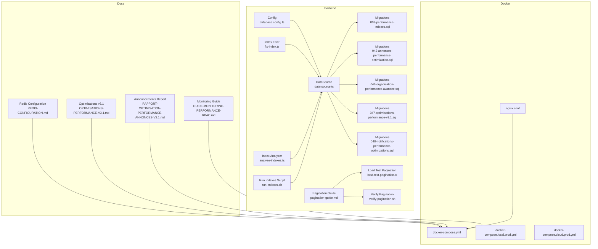
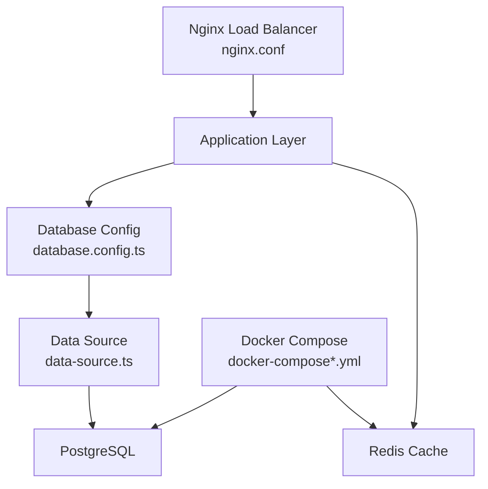
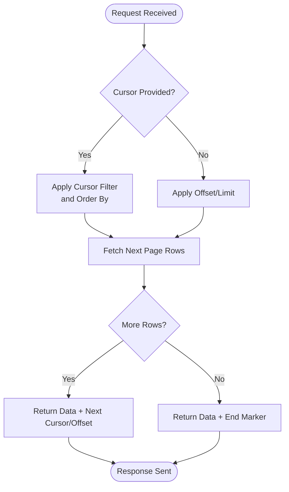
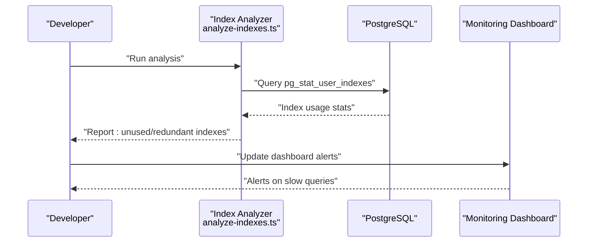
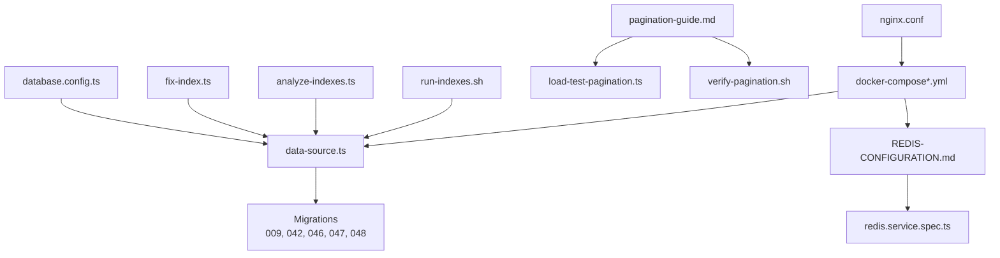

# Performance Optimization & Indexing

<cite>
**Referenced Files in This Document**
- [database.config.ts](file://backend/src/config/database.config.ts)
- [data-source.ts](file://backend/src/database/data-source.ts)
- [009-performance-indexes.sql](file://backend/database/migrations/009-performance-indexes.sql)
- [042-annonces-performance-optimization.sql](file://backend/database/migrations/042-annonces-performance-optimization.sql)
- [046-organisation-performance-avancee.sql](file://backend/database/migrations/046-organisation-performance-avancee.sql)
- [047-optimisations-performance-v3.1.sql](file://backend/database/migrations/047-optimisations-performance-v3.1.sql)
- [048-notifications-performance-optimizations.sql](file://backend/database/migrations/048-notifications-performance-optimizations.sql)
- [fix-index.ts](file://backend/src/database/fix-index.ts)
- [analyze-indexes.ts](file://backend/scripts/analyze-indexes.ts)
- [run-indexes.sh](file://backend/scripts/run-indexes.sh)
- [pagination-guide.md](file://backend/docs/pagination-guide.md)
- [load-test-pagination.ts](file://backend/scripts/load-test-pagination.ts)
- [verify-pagination.sh](file://backend/scripts/verify-pagination.sh)
- [redis.service.spec.ts](file://backend/test/unit/redis.service.spec.ts)
- [REDIS-CONFIGURATION.md](file://docs/autres/REDIS-CONFIGURATION.md)
- [docker-compose.yml](file://docker/docker-compose.yml)
- [docker-compose.local.prod.yml](file://docker/docker-compose.local.prod.yml)
- [docker-compose.cloud.prod.yml](file://docker/docker-compose.cloud.prod.yml)
- [nginx.conf](file://docker/nginx.conf)
- [OPTIMISATIONS-PERFORMANCE-V3.1.md](file://docs/OPTIMISATIONS-PERFORMANCE-V3.1.md)
- [RAPPORT-OPTIMISATION-PERFORMANCE-ANNONCES-V2.1.md](file://docs/rapports/RAPPORT-OPTIMISATION-PERFORMANCE-ANNONCES-V2.1.md)
- [GUIDE-MONITORING-PERFORMANCE-RBAC.md](file://docs/guides/GUIDE-MONITORING-PERFORMANCE-RBAC.md)
</cite>

## Table of Contents
1. [Introduction](#introduction)
2. [Project Structure](#project-structure)
3. [Core Components](#core-components)
4. [Architecture Overview](#architecture-overview)
5. [Detailed Component Analysis](#detailed-component-analysis)
6. [Dependency Analysis](#dependency-analysis)
7. [Performance Considerations](#performance-considerations)
8. [Troubleshooting Guide](#troubleshooting-guide)
9. [Conclusion](#conclusion)
10. [Appendices](#appendices)

## Introduction
This document provides a comprehensive guide to database performance optimization in eLISAschool. It covers indexing strategies for high-frequency queries, composite indexes for complex joins, query optimization techniques, pagination implementations (cursor-based and offset-based), connection pooling configuration, query caching with Redis integration, monitoring tools for slow query detection and index usage analysis, performance profiling, scaling considerations including read replicas and load balancing, and guidelines for writing efficient queries while avoiding N+1 problems.

## Project Structure
The backend organizes performance-related assets across migrations, scripts, documentation, and configuration:
- Migrations define indexes and optimizations for specific modules (announcements, organization, notifications).
- Scripts provide utilities to analyze indexes, run index maintenance, and test pagination under load.
- Documentation includes guides on pagination, Redis configuration, and performance monitoring.
- Docker Compose files configure the runtime environment, including database and optional Redis.

**Diagram sources**
- [database.config.ts](file://backend/src/config/database.config.ts)
- [data-source.ts](file://backend/src/database/data-source.ts)
- [009-performance-indexes.sql](file://backend/database/migrations/009-performance-indexes.sql)
- [042-annonces-performance-optimization.sql](file://backend/database/migrations/042-annonces-performance-optimization.sql)
- [046-organisation-performance-avancee.sql](file://backend/database/migrations/046-organisation-performance-avancee.sql)
- [047-optimisations-performance-v3.1.sql](file://backend/database/migrations/047-optimisations-performance-v3.1.sql)
- [048-notifications-performance-optimizations.sql](file://backend/database/migrations/048-notifications-performance-optimizations.sql)
- [fix-index.ts](file://backend/src/database/fix-index.ts)
- [analyze-indexes.ts](file://backend/scripts/analyze-indexes.ts)
- [run-indexes.sh](file://backend/scripts/run-indexes.sh)
- [pagination-guide.md](file://backend/docs/pagination-guide.md)
- [load-test-pagination.ts](file://backend/scripts/load-test-pagination.ts)
- [verify-pagination.sh](file://backend/scripts/verify-pagination.sh)
- [REDIS-CONFIGURATION.md](file://docs/autres/REDIS-CONFIGURATION.md)
- [OPTIMISATIONS-PERFORMANCE-V3.1.md](file://docs/OPTIMISATIONS-PERFORMANCE-V3.1.md)
- [RAPPORT-OPTIMISATION-PERFORMANCE-ANNONCES-V2.1.md](file://docs/rapports/RAPPORT-OPTIMISATION-PERFORMANCE-ANNONCES-V2.1.md)
- [GUIDE-MONITORING-PERFORMANCE-RBAC.md](file://docs/guides/GUIDE-MONITORING-PERFORMANCE-RBAC.md)
- [docker-compose.yml](file://docker/docker-compose.yml)
- [docker-compose.local.prod.yml](file://docker/docker-compose.local.prod.yml)
- [docker-compose.cloud.prod.yml](file://docker/docker-compose.cloud.prod.yml)
- [nginx.conf](file://docker/nginx.conf)

**Section sources**
- [database.config.ts](file://backend/src/config/database.config.ts)
- [data-source.ts](file://backend/src/database/data-source.ts)
- [009-performance-indexes.sql](file://backend/database/migrations/009-performance-indexes.sql)
- [042-annonces-performance-optimization.sql](file://backend/database/migrations/042-annonces-performance-optimization.sql)
- [046-organisation-performance-avancee.sql](file://backend/database/migrations/046-organisation-performance-avancee.sql)
- [047-optimisations-performance-v3.1.sql](file://backend/database/migrations/047-optimisations-performance-v3.1.sql)
- [048-notifications-performance-optimizations.sql](file://backend/database/migrations/048-notifications-performance-optimizations.sql)
- [fix-index.ts](file://backend/src/database/fix-index.ts)
- [analyze-indexes.ts](file://backend/scripts/analyze-indexes.ts)
- [run-indexes.sh](file://backend/scripts/run-indexes.sh)
- [pagination-guide.md](file://backend/docs/pagination-guide.md)
- [load-test-pagination.ts](file://backend/scripts/load-test-pagination.ts)
- [verify-pagination.sh](file://backend/scripts/verify-pagination.sh)
- [REDIS-CONFIGURATION.md](file://docs/autres/REDIS-CONFIGURATION.md)
- [OPTIMISATIONS-PERFORMANCE-V3.1.md](file://docs/OPTIMISATIONS-PERFORMANCE-V3.1.md)
- [RAPPORT-OPTIMISATION-PERFORMANCE-ANNONCES-V2.1.md](file://docs/rapports/RAPPORT-OPTIMISATION-PERFORMANCE-ANNONCES-V2.1.md)
- [GUIDE-MONITORING-PERFORMANCE-RBAC.md](file://docs/guides/GUIDE-MONITORING-PERFORMANCE-RBAC.md)
- [docker-compose.yml](file://docker/docker-compose.yml)
- [docker-compose.local.prod.yml](file://docker/docker-compose.local.prod.yml)
- [docker-compose.cloud.prod.yml](file://docker/docker-compose.cloud.prod.yml)
- [nginx.conf](file://docker/nginx.conf)

## Core Components
- Database configuration and connection pooling are defined in the configuration module and data source setup. These control pool size, timeouts, and retry behavior.
- Indexing migrations target high-frequency queries and complex joins across announcements, organization, and notifications modules.
- Utilities exist to fix duplicate or missing indexes and to analyze index usage patterns.
- Pagination is documented and tested via dedicated scripts and tests.
- Redis configuration and unit tests validate caching behavior.
- Docker Compose files orchestrate services including database and optional Redis.

Key responsibilities:
- Define connection parameters and pool settings.
- Apply performance-focused indexes through migrations.
- Provide operational scripts for index maintenance and analysis.
- Implement and verify pagination strategies.
- Integrate Redis for caching and performance enhancement.
- Configure infrastructure for scalability and load distribution.

**Section sources**
- [database.config.ts](file://backend/src/config/database.config.ts)
- [data-source.ts](file://backend/src/database/data-source.ts)
- [009-performance-indexes.sql](file://backend/database/migrations/009-performance-indexes.sql)
- [042-annonces-performance-optimization.sql](file://backend/database/migrations/042-annonces-performance-optimization.sql)
- [046-organisation-performance-avancee.sql](file://backend/database/migrations/046-organisation-performance-avancee.sql)
- [047-optimisations-performance-v3.1.sql](file://backend/database/migrations/047-optimisations-performance-v3.1.sql)
- [048-notifications-performance-optimizations.sql](file://backend/database/migrations/048-notifications-performance-optimizations.sql)
- [fix-index.ts](file://backend/src/database/fix-index.ts)
- [analyze-indexes.ts](file://backend/scripts/analyze-indexes.ts)
- [run-indexes.sh](file://backend/scripts/run-indexes.sh)
- [pagination-guide.md](file://backend/docs/pagination-guide.md)
- [load-test-pagination.ts](file://backend/scripts/load-test-pagination.ts)
- [verify-pagination.sh](file://backend/scripts/verify-pagination.sh)
- [redis.service.spec.ts](file://backend/test/unit/redis.service.spec.ts)
- [REDIS-CONFIGURATION.md](file://docs/autres/REDIS-CONFIGURATION.md)
- [docker-compose.yml](file://docker/docker-compose.yml)
- [docker-compose.local.prod.yml](file://docker/docker-compose.local.prod.yml)
- [docker-compose.cloud.prod.yml](file://docker/docker-compose.cloud.prod.yml)
- [nginx.conf](file://docker/nginx.conf)

## Architecture Overview
The performance architecture integrates application-level configuration, database schema optimizations, caching via Redis, and infrastructure orchestration.

**Diagram sources**
- [database.config.ts](file://backend/src/config/database.config.ts)
- [data-source.ts](file://backend/src/database/data-source.ts)
- [docker-compose.yml](file://docker/docker-compose.yml)
- [docker-compose.local.prod.yml](file://docker/docker-compose.local.prod.yml)
- [docker-compose.cloud.prod.yml](file://docker/docker-compose.cloud.prod.yml)
- [nginx.conf](file://docker/nginx.conf)

## Detailed Component Analysis

### Indexing Strategies for High-Frequency Queries
- Targeted indexes are created in migrations to accelerate common filters and sorts.
- Announcements module includes performance optimizations tailored to frequent listing and filtering operations.
- Organization module defines advanced performance indexes for hierarchical and multi-tenant queries.
- Notifications module adds indexes to support real-time and bulk operations.

Recommendations:
- Align indexes with actual query predicates and sort orders.
- Prefer B-tree indexes for equality and range conditions; consider partial indexes when applicable.
- Monitor index bloat and rebuild as needed using provided scripts.

**Section sources**
- [009-performance-indexes.sql](file://backend/database/migrations/009-performance-indexes.sql)
- [042-annonces-performance-optimization.sql](file://backend/database/migrations/042-annonces-performance-optimization.sql)
- [046-organisation-performance-avancee.sql](file://backend/database/migrations/046-organisation-performance-avancee.sql)
- [047-optimisations-performance-v3.1.sql](file://backend/database/migrations/047-optimisations-performance-v3.1.sql)
- [048-notifications-performance-optimizations.sql](file://backend/database/migrations/048-notifications-performance-optimizations.sql)
- [fix-index.ts](file://backend/src/database/fix-index.ts)
- [analyze-indexes.ts](file://backend/scripts/analyze-indexes.ts)
- [run-indexes.sh](file://backend/scripts/run-indexes.sh)

### Composite Indexes for Complex Joins
- Composite indexes should be designed around join keys and filter columns that appear together in WHERE clauses.
- Ensure leading columns match the most selective predicates to maximize index utilization.
- Validate plan changes after adding composite indexes using explain plans and monitoring tools.

Guidelines:
- Use composite indexes for multi-column filters and order by combinations.
- Avoid redundant indexes that overlap significantly with existing ones.
- Periodically review index usage statistics to remove unused indexes.

[No sources needed since this section provides general guidance]

### Query Optimization Techniques
- Prefer selective filters and avoid functions on indexed columns in WHERE clauses.
- Use LIMIT and OFFSET judiciously; prefer cursor-based pagination for deep paging.
- Minimize SELECT * and fetch only required columns.
- Leverage EXISTS instead of IN where appropriate for large subqueries.
- Normalize frequently joined tables and ensure foreign keys are indexed.

Operational checks:
- Use explain plans to confirm index usage.
- Track slow queries and refactor hot paths.
- Batch updates and deletes to reduce lock contention.

[No sources needed since this section provides general guidance]

### Pagination Implementations
- Offset-based pagination is suitable for small pages and stable datasets.
- Cursor-based pagination improves performance for large datasets and unstable ordering.
- The project includes documentation and tests validating both approaches.

Implementation references:
- Pagination guide outlines best practices and API design.
- Load test script exercises pagination endpoints under realistic loads.
- Verification script ensures correctness and performance thresholds.

**Diagram sources**
- [pagination-guide.md](file://backend/docs/pagination-guide.md)
- [load-test-pagination.ts](file://backend/scripts/load-test-pagination.ts)
- [verify-pagination.sh](file://backend/scripts/verify-pagination.sh)

**Section sources**
- [pagination-guide.md](file://backend/docs/pagination-guide.md)
- [load-test-pagination.ts](file://backend/scripts/load-test-pagination.ts)
- [verify-pagination.sh](file://backend/scripts/verify-pagination.sh)

### Connection Pooling Configuration
- Connection pool size should align with expected concurrency and database capacity.
- Tune idle timeouts and maximum lifetime to prevent stale connections.
- Enable retries and backoff for transient failures.

Configuration references:
- Database configuration module centralizes pool settings.
- Data source initialization applies these settings at runtime.

Best practices:
- Monitor active/idle connections and adjust pool size based on metrics.
- Separate read/write pools if using read replicas.
- Use health checks to detect pool exhaustion early.

**Section sources**
- [database.config.ts](file://backend/src/config/database.config.ts)
- [data-source.ts](file://backend/src/database/data-source.ts)

### Query Caching Strategies and Redis Integration
- Cache expensive reads and frequently accessed aggregates behind Redis.
- Use cache invalidation strategies tied to write operations.
- Set TTLs appropriate to data freshness requirements.

Integration references:
- Redis configuration document describes service setup and options.
- Unit tests validate caching behavior and error handling.

Caching patterns:
- Read-through cache for entity lookups.
- Write-behind cache for non-critical aggregates.
- Cache busting on mutations affecting cached keys.

**Section sources**
- [REDIS-CONFIGURATION.md](file://docs/autres/REDIS-CONFIGURATION.md)
- [redis.service.spec.ts](file://backend/test/unit/redis.service.spec.ts)

### Monitoring Tools for Slow Query Detection and Index Usage Analysis
- Enable slow query logging and collect execution plans.
- Use index analyzer scripts to identify unused or redundant indexes.
- Maintain dashboards for query latency and throughput.

Operational references:
- Index analyzer script provides insights into index usage.
- Run indexes script helps maintain healthy indexes.
- Monitoring guide outlines instrumentation and alerting.

**Diagram sources**
- [analyze-indexes.ts](file://backend/scripts/analyze-indexes.ts)
- [run-indexes.sh](file://backend/scripts/run-indexes.sh)
- [GUIDE-MONITORING-PERFORMANCE-RBAC.md](file://docs/guides/GUIDE-MONITORING-PERFORMANCE-RBAC.md)

**Section sources**
- [analyze-indexes.ts](file://backend/scripts/analyze-indexes.ts)
- [run-indexes.sh](file://backend/scripts/run-indexes.sh)
- [GUIDE-MONITORING-PERFORMANCE-RBAC.md](file://docs/guides/GUIDE-MONITORING-PERFORMANCE-RBAC.md)

### Performance Profiling
- Profile application code paths interacting with the database.
- Correlate application traces with database slow logs.
- Identify N+1 queries and batch operations.

Profiling approach:
- Instrument critical endpoints with timing metrics.
- Export metrics to observability stack.
- Review profiles regularly during development and staging.

[No sources needed since this section provides general guidance]

### Scaling Considerations: Read Replicas and Load Balancing
- Deploy read replicas to offload read-heavy workloads.
- Route read queries to replicas and writes to primary.
- Use load balancers to distribute traffic across application instances.

Infrastructure references:
- Docker Compose files define service topology and networking.
- Nginx configuration supports reverse proxy and load balancing.

Scaling checklist:
- Partition databases by tenant or feature if necessary.
- Implement circuit breakers and rate limiting.
- Plan capacity based on peak loads and growth projections.

**Section sources**
- [docker-compose.yml](file://docker/docker-compose.yml)
- [docker-compose.local.prod.yml](file://docker/docker-compose.local.prod.yml)
- [docker-compose.cloud.prod.yml](file://docker/docker-compose.cloud.prod.yml)
- [nginx.conf](file://docker/nginx.conf)

### Guidelines for Writing Efficient Queries and Avoiding N+1 Problems
- Use JOINs instead of multiple round trips for related entities.
- Aggregate data server-side when possible.
- Employ batching for bulk operations.
- Audit ORM-generated queries and replace with optimized raw SQL when needed.

Practical steps:
- Enable query logging in development to spot N+1 patterns.
- Refactor loops that issue per-item queries into single batched queries.
- Cache computed aggregates and invalidate on changes.

[No sources needed since this section provides general guidance]

## Dependency Analysis
The performance subsystem depends on configuration, migrations, scripts, and infrastructure definitions.

**Diagram sources**
- [database.config.ts](file://backend/src/config/database.config.ts)
- [data-source.ts](file://backend/src/database/data-source.ts)
- [009-performance-indexes.sql](file://backend/database/migrations/009-performance-indexes.sql)
- [042-annonces-performance-optimization.sql](file://backend/database/migrations/042-annonces-performance-optimization.sql)
- [046-organisation-performance-avancee.sql](file://backend/database/migrations/046-organisation-performance-avancee.sql)
- [047-optimisations-performance-v3.1.sql](file://backend/database/migrations/047-optimisations-performance-v3.1.sql)
- [048-notifications-performance-optimizations.sql](file://backend/database/migrations/048-notifications-performance-optimizations.sql)
- [fix-index.ts](file://backend/src/database/fix-index.ts)
- [analyze-indexes.ts](file://backend/scripts/analyze-indexes.ts)
- [run-indexes.sh](file://backend/scripts/run-indexes.sh)
- [pagination-guide.md](file://backend/docs/pagination-guide.md)
- [load-test-pagination.ts](file://backend/scripts/load-test-pagination.ts)
- [verify-pagination.sh](file://backend/scripts/verify-pagination.sh)
- [REDIS-CONFIGURATION.md](file://docs/autres/REDIS-CONFIGURATION.md)
- [redis.service.spec.ts](file://backend/test/unit/redis.service.spec.ts)
- [docker-compose.yml](file://docker/docker-compose.yml)
- [docker-compose.local.prod.yml](file://docker/docker-compose.local.prod.yml)
- [docker-compose.cloud.prod.yml](file://docker/docker-compose.cloud.prod.yml)
- [nginx.conf](file://docker/nginx.conf)

**Section sources**
- [database.config.ts](file://backend/src/config/database.config.ts)
- [data-source.ts](file://backend/src/database/data-source.ts)
- [009-performance-indexes.sql](file://backend/database/migrations/009-performance-indexes.sql)
- [042-annonces-performance-optimization.sql](file://backend/database/migrations/042-annonces-performance-optimization.sql)
- [046-organisation-performance-avancee.sql](file://backend/database/migrations/046-organisation-performance-avancee.sql)
- [047-optimisations-performance-v3.1.sql](file://backend/database/migrations/047-optimisations-performance-v3.1.sql)
- [048-notifications-performance-optimizations.sql](file://backend/database/migrations/048-notifications-performance-optimizations.sql)
- [fix-index.ts](file://backend/src/database/fix-index.ts)
- [analyze-indexes.ts](file://backend/scripts/analyze-indexes.ts)
- [run-indexes.sh](file://backend/scripts/run-indexes.sh)
- [pagination-guide.md](file://backend/docs/pagination-guide.md)
- [load-test-pagination.ts](file://backend/scripts/load-test-pagination.ts)
- [verify-pagination.sh](file://backend/scripts/verify-pagination.sh)
- [REDIS-CONFIGURATION.md](file://docs/autres/REDIS-CONFIGURATION.md)
- [redis.service.spec.ts](file://backend/test/unit/redis.service.spec.ts)
- [docker-compose.yml](file://docker/docker-compose.yml)
- [docker-compose.local.prod.yml](file://docker/docker-compose.local.prod.yml)
- [docker-compose.cloud.prod.yml](file://docker/docker-compose.cloud.prod.yml)
- [nginx.conf](file://docker/nginx.conf)

## Performance Considerations
- Continuously monitor query performance and index effectiveness.
- Balance index count against write overhead.
- Use pagination strategies appropriate to dataset stability and size.
- Cache selectively to reduce database pressure without sacrificing consistency.
- Scale horizontally with load balancers and vertically with tuned connection pools.

[No sources needed since this section provides general guidance]

## Troubleshooting Guide
Common issues and resolutions:
- Duplicate or conflicting indexes: use the index fixer utility to reconcile.
- Unused indexes causing write slowdowns: analyze usage and drop unnecessary ones.
- Pagination regressions: run verification and load tests to validate behavior.
- Redis connectivity errors: consult configuration and unit tests for expected behavior.
- Slow queries: enable slow query logging and correlate with application traces.

Operational references:
- Index fixer and analyzer scripts.
- Pagination verification and load testing scripts.
- Redis configuration and unit tests.
- Monitoring guide for instrumentation and alerting.

**Section sources**
- [fix-index.ts](file://backend/src/database/fix-index.ts)
- [analyze-indexes.ts](file://backend/scripts/analyze-indexes.ts)
- [run-indexes.sh](file://backend/scripts/run-indexes.sh)
- [verify-pagination.sh](file://backend/scripts/verify-pagination.sh)
- [load-test-pagination.ts](file://backend/scripts/load-test-pagination.ts)
- [REDIS-CONFIGURATION.md](file://docs/autres/REDIS-CONFIGURATION.md)
- [redis.service.spec.ts](file://backend/test/unit/redis.service.spec.ts)
- [GUIDE-MONITORING-PERFORMANCE-RBAC.md](file://docs/guides/GUIDE-MONITORING-PERFORMANCE-RBAC.md)

## Conclusion
eLISAschool’s performance strategy combines targeted indexing, robust pagination, connection pooling tuning, Redis caching, and comprehensive monitoring. Operational scripts and documentation support ongoing optimization and troubleshooting. Infrastructure configurations enable scalable deployments with read replicas and load balancing. Adhering to query efficiency guidelines and avoiding N+1 patterns ensures sustained performance as the system grows.

[No sources needed since this section summarizes without analyzing specific files]

## Appendices
- Performance reports and guides:
  - Optimizations v3.1 overview.
  - Announcements performance optimization report.

**Section sources**
- [OPTIMISATIONS-PERFORMANCE-V3.1.md](file://docs/OPTIMISATIONS-PERFORMANCE-V3.1.md)
- [RAPPORT-OPTIMISATION-PERFORMANCE-ANNONCES-V2.1.md](file://docs/rapports/RAPPORT-OPTIMISATION-PERFORMANCE-ANNONCES-V2.1.md)