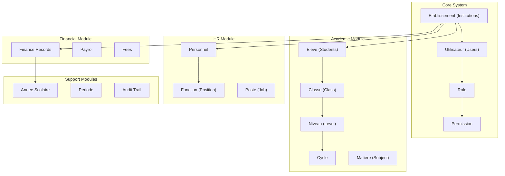
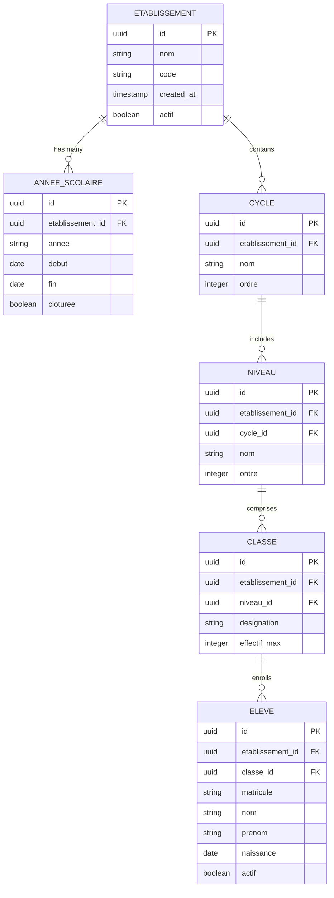
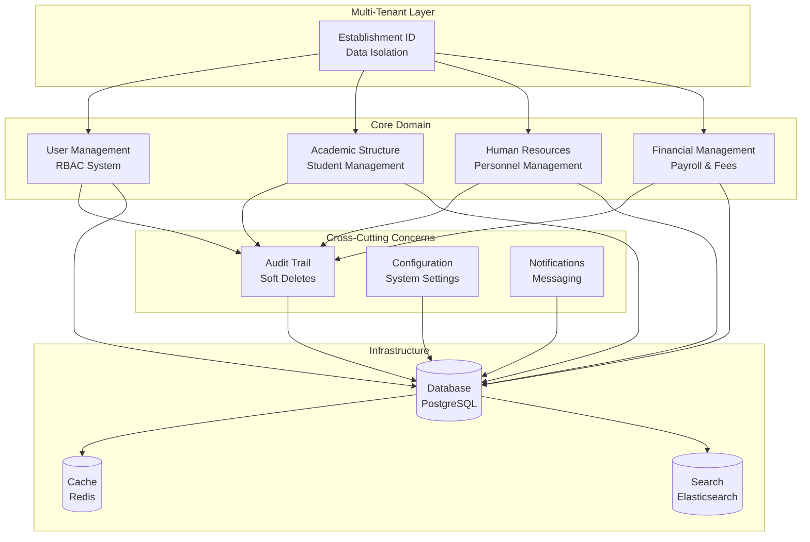
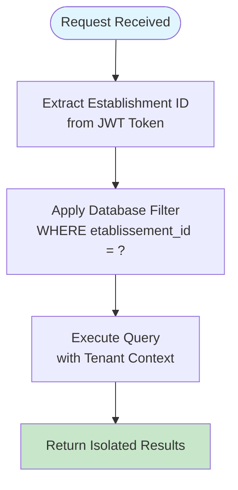
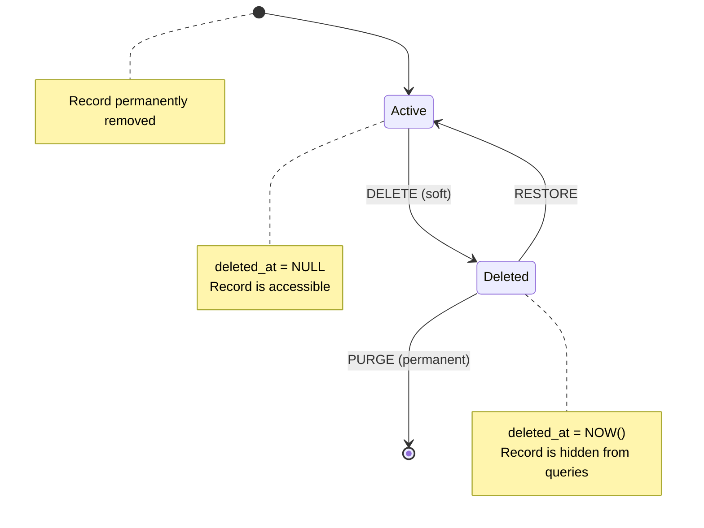
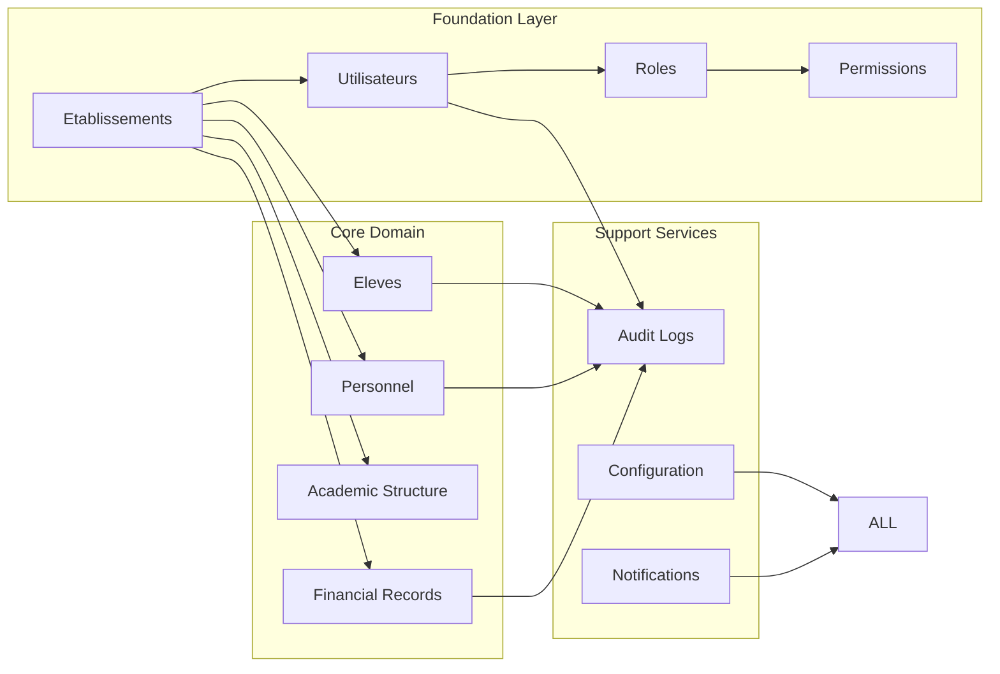

# Schema Design & Entity Relationships

<cite>
**Referenced Files in This Document**
- [058-multi-tenant-structure-academique.sql](file://backend/database/migrations/058-multi-tenant-structure-academique.sql)
- [016-module-personnel-rh-phase1.sql](file://backend/database/migrations/016-module-personnel-rh-phase1.sql)
- [010-module-finances.sql](file://backend/database/migrations/010-module-finances.sql)
- [043-structure-academique-v4.sql](file://backend/database/migrations/043-structure-academique-v4.sql)
- [079-add-roleId-utilisateur-etablissements.sql](file://backend/database/migrations/079-add-roleId-utilisateur-etablissements.sql)
- [database.config.ts](file://backend/src/config/database.config.ts)
- [data-source.ts](file://backend/src/database/data-source.ts)
</cite>

## Table of Contents
1. [Introduction](#introduction)
2. [Project Structure](#project-structure)
3. [Core Components](#core-components)
4. [Architecture Overview](#architecture-overview)
5. [Detailed Component Analysis](#detailed-component-analysis)
6. [Dependency Analysis](#dependency-analysis)
7. [Performance Considerations](#performance-considerations)
8. [Troubleshooting Guide](#troubleshooting-guide)
9. [Conclusion](#conclusion)

## Introduction

This document provides comprehensive documentation for the eLISAschool database schema design and entity relationships. The system implements a multi-tenant architecture using `etablissement_id` foreign keys for data isolation across different educational institutions. The database design supports core entities including users, roles, permissions, institutions, students, personnel, and financial records, with robust audit trails and soft delete patterns.

## Project Structure

The eLISAschool database schema is organized into modular components following a feature-based architecture pattern. Each major module has dedicated migration files that define its specific tables and relationships.

**Diagram sources**
- [058-multi-tenant-structure-academique.sql](file://backend/database/migrations/058-multi-tenant-structure-academique.sql)
- [016-module-personnel-rh-phase1.sql](file://backend/database/migrations/016-module-personnel-rh-phase1.sql)
- [010-module-finances.sql](file://backend/database/migrations/010-module-finances.sql)

## Core Components

### Multi-Tenant Architecture Foundation

The system implements strict multi-tenant isolation through the `etablissement_id` foreign key pattern. Every tenant-specific table includes this column as part of its primary composite key or as a mandatory foreign key constraint.

#### Key Tenant Isolation Tables:

- **Etablissements**: Core institution table defining each tenant's scope
- **Utilisateurs**: User accounts scoped to specific establishments
- **Eleves**: Student records isolated per establishment
- **Personnel**: Staff members belonging to specific institutions
- **Financial Records**: All monetary transactions tied to establishments

**Section sources**
- [058-multi-tenant-structure-academique.sql](file://backend/database/migrations/058-multi-tenant-structure-academique.sql)
- [079-add-roleId-utilisateur-etablissements.sql](file://backend/database/migrations/079-add-roleId-utilisateur-etablissements.sql)

### User Management and RBAC System

The role-based access control (RBAC) system provides granular permission management across all modules.

#### Core Authentication Entities:

- **Utilisateurs**: Main user account table with authentication credentials
- **Roles**: Role definitions with hierarchical permissions
- **Permissions**: Fine-grained access rights to system features
- **Role_Permissions**: Junction table for role-permission mappings

#### Multi-Tenant User Scoping:

Users are associated with specific establishments through composite keys, ensuring data isolation while supporting cross-establishment administrators.

**Section sources**
- [079-add-roleId-utilisateur-etablissements.sql](file://backend/database/migrations/079-add-roleId-utilisateur-etablissements.sql)

### Academic Structure Management

The academic module manages the complex hierarchy of educational organization within each establishment.

#### Academic Hierarchy:

**Diagram sources**
- [058-multi-tenant-structure-academique.sql](file://backend/database/migrations/058-multi-tenant-structure-academique.sql)
- [043-structure-academique-v4.sql](file://backend/database/migrations/043-structure-academique-v4.sql)

### Human Resources Module

The HR module manages personnel records, positions, and employment contracts within each establishment.

#### Personnel Management Entities:

- **Personnel**: Employee records with personal and professional information
- **Fonctions**: Job functions and responsibilities
- **Postes**: Specific job positions within the organization
- **Contrats**: Employment contract management
- **Paie**: Payroll processing and salary administration

**Section sources**
- [016-module-personnel-rh-phase1.sql](file://backend/database/migrations/016-module-personnel-rh-phase1.sql)

### Financial Management System

The financial module handles all monetary transactions, fees, and payroll operations with strict audit trails.

#### Financial Entities:

- **Finances**: General financial records and transactions
- **Frais**: Fee structures and payment tracking
- **Paie**: Payroll processing for personnel
- **Budgets**: Budget planning and monitoring
- **Factures**: Invoice generation and management

**Section sources**
- [010-module-finances.sql](file://backend/database/migrations/010-module-finances.sql)

## Architecture Overview

The eLISAschool database follows a modular, multi-tenant architecture with clear separation of concerns and strict data isolation patterns.

**Diagram sources**
- [database.config.ts](file://backend/src/config/database.config.ts)
- [data-source.ts](file://backend/src/database/data-source.ts)

## Detailed Component Analysis

### Multi-Tenant Data Isolation Pattern

The system implements strict multi-tenant isolation using `etablissement_id` foreign keys throughout the schema. This pattern ensures complete data separation between different educational institutions.

#### Implementation Strategy:

1. **Composite Primary Keys**: Many tables use `(id, etablissement_id)` as composite primary keys
2. **Foreign Key Constraints**: All tenant-scoped tables reference the etablissements table
3. **Query Filtering**: Application layer automatically filters queries by current establishment
4. **Index Optimization**: Strategic indexing on `etablissement_id` columns for performance

#### Tenant Isolation Examples:

**Diagram sources**
- [058-multi-tenant-structure-academique.sql](file://backend/database/migrations/058-multi-tenant-structure-academique.sql)

### Audit Trail and Soft Delete Implementation

The system implements comprehensive audit trails and soft delete patterns to maintain data integrity and provide historical tracking.

#### Audit Trail Components:

- **Audit Logs**: Centralized logging of all data modifications
- **Version Tracking**: Record versioning for critical business entities
- **Soft Deletes**: Logical deletion with `deleted_at` timestamps
- **Change History**: Before/after state comparison for important changes

#### Soft Delete Pattern:

**Diagram sources**
- [016-module-personnel-rh-phase1.sql](file://backend/database/migrations/016-module-personnel-rh-phase1.sql)

### Referential Integrity and Constraints

The database enforces strict referential integrity through foreign key constraints, unique indexes, and check constraints.

#### Constraint Categories:

1. **Primary Key Constraints**: Ensure unique identification of records
2. **Foreign Key Constraints**: Maintain relationships between related entities
3. **Unique Constraints**: Prevent duplicate data entries
4. **Check Constraints**: Validate data format and business rules
5. **Not Null Constraints**: Ensure required fields are populated

#### Performance Indexing Strategy:

- **Composite Indexes**: On frequently queried column combinations
- **Partial Indexes**: For filtered queries on large datasets
- **Covering Indexes**: Include frequently accessed columns
- **Unique Indexes**: Enforce business uniqueness requirements

**Section sources**
- [058-multi-tenant-structure-academique.sql](file://backend/database/migrations/058-multi-tenant-structure-academique.sql)
- [010-module-finances.sql](file://backend/database/migrations/010-module-finances.sql)

### Business Validation Rules

The database layer implements critical business validation rules through constraints and triggers.

#### Key Validation Patterns:

- **Date Range Validation**: Academic year start/end date consistency
- **Status Transitions**: Valid workflow states for documents and processes
- **Numeric Ranges**: Score limits, percentage validations, and amount constraints
- **Reference Validation**: Ensuring related records exist before creation
- **Business Logic Triggers**: Complex validation requiring multiple table checks

#### Example Business Rules:

- Students must belong to valid classes within active academic years
- Personnel cannot have overlapping employment periods
- Financial transactions must balance (debits = credits)
- Permission assignments must follow role hierarchy rules

**Section sources**
- [043-structure-academique-v4.sql](file://backend/database/migrations/043-structure-academique-v4.sql)

## Dependency Analysis

The database schema exhibits well-defined dependency patterns with clear separation between core and domain-specific entities.

**Diagram sources**
- [079-add-roleId-utilisateur-etablissements.sql](file://backend/database/migrations/079-add-roleId-utilisateur-etablissements.sql)
- [058-multi-tenant-structure-academique.sql](file://backend/database/migrations/058-multi-tenant-structure-academique.sql)

### Circular Dependency Prevention

The schema design avoids circular dependencies through careful layering:

1. **Foundation Dependencies**: Etablissements → Users → Roles → Permissions
2. **Domain Dependencies**: Users/Etablissements → Domain Entities
3. **Cross-Cutting Dependencies**: All entities → Audit/Config/Notification

### External Integration Points

The database schema supports integration with external systems through:

- **Webhook Tables**: For event-driven integrations
- **Export Formats**: Standardized data export structures
- **API Versioning**: Support for API evolution without breaking changes
- **Third-party References**: Foreign keys to external system identifiers

**Section sources**
- [database.config.ts](file://backend/src/config/database.config.ts)
- [data-source.ts](file://backend/src/database/data-source.ts)

## Performance Considerations

The database schema is optimized for high-performance operations typical in school management systems.

### Indexing Strategy:

- **Composite Indexes**: On `(etablissement_id, status)`, `(classe_id, student_code)`
- **Partial Indexes**: For active records only (`WHERE deleted_at IS NULL`)
- **Covering Indexes**: Frequently queried column combinations
- **Unique Indexes**: Business-critical uniqueness constraints

### Query Optimization:

- **Connection Pooling**: Efficient database connection management
- **Read Replicas**: Support for read-heavy operations
- **Materialized Views**: Pre-computed aggregations for dashboards
- **Partitioning**: Large tables partitioned by establishment and time

### Scalability Patterns:

- **Horizontal Scaling**: Multi-tenant isolation enables database sharding
- **Caching Strategy**: Redis caching for frequently accessed data
- **Archive Strategy**: Historical data moved to archive tables
- **Batch Operations**: Optimized bulk data processing

[No sources needed since this section provides general guidance]

## Troubleshooting Guide

Common database issues and their resolution strategies in the eLISAschool system.

### Multi-Tenant Data Leakage:

**Symptoms**: Users seeing data from other establishments
**Causes**: Missing `etablissement_id` filters in queries
**Resolution**: Implement middleware that automatically adds tenant context to all queries

### Performance Degradation:

**Symptoms**: Slow query response times
**Causes**: Missing indexes, inefficient joins, N+1 query problems
**Resolution**: Analyze slow queries, add appropriate indexes, implement query optimization

### Constraint Violations:

**Symptoms**: Database constraint errors during data operations
**Causes**: Invalid data relationships, missing referenced records
**Resolution**: Validate data before insertion, implement proper error handling

### Audit Trail Gaps:

**Symptoms**: Missing audit records for certain operations
**Causes**: Bypassed audit triggers, failed transaction commits
**Resolution**: Review trigger implementations, implement retry logic for audit logging

**Section sources**
- [058-multi-tenant-structure-academique.sql](file://backend/database/migrations/058-multi-tenant-structure-academique.sql)
- [016-module-personnel-rh-phase1.sql](file://backend/database/migrations/016-module-personnel-rh-phase1.sql)

## Conclusion

The eLISAschool database schema demonstrates a mature, enterprise-grade design that successfully balances flexibility, performance, and data integrity. The multi-tenant architecture using `etablissement_id` foreign keys provides robust data isolation while maintaining operational efficiency. The comprehensive audit trail and soft delete patterns ensure regulatory compliance and data recovery capabilities.

Key strengths of the design include:

- **Scalable Multi-Tenancy**: Clean separation of tenant data with minimal overhead
- **Modular Architecture**: Clear separation of concerns across functional domains
- **Robust Security**: Comprehensive RBAC system with fine-grained permissions
- **Performance Optimization**: Strategic indexing and query optimization patterns
- **Regulatory Compliance**: Complete audit trails and data retention policies

The schema design provides a solid foundation for future enhancements while maintaining backward compatibility and operational stability.