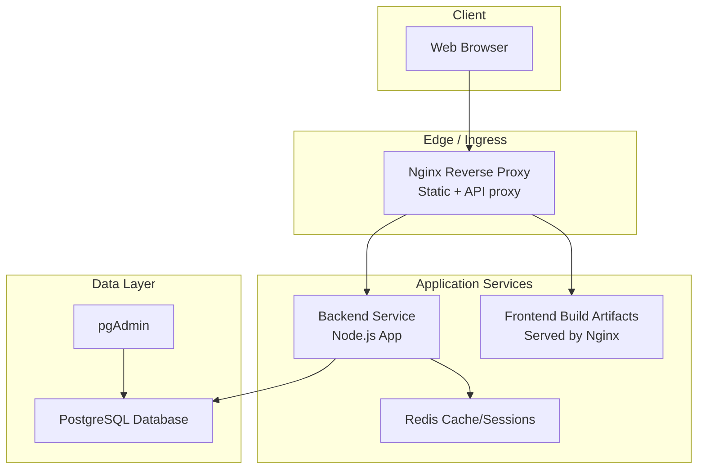
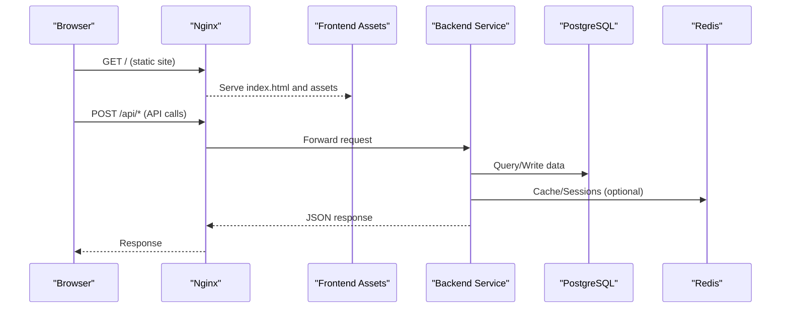
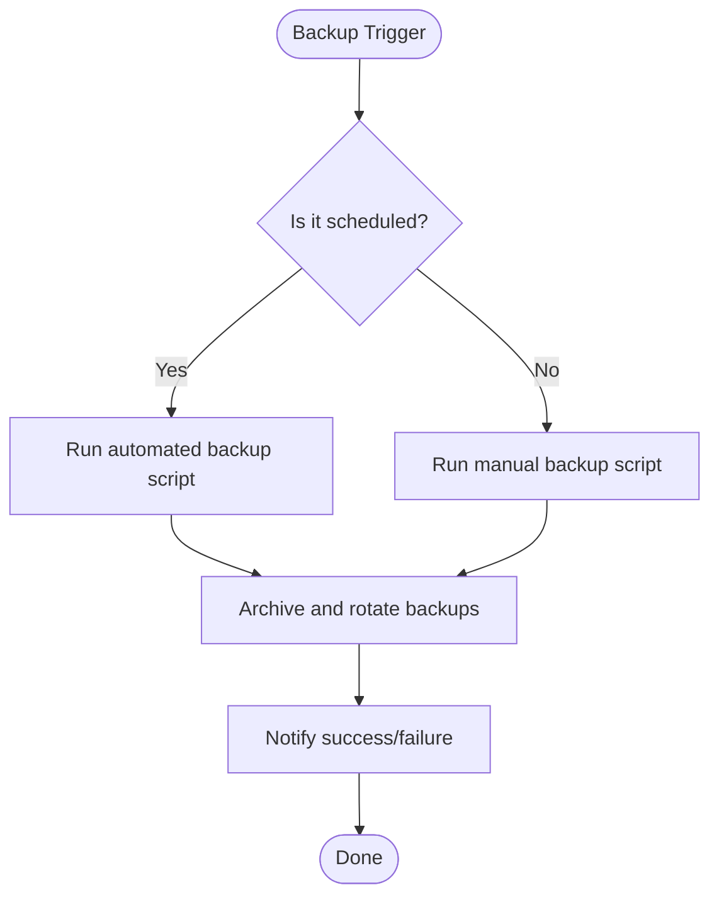
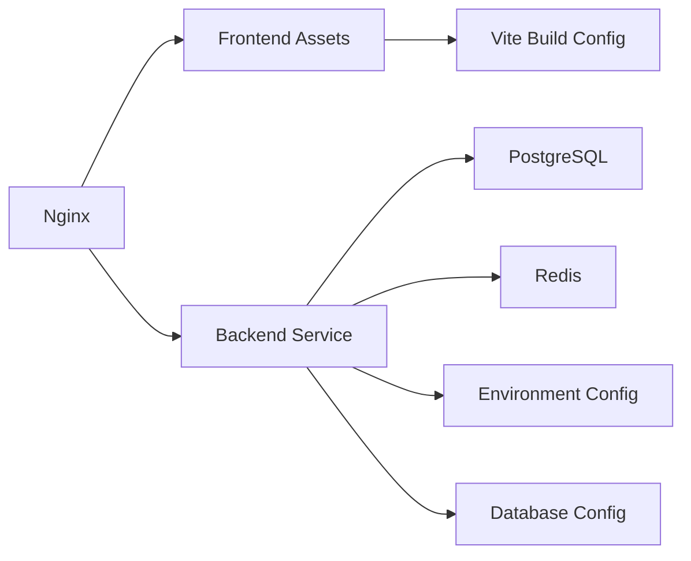

# Deployment Architecture

<cite>
**Referenced Files in This Document**
- [docker-compose.yml](file://docker/docker-compose.yml)
- [docker-compose.local.dev.yml](file://docker/docker-compose.local.dev.yml)
- [docker-compose.local.prod.yml](file://docker/docker-compose.local.prod.yml)
- [docker-compose.cloud.dev.yml](file://docker/docker-compose.cloud.dev.yml)
- [docker-compose.cloud.prod.yml](file://docker/docker-compose.cloud.prod.yml)
- [Dockerfile.backend](file://docker/Dockerfile.backend)
- [Dockerfile.backend.dev](file://docker/Dockerfile.backend.dev)
- [Dockerfile.frontend](file://docker/Dockerfile.frontend)
- [nginx.conf](file://docker/nginx.conf)
- [deploy.sh](file://docker/deploy.sh)
- [scripts/backup-auto.sh](file://docker/scripts/backup-auto.sh)
- [scripts/backup-manuel.sh](file://docker/scripts/backup-manuel.sh)
- [scripts/cron-backup.txt](file://docker/scripts/cron-backup.txt)
- [scripts/install-cron.sh](file://docker/scripts/install-cron.sh)
- [scripts/restore.sh](file://docker/scripts/restore.sh)
- [scripts/update.sh](file://docker/scripts/update.sh)
- [scripts/validate-infrastructure.sh](file://docker/scripts/validate-infrastructure.sh)
- [pgadmin-servers.json](file://docker/pgadmin-servers.json)
- [pgadmin.sh](file://docker/pgadmin.sh)
- [backend/src/config/env.config.ts](file://backend/src/config/env.config.ts)
- [backend/src/config/database.config.ts](file://backend/src/config/database.config.ts)
- [backend/src/app.ts](file://backend/src/app.ts)
- [backend/src/index.ts](file://backend/src/index.ts)
- [frontend/vite.config.ts](file://frontend/vite.config.ts)
- [README.md](file://README.md)
- [QUICKSTART.md](file://QUICKSTART.md)
</cite>

## Table of Contents
1. [Introduction](#introduction)
2. [Project Structure](#project-structure)
3. [Core Components](#core-components)
4. [Architecture Overview](#architecture-overview)
5. [Detailed Component Analysis](#detailed-component-analysis)
6. [Dependency Analysis](#dependency-analysis)
7. [Performance Considerations](#performance-considerations)
8. [Troubleshooting Guide](#troubleshooting-guide)
9. [Conclusion](#conclusion)
10. [Appendices](#appendices)

## Introduction
This document describes the deployment architecture and infrastructure setup for the project, focusing on Docker containerization, multi-environment configuration, docker-compose orchestration, production topology, load balancing, scaling strategies, CI/CD pipeline integration, automated testing, monitoring, environment variable management, secrets handling, configuration drift prevention, backup and disaster recovery procedures, health checks, and maintenance operations.

The repository provides a full-stack application with a Node.js backend, a frontend build served by Nginx, PostgreSQL as the primary database, Redis for caching/sessions, and pgAdmin for administration. Multiple compose profiles and environment-specific files support local development and cloud deployments.

## Project Structure
At a high level, the deployment-related assets are organized under:
- docker/: Container images, compose files, Nginx configuration, scripts for backups, updates, validation, and pgAdmin setup
- backend/src/config/: Environment and database configuration modules used at runtime
- frontend/vite.config.ts: Frontend build-time configuration (e.g., API base URL)
- Root-level README and QUICKSTART: High-level guidance for running and deploying

**Diagram sources**
- [docker-compose.yml](file://docker/docker-compose.yml)
- [nginx.conf](file://docker/nginx.conf)
- [Dockerfile.backend](file://docker/Dockerfile.backend)
- [Dockerfile.frontend](file://docker/Dockerfile.frontend)

**Section sources**
- [README.md](file://README.md)
- [QUICKSTART.md](file://QUICKSTART.md)

## Core Components
- Container Images
  - Backend image built from Dockerfile.backend (production) and Dockerfile.backend.dev (development)
  - Frontend static assets built via Dockerfile.frontend and served by Nginx
- Orchestration
  - docker-compose.yml defines the default stack
  - Environment-specific overrides:
    - Local dev: docker-compose.local.dev.yml
    - Local prod-like: docker-compose.local.prod.yml
    - Cloud dev: docker-compose.cloud.dev.yml
    - Cloud prod: docker-compose.cloud.prod.yml
- Reverse Proxy
  - nginx.conf configures routing to frontend and backend services
- Configuration
  - Backend loads environment variables and database settings at startup
  - Frontend build-time configuration sets API endpoints
- Operational Scripts
  - Backup automation and manual backups
  - Restore procedure
  - Update script for rolling updates
  - Infrastructure validation script
  - Cron installation for scheduled tasks
  - pgAdmin server configuration and bootstrap

**Section sources**
- [docker-compose.yml](file://docker/docker-compose.yml)
- [docker-compose.local.dev.yml](file://docker/docker-compose.local.dev.yml)
- [docker-compose.local.prod.yml](file://docker/docker-compose.local.prod.yml)
- [docker-compose.cloud.dev.yml](file://docker/docker-compose.cloud.dev.yml)
- [docker-compose.cloud.prod.yml](file://docker/docker-compose.cloud.prod.yml)
- [Dockerfile.backend](file://docker/Dockerfile.backend)
- [Dockerfile.backend.dev](file://docker/Dockerfile.backend.dev)
- [Dockerfile.frontend](file://docker/Dockerfile.frontend)
- [nginx.conf](file://docker/nginx.conf)
- [backend/src/config/env.config.ts](file://backend/src/config/env.config.ts)
- [backend/src/config/database.config.ts](file://backend/src/config/database.config.ts)
- [frontend/vite.config.ts](file://frontend/vite.config.ts)
- [scripts/backup-auto.sh](file://docker/scripts/backup-auto.sh)
- [scripts/backup-manuel.sh](file://docker/scripts/backup-manuel.sh)
- [scripts/restore.sh](file://docker/scripts/restore.sh)
- [scripts/update.sh](file://docker/scripts/update.sh)
- [scripts/validate-infrastructure.sh](file://docker/scripts/validate-infrastructure.sh)
- [scripts/cron-backup.txt](file://docker/scripts/cron-backup.txt)
- [scripts/install-cron.sh](file://docker/scripts/install-cron.sh)
- [pgadmin-servers.json](file://docker/pgadmin-servers.json)
- [pgadmin.sh](file://docker/pgadmin.sh)

## Architecture Overview
The system is orchestrated with docker-compose. The reverse proxy routes HTTP traffic to the frontend static assets and proxies API requests to the backend. The backend connects to PostgreSQL and optionally uses Redis for caching or session storage. pgAdmin is available for database administration.

**Diagram sources**
- [docker-compose.yml](file://docker/docker-compose.yml)
- [nginx.conf](file://docker/nginx.conf)

## Detailed Component Analysis

### Docker Compose Orchestration
- Base stack defined in docker-compose.yml
- Environment-specific overlays:
  - Local dev: hot reload, debug ports, development volumes
  - Local prod-like: production-like constraints without external cloud dependencies
  - Cloud dev/prod: externalized secrets, persistent volumes, networking tuned for cloud environments
- Services typically include:
  - backend: Node.js application
  - frontend: Static assets served by Nginx
  - postgres: Primary relational database
  - redis: Optional cache/session store
  - pgadmin: Database admin UI

Operational notes:
- Use profile flags or separate compose files to switch environments
- Persist database and logs using named volumes
- Externalize sensitive values via environment files or secret managers

**Section sources**
- [docker-compose.yml](file://docker/docker-compose.yml)
- [docker-compose.local.dev.yml](file://docker/docker-compose.local.dev.yml)
- [docker-compose.local.prod.yml](file://docker/docker-compose.local.prod.yml)
- [docker-compose.cloud.dev.yml](file://docker/docker-compose.cloud.dev.yml)
- [docker-compose.cloud.prod.yml](file://docker/docker-compose.cloud.prod.yml)

### Container Images and Build Strategy
- Backend
  - Production image: Dockerfile.backend
  - Development image: Dockerfile.backend.dev (includes dev tooling and hot reload)
- Frontend
  - Dockerfile.frontend builds static assets and serves them via Nginx

Best practices:
- Multi-stage builds to minimize image size
- Pin base image versions for reproducibility
- Separate dev and prod images to avoid shipping dev dependencies into production

**Section sources**
- [Dockerfile.backend](file://docker/Dockerfile.backend)
- [Dockerfile.backend.dev](file://docker/Dockerfile.backend.dev)
- [Dockerfile.frontend](file://docker/Dockerfile.frontend)

### Reverse Proxy and Load Balancing
- nginx.conf configures:
  - Serving static frontend assets
  - Proxing API requests to the backend service
  - Optional upstream definitions for horizontal scaling
- For production:
  - Define multiple backend instances behind an upstream group
  - Enable sticky sessions if required by your session strategy
  - Configure timeouts, buffering, and gzip compression

Scaling considerations:
- Stateless backend design enables horizontal scaling
- Use shared Redis for session/cache consistency across replicas
- Ensure idempotent API design and proper error handling

**Section sources**
- [nginx.conf](file://docker/nginx.conf)

### Environment Variables and Secrets Management
- Backend configuration modules:
  - env.config.ts: Loads and validates environment variables
  - database.config.ts: Configures database connection parameters
- Recommended approach:
  - Use .env files per environment (local, staging, prod)
  - Inject secrets via orchestrator secret stores (compose secrets, Kubernetes secrets, or cloud secret managers)
  - Avoid committing secrets to version control; use .gitignore patterns

Configuration drift prevention:
- Centralize all environment keys in a single source of truth (compose file or secret manager)
- Validate required variables at startup
- Use type-safe configuration loading

**Section sources**
- [backend/src/config/env.config.ts](file://backend/src/config/env.config.ts)
- [backend/src/config/database.config.ts](file://backend/src/config/database.config.ts)
- [docker-compose.yml](file://docker/docker-compose.yml)

### Frontend Build-Time Configuration
- vite.config.ts controls build-time constants such as API base URLs
- Ensure that the frontend points to the correct API endpoint based on the environment (dev vs prod)

**Section sources**
- [frontend/vite.config.ts](file://frontend/vite.config.ts)

### Health Checks and Readiness
- Implement health endpoints in the backend (e.g., /health or /ready)
- Configure docker-compose healthchecks for:
  - Backend service
  - Database connectivity
  - Redis availability
- Use readiness probes to gate traffic until dependencies are ready

Operational benefits:
- Graceful restarts and zero-downtime deployments
- Auto-recovery when transient failures occur

**Section sources**
- [docker-compose.yml](file://docker/docker-compose.yml)
- [backend/src/app.ts](file://backend/src/app.ts)
- [backend/src/index.ts](file://backend/src/index.ts)

### Monitoring and Observability
- Expose metrics endpoints in the backend (if applicable)
- Aggregate logs from containers centrally
- Use pgAdmin for database inspection and troubleshooting
- Integrate with external monitoring systems (APM, log aggregation, alerting)

**Section sources**
- [pgadmin-servers.json](file://docker/pgadmin-servers.json)
- [pgadmin.sh](file://docker/pgadmin.sh)

### Backup and Disaster Recovery
Automated and manual backup workflows:
- Automated daily backups via cron job
- Manual backup trigger for ad-hoc snapshots
- Restore procedure to recover from backups
- Retention policy for old backups

**Diagram sources**
- [scripts/backup-auto.sh](file://docker/scripts/backup-auto.sh)
- [scripts/backup-manuel.sh](file://docker/scripts/backup-manuel.sh)
- [scripts/cron-backup.txt](file://docker/scripts/cron-backup.txt)
- [scripts/install-cron.sh](file://docker/scripts/install-cron.sh)

Restore flow:
- Stop write operations (maintenance mode)
- Restore latest backup
- Verify integrity
- Restart services and validate

**Section sources**
- [scripts/restore.sh](file://docker/scripts/restore.sh)
- [scripts/backup-auto.sh](file://docker/scripts/backup-auto.sh)
- [scripts/backup-manuel.sh](file://docker/scripts/backup-manuel.sh)
- [scripts/cron-backup.txt](file://docker/scripts/cron-backup.txt)
- [scripts/install-cron.sh](file://docker/scripts/install-cron.sh)

### Maintenance Operations
- Rolling updates:
  - Use update.sh to pull new images and restart services gracefully
- Infrastructure validation:
  - Run validate-infrastructure.sh to verify connectivity and configuration
- pgAdmin:
  - Preconfigure servers via pgadmin-servers.json
  - Bootstrap pgAdmin with pgadmin.sh

**Section sources**
- [scripts/update.sh](file://docker/scripts/update.sh)
- [scripts/validate-infrastructure.sh](file://docker/scripts/validate-infrastructure.sh)
- [pgadmin-servers.json](file://docker/pgadmin-servers.json)
- [pgadmin.sh](file://docker/pgadmin.sh)

### CI/CD Pipeline Integration
Recommended pipeline stages:
- Lint and type-check
- Unit tests
- Integration tests against ephemeral services (Postgres, Redis)
- Build Docker images
- Push images to registry
- Deploy to target environment (staging/prod) using docker-compose or orchestrator
- Post-deploy smoke tests and health checks

Integration points:
- Use environment-specific compose files for different stages
- Inject secrets securely during deploy stage
- Tag images with commit SHA and semantic version

[No sources needed since this section provides general guidance]

## Dependency Analysis
The following diagram shows key runtime dependencies between services and configuration modules.

**Diagram sources**
- [docker-compose.yml](file://docker/docker-compose.yml)
- [nginx.conf](file://docker/nginx.conf)
- [backend/src/config/env.config.ts](file://backend/src/config/env.config.ts)
- [backend/src/config/database.config.ts](file://backend/src/config/database.config.ts)
- [frontend/vite.config.ts](file://frontend/vite.config.ts)

**Section sources**
- [docker-compose.yml](file://docker/docker-compose.yml)
- [nginx.conf](file://docker/nginx.conf)
- [backend/src/config/env.config.ts](file://backend/src/config/env.config.ts)
- [backend/src/config/database.config.ts](file://backend/src/config/database.config.ts)
- [frontend/vite.config.ts](file://frontend/vite.config.ts)

## Performance Considerations
- Horizontal scaling:
  - Run multiple backend replicas behind Nginx upstream
  - Use shared Redis for consistent caching and sessions
- Database tuning:
  - Proper indexing and query optimization
  - Connection pooling and resource limits
- Caching strategy:
  - Cache frequently accessed data in Redis
  - Use appropriate TTLs and invalidation policies
- Static asset optimization:
  - Enable gzip/brotli compression in Nginx
  - Leverage browser caching headers

[No sources needed since this section provides general guidance]

## Troubleshooting Guide
Common issues and resolutions:
- Connectivity problems:
  - Validate network reachability between services
  - Confirm port bindings and firewall rules
- Database errors:
  - Check credentials and connection strings
  - Verify migrations have been applied
- Redis issues:
  - Ensure Redis is reachable and configured correctly
- Health check failures:
  - Inspect backend logs and readiness endpoints
  - Validate dependency health before accepting traffic

Operational utilities:
- validate-infrastructure.sh: Quick checks for environment readiness
- restore.sh: Step-by-step restoration process
- update.sh: Safe update workflow

**Section sources**
- [scripts/validate-infrastructure.sh](file://docker/scripts/validate-infrastructure.sh)
- [scripts/restore.sh](file://docker/scripts/restore.sh)
- [scripts/update.sh](file://docker/scripts/update.sh)

## Conclusion
This deployment architecture leverages Docker and docker-compose to provide a consistent, scalable, and maintainable environment across development and production. With clear separation of concerns—reverse proxy, stateless backend, persistent database, and optional caching—the system supports horizontal scaling and robust operational practices including automated backups, health checks, and structured maintenance procedures. Environment-specific configurations and secure secret handling ensure safe deployments across diverse infrastructures.

[No sources needed since this section summarizes without analyzing specific files]

## Appendices

### Environment-Specific Compose Files
- Local development: docker-compose.local.dev.yml
- Local production-like: docker-compose.local.prod.yml
- Cloud development: docker-compose.cloud.dev.yml
- Cloud production: docker-compose.cloud.prod.yml

Use these files to tailor resources, networking, and secrets per environment.

**Section sources**
- [docker-compose.local.dev.yml](file://docker/docker-compose.local.dev.yml)
- [docker-compose.local.prod.yml](file://docker/docker-compose.local.prod.yml)
- [docker-compose.cloud.dev.yml](file://docker/docker-compose.cloud.dev.yml)
- [docker-compose.cloud.prod.yml](file://docker/docker-compose.cloud.prod.yml)

### Deployment Script
- deploy.sh: Orchestrates common deployment tasks (build, push, run)

**Section sources**
- [deploy.sh](file://docker/deploy.sh)