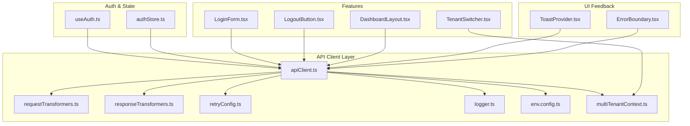
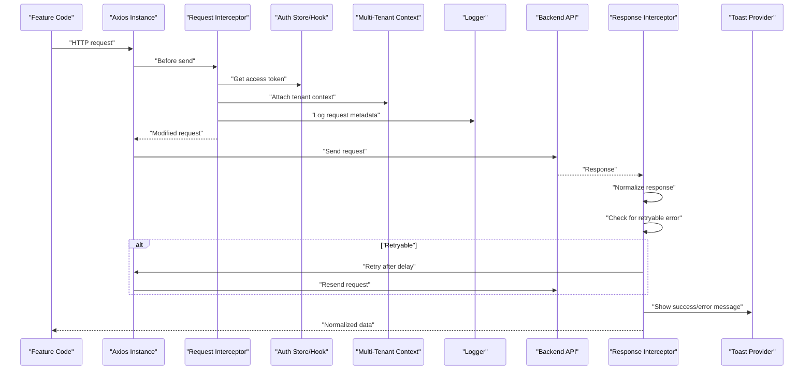
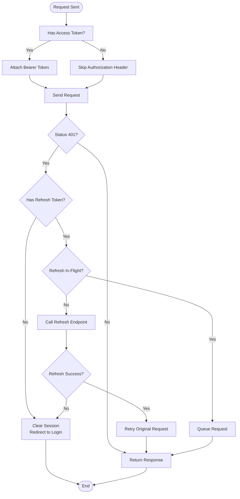
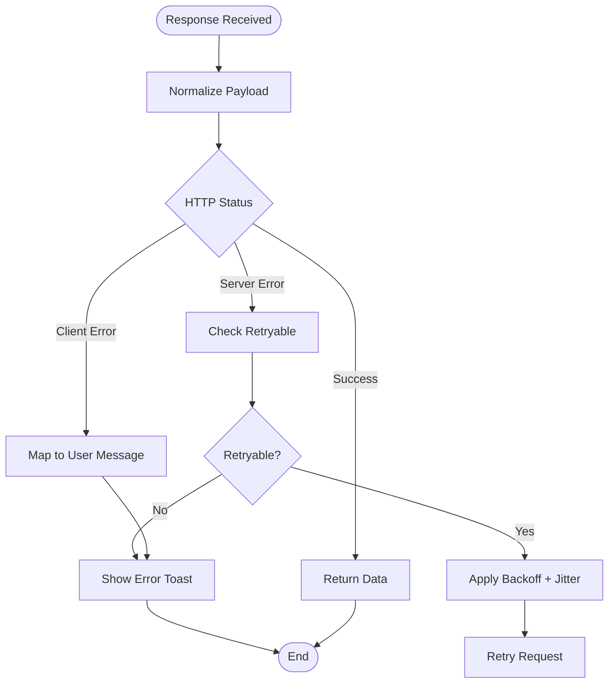
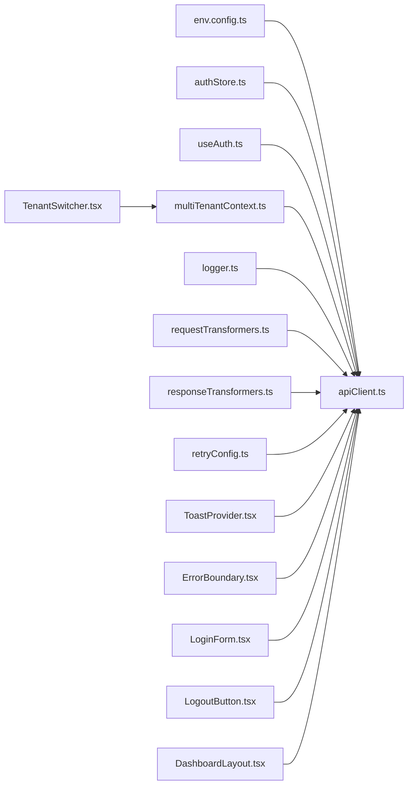

# API Client Configuration

<cite>
**Referenced Files in This Document**
- [frontend/src/lib/apiClient.ts](file://frontend/src/lib/apiClient.ts)
- [frontend/src/config/env.config.ts](file://frontend/src/config/env.config.ts)
- [frontend/src/hooks/useAuth.ts](file://frontend/src/hooks/useAuth.ts)
- [frontend/src/stores/authStore.ts](file://frontend/src/stores/authStore.ts)
- [frontend/src/features/auth/login/LoginForm.tsx](file://frontend/src/features/auth/login/LoginForm.tsx)
- [frontend/src/features/auth/logout/LogoutButton.tsx](file://frontend/src/features/auth/logout/LogoutButton.tsx)
- [frontend/src/features/dashboard/DashboardLayout.tsx](file://frontend/src/features/dashboard/DashboardLayout.tsx)
- [frontend/src/features/settings/TenantSwitcher.tsx](file://frontend/src/features/settings/TenantSwitcher.tsx)
- [frontend/src/components/ui/ErrorBoundary.tsx](file://frontend/src/components/ui/ErrorBoundary.tsx)
- [frontend/src/components/ui/ToastProvider.tsx](file://frontend/src/components/ui/ToastProvider.tsx)
- [frontend/src/lib/logger.ts](file://frontend/src/lib/logger.ts)
- [frontend/src/lib/requestTransformers.ts](file://frontend/src/lib/requestTransformers.ts)
- [frontend/src/lib/responseTransformers.ts](file://frontend/src/lib/responseTransformers.ts)
- [frontend/src/lib/retryConfig.ts](file://frontend/src/lib/retryConfig.ts)
- [frontend/src/lib/multiTenantContext.ts](file://frontend/src/lib/multiTenantContext.ts)
</cite>

## Table of Contents
1. [Introduction](#introduction)
2. [Project Structure](#project-structure)
3. [Core Components](#core-components)
4. [Architecture Overview](#architecture-overview)
5. [Detailed Component Analysis](#detailed-component-analysis)
6. [Dependency Analysis](#dependency-analysis)
7. [Performance Considerations](#performance-considerations)
8. [Troubleshooting Guide](#troubleshooting-guide)
9. [Conclusion](#conclusion)
10. [Appendices](#appendices)

## Introduction
This document explains the API client configuration layer used across the frontend application. It covers Axios instance setup (base URL, timeouts, headers), authentication interceptor implementation (JWT handling, refresh token flow, multi-tenant context propagation), error interceptor patterns (global error handling, retry mechanisms, user feedback), request/response transformations, logging configuration, and environment-specific settings. It also provides examples for customizing the client for different use cases and testing strategies.

## Project Structure
The API client is implemented as a centralized Axios instance with interceptors and utilities. The key files are located under:
- Client creation and interceptors: frontend/src/lib/apiClient.ts
- Environment configuration: frontend/src/config/env.config.ts
- Authentication state and hooks: frontend/src/hooks/useAuth.ts, frontend/src/stores/authStore.ts
- Multi-tenant context: frontend/src/lib/multiTenantContext.ts
- Request/response transformers: frontend/src/lib/requestTransformers.ts, frontend/src/lib/responseTransformers.ts
- Retry configuration: frontend/src/lib/retryConfig.ts
- Logging: frontend/src/lib/logger.ts
- UI feedback components: frontend/src/components/ui/ToastProvider.tsx, frontend/src/components/ui/ErrorBoundary.tsx
- Feature usage examples: login, logout, dashboard layout, tenant switcher

**Diagram sources**
- [frontend/src/lib/apiClient.ts](file://frontend/src/lib/apiClient.ts)
- [frontend/src/config/env.config.ts](file://frontend/src/config/env.config.ts)
- [frontend/src/hooks/useAuth.ts](file://frontend/src/hooks/useAuth.ts)
- [frontend/src/stores/authStore.ts](file://frontend/src/stores/authStore.ts)
- [frontend/src/lib/requestTransformers.ts](file://frontend/src/lib/requestTransformers.ts)
- [frontend/src/lib/responseTransformers.ts](file://frontend/src/lib/responseTransformers.ts)
- [frontend/src/lib/retryConfig.ts](file://frontend/src/lib/retryConfig.ts)
- [frontend/src/lib/logger.ts](file://frontend/src/lib/logger.ts)
- [frontend/src/lib/multiTenantContext.ts](file://frontend/src/lib/multiTenantContext.ts)
- [frontend/src/components/ui/ToastProvider.tsx](file://frontend/src/components/ui/ToastProvider.tsx)
- [frontend/src/components/ui/ErrorBoundary.tsx](file://frontend/src/components/ui/ErrorBoundary.tsx)
- [frontend/src/features/auth/login/LoginForm.tsx](file://frontend/src/features/auth/login/LoginForm.tsx)
- [frontend/src/features/auth/logout/LogoutButton.tsx](file://frontend/src/features/auth/logout/LogoutButton.tsx)
- [frontend/src/features/dashboard/DashboardLayout.tsx](file://frontend/src/features/dashboard/DashboardLayout.tsx)
- [frontend/src/features/settings/TenantSwitcher.tsx](file://frontend/src/features/settings/TenantSwitcher.tsx)

**Section sources**
- [frontend/src/lib/apiClient.ts](file://frontend/src/lib/apiClient.ts)
- [frontend/src/config/env.config.ts](file://frontend/src/config/env.config.ts)

## Core Components
- Axios instance: Centralized configuration including base URL, timeouts, default headers, and content-type negotiation.
- Interceptors:
  - Request interceptor: attaches JWT tokens, propagates multi-tenant context, applies request transformations, and logs outgoing requests.
  - Response interceptor: normalizes responses, handles errors, triggers retries when configured, and shows user feedback via toast notifications.
- Transformers: Convert payloads to/from server expectations (e.g., camelCase ↔ snake_case).
- Retry mechanism: Configurable exponential backoff with jitter for transient failures.
- Logging: Structured request/response logging with optional redaction of sensitive fields.
- Environment settings: Base URLs, feature flags, and logging levels sourced from environment configuration.

**Section sources**
- [frontend/src/lib/apiClient.ts](file://frontend/src/lib/apiClient.ts)
- [frontend/src/lib/requestTransformers.ts](file://frontend/src/lib/requestTransformers.ts)
- [frontend/src/lib/responseTransformers.ts](file://frontend/src/lib/responseTransformers.ts)
- [frontend/src/lib/retryConfig.ts](file://frontend/src/lib/retryConfig.ts)
- [frontend/src/lib/logger.ts](file://frontend/src/lib/logger.ts)
- [frontend/src/config/env.config.ts](file://frontend/src/config/env.config.ts)

## Architecture Overview
The API client sits between features and the backend. It encapsulates cross-cutting concerns such as authentication, multi-tenancy, retries, logging, and user feedback. Features call typed methods or direct HTTP calls through the client; interceptors handle global behavior transparently.

**Diagram sources**
- [frontend/src/lib/apiClient.ts](file://frontend/src/lib/apiClient.ts)
- [frontend/src/hooks/useAuth.ts](file://frontend/src/hooks/useAuth.ts)
- [frontend/src/stores/authStore.ts](file://frontend/src/stores/authStore.ts)
- [frontend/src/lib/multiTenantContext.ts](file://frontend/src/lib/multiTenantContext.ts)
- [frontend/src/lib/logger.ts](file://frontend/src/lib/logger.ts)
- [frontend/src/components/ui/ToastProvider.tsx](file://frontend/src/components/ui/ToastProvider.tsx)

## Detailed Component Analysis

### Axios Instance Setup
- Base URL: Resolved from environment configuration to support dev/prod environments.
- Timeouts: Global timeout and per-request overrides where needed.
- Headers: Default Content-Type and Accept headers; Authorization header injected by the request interceptor.
- Credentials: Cookie-based session handling if applicable; otherwise bearer token strategy.
- Custom config: Per-feature clients can extend defaults for specific endpoints.

**Section sources**
- [frontend/src/lib/apiClient.ts](file://frontend/src/lib/apiClient.ts)
- [frontend/src/config/env.config.ts](file://frontend/src/config/env.config.ts)

### Authentication Interceptor
- Token attachment: Reads current access token from auth store/hook and sets Authorization header.
- Refresh token logic: On 401 responses, attempts silent refresh using stored refresh token; on success, retries original request; on failure, clears session and redirects to login.
- Multi-tenant context propagation: Adds tenant identifiers (e.g., establishment ID) to headers or query parameters based on active tenant context.
- Idempotency: Avoids recursive refresh loops by tracking in-flight refresh attempts.

**Diagram sources**
- [frontend/src/lib/apiClient.ts](file://frontend/src/lib/apiClient.ts)
- [frontend/src/stores/authStore.ts](file://frontend/src/stores/authStore.ts)
- [frontend/src/hooks/useAuth.ts](file://frontend/src/hooks/useAuth.ts)

**Section sources**
- [frontend/src/lib/apiClient.ts](file://frontend/src/lib/apiClient.ts)
- [frontend/src/stores/authStore.ts](file://frontend/src/stores/authStore.ts)
- [frontend/src/hooks/useAuth.ts](file://frontend/src/hooks/useAuth.ts)

### Error Interceptor Patterns
- Global error mapping: Converts network and server errors into user-friendly messages.
- Retry mechanisms: Uses retry configuration for transient errors (timeouts, 5xx) with exponential backoff and jitter.
- User feedback: Integrates with ToastProvider to show non-intrusive notifications for errors and successes.
- Silent vs. noisy errors: Distinguishes expected errors (e.g., 404 for optional resources) from actionable ones.

**Diagram sources**
- [frontend/src/lib/apiClient.ts](file://frontend/src/lib/apiClient.ts)
- [frontend/src/lib/retryConfig.ts](file://frontend/src/lib/retryConfig.ts)
- [frontend/src/components/ui/ToastProvider.tsx](file://frontend/src/components/ui/ToastProvider.tsx)

**Section sources**
- [frontend/src/lib/apiClient.ts](file://frontend/src/lib/apiClient.ts)
- [frontend/src/lib/retryConfig.ts](file://frontend/src/lib/retryConfig.ts)
- [frontend/src/components/ui/ToastProvider.tsx](file://frontend/src/components/ui/ToastProvider.tsx)

### Request/Response Transformation
- Request transformation: Serializes payloads, converts field casing, and attaches contextual metadata (e.g., correlation IDs).
- Response transformation: Normalizes nested structures, maps enums, and unwraps envelope responses to domain models.
- Type safety: Shared types ensure consistent shape across layers.

**Section sources**
- [frontend/src/lib/requestTransformers.ts](file://frontend/src/lib/requestTransformers.ts)
- [frontend/src/lib/responseTransformers.ts](file://frontend/src/lib/responseTransformers.ts)

### Logging Configuration
- Structured logging: Captures method, URL, status, duration, and sanitized payload summaries.
- Redaction: Omits sensitive fields like tokens and passwords.
- Environment-aware: Adjusts log verbosity based on environment configuration.

**Section sources**
- [frontend/src/lib/logger.ts](file://frontend/src/lib/logger.ts)
- [frontend/src/config/env.config.ts](file://frontend/src/config/env.config.ts)

### Multi-Tenant Context Propagation
- Active tenant selection: Maintained in multi-tenant context and updated via tenant switcher.
- Header injection: Attaches tenant identifiers to all requests automatically.
- Scope enforcement: Ensures subsequent requests respect tenant boundaries.

**Section sources**
- [frontend/src/lib/multiTenantContext.ts](file://frontend/src/lib/multiTenantContext.ts)
- [frontend/src/features/settings/TenantSwitcher.tsx](file://frontend/src/features/settings/TenantSwitcher.tsx)

### Environment-Specific Settings
- Base URLs: Separate development and production endpoints.
- Feature toggles: Enable/disable experimental features or debug logging.
- Security policies: Configure CORS and cookie behaviors per environment.

**Section sources**
- [frontend/src/config/env.config.ts](file://frontend/src/config/env.config.ts)

### Usage Examples
- Login flow: Authenticates user, stores tokens, and updates auth state.
- Logout flow: Clears tokens and resets tenant context.
- Dashboard initialization: Loads tenant-scoped data using the configured client.

**Section sources**
- [frontend/src/features/auth/login/LoginForm.tsx](file://frontend/src/features/auth/login/LoginForm.tsx)
- [frontend/src/features/auth/logout/LogoutButton.tsx](file://frontend/src/features/auth/logout/LogoutButton.tsx)
- [frontend/src/features/dashboard/DashboardLayout.tsx](file://frontend/src/features/dashboard/DashboardLayout.tsx)

## Dependency Analysis
The API client depends on environment configuration, auth state, multi-tenant context, logging, and UI feedback components. Features consume the client without needing to manage cross-cutting concerns directly.

**Diagram sources**
- [frontend/src/lib/apiClient.ts](file://frontend/src/lib/apiClient.ts)
- [frontend/src/config/env.config.ts](file://frontend/src/config/env.config.ts)
- [frontend/src/stores/authStore.ts](file://frontend/src/stores/authStore.ts)
- [frontend/src/hooks/useAuth.ts](file://frontend/src/hooks/useAuth.ts)
- [frontend/src/lib/multiTenantContext.ts](file://frontend/src/lib/multiTenantContext.ts)
- [frontend/src/lib/logger.ts](file://frontend/src/lib/logger.ts)
- [frontend/src/lib/requestTransformers.ts](file://frontend/src/lib/requestTransformers.ts)
- [frontend/src/lib/responseTransformers.ts](file://frontend/src/lib/responseTransformers.ts)
- [frontend/src/lib/retryConfig.ts](file://frontend/src/lib/retryConfig.ts)
- [frontend/src/components/ui/ToastProvider.tsx](file://frontend/src/components/ui/ToastProvider.tsx)
- [frontend/src/components/ui/ErrorBoundary.tsx](file://frontend/src/components/ui/ErrorBoundary.tsx)
- [frontend/src/features/auth/login/LoginForm.tsx](file://frontend/src/features/auth/login/LoginForm.tsx)
- [frontend/src/features/auth/logout/LogoutButton.tsx](file://frontend/src/features/auth/logout/LogoutButton.tsx)
- [frontend/src/features/dashboard/DashboardLayout.tsx](file://frontend/src/features/dashboard/DashboardLayout.tsx)
- [frontend/src/features/settings/TenantSwitcher.tsx](file://frontend/src/features/settings/TenantSwitcher.tsx)

**Section sources**
- [frontend/src/lib/apiClient.ts](file://frontend/src/lib/apiClient.ts)
- [frontend/src/config/env.config.ts](file://frontend/src/config/env.config.ts)

## Performance Considerations
- Minimize payload size with selective field inclusion and compression where supported.
- Use retries judiciously to avoid amplifying load during outages.
- Cache frequently accessed read-only data at the feature layer to reduce redundant requests.
- Debounce rapid tenant switches to prevent excessive reconfiguration overhead.
- Keep logging lightweight in production; enable verbose logs only in development.

[No sources needed since this section provides general guidance]

## Troubleshooting Guide
- 401 Unauthorized loops: Ensure refresh token logic prevents recursive retries and clears invalid sessions.
- Missing tenant context: Verify tenant identifier is attached to headers and that the tenant switcher updates context before making requests.
- Network errors: Confirm base URL and CORS settings; check retry configuration thresholds.
- Silent failures: Inspect structured logs and ensure error boundary captures unhandled exceptions.
- Stale data: Validate response normalization and consider adding cache invalidation strategies.

**Section sources**
- [frontend/src/lib/apiClient.ts](file://frontend/src/lib/apiClient.ts)
- [frontend/src/components/ui/ErrorBoundary.tsx](file://frontend/src/components/ui/ErrorBoundary.tsx)
- [frontend/src/components/ui/ToastProvider.tsx](file://frontend/src/components/ui/ToastProvider.tsx)
- [frontend/src/lib/logger.ts](file://frontend/src/lib/logger.ts)

## Conclusion
The API client configuration centralizes HTTP concerns, ensuring consistent authentication, multi-tenancy, error handling, retries, and logging across the application. By leveraging interceptors and shared utilities, features remain focused on business logic while benefiting from robust cross-cutting capabilities.

[No sources needed since this section summarizes without analyzing specific files]

## Appendices

### Customizing the Client for Different Use Cases
- Create a scoped client for third-party APIs by extending the base instance with a different base URL and custom headers.
- Add feature-specific interceptors for analytics or A/B testing tags.
- Toggle retry behavior per endpoint using request-level configuration.

[No sources needed since this section provides general guidance]

### Testing Strategies
- Mock Axios instance to simulate various responses (success, 401, 5xx, timeouts).
- Test refresh token flow by asserting request retries after successful refresh.
- Validate multi-tenant context propagation by checking headers in intercepted requests.
- Use test doubles for logger and toast providers to assert side effects.

[No sources needed since this section provides general guidance]